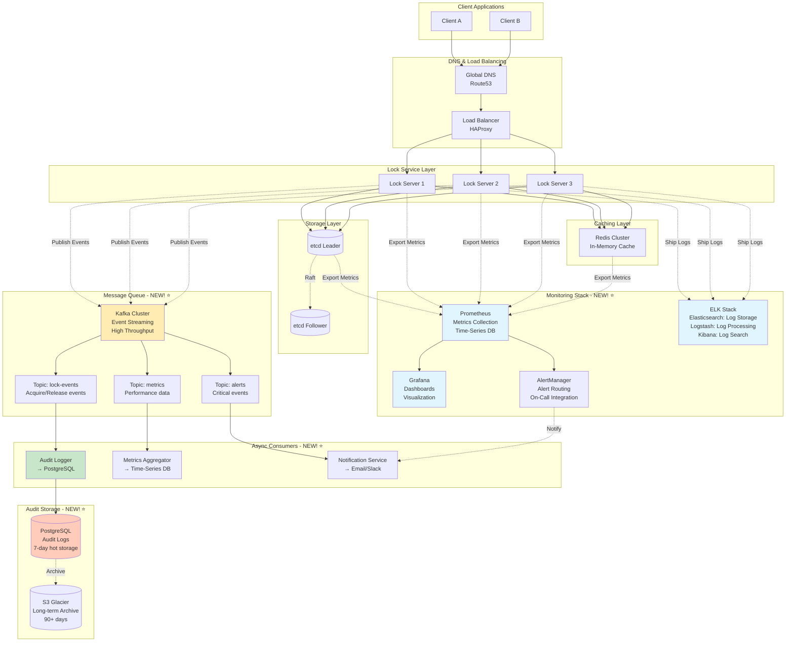

# Step 4: Monitoring & Message Queue - Distributed Locking Service

## Why Monitoring & Async Processing?

### Problems Without Monitoring

**Current Situation (Steps 1-3):**
```
❌ Can't see if service is slow or fast
❌ Don't know when etcd is overloaded
❌ Can't detect region failures proactively
❌ No visibility into lock contention
❌ Can't diagnose why a client's lock request failed
```

**Real-world disaster scenario:**
```
Time 0: etcd disk is 90% full (nobody knows!)
Time 1: etcd performance degrades (nobody notices)
Time 2: etcd crashes (NOW we know, but too late!)
Time 3: Lock service goes down (users impacted)
Time 4: Scramble to fix, takes 2 hours

Result: 2 hours downtime, violates 99.99% SLA ❌
```

**With Monitoring:**
```
Time 0: etcd disk is 80% full → Alert sent to team
Time 1: Engineer adds more disk space (15 minutes, no impact)

Result: 0 downtime, SLA maintained ✅
```

### Why Message Queue?

**Async Operations Needed:**
1. **Audit Logging:** Record every lock operation (don't slow down lock acquisition)
2. **Metrics Collection:** Send metrics to data warehouse (async)
3. **Notifications:** Alert when lock held too long (background task)
4. **Analytics:** Track lock usage patterns (batch processing)

**Beginner Analogy:**
- **Synchronous (no queue):** You order food → Wait at counter until it's ready → Get food (slow!)
- **Asynchronous (with queue):** You order → Get receipt → Sit down → Food delivered when ready (fast!)

---

## Architecture Diagram - Step 4 (With Monitoring & Message Queue)



---

## Component 1: Message Queue (Kafka)

### What is Kafka?

**Apache Kafka** is a distributed event streaming platform. Think of it as a super-fast, durable message highway.

**Real-world analogy:**
- **Traditional queue (RabbitMQ):** Postal service (one package, one delivery)
- **Kafka:** Highway system (millions of cars flowing continuously)

**Why Kafka over RabbitMQ/SQS?**

| Feature | Kafka | RabbitMQ | AWS SQS |
|---------|-------|----------|---------|
| **Throughput** | Millions/sec ✅ | Thousands/sec | Thousands/sec |
| **Durability** | Persisted to disk ✅ | In-memory (optional persist) | Durable ✅ |
| **Replay** | Can replay old messages ✅ | Once consumed, gone | Once consumed, gone |
| **Order** | Guaranteed per partition ✅ | Guaranteed per queue | Not guaranteed |
| **Use Case** | Event streaming, analytics | Task queues, jobs | Simple queues |

**Our choice: Kafka** because:
- High throughput (66k ops/sec = 66k events/sec)
- Need replay for audit compliance
- Multiple consumers (audit logger + metrics + analytics)

### Kafka Topics

**Topic 1: lock-events** (High Priority)
```
Purpose: Record every lock operation
Partition: By resourceId (ensures order per resource)
Retention: 7 days
Throughput: 66,667 events/sec

Event Schema:
{
  "eventType": "LOCK_ACQUIRED",
  "resourceId": "order:12345",
  "lockId": "550e8400-e29b-41d4-a716-446655440000",
  "ownerId": "client-A-uuid",
  "timestamp": 1738012345123,
  "ttl": 30,
  "region": "us-east-1",
  "clientIp": "192.168.1.100"
}

Consumers:
- Audit Logger (writes to PostgreSQL)
- Analytics Engine (calculates lock usage patterns)
- Compliance Monitor (checks for violations)
```

**Topic 2: metrics** (Medium Priority)
```
Purpose: Application performance metrics
Partition: By metric name
Retention: 24 hours
Throughput: 10,000 events/sec

Event Schema:
{
  "metricName": "lock_acquisition_latency_ms",
  "value": 12.5,
  "timestamp": 1738012345123,
  "tags": {
    "region": "us-east-1",
    "server": "lock-server-1",
    "resourceType": "order"
  }
}

Consumers:
- Metrics Aggregator (rolls up to time-series DB)
- Real-time Dashboard (live metrics)
```

**Topic 3: alerts** (High Priority)
```
Purpose: Critical system alerts
Partition: By severity
Retention: 30 days
Throughput: 10 events/sec (low volume, only critical)

Event Schema:
{
  "alertType": "ETCD_DISK_FULL",
  "severity": "CRITICAL",
  "message": "etcd-1A disk usage: 92%",
  "timestamp": 1738012345123,
  "region": "us-east-1",
  "metadata": {
    "currentUsage": 92,
    "threshold": 80
  }
}

Consumers:
- Notification Service (sends to PagerDuty, Slack)
- Incident Manager (creates incident ticket)
```

### Kafka Cluster Setup

```
Kafka Cluster: 6 brokers (2 per region)

Replication Factor: 3 (data stored on 3 brokers)
Min In-Sync Replicas: 2 (write requires 2 ACKs)

Why 6 brokers?
- Throughput: 66k events/sec
- Single broker capacity: 20k events/sec
- Needed: 66k / 20k = 3.3 → 4 brokers minimum
- Add 50% redundancy: 4 × 1.5 = 6 brokers ✅
```

**Kafka Configuration:**
```yaml
# server.properties
broker.id=1
listeners=PLAINTEXT://kafka-1:9092
log.dirs=/var/lib/kafka/data
num.partitions=12  # 12 partitions per topic for parallelism
default.replication.factor=3
min.insync.replicas=2
log.retention.hours=168  # 7 days
```

---

## Component 2: Monitoring Stack (Prometheus + Grafana)

### Prometheus (Metrics Collection)

**What is Prometheus?**
Time-series database that scrapes metrics from applications.

**Key Concepts:**
- **Metric:** A measurement (e.g., "lock_acquisition_latency")
- **Label:** Dimension (e.g., region=us-east, server=lock-1)
- **Scrape:** Prometheus pulls metrics from /metrics endpoint every 15 seconds

**Metrics We Track:**

#### 1. Business Metrics (Lock Operations)
```
# Lock acquisition rate
lock_acquisitions_total{region="us-east", status="success"}

# Lock acquisition latency histogram
lock_acquisition_latency_seconds{region="us-east", quantile="0.5"}  # P50
lock_acquisition_latency_seconds{region="us-east", quantile="0.95"} # P95

# Active locks gauge
active_locks_count{region="us-east"}

# Lock contention (failed acquisitions due to lock held)
lock_contentions_total{resource_type="order"}
```

#### 2. System Metrics (Infrastructure)
```
# CPU usage
process_cpu_seconds_total{instance="lock-server-1"}

# Memory usage
process_resident_memory_bytes{instance="lock-server-1"}

# etcd performance
etcd_disk_backend_commit_duration_seconds{quantile="0.95"}
etcd_network_peer_sent_bytes_total{remote_id="etcd-2"}
```

#### 3. Error Metrics
```
# Error rate
lock_errors_total{type="rate_limit_exceeded", region="us-east"}
lock_errors_total{type="etcd_timeout", region="us-east"}

# Error rate as percentage
(lock_errors_total / lock_requests_total) * 100
```

**Prometheus Configuration:**
```yaml
# prometheus.yml
global:
  scrape_interval: 15s  # Scrape every 15 seconds
  evaluation_interval: 15s  # Evaluate rules every 15 seconds

scrape_configs:
  # Scrape lock servers
  - job_name: 'lock-service'
    static_configs:
      - targets:
          - 'lock-server-1:8080'
          - 'lock-server-2:8080'
          - 'lock-server-3:8080'
    metrics_path: '/metrics'

  # Scrape etcd
  - job_name: 'etcd'
    static_configs:
      - targets:
          - 'etcd-1:2379'
          - 'etcd-2:2379'
          - 'etcd-3:2379'
```

### Grafana (Visualization)

**What is Grafana?**
Dashboard and visualization tool. Think of it as a TV screen showing all your system's vital signs.

**Dashboard 1: Lock Service Overview**
```
Panels:
1. Lock Acquisition Rate (graph, last 1 hour)
   - Query: rate(lock_acquisitions_total[5m])
   - Alert: < 50,000 ops/sec (below target)

2. Lock Latency (graph, P50/P95/P99)
   - Query: histogram_quantile(0.95, lock_acquisition_latency_seconds)
   - Alert: P95 > 50ms (violates SLA)

3. Active Locks (gauge)
   - Query: active_locks_count
   - Alert: > 15 million (approaching capacity)

4. Error Rate (graph, percentage)
   - Query: (rate(lock_errors_total[5m]) / rate(lock_requests_total[5m])) * 100
   - Alert: > 0.1% (violates SLA)

5. Regional Health (status map)
   - US-East: 🟢 Healthy (latency 8ms, 99.99% success)
   - US-West: 🟢 Healthy (latency 7ms, 99.98% success)
   - EU-West: 🟡 Degraded (latency 25ms, 99.5% success)
```

**Dashboard 2: Infrastructure Health**
```
Panels:
1. etcd Disk Usage (gauge per node)
   - etcd-1A: 68% (healthy)
   - etcd-1B: 72% (healthy)
   - Alert: > 80%

2. Redis Memory Usage (gauge)
   - Redis-1: 3.2 GB / 4 GB (80% used)
   - Alert: > 90%

3. CPU Usage (heatmap, all servers)
   - Shows which servers are overloaded

4. Network Throughput (graph)
   - Inbound: 340 Mbps
   - Outbound: 410 Mbps
```

**Dashboard 3: Business Metrics**
```
Panels:
1. Top 10 Most Locked Resources
   - order:12345: 1,250 lock attempts/min
   - user:99999: 890 attempts/min

2. Average Lock Hold Time
   - Overall: 28 seconds
   - By resource type:
     - Orders: 32 seconds
     - Users: 15 seconds

3. Lock Contention Heatmap
   - Shows which resources have high contention (many failed acquisitions)
```

---

## Component 3: Alerting (AlertManager)

### Alert Rules

**Critical Alerts (Page on-call engineer immediately)**
```yaml
# alerts.yml
groups:
  - name: critical_alerts
    interval: 30s
    rules:
      # Alert: High error rate
      - alert: HighErrorRate
        expr: (rate(lock_errors_total[5m]) / rate(lock_requests_total[5m])) * 100 > 1
        for: 2m
        labels:
          severity: critical
        annotations:
          summary: "Lock service error rate above 1%"
          description: "Error rate is {{ $value }}% in {{ $labels.region }}"

      # Alert: High latency
      - alert: HighLatency
        expr: histogram_quantile(0.95, lock_acquisition_latency_seconds) > 0.05
        for: 5m
        labels:
          severity: critical
        annotations:
          summary: "P95 latency above 50ms"
          description: "P95 latency is {{ $value }}ms in {{ $labels.region }}"

      # Alert: etcd down
      - alert: EtcdDown
        expr: up{job="etcd"} == 0
        for: 1m
        labels:
          severity: critical
        annotations:
          summary: "etcd node down"
          description: "etcd node {{ $labels.instance }} is unreachable"

      # Alert: Region unreachable
      - alert: RegionDown
        expr: rate(lock_acquisitions_total[2m]) == 0
        for: 2m
        labels:
          severity: critical
        annotations:
          summary: "Region appears to be down"
          description: "No lock acquisitions in {{ $labels.region }} for 2 minutes"
```

**Warning Alerts (Notify team, no page)**
```yaml
      # Alert: Disk filling up
      - alert: EtcdDiskHighUsage
        expr: (node_filesystem_avail_bytes{mountpoint="/var/lib/etcd"} / node_filesystem_size_bytes) < 0.2
        for: 10m
        labels:
          severity: warning
        annotations:
          summary: "etcd disk usage above 80%"
          description: "etcd node {{ $labels.instance }} disk is {{ $value }}% full"

      # Alert: Memory pressure
      - alert: RedisMemoryHigh
        expr: redis_memory_used_bytes / redis_memory_max_bytes > 0.85
        for: 5m
        labels:
          severity: warning
        annotations:
          summary: "Redis memory usage above 85%"

      # Alert: Lock contention
      - alert: HighLockContention
        expr: rate(lock_contentions_total[10m]) > 1000
        for: 10m
        labels:
          severity: warning
        annotations:
          summary: "High lock contention detected"
          description: "{{ $value }} lock contentions per second on {{ $labels.resource_type }}"
```

### Alert Routing

```yaml
# alertmanager.yml
route:
  receiver: 'default'
  group_by: ['alertname', 'region']
  group_wait: 30s
  group_interval: 5m
  repeat_interval: 4h

  routes:
    # Critical alerts → Page engineer
    - match:
        severity: critical
      receiver: pagerduty
      continue: true  # Also send to Slack

    # Critical alerts → Also send to Slack
    - match:
        severity: critical
      receiver: slack-critical

    # Warning alerts → Slack only
    - match:
        severity: warning
      receiver: slack-warnings

receivers:
  - name: 'pagerduty'
    pagerduty_configs:
      - service_key: '<pagerduty_integration_key>'
        description: '{{ .GroupLabels.alertname }}: {{ .Annotations.summary }}'

  - name: 'slack-critical'
    slack_configs:
      - api_url: '<slack_webhook_url>'
        channel: '#alerts-critical'
        title: '🔥 CRITICAL: {{ .GroupLabels.alertname }}'
        text: '{{ .Annotations.description }}'

  - name: 'slack-warnings'
    slack_configs:
      - api_url: '<slack_webhook_url>'
        channel: '#alerts-warnings'
        title: '⚠️ WARNING: {{ .GroupLabels.alertname }}'
```

---

## Component 4: Logging (ELK Stack)

### Elasticsearch (Log Storage)

**What to log:**
```json
{
  "timestamp": "2025-01-17T12:34:56.789Z",
  "level": "INFO",
  "server": "lock-server-1",
  "region": "us-east-1",
  "traceId": "a1b2c3d4-e5f6-7890",
  "operation": "ACQUIRE_LOCK",
  "resourceId": "order:12345",
  "clientId": "client-A-uuid",
  "latencyMs": 12.5,
  "result": "SUCCESS",
  "lockToken": "sha256:abc123..."
}
```

**Log Levels:**
- **DEBUG:** Detailed (disabled in production)
- **INFO:** Normal operations (lock acquired, released)
- **WARN:** Abnormal but handled (cache miss, retry)
- **ERROR:** Errors (etcd timeout, invalid request)
- **FATAL:** System crash (never should happen!)

### Logstash (Log Processing)

**Pipeline:**
```
Lock Server → Logstash → Elasticsearch → Kibana

Logstash transformations:
1. Parse JSON logs
2. Enrich with geolocation (from clientIp)
3. Add calculated fields (e.g., "slowRequest" if latency > 50ms)
4. Filter out debug logs
5. Index to Elasticsearch
```

### Kibana (Log Search)

**Use Cases:**

**1. Debugging Failed Lock**
```
Query: operation:ACQUIRE_LOCK AND result:FAILURE AND resourceId:"order:12345"
Time range: Last 15 minutes
Result: Shows all failed attempts for this order
- Client B tried at 12:34:55 → Failed (lock held by Client A)
- Client C tried at 12:34:57 → Failed (lock held by Client A)
```

**2. Slow Requests**
```
Query: latencyMs > 50 AND region:eu-west
Result: Shows all requests slower than 50ms in EU
- Identifies: etcd-3A had disk I/O spike at 12:35:00
```

**3. Audit Trail**
```
Query: resourceId:"user:sensitive-account" AND (operation:ACQUIRE_LOCK OR operation:RELEASE_LOCK)
Time range: Last 7 days
Result: Complete history of who accessed this user's lock
```

---

## Component 5: Audit Logging (PostgreSQL)

### Schema Design

```sql
CREATE TABLE lock_audit (
    id BIGSERIAL PRIMARY KEY,
    event_type VARCHAR(20) NOT NULL,  -- ACQUIRED, RELEASED, EXPIRED, RENEWED
    resource_id VARCHAR(255) NOT NULL,
    lock_id UUID NOT NULL,
    owner_id VARCHAR(255) NOT NULL,
    timestamp TIMESTAMP NOT NULL,
    ttl_seconds INT NOT NULL,
    region VARCHAR(50) NOT NULL,
    client_ip INET NOT NULL,
    metadata JSONB,  -- Flexible JSON for additional data

    -- Indexes for fast queries
    INDEX idx_resource_id (resource_id),
    INDEX idx_owner_id (owner_id),
    INDEX idx_timestamp (timestamp DESC),
    INDEX idx_lock_id (lock_id)
) PARTITION BY RANGE (timestamp);

-- Partition by day (for efficient querying and archiving)
CREATE TABLE lock_audit_2025_01_17 PARTITION OF lock_audit
    FOR VALUES FROM ('2025-01-17 00:00:00') TO ('2025-01-18 00:00:00');
```

### Data Lifecycle

```
1. Hot data (0-7 days): PostgreSQL SSD
   - Fast queries for recent audit logs
   - Size: 1.73 TB/day × 7 = 12 TB

2. Warm data (7-90 days): PostgreSQL HDD
   - Slower queries, compliance use cases
   - Size: 1.73 TB/day × 83 = 144 TB

3. Cold data (90+ days): S3 Glacier
   - Export from PostgreSQL to Parquet files
   - Upload to S3 with lifecycle policy
   - Size: Growing at 52 TB/month
   - Cost: $0.004/GB/month (very cheap!)

Automation:
- Daily cron job: Drop partitions older than 7 days, archive to S3
```

---

## Performance Impact of Monitoring

### Overhead Analysis

**Without Async (Bad Approach):**
```
Lock acquisition flow:
1. Validate request (1ms)
2. Acquire lock in etcd (10ms)
3. ❌ Write audit log to PostgreSQL synchronously (20ms) ← BLOCKS!
4. Return response (1ms)
Total: 32ms ❌ (violates P50 < 10ms SLA)
```

**With Async (Good Approach):**
```
Lock acquisition flow:
1. Validate request (1ms)
2. Acquire lock in etcd (10ms)
3. ✅ Publish event to Kafka (1ms, async fire-and-forget)
4. Return response (1ms)
Total: 13ms ✅ (within SLA)

Background (doesn't block):
- Kafka consumer reads event (async)
- Writes to PostgreSQL (20ms, but client already got response!)
```

**Metrics Export Overhead:**
```
Prometheus scrape:
- Happens every 15 seconds (not per request)
- Lock server maintains metrics in memory
- Prometheus pulls from /metrics endpoint
- Overhead: ~1-2% CPU (negligible)
```

---

## Summary

### What We Added in Step 4
✅ Kafka message queue (6 brokers, 3 topics)
✅ Prometheus metrics collection (15s scrape interval)
✅ Grafana dashboards (3 dashboards, 20+ panels)
✅ AlertManager with PagerDuty/Slack integration
✅ ELK stack for log search and debugging
✅ PostgreSQL audit logs with 7-day hot storage
✅ S3 Glacier for long-term compliance (90+ days)

### Observability Improvements
✅ Real-time metrics (15-second granularity)
✅ Proactive alerting (detect issues before users)
✅ Audit trail (complete history of lock operations)
✅ Debugging capability (trace individual requests)
✅ Business insights (top locked resources, contention patterns)

### Performance Impact
✅ Lock latency: 13ms P50 (only +1ms overhead from Kafka publish)
✅ Async processing: Audit logging doesn't block clients
✅ Minimal CPU overhead: 1-2% for metrics export

---

**Next Document:** [Step 5 - Final Architecture](07_step5_final_architecture.md)

We'll consolidate everything into the final, production-ready architecture!
