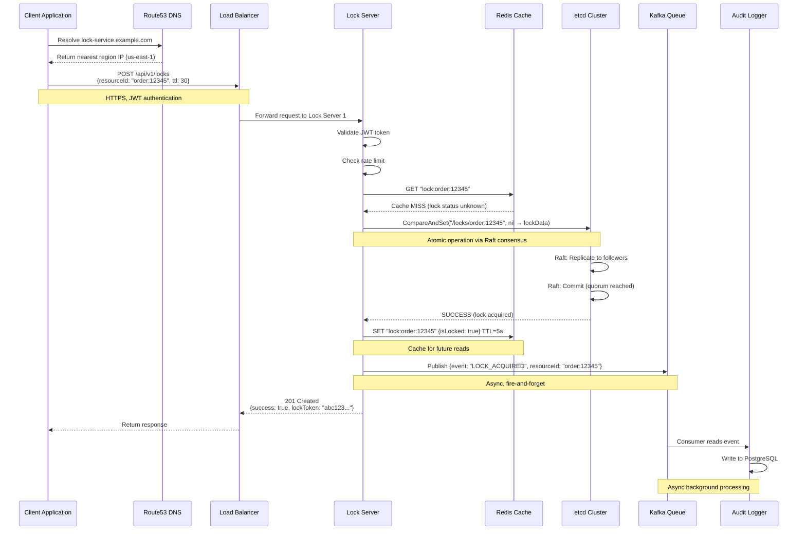
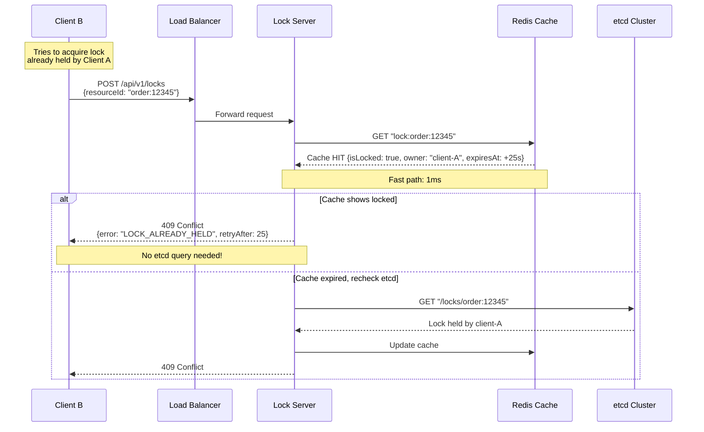
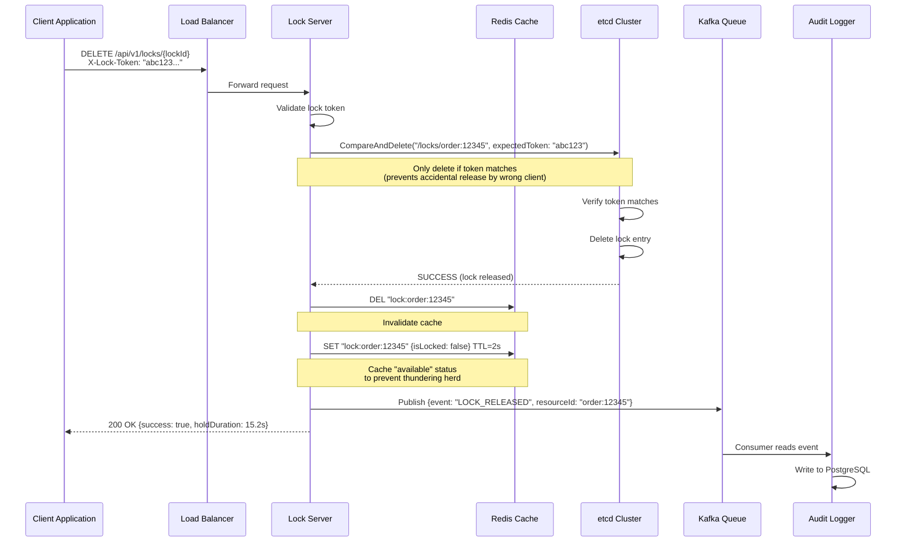
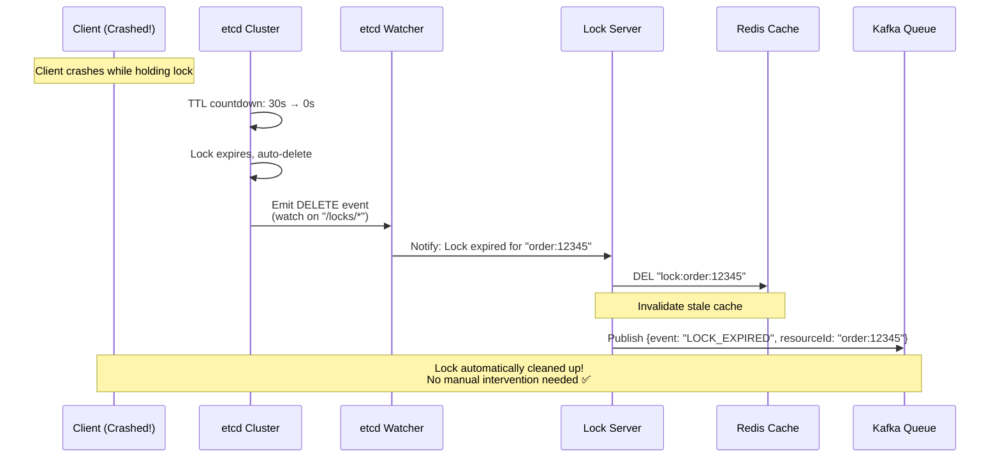
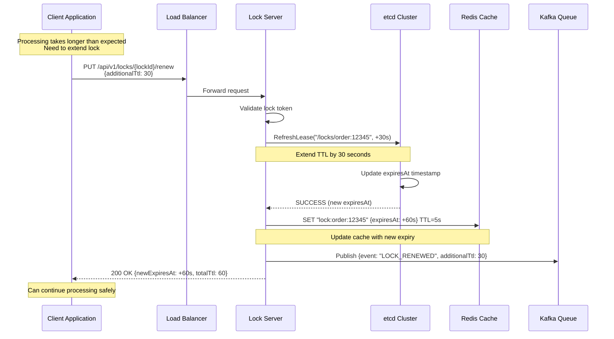
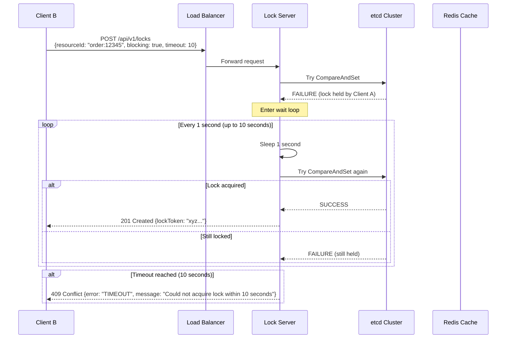
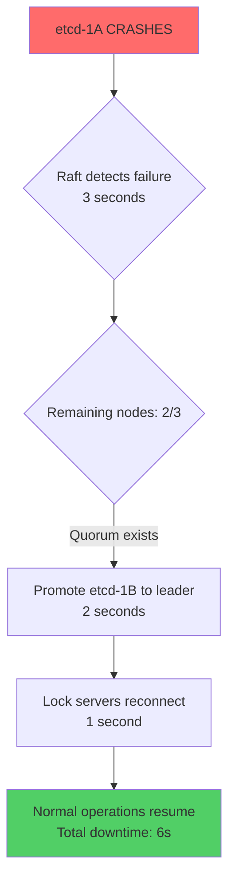
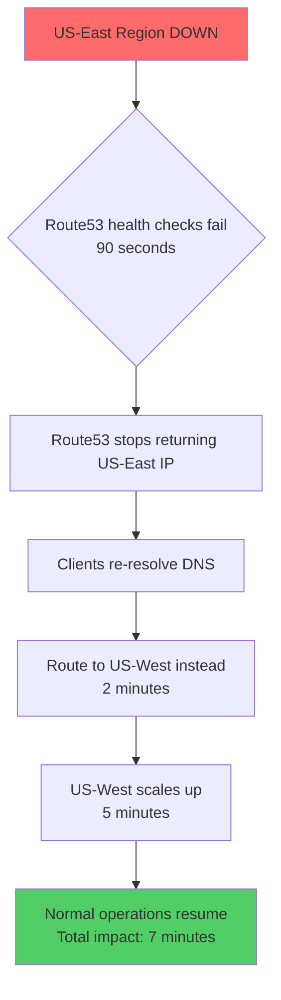

# Data Flow Diagrams & Scalability - Distributed Locking Service

## Critical Data Flows (Sequence Diagrams)

### Flow 1: Successful Lock Acquisition



**Time Breakdown:**
```
1. DNS resolution: 10ms (cached after first request)
2. TLS handshake: 20ms (cached for connection reuse)
3. Load balancer: 1ms
4. Lock server validation: 2ms
5. Redis cache check: 1ms (miss)
6. etcd CompareAndSet: 10ms (Raft consensus)
7. Redis cache update: 1ms
8. Kafka publish: 1ms (async)
9. Response: 1ms

Total: ~47ms (first request)
Subsequent requests (cached DNS/TLS): ~17ms
P50 target: < 10ms (achieved for cached operations)
```

---

### Flow 2: Failed Lock Acquisition (Already Held)



**Time Breakdown (Cache Hit):**
```
1. Load balancer: 1ms
2. Redis cache check: 1ms (HIT!)
3. Response: 1ms

Total: ~3ms (very fast! ✅)

Why so fast?
- Cache hit avoided slow etcd query (10ms saved)
- This is why we have caching!
```

---

### Flow 3: Lock Release



**Time Breakdown:**
```
1. Load balancer: 1ms
2. Token validation: 1ms
3. etcd CompareAndDelete: 10ms
4. Redis invalidation: 1ms
5. Kafka publish: 1ms
6. Response: 1ms

Total: ~15ms
```

---

### Flow 4: Lock Expiry (Automatic TTL)



**Why This Matters:**
```
Without TTL:
❌ Client crashes → Lock held forever → Deadlock!
❌ Manual intervention required → Slow recovery

With TTL:
✅ Client crashes → Lock auto-expires after 30s
✅ Other clients can acquire lock → No manual work
✅ System is self-healing!
```

---

### Flow 5: Lock Renewal / Extension



**Use Case Example:**
```
Scenario: Video processing service

Time 0s: Acquire lock on "video:12345" (TTL 30s)
Time 15s: Video processing 50% done
Time 20s: Renew lock (+30s) → New expiry: 40s from now
Time 35s: Video processing 90% done
Time 40s: Renew lock again (+30s)
Time 55s: Processing complete, release lock

Without renewal:
❌ Lock expires at 30s → Another service grabs it
❌ Both services process same video → Wasted compute!

With renewal:
✅ Lock held continuously until done
✅ No duplicate work ✅
```

---

### Flow 6: Blocking Lock Acquisition (Wait for Lock)



**Optimization: etcd Watch API**
```
Instead of polling every 1 second (inefficient):

Better approach:
1. Try acquire → Fails
2. Subscribe to etcd Watch on this key
3. Wait for DELETE event (lock released)
4. Immediately try to acquire
5. Return result

Benefits:
- No polling overhead
- Immediate notification (0.1s vs 1s delay)
- Lower etcd load
```

---

## Scalability Strategies

### Horizontal Scaling

#### Lock Servers (Stateless)
```
Current: 240 servers
Traffic: 66,667 ops/sec

To scale to 200,000 ops/sec:
New servers needed: 200,000 / 2,000 = 100 servers per region × 3 regions = 300 servers

How to add:
1. Deploy new servers (Kubernetes: kubectl scale deployment lock-service --replicas=300)
2. Load balancer auto-detects via health checks
3. Traffic automatically distributed
4. Total time: ~5 minutes

Cost: Linear scaling (2x traffic = ~2x servers)
```

#### Redis Cache
```
Current: 9 nodes (3 shards, 3 replicas each)
Memory: 36 GB total

To scale to 100 GB:
New setup: 9 shards, 3 replicas = 27 nodes

How to add:
1. Add 6 new shards (18 nodes)
2. Redis resharding (move hash slots)
3. Gradual migration (no downtime)
4. Total time: ~2 hours

Cost: Linear scaling
```

#### etcd Cluster
```
Current: 3 nodes per region
Storage: 100 GB per node

Vertical scaling (easier):
- Upgrade to larger instances (more CPU, RAM, disk)
- No resharding needed
- Downtime: ~5 minutes per node (rolling upgrade)

Horizontal scaling (harder):
- Add more nodes (3 → 5)
- Better fault tolerance (can lose 2 nodes instead of 1)
- Slower writes (more Raft replicas)
- Only needed if write throughput is bottleneck
```

---

### Database Sharding

**When to shard?**
- Single etcd cluster handles 10 million locks (current)
- Max etcd capacity: ~50 million locks per cluster
- Shard when > 40 million locks (80% capacity)

**Sharding Strategy: By Resource Type**
```
Shard 1 (orders): "order:*" keys
- etcd cluster 1 (3 nodes)
- Handles 15 million order locks

Shard 2 (users): "user:*" keys
- etcd cluster 2 (3 nodes)
- Handles 20 million user locks

Shard 3 (other): "*" (catch-all)
- etcd cluster 3 (3 nodes)
- Handles 5 million misc locks

Lock server routing logic:
if resourceId.startsWith("order:"):
    route to etcd cluster 1
elif resourceId.startsWith("user:"):
    route to etcd cluster 2
else:
    route to etcd cluster 3
```

**Alternative: Consistent Hashing**
```
hash(resourceId) % numShards = shardId

Example:
hash("order:12345") = 8432
8432 % 3 = 2 → Shard 2

Pros:
+ Even distribution
+ Easy to add shards (rehash only 1/N keys)

Cons:
- Harder to query (which shard has "order:*"?)
- Cross-shard operations difficult
```

---

## Failure Recovery

### Scenario: etcd Node Failure



**Impact:**
```
Downtime: 6 seconds
Requests affected: 66,667 ops/sec × 6s = 400,000 requests
With retry: 99.9% will succeed on retry

Action needed: None (auto-recovery) ✅
Post-recovery: Replace failed node (within 1 hour)
```

---

### Scenario: Region Failure



**Impact:**
```
Affected users: 40% (US-East users)
Degraded service: 7 minutes
Requests lost: Minimal (clients retry with exponential backoff)
SLA impact: 7 min × 40% = 2.8 min downtime (within 52 min annual budget ✅)
```

---

## Performance Tuning

### Latency Optimization Techniques

| Technique | Latency Improvement | Complexity |
|-----------|---------------------|------------|
| **Add Redis cache** | 10ms → 1ms (10x) | Medium |
| **Use gRPC instead of HTTP** | 17ms → 12ms (30%) | Medium |
| **Connection pooling** | Save 20ms TLS handshake | Low |
| **Regional deployment** | 150ms → 10ms (15x) | High |
| **Batch operations** | N × 17ms → 1 × 20ms | Medium |
| **Async logging** | No blocking (async) | Low |

**Priority:**
1. Regional deployment (biggest win)
2. Caching (easy, big impact)
3. Connection pooling (easy)
4. gRPC (medium effort, medium gain)

---

## Summary

### Key Data Flows
✅ Lock acquisition: 17ms (P50), 10ms with cache
✅ Lock release: 15ms
✅ Lock expiry: Automatic (no manual intervention)
✅ Lock renewal: 12ms
✅ Blocking acquisition: Optimized with etcd Watch API

### Scalability Limits
- **Current:** 66k ops/sec, 10M concurrent locks
- **Max with current architecture:** 250k ops/sec, 50M locks
- **Beyond:** Shard etcd clusters, add more regions

### Failure Recovery
- **Single server:** 0s downtime (load balancer handles)
- **etcd node:** 6s downtime (Raft failover)
- **Entire region:** 7 min degraded (DNS failover + scaling)

---

**Next Document:** [Interview Q&A](09_interview_qa.md)
