# Load Balancers - Complete Guide

> **What You'll Learn**: What load balancers are, why they're critical, different types, popular options, and when to use each!

---

## Table of Contents
1. [What is a Load Balancer?](#what-is-a-load-balancer)
2. [Why Do We Need It?](#why-do-we-need-it)
3. [How Does It Work?](#how-does-it-work)
4. [Load Balancing Algorithms](#load-balancing-algorithms)
5. [Types of Load Balancers](#types-of-load-balancers)
6. [Popular Load Balancers Comparison](#popular-load-balancers-comparison)
7. [Layer 4 vs Layer 7](#layer-4-vs-layer-7)
8. [Real-World Examples](#real-world-examples)
9. [Interview Questions](#interview-questions)

---

## What is a Load Balancer?

### Simple Definition
A load balancer distributes incoming requests across multiple servers to prevent any single server from being overwhelmed.

### Real-World Analogy
**Restaurant Host**: Imagine a busy restaurant with 5 waiters. The host (load balancer) at the entrance distributes customers (requests) evenly across all waiters (servers). If one waiter is busy, the host directs new customers to available waiters.

```
Without Load Balancer:
Customer → Server 1 (overloaded! 💥)
Customer → Server 1 (overloaded! 💥)
Customer → Server 1 (crash!)
Server 2, 3, 4, 5 are idle 😴

With Load Balancer:
Customer → Load Balancer → Server 1 ✅
Customer → Load Balancer → Server 2 ✅
Customer → Load Balancer → Server 3 ✅
Customer → Load Balancer → Server 4 ✅
Customer → Load Balancer → Server 5 ✅
All servers evenly used!
```

---

## Why Do We Need It?

### 1. **Prevent Overload**
Single server can handle ~1,000 requests/sec. With 10,000 requests/sec, you need 10 servers + load balancer.

### 2. **High Availability**
If one server crashes, load balancer routes traffic to healthy servers.

```
Before (No LB):
Server crashes → Entire website down! ❌

After (With LB):
Server 1 crashes → LB routes to Server 2, 3, 4, 5 ✅
Website still works! (80% capacity)
```

### 3. **Scalability**
Easy to add more servers during traffic spikes.

```
Normal: 5 servers
Black Friday: Add 20 more servers (total: 25)
After Black Friday: Remove 20 servers
```

### 4. **Geographic Distribution**
Route users to nearest server for faster response.

```
User in USA → US server (50ms)
User in Europe → EU server (50ms)
vs
User in Europe → US server (150ms)
```

---

## How Does It Work?

### Architecture Diagram

```mermaid
graph TB
    subgraph "Clients"
        User1[👤 User 1]
        User2[👤 User 2]
        User3[👤 User 3]
        User4[👤 User 4]
    end

    LB[⚖️ Load Balancer<br/><br/>Health Checks ❤️<br/>Traffic Distribution<br/>SSL Termination]

    subgraph "Backend Servers"
        Server1[🖥️ Server 1<br/>Status: Healthy ✅]
        Server2[🖥️ Server 2<br/>Status: Healthy ✅]
        Server3[🖥️ Server 3<br/>Status: DOWN ❌]
        Server4[🖥️ Server 4<br/>Status: Healthy ✅]
    end

    User1 --> LB
    User2 --> LB
    User3 --> LB
    User4 --> LB

    LB -->|Request 1| Server1
    LB -->|Request 2| Server2
    LB -.No traffic.-> Server3
    LB -->|Request 3| Server4

    style Server3 fill:#ffccbc,stroke:#f44336,stroke-width:3px
    style LB fill:#fff3e0,stroke:#ff9800,stroke-width:3px
```



### Step-by-Step Flow
1. **User sends request** to www.example.com
2. **DNS resolves** to load balancer IP address
3. **Load balancer receives** request
4. **Health check**: Is Server 1 healthy? Yes ✅
5. **Algorithm decides**: Send to Server 1 (least connections)
6. **Forward request** to Server 1
7. **Server processes** request, returns response
8. **Load balancer forwards** response back to user

---

## Load Balancing Algorithms

### 1. Round Robin (Simple)

**How it works**: Distribute requests sequentially in rotation.

```
Request 1 → Server A
Request 2 → Server B
Request 3 → Server C
Request 4 → Server A (back to start)
Request 5 → Server B
...
```

**Pros**:
- ✅ Simple, easy to implement
- ✅ Fair distribution (equal load)

**Cons**:
- ❌ Doesn't consider server load
- ❌ Doesn't consider request complexity (some requests take longer)

**Use case**: All servers equal capacity, requests similar complexity.

---

### 2. Least Connections (Smart)

**How it works**: Send to server with fewest active connections.

```
Server A: 5 connections
Server B: 3 connections ← Send here!
Server C: 7 connections

Next request → Server B (it had fewest)
```

**Pros**:
- ✅ Adapts to actual load
- ✅ Handles varying request times

**Cons**:
- ❌ More complex
- ❌ Needs to track connection counts

**Use case**: Requests have varying processing times (good for Instagram - photo uploads take longer than profile views).

---

### 3. Weighted Round Robin

**How it works**: Give more requests to more powerful servers.

```
Server A (8 CPU cores): Weight = 3
Server B (4 CPU cores): Weight = 2
Server C (4 CPU cores): Weight = 1

Distribution: A, A, A, B, B, C (repeat)
```

**Use case**: Servers have different capacities.

---

### 4. IP Hash (Sticky Sessions)

**How it works**: Hash user's IP address, always send to same server.

```
User IP: 192.168.1.10
Hash: 192.168.1.10 % 3 = 1
Always send to Server B

Same user → Always Server B
```

**Pros**:
- ✅ Session persistence (user data stays on same server)
- ✅ Predictable

**Cons**:
- ❌ Uneven distribution if some IPs generate more traffic
- ❌ If server dies, all those users lose session

**Use case**: Applications that store session data on server (not recommended - use Redis instead!).

---

### 5. Least Response Time

**How it works**: Send to server with fastest response time.

```
Server A: 50ms average
Server B: 30ms average ← Send here!
Server C: 80ms average

Fastest server gets request
```

**Use case**: Optimizing for low latency.

---

## Types of Load Balancers

### Hardware Load Balancers

**What**: Physical devices (F5, Citrix NetScaler).

**Pros**:
- ✅ Very high performance (millions of req/sec)
- ✅ Dedicated hardware optimized for load balancing

**Cons**:
- ❌ Expensive ($10K-$100K+)
- ❌ Hard to scale (need to buy more hardware)
- ❌ Vendor lock-in

**Use case**: Enterprise data centers, banks.

---

### Software Load Balancers

**What**: Software running on regular servers (Nginx, HAProxy).

**Pros**:
- ✅ Cheap (free open-source options)
- ✅ Flexible (run anywhere - cloud, on-premise)
- ✅ Easy to scale (add more instances)

**Cons**:
- ❌ Manage yourself (updates, monitoring)
- ❌ Lower performance than hardware (but still very fast!)

**Use case**: Startups, most companies.

---

### Cloud Load Balancers

**What**: Managed service by cloud providers (AWS ALB, Google Cloud LB).

**Pros**:
- ✅ Fully managed (auto-updates, high availability)
- ✅ Auto-scaling (handles traffic spikes automatically)
- ✅ Integrated with cloud services

**Cons**:
- ❌ Vendor lock-in
- ❌ Ongoing costs (pay per hour + per GB)

**Use case**: Cloud-native applications, want managed service.

---

## Popular Load Balancers Comparison

| Feature | Nginx | HAProxy | AWS ALB | F5 (Hardware) |
|---------|-------|---------|---------|---------------|
| **Type** | Software | Software | Cloud/Managed | Hardware |
| **Cost** | Free | Free | ~$20/month + traffic | $10K-$100K |
| **Performance** | 50K req/sec | 100K req/sec | Unlimited (auto-scale) | 1M+ req/sec |
| **Layer** | Layer 4 & 7 | Layer 4 & 7 | Layer 7 | Layer 4 & 7 |
| **SSL Termination** | ✅ Yes | ✅ Yes | ✅ Yes | ✅ Yes |
| **Health Checks** | ✅ Yes | ✅ Yes | ✅ Yes | ✅ Yes |
| **Sticky Sessions** | ✅ Yes | ✅ Yes | ✅ Yes | ✅ Yes |
| **Management** | Manual | Manual | Managed | Manual |
| **Scaling** | Add instances | Add instances | Auto-scales | Buy more hardware |
| **Best For** | Versatile | High performance | Cloud apps | Enterprise |
| **Used By** | Netflix, Airbnb | GitHub, Reddit | AWS customers | Banks, Fortune 500 |

---

## Layer 4 vs Layer 7 Load Balancing

### Layer 4 (Transport Layer)

**What it sees**: IP address, port number (TCP/UDP).

**How it works**:
```
Request: TCP connection to 192.168.1.100:80
Load balancer: Route based on IP:port
Cannot see HTTP headers, URLs, cookies
```

**Pros**:
- ✅ Fast (minimal packet inspection)
- ✅ Simple
- ✅ Protocol-agnostic (works with any TCP/UDP traffic)

**Cons**:
- ❌ Cannot route based on URL (e.g., /api → API servers, /images → CDN)
- ❌ Cannot modify headers

**Use case**: Simple load balancing, high throughput needed.

---

### Layer 7 (Application Layer)

**What it sees**: Full HTTP request (URL, headers, cookies, body).

**How it works**:
```
Request: GET https://example.com/api/users
Load balancer: Inspect URL
Route /api/* → API servers
Route /static/* → Static file servers
Route /images/* → CDN
```

**Pros**:
- ✅ Smart routing (URL-based, header-based)
- ✅ Can modify requests/responses
- ✅ Can terminate SSL (decrypt HTTPS)
- ✅ Can cache responses

**Cons**:
- ❌ Slower (more processing)
- ❌ HTTP-specific (not for other protocols)

**Use case**: Microservices, URL-based routing, SSL termination.

---

### Comparison Diagram

```mermaid
graph TB
    Client[Client]

    subgraph "Layer 7 Load Balancer"
        L7[🔍 Inspects full HTTP request<br/><br/>Sees:<br/>- URL: /api/users<br/>- Headers: User-Agent, Auth<br/>- Cookies: session_id<br/>- Body: JSON data]
    end

    subgraph "Layer 4 Load Balancer"
        L4[⚡ Inspects TCP/IP packet<br/><br/>Sees:<br/>- Source IP: 192.168.1.10<br/>- Dest IP: 192.168.1.100<br/>- Port: 80<br/>- Protocol: TCP]
    end

    subgraph "Routing Decisions"
        L7Route[Layer 7 Routing:<br/>/api → API Server<br/>/images → CDN<br/>/blog → Blog Server]

        L4Route[Layer 4 Routing:<br/>Round robin to any server<br/>OR<br/>IP hash to sticky server]
    end

    Client --> L7
    Client --> L4

    L7 --> L7Route
    L4 --> L4Route

    style L7 fill:#e3f2fd
    style L4 fill:#fff3e0
```



---

## Real-World Examples

### Example 1: Nginx Configuration

```nginx
# /etc/nginx/nginx.conf

# Define backend servers
upstream backend_servers {
    # Least connections algorithm
    least_conn;

    # List of servers
    server 192.168.1.101:8080 weight=3;  # More powerful server
    server 192.168.1.102:8080 weight=2;
    server 192.168.1.103:8080 weight=1;

    # Health check
    check interval=3000 rise=2 fall=3 timeout=1000;
}

# Load balancer configuration
server {
    listen 80;
    server_name example.com;

    location / {
        # Forward to backend
        proxy_pass http://backend_servers;

        # Headers
        proxy_set_header Host $host;
        proxy_set_header X-Real-IP $remote_addr;
        proxy_set_header X-Forwarded-For $proxy_add_x_forwarded_for;
    }
}
```

---

### Example 2: AWS Application Load Balancer

```yaml
# AWS ALB configuration (simplified)

LoadBalancer:
  Type: Application  # Layer 7
  Scheme: internet-facing
  Subnets:
    - subnet-1 (us-east-1a)
    - subnet-2 (us-east-1b)

TargetGroups:
  APIServers:
    Targets:
      - server-1 (EC2 instance)
      - server-2 (EC2 instance)
      - server-3 (EC2 instance)
    HealthCheck:
      Path: /health
      Interval: 30s
      Timeout: 5s
      HealthyThreshold: 2
      UnhealthyThreshold: 3

Listeners:
  - Port: 80
    Protocol: HTTP
    DefaultAction: Forward to APIServers

  - Port: 443
    Protocol: HTTPS
    SSL Certificate: arn:aws:acm:...
    DefaultAction: Forward to APIServers

Rules:
  - Condition: Path = /api/*
    Action: Forward to APIServers

  - Condition: Path = /static/*
    Action: Forward to StaticServers
```

---

## Health Checks

### What are Health Checks?

Load balancer periodically pings servers to check if they're alive and healthy.

```
Every 30 seconds:
Load Balancer → Server 1: GET /health
Server 1 → Load Balancer: 200 OK ✅ (healthy)

Load Balancer → Server 2: GET /health
Server 2 → Load Balancer: (timeout) ❌ (unhealthy)

Action: Stop sending traffic to Server 2
```

### Health Check Configuration

```javascript
// Express.js health check endpoint
app.get('/health', (req, res) => {
  // Check if database is connected
  if (!db.isConnected()) {
    return res.status(503).json({ status: 'unhealthy', reason: 'database down' });
  }

  // Check if Redis is connected
  if (!redis.isConnected()) {
    return res.status(503).json({ status: 'unhealthy', reason: 'cache down' });
  }

  // All good!
  res.status(200).json({ status: 'healthy' });
});
```

### Health Check Parameters

```
Interval: 30 seconds (how often to check)
Timeout: 5 seconds (wait this long for response)
Healthy threshold: 2 (2 consecutive successes = healthy)
Unhealthy threshold: 3 (3 consecutive failures = unhealthy)

Example:
Check 1: Success ✅
Check 2: Success ✅ → Mark as healthy (threshold reached)
Traffic starts flowing

Check 3: Fail ❌
Check 4: Fail ❌
Check 5: Fail ❌ → Mark as unhealthy (threshold reached)
Traffic stops flowing
```

---

## When to Use Load Balancer?

### You NEED a load balancer if:
- ✅ You have multiple servers
- ✅ You need high availability (99.9%+ uptime)
- ✅ You have traffic spikes
- ✅ You want to deploy without downtime (rolling deployments)

### You DON'T need a load balancer if:
- ❌ You have one server (nothing to balance!)
- ❌ Very low traffic (< 100 users)
- ❌ Prototyping/development

---

## Interview Questions

### Q1: What is a load balancer?

**Answer**: A load balancer distributes incoming requests across multiple servers to prevent overload, improve availability, and enable horizontal scaling. It acts as a traffic cop, routing requests to healthy servers using algorithms like round robin or least connections.

---

### Q2: Layer 4 vs Layer 7 load balancing?

**Answer**:
- **Layer 4** (Transport): Routes based on IP address and port. Faster, simpler, but can't see HTTP content.
- **Layer 7** (Application): Routes based on HTTP content (URL, headers). Slower but more flexible (can route /api to API servers, /static to CDN).

Use Layer 4 for simple high-throughput scenarios, Layer 7 for microservices and URL-based routing.

---

### Q3: How does a load balancer detect a failed server?

**Answer**: Health checks. The load balancer periodically sends requests to a health endpoint (e.g., GET /health every 30 seconds). If a server fails to respond or returns an error status code for multiple consecutive checks (e.g., 3 failures), the load balancer marks it unhealthy and stops sending traffic to it. When the server recovers and passes health checks again, traffic resumes.

---

### Q4: What happens if the load balancer itself fails?

**Answer**: Have multiple load balancers (primary + standby) using:
1. **Active-Passive**: One LB active, one standby. If active fails, standby takes over (heartbeat monitoring).
2. **Active-Active**: Both LBs active, using DNS round-robin to distribute traffic between them.
3. **Cloud**: Use managed load balancers (AWS ALB, Google Cloud LB) which have built-in redundancy.

---

### Q5: Sticky sessions vs stateless servers?

**Answer**:
- **Sticky sessions**: User always goes to same server (IP hash). Simple but problematic (uneven load, session loss if server dies).
- **Stateless servers** (recommended): Store session in Redis/database. Any server can handle any user. Better for scaling and availability.

Use stateless architecture with centralized session storage.

---

## Summary

### Key Takeaways
1. **Load balancers distribute traffic** across multiple servers
2. **Improve availability** (if one server fails, others handle traffic)
3. **Enable horizontal scaling** (add more servers easily)
4. **Types**: Hardware (expensive, high-performance), Software (cheap, flexible), Cloud (managed)
5. **Algorithms**: Round robin (simple), Least connections (smart), IP hash (sticky)
6. **Layer 4** (fast, simple) vs **Layer 7** (smart routing, SSL termination)
7. **Health checks** detect and remove failed servers automatically
8. **Popular choices**: Nginx (versatile), HAProxy (high-performance), AWS ALB (managed)

### For Interviews
- Understand **when** to use load balancer (multiple servers, high availability)
- Know **trade-offs** (Layer 4 vs 7, different algorithms)
- Explain **health checks** (how to detect failures)
- Mention **real tools** (Nginx, HAProxy, AWS ALB)

### Next Steps
👉 Read next: [02_databases.md](./02_databases.md) - SQL vs NoSQL Deep Dive

