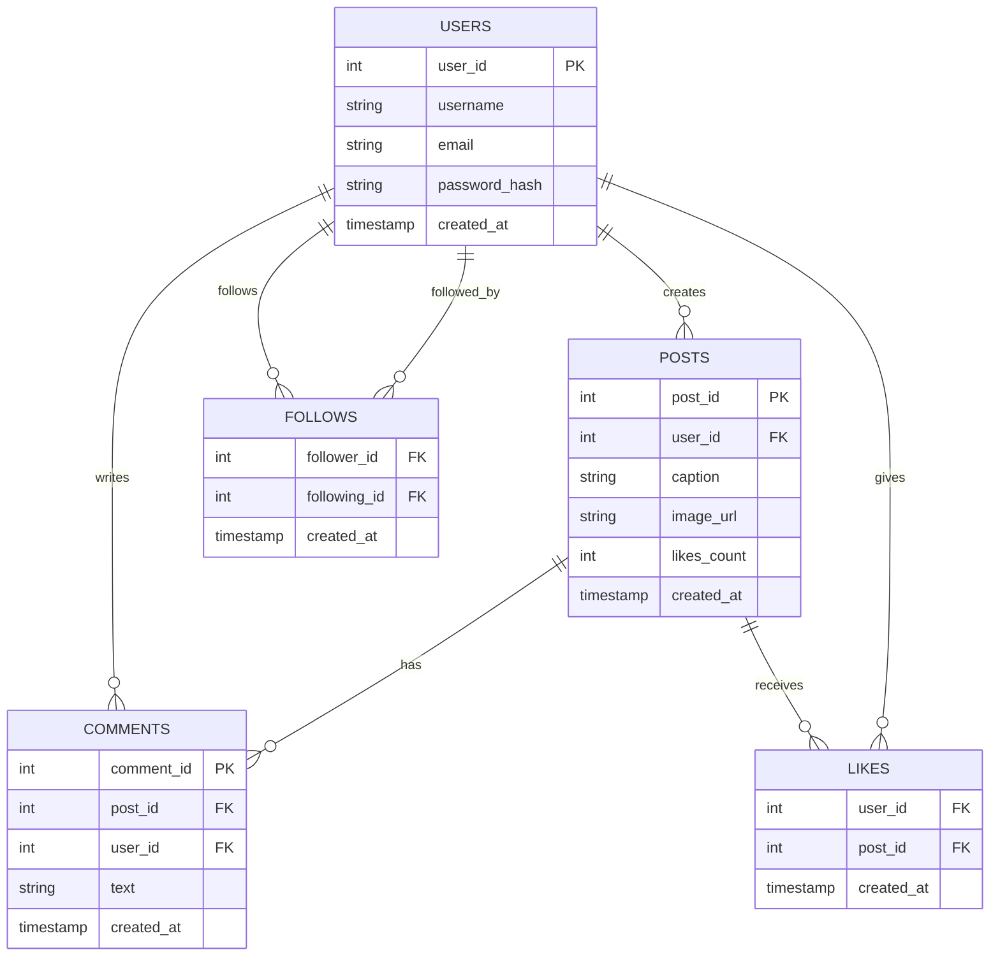
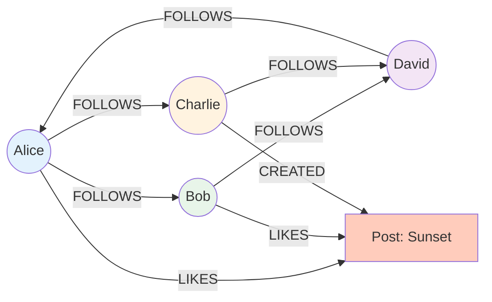
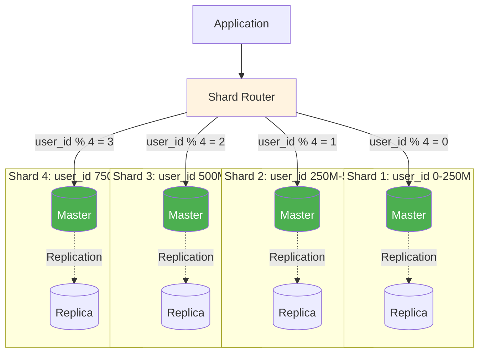

# Databases - Complete Guide

> **What You'll Learn**: SQL vs NoSQL, when to use each, popular databases, scaling strategies, with MULTIPLE diagrams!

---

## What is a Database?

**Simple Definition**: A database stores and retrieves data persistently (survives server restarts).

**Analogy**: Filing cabinet for digital data. You can store documents (data), organize them (schema), and search through them (queries).

---

## SQL vs NoSQL - Visual Comparison

```mermaid
graph TB
    subgraph "SQL Databases (Relational)"
        SQL[📊 SQL Database |  | Structure: Tables with rows/columns | Schema: Fixed, predefined | Relations: Foreign keys, JOINs | ACID: Strong guarantees]

        SQLEx[Examples: | - PostgreSQL | - MySQL | - Oracle | - SQL Server]
    end

    subgraph "NoSQL Databases (Non-relational)"
        NoSQL[📄 NoSQL Database |  | Structure: Documents/Key-Value/Graphs | Schema: Flexible, dynamic | Relations: Denormalized, embedded | Consistency: Eventual (usually)]

        NoSQLEx[Examples: | - MongoDB (Document) | - Cassandra (Wide-column) | - Redis (Key-value) | - Neo4j (Graph)]
    end

    SQL --> SQLEx
    NoSQL --> NoSQLEx

    style SQL fill:#e3f2fd
    style NoSQL fill:#fff3e0
```

---

## SQL Databases Deep Dive

### What is SQL?

**SQL** = Structured Query Language
- **Relational** database (data organized in tables with relationships)
- **Fixed schema** (must define structure before inserting data)
- **ACID** guarantees (Atomicity, Consistency, Isolation, Durability)

### SQL Database Structure



### Example SQL Query

```sql
-- Get user's feed (posts from people they follow)
SELECT
    posts.post_id,
    posts.caption,
    users.username,
    users.profile_pic,
    posts.likes_count
FROM posts
JOIN users ON posts.user_id = users.user_id
JOIN follows ON posts.user_id = follows.following_id
WHERE follows.follower_id = 123  -- Current user
ORDER BY posts.created_at DESC
LIMIT 20;

-- Complex query with JOINs - SQL's strength!
```

### Popular SQL Databases Comparison

| Feature | PostgreSQL | MySQL | Oracle | SQL Server |
|---------|-----------|-------|--------|------------|
| **License** | Open-source | Open-source | Commercial | Commercial |
| **Cost** | Free | Free | $$$$ | $$$ |
| **ACID** | ✅ Full | ✅ Full | ✅ Full | ✅ Full |
| **JSON Support** | ✅ Native | ⚠️ Basic | ✅ Good | ✅ Good |
| **Scalability** | Good | Good | Excellent | Excellent |
| **Performance** | Excellent | Good | Excellent | Excellent |
| **Use Case** | General purpose | Web apps | Enterprise | Microsoft stack |
| **Used By** | Instagram, Reddit | Facebook, YouTube | Banks, SAP | Microsoft apps |

### When to Use SQL?

✅ **Use SQL when**:
- You have **relational data** (users → posts → comments)
- You need **ACID transactions** (banking, e-commerce)
- You need **complex queries** with JOINs
- You need **data integrity** (foreign keys, constraints)
- You need **strong consistency**

❌ **Don't use SQL when**:
- Schema changes frequently
- Need extreme write throughput (>100K writes/sec per server)
- Data is hierarchical/nested (better fit for documents)

---

## NoSQL Databases Deep Dive

### Types of NoSQL

```mermaid
graph TB
    NoSQL[NoSQL Databases]

    NoSQL --> Doc[📄 Document Store |  | Structure: JSON documents | Example: MongoDB]
    NoSQL --> KV[🔑 Key-Value Store |  | Structure: Key → Value | Example: Redis, DynamoDB]
    NoSQL --> Wide[📊 Wide-Column Store |  | Structure: Rows with dynamic columns | Example: Cassandra]
    NoSQL --> Graph[🕸️ Graph Database |  | Structure: Nodes and edges | Example: Neo4j]

    Doc --> DocUse[Use: Content management, | user profiles, | product catalogs]
    KV --> KVUse[Use: Caching, | session storage, | real-time data]
    Wide --> WideUse[Use: Time-series data, | IoT, analytics, | high write throughput]
    Graph --> GraphUse[Use: Social networks, | recommendation engines, | fraud detection]

    style Doc fill:#e8f5e9
    style KV fill:#fff3e0
    style Wide fill:#e3f2fd
    style Graph fill:#f3e5f5
```

### 1. Document Store (MongoDB)

**Structure**: JSON-like documents

```json
// MongoDB document
{
  "_id": "507f1f77bcf86cd799439011",
  "user_id": 123,
  "username": "john_doe",
  "email": "john@example.com",
  "profile": {
    "bio": "Photographer",
    "location": "NYC",
    "website": "example.com"
  },
  "posts": [
    {
      "post_id": 1,
      "caption": "Sunset photo",
      "likes": 150
    }
  ],
  "followers": [456, 789, 101],
  "created_at": ISODate("2025-01-17")
}

// Flexible schema - can add fields anytime!
// Nested data - no JOINs needed
```

**Pros**:
- ✅ Flexible schema (add fields without migration)
- ✅ Fast reads (no JOINs - all data in one document)
- ✅ Natural JSON format (easy for developers)

**Cons**:
- ❌ No JOINs (must denormalize or do in application)
- ❌ Eventual consistency (not immediate)
- ❌ Can't enforce relationships like SQL

---

### 2. Key-Value Store (Redis, DynamoDB)

**Structure**: Simple key → value mapping

```javascript
// Redis examples
SET user:123:name "John Doe"
GET user:123:name  // Returns: "John Doe"

SET session:abc123 "user_id=123&expires=..."
EXPIRE session:abc123 3600  // Auto-delete after 1 hour

// DynamoDB example
{
  "PK": "USER#123",           // Partition key
  "SK": "PROFILE",            // Sort key
  "username": "john_doe",
  "email": "john@example.com"
}
```

**Pros**:
- ✅ Extremely fast (in-memory for Redis)
- ✅ Simple (just get/set)
- ✅ Scales horizontally

**Cons**:
- ❌ No complex queries
- ❌ No relationships
- ❌ Limited to simple operations

**Use cases**: Caching, session storage, rate limiting, real-time leaderboards

---

### 3. Wide-Column Store (Cassandra)

**Structure**: Rows with dynamic columns

```
Row Key: user_123
Columns:
  post_2025-01-17:001 → {caption: "...", likes: 50}
  post_2025-01-16:002 → {caption: "...", likes: 30}
  post_2025-01-15:003 → {caption: "...", likes: 100}

// Each row can have different columns!
// Optimized for time-series data
```

**Pros**:
- ✅ Massive write throughput (1M+ writes/sec)
- ✅ Linear scalability (add nodes = add capacity)
- ✅ No single point of failure

**Cons**:
- ❌ Eventual consistency
- ❌ Limited query flexibility
- ❌ Complex to operate

**Use cases**: Time-series data, IoT sensor data, analytics, messaging apps (WhatsApp)

---

### 4. Graph Database (Neo4j)

**Structure**: Nodes (entities) and Edges (relationships)



**Query** (Cypher language):
```cypher
// Find friends of friends
MATCH (me:User {name: 'Alice'})-[:FOLLOWS]->(friend)-[:FOLLOWS]->(fof)
WHERE NOT (me)-[:FOLLOWS]->(fof)
RETURN fof.name

// Find shortest path between two users
MATCH path = shortestPath(
  (alice:User {name: 'Alice'})-[*]-(david:User {name: 'David'})
)
RETURN path
```

**Pros**:
- ✅ Natural for relationship queries
- ✅ Fast graph traversals
- ✅ Flexible schema

**Cons**:
- ❌ Not good for non-graph queries
- ❌ Harder to scale horizontally

**Use cases**: Social networks, fraud detection, recommendation engines, knowledge graphs

---

## SQL vs NoSQL - Decision Matrix

```mermaid
graph TB
    Start[Need to choose database?]

    Start --> Relational{Do you have | relational data? | Users → Posts → Comments}

    Relational -->|Yes| ACID{Need ACID | transactions? | Banking, orders}
    Relational -->|No| Structure{What structure?}

    ACID -->|Yes| SQL[✅ Use SQL | PostgreSQL, MySQL]
    ACID -->|No| Eventual{Can you tolerate | eventual consistency?}

    Eventual -->|Yes| NoSQLChoice[Consider NoSQL | for better scale]
    Eventual -->|No| SQL

    Structure -->|Documents/JSON| MongoDB[✅ MongoDB | Document store]
    Structure -->|Simple key-value| Redis[✅ Redis/DynamoDB | Key-value]
    Structure -->|Time-series| Cassandra[✅ Cassandra | Wide-column]
    Structure -->|Graph/relationships| Neo4j[✅ Neo4j | Graph DB]

    style SQL fill:#c8e6c9
    style MongoDB fill:#c8e6c9
    style Redis fill:#c8e6c9
    style Cassandra fill:#c8e6c9
    style Neo4j fill:#c8e6c9
```

---

## Database Scaling Strategies

### 1. Vertical Scaling (Scale Up)

```mermaid
graph LR
    subgraph "Before"
        Small[Small Server | 4 CPU, 16GB RAM | $100/month]
    end

    subgraph "After"
        Large[Large Server | 32 CPU, 256GB RAM | $1000/month]
    end

    Small -->|Upgrade| Large

    Limit[Limit: Max ~1TB RAM | Very expensive | Single point of failure]

    Large -.-> Limit

    style Small fill:#fff3e0
    style Large fill:#e3f2fd
    style Limit fill:#ffccbc
```

**Pros**: Simple (just buy bigger server)
**Cons**: Limited max size, expensive, single point of failure

---

### 2. Horizontal Scaling - Replication

```mermaid
graph TB
    App[Application]

    subgraph "Read Replicas"
        Master[(Master DB | WRITES only)]
        Replica1[(Replica 1 | READS)]
        Replica2[(Replica 2 | READS)]
        Replica3[(Replica 3 | READS)]
    end

    App -->|Writes| Master
    App -->|Reads| Replica1
    App -->|Reads| Replica2
    App -->|Reads| Replica3

    Master -.Async replication.-> Replica1
    Master -.Async replication.-> Replica2
    Master -.Async replication.-> Replica3

    style Master fill:#4caf50,color:#fff
    style Replica1 fill:#c8e6c9
    style Replica2 fill:#c8e6c9
    style Replica3 fill:#c8e6c9
```

**Benefits**:
- ✅ Scale reads (3 replicas = 3x read capacity)
- ✅ High availability (if master fails, promote replica)
- ✅ Geographic distribution (replicas in different regions)

**Limitation**: Doesn't scale writes (all writes go to master)

---

### 3. Horizontal Scaling - Sharding



**Benefits**:
- ✅ Scale writes (4 shards = 4x write capacity)
- ✅ Scale storage (distribute data)
- ✅ Nearly unlimited scaling (add more shards)

**Challenges**:
- ❌ Cross-shard queries are complex
- ❌ Re-sharding is difficult
- ❌ Choosing shard key is critical

---

## ACID vs BASE

### ACID (SQL Databases)

```mermaid
graph TB
    ACID[ACID Properties]

    ACID --> A[Atomicity | All or nothing | Transaction succeeds completely | or fails completely]

    ACID --> C[Consistency | Data is valid | Constraints enforced | Foreign keys maintained]

    ACID --> I[Isolation | Concurrent transactions | don't interfere | Serializable execution]

    ACID --> D[Durability | Once committed | data survives crashes | Permanent storage]

    style A fill:#e3f2fd
    style C fill:#e8f5e9
    style I fill:#fff3e0
    style D fill:#f3e5f5
```

**Example**:
```sql
BEGIN TRANSACTION;
  UPDATE accounts SET balance = balance - 100 WHERE user_id = 1;
  UPDATE accounts SET balance = balance + 100 WHERE user_id = 2;
COMMIT;

-- If power fails after first UPDATE, entire transaction rolls back
-- Money doesn't disappear! ✅
```

---

### BASE (NoSQL Databases)

```mermaid
graph TB
    BASE[BASE Properties]

    BASE --> BA[Basically Available | System responds | even during failures | May return stale data]

    BASE --> S[Soft state | State may change | without input | Eventual consistency]

    BASE --> E[Eventually consistent | Data will be consistent | eventually | Not immediately]

    style BA fill:#e3f2fd
    style S fill:#e8f5e9
    style E fill:#fff3e0
```

**Example**:
```
User posts on Instagram:
- Post saved to database ✅
- Followers' feeds updated... (takes 1-2 seconds)
- Some followers see new post immediately
- Others see it after 1 second (eventual consistency)

Result: Everyone eventually sees post, but not at exact same instant
This is acceptable for social media!
```

---

## Real-World Database Choices

### Instagram
- **Primary**: PostgreSQL (sharded by user_id)
- **Cache**: Redis
- **Why**: Need relationships (users, posts, followers), ACID for critical operations

### Twitter
- **Primary**: MySQL (sharded)
- **Cache**: Redis
- **Time-series**: Cassandra (for tweets)
- **Why**: Mix of SQL (users) and NoSQL (tweets - high write volume)

### Netflix
- **Primary**: Cassandra
- **Cache**: Redis
- **Why**: Massive write throughput (viewing history), eventual consistency OK

### Uber
- **Primary**: PostgreSQL (trips, payments)
- **Geo**: MySQL with PostGIS
- **Cache**: Redis
- **Why**: ACID critical for payments, geo queries for location

---

## Interview Questions

### Q1: SQL vs NoSQL?

**Answer**:
- **SQL**: Relational, fixed schema, ACID, complex queries (JOINs). Use for: Banking, e-commerce, relational data.
- **NoSQL**: Flexible schema, eventual consistency, high throughput. Use for: Social media, analytics, hierarchical data.

Choose based on: Data structure (relational vs document), consistency needs (strong vs eventual), scalability requirements.

---

### Q2: How to scale SQL database?

**Answer**:
1. **Vertical**: Buy bigger server (limited, expensive)
2. **Replication**: Master-slave for read scaling (writes still limited)
3. **Sharding**: Split data across multiple databases (scales reads + writes)
4. **Caching**: Add Redis to reduce database load

For Instagram scale: Sharding (50 shards by user_id) + read replicas (4 per shard) + Redis cache.

---

### Q3: When would you use NoSQL over SQL?

**Answer**: Use NoSQL when:
- Schema changes frequently (flexible schema needed)
- Extreme write throughput (>100K writes/sec)
- Eventual consistency acceptable (social media feeds)
- Data is hierarchical/nested (better as documents)
- Need horizontal scaling without complexity

Example: MongoDB for user profiles (flexible attributes), Cassandra for messaging (high writes).

---

## Summary

### Key Takeaways
1. **SQL**: Relational, ACID, JOINs, strong consistency
2. **NoSQL**: Flexible schema, high throughput, eventual consistency
3. **Choose based on**: Data structure, consistency needs, scale
4. **Scaling**: Replication (reads), Sharding (writes + storage)
5. **Real-world**: Often use both (SQL + NoSQL + Cache)

### For Interviews
- Understand **trade-offs** (ACID vs BASE)
- Know **when to use** each type
- Explain **scaling strategies** (replication, sharding)
- Mention **real examples** (Instagram uses PostgreSQL)

### Next Steps
👉 Read next: [03_caching.md](./03_caching.md) - Redis, Memcached, Caching Strategies

