# Caching - Complete Guide

> **What You'll Learn**: What caching is, why it's critical, Redis vs Memcached, caching strategies, patterns, and when to use caching!

---

## What is Caching?

**Simple Definition**: Store frequently accessed data in fast storage (RAM) instead of slow storage (disk/database).

**Analogy**: Keeping your most-used books on your desk instead of walking to the library every time you need them.

---

## Why Cache? Speed Comparison

```mermaid
graph LR
    subgraph "Without Cache"
        App1[App] -->|100ms| DB1[(Database on Disk<br/>SSD)]
    end

    subgraph "With Cache"
        App2[App] -->|1ms| Cache[Redis Cache<br/>RAM]
        Cache -.Cache miss<br/>100ms.-> DB2[(Database)]
    end

    Speed[Speed Improvement:<br/>100ms → 1ms<br/>100x faster! 🚀]

    App2 -.-> Speed

    style Cache fill:#ffccbc,stroke:#ff5722,stroke-width:3px
    style Speed fill:#c8e6c9
```



**Access Times**:
- **RAM (cache)**: 0.1 - 1ms
- **SSD (database)**: 10 - 100ms (10-100x slower)
- **Network database**: 50 - 200ms (50-200x slower)

---

## Caching Architecture

```mermaid
graph TB
    User[👤 User]
    App[🖥️ Application Server]

    subgraph "Multi-Level Caching"
        L1[Level 1: In-Memory Cache<br/>Application RAM<br/>Fastest: 0.01ms<br/>Size: 1-10 GB]

        L2[Level 2: Redis/Memcached<br/>Dedicated cache server<br/>Fast: 1ms<br/>Size: 100+ GB]

        L3[Level 3: CDN<br/>Edge cache globally<br/>Medium: 10-50ms<br/>Size: Unlimited]
    end

    DB[(🗄️ Database<br/>Source of Truth<br/>Slow: 100ms)]

    User --> App
    App --> L1
    L1 -.Miss.-> L2
    L2 -.Miss.-> L3
    L3 -.Miss.-> DB

    DB -.Write back.-> L2
    L2 -.Warm up.-> L1

    style L1 fill:#e3f2fd
    style L2 fill:#ffccbc,stroke:#ff5722,stroke-width:3px
    style L3 fill:#fff3e0
    style DB fill:#c8e6c9
```



---

## Redis vs Memcached

```mermaid
graph TB
    subgraph "Redis ⭐ RECOMMENDED"
        Redis[🔴 Redis<br/><br/>Data Structures:<br/>- Strings<br/>- Lists<br/>- Sets<br/>- Sorted Sets<br/>- Hashes<br/>- Bitmaps<br/><br/>Features:<br/>- Persistence (RDB, AOF)<br/>- Replication<br/>- Pub/Sub<br/>- Transactions<br/>- Lua scripts]

        RedisUse[Use Cases:<br/>- Complex caching<br/>- Session storage<br/>- Real-time leaderboards<br/>- Rate limiting<br/>- Message queues]
    end

    subgraph "Memcached"
        Memcached[⚡ Memcached<br/><br/>Data Structure:<br/>- Simple key-value only<br/><br/>Features:<br/>- Multi-threaded<br/>- Simple & fast<br/>- No persistence<br/>- No replication]

        MemUse[Use Cases:<br/>- Simple caching only<br/>- Stateless caching<br/>- When don't need<br/>  persistence]
    end

    Redis --> RedisUse
    Memcached --> MemUse

    style Redis fill:#ffccbc,stroke:#ff5722,stroke-width:3px
    style Memcached fill:#e3f2fd
```

### Detailed Comparison

| Feature | Redis ✅ | Memcached |
|---------|---------|-----------|
| **Data Structures** | Strings, Lists, Sets, Hashes, Sorted Sets | Simple key-value only |
| **Persistence** | Yes (RDB snapshots, AOF logs) | No (in-memory only) |
| **Replication** | Master-slave replication | No built-in |
| **Max Value Size** | 512 MB | 1 MB |
| **Threading** | Single-threaded | Multi-threaded |
| **Pub/Sub** | Yes | No |
| **Transactions** | Yes | No |
| **Lua Scripting** | Yes | No |
| **Performance** | ~100K ops/sec | ~1M ops/sec (multi-core) |
| **Memory Usage** | Higher (more features) | Lower (simple) |
| **Use Case** | Feature-rich caching | Simple, fast caching |

**Verdict**: **Use Redis** for most cases. Only use Memcached if you need absolute maximum speed for simple key-value caching.

---

## Caching Strategies

### 1. Cache-Aside (Lazy Loading) ⭐ MOST COMMON


**How it works**:
1. App tries cache first
2. Cache miss → Query database
3. Store result in cache for next time
4. On writes: Update database + invalidate cache

**Pros**:
- ✅ Simple to implement
- ✅ Cache only what's accessed (efficient)
- ✅ Resilient (cache failure = slower, but still works)

**Cons**:
- ❌ Cache miss penalty (first request is slow)
- ❌ Cache can become stale

**Use case**: Most read-heavy applications (Instagram, Twitter, YouTube)

---

### 2. Write-Through


**How it works**:
1. Write to cache first
2. Cache writes to database (synchronously)
3. Reads always hit cache (never miss!)

**Pros**:
- ✅ Cache always has latest data
- ✅ Read latency always low (no misses)

**Cons**:
- ❌ Write latency higher (write to cache + DB)
- ❌ Unused data cached (wastes memory)

**Use case**: Read-heavy with predictable access patterns

---

### 3. Write-Behind (Write-Back)


**How it works**:
1. Write to cache only (instant)
2. Queue database writes (async)
3. Background process writes to DB in batches

**Pros**:
- ✅ Very fast writes (cache-only)
- ✅ Batch writes (better DB performance)

**Cons**:
- ❌ Risk of data loss (if cache crashes before DB write)
- ❌ Complex to implement

**Use case**: High write throughput, can tolerate data loss (view counts, analytics)

---

### 4. Read-Through


**How it works**:
Cache itself loads data from database on miss (app doesn't know about database).

**Pros**:
- ✅ Simplified application code
- ✅ Transparent to application

**Cons**:
- ❌ Requires smart cache (not all caches support this)

---

## Caching Patterns Visual Summary

```mermaid
graph TB
    Pattern[Choose Caching Pattern]

    Pattern --> ReadHeavy{Read-heavy or<br/>Write-heavy?}

    ReadHeavy -->|Read-heavy| CacheAside[✅ Cache-Aside<br/>Simple, efficient<br/>Instagram, YouTube]

    ReadHeavy -->|Write-heavy| WritePattern{Can tolerate<br/>data loss?}

    WritePattern -->|No| WriteThrough[✅ Write-Through<br/>Slower writes<br/>Banking]

    WritePattern -->|Yes| WriteBehind[✅ Write-Behind<br/>Fast writes<br/>Analytics, view counts]

    ReadHeavy -->|Balanced| ReadThrough[✅ Read-Through<br/>Transparent caching<br/>Content management]

    style CacheAside fill:#c8e6c9
    style WriteThrough fill:#c8e6c9
    style WriteBehind fill:#c8e6c9
    style ReadThrough fill:#c8e6c9
```



---

## Cache Invalidation (Hardest Problem!)

> "There are only two hard things in Computer Science: cache invalidation and naming things." - Phil Karlton

### The Problem

```
Timeline:
00:00 - User profile cached: {name: "John", age: 30}
00:05 - User updates profile: {name: "John Doe", age: 31}
00:06 - Database updated ✅
00:07 - Cache still has old data: {name: "John", age: 30} ❌
00:08 - User refreshes page → sees old name "John" 😢
```

### Solution 1: TTL (Time-To-Live) ⭐ SIMPLE

```javascript
// Set cache with expiration
cache.set('user:123', userData, { EX: 300 });  // 5 minutes

// After 5 minutes, cache auto-deletes
// Next request = cache miss → fresh data from DB
```

**Choosing TTL**:
| Data Type | TTL | Reasoning |
|-----------|-----|-----------|
| User profiles | 5 minutes | Changes infrequently |
| Product prices | 1 minute | May change often |
| Static content | 24 hours | Never changes |
| Real-time data | 10 seconds | Must be fresh |

**Pros**: Simple, automatic
**Cons**: Stale data for up to TTL duration

---

### Solution 2: Explicit Invalidation ⭐ PRECISE

```javascript
async function updateUserProfile(userId, newData) {
  // 1. Update database
  await db.query('UPDATE users SET ... WHERE id = ?', [userId]);

  // 2. Invalidate cache immediately
  await cache.del(`user:${userId}`);

  // Next read will be cache miss → fetch fresh data
}
```

**Pros**: Immediate consistency
**Cons**: Must remember to invalidate on every write

---

### Solution 3: Hybrid (TTL + Explicit) ⭐ RECOMMENDED

```javascript
async function updateUserProfile(userId, newData) {
  // Update database
  await db.query('UPDATE users SET ... WHERE id = ?', [userId]);

  // Explicit invalidation
  await cache.del(`user:${userId}`);
}

// But also set TTL as safety net
await cache.set(`user:${userId}`, data, { EX: 300 });

// Result: Normally invalidated immediately
//         But if invalidation fails, TTL prevents infinite staleness
```

---

## What to Cache?

### Cache This ✅

```mermaid
graph LR
    subgraph "Good Candidates for Caching"
        Hot[🔥 Hot Data<br/>Accessed frequently<br/>User profiles,<br/>popular posts]

        Expensive[💰 Expensive to Compute<br/>Complex calculations,<br/>aggregations,<br/>ML model results]

        Static[📄 Static/Rarely Changes<br/>Configuration,<br/>product catalogs,<br/>CDN content]

        Slow[🐢 Slow to Fetch<br/>External API calls,<br/>database JOINs]
    end

    Hot --> Cache[✅ CACHE]
    Expensive --> Cache
    Static --> Cache
    Slow --> Cache

    style Cache fill:#c8e6c9,stroke:#4caf50,stroke-width:3px
```



### Don't Cache This ❌

```mermaid
graph LR
    subgraph "Bad Candidates for Caching"
        Unique[🔹 Unique Data<br/>Accessed once,<br/>one-time tokens,<br/>temporary data]

        Realtime[⚡ Real-time Required<br/>Stock prices,<br/>live scores,<br/>auction bids]

        Large[📦 Too Large<br/>Videos (GB),<br/>large files<br/>(use CDN instead)]

        Cold[❄️ Rarely Accessed<br/>Historical archives,<br/>old user data]
    end

    Unique --> NoCache[❌ DON'T CACHE]
    Realtime --> NoCache
    Large --> NoCache
    Cold --> NoCache

    style NoCache fill:#ffccbc,stroke:#f44336,stroke-width:3px
```

---

## Redis Data Structures

### 1. Strings (Simple Key-Value)

```javascript
// Set and get
await redis.set('user:123:name', 'John Doe');
await redis.get('user:123:name');  // "John Doe"

// With expiration
await redis.setex('session:abc', 3600, 'user_id=123');  // 1 hour

// Increment (atomic)
await redis.incr('page:views:456');  // 1
await redis.incr('page:views:456');  // 2
```

---

### 2. Hashes (Object Storage)

```javascript
// Store user object
await redis.hset('user:123', {
  username: 'john_doe',
  email: 'john@example.com',
  age: 30
});

// Get single field
await redis.hget('user:123', 'username');  // "john_doe"

// Get all fields
await redis.hgetall('user:123');  // {username: "john_doe", email: "...", age: 30}

// Increment field
await redis.hincrby('user:123', 'age', 1);  // age = 31
```

---

### 3. Lists (Ordered Collections)

```javascript
// Recent posts feed
await redis.lpush('feed:user:123', 'post:789');  // Add to front
await redis.lpush('feed:user:123', 'post:788');

// Get recent 10 posts
await redis.lrange('feed:user:123', 0, 9);  // [post:788, post:789, ...]

// Limit list size (keep only 100 most recent)
await redis.ltrim('feed:user:123', 0, 99);
```

---

### 4. Sets (Unique Collections)

```javascript
// User's followers
await redis.sadd('followers:user:123', 'user:456');
await redis.sadd('followers:user:123', 'user:789');

// Check membership
await redis.sismember('followers:user:123', 'user:456');  // true

// Get all followers
await redis.smembers('followers:user:123');  // [user:456, user:789]

// Set operations
await redis.sinter('followers:user:123', 'followers:user:456');  // Common followers
```

---

### 5. Sorted Sets (Leaderboards)

```javascript
// Leaderboard (score = points)
await redis.zadd('leaderboard', 1000, 'player1');
await redis.zadd('leaderboard', 1500, 'player2');
await redis.zadd('leaderboard', 800, 'player3');

// Top 10 players
await redis.zrevrange('leaderboard', 0, 9, 'WITHSCORES');
// [player2: 1500, player1: 1000, player3: 800]

// Get player rank
await redis.zrevrank('leaderboard', 'player1');  // Rank: 2 (0-indexed)

// Increment score
await redis.zincrby('leaderboard', 100, 'player1');  // Now 1100 points
```

---

## Real-World Use Cases

### Use Case 1: Session Storage

```javascript
// Store user session
const sessionId = 'sess_abc123';
const sessionData = {
  user_id: 123,
  username: 'john_doe',
  login_time: Date.now(),
  ip_address: '192.168.1.10'
};

// Store with 24-hour expiration
await redis.setex(
  `session:${sessionId}`,
  86400,  // 24 hours
  JSON.stringify(sessionData)
);

// Retrieve session
const session = JSON.parse(await redis.get(`session:${sessionId}`));

// Extend session (user is active)
await redis.expire(`session:${sessionId}`, 86400);  // Reset to 24 hours
```

---

### Use Case 2: Rate Limiting

```javascript
async function checkRateLimit(userId, maxRequests = 100, windowSeconds = 3600) {
  const key = `ratelimit:${userId}`;

  // Increment counter
  const count = await redis.incr(key);

  // Set expiration on first request
  if (count === 1) {
    await redis.expire(key, windowSeconds);
  }

  // Check limit
  if (count > maxRequests) {
    throw new Error('Rate limit exceeded');
  }

  return {
    allowed: true,
    remaining: maxRequests - count
  };
}

// Usage
await checkRateLimit(123);  // OK
await checkRateLimit(123);  // OK
// ... 98 more requests ...
await checkRateLimit(123);  // Error: Rate limit exceeded
```

---

### Use Case 3: Real-Time Leaderboard

```javascript
// Update player score
async function updateScore(playerId, points) {
  await redis.zincrby('leaderboard:global', points, playerId);
}

// Get top 10 players
async function getTopPlayers() {
  const top = await redis.zrevrange('leaderboard:global', 0, 9, 'WITHSCORES');

  // Format: [player1, score1, player2, score2, ...]
  const leaderboard = [];
  for (let i = 0; i < top.length; i += 2) {
    leaderboard.push({
      player: top[i],
      score: parseInt(top[i + 1]),
      rank: i / 2 + 1
    });
  }

  return leaderboard;
}

// Get player's rank
async function getPlayerRank(playerId) {
  const rank = await redis.zrevrank('leaderboard:global', playerId);
  return rank + 1;  // Convert 0-indexed to 1-indexed
}
```

---

## Cache Sizing

### How Much Cache Do You Need?

```
Formula:
Cache Size = (Hot Data Size) × (Overhead Factor)

Example (Instagram-like app):
- 500M active users
- Cache top 20% most active = 100M users
- Each user's feed: 100 posts × 1 KB = 100 KB
- Total: 100M × 100 KB = 10 TB
- Overhead (Redis metadata): × 1.2 = 12 TB

Recommended: 15 TB cache (some headroom)
```

### Cache Hit Rate Target

```
Good: 80%+ cache hit rate
Excellent: 90%+ cache hit rate
Outstanding: 95%+ cache hit rate

If hit rate < 80%:
- Cache is too small (increase size)
- OR TTL too short (increase TTL)
- OR data access pattern is random (caching won't help much)
```

---

## Interview Questions

### Q1: What is caching and why use it?

**Answer**: Caching stores frequently accessed data in fast storage (RAM) instead of slow storage (disk). It improves performance (100x faster than database), reduces database load, and enables handling more traffic. Use caching for read-heavy workloads, expensive computations, and when low latency is critical.

### Q2: Cache-aside vs write-through?

**Answer**:
- **Cache-aside**: App checks cache first, on miss fetches from DB and populates cache. Simple, efficient, but cache misses are slow.
- **Write-through**: Writes go to cache + DB synchronously. Ensures cache always has latest data, but slower writes.

Use cache-aside for most cases (Instagram, Twitter). Use write-through when reads must always be fast and writes can be slower.

### Q3: How to handle cache invalidation?

**Answer**: Use hybrid approach:
1. **TTL**: Set expiration time (e.g., 5 minutes) as safety net
2. **Explicit invalidation**: Delete cache on writes for immediate consistency
3. **Versioning**: Include version in cache key (user:123:v2)

Example: User updates profile → delete cache + database has new data → next read is cache miss → fetch fresh data.

### Q4: Redis vs Memcached?

**Answer**: Use Redis. It has rich data structures (lists, sets, sorted sets), persistence, replication, pub/sub, and transactions. Memcached is simpler (only key-value) and slightly faster for simple operations, but Redis's features are worth the tiny performance trade-off.

---

## Summary

### Key Takeaways
1. **Caching = 100x faster** (RAM vs disk)
2. **Cache-aside** pattern most common (lazy loading)
3. **Redis** is the standard choice (rich features)
4. **Cache invalidation** = TTL + explicit deletion
5. **Cache hot data** (frequently accessed, expensive to compute)
6. **Target 90%+ hit rate** for effectiveness

### For Interviews
- Explain **why caching is needed** (speed, reduce load)
- Know **caching patterns** (cache-aside, write-through, write-behind)
- Understand **invalidation strategies** (TTL, explicit)
- Mention **Redis** as the standard tool

### Next Steps
👉 Read next: [04_message-queues.md](./04_message-queues.md) - Kafka, RabbitMQ, Async Processing

