# Message Queues - Complete Guide

> **What You'll Learn**: What message queues are, why they're critical for scalability, Kafka vs RabbitMQ vs SQS, pub/sub patterns!

---

## What is a Message Queue?

**Simple Definition**: Asynchronous communication between services using messages. Producer sends message to queue, consumer processes it later.

**Analogy**: Post office mailbox. You drop letter (message), mail carrier picks it up later (async), recipient receives it eventually.

```mermaid
graph LR
    Producer[📤 Producer<br/>Sends messages]
    Queue[📬 Message Queue<br/>Stores messages]
    Consumer[📥 Consumer<br/>Processes messages]

    Producer -->|Publish| Queue
    Queue -->|Subscribe| Consumer

    Producer -.Don't wait.-> Producer
    Consumer -.Process when ready.-> Consumer

    style Queue fill:#fff9c4,stroke:#fbc02d,stroke-width:3px
```



---

## Why Use Message Queues?

### 1. Decouple Services


### 2. Handle Traffic Spikes

```mermaid
graph TB
    subgraph "Traffic Spike"
        Spike[10,000 requests/sec<br/>💥]
    end

    subgraph "Message Queue (Buffer)"
        Queue[Queue<br/>Stores 10K messages<br/>Processes gradually]
    end

    subgraph "Workers"
        W1[Worker 1<br/>Processes 100/sec]
        W2[Worker 2<br/>Processes 100/sec]
        W3[Worker 3<br/>Processes 100/sec]
    end

    Spike --> Queue
    Queue --> W1
    Queue --> W2
    Queue --> W3

    Note[Queue absorbs spike!<br/>Workers process at their pace<br/>No system crash 🎉]

    style Queue fill:#fff9c4,stroke:#fbc02d,stroke-width:3px
    style Note fill:#c8e6c9
```



### 3. Async Processing


---

## Message Queue Patterns

### 1. Point-to-Point (Queue)


**Characteristics**:
- Each message consumed by ONE consumer only
- Load balanced across consumers
- Order preserved (FIFO queue)

**Use case**: Task processing (send email, process order)

---

### 2. Publish-Subscribe (Pub/Sub)


**Characteristics**:
- Each message delivered to ALL subscribers
- Multiple consumers for same message
- Broadcast pattern

**Use case**: Event notifications (user registered → notify multiple systems)

---

## Kafka vs RabbitMQ vs AWS SQS

### Comparison Table

| Feature | Apache Kafka ⭐ | RabbitMQ | AWS SQS |
|---------|---------------|----------|---------|
| **Type** | Event streaming platform | Message broker | Managed queue service |
| **Throughput** | **Very High** (1M+ msg/sec) | Medium (10K msg/sec) | High (unlimited) |
| **Latency** | Low (2-10ms) | Very Low (< 1ms) | Medium (10-100ms) |
| **Message Retention** | **Days/weeks** (configurable) | Until consumed | 4-14 days |
| **Ordering** | ✅ Per partition | ✅ Per queue | ⚠️ FIFO queues only |
| **Replay** | ✅ **Yes** (can re-read old messages) | ❌ No | ❌ No |
| **Durability** | ✅ Persistent (disk) | ✅ Persistent (optional) | ✅ Persistent |
| **Scalability** | Horizontal (add brokers) | Vertical + clustering | Auto-scales |
| **Setup Complexity** | High | Medium | Low (managed) |
| **Cost** | Free (self-hosted) OR ~$200/month (managed) | Free (self-hosted) | Pay per request (~$0.40/million) |
| **Use Case** | Event sourcing, real-time analytics, logs | Task queues, RPC | Simple async tasks, AWS ecosystem |
| **Used By** | LinkedIn, Uber, Netflix | Instagram, Reddit | AWS customers |

### Visual Comparison

```mermaid
graph TB
    subgraph "Apache Kafka - Event Streaming"
        KafkaFlow[Producer → Topic (partitioned) → Consumer Group]
        KafkaFeatures[Features:<br/>- High throughput<br/>- Message replay<br/>- Event sourcing<br/>- Real-time analytics]
    end

    subgraph "RabbitMQ - Message Broker"
        RabbitFlow[Producer → Exchange → Queue → Consumer]
        RabbitFeatures[Features:<br/>- Low latency<br/>- Flexible routing<br/>- Multiple protocols<br/>- Easy to use]
    end

    subgraph "AWS SQS - Managed Queue"
        SQSFlow[Producer → SQS Queue → Consumer]
        SQSFeatures[Features:<br/>- Fully managed<br/>- Auto-scales<br/>- No maintenance<br/>- AWS integration]
    end

    KafkaFlow --> KafkaFeatures
    RabbitFlow --> RabbitFeatures
    SQSFlow --> SQSFeatures

    style KafkaFlow fill:#fff9c4
    style RabbitFlow fill:#e3f2fd
    style SQSFlow fill:#e8f5e9
```

---

## When to Use Each?

### Use Kafka When:
- ✅ Event streaming / event sourcing
- ✅ Real-time analytics
- ✅ Log aggregation
- ✅ Need to replay messages
- ✅ Very high throughput (100K+ msg/sec)
- ✅ Multiple consumers need same data

**Example**: User activity tracking, metrics pipeline, change data capture (CDC)

---

### Use RabbitMQ When:
- ✅ Traditional message queue (task processing)
- ✅ Low latency critical (< 1ms)
- ✅ Complex routing needed
- ✅ Need multiple protocols (AMQP, STOMP, MQTT)
- ✅ Moderate throughput (< 50K msg/sec)

**Example**: Background jobs, microservices communication, RPC

---

### Use AWS SQS When:
- ✅ Already on AWS
- ✅ Don't want to manage infrastructure
- ✅ Simple async processing
- ✅ Variable/unpredictable load
- ✅ Cost-sensitive (pay-per-use)

**Example**: AWS Lambda triggers, simple task queues, decoupling AWS services

---

## Kafka Architecture Deep Dive


### Key Concepts

**Topic**: Category of messages (e.g., "user.events", "order.created")

**Partition**: Sub-division of topic for parallel processing
- Messages with same key go to same partition (ordering preserved)
- More partitions = more parallelism

**Consumer Group**: Multiple consumers sharing workload
- Each partition consumed by ONE consumer in group
- Different groups get independent copies

**Offset**: Position in partition (message ID)
- Consumers track their offset
- Can reset offset to replay messages!

---

## Real-World Examples

### Example 1: Instagram - Photo Upload


---

### Example 2: E-commerce - Order Processing


---

## Message Queue Best Practices

### 1. Idempotency

**Problem**: Message delivered twice → processed twice → duplicate!

```
Message: "Charge customer $100"
Delivered twice → Customer charged $200! ❌
```

**Solution**: Make processing idempotent (same result if run multiple times)

```javascript
async function processPayment(orderId, amount) {
  // Check if already processed
  const existing = await db.query('SELECT * FROM payments WHERE order_id = ?', [orderId]);

  if (existing) {
    console.log('Already processed, skipping');
    return;  // Idempotent!
  }

  // Process payment
  await chargeCustomer(amount);
  await db.insert('payments', { order_id: orderId, amount });
}
```

---

### 2. Dead Letter Queue (DLQ)


**Purpose**: Move messages that fail repeatedly to separate queue for manual investigation.

---

### 3. Message Ordering

```javascript
// Kafka - order preserved PER PARTITION
producer.send({
  topic: 'user.events',
  key: 'user_123',  // Same key → same partition → order preserved
  messages: [
    { value: 'user_logged_in' },
    { value: 'user_viewed_post' },
    { value: 'user_liked_post' }
  ]
});

// All events for user_123 go to same partition
// Processed in order! ✅
```

---

## Interview Questions

### Q1: What is a message queue and why use it?

**Answer**: A message queue enables asynchronous communication between services. Producer sends message to queue, consumer processes later. Benefits: Decouple services (producer doesn't wait), handle traffic spikes (queue absorbs burst), enable async processing (video encoding, email sending). Use for background jobs, event-driven architecture, microservices communication.

### Q2: Kafka vs RabbitMQ?

**Answer**:
- **Kafka**: Event streaming, high throughput (1M+ msg/sec), message replay, best for real-time analytics, event sourcing. Higher latency (2-10ms).
- **RabbitMQ**: Traditional message broker, lower latency (< 1ms), flexible routing, easier to use, best for task queues, RPC.

Use Kafka for event streaming/analytics, RabbitMQ for traditional message queuing.

### Q3: How to ensure message processing exactly once?

**Answer**: Difficult! Options:
1. **Idempotent processing**: Check if already processed (use unique message ID)
2. **Transactions**: Use database transactions (at-least-once + deduplication = effectively once)
3. **Kafka exactly-once**: Use Kafka transactions (complex, has overhead)

In practice, most systems use **at-least-once delivery + idempotent processing**.

---

## Summary

### Key Takeaways
1. **Message queues enable async communication** (decouple services)
2. **Handle traffic spikes** (queue absorbs burst)
3. **Kafka** for event streaming (high throughput, replay)
4. **RabbitMQ** for traditional message queue (low latency)
5. **AWS SQS** for managed service (simple, AWS integration)
6. **Make processing idempotent** (handle duplicates)

### Next Steps
👉 Read next: [05_api-design.md](./05_api-design.md) - REST, GraphQL, gRPC

