# API Design - Complete Guide

> **What You'll Learn**: REST vs GraphQL vs gRPC, API design best practices, versioning, authentication, with MULTIPLE diagrams!

---

## What is an API?

**API** = Application Programming Interface

**Simple Definition**: Contract between client (mobile/web) and server defining how they communicate.

**Analogy**: Restaurant menu. Menu (API) lists what you can order (endpoints), how to order (request format), and what you get (response format).

---

## Types of APIs


---

## REST API Deep Dive

### REST Principles


### HTTP Methods

| Method | Purpose | Idempotent | Example |
|--------|---------|------------|---------|
| **GET** | Retrieve resource | ✅ Yes | GET /users/123 |
| **POST** | Create resource | ❌ No | POST /users |
| **PUT** | Update entire resource | ✅ Yes | PUT /users/123 |
| **PATCH** | Update partial resource | ❌ No | PATCH /users/123 |
| **DELETE** | Delete resource | ✅ Yes | DELETE /users/123 |
| **HEAD** | Get headers only | ✅ Yes | HEAD /users/123 |
| **OPTIONS** | Get allowed methods | ✅ Yes | OPTIONS /users |

**Idempotent**: Calling multiple times = same result as calling once

---

### REST API Example - Instagram

```javascript
// Authentication
POST /api/v1/auth/login
{
  "email": "john@example.com",
  "password": "secret123"
}

// Response
{
  "access_token": "eyJhbGci...",
  "user": {
    "id": 123,
    "username": "john_doe"
  }
}

// Get user profile
GET /api/v1/users/123
Authorization: Bearer eyJhbGci...

// Response
{
  "user_id": 123,
  "username": "john_doe",
  "followers_count": 1250,
  "following_count": 430
}

// Create post
POST /api/v1/posts
Authorization: Bearer eyJhbGci...
Content-Type: multipart/form-data

{
  "caption": "Beautiful sunset",
  "image": <binary>
}

// Get feed
GET /api/v1/feed?limit=20&offset=0
Authorization: Bearer eyJhbGci...

// Like post
POST /api/v1/posts/789/like
Authorization: Bearer eyJhbGci...

// Unlike post
DELETE /api/v1/posts/789/like
Authorization: Bearer eyJhbGci...
```

---

### REST URL Design Best Practices

```
✅ Good URL Design:
GET    /api/v1/users              # List users
GET    /api/v1/users/123          # Get specific user
POST   /api/v1/users              # Create user
PUT    /api/v1/users/123          # Update user
DELETE /api/v1/users/123          # Delete user

GET    /api/v1/users/123/posts    # Get user's posts (nested resource)
POST   /api/v1/posts              # Create post
GET    /api/v1/posts/789/comments # Get post's comments

❌ Bad URL Design:
GET    /api/v1/getUser?id=123     # Don't use verbs in URL
POST   /api/v1/user-creation      # Use nouns, not verbs
GET    /api/v1/getAllUsersInSystem # Too verbose
DELETE /api/v1/posts/delete/789   # Redundant verb
```

---

## GraphQL Deep Dive

### How GraphQL Works


### GraphQL Example

```graphql
# Query (Read)
query GetUserFeed {
  user(id: 123) {
    username
    profile_pic
    posts(limit: 10) {
      id
      caption
      image_url
      likes_count
      comments(limit: 3) {
        text
        author {
          username
        }
      }
    }
  }
}

# Mutation (Write)
mutation CreatePost {
  createPost(input: {
    caption: "Beautiful sunset"
    image_url: "https://..."
  }) {
    id
    caption
    created_at
  }
}

# Subscription (Real-time)
subscription OnNewPost {
  postCreated {
    id
    caption
    author {
      username
    }
  }
}
```

---

## gRPC Deep Dive

### gRPC Architecture


### Protocol Buffer Definition

```protobuf
// user.proto
syntax = "proto3";

message User {
  int64 user_id = 1;
  string username = 2;
  string email = 3;
  int32 followers_count = 4;
}

message GetUserRequest {
  int64 user_id = 1;
}

message GetUserResponse {
  User user = 1;
}

service UserService {
  // Unary RPC (single request, single response)
  rpc GetUser(GetUserRequest) returns (GetUserResponse);

  // Server streaming (single request, stream response)
  rpc ListPosts(ListPostsRequest) returns (stream Post);

  // Client streaming (stream request, single response)
  rpc UploadPhotos(stream Photo) returns (UploadResponse);

  // Bidirectional streaming
  rpc Chat(stream Message) returns (stream Message);
}
```

---

## REST vs GraphQL vs gRPC Comparison

```mermaid
graph TB
    subgraph "REST API"
        RESTReq1[GET /users/123]
        RESTReq2[GET /users/123/posts]
        RESTReq3[GET /posts/789/comments]

        RESTResp[3 separate requests<br/>Over-fetching data<br/>Multiple round trips]
    end

    subgraph "GraphQL"
        GraphQLReq[POST /graphql<br/>query {<br/>  user { posts { comments } }<br/>}]

        GraphQLResp[1 request<br/>Exact data needed<br/>No over/under-fetching]
    end

    subgraph "gRPC"
        gRPCReq[Binary RPC call<br/>getUserWithPosts(id)]

        gRPCResp[1 request<br/>Binary format<br/>Very fast]
    end

    RESTReq1 --> RESTResp
    RESTReq2 --> RESTResp
    RESTReq3 --> RESTResp

    GraphQLReq --> GraphQLResp

    gRPCReq --> gRPCResp

    style RESTResp fill:#ffccbc
    style GraphQLResp fill:#c8e6c9
    style gRPCResp fill:#c8e6c9
```

### Detailed Comparison Table

| Feature | REST | GraphQL | gRPC |
|---------|------|---------|------|
| **Protocol** | HTTP/1.1 | HTTP/1.1 | HTTP/2 |
| **Format** | JSON, XML | JSON | Protocol Buffers (binary) |
| **Type Safety** | ❌ No | ⚠️ Schema | ✅ Strong (compiled) |
| **Over-fetching** | ❌ Yes | ✅ No | ✅ No |
| **Multiple Resources** | Multiple requests | Single request | Single request |
| **Caching** | ✅ Easy (HTTP cache) | ❌ Hard | ❌ Hard |
| **Learning Curve** | Easy | Medium | Hard |
| **Browser Support** | ✅ Native | ✅ Native | ❌ Needs proxy |
| **Performance** | Good | Good | ✅ Excellent |
| **Streaming** | ❌ No | ⚠️ Subscriptions | ✅ Native |
| **Mobile** | Good | ✅ Excellent | ✅ Excellent |
| **Public API** | ✅ Best | Good | ❌ Not suitable |
| **Microservices** | Good | Good | ✅ Best |
| **Use Case** | Public APIs, CRUD | Mobile apps, flexible queries | Internal microservices, high performance |

---

## API Versioning

```mermaid
graph TB
    Versioning[API Versioning Strategies]

    Versioning --> URL[URL Versioning<br/>/api/v1/users<br/>/api/v2/users]
    Versioning --> Header[Header Versioning<br/>Accept: application/vnd.api+json;version=1]
    Versioning --> Param[Query Parameter<br/>/api/users?version=1]

    URL --> URLPros[✅ Pros:<br/>- Clear and visible<br/>- Easy to implement<br/>- Cacheable]
    URL --> URLCons[❌ Cons:<br/>- URL changes<br/>- Multiple versions in codebase]

    Header --> HeaderPros[✅ Pros:<br/>- Clean URLs<br/>- RESTful]
    Header --> HeaderCons[❌ Cons:<br/>- Not visible<br/>- Harder to test]

    Param --> ParamPros[✅ Pros:<br/>- Simple<br/>- Optional (default version)]
    Param --> ParamCons[❌ Cons:<br/>- Messy URLs<br/>- Not RESTful]

    style URL fill:#c8e6c9
```

**Recommended**: URL Versioning (`/api/v1/`, `/api/v2/`)

---

## API Authentication


### JWT Authentication Flow

```mermaid
sequenceDiagram
    participant Client
    participant API
    participant Auth as Auth Service
    participant DB

    Client->>API: POST /auth/login<br/>{email, password}

    API->>DB: Verify credentials
    DB-->>API: User valid ✅

    API->>Auth: Generate JWT
    Auth-->>API: eyJhbGci...

    API-->>Client: {access_token: "eyJhbGci..."}

    Note over Client: Store token

    Client->>API: GET /api/posts<br/>Authorization: Bearer eyJhbGci...

    API->>Auth: Verify JWT signature
    Auth-->>API: Valid ✅, user_id: 123

    API->>DB: Fetch posts for user 123
    DB-->>API: Posts data

    API-->>Client: {posts: [...]}
```



---

## API Rate Limiting


### Rate Limit Headers

```http
HTTP/1.1 200 OK
X-RateLimit-Limit: 1000          # Max requests per hour
X-RateLimit-Remaining: 523       # Requests left
X-RateLimit-Reset: 1704070800    # When limit resets (Unix timestamp)

# If exceeded:
HTTP/1.1 429 Too Many Requests
Retry-After: 3600                # Retry after 1 hour
{
  "error": "Rate limit exceeded",
  "message": "Max 1000 requests per hour"
}
```

---

## API Best Practices

### 1. Use Proper HTTP Status Codes

```
2xx Success:
200 OK                  - Success (GET, PUT, PATCH)
201 Created             - Resource created (POST)
204 No Content          - Success, no response body (DELETE)

4xx Client Errors:
400 Bad Request         - Invalid input
401 Unauthorized        - Not authenticated
403 Forbidden           - Authenticated but no permission
404 Not Found           - Resource doesn't exist
409 Conflict            - Duplicate resource (username taken)
422 Unprocessable       - Validation error
429 Too Many Requests   - Rate limit exceeded

5xx Server Errors:
500 Internal Server Error - Generic server error
502 Bad Gateway          - Upstream service failed
503 Service Unavailable  - Temporary unavailable (maintenance)
504 Gateway Timeout      - Upstream timeout
```

---

### 2. Pagination

```javascript
// Offset-based (simple)
GET /api/posts?limit=20&offset=40

Response:
{
  "data": [...],
  "pagination": {
    "limit": 20,
    "offset": 40,
    "total": 1000,
    "has_more": true
  }
}

// Cursor-based (better for real-time data)
GET /api/posts?limit=20&cursor=eyJpZCI6Nzg5fQ==

Response:
{
  "data": [...],
  "pagination": {
    "next_cursor": "eyJpZCI6NzY5fQ==",
    "has_more": true
  }
}
```

---

### 3. Error Responses

```javascript
// Good error response
{
  "error": {
    "code": "VALIDATION_ERROR",
    "message": "Invalid input data",
    "details": [
      {
        "field": "email",
        "message": "Email format is invalid"
      },
      {
        "field": "password",
        "message": "Password must be at least 8 characters"
      }
    ],
    "request_id": "req_abc123",
    "timestamp": "2025-01-17T12:00:00Z"
  }
}
```

---

## Real-World API Design - Instagram

```
Authentication:
POST   /api/v1/auth/register
POST   /api/v1/auth/login
POST   /api/v1/auth/refresh

Users:
GET    /api/v1/users/:id
PUT    /api/v1/users/:id
DELETE /api/v1/users/:id
GET    /api/v1/users/:id/posts
GET    /api/v1/users/:id/followers
GET    /api/v1/users/:id/following

Posts:
GET    /api/v1/posts
POST   /api/v1/posts
GET    /api/v1/posts/:id
PUT    /api/v1/posts/:id
DELETE /api/v1/posts/:id
POST   /api/v1/posts/:id/like
DELETE /api/v1/posts/:id/like
GET    /api/v1/posts/:id/likes

Comments:
GET    /api/v1/posts/:id/comments
POST   /api/v1/posts/:id/comments
DELETE /api/v1/comments/:id

Feed:
GET    /api/v1/feed
GET    /api/v1/feed/explore

Search:
GET    /api/v1/search/users?q=john
GET    /api/v1/search/tags?q=sunset
```

---

## Interview Questions

### Q1: REST vs GraphQL - when to use each?

**Answer**:
- **REST**: Public APIs, simple CRUD, when HTTP caching matters, widely supported
- **GraphQL**: Mobile apps (minimize requests), flexible queries, when clients need different data shapes, aggregating multiple data sources

Use REST by default. Use GraphQL when over/under-fetching is a problem or clients have diverse needs.

---

### Q2: How to version an API?

**Answer**: Use URL versioning (`/api/v1/`, `/api/v2/`). Pros: Clear, visible, cacheable. When making breaking changes (remove field, change format), increment version. Maintain old versions for 6-12 months with deprecation warnings. Non-breaking changes (add field) don't need new version.

---

### Q3: How to handle rate limiting?

**Answer**: Use token bucket algorithm. Give each user 1000 tokens/hour, refill 16.67 tokens/minute. Each request consumes 1 token. Return 429 status when exhausted. Headers: X-RateLimit-Limit, X-RateLimit-Remaining, X-RateLimit-Reset. Implement using Redis with sliding window.

---

## Summary

### Key Takeaways
1. **REST**: Most common, use HTTP methods, resource-based URLs
2. **GraphQL**: Flexible queries, single request for multiple resources
3. **gRPC**: High performance, microservices, binary format
4. **Version APIs**: Use URL versioning (`/v1/`, `/v2/`)
5. **Authenticate**: JWT for stateless, OAuth for third-party
6. **Rate limit**: Protect APIs from abuse
7. **HTTP status codes**: Use proper codes (200, 201, 400, 401, 429, 500)

### For Interviews
- Know **when to use** REST vs GraphQL vs gRPC
- Understand **HTTP methods** (GET, POST, PUT, DELETE)
- Explain **authentication** (JWT, OAuth)
- Describe **rate limiting** (token bucket)
- Mention **best practices** (versioning, pagination, error handling)

### Next Steps
👉 Read next: [06_cdn.md](./06_cdn.md) - Content Delivery Networks

