# Content Delivery Network (CDN)

## Table of Contents
1. [What is a CDN?](#what-is-a-cdn)
2. [How CDN Works](#how-cdn-works)
3. [CDN Architecture](#cdn-architecture)
4. [Popular CDN Providers](#popular-cdn-providers)
5. [CDN Caching Strategies](#cdn-caching-strategies)
6. [When to Use CDN](#when-to-use-cdn)
7. [Real-World Examples](#real-world-examples)
8. [Interview Questions](#interview-questions)

---

## What is a CDN?

### Simple Explanation
A **Content Delivery Network (CDN)** is a network of servers distributed globally that deliver web content to users from the nearest location. Think of it like having multiple coffee shops in different neighborhoods instead of one central shop - customers can get their coffee faster from the nearest location!

### Why CDNs Exist

**Without CDN:**
```
User in India → Makes request → Server in USA (15,000 km away)
Round-trip time: 300ms+ (very slow!)
```

**With CDN:**
```
User in India → Makes request → CDN Edge Server in Mumbai (local)
Round-trip time: 20ms (15x faster!)
```

### Key Benefits

| Benefit | Impact | Real Numbers |
|---------|--------|--------------|
| **Faster Load Times** | Reduced latency | 300ms → 20ms |
| **Reduced Server Load** | Less bandwidth usage | 70-90% reduction |
| **Better Availability** | No single point of failure | 99.99% uptime |
| **DDoS Protection** | Distributed traffic absorption | Handle 10+ Tbps attacks |
| **Cost Savings** | Lower origin bandwidth costs | 60-80% savings |

---

## How CDN Works

### CDN Request Flow

```mermaid
sequenceDiagram
    participant User as 👤 User (India)
    participant DNS as 🌐 DNS
    participant Edge as 🏢 CDN Edge (Mumbai)
    participant Origin as 🖥️ Origin Server (USA)

    User->>DNS: Request: example.com/image.jpg
    DNS-->>User: Redirect to: cdn-mumbai.example.com

    User->>Edge: GET /image.jpg

    alt Cache HIT
        Edge-->>User: 200 OK + Image (from cache)
        Note over Edge,User: ⚡ Response time: 20ms
    else Cache MISS
        Edge->>Origin: GET /image.jpg
        Origin-->>Edge: 200 OK + Image
        Edge->>Edge: Store in cache (TTL: 1 hour)
        Edge-->>User: 200 OK + Image
        Note over Edge,User: 🐢 First time: 320ms<br/>💨 Next time: 20ms
    end
```

### Geographic Distribution

```mermaid
graph TB
    subgraph "🌍 Global CDN Network"
        Origin[🖥️ Origin Server<br/>USA - California]

        subgraph "North America"
            Edge1[🏢 Edge NYC]
            Edge2[🏢 Edge LA]
        end

        subgraph "Europe"
            Edge3[🏢 Edge London]
            Edge4[🏢 Edge Frankfurt]
        end

        subgraph "Asia"
            Edge5[🏢 Edge Mumbai]
            Edge6[🏢 Edge Tokyo]
            Edge7[🏢 Edge Singapore]
        end

        Origin -.->|Sync| Edge1
        Origin -.->|Sync| Edge2
        Origin -.->|Sync| Edge3
        Origin -.->|Sync| Edge4
        Origin -.->|Sync| Edge5
        Origin -.->|Sync| Edge6
        Origin -.->|Sync| Edge7
    end

    User1[👤 User NYC] --> Edge1
    User2[👤 User London] --> Edge3
    User3[👤 User Mumbai] --> Edge5
    User4[👤 User Tokyo] --> Edge6
```

---

## CDN Architecture

### 1. Basic CDN Architecture

```mermaid
graph TB
    subgraph "Client Layer"
        Browser[🌐 Browser]
    end

    subgraph "CDN Layer"
        DNS[🌐 CDN DNS]
        POP1[📍 POP 1<br/>New York]
        POP2[📍 POP 2<br/>London]
        POP3[📍 POP 3<br/>Mumbai]
    end

    subgraph "Origin Layer"
        LB[⚖️ Load Balancer]
        Web1[🖥️ Web Server 1]
        Web2[🖥️ Web Server 2]
        Storage[(☁️ Object Storage<br/>S3/Azure Blob)]
    end

    Browser -->|1. Resolve| DNS
    DNS -->|2. Route to nearest| POP1
    DNS -->|2. Route to nearest| POP2
    DNS -->|2. Route to nearest| POP3

    POP1 -.->|Cache MISS| LB
    POP2 -.->|Cache MISS| LB
    POP3 -.->|Cache MISS| LB

    LB --> Web1
    LB --> Web2
    Web1 --> Storage
    Web2 --> Storage

    style POP1 fill:#e1f5ff
    style POP2 fill:#e1f5ff
    style POP3 fill:#e1f5ff
```

### 2. Multi-Tier Caching

```mermaid
graph TB
    subgraph "Tier 1: Edge Servers (200+ locations)"
        Edge1[🏢 Edge NYC]
        Edge2[🏢 Edge LA]
        Edge3[🏢 Edge Mumbai]
    end

    subgraph "Tier 2: Regional Caches (20-50 locations)"
        Regional1[🏭 Regional NA]
        Regional2[🏭 Regional Asia]
    end

    subgraph "Tier 3: Origin Shield (2-5 locations)"
        Shield[🛡️ Origin Shield]
    end

    subgraph "Tier 4: Origin"
        Origin[🖥️ Origin Servers]
    end

    Edge1 -->|MISS| Regional1
    Edge2 -->|MISS| Regional1
    Edge3 -->|MISS| Regional2

    Regional1 -->|MISS| Shield
    Regional2 -->|MISS| Shield

    Shield -->|MISS| Origin

    Note1[Cache Hit Ratio: 95%]
    Note2[Cache Hit Ratio: 80%]
    Note3[Cache Hit Ratio: 60%]
    Note4[All Misses]
```

### 3. CDN with Origin Shield

```mermaid
graph LR
    subgraph "Users"
        U1[👤 Users]
    end

    subgraph "CDN Edge (200+ POPs)"
        E1[Edge 1]
        E2[Edge 2]
        E3[Edge 3]
        E4[Edge 4]
    end

    subgraph "Origin Shield"
        OS[🛡️ Shield<br/>Single Cache Layer]
    end

    subgraph "Origin"
        O[🖥️ Origin<br/>Servers]
    end

    U1 --> E1
    U1 --> E2
    U1 --> E3
    U1 --> E4

    E1 -->|MISS| OS
    E2 -->|MISS| OS
    E3 -->|MISS| OS
    E4 -->|MISS| OS

    OS -->|MISS| O

    Note[💡 Shield reduces<br/>origin requests<br/>by 90%]
```

---

## Popular CDN Providers

### Comparison Table

| Provider | Edge Locations | Key Features | Best For | Pricing Model |
|----------|----------------|--------------|----------|---------------|
| **CloudFront** | 400+ | AWS integration, Lambda@Edge | AWS users | Pay-as-you-go |
| **Cloudflare** | 300+ | Free tier, DDoS protection | Small-medium sites | Tiered + usage |
| **Akamai** | 4,100+ | Largest network, enterprise | Large enterprises | Custom contracts |
| **Fastly** | 70+ | Real-time purging, VCL | Developers, APIs | Usage-based |
| **Azure CDN** | 130+ | Azure integration | Microsoft ecosystem | Pay-as-you-go |
| **Google Cloud CDN** | 140+ | GCP integration | GCP users | Usage-based |

### Feature Comparison

```mermaid
graph TB
    subgraph "CloudFront (AWS)"
        CF1[✅ 400+ Edge Locations]
        CF2[✅ Lambda@Edge]
        CF3[✅ S3 Integration]
        CF4[❌ No Free Tier]
    end

    subgraph "Cloudflare"
        CL1[✅ 300+ Edge Locations]
        CL2[✅ Free Tier Available]
        CL3[✅ DDoS Protection]
        CL4[✅ Workers Edge Compute]
    end

    subgraph "Akamai"
        AK1[✅ 4,100+ Edge Servers]
        AK2[✅ Enterprise Security]
        AK3[✅ Media Delivery]
        AK4[❌ Expensive]
    end

    subgraph "Fastly"
        FS1[✅ Real-time Purging]
        FS2[✅ VCL Configuration]
        FS3[✅ Instant Updates]
        FS4[❌ Fewer POPs]
    end
```

### Provider Selection Decision Tree


---

## CDN Caching Strategies

### 1. Cache-Control Headers

```http
# Cache for 1 year (static assets: images, CSS, JS)
Cache-Control: public, max-age=31536000, immutable

# Cache for 1 hour (semi-static content)
Cache-Control: public, max-age=3600

# Cache for 5 minutes (dynamic content)
Cache-Control: public, max-age=300

# Don't cache (user-specific data)
Cache-Control: private, no-cache, no-store, must-revalidate
```

### 2. Cache Invalidation Flow

```mermaid
sequenceDiagram
    participant Dev as 👨‍💻 Developer
    participant CI as 🔧 CI/CD
    participant Origin as 🖥️ Origin
    participant CDN as 🌐 CDN
    participant User as 👤 User

    Dev->>CI: Deploy new code
    CI->>Origin: Update files
    CI->>CDN: Invalidate /styles.css

    Note over CDN: Clear cache for<br/>/styles.css

    CDN-->>CI: Invalidation complete

    User->>CDN: Request /styles.css
    CDN->>Origin: Fetch latest version
    Origin-->>CDN: New styles.css (v2)
    CDN->>CDN: Cache new version
    CDN-->>User: Return v2
```

### 3. Cache Key Strategy


### 4. TTL (Time To Live) Strategy

```mermaid
graph LR
    subgraph "Content Types by TTL"
        Static[📷 Static Assets<br/>images, fonts, CSS, JS<br/>TTL: 1 year]
        SemiStatic[📄 Semi-Static<br/>HTML pages, API responses<br/>TTL: 1 hour - 1 day]
        Dynamic[⚡ Dynamic<br/>User feeds, real-time data<br/>TTL: 1-5 minutes]
        NoCache[🚫 No Cache<br/>User profiles, checkout<br/>TTL: 0 (private)]
    end

    Static -.->|Update via| Versioning[Version in filename<br/>style.v2.css]
    SemiStatic -.->|Update via| Invalidation[CDN Invalidation API]
    Dynamic -.->|Update via| ShortTTL[Short TTL + Revalidation]
    NoCache -.->|Update via| DirectOrigin[Always fetch from origin]
```

---

## When to Use CDN

### Use Cases

```mermaid
graph TB
    subgraph "✅ Great for CDN"
        UC1[📷 Images & Videos<br/>95% cache hit rate]
        UC2[📝 Static Files<br/>CSS, JS, Fonts]
        UC3[🎵 Media Streaming<br/>Audio, Video]
        UC4[📦 Software Downloads<br/>Large files]
        UC5[🌐 Static Websites<br/>Blogs, docs]
    end

    subgraph "⚠️ Consider Carefully"
        UC6[🔄 API Responses<br/>If cacheable]
        UC7[📄 Dynamic Pages<br/>If personalized]
    end

    subgraph "❌ Not Suitable"
        UC8[🔐 User-specific Data<br/>Profiles, dashboards]
        UC9[💰 Transactions<br/>Payments, checkouts]
        UC10[🔄 Real-time Updates<br/>Chat, live scores]
    end
```

### Decision Matrix

| Factor | Use CDN | Don't Use CDN |
|--------|---------|---------------|
| **Content Type** | Static, rarely changes | Dynamic, user-specific |
| **Geography** | Global users | Single region users |
| **Traffic** | High traffic (10k+ req/day) | Low traffic (<1k req/day) |
| **File Size** | Large files (>1MB) | Small files (<10KB) |
| **Update Frequency** | Infrequent updates | Constant updates |
| **Security** | Public content | Sensitive private data |

---

## Real-World Examples

### Example 1: Netflix Video Delivery

```mermaid
graph TB
    subgraph "Netflix CDN Architecture"
        User[👤 User in Tokyo]
        DNS[🌐 Netflix DNS]

        subgraph "Open Connect (Netflix CDN)"
            ISP_Cache[🏢 ISP Cache<br/>Inside User's ISP]
            Regional[🏭 Regional Cache<br/>Tokyo Data Center]
        end

        Origin[🖥️ Netflix Origin<br/>AWS S3]
    end

    User -->|1. Request movie| DNS
    DNS -->|2. Route to closest| ISP_Cache

    ISP_Cache -->|Cache HIT<br/>99% of time| User
    ISP_Cache -.->|Cache MISS<br/>1% of time| Regional
    Regional -.->|Rare MISS| Origin

    Note1[💡 Open Connect<br/>serves 95% of traffic<br/>from ISP-level caches]
```

**Netflix Numbers:**
- **37% of global internet traffic** during peak hours
- **99% cache hit ratio** at ISP level
- **200+ Gbps** per Open Connect Appliance
- **$1 billion saved** annually on bandwidth

### Example 2: Instagram Image Delivery


**Instagram CDN Stats:**
- **1+ billion** images served daily
- **74% cost savings** vs serving from origin
- **95% cache hit ratio** at edge
- **50ms average** response time globally

### Example 3: E-commerce with Dynamic Content

```mermaid
graph TB
    subgraph "Static Content (CDN)"
        Images[📷 Product Images<br/>TTL: 1 year]
        CSS[🎨 CSS/JS<br/>TTL: 1 week]
        Thumbnails[🖼️ Thumbnails<br/>TTL: 1 month]
    end

    subgraph "Semi-Static (CDN + Short TTL)"
        ProductPages[📄 Product Pages<br/>TTL: 5 minutes]
        CategoryPages[📋 Category Lists<br/>TTL: 10 minutes]
    end

    subgraph "Dynamic (No CDN)"
        Cart[🛒 Shopping Cart<br/>User-specific]
        Checkout[💳 Checkout<br/>Private]
        Profile[👤 User Profile<br/>Private]
    end

    CDN[🌐 CDN Edge] -.->|Cache| Images
    CDN -.->|Cache| CSS
    CDN -.->|Cache| Thumbnails
    CDN -.->|Cache + Revalidate| ProductPages
    CDN -.->|Cache + Revalidate| CategoryPages

    Origin[🖥️ Origin] -->|Direct| Cart
    Origin -->|Direct| Checkout
    Origin -->|Direct| Profile
```

---

## Interview Questions

### Q1: How does a CDN improve website performance?

**Answer:**
CDN improves performance through:

1. **Reduced Latency**: Content served from edge servers closer to users
   - USA to India: 300ms → 20ms (15x faster)

2. **Reduced Origin Load**: 90-95% of requests served from cache
   - Origin servers handle only 5-10% of traffic

3. **Better Throughput**: Multiple edge servers handle traffic
   - Can serve 100k+ concurrent users

4. **Optimizations**: Compression, minification, HTTP/2
   - 30-50% smaller file sizes

**Example:**
```
Without CDN:
User (Tokyo) → Origin (USA)
- Distance: 10,000 km
- Latency: 250ms
- Bandwidth: Limited by origin

With CDN:
User (Tokyo) → Edge (Tokyo)
- Distance: 50 km
- Latency: 15ms
- Bandwidth: Edge server capacity
```

### Q2: What's the difference between push CDN and pull CDN?

**Answer:**

| Aspect | Pull CDN | Push CDN |
|--------|----------|----------|
| **How it works** | CDN pulls content from origin on first request | You upload content directly to CDN |
| **Cache population** | Lazy loading (on-demand) | Pre-loading (proactive) |
| **Best for** | Frequently changing content, large catalogs | Rarely changing content, small catalogs |
| **Management** | Automatic | Manual uploads |
| **Examples** | CloudFront, Cloudflare | NetDNA, MaxCDN |

**Pull CDN Flow:**


**Push CDN Flow:**


### Q3: How do you handle cache invalidation in a CDN?

**Answer:**

**Methods:**

1. **Time-based Expiration (TTL)**
```http
Cache-Control: max-age=3600  # Expires in 1 hour
```

2. **Version-based URLs**
```html
<!-- Old -->
<link rel="stylesheet" href="/styles.css">

<!-- New (cache busting) -->
<link rel="stylesheet" href="/styles.v2.css">
<link rel="stylesheet" href="/styles.css?v=2">
```

3. **Purge/Invalidation API**
```javascript
// CloudFront invalidation
await cloudfront.createInvalidation({
  DistributionId: 'EXXAMPLE',
  InvalidationBatch: {
    Paths: {
      Quantity: 1,
      Items: ['/images/*']
    },
    CallerReference: Date.now().toString()
  }
});
```

4. **Stale-While-Revalidate**
```http
Cache-Control: max-age=3600, stale-while-revalidate=86400
# Serve stale content while fetching fresh content in background
```

**Best Practice:**
- Use versioned URLs for static assets (instant updates, no purge cost)
- Use TTL + purge for semi-dynamic content
- Use short TTL for frequently changing content

### Q4: What is the difference between CDN caching and browser caching?

**Answer:**

| Aspect | CDN Cache | Browser Cache |
|--------|-----------|---------------|
| **Location** | CDN edge servers globally | User's browser locally |
| **Shared** | Shared across all users in region | Private to single user |
| **Size** | Terabytes | Megabytes (50-250MB) |
| **Scope** | Regional/global | Per-device |
| **Control** | Server controls via headers | Server suggests, browser decides |
| **Invalidation** | API, TTL | Clear cache, TTL |

```mermaid
graph LR
    User[👤 User]
    Browser[💻 Browser Cache<br/>100 MB<br/>Private]
    Edge[🏢 CDN Edge<br/>10 TB<br/>Shared]
    Origin[🖥️ Origin<br/>100 TB<br/>Source]

    User -->|1. Check| Browser
    Browser -.->|MISS| Edge
    Edge -.->|MISS| Origin

    Browser -->|HIT: 0ms| User
    Edge -->|HIT: 20ms| User
    Origin -->|MISS: 200ms| User
```

**Example Headers:**
```http
# Browser cache for 1 day, CDN cache for 1 week
Cache-Control: public, max-age=86400, s-maxage=604800

# Explanation:
# max-age=86400      → Browser caches for 1 day
# s-maxage=604800    → CDN caches for 1 week
```

### Q5: How would you design a CDN architecture for a global video streaming platform?

**Answer:**

**Architecture:**

```mermaid
graph TB
    subgraph "Users"
        U1[👤 Users<br/>100M concurrent]
    end

    subgraph "Edge Layer (200+ locations)"
        E1[📍 Edge NYC<br/>50 TB SSD]
        E2[📍 Edge London<br/>50 TB SSD]
        E3[📍 Edge Mumbai<br/>50 TB SSD]
    end

    subgraph "Regional Layer (20 locations)"
        R1[🏭 Regional NA<br/>500 TB Storage]
        R2[🏭 Regional EU<br/>500 TB Storage]
        R3[🏭 Regional Asia<br/>500 TB Storage]
    end

    subgraph "Origin Shield"
        OS[🛡️ Shield<br/>2 PB Cache]
    end

    subgraph "Origin"
        S3[☁️ S3<br/>100 PB Storage]
    end

    U1 --> E1
    U1 --> E2
    U1 --> E3

    E1 -.->|MISS| R1
    E2 -.->|MISS| R2
    E3 -.->|MISS| R3

    R1 -.->|MISS| OS
    R2 -.->|MISS| OS
    R3 -.->|MISS| OS

    OS -.->|MISS| S3
```

**Key Design Decisions:**

1. **Multi-tier caching**: Edge → Regional → Shield → Origin
   - Edge cache: 95% hit ratio
   - Regional cache: 85% hit ratio
   - Origin shield: 70% hit ratio

2. **Adaptive Bitrate Streaming (ABR)**
```javascript
// Serve different qualities based on bandwidth
/videos/movie123/
  ├── 4K/
  │   ├── segment001.ts
  │   └── segment002.ts
  ├── 1080p/
  ├── 720p/
  └── 480p/
```

3. **Pre-positioning popular content**
```javascript
// Push trending content to all edge servers proactively
if (video.viewCount > 1000000 && video.publishedHoursAgo < 24) {
  pushToAllEdgeServers(video);
}
```

4. **Smart routing based on**:
   - Geographic proximity
   - Server load
   - Network conditions
   - Cost (prefer cheaper regions)

**Capacity Planning:**
```
Assumptions:
- 100M concurrent users
- Average bitrate: 5 Mbps
- Peak traffic: 500 Tbps
- Storage: 100 PB (catalog)

CDN Requirements:
- Edge servers: 200+ locations
- Bandwidth per edge: 2.5 Tbps
- Cache size per edge: 50 TB (hot content)
- Regional caches: 500 TB each
```

---

## Summary

### Quick Reference

| Concept | Key Takeaway |
|---------|--------------|
| **What** | Distributed network of servers caching content globally |
| **Why** | Reduce latency from 300ms → 20ms, reduce origin load by 90% |
| **When** | Static content, global users, high traffic |
| **How** | User → DNS → Nearest Edge → (if MISS) → Origin |
| **Providers** | CloudFront, Cloudflare, Akamai, Fastly |
| **Caching** | TTL-based, invalidation via API, versioned URLs |
| **Cost** | 60-80% savings on bandwidth, pay-per-GB |

### Key Metrics

```
✅ Target Metrics:
- Cache Hit Ratio: >90%
- P95 Latency: <50ms
- Origin Traffic Reduction: >85%
- Availability: 99.99%
- Bandwidth Cost Reduction: >60%
```

---

**Next Steps:**
- Learn about [Scalability Patterns](07_scalability-patterns.md)
- Understand [CAP Theorem](08_cap-theorem.md)
- Explore [Microservices Architecture](09_microservices.md)
