# Scalability Patterns

## Table of Contents
1. [What is Scalability?](#what-is-scalability)
2. [Vertical vs Horizontal Scaling](#vertical-vs-horizontal-scaling)
3. [Database Scaling Patterns](#database-scaling-patterns)
4. [Application Scaling Patterns](#application-scaling-patterns)
5. [Caching Patterns](#caching-patterns)
6. [Async Processing Patterns](#async-processing-patterns)
7. [Real-World Examples](#real-world-examples)
8. [Interview Questions](#interview-questions)

---

## What is Scalability?

### Simple Explanation
**Scalability** is the ability of a system to handle increased load by adding resources. Think of it like a restaurant: when more customers come, you can either get a bigger table (vertical scaling) or add more tables (horizontal scaling).

### Types of Scalability

```mermaid
graph TB
    Scalability[Scalability]

    Scalability --> Vertical[⬆️ Vertical Scaling<br/>Scale UP]
    Scalability --> Horizontal[➡️ Horizontal Scaling<br/>Scale OUT]

    Vertical --> V1[Add more CPU]
    Vertical --> V2[Add more RAM]
    Vertical --> V3[Add faster disk]
    Vertical --> V4[Single bigger machine]

    Horizontal --> H1[Add more servers]
    Horizontal --> H2[Distribute load]
    Horizontal --> H3[Multiple machines]
    Horizontal --> H4[Unlimited growth]

    style Vertical fill:#ffe6e6
    style Horizontal fill:#e6ffe6
```

### Why Scalability Matters

| Scenario | Without Scalability | With Scalability |
|----------|---------------------|------------------|
| **Black Friday** | Site crashes, revenue lost | Handle 10x traffic smoothly |
| **Viral Post** | Database overloaded | Automatically add more servers |
| **User Growth** | 100k users → Slow response | 10M users → Same performance |
| **Cost** | Pay for peak capacity 24/7 | Pay only for what you use |

---

## Vertical vs Horizontal Scaling

### Visual Comparison

```mermaid
graph TB
    subgraph "Vertical Scaling (Scale UP)"
        V_Start[🖥️ Server<br/>2 CPU, 4GB RAM<br/>Handle: 1000 req/sec]
        V_Arrow[⬆️ Upgrade]
        V_End[🖥️💪 Bigger Server<br/>16 CPU, 64GB RAM<br/>Handle: 8000 req/sec]

        V_Start -.->|Add resources| V_Arrow
        V_Arrow -.-> V_End
    end

    subgraph "Horizontal Scaling (Scale OUT)"
        H_Start[🖥️ Server 1<br/>2 CPU, 4GB RAM<br/>Handle: 1000 req/sec]
        H_LB[⚖️ Load Balancer]
        H_End1[🖥️ Server 1<br/>1000 req/sec]
        H_End2[🖥️ Server 2<br/>1000 req/sec]
        H_End3[🖥️ Server 3<br/>1000 req/sec]
        H_End4[🖥️ Server 4<br/>1000 req/sec]

        H_Start -.->|Add servers| H_LB
        H_LB --> H_End1
        H_LB --> H_End2
        H_LB --> H_End3
        H_LB --> H_End4

        H_Total[Total: 4000 req/sec]
    end
```

### Detailed Comparison

| Aspect | Vertical Scaling | Horizontal Scaling |
|--------|------------------|---------------------|
| **Cost** | $100 → $1000 (exponential) | $100 → $400 (linear) |
| **Limit** | Hardware limit (256 cores max) | Virtually unlimited |
| **Downtime** | Required for upgrade | Zero downtime |
| **Complexity** | Simple (1 machine) | Complex (distributed system) |
| **Resilience** | Single point of failure | High availability |
| **Best for** | Databases, legacy apps | Stateless apps, web servers |

### When to Use Each


---

## Database Scaling Patterns

### 1. Read Replicas (Master-Slave)

```mermaid
graph TB
    App[🖥️ Application Servers]

    subgraph "Database Cluster"
        Master[(🗄️ Master DB<br/>WRITE)]
        Slave1[(🗄️ Replica 1<br/>READ)]
        Slave2[(🗄️ Replica 2<br/>READ)]
        Slave3[(🗄️ Replica 3<br/>READ)]

        Master -.->|Async Replication| Slave1
        Master -.->|Async Replication| Slave2
        Master -.->|Async Replication| Slave3
    end

    App -->|✍️ Write queries<br/>10%| Master
    App -->|📖 Read queries<br/>90%| Slave1
    App -->|📖 Read queries<br/>90%| Slave2
    App -->|📖 Read queries<br/>90%| Slave3

    Note1[💡 Scales read traffic<br/>by 3x in this example]
```

**Code Example:**
```javascript
// Simple master-slave routing
class DatabaseRouter {
  async query(sql, isWrite = false) {
    if (isWrite) {
      return await masterDB.execute(sql);
    } else {
      // Round-robin across replicas
      const replica = this.getNextReplica();
      return await replica.execute(sql);
    }
  }

  getNextReplica() {
    const replicas = [slave1, slave2, slave3];
    return replicas[this.currentIndex++ % replicas.length];
  }
}

// Usage
await db.query('INSERT INTO users ...', true);   // Goes to master
await db.query('SELECT * FROM users', false);    // Goes to replica
```

### 2. Database Sharding (Horizontal Partitioning)

```mermaid
graph TB
    App[🖥️ Application with<br/>Shard Router]

    subgraph "Shard 1 (user_id % 4 = 0)"
        S1[(🗄️ DB Shard 1<br/>Users: 0,4,8,12...)]
    end

    subgraph "Shard 2 (user_id % 4 = 1)"
        S2[(🗄️ DB Shard 2<br/>Users: 1,5,9,13...)]
    end

    subgraph "Shard 3 (user_id % 4 = 2)"
        S3[(🗄️ DB Shard 3<br/>Users: 2,6,10,14...)]
    end

    subgraph "Shard 4 (user_id % 4 = 3)"
        S4[(🗄️ DB Shard 4<br/>Users: 3,7,11,15...)]
    end

    App -->|user_id=1| S2
    App -->|user_id=4| S1
    App -->|user_id=7| S4
    App -->|user_id=10| S3
```

**Sharding Strategies:**

| Strategy | How it Works | Pros | Cons | Example |
|----------|--------------|------|------|---------|
| **Hash-based** | `shard = hash(key) % N` | Even distribution | Hard to add shards | Instagram user posts |
| **Range-based** | `shard = key / range_size` | Easy to add shards | Uneven distribution | Time-series data |
| **Geographic** | `shard = user.country` | Data locality | Uneven distribution | Multi-region apps |
| **Directory-based** | Lookup table for routing | Flexible | Single point of failure | Enterprise apps |

**Code Example:**
```javascript
// Hash-based sharding
class ShardRouter {
  constructor(numShards) {
    this.shards = [];
    for (let i = 0; i < numShards; i++) {
      this.shards.push(new DatabaseConnection(`shard_${i}`));
    }
  }

  getShard(userId) {
    const shardId = userId % this.shards.length;
    return this.shards[shardId];
  }

  async getUserPosts(userId) {
    const shard = this.getShard(userId);
    return await shard.query(
      'SELECT * FROM posts WHERE user_id = ?',
      [userId]
    );
  }
}

// Usage
const router = new ShardRouter(4);
const user1Posts = await router.getUserPosts(1);  // Goes to shard 1
const user4Posts = await router.getUserPosts(4);  // Goes to shard 0
```

### 3. Vertical Partitioning

```mermaid
graph LR
    subgraph "Before (Single Table)"
        Original[(Users Table<br/>-----------<br/>id<br/>name<br/>email<br/>password_hash<br/>profile_pic<br/>bio<br/>last_login)]
    end

    subgraph "After (Partitioned)"
        Hot[(🔥 Hot Data<br/>users_core<br/>-----------<br/>id<br/>name<br/>email<br/>last_login)]

        Cold[(❄️ Cold Data<br/>users_profile<br/>-----------<br/>id<br/>profile_pic<br/>bio)]

        Security[(🔐 Secure Data<br/>users_auth<br/>-----------<br/>id<br/>password_hash)]
    end

    Original -.->|Split| Hot
    Original -.->|Split| Cold
    Original -.->|Split| Security
```

**Benefits:**
- Frequently accessed data in fast storage (SSD)
- Rarely accessed data in slow storage (HDD)
- Secure data in isolated database
- Better cache hit ratio

---

## Application Scaling Patterns

### 1. Stateless Services

```mermaid
graph TB
    LB[⚖️ Load Balancer]

    subgraph "Stateless App Servers"
        App1[🖥️ Server 1<br/>No session data]
        App2[🖥️ Server 2<br/>No session data]
        App3[🖥️ Server 3<br/>No session data]
    end

    subgraph "Shared State"
        Redis[(📦 Redis<br/>Session Store)]
        DB[(🗄️ Database)]
    end

    User1[👤 User 1] --> LB
    User2[👤 User 2] --> LB

    LB -->|Request 1| App1
    LB -->|Request 2| App2
    LB -->|Request 3| App3

    App1 --> Redis
    App2 --> Redis
    App3 --> Redis

    App1 --> DB
    App2 --> DB
    App3 --> DB

    Note1[💡 Any server can handle<br/>any request]
```

**Bad (Stateful):**
```javascript
// ❌ Session stored in memory - doesn't scale
let sessions = {};  // Lost when server restarts!

app.post('/login', (req, res) => {
  const sessionId = generateId();
  sessions[sessionId] = { userId: req.body.userId };
  res.cookie('sessionId', sessionId);
});

app.get('/profile', (req, res) => {
  const session = sessions[req.cookies.sessionId];  // Only works on same server!
  res.json({ userId: session.userId });
});
```

**Good (Stateless):**
```javascript
// ✅ Session stored in Redis - scales horizontally
const redis = new Redis();

app.post('/login', async (req, res) => {
  const sessionId = generateId();
  await redis.set(`session:${sessionId}`, JSON.stringify({
    userId: req.body.userId
  }), 'EX', 3600);
  res.cookie('sessionId', sessionId);
});

app.get('/profile', async (req, res) => {
  const sessionData = await redis.get(`session:${req.cookies.sessionId}`);
  const session = JSON.parse(sessionData);  // Works on any server!
  res.json({ userId: session.userId });
});
```

### 2. Microservices Pattern

```mermaid
graph TB
    User[👤 User]
    Gateway[🚪 API Gateway]

    subgraph "Microservices (Independently Scalable)"
        UserService[👤 User Service<br/>3 instances]
        PostService[📝 Post Service<br/>10 instances<br/>High traffic!]
        CommentService[💬 Comment Service<br/>2 instances]
        NotificationService[🔔 Notification Service<br/>5 instances]
    end

    User --> Gateway

    Gateway --> UserService
    Gateway --> PostService
    Gateway --> CommentService
    Gateway --> NotificationService

    UserService -.->|Event: User created| NotificationService
    PostService -.->|Event: New post| NotificationService
    CommentService -.->|Event: New comment| NotificationService

    Note1[💡 Each service scales<br/>independently based on load]
```

**Benefits:**
| Benefit | Example |
|---------|---------|
| **Independent Scaling** | Scale post service 10x, user service 2x |
| **Technology Flexibility** | User service in Node.js, Post service in Go |
| **Fault Isolation** | Comment service down ≠ Entire app down |
| **Team Autonomy** | Different teams own different services |

### 3. Auto-Scaling

```mermaid
sequenceDiagram
    participant Monitor as 📊 CloudWatch<br/>Metrics
    participant ASG as ⚙️ Auto Scaling<br/>Group
    participant ELB as ⚖️ Load<br/>Balancer
    participant Servers as 🖥️ Servers

    Note over Monitor: CPU > 70% for 5 min

    Monitor->>ASG: Trigger scale-out alarm
    ASG->>ASG: Launch 2 new instances
    ASG->>ELB: Register new instances
    ELB->>Servers: Distribute traffic

    Note over Servers: 4 servers → 6 servers<br/>CPU drops to 40%

    Note over Monitor: CPU < 30% for 10 min

    Monitor->>ASG: Trigger scale-in alarm
    ASG->>ASG: Terminate 2 instances
    ASG->>ELB: Deregister instances

    Note over Servers: 6 servers → 4 servers<br/>CPU rises to 50%
```

**Auto-Scaling Configuration:**
```yaml
# AWS Auto Scaling Group example
AutoScalingGroup:
  MinSize: 2          # Always keep at least 2 instances
  MaxSize: 20         # Never exceed 20 instances
  DesiredCapacity: 4  # Start with 4 instances

ScaleOutPolicy:
  Metric: CPUUtilization
  Threshold: 70%
  Duration: 5 minutes
  Action: Add 2 instances

ScaleInPolicy:
  Metric: CPUUtilization
  Threshold: 30%
  Duration: 10 minutes
  Action: Remove 1 instance
```

---

## Caching Patterns

### Multi-Level Caching

```mermaid
graph TB
    User[👤 User Request]

    L1[💻 Browser Cache<br/>100 MB<br/>Hit Ratio: 60%<br/>Latency: 0ms]

    L2[🏢 CDN Cache<br/>10 TB<br/>Hit Ratio: 30%<br/>Latency: 20ms]

    L3[📦 Application Cache<br/>Redis 100 GB<br/>Hit Ratio: 8%<br/>Latency: 5ms]

    L4[🗄️ Database<br/>1 TB<br/>Hit Ratio: 2%<br/>Latency: 50ms]

    User --> L1
    L1 -.->|MISS| L2
    L2 -.->|MISS| L3
    L3 -.->|MISS| L4

    Note1[Total Hit Ratio: 98%<br/>Average Latency: 5ms]
```

**Performance Impact:**
```
Without caching:
- Every request hits DB
- Latency: 50ms
- DB load: 10,000 req/sec

With multi-level caching:
- 60% from browser (0ms)
- 30% from CDN (20ms)
- 8% from Redis (5ms)
- 2% from DB (50ms)
- Average latency: (0.6*0 + 0.3*20 + 0.08*5 + 0.02*50) = 7.4ms
- DB load: 200 req/sec (50x reduction!)
```

### Cache Invalidation Patterns


---

## Async Processing Patterns

### Message Queue Pattern

```mermaid
sequenceDiagram
    participant User as 👤 User
    participant API as 🖥️ API Server
    participant Queue as 📬 Message Queue
    participant Worker as ⚙️ Worker
    participant DB as 🗄️ Database

    User->>API: Upload video
    API->>DB: Save video metadata
    API->>Queue: Enqueue transcode job
    API-->>User: 202 Accepted<br/>"Processing..."

    Note over User,API: User gets instant response!

    Worker->>Queue: Poll for jobs
    Queue-->>Worker: Transcode job
    Worker->>Worker: Process video<br/>(5 minutes)
    Worker->>DB: Update status: complete
    Worker->>Queue: Publish notification event

    Note over Worker: User notified via WebSocket
```

**Benefits:**
```
Without Queue:
User upload → API processes → 5 min wait → Response
User experience: ❌ Terrible

With Queue:
User upload → API enqueues → Instant response ✅
Background worker processes → User notified when done ✅
```

### Event-Driven Architecture

```mermaid
graph LR
    Order[🛒 Order Service]
    EventBus[📡 Event Bus<br/>Kafka/SNS]
    Inventory[📦 Inventory<br/>Service]
    Payment[💳 Payment<br/>Service]
    Email[📧 Email<br/>Service]
    Analytics[📊 Analytics<br/>Service]

    Order -->|OrderCreated event| EventBus

    EventBus -->|Subscribe| Inventory
    EventBus -->|Subscribe| Payment
    EventBus -->|Subscribe| Email
    EventBus -->|Subscribe| Analytics

    Note1[💡 Loosely coupled<br/>Add new subscribers<br/>without changing<br/>Order Service]
```

---

## Real-World Examples

### Example 1: Twitter's Timeline Scaling

```mermaid
graph TB
    subgraph "Fanout on Write (For most users)"
        User1[👤 User posts tweet]
        Write[Write to timeline cache<br/>of all followers]
        Redis1[(📦 Redis<br/>Timeline Cache)]

        User1 -->|Post tweet| Write
        Write -->|Pre-compute| Redis1
    end

    subgraph "Fanout on Read (For celebrities)"
        Celebrity[⭐ Celebrity<br/>50M followers]
        Post[Store tweet only]
        DB[(🗄️ Database)]

        Celebrity -->|Post tweet| Post
        Post --> DB
    end

    subgraph "Hybrid Approach"
        Reader[👤 User reads timeline]
        Fetch1[Fetch from Redis<br/>Regular users]
        Fetch2[Merge celebrity tweets<br/>on-the-fly]
        Display[Display combined timeline]

        Reader --> Fetch1
        Reader --> Fetch2
        Fetch1 --> Display
        Fetch2 --> Display
    end

    Note1[💡 Fanout-on-write for<br/>users with <1000 followers<br/>Fanout-on-read for celebrities]
```

**Numbers:**
```
Without optimization (fanout-on-write for all):
Celebrity with 50M followers posts tweet
→ Update 50M Redis keys
→ 5 minutes to propagate
→ Database overload

With hybrid approach:
Regular user posts → Fanout-on-write (instant for followers)
Celebrity posts → Fanout-on-read (compute when someone reads timeline)
→ Best of both worlds!
```

### Example 2: Amazon's Black Friday Scaling


**Techniques Used:**
1. **Auto-scaling**: 100 → 1000 servers in 15 minutes
2. **Read replicas**: 1 master + 20 read replicas
3. **Caching**: 99% cache hit ratio (Redis Cluster)
4. **CDN**: Serve product images from 200+ edge locations
5. **Queue**: Queue checkout to prevent database overload
6. **Static pages**: Pre-generate popular product pages

---

## Interview Questions

### Q1: What's the difference between vertical and horizontal scaling?

**Answer:**

**Vertical Scaling (Scale UP):**
- Add more resources to a single machine (CPU, RAM, disk)
- Example: 4 CPU → 16 CPU

**Horizontal Scaling (Scale OUT):**
- Add more machines to distribute load
- Example: 1 server → 10 servers

**Comparison:**

| Aspect | Vertical | Horizontal |
|--------|----------|------------|
| **Limit** | Hardware max (256 cores) | Virtually unlimited |
| **Cost** | Exponential ($100→$1000) | Linear ($100→$400) |
| **Downtime** | Required | Zero downtime |
| **Complexity** | Simple | Complex (distributed) |
| **Resilience** | Single point of failure | High availability |

**When to use:**
- Vertical: Databases, legacy monoliths, quick wins
- Horizontal: Stateless apps, web servers, long-term scalability

### Q2: How would you scale a database that's becoming a bottleneck?

**Answer:**

**Step-by-step approach:**

1. **Identify bottleneck**
```sql
-- Check slow queries
SELECT query, execution_time
FROM pg_stat_statements
ORDER BY execution_time DESC
LIMIT 10;
```

2. **Quick wins** (days)
   - Add indexes on frequently queried columns
   - Optimize slow queries
   - Add caching layer (Redis)
   - Enable query result caching

3. **Medium-term** (weeks)
   - Add read replicas (1 master + 3-5 replicas)
   - Implement connection pooling (PgBouncer)
   - Vertical scaling (bigger instance)

4. **Long-term** (months)
   - Database sharding (horizontal partitioning)
   - Microservices (split monolith)
   - CQRS (separate read/write databases)

**Example Architecture:**
```
Before:
App → Single DB (1000 req/sec) ❌ Bottleneck

After:
App → Master DB (100 write req/sec)
App → 4 Read Replicas (900 read req/sec distributed)
App → Redis Cache (95% cache hit → only 50 req/sec to DB)

Result: 20x improvement!
```

### Q3: What is database sharding and when should you use it?

**Answer:**

**Definition:**
Sharding is splitting a large database into smaller, independent pieces (shards) based on a shard key.

**Example:**
```javascript
// Shard users table by user_id
function getShard(userId) {
  return userId % 4;  // 4 shards
}

// User 1 → Shard 1
// User 4 → Shard 0
// User 7 → Shard 3
```

**When to shard:**
- Database size > 1 TB
- Single database can't handle write load
- Read replicas aren't enough
- Need to scale beyond single instance limits

**Sharding strategies:**

| Strategy | Shard Key | Pros | Cons |
|----------|-----------|------|------|
| **Hash** | `hash(user_id) % N` | Even distribution | Hard to rebalance |
| **Range** | `user_id / 1000000` | Easy to add shards | Hotspots possible |
| **Geographic** | `user.country` | Data locality | Uneven distribution |

**Challenges:**
- Cross-shard queries are expensive
- Need to choose shard key carefully (can't change easily)
- Rebalancing is complex
- Need shard routing logic in application

**Alternative: Try these first!**
1. Add indexes
2. Add read replicas
3. Vertical scaling
4. Caching
5. Archive old data
6. **Last resort:** Sharding

### Q4: Explain the concept of stateless services and why they're important for scalability.

**Answer:**

**Stateless Service:**
A service that doesn't store any client session data locally. Each request contains all information needed to process it.

**Example:**

**❌ Stateful (doesn't scale):**
```javascript
// Session stored in server memory
let sessions = {};

app.post('/login', (req, res) => {
  sessions[sessionId] = { userId: 123 };
  // If this server dies, session is lost!
  // Load balancer must use sticky sessions (bad!)
});
```

**✅ Stateless (scales horizontally):**
```javascript
// Session stored in Redis (shared state)
app.post('/login', async (req, res) => {
  await redis.set(`session:${sessionId}`, { userId: 123 });
  // Any server can handle subsequent requests!
  // Load balancer can use any algorithm (good!)
});
```

**Why important for scalability:**

1. **Any server can handle any request**
   - No sticky sessions needed
   - Better load distribution

2. **Easy to scale horizontally**
   - Add/remove servers without impact
   - Auto-scaling works seamlessly

3. **High availability**
   - Server crashes don't lose user sessions
   - Graceful restarts possible

4. **Simplified deployment**
   - Rolling updates without session loss
   - Blue-green deployments easier

**Architecture:**
```
Stateful:
User → Load Balancer → Server 1 (session in memory)
                    → Server 2 (different sessions)
Problem: Must route same user to same server!

Stateless:
User → Load Balancer → Server 1 (no local state)
                    → Server 2 (no local state)
        ↓
   Redis (shared session store)
Solution: Any server can handle any request!
```

### Q5: How would you design a system to handle 10x traffic on Black Friday?

**Answer:**

**Architecture:**

```mermaid
graph TB
    subgraph "Preparation (Weeks Before)"
        LoadTest[Load testing:<br/>Simulate 10x traffic]
        AutoScale[Configure auto-scaling<br/>rules]
        Cache[Pre-warm caches]
        Static[Pre-generate pages]
    end

    subgraph "Infrastructure"
        CDN[🌐 CDN<br/>Static assets]
        LB[⚖️ Load Balancers<br/>Scale 2→20]
        App[🖥️ App Servers<br/>Scale 50→500]
        Queue[📬 Message Queue<br/>Buffer spike]
        Cache2[📦 Redis Cluster<br/>Scale 10→100 nodes]
        DBMaster[(🗄️ Master DB)]
        DBReplica[(🗄️ Read Replicas<br/>Scale 5→20)]
    end

    CDN --> LB
    LB --> App
    App --> Queue
    App --> Cache2
    App --> DBMaster
    App --> DBReplica
```

**Strategy:**

1. **Before Black Friday (Weeks):**
```bash
# Load testing
artillery run --duration 3600 --rate 10000 load-test.yml

# Pre-warm caches
curl https://api.com/warm-cache

# Pre-generate static pages for top 1000 products
```

2. **Infrastructure scaling:**
   - CDN: Handle 95% of requests for images/CSS/JS
   - App servers: 50 → 500 (auto-scaling)
   - Database replicas: 5 → 20 (read scaling)
   - Redis cluster: 10 → 100 nodes

3. **Application optimizations:**
```javascript
// Aggressive caching
app.get('/products/:id', async (req, res) => {
  const cacheKey = `product:${req.params.id}`;

  // Try cache first
  let product = await redis.get(cacheKey);
  if (!product) {
    product = await db.query('SELECT * FROM products WHERE id = ?', [req.params.id]);
    await redis.set(cacheKey, JSON.stringify(product), 'EX', 3600);
  }

  res.json(product);
});

// Queue checkout requests (prevent DB overload)
app.post('/checkout', async (req, res) => {
  await queue.publish('checkout', req.body);
  res.json({ status: 'processing', orderId: '12345' });
});
```

4. **Graceful degradation:**
   - Disable non-critical features (recommendations, reviews)
   - Queue non-urgent tasks (emails, analytics)
   - Show cached data with "last updated" timestamp

**Expected results:**
- 99.9% uptime during Black Friday
- Page load time < 2 seconds (vs 5+ without optimization)
- Zero database outages
- Cost: 10x traffic ≠ 10x cost (maybe 3-4x due to caching)

---

## Summary

### Key Patterns

| Pattern | Use Case | Benefit | Complexity |
|---------|----------|---------|------------|
| **Read Replicas** | Read-heavy workloads | 3-10x read scalability | Low |
| **Sharding** | Massive databases (>1TB) | Unlimited write scalability | High |
| **Caching** | Repeated reads | 10-100x performance boost | Medium |
| **Message Queues** | Async processing | Decouple services, handle spikes | Medium |
| **Microservices** | Independent scaling | Scale parts independently | High |
| **Auto-scaling** | Variable traffic | Pay only for what you use | Low |
| **CDN** | Static content | 10x faster globally | Low |

### Scaling Checklist

```
✅ Is your service stateless? (If no, make it stateless)
✅ Are you using caching? (Redis, CDN)
✅ Have you added read replicas?
✅ Are indexes optimized?
✅ Is auto-scaling configured?
✅ Do you queue long-running tasks?
✅ Have you done load testing?
✅ Is monitoring in place?
```

---

**Next Steps:**
- Understand [CAP Theorem](08_cap-theorem.md)
- Learn [Microservices Architecture](09_microservices.md)
- Master [Rate Limiting](10_rate-limiting.md)
