# CAP Theorem

## Table of Contents
1. [What is CAP Theorem?](#what-is-cap-theorem)
2. [The Three Properties](#the-three-properties)
3. [CAP Trade-offs](#cap-trade-offs)
4. [Real-World Systems](#real-world-systems)
5. [PACELC Theorem](#pacelc-theorem)
6. [Choosing the Right Trade-off](#choosing-the-right-trade-off)
7. [Interview Questions](#interview-questions)

---

## What is CAP Theorem?

### Simple Explanation
**CAP Theorem** (also called Brewer's Theorem) states that in a distributed system, you can only guarantee **TWO** out of three properties:
- **C**onsistency
- **A**vailability
- **P**artition Tolerance

Think of it like choosing a hotel: You can have it **cheap**, **good quality**, OR **in a great location** - but not all three!

```mermaid
graph TB
    CAP[CAP Theorem:<br/>Pick ANY 2]

    CAP --> CP[CP Systems<br/>Consistency +<br/>Partition Tolerance]
    CAP --> AP[AP Systems<br/>Availability +<br/>Partition Tolerance]
    CAP --> CA[CA Systems<br/>Consistency +<br/>Availability]

    CP --> CP_Ex[MongoDB, HBase<br/>Redis, Zookeeper]
    AP --> AP_Ex[Cassandra, DynamoDB<br/>Riak, CouchDB]
    CA --> CA_Ex[PostgreSQL, MySQL<br/>Single-node systems]

    CA -.->|❌ Not practical<br/>in distributed<br/>systems| Note1[Networks always<br/>have partitions!]

    style CP fill:#ffe6e6
    style AP fill:#e6f3ff
    style CA fill:#fff9e6
```

### Why CAP Matters

```
Scenario: Your e-commerce site database crashes

Option 1 (Favor Consistency):
→ Stop all writes until database is back
→ Users see error: "Service temporarily unavailable"
→ ❌ No availability, ✅ Consistency guaranteed

Option 2 (Favor Availability):
→ Route traffic to backup database
→ Users can still shop, but might see stale product prices
→ ✅ Availability maintained, ❌ Temporary inconsistency
```

---

## The Three Properties

### 1. Consistency (C)

**Definition:** All nodes see the same data at the same time. Every read receives the most recent write.

```mermaid
sequenceDiagram
    participant Client as 👤 Client
    participant Node1 as 🖥️ Node 1
    participant Node2 as 🖥️ Node 2
    participant Node3 as 🖥️ Node 3

    Client->>Node1: Write: balance = $100
    Node1->>Node2: Sync: balance = $100
    Node1->>Node3: Sync: balance = $100

    Note over Node1,Node3: Wait for all nodes to confirm

    Node2-->>Node1: ACK
    Node3-->>Node1: ACK
    Node1-->>Client: Write successful

    Note over Client,Node3: ✅ Strong Consistency:<br/>All nodes now have balance = $100

    Client->>Node2: Read: balance = ?
    Node2-->>Client: balance = $100 ✅
```

**Example:**
```javascript
// Bank account balance - must be consistent!
async function transfer(fromAccount, toAccount, amount) {
  // Start transaction
  await db.beginTransaction();

  try {
    // Deduct from sender
    await db.query('UPDATE accounts SET balance = balance - ? WHERE id = ?', [amount, fromAccount]);

    // Add to receiver
    await db.query('UPDATE accounts SET balance = balance + ? WHERE id = ?', [amount, toAccount]);

    // Commit only when ALL nodes confirm
    await db.commit();  // Blocks until replicas sync

    return 'Success';
  } catch (error) {
    await db.rollback();
    throw error;
  }
}

// All reads now see the updated balance ✅
```

### 2. Availability (A)

**Definition:** Every request receives a response (success or failure), even if some nodes are down.

```mermaid
graph TB
    Client[👤 Client]

    subgraph "Database Cluster"
        Node1[🖥️ Node 1<br/>✅ UP]
        Node2[🖥️ Node 2<br/>❌ DOWN]
        Node3[🖥️ Node 3<br/>✅ UP]
    end

    Client -->|Request| Node1
    Client -.->|❌ Can't reach| Node2
    Client -->|Request| Node3

    Node1 -->|Response ✅| Client
    Node3 -->|Response ✅| Client

    Note1[💡 System remains available<br/>even with Node 2 down]
```

**Example:**
```javascript
// High availability - always respond!
async function getProduct(productId) {
  try {
    // Try primary database
    return await primaryDB.query('SELECT * FROM products WHERE id = ?', [productId]);
  } catch (error) {
    // Primary down? Try replica (might be slightly stale)
    try {
      return await replicaDB.query('SELECT * FROM products WHERE id = ?', [productId]);
    } catch (error2) {
      // Replica down too? Return cached data
      return await cache.get(`product:${productId}`);
    }
  }
}

// System ALWAYS responds, even if data is slightly stale ✅
```

### 3. Partition Tolerance (P)

**Definition:** System continues to operate despite network failures that split the cluster into partitions.

```mermaid
graph TB
    subgraph "Data Center 1 (USA)"
        Node1[🖥️ Node 1<br/>balance = $100]
        Node2[🖥️ Node 2<br/>balance = $100]
    end

    subgraph "Data Center 2 (Europe)"
        Node3[🖥️ Node 3<br/>balance = $100]
        Node4[🖥️ Node 4<br/>balance = $100]
    end

    Node1 <-.->|❌ Network partition!<br/>Can't communicate| Node3
    Node1 <-.->|❌| Node4
    Node2 <-.->|❌| Node3
    Node2 <-.->|❌| Node4

    Client1[👤 Client USA] --> Node1
    Client2[👤 Client EU] --> Node3

    Note1[💡 Both partitions<br/>continue operating<br/>independently]
```

**What happens during partition:**
```
Time 0: balance = $100 (all nodes agree)

Network partition occurs!

USA partition:
Client writes: balance = $50
→ USA nodes update to $50
→ Can't sync with EU nodes ❌

EU partition:
Client reads: balance = ?
→ EU nodes still have $100 (stale!) ❌

When partition heals:
→ Conflict! USA says $50, EU says $100
→ Need conflict resolution strategy
```

---

## CAP Trade-offs

### Impossible Triangle


### CP Systems (Consistency + Partition Tolerance)

**Choice:** During network partition, sacrifice availability to maintain consistency.


**Use cases:**
- Banking systems (never show wrong balance!)
- Inventory management (prevent overselling)
- Coordination services (ZooKeeper, etcd)

**Example: MongoDB**
```javascript
// MongoDB with majority write concern (CP)
await db.collection('accounts').updateOne(
  { _id: accountId },
  { $set: { balance: 100 } },
  {
    writeConcern: { w: 'majority' }  // Wait for majority of nodes
  }
);

// If partition occurs and majority unreachable:
// → Write fails ❌
// → Consistency guaranteed ✅
```

### AP Systems (Availability + Partition Tolerance)

**Choice:** During network partition, sacrifice consistency to maintain availability.

```mermaid
sequenceDiagram
    participant Client as 👤 Client
    participant USA as 🖥️ USA Node<br/>balance=$100
    participant EU as 🖥️ EU Node<br/>balance=$100

    Note over USA,EU: ❌ Network partition!

    Client->>USA: Write: balance = $50
    USA->>USA: Update locally
    USA--xEU: Can't reach EU
    USA-->>Client: ✅ Success (USA: $50, EU: $100)

    Note over USA,EU: Temporary inconsistency!<br/>Will sync when partition heals

    Client->>EU: Read: balance = ?
    EU-->>Client: balance = $100 (stale! ⚠️)

    Note over Client,EU: System prefers being AVAILABLE<br/>over showing consistent data
```

**Use cases:**
- Social media feeds (okay if slightly stale)
- Shopping carts (temporary inconsistency acceptable)
- DNS (eventual consistency is fine)

**Example: Cassandra**
```javascript
// Cassandra with quorum read/write (AP)
await cassandra.execute(
  'UPDATE users SET balance = 50 WHERE id = ?',
  [userId],
  { consistency: cassandra.types.consistencies.one }  // Write to 1 node only
);

// If partition occurs:
// → Write succeeds ✅
// → Other nodes eventually sync (eventual consistency)
```

### Visual Comparison

```mermaid
graph LR
    subgraph "CP System (MongoDB)"
        CP_Write[Write Request]
        CP_Check{Can reach<br/>majority?}
        CP_Success[✅ Write Success<br/>All nodes consistent]
        CP_Fail[❌ Write Failed<br/>Service unavailable]

        CP_Write --> CP_Check
        CP_Check -->|Yes| CP_Success
        CP_Check -->|No| CP_Fail
    end

    subgraph "AP System (Cassandra)"
        AP_Write[Write Request]
        AP_Try[Write to available nodes]
        AP_Success[✅ Write Success<br/>Eventually consistent]

        AP_Write --> AP_Try
        AP_Try --> AP_Success
    end

    Note1[CP: Fail fast,<br/>maintain consistency]
    Note2[AP: Always available,<br/>eventual consistency]
```

---

## Real-World Systems

### System Categorization

```mermaid
graph TB
    subgraph "CP Systems (Favor Consistency)"
        CP1[🗄️ MongoDB<br/>Majority writes]
        CP2[🔧 Redis Cluster<br/>Synchronous replication]
        CP3[🔐 Zookeeper<br/>Leader election]
        CP4[⚙️ etcd<br/>Distributed config]
        CP5[🗃️ HBase<br/>Strong consistency]
    end

    subgraph "AP Systems (Favor Availability)"
        AP1[🗄️ Cassandra<br/>Quorum reads/writes]
        AP2[🌐 DynamoDB<br/>Eventual consistency]
        AP3[📦 Riak<br/>Vector clocks]
        AP4[📝 CouchDB<br/>Multi-master]
        AP5[🌍 DNS<br/>Global distribution]
    end

    subgraph "CA Systems (Single Node)"
        CA1[🐘 PostgreSQL<br/>Single instance]
        CA2[🐬 MySQL<br/>Single instance]
        CA3[📊 SQLite<br/>Embedded]
    end

    Note1[❌ CA not practical<br/>in distributed systems]
```

### Detailed Examples

#### Example 1: MongoDB (CP)

```mermaid
sequenceDiagram
    participant Client as 👤 Client
    participant Primary as 🖥️ Primary
    participant Secondary1 as 🖥️ Secondary 1
    participant Secondary2 as 🖥️ Secondary 2

    Client->>Primary: Write: {user: "alice", balance: 100}

    Primary->>Secondary1: Replicate write
    Primary->>Secondary2: Replicate write

    Secondary1-->>Primary: ACK
    Secondary2-->>Primary: ACK

    Note over Primary: Majority ACKed (2/3)

    Primary-->>Client: ✅ Write confirmed

    Note over Client,Secondary2: Strong consistency guaranteed!

    rect rgb(255, 230, 230)
        Note over Primary,Secondary2: ❌ If network partition occurs
        Client->>Primary: Write request
        Primary--xSecondary1: Can't reach majority!
        Primary-->>Client: ❌ Error: No majority
        Note over Client: Availability sacrificed<br/>for consistency ✅
    end
```

#### Example 2: Cassandra (AP)

```mermaid
sequenceDiagram
    participant Client as 👤 Client
    participant Node1 as 🖥️ Node 1<br/>USA
    participant Node2 as 🖥️ Node 2<br/>USA
    participant Node3 as 🖥️ Node 3<br/>Europe

    Client->>Node1: Write: balance = 100<br/>(consistency=ONE)

    Node1->>Node1: Write locally
    Node1-->>Client: ✅ Success (fast!)

    Node1->>Node2: Async replication
    Node1->>Node3: Async replication

    Note over Node2,Node3: Eventually consistent

    rect rgb(230, 243, 255)
        Note over Node1,Node3: ❌ If network partition occurs
        Client->>Node1: Write: balance = 50
        Node1-->>Client: ✅ Success (USA: 50)

        Client->>Node3: Read: balance = ?
        Node3-->>Client: balance = 100 (stale!)

        Note over Client,Node3: Availability maintained ✅<br/>Consistency sacrificed
    end
```

#### Example 3: PostgreSQL (CA)

```mermaid
graph TB
    Client[👤 Client]
    PG[🐘 PostgreSQL<br/>Single Instance]

    Client -->|Read/Write| PG

    PG -->|✅ Consistent| Note1[All transactions ACID]
    PG -->|✅ Available| Note2[Always responds]
    PG -->|❌ No Partition Tolerance| Note3[Single point of failure]

    Down[⚠️ If server crashes:<br/>Entire system DOWN]
```

---

## PACELC Theorem

### Extension of CAP

CAP Theorem is incomplete! **PACELC** extends it:

**If Partition (P), choose Availability (A) vs Consistency (C)**
**Else (E), choose Latency (L) vs Consistency (C)**


### PACELC Classification

| System | During Partition | Normal Operation | Classification |
|--------|-----------------|------------------|----------------|
| **DynamoDB** | Availability | Latency | PA/EL |
| **Cassandra** | Availability | Latency | PA/EL |
| **MongoDB** | Consistency | Consistency | PC/EC |
| **PostgreSQL** | Consistency | Consistency | PC/EC |
| **Cosmos DB** | Configurable | Configurable | Tunable |

### Example: DynamoDB (PA/EL)

```javascript
// DynamoDB - favors availability and low latency

// Write (fast, eventual consistency)
await dynamodb.putItem({
  TableName: 'Users',
  Item: { userId: '123', balance: 100 }
  // No wait for replication - returns immediately ✅
});

// Read (fast, might be stale)
const result = await dynamodb.getItem({
  TableName: 'Users',
  Key: { userId: '123' },
  ConsistentRead: false  // Eventually consistent (faster)
});

// Strong consistent read (slower but guaranteed latest)
const result = await dynamodb.getItem({
  TableName: 'Users',
  Key: { userId: '123' },
  ConsistentRead: true  // 2x latency but consistent
});
```

---

## Choosing the Right Trade-off

### Decision Tree

```mermaid
graph TD
    Start[Choose Database]

    Start --> Q1{Need strong<br/>consistency?}

    Q1 -->|Yes| Q2{Financial<br/>transactions?}
    Q1 -->|No| AP1[✅ AP System<br/>Cassandra, DynamoDB]

    Q2 -->|Yes| CP1[✅ CP System<br/>PostgreSQL + Replication]
    Q2 -->|No| Q3{Global<br/>distribution?}

    Q3 -->|Yes| CP2[✅ MongoDB<br/>with majority writes]
    Q3 -->|No| CA1[✅ Single PostgreSQL<br/>with backups]
```

### Use Case Guide

```mermaid
graph TB
    subgraph "CP: Strong Consistency Required"
        UC_CP1[💰 Banking & Payments<br/>Never show wrong balance]
        UC_CP2[📦 Inventory Management<br/>Prevent overselling]
        UC_CP3[🎟️ Ticket Booking<br/>No double booking]
        UC_CP4[🔐 Authentication<br/>Consistent user state]
    end

    subgraph "AP: High Availability Required"
        UC_AP1[📱 Social Media Feeds<br/>Stale data OK]
        UC_AP2[🛒 Shopping Carts<br/>Eventual consistency OK]
        UC_AP3[👍 Likes & Reactions<br/>Approximate counts OK]
        UC_AP4[📊 Analytics<br/>Eventual accuracy OK]
    end

    CP_Choice[Choose CP<br/>MongoDB, PostgreSQL]
    AP_Choice[Choose AP<br/>Cassandra, DynamoDB]

    UC_CP1 --> CP_Choice
    UC_CP2 --> CP_Choice
    UC_CP3 --> CP_Choice
    UC_CP4 --> CP_Choice

    UC_AP1 --> AP_Choice
    UC_AP2 --> AP_Choice
    UC_AP3 --> AP_Choice
    UC_AP4 --> AP_Choice
```

### Consistency Levels Spectrum


**Consistency Level Details:**

| Level | Guarantee | Latency | Use Case |
|-------|-----------|---------|----------|
| **Eventual** | Eventually all nodes agree | 5ms | Social media, caching |
| **Session** | Consistency within user session | 10ms | Shopping carts, user preferences |
| **Bounded Staleness** | Max lag time (e.g., 1 min old) | 20ms | Stock prices, news feeds |
| **Strong** | Immediate consistency everywhere | 50ms+ | Banking, payments, bookings |

---

## Interview Questions

### Q1: Explain CAP Theorem with a real-world example.

**Answer:**

**CAP Theorem:** In a distributed system, you can only guarantee 2 of 3 properties:
- **C**onsistency: All nodes see the same data
- **A**vailability: Every request gets a response
- **P**artition Tolerance: System works despite network failures

**Real-world example: Banking app**

**Scenario:** Bank has servers in USA and Europe. Network cable gets cut (partition).

**Option 1 - CP (Choose Consistency):**
```
User in USA tries to withdraw $100
→ System can't reach Europe servers
→ Can't guarantee Europe sees updated balance
→ System rejects withdrawal ❌
→ "Service temporarily unavailable"

Result: Consistent (no wrong balance) but Not Available
Example: Traditional banks, MongoDB
```

**Option 2 - AP (Choose Availability):**
```
User in USA withdraws $100 (balance: $1000 → $900)
→ USA servers update immediately
→ Europe servers still show $1000 (stale!)
→ User in Europe withdraws $200 (sees $1000 balance)
→ When partition heals: Conflict! USA says $900, Europe says $800

Result: Available (both withdrawals work) but Inconsistent
Example: Cassandra, DynamoDB (with eventual consistency)
```

**Why can't we have all three?**
- If network is partitioned (P is reality in distributed systems)
- Must choose: Reject requests (lose A) OR accept stale data (lose C)

### Q2: What's the difference between CP and AP systems? Give examples.

**Answer:**

**CP Systems (Consistency + Partition Tolerance):**

| Characteristic | Details |
|----------------|---------|
| **Trade-off** | Sacrifice availability during partitions |
| **Behavior** | Reject writes if can't guarantee consistency |
| **Consistency** | Strong (immediate) |
| **Use case** | Financial systems, bookings, inventory |
| **Examples** | MongoDB (majority writes), Redis Cluster, PostgreSQL, HBase |

**AP Systems (Availability + Partition Tolerance):**

| Characteristic | Details |
|----------------|---------|
| **Trade-off** | Sacrifice consistency during partitions |
| **Behavior** | Accept writes even if nodes disagree |
| **Consistency** | Eventual (delayed) |
| **Use case** | Social media, caching, analytics |
| **Examples** | Cassandra, DynamoDB, Riak, CouchDB |

**Code comparison:**

```javascript
// CP System (MongoDB)
try {
  await mongodb.insertOne(
    { user: 'alice', balance: 100 },
    { writeConcern: { w: 'majority' } }  // Wait for majority
  );
  console.log('✅ Success - all nodes consistent');
} catch (error) {
  console.log('❌ Failed - no majority reachable');
  // System prefers being DOWN over inconsistent
}

// AP System (Cassandra)
await cassandra.execute(
  'INSERT INTO users (id, balance) VALUES (?, ?)',
  ['alice', 100],
  { consistency: cassandra.consistencies.ONE }  // Write to 1 node
);
console.log('✅ Success - always available');
// Other nodes will eventually sync (maybe seconds/minutes later)
```

### Q3: What is eventual consistency and when would you use it?

**Answer:**

**Eventual Consistency:**
A consistency model where updates propagate asynchronously to all nodes. Eventually (but not immediately) all nodes will have the same data.

**How it works:**

```
Time 0:  Node A = 100, Node B = 100, Node C = 100  ✅ Consistent

Time 1:  Write to Node A: balance = 50
         Node A = 50, Node B = 100, Node C = 100   ❌ Inconsistent!

Time 2:  Async replication in progress...
         Node A = 50, Node B = 50, Node C = 100    ❌ Still inconsistent

Time 3:  Replication complete
         Node A = 50, Node B = 50, Node C = 50     ✅ Eventually consistent!
```

**Propagation time:** Typically milliseconds to seconds, but could be minutes during network issues.

**When to use:**

✅ **Good use cases:**
- **Social media:** Likes count (1,234 vs 1,237 doesn't matter)
- **Shopping cart:** Can tolerate brief staleness
- **News feed:** Old post showing for a few seconds is OK
- **Analytics:** Approximate counts acceptable
- **DNS:** IP addresses rarely change
- **Caching:** Stale data better than no data

❌ **Bad use cases:**
- **Banking:** Never show wrong balance!
- **Ticket booking:** Can't oversell seats
- **Inventory:** Must prevent overselling
- **Authentication:** User logout must be immediate
- **Auction:** Final bid must be accurate

**Example: Instagram Likes**
```javascript
// User clicks "like" button
async function likePost(postId, userId) {
  // Write to nearest datacenter (USA)
  await usaDB.execute(
    'UPDATE posts SET likes = likes + 1 WHERE id = ?',
    [postId]
  );

  // Immediately show updated count to user
  return { likes: await getCurrentLikes(postId) };  // 1,235

  // Background: Async replication to Europe, Asia...
  // Europe users might still see 1,234 for a few seconds
  // Eventually all regions will show 1,235
}

// This is acceptable for Instagram! ✅
```

**Benefits:**
- Low latency (don't wait for global replication)
- High availability (works even if some datacenters are down)
- Scalability (can write to any node)

**Challenges:**
- Must handle conflicts (two users modify same data simultaneously)
- Application must tolerate stale reads
- Debugging is harder (different nodes have different data temporarily)

### Q4: How do you handle network partitions in distributed systems?

**Answer:**

**Strategies:**

**1. Detect the partition:**
```javascript
// Heartbeat mechanism
setInterval(async () => {
  try {
    await otherNode.ping({ timeout: 1000 });
    console.log('✅ Node reachable');
  } catch (error) {
    console.log('❌ Partition detected!');
    handlePartition();
  }
}, 5000);  // Check every 5 seconds
```

**2. Choose CP or AP behavior:**

**CP Approach (Favor Consistency):**
```javascript
async function writeData(key, value) {
  const majority = Math.floor(TOTAL_NODES / 2) + 1;
  const acks = await Promise.allSettled(
    nodes.map(node => node.write(key, value))
  );

  const successCount = acks.filter(r => r.status === 'fulfilled').length;

  if (successCount >= majority) {
    return { status: 'success' };
  } else {
    // Can't reach majority - reject write
    throw new Error('Partition: Cannot guarantee consistency');
  }
}
```

**AP Approach (Favor Availability):**
```javascript
async function writeData(key, value) {
  // Write to any available node
  for (const node of nodes) {
    try {
      await node.write(key, value);
      // Success! Don't wait for others
      return { status: 'success' };
    } catch (error) {
      continue;  // Try next node
    }
  }

  throw new Error('All nodes unreachable');
}
```

**3. Partition recovery (when network heals):**

```mermaid
sequenceDiagram
    participant USA as 🖥️ USA Node<br/>balance=$50
    participant EU as 🖥️ EU Node<br/>balance=$100

    Note over USA,EU: Network partition heals!

    USA->>EU: Sync: What's your balance?
    EU-->>USA: balance = $100

    USA->>USA: Conflict! I have $50, you have $100

    alt Strategy 1: Last Write Wins
        USA->>USA: Compare timestamps
        USA->>USA: EU write was newer → Use $100
    else Strategy 2: Vector Clocks
        USA->>USA: Detect concurrent writes
        USA->>USA: Merge: $50 + $100 = conflict
        USA->>User: ⚠️ Manual resolution needed
    else Strategy 3: Application Logic
        USA->>USA: Custom logic: Use lower value
        USA->>USA: Final balance = $50
    end

    Note over USA,EU: Conflict resolved, nodes sync
```

**Conflict resolution strategies:**

| Strategy | How it Works | Pros | Cons |
|----------|--------------|------|------|
| **Last Write Wins (LWW)** | Use timestamp to pick winner | Simple | Can lose data |
| **Vector Clocks** | Track causality, detect conflicts | Accurate | Complex |
| **Multi-Version** | Keep all versions, let app choose | Flexible | Application complexity |
| **CRDTs** | Commutative operations merge automatically | No conflicts | Limited use cases |

### Q5: What is PACELC Theorem and how does it extend CAP?

**Answer:**

**PACELC Theorem:**
"If **Partition**, choose **Availability** or **Consistency**; **Else**, choose **Latency** or **Consistency**"

**Why CAP is incomplete:**
CAP only describes behavior during network partitions. But systems must make trade-offs during normal operation too!

**PACELC fills the gap:**


**Examples:**

| System | Partition Behavior | Normal Behavior | PACELC |
|--------|-------------------|----------------|---------|
| **DynamoDB** | Availability | Low Latency | PA/EL |
| **Cassandra** | Availability | Low Latency | PA/EL |
| **MongoDB** | Consistency | Consistency | PC/EC |
| **PostgreSQL** | Consistency | Consistency | PC/EC |

**Code example:**

```javascript
// DynamoDB (PA/EL) - Always fast, eventually consistent
await dynamodb.putItem({
  TableName: 'Users',
  Item: { id: '123', name: 'Alice' }
  // Async replication - returns in 5ms ✅
});

// MongoDB (PC/EC) - Slower, strongly consistent
await mongodb.insertOne(
  { id: '123', name: 'Alice' },
  { writeConcern: { w: 'majority' } }
  // Waits for majority ACK - returns in 50ms ⏱️
);
```

**Trade-off visualization:**

```
DynamoDB (PA/EL):
Partition: ✅ Available (might return stale data)
Normal:    ✅ Low latency (5ms, async replication)
Use case:  Shopping carts, user preferences

MongoDB (PC/EC):
Partition: ❌ Not available (rejects writes if no majority)
Normal:    ⏱️ Higher latency (50ms, sync replication)
Use case:  Banking, inventory, bookings
```

---

## Summary

### Quick Reference

| Concept | Key Takeaway |
|---------|--------------|
| **CAP Theorem** | Pick 2 of 3: Consistency, Availability, Partition Tolerance |
| **CP Systems** | Consistent but may be unavailable (MongoDB, PostgreSQL) |
| **AP Systems** | Always available but eventually consistent (Cassandra, DynamoDB) |
| **CA Systems** | Not practical in distributed systems (networks always partition!) |
| **PACELC** | During partition: A vs C; Normal operation: Latency vs Consistency |
| **Eventual Consistency** | Updates propagate asynchronously (good for non-critical data) |
| **Strong Consistency** | All nodes see same data immediately (required for financial data) |

### Decision Framework

```
Choose CP when:
✅ Correctness is critical (banking, bookings)
✅ Can tolerate downtime
✅ Strong consistency required

Choose AP when:
✅ Availability is critical (social media, e-commerce)
✅ Can tolerate stale data
✅ Global distribution needed
```

---

**Next Steps:**
- Learn [Microservices Architecture](09_microservices.md)
- Understand [Rate Limiting](10_rate-limiting.md)
- Master [Authentication Patterns](11_authentication.md)
