# Microservices Architecture

## Table of Contents
1. [What are Microservices?](#what-are-microservices)
2. [Monolith vs Microservices](#monolith-vs-microservices)
3. [Microservices Patterns](#microservices-patterns)
4. [Service Communication](#service-communication)
5. [Data Management](#data-management)
6. [Challenges and Solutions](#challenges-and-solutions)
7. [Real-World Examples](#real-world-examples)
8. [Interview Questions](#interview-questions)

---

## What are Microservices?

### Simple Explanation
**Microservices** architecture breaks down a large application into small, independent services that each do one thing well. Think of it like a restaurant: instead of one chef doing everything, you have specialized chefs for appetizers, main courses, and desserts.

```mermaid
graph TB
    subgraph "Monolith (One big application)"
        Mono[🏢 Single Application<br/>──────────<br/>User Management<br/>+ Order Processing<br/>+ Payment<br/>+ Inventory<br/>+ Notifications<br/>──────────<br/>All coupled together]
    end

    subgraph "Microservices (Independent services)"
        MS1[👤 User Service]
        MS2[🛒 Order Service]
        MS3[💳 Payment Service]
        MS4[📦 Inventory Service]
        MS5[🔔 Notification Service]

        MS2 -.->|API call| MS1
        MS2 -.->|API call| MS3
        MS2 -.->|API call| MS4
        MS2 -.->|Event| MS5
    end

    Note1[One deployment<br/>One database<br/>One codebase]
    Note2[Independent deployment<br/>Independent databases<br/>Independent codebases]

    Mono -.-> Note1
    MS2 -.-> Note2
```

### Key Characteristics

| Characteristic | Description | Benefit |
|----------------|-------------|---------|
| **Single Responsibility** | Each service does one thing | Easier to understand |
| **Independent Deployment** | Deploy services separately | No downtime |
| **Decentralized Data** | Each service owns its data | No shared database bottleneck |
| **Technology Agnostic** | Use different tech per service | Best tool for each job |
| **Failure Isolation** | One service failure ≠ total failure | Higher resilience |
| **Organized by Business** | Services mirror business domains | Align with organization |

---

## Monolith vs Microservices

### Visual Comparison

```mermaid
graph TB
    subgraph "Monolithic Architecture"
        User1[👤 User] --> LB1[⚖️ Load Balancer]

        LB1 --> App1[🏢 App Instance 1<br/>All features]
        LB1 --> App2[🏢 App Instance 2<br/>All features]
        LB1 --> App3[🏢 App Instance 3<br/>All features]

        App1 --> DB1[(🗄️ Single Database<br/>All tables)]
        App2 --> DB1
        App3 --> DB1

        Note_M[❌ Scale entire app<br/>even if only one<br/>feature needs scaling]
    end

    subgraph "Microservices Architecture"
        User2[👤 User] --> Gateway[🚪 API Gateway]

        Gateway --> UserMS[👤 User Service<br/>2 instances]
        Gateway --> OrderMS[🛒 Order Service<br/>10 instances ⚡]
        Gateway --> PaymentMS[💳 Payment Service<br/>3 instances]

        UserMS --> UserDB[(👤 User DB)]
        OrderMS --> OrderDB[(🛒 Order DB)]
        PaymentMS --> PaymentDB[(💳 Payment DB)]

        Note_MS[✅ Scale only<br/>what needs scaling]
    end
```

### Detailed Comparison

| Aspect | Monolith | Microservices |
|--------|----------|---------------|
| **Deployment** | Deploy entire app | Deploy individual services |
| **Scaling** | Scale whole app | Scale specific services |
| **Technology** | One stack (e.g., all Java) | Mix (Java, Node.js, Python, Go) |
| **Database** | Shared database | Database per service |
| **Complexity** | Low (simpler to understand) | High (distributed system challenges) |
| **Development Speed** | Slow (large codebase) | Fast (small, focused teams) |
| **Fault Isolation** | One bug can crash everything | Failures contained |
| **Testing** | Simple (test one app) | Complex (test service interactions) |
| **Performance** | Fast (in-process calls) | Slower (network calls) |
| **Team Size** | Works for small teams | Better for large organizations |

### When to Use Each

```mermaid
graph TD
    Start[Choosing Architecture]

    Start --> Q1{Team size?}

    Q1 -->|< 10 people| Mono1[Consider Monolith]
    Q1 -->|> 50 people| Micro1[Consider Microservices]
    Q1 -->|10-50 people| Q2{Different scaling<br/>needs per feature?}

    Q2 -->|Yes| Micro2[Microservices]
    Q2 -->|No| Q3{Need independent<br/>deployments?}

    Q3 -->|Yes| Micro3[Microservices]
    Q3 -->|No| Mono2[Monolith]

    Micro1 --> Done1[✅ Microservices]
    Micro2 --> Done1
    Micro3 --> Done1
    Mono1 --> Done2[✅ Monolith<br/>or Modular Monolith]
    Mono2 --> Done2
```

---

## Microservices Patterns

### 1. API Gateway Pattern

```mermaid
graph TB
    Mobile[📱 Mobile App]
    Web[💻 Web App]
    Desktop[🖥️ Desktop App]

    subgraph "API Gateway Layer"
        Gateway[🚪 API Gateway<br/>──────────<br/>• Authentication<br/>• Rate Limiting<br/>• Request Routing<br/>• Response Aggregation<br/>• Protocol Translation]
    end

    subgraph "Microservices"
        User[👤 User Service<br/>:3001]
        Order[🛒 Order Service<br/>:3002]
        Product[📦 Product Service<br/>:3003]
        Payment[💳 Payment Service<br/>:3004]
    end

    Mobile --> Gateway
    Web --> Gateway
    Desktop --> Gateway

    Gateway -->|/api/users/*| User
    Gateway -->|/api/orders/*| Order
    Gateway -->|/api/products/*| Product
    Gateway -->|/api/payments/*| Payment

    User --> UserDB[(User DB)]
    Order --> OrderDB[(Order DB)]
    Product --> ProductDB[(Product DB)]
    Payment --> PaymentDB[(Payment DB)]
```

**Code Example:**
```javascript
// API Gateway (using Express)
const express = require('express');
const { createProxyMiddleware } = require('http-proxy-middleware');

const app = express();

// Authentication middleware
app.use(async (req, res, next) => {
  const token = req.headers.authorization;
  if (!validateToken(token)) {
    return res.status(401).json({ error: 'Unauthorized' });
  }
  next();
});

// Route to microservices
app.use('/api/users', createProxyMiddleware({
  target: 'http://user-service:3001',
  changeOrigin: true
}));

app.use('/api/orders', createProxyMiddleware({
  target: 'http://order-service:3002',
  changeOrigin: true
}));

app.use('/api/products', createProxyMiddleware({
  target: 'http://product-service:3003',
  changeOrigin: true
}));

// Aggregation endpoint (call multiple services)
app.get('/api/order-details/:id', async (req, res) => {
  const orderId = req.params.id;

  // Call multiple services in parallel
  const [order, user, product] = await Promise.all([
    fetch(`http://order-service:3002/orders/${orderId}`),
    fetch(`http://user-service:3001/users/${order.userId}`),
    fetch(`http://product-service:3003/products/${order.productId}`)
  ]);

  // Aggregate response
  res.json({
    order,
    user,
    product
  });
});

app.listen(3000);
```

### 2. Service Discovery Pattern

```mermaid
sequenceDiagram
    participant Order as 🛒 Order Service
    participant Registry as 📋 Service Registry<br/>(Consul/Eureka)
    participant User as 👤 User Service

    Note over User: Service starts up

    User->>Registry: Register:<br/>user-service @ 192.168.1.5:3001
    Registry-->>User: Registered ✅

    User->>Registry: Heartbeat (every 10s)

    Note over Order: Need to call User Service

    Order->>Registry: Discover: Where is user-service?
    Registry-->>Order: 192.168.1.5:3001

    Order->>User: GET /users/123
    User-->>Order: {id: 123, name: "Alice"}

    Note over User: Service crashes ❌

    Registry->>Registry: No heartbeat for 30s
    Registry->>Registry: Mark user-service as DOWN

    Order->>Registry: Discover: Where is user-service?
    Registry-->>Order: Service unavailable ⚠️
```

**Code Example:**
```javascript
// Service registration (User Service)
const Consul = require('consul');
const consul = new Consul();

// Register service on startup
await consul.agent.service.register({
  name: 'user-service',
  address: '192.168.1.5',
  port: 3001,
  check: {
    http: 'http://192.168.1.5:3001/health',
    interval: '10s',
    timeout: '5s'
  }
});

// Service discovery (Order Service)
async function callUserService(userId) {
  // Discover user service instances
  const services = await consul.health.service('user-service');
  const healthyServices = services.filter(s => s.Checks.every(c => c.Status === 'passing'));

  if (healthyServices.length === 0) {
    throw new Error('User service unavailable');
  }

  // Round-robin load balancing
  const service = healthyServices[Math.floor(Math.random() * healthyServices.length)];
  const url = `http://${service.Service.Address}:${service.Service.Port}/users/${userId}`;

  return await fetch(url);
}
```

### 3. Circuit Breaker Pattern

```mermaid
stateDiagram-v2
    [*] --> Closed: Initial state

    Closed --> Open: Failure threshold<br/>exceeded<br/>(e.g., 5 failures in 10s)

    Open --> HalfOpen: Timeout elapsed<br/>(e.g., after 30s)

    HalfOpen --> Closed: Success threshold<br/>reached<br/>(e.g., 3 successes)

    HalfOpen --> Open: Failure detected

    note right of Closed
        ✅ Requests allowed
        Monitor failures
    end note

    note right of Open
        ❌ Requests blocked
        Return fallback
        Fail fast
    end note

    note right of HalfOpen
        🔄 Test service
        Limited requests
        Determine recovery
    end note
```

**Code Example:**
```javascript
// Circuit Breaker implementation
class CircuitBreaker {
  constructor(service, options = {}) {
    this.service = service;
    this.failureThreshold = options.failureThreshold || 5;
    this.timeout = options.timeout || 30000;  // 30s
    this.state = 'CLOSED';
    this.failureCount = 0;
    this.nextAttempt = Date.now();
  }

  async call(...args) {
    // OPEN state - reject immediately
    if (this.state === 'OPEN') {
      if (Date.now() < this.nextAttempt) {
        console.log('❌ Circuit OPEN - failing fast');
        return this.fallback();
      }
      // Timeout elapsed - try half-open
      this.state = 'HALF_OPEN';
      console.log('🔄 Circuit HALF-OPEN - testing service');
    }

    try {
      const result = await this.service(...args);

      // Success - reset or close circuit
      this.onSuccess();
      return result;

    } catch (error) {
      // Failure - increment counter
      this.onFailure();
      throw error;
    }
  }

  onSuccess() {
    this.failureCount = 0;
    if (this.state === 'HALF_OPEN') {
      this.state = 'CLOSED';
      console.log('✅ Circuit CLOSED - service recovered');
    }
  }

  onFailure() {
    this.failureCount++;

    if (this.failureCount >= this.failureThreshold) {
      this.state = 'OPEN';
      this.nextAttempt = Date.now() + this.timeout;
      console.log(`⚠️ Circuit OPEN - too many failures (${this.failureCount})`);
    }
  }

  fallback() {
    // Return cached data or default response
    return { error: 'Service temporarily unavailable', cached: true };
  }
}

// Usage
const userServiceBreaker = new CircuitBreaker(
  async (userId) => {
    const response = await fetch(`http://user-service/users/${userId}`);
    return await response.json();
  },
  { failureThreshold: 5, timeout: 30000 }
);

// Call service through circuit breaker
try {
  const user = await userServiceBreaker.call(123);
} catch (error) {
  // Fallback logic
  const cachedUser = await cache.get(`user:123`);
  return cachedUser;
}
```

### 4. Saga Pattern (Distributed Transactions)

```mermaid
sequenceDiagram
    participant Client as 👤 Client
    participant Order as 🛒 Order Service
    participant Payment as 💳 Payment Service
    participant Inventory as 📦 Inventory Service
    participant Shipping as 🚚 Shipping Service

    Client->>Order: Create Order

    rect rgb(230, 255, 230)
        Note over Order,Shipping: Happy Path ✅

        Order->>Order: 1. Create order
        Order->>Payment: 2. Reserve payment
        Payment-->>Order: Payment reserved ✅

        Order->>Inventory: 3. Reserve inventory
        Inventory-->>Order: Inventory reserved ✅

        Order->>Shipping: 4. Schedule shipping
        Shipping-->>Order: Shipping scheduled ✅

        Order-->>Client: Order confirmed ✅
    end

    rect rgb(255, 230, 230)
        Note over Order,Shipping: Failure Scenario ❌

        Client->>Order: Create Order
        Order->>Order: 1. Create order ✅
        Order->>Payment: 2. Reserve payment
        Payment-->>Order: Payment reserved ✅

        Order->>Inventory: 3. Reserve inventory
        Inventory-->>Order: ❌ Out of stock!

        Note over Order: Compensate previous steps

        Order->>Payment: Refund payment
        Payment-->>Order: Refunded ✅

        Order->>Order: Cancel order

        Order-->>Client: Order failed: Out of stock
    end
```

**Code Example:**
```javascript
// Saga Orchestrator
class OrderSaga {
  async execute(orderData) {
    const compensations = [];  // Track rollback actions

    try {
      // Step 1: Create order
      const order = await orderService.createOrder(orderData);
      compensations.push(() => orderService.cancelOrder(order.id));

      // Step 2: Reserve payment
      const payment = await paymentService.reserve(order.id, order.total);
      compensations.push(() => paymentService.refund(payment.id));

      // Step 3: Reserve inventory
      const inventory = await inventoryService.reserve(order.items);
      compensations.push(() => inventoryService.release(inventory.reservationId));

      // Step 4: Schedule shipping
      const shipping = await shippingService.schedule(order.id);
      compensations.push(() => shippingService.cancel(shipping.id));

      // Success! Commit all steps
      await this.commit(order, payment, inventory, shipping);

      return { success: true, orderId: order.id };

    } catch (error) {
      // Failure! Rollback in reverse order
      console.log('❌ Saga failed, compensating...');
      await this.compensate(compensations);

      return { success: false, error: error.message };
    }
  }

  async compensate(compensations) {
    // Execute compensations in reverse order
    for (const compensation of compensations.reverse()) {
      try {
        await compensation();
      } catch (error) {
        console.error('Compensation failed:', error);
        // Log for manual intervention
      }
    }
  }

  async commit(order, payment, inventory, shipping) {
    // Finalize all reservations
    await Promise.all([
      paymentService.capture(payment.id),
      inventoryService.commit(inventory.reservationId),
      shippingService.confirm(shipping.id)
    ]);
  }
}
```

---

## Service Communication

### Synchronous vs Asynchronous

```mermaid
graph TB
    subgraph "Synchronous (REST, gRPC)"
        Sync_Client[📱 Client]
        Sync_Service[🖥️ Service]

        Sync_Client -->|Request| Sync_Service
        Sync_Service -->|Wait...| Sync_Client
        Sync_Service -->|Response| Sync_Client

        Note_Sync[⏱️ Client waits<br/>for response<br/>Tight coupling]
    end

    subgraph "Asynchronous (Message Queue, Events)"
        Async_Client[📱 Client]
        Async_Queue[📬 Message Queue]
        Async_Service[🖥️ Service]

        Async_Client -->|Publish| Async_Queue
        Async_Client -->|Return immediately| Async_Client
        Async_Queue -->|Subscribe| Async_Service
        Async_Service -->|Process later| Async_Service

        Note_Async[⚡ Client doesn't wait<br/>Loose coupling]
    end
```

### Communication Patterns

| Pattern | Use Case | Pros | Cons |
|---------|----------|------|------|
| **REST API** | CRUD operations, request-response | Simple, widely used | Chatty, over-fetching |
| **gRPC** | High-performance service-to-service | Fast (binary), type-safe | Steep learning curve |
| **Message Queue** | Async tasks, decoupling | Loose coupling, buffering | Eventual consistency |
| **Event Bus** | Event-driven, pub/sub | Highly decoupled | Debugging harder |
| **GraphQL** | Flexible client queries | Single endpoint, exact data | Complexity on server |

### REST vs gRPC vs Events

```mermaid
sequenceDiagram
    participant Client as 👤 Client
    participant REST as REST API
    participant gRPC as gRPC
    participant Queue as Message Queue

    Note over Client,Queue: REST (Request-Response)

    Client->>REST: GET /users/123
    REST-->>Client: {id: 123, name: "Alice"}<br/>⏱️ 50ms

    Note over Client,Queue: gRPC (High Performance)

    Client->>gRPC: GetUser(123)
    gRPC-->>Client: User{id=123, name="Alice"}<br/>⏱️ 10ms (faster!)

    Note over Client,Queue: Events (Fire and Forget)

    Client->>Queue: UserCreated event
    Client->>Client: Continue immediately ⚡
    Queue->>Queue: Process later...
    Note over Queue: Email sent after 5 seconds
```

---

## Data Management

### Database per Service

```mermaid
graph TB
    subgraph "❌ Shared Database (Anti-pattern)"
        Service1[User Service] --> SharedDB[(Shared DB)]
        Service2[Order Service] --> SharedDB
        Service3[Payment Service] --> SharedDB

        Note1[Problem:<br/>• Tight coupling<br/>• Schema changes affect all<br/>• Single point of failure]
    end

    subgraph "✅ Database per Service"
        Service4[User Service] --> DB1[(User DB<br/>PostgreSQL)]
        Service5[Order Service] --> DB2[(Order DB<br/>MongoDB)]
        Service6[Payment Service] --> DB3[(Payment DB<br/>PostgreSQL)]

        Service5 -.->|API call| Service4
        Service5 -.->|API call| Service6

        Note2[Benefits:<br/>• Loose coupling<br/>• Independent scaling<br/>• Technology choice]
    end
```

### Data Consistency Patterns

#### 1. API Composition

```javascript
// Order Service aggregates data from multiple services
async function getOrderDetails(orderId) {
  // Call multiple services in parallel
  const [order, user, product, payment] = await Promise.all([
    orderDB.findById(orderId),                          // Own database
    fetch('http://user-service/users/' + order.userId),      // User Service API
    fetch('http://product-service/products/' + order.productId),  // Product Service API
    fetch('http://payment-service/payments/' + orderId)      // Payment Service API
  ]);

  // Compose final response
  return {
    id: order.id,
    status: order.status,
    user: { name: user.name, email: user.email },
    product: { name: product.name, price: product.price },
    payment: { status: payment.status, method: payment.method }
  };
}
```

#### 2. CQRS (Command Query Responsibility Segregation)

```mermaid
graph TB
    Client[👤 Client]

    subgraph "Write Side (Commands)"
        Command[✍️ Create Order]
        OrderService[Order Service]
        OrderDB[(Order DB<br/>Write)]
        EventBus[📡 Event Bus]
    end

    subgraph "Read Side (Queries)"
        Query[📖 Get Order Details]
        ReadService[Read Model Service]
        ReadDB[(Read DB<br/>Denormalized)]
    end

    Client -->|Write| Command
    Command --> OrderService
    OrderService --> OrderDB
    OrderService -->|OrderCreated event| EventBus

    EventBus -->|Update| ReadDB
    Client -->|Read| Query
    Query --> ReadService
    ReadService --> ReadDB

    Note1[Write: Normalized,<br/>consistent]
    Note2[Read: Denormalized,<br/>optimized for queries]
```

#### 3. Event Sourcing


**Event Store:**
```javascript
// Event store (immutable log)
const events = [
  { id: 1, type: 'OrderCreated', data: { orderId: '123', userId: '456' }, timestamp: '2024-01-01T10:00:00Z' },
  { id: 2, type: 'ItemAdded', data: { orderId: '123', productId: 'ABC', quantity: 2 }, timestamp: '2024-01-01T10:01:00Z' },
  { id: 3, type: 'QuantityUpdated', data: { orderId: '123', productId: 'ABC', quantity: 3 }, timestamp: '2024-01-01T10:02:00Z' },
  { id: 4, type: 'OrderPlaced', data: { orderId: '123', total: 150 }, timestamp: '2024-01-01T10:05:00Z' }
];

// Rebuild current state by replaying events
function rebuildOrderState(orderId) {
  const orderEvents = events.filter(e => e.data.orderId === orderId);

  let state = {};

  for (const event of orderEvents) {
    switch (event.type) {
      case 'OrderCreated':
        state = { orderId: event.data.orderId, userId: event.data.userId, items: [] };
        break;
      case 'ItemAdded':
        state.items.push({ productId: event.data.productId, quantity: event.data.quantity });
        break;
      case 'QuantityUpdated':
        const item = state.items.find(i => i.productId === event.data.productId);
        item.quantity = event.data.quantity;
        break;
      case 'OrderPlaced':
        state.status = 'placed';
        state.total = event.data.total;
        break;
    }
  }

  return state;
}

// Result: { orderId: '123', userId: '456', items: [{ productId: 'ABC', quantity: 3 }], status: 'placed', total: 150 }
```

---

## Challenges and Solutions

### Common Challenges

```mermaid
graph TB
    Challenges[Microservices Challenges]

    Challenges --> C1[🌐 Distributed System<br/>Complexity]
    Challenges --> C2[📊 Monitoring<br/>& Debugging]
    Challenges --> C3[🔒 Security]
    Challenges --> C4[⚡ Performance]
    Challenges --> C5[💾 Data Consistency]

    C1 --> S1[✅ Service mesh<br/>Istio, Linkerd]
    C2 --> S2[✅ Distributed tracing<br/>Jaeger, Zipkin]
    C3 --> S3[✅ API Gateway<br/>OAuth 2.0, JWT]
    C4 --> S4[✅ Caching, gRPC<br/>Async patterns]
    C5 --> S5[✅ Saga pattern<br/>Event sourcing]
```

### Distributed Tracing

```mermaid
sequenceDiagram
    participant Client as 👤 Client
    participant Gateway as API Gateway
    participant Order as Order Service
    participant User as User Service
    participant Product as Product Service
    participant Tracer as Jaeger/Zipkin

    Client->>Gateway: GET /order-details/123<br/>trace-id: ABC123

    Gateway->>Tracer: Span: gateway (started)
    Gateway->>Order: GET /orders/123<br/>trace-id: ABC123
    Order->>Tracer: Span: order-service (started)

    par Parallel Calls
        Order->>User: GET /users/456<br/>trace-id: ABC123
        User->>Tracer: Span: user-service (started)
        User-->>Order: User data<br/>⏱️ 20ms
        User->>Tracer: Span: user-service (completed, 20ms)

        Order->>Product: GET /products/789<br/>trace-id: ABC123
        Product->>Tracer: Span: product-service (started)
        Product-->>Order: Product data<br/>⏱️ 50ms
        Product->>Tracer: Span: product-service (completed, 50ms)
    end

    Order-->>Gateway: Order details<br/>⏱️ 70ms
    Order->>Tracer: Span: order-service (completed, 70ms)

    Gateway-->>Client: Response<br/>⏱️ 75ms
    Gateway->>Tracer: Span: gateway (completed, 75ms)

    Note over Tracer: Trace visualization shows<br/>entire request flow
```

**Implementation:**
```javascript
// Using OpenTelemetry for distributed tracing
const { trace } = require('@opentelemetry/api');
const tracer = trace.getTracer('order-service');

async function getOrderDetails(orderId, traceContext) {
  const span = tracer.startSpan('getOrderDetails', {
    parent: traceContext  // Link to parent span
  });

  try {
    const order = await orderDB.findById(orderId);
    span.setAttribute('order.id', orderId);

    // Propagate trace context to downstream services
    const [user, product] = await Promise.all([
      fetch('http://user-service/users/' + order.userId, {
        headers: { 'trace-context': span.spanContext() }
      }),
      fetch('http://product-service/products/' + order.productId, {
        headers: { 'trace-context': span.spanContext() }
      })
    ]);

    span.setStatus({ code: SpanStatusCode.OK });
    return { order, user, product };

  } catch (error) {
    span.setStatus({ code: SpanStatusCode.ERROR, message: error.message });
    span.recordException(error);
    throw error;

  } finally {
    span.end();
  }
}
```

---

## Real-World Examples

### Example 1: Netflix Microservices

```mermaid
graph TB
    User[👤 User]
    Zuul[🚪 Zuul API Gateway]

    subgraph "Netflix Microservices (500+ services)"
        User_Service[👤 User Service]
        Recommendation[🎬 Recommendation<br/>Service]
        Video[📹 Video Service]
        Playback[▶️ Playback Service]
        Billing[💳 Billing Service]
    end

    User --> Zuul

    Zuul --> User_Service
    Zuul --> Recommendation
    Zuul --> Video
    Zuul --> Playback
    Zuul --> Billing

    Recommendation -.->|Hystrix<br/>Circuit Breaker| Video

    Note1[🔧 Tools Used:<br/>• Zuul (API Gateway)<br/>• Eureka (Service Discovery)<br/>• Hystrix (Circuit Breaker)<br/>• Ribbon (Load Balancing)]
```

**Netflix Numbers:**
- **500+ microservices**
- **1 billion requests/day** to API Gateway
- **99.99% uptime** despite service failures
- **Independent deployments**: 4,000+ per day

### Example 2: Uber Architecture

```mermaid
graph TB
    User[👤 User App]
    Driver[🚗 Driver App]

    subgraph "Uber Microservices"
        Gateway[API Gateway]
        Auth[🔐 Auth Service]
        Ride[🚕 Ride Matching]
        Map[🗺️ Maps Service]
        Payment[💳 Payment Service]
        Notification[🔔 Notification]
        Pricing[💰 Pricing Service]
    end

    Kafka[📡 Apache Kafka]

    User --> Gateway
    Driver --> Gateway
    Gateway --> Auth
    Gateway --> Ride
    Gateway --> Map

    Ride -->|Ride requested event| Kafka
    Kafka -->|Subscribe| Notification
    Kafka -->|Subscribe| Pricing
    Kafka -->|Subscribe| Payment

    Note1[Event-driven architecture<br/>using Kafka for<br/>asynchronous communication]
```

---

## Interview Questions

### Q1: What are microservices and when should you use them?

**Answer:**

**Microservices** are an architectural style that structures an application as a collection of small, independent services, each focused on a specific business capability.

**When to use:**

✅ **Good fit:**
- Large teams (50+ developers)
- Different scaling needs per feature
- Need independent deployments
- Long-term project (> 2 years)
- Complex business domain

❌ **Not recommended:**
- Small team (< 10 developers)
- Simple CRUD app
- Startup (uncertain requirements)
- Short-term project
- Limited DevOps capability

**Example decision:**

```
Scenario: E-commerce platform

Services:
• User Service (low traffic, stable)
• Product Catalog (medium traffic, frequent updates)
• Order Service (medium traffic)
• Payment Service (low traffic, high security)
• Recommendation Service (high traffic, ML-heavy)

Why microservices?
✅ Scale recommendation service independently (10x instances)
✅ Use Python for ML in recommendation, Java for payments
✅ Deploy product updates without touching payments
✅ Different teams own different services
```

### Q2: How do microservices communicate with each other?

**Answer:**

**Two main patterns:**

**1. Synchronous (Request-Response):**
```javascript
// REST API
const user = await fetch('http://user-service/api/users/123');

// gRPC (faster, binary protocol)
const client = new UserServiceClient('user-service:50051');
const user = await client.getUser({ userId: 123 });
```

**2. Asynchronous (Event-Driven):**
```javascript
// Publish event
await kafka.publish('order-created', {
  orderId: '123',
  userId: '456',
  total: 100
});

// Subscribe to events
kafka.subscribe('order-created', async (event) => {
  // Send confirmation email
  await emailService.send(event.userId, 'Order confirmed');
});
```

**Comparison:**

| Aspect | Synchronous | Asynchronous |
|--------|-------------|--------------|
| **Coupling** | Tight (caller waits) | Loose (fire and forget) |
| **Performance** | Slower (blocking) | Faster (non-blocking) |
| **Use Case** | CRUD operations | Background tasks, notifications |
| **Failure Handling** | Immediate error | Retry queue, dead letter queue |
| **Example** | Get user profile | Send email, process video |

### Q3: What is the API Gateway pattern and why is it useful?

**Answer:**

**API Gateway** is a single entry point for all clients to access microservices.

**Benefits:**

```mermaid
graph LR
    Mobile[📱 Mobile] --> Gateway[🚪 API Gateway]
    Web[💻 Web] --> Gateway
    Desktop[🖥️ Desktop] --> Gateway

    Gateway --> |✅ Single entry point| Service1[Service 1]
    Gateway --> |✅ Authentication| Service2[Service 2]
    Gateway --> |✅ Rate limiting| Service3[Service 3]
    Gateway --> |✅ Request aggregation| Service4[Service 4]
```

**Without API Gateway (problems):**
- Clients must know all service endpoints
- Clients implement auth logic (duplication)
- Cross-cutting concerns scattered
- Chatty clients (multiple requests)

**With API Gateway (solutions):**
```javascript
// Gateway aggregates multiple service calls
app.get('/api/dashboard', async (req, res) => {
  // Single client request → Multiple backend calls
  const [user, orders, recommendations] = await Promise.all([
    userService.getUser(req.userId),
    orderService.getOrders(req.userId),
    recommendationService.getRecommendations(req.userId)
  ]);

  // Return aggregated response
  res.json({ user, orders, recommendations });
});

// Gateway handles authentication
app.use(authMiddleware);  // Applied to all routes

// Gateway handles rate limiting
app.use(rateLimiter({ max: 100, windowMs: 60000 }));
```

### Q4: What is the Circuit Breaker pattern and why is it important?

**Answer:**

**Circuit Breaker** prevents cascading failures by failing fast when a service is unhealthy.

**States:**

```
CLOSED (Normal):
✅ Requests allowed
📊 Monitor failures

OPEN (Service down):
❌ Requests blocked
⚡ Fail fast (no waiting)
⏱️ Wait timeout period

HALF-OPEN (Testing):
🔄 Allow test requests
✅ If success → CLOSED
❌ If failure → OPEN
```

**Why important:**

**Without Circuit Breaker:**
```
Payment Service down
→ Order Service waits 30s per request (timeout)
→ All Order Service threads blocked waiting
→ Order Service crashes (out of resources)
→ Cascading failure! 💥
```

**With Circuit Breaker:**
```
Payment Service down
→ Circuit Breaker opens after 5 failures
→ Subsequent requests fail immediately (<1ms)
→ Order Service stays healthy ✅
→ Returns cached data or graceful error
→ Periodically tests Payment Service (half-open)
→ Closes circuit when service recovers
```

**Implementation:**
```javascript
const paymentBreaker = new CircuitBreaker(paymentService, {
  failureThreshold: 5,    // Open after 5 failures
  timeout: 30000,         // Try again after 30s
  halfOpenRequests: 3     // Test with 3 requests
});

async function processPayment(orderId, amount) {
  try {
    return await paymentBreaker.call(orderId, amount);
  } catch (error) {
    // Fallback: Mark as pending, process later
    return { status: 'pending', message: 'Payment processing delayed' };
  }
}
```

### Q5: How do you handle distributed transactions in microservices?

**Answer:**

**Problem:** Traditional ACID transactions don't work across multiple databases.

**Solution: Saga Pattern**

**Two approaches:**

**1. Choreography (Event-based):**
```mermaid
sequenceDiagram
    Order->>Order: Create order
    Order->>EventBus: OrderCreated event

    EventBus->>Payment: OrderCreated
    Payment->>Payment: Reserve payment
    Payment->>EventBus: PaymentReserved event

    EventBus->>Inventory: PaymentReserved
    Inventory->>Inventory: Reserve stock
    Inventory->>EventBus: StockReserved event

    EventBus->>Shipping: StockReserved
    Shipping->>Shipping: Schedule delivery
    Shipping->>EventBus: DeliveryScheduled event

    Note over Order,Shipping: Success! ✅
```

**2. Orchestration (Centralized coordinator):**
```javascript
class OrderSaga {
  async execute(orderData) {
    try {
      // Saga coordinator calls services sequentially
      const order = await orderService.create(orderData);
      const payment = await paymentService.reserve(order.total);
      const inventory = await inventoryService.reserve(order.items);
      const shipping = await shippingService.schedule(order.id);

      // All succeeded - commit
      await this.commit(order, payment, inventory, shipping);
      return { success: true };

    } catch (error) {
      // One failed - compensate (rollback)
      await this.compensate();
      return { success: false };
    }
  }

  async compensate() {
    // Undo in reverse order
    if (shipping) await shippingService.cancel(shipping.id);
    if (inventory) await inventoryService.release(inventory.id);
    if (payment) await paymentService.refund(payment.id);
    if (order) await orderService.cancel(order.id);
  }
}
```

**Comparison:**

| Aspect | Choreography | Orchestration |
|--------|--------------|---------------|
| **Complexity** | Distributed logic | Centralized logic |
| **Coupling** | Low (services independent) | Medium (saga orchestrator) |
| **Debugging** | Hard (trace events) | Easier (single coordinator) |
| **Best for** | Simple sagas (2-3 steps) | Complex sagas (5+ steps) |

---

## Summary

### Key Takeaways

| Concept | Summary |
|---------|---------|
| **Microservices** | Small, independent services doing one thing well |
| **vs Monolith** | Trade simplicity for scalability and flexibility |
| **API Gateway** | Single entry point handling cross-cutting concerns |
| **Service Discovery** | Dynamic service location (Consul, Eureka) |
| **Circuit Breaker** | Fail fast to prevent cascading failures |
| **Saga Pattern** | Distributed transactions with compensations |
| **Communication** | Sync (REST/gRPC) vs Async (Events/Kafka) |
| **Data** | Database per service, eventual consistency |

### Decision Checklist

```
✅ Use Microservices when:
- Large team (50+ developers)
- Different scaling needs
- Independent deployments critical
- Long-term investment

❌ Avoid Microservices when:
- Small team (<10 people)
- Simple CRUD app
- Startup (rapidly changing requirements)
- Limited DevOps capability
```

---

**Next Steps:**
- Learn [Rate Limiting](10_rate-limiting.md)
- Master [Authentication](11_authentication.md)
- Explore [Monitoring & Observability](12_monitoring.md)
