```mermaid
graph TB
    Request[📥 Incoming Request]

    Check1{IP Limit?<br/>1000/min}
    Check2{User Limit?<br/>100/min}
    Check3{Endpoint Limit?<br/>30/min}
    Check4{Tier Limit?<br/>1000/day}

    Request --> Check1
    Check1 -->|✅ Pass| Check2
    Check1 -.->|❌ Fail| Reject1[429: IP limit]

    Check2 -->|✅ Pass| Check3
    Check2 -.->|❌ Fail| Reject2[429: User limit]

    Check3 -->|✅ Pass| Check4
    Check3 -.->|❌ Fail| Reject3[429: Endpoint limit]

    Check4 -->|✅ Pass| Allow[✅ Process Request]
    Check4 -.->|❌ Fail| Reject4[429: Tier limit]
```

# Rate Limiting

## Table of Contents
1. [What is Rate Limiting?](#what-is-rate-limiting)
2. [Why Rate Limiting Matters](#why-rate-limiting-matters)
3. [Rate Limiting Algorithms](#rate-limiting-algorithms)
4. [Implementation Strategies](#implementation-strategies)
5. [Distributed Rate Limiting](#distributed-rate-limiting)
6. [Real-World Examples](#real-world-examples)
7. [Interview Questions](#interview-questions)

---

## What is Rate Limiting?

### Simple Explanation
**Rate Limiting** controls how many requests a user can make to your API in a given time period. Think of it like a bouncer at a club: only letting in a certain number of people per hour to prevent overcrowding.

```mermaid
graph TB
    subgraph "Without Rate Limiting"
        User1[😈 Malicious User] -->|10,000 requests/sec| API1[API Server]
        API1 -->|💥 Overloaded| Crash[Server Crashes]

        Note1[❌ Legitimate users<br/>can't access service]
    end

    subgraph "With Rate Limiting"
        User2[😈 Malicious User] -->|1,000 requests blocked| RateLimiter[⚖️ Rate Limiter]
        User2 -->|Only 100 requests allowed| RateLimiter
        RateLimiter -->|100 requests/sec| API2[API Server]
        API2 -->|✅ Healthy| Working[Server Healthy]

        Note2[✅ Legitimate users<br/>can access service]
    end
```



### Common Use Cases

| Use Case | Limit | Reason |
|----------|-------|--------|
| **API endpoints** | 100 req/min per user | Prevent abuse |
| **Login attempts** | 5 attempts/15 min | Prevent brute force |
| **Password reset** | 3 requests/hour | Prevent spam |
| **File uploads** | 10 uploads/hour | Prevent storage abuse |
| **Comment posting** | 20 posts/min | Prevent spam |
| **Search queries** | 50 searches/min | Reduce server load |

---

## Why Rate Limiting Matters

### Benefits

```mermaid
graph TB
    RateLimiting[⚖️ Rate Limiting]

    RateLimiting --> Benefit1[🛡️ DDoS Protection<br/>Prevent service overload]
    RateLimiting --> Benefit2[💰 Cost Control<br/>Reduce infrastructure costs]
    RateLimiting --> Benefit3[⚖️ Fair Usage<br/>Equal access for all users]
    RateLimiting --> Benefit4[🔒 Security<br/>Prevent brute force attacks]
    RateLimiting --> Benefit5[📊 Resource Management<br/>Optimize server capacity]

    Benefit1 --> Ex1[Block 1M requests<br/>from single IP]
    Benefit2 --> Ex2[Save $10K/month<br/>on AWS costs]
    Benefit3 --> Ex3[Prevent one user<br/>hogging resources]
    Benefit4 --> Ex4[Block password<br/>guessing attempts]
    Benefit5 --> Ex5[Handle 10K concurrent<br/>users smoothly]
```



### Without Rate Limiting - Attack Scenario

```mermaid
sequenceDiagram
    participant Attacker as 😈 Attacker
    participant Server as 🖥️ Server
    participant DB as 🗄️ Database
    participant LegitUser as 👤 Legitimate User

    Note over Attacker: Launch attack!

    loop Every millisecond
        Attacker->>Server: Request (10,000/sec)
        Server->>DB: Query
        DB-->>Server: Response
        Server-->>Attacker: Response
    end

    Note over Server,DB: Server resources exhausted!<br/>CPU: 100%<br/>Memory: 100%<br/>DB connections: Maxed out

    LegitUser->>Server: Normal request
    Server--xLegitUser: ❌ Timeout (server overloaded)

    Note over LegitUser: Service unavailable! 💥
```



### With Rate Limiting - Protection

```mermaid
sequenceDiagram
    participant Attacker as 😈 Attacker
    participant RateLimiter as ⚖️ Rate Limiter
    participant Server as 🖥️ Server
    participant LegitUser as 👤 Legitimate User

    Note over Attacker: Launch attack!

    Attacker->>RateLimiter: Request 1-100
    RateLimiter->>Server: Forward (within limit)
    Server-->>RateLimiter: Response
    RateLimiter-->>Attacker: Response

    Attacker->>RateLimiter: Request 101-10,000
    RateLimiter-->>Attacker: ❌ 429 Too Many Requests<br/>Retry-After: 60 seconds

    Note over Server: Server healthy! ✅<br/>CPU: 30%<br/>Memory: 40%

    LegitUser->>RateLimiter: Normal request
    RateLimiter->>Server: Forward
    Server-->>LegitUser: ✅ Success!
```



---

## Rate Limiting Algorithms

### 1. Token Bucket

**Concept:** Bucket holds tokens. Each request consumes a token. Tokens refill at a constant rate.


**How it works:**

```javascript
class TokenBucket {
  constructor(capacity, refillRate) {
    this.capacity = capacity;         // Max tokens (e.g., 100)
    this.tokens = capacity;           // Current tokens
    this.refillRate = refillRate;     // Tokens added per second (e.g., 10)
    this.lastRefill = Date.now();
  }

  async allowRequest() {
    // Refill tokens based on time elapsed
    this.refill();

    if (this.tokens >= 1) {
      this.tokens -= 1;  // Consume 1 token
      return true;       // ✅ Allow request
    }

    return false;        // ❌ Reject request
  }

  refill() {
    const now = Date.now();
    const timePassed = (now - this.lastRefill) / 1000;  // seconds
    const tokensToAdd = timePassed * this.refillRate;

    this.tokens = Math.min(this.capacity, this.tokens + tokensToAdd);
    this.lastRefill = now;
  }
}

// Usage
const bucket = new TokenBucket(100, 10);  // 100 max, refill 10/sec

// Request handling
if (await bucket.allowRequest()) {
  console.log('✅ Request allowed');
  processRequest();
} else {
  console.log('❌ Rate limit exceeded');
  return { error: '429 Too Many Requests' };
}
```

**Example:**
```
Capacity: 100 tokens
Refill rate: 10 tokens/second

t=0s:  100 tokens available
       User makes 50 requests → 50 tokens left

t=5s:  50 + (5 * 10) = 100 tokens (refilled)
       User makes 120 requests → 100 succeed, 20 rejected

t=10s: 0 + (10 * 10) = 100 tokens
       Bucket fully refilled
```

### 2. Leaky Bucket

**Concept:** Requests added to a queue (bucket). Processed at a constant rate (leak).

```mermaid
graph TB
    Requests[📥 Incoming Requests<br/>Variable rate]

    subgraph "Leaky Bucket (Capacity: 100)"
        Queue[📬 Queue<br/>──────<br/>Request 1<br/>Request 2<br/>Request 3<br/>...<br/>Request N]

        Leak[💧 Leak Rate<br/>10 requests/sec<br/>constant]
    end

    Output[📤 Processed Requests<br/>Constant rate: 10/sec]

    Requests -->|Add to queue| Queue
    Queue -->|Process at<br/>fixed rate| Leak
    Leak --> Output

    Overflow{Queue full?}
    Queue -.-> Overflow
    Overflow -.->|Yes| Reject[❌ Reject request]
```



**Code:**
```javascript
class LeakyBucket {
  constructor(capacity, leakRate) {
    this.capacity = capacity;      // Max queue size (e.g., 100)
    this.queue = [];               // Request queue
    this.leakRate = leakRate;      // Requests processed per second (e.g., 10)

    // Start processing queue
    this.startLeaking();
  }

  async addRequest(request) {
    if (this.queue.length < this.capacity) {
      this.queue.push(request);
      console.log(`✅ Request queued (${this.queue.length}/${this.capacity})`);
      return true;
    } else {
      console.log(`❌ Queue full (${this.queue.length}/${this.capacity})`);
      return false;  // Reject request
    }
  }

  startLeaking() {
    setInterval(() => {
      if (this.queue.length > 0) {
        const request = this.queue.shift();
        this.processRequest(request);
      }
    }, 1000 / this.leakRate);  // Process every (1/leakRate) seconds
  }

  processRequest(request) {
    console.log('Processing request:', request);
    // Handle request...
  }
}

// Usage
const bucket = new LeakyBucket(100, 10);  // Capacity: 100, leak: 10/sec

// Add request
if (await bucket.addRequest(requestData)) {
  return { status: 'queued' };
} else {
  return { error: '429 Too Many Requests' };
}
```

**Characteristics:**
- ✅ Smooths out traffic bursts
- ✅ Predictable output rate
- ❌ Rejects requests when queue is full
- ❌ Higher latency (queuing delay)

### 3. Fixed Window Counter

**Concept:** Count requests in fixed time windows (e.g., 0-60s, 60-120s).

```mermaid
graph TB
    subgraph "Fixed Window (1 minute windows, Limit: 100)"
        Window1[⏰ Window 1<br/>00:00-01:00<br/>Count: 80]
        Window2[⏰ Window 2<br/>01:00-02:00<br/>Count: 95]
        Window3[⏰ Window 3<br/>02:00-03:00<br/>Count: 120 ❌<br/>20 requests rejected]
    end

    Window1 --> Window2
    Window2 --> Window3

    Problem[⚠️ Edge Case Problem:<br/>00:30-01:30 could see 200 requests!<br/>(100 at end of window 1 +<br/>100 at start of window 2)]
```

**Code:**
```javascript
class FixedWindowCounter {
  constructor(limit, windowSize) {
    this.limit = limit;           // Max requests per window (e.g., 100)
    this.windowSize = windowSize; // Window size in ms (e.g., 60000 = 1 min)
    this.counters = new Map();    // userId → { count, windowStart }
  }

  async allowRequest(userId) {
    const now = Date.now();
    const user = this.counters.get(userId) || { count: 0, windowStart: now };

    // Check if we're in a new window
    if (now - user.windowStart >= this.windowSize) {
      // Reset counter for new window
      user.count = 0;
      user.windowStart = now;
    }

    // Check limit
    if (user.count < this.limit) {
      user.count++;
      this.counters.set(userId, user);
      return true;  // ✅ Allow request
    }

    return false;  // ❌ Rate limit exceeded
  }
}

// Usage
const limiter = new FixedWindowCounter(100, 60000);  // 100 req/min

if (await limiter.allowRequest(userId)) {
  processRequest();
} else {
  return { error: '429 Too Many Requests' };
}
```

**Problem (Edge Case):**
```
Limit: 100 requests/minute
Window: 00:00-01:00, 01:00-02:00

Scenario:
00:59: User makes 100 requests ✅ (within limit)
01:00: Window resets
01:01: User makes 100 requests ✅ (within limit)

Result: 200 requests in 2 minutes = 200 req/min!
        (Double the limit due to window boundary)
```

### 4. Sliding Window Log

**Concept:** Keep a log of all request timestamps. Count requests in the last N seconds.

```mermaid
graph TB
    subgraph "Sliding Window Log (1 minute window, Limit: 100)"
        Now[⏰ Current Time: 01:30:00]

        Log[📝 Request Log<br/>──────────<br/>01:29:05<br/>01:29:10<br/>01:29:15<br/>...<br/>01:30:00]

        Window[🪟 Sliding Window<br/>Last 60 seconds<br/>01:29:00 - 01:30:00]

        Count[Count requests<br/>in window: 95]

        Decision{< 100?}
    end

    Now --> Log
    Log --> Window
    Window --> Count
    Count --> Decision
    Decision -->|Yes| Allow[✅ Allow request<br/>Add to log]
    Decision -->|No| Reject[❌ Reject request]
```



**Code:**
```javascript
class SlidingWindowLog {
  constructor(limit, windowSize) {
    this.limit = limit;        // Max requests (e.g., 100)
    this.windowSize = windowSize;  // Window in ms (e.g., 60000)
    this.logs = new Map();     // userId → [timestamps]
  }

  async allowRequest(userId) {
    const now = Date.now();
    const userLog = this.logs.get(userId) || [];

    // Remove timestamps outside the window
    const validLog = userLog.filter(timestamp =>
      now - timestamp < this.windowSize
    );

    // Check limit
    if (validLog.length < this.limit) {
      validLog.push(now);
      this.logs.set(userId, validLog);
      return true;  // ✅ Allow request
    }

    return false;  // ❌ Rate limit exceeded
  }
}

// Usage
const limiter = new SlidingWindowLog(100, 60000);  // 100 req/min

if (await limiter.allowRequest(userId)) {
  processRequest();
} else {
  return { error: '429 Too Many Requests' };
}
```

**Characteristics:**
- ✅ Accurate (no edge case problem)
- ✅ Smooth rate limiting
- ❌ Memory intensive (stores all timestamps)
- ❌ Performance overhead (filtering timestamps)

### 5. Sliding Window Counter

**Concept:** Hybrid of fixed window and sliding window. Combines current + previous window.

```mermaid
graph TB
    subgraph "Sliding Window Counter (Limit: 100/min)"
        PrevWindow[⏰ Previous Window<br/>00:00-01:00<br/>Count: 80]

        CurrWindow[⏰ Current Window<br/>01:00-02:00<br/>Count: 30]

        Now[Current Time:<br/>01:30 (50% into window)]

        Formula[Weighted Count =<br/>Prev × (1 - 0.5) + Curr<br/>= 80 × 0.5 + 30<br/>= 40 + 30 = 70]

        Decision{70 < 100?}
    end

    PrevWindow --> Formula
    CurrWindow --> Formula
    Now --> Formula
    Formula --> Decision
    Decision -->|Yes| Allow[✅ Allow request]
    Decision -->|No| Reject[❌ Reject request]
```

**Code:**
```javascript
class SlidingWindowCounter {
  constructor(limit, windowSize) {
    this.limit = limit;
    this.windowSize = windowSize;
    this.counters = new Map();  // userId → { prevCount, currCount, windowStart }
  }

  async allowRequest(userId) {
    const now = Date.now();
    const user = this.counters.get(userId) || {
      prevCount: 0,
      currCount: 0,
      windowStart: now
    };

    const elapsed = now - user.windowStart;

    // Check if we're in a new window
    if (elapsed >= this.windowSize) {
      user.prevCount = user.currCount;
      user.currCount = 0;
      user.windowStart = now;
    }

    // Calculate weighted count
    const percentageIntoCurrentWindow = (now - user.windowStart) / this.windowSize;
    const weightedCount =
      user.prevCount * (1 - percentageIntoCurrentWindow) + user.currCount;

    // Check limit
    if (weightedCount < this.limit) {
      user.currCount++;
      this.counters.set(userId, user);
      return true;  // ✅ Allow request
    }

    return false;  // ❌ Rate limit exceeded
  }
}

// Usage
const limiter = new SlidingWindowCounter(100, 60000);  // 100 req/min
```

### Algorithm Comparison

| Algorithm | Accuracy | Memory | Performance | Allows Bursts | Edge Cases |
|-----------|----------|--------|-------------|---------------|------------|
| **Token Bucket** | Good | Low | Fast | ✅ Yes | None |
| **Leaky Bucket** | Excellent | Medium | Medium | ❌ No | None |
| **Fixed Window** | Poor | Low | Fast | ✅ Yes | ⚠️ Window boundary |
| **Sliding Log** | Excellent | High | Slow | ❌ No | None |
| **Sliding Counter** | Good | Low | Fast | Partial | Minor |

**Recommendation:**
- **Most common:** Token Bucket (balanced, allows bursts)
- **Strict rate:** Leaky Bucket (constant output)
- **Simple & fast:** Fixed Window (acceptable for most use cases)
- **Most accurate:** Sliding Window Log (if memory isn't an issue)

---

## Implementation Strategies

### 1. In-Memory (Single Server)

```javascript
// Redis-backed rate limiter
const Redis = require('ioredis');
const redis = new Redis();

class RedisRateLimiter {
  constructor(limit, window) {
    this.limit = limit;      // e.g., 100
    this.window = window;    // e.g., 60 (seconds)
  }

  async allowRequest(userId) {
    const key = `rate_limit:${userId}`;

    // Increment counter
    const count = await redis.incr(key);

    // Set expiry on first request
    if (count === 1) {
      await redis.expire(key, this.window);
    }

    // Check limit
    if (count <= this.limit) {
      return {
        allowed: true,
        remaining: this.limit - count,
        resetIn: await redis.ttl(key)
      };
    }

    return {
      allowed: false,
      remaining: 0,
      resetIn: await redis.ttl(key)
    };
  }
}

// Express middleware
app.use(async (req, res, next) => {
  const limiter = new RedisRateLimiter(100, 60);
  const result = await limiter.allowRequest(req.userId);

  // Set rate limit headers
  res.set({
    'X-RateLimit-Limit': 100,
    'X-RateLimit-Remaining': result.remaining,
    'X-RateLimit-Reset': result.resetIn
  });

  if (result.allowed) {
    next();
  } else {
    res.status(429).json({
      error: 'Too Many Requests',
      retryAfter: result.resetIn
    });
  }
});
```

### 2. API Gateway Level

```mermaid
graph TB
    Client[👤 Client]

    subgraph "API Gateway (Kong/AWS API Gateway)"
        RateLimit[⚖️ Rate Limiter<br/>Plugin]
        Routes[🚪 Routes]
    end

    subgraph "Backend Services"
        Service1[Service 1]
        Service2[Service 2]
        Service3[Service 3]
    end

    Client --> RateLimit
    RateLimit -->|Within limit| Routes
    RateLimit -.->|Exceeded| Reject[❌ 429 Response]

    Routes --> Service1
    Routes --> Service2
    Routes --> Service3

    Note1[✅ Centralized<br/>✅ Protects all services<br/>✅ No code changes]
```



**Kong Configuration:**
```yaml
plugins:
  - name: rate-limiting
    config:
      second: 10
      minute: 100
      hour: 1000
      policy: redis
      redis_host: redis.example.com
      redis_port: 6379
```

**AWS API Gateway:**
```json
{
  "throttle": {
    "rateLimit": 100,
    "burstLimit": 200
  },
  "quota": {
    "limit": 10000,
    "period": "DAY"
  }
}
```

---

## Distributed Rate Limiting

### Challenge: Multiple Servers

```mermaid
graph TB
    User[👤 User]
    LB[⚖️ Load Balancer]

    subgraph "Without Distributed Rate Limiting"
        S1[🖥️ Server 1<br/>Local limit: 100]
        S2[🖥️ Server 2<br/>Local limit: 100]
        S3[🖥️ Server 3<br/>Local limit: 100]

        Problem[❌ Problem:<br/>User can make<br/>300 requests!<br/>(100 per server)]
    end

    User --> LB
    LB --> S1
    LB --> S2
    LB --> S3
```

### Solution: Centralized Counter

```mermaid
graph TB
    User[👤 User]
    LB[⚖️ Load Balancer]

    subgraph "Application Servers"
        S1[🖥️ Server 1]
        S2[🖥️ Server 2]
        S3[🖥️ Server 3]
    end

    Redis[(📦 Redis Cluster<br/>Shared Counter)]

    User --> LB
    LB --> S1
    LB --> S2
    LB --> S3

    S1 -->|Check/increment| Redis
    S2 -->|Check/increment| Redis
    S3 -->|Check/increment| Redis

    Note1[✅ Solution:<br/>Global limit: 100<br/>across all servers]
```



**Implementation:**
```javascript
// Distributed rate limiter using Redis
const Redis = require('ioredis');
const redis = new Redis.Cluster([
  { host: 'redis-1', port: 6379 },
  { host: 'redis-2', port: 6379 },
  { host: 'redis-3', port: 6379 }
]);

class DistributedRateLimiter {
  constructor(limit, window) {
    this.limit = limit;
    this.window = window;
  }

  async allowRequest(userId) {
    const key = `global_rate_limit:${userId}`;

    // Use Redis Lua script for atomic operation
    const script = `
      local key = KEYS[1]
      local limit = tonumber(ARGV[1])
      local window = tonumber(ARGV[2])

      local count = redis.call('INCR', key)
      if count == 1 then
        redis.call('EXPIRE', key, window)
      end

      if count <= limit then
        return {1, limit - count, redis.call('TTL', key)}
      else
        return {0, 0, redis.call('TTL', key)}
      end
    `;

    const [allowed, remaining, resetIn] = await redis.eval(
      script,
      1,
      key,
      this.limit,
      this.window
    );

    return { allowed: allowed === 1, remaining, resetIn };
  }
}
```

---

## Real-World Examples

### Example 1: GitHub API Rate Limiting

```javascript
// GitHub API rate limits
const GITHUB_LIMITS = {
  authenticated: {
    core: 5000,         // 5,000 requests/hour
    search: 30,         // 30 requests/minute
    graphql: 5000       // 5,000 points/hour
  },
  unauthenticated: {
    core: 60,           // 60 requests/hour
    search: 10          // 10 requests/minute
  }
};

// Response headers
/*
HTTP/2 200
x-ratelimit-limit: 5000
x-ratelimit-remaining: 4987
x-ratelimit-reset: 1680451200
x-ratelimit-used: 13
x-ratelimit-resource: core
*/

// When limit exceeded:
/*
HTTP/2 403
{
  "message": "API rate limit exceeded",
  "documentation_url": "https://docs.github.com/rest/overview/resources-in-the-rest-api#rate-limiting"
}
*/
```

### Example 2: Twitter API Tiers

```mermaid
graph TB
    subgraph "Twitter API Rate Limits"
        Free[🆓 Free Tier<br/>──────<br/>500 tweets/month<br/>1 app]

        Basic[💵 Basic ($100/month)<br/>──────<br/>10,000 tweets/month<br/>2 apps]

        Pro[⭐ Pro ($5,000/month)<br/>──────<br/>1M tweets/month<br/>Unlimited apps]

        Enterprise[🏢 Enterprise (Custom)<br/>──────<br/>Custom limits<br/>Dedicated support]
    end

    Free --> Basic
    Basic --> Pro
    Pro --> Enterprise
```

### Example 3: Stripe API

```javascript
// Stripe rate limiting strategy
app.post('/api/create-payment', async (req, res) => {
  try {
    const payment = await stripe.paymentIntents.create({
      amount: req.body.amount,
      currency: 'usd'
    });

    res.json(payment);

  } catch (error) {
    if (error.type === 'RateLimitError') {
      // Rate limit exceeded - back off
      const retryAfter = error.headers['retry-after'] || 60;

      res.status(429).json({
        error: 'Too many requests',
        retryAfter: retryAfter
      });
    }
  }
});

// Stripe limits:
// - 100 requests/second per account
// - Exponential backoff on rate limit errors
```

---

## Interview Questions

### Q1: What is rate limiting and why is it important?

**Answer:**

**Rate Limiting** controls the number of requests a client can make to an API in a given time period.

**Why important:**

1. **Prevent DDoS attacks:**
```
Without rate limiting:
Attacker sends 100,000 requests/sec
→ Server overwhelmed
→ Legitimate users can't access service

With rate limiting:
Attacker limited to 100 requests/min
→ Other 99,900 requests blocked
→ Service remains available ✅
```

2. **Cost control:**
```
AWS API Gateway costs:
$3.50 per million requests

Without rate limiting:
1 user makes 1M requests/day = $3.50/day = $1,277/year

With rate limiting (100 req/day per user):
1 user makes 36,500 requests/year = $0.13/year
```

3. **Fair usage:**
```
Resource: 1000 req/sec capacity

Without rate limiting:
- User A: 900 requests/sec
- User B: 100 requests/sec (slow experience)

With rate limiting (100 req/sec per user):
- User A: 100 requests/sec
- User B: 100 requests/sec (fair!)
```

4. **Prevent abuse:**
```
Login endpoint without rate limiting:
→ Brute force attack: Try 1M passwords

Login endpoint with rate limiting (5 attempts/15min):
→ Attacker can only try 5 passwords per 15 minutes
→ Makes brute force impractical
```

### Q2: Explain the difference between Token Bucket and Leaky Bucket algorithms.

**Answer:**

| Aspect | Token Bucket | Leaky Bucket |
|--------|--------------|--------------|
| **Concept** | Tokens refill, requests consume | Requests queue, processed at constant rate |
| **Bursts** | ✅ Allows bursts (if tokens available) | ❌ No bursts (constant rate) |
| **Implementation** | Track tokens | Track queue |
| **Memory** | O(1) per user | O(n) per user (queue size) |
| **Use case** | API rate limiting | Traffic shaping |

**Token Bucket Example:**
```javascript
// Capacity: 100, Refill: 10/sec
t=0s:   100 tokens available
        User makes 100 requests → All succeed ✅ (burst allowed!)
        0 tokens left

t=10s:  100 tokens refilled
        User can burst again
```

**Leaky Bucket Example:**
```javascript
// Capacity: 100, Leak rate: 10/sec
t=0s:   Queue empty
        User sends 100 requests → All queued
        Processing at 10/sec...

t=10s:  All 100 requests processed
        Constant output rate (no bursts)
```

**Visualization:**
```
Token Bucket:
Requests: ████████░░░░░░░░ (burst at start)
          ░░██░░██░░██░░██ (steady later)

Leaky Bucket:
Requests: ████████████████ (queue fills)
Output:   ██████████████░░ (constant drain)
```

### Q3: How would you implement distributed rate limiting across multiple servers?

**Answer:**

**Challenge:** With local counters, each server has its own limit, allowing users to exceed global limits.

**Solution: Centralized counter using Redis**

```javascript
// 1. Centralized Redis counter
class DistributedRateLimiter {
  async allowRequest(userId) {
    const key = `rate:${userId}`;

    // Atomic increment + TTL check
    const pipeline = redis.pipeline();
    pipeline.incr(key);
    pipeline.ttl(key);

    const [[, count], [, ttl]] = await pipeline.exec();

    // Set TTL on first request
    if (ttl === -1) {
      await redis.expire(key, 60);  // 1 minute window
    }

    return count <= 100;  // Allow if under limit
  }
}

// 2. All servers use same Redis instance
Server 1 → Redis → global counter: 50
Server 2 → Redis → global counter: 75
Server 3 → Redis → global counter: 100 (limit reached!)
```

**Performance optimization with local cache:**
```javascript
class CachedDistributedRateLimiter {
  constructor() {
    this.localCache = new Map();  // Local cache per server
  }

  async allowRequest(userId) {
    // Check local cache first (fast!)
    const cached = this.localCache.get(userId);
    if (cached && cached.count > 100) {
      return false;  // Definitely over limit
    }

    // Check Redis (slower, but accurate)
    const redisCount = await redis.incr(`rate:${userId}`);

    // Update local cache
    this.localCache.set(userId, { count: redisCount, expiry: Date.now() + 1000 });

    return redisCount <= 100;
  }
}

// Trade-off:
// - Faster (local cache)
// - Slightly less accurate (cache delay)
// - Good enough for most use cases
```

**Alternative: Rate limiting at API Gateway:**
```
Client → API Gateway (Rate Limiter) → Server 1/2/3

Benefits:
✅ Centralized (single point of enforcement)
✅ No code changes in backend
✅ Protects all services
```

### Q4: What HTTP status code and headers should you return for rate limiting?

**Answer:**

**Status Code: 429 Too Many Requests**

**Headers:**
```http
HTTP/1.1 429 Too Many Requests
Content-Type: application/json
X-RateLimit-Limit: 100              ← Max requests allowed
X-RateLimit-Remaining: 0            ← Requests remaining
X-RateLimit-Reset: 1680451200       ← Unix timestamp when limit resets
Retry-After: 60                     ← Seconds until client can retry

{
  "error": "Too Many Requests",
  "message": "Rate limit exceeded. Try again in 60 seconds.",
  "limit": 100,
  "window": "1 minute"
}
```

**Example implementation:**
```javascript
app.use(async (req, res, next) => {
  const result = await rateLimiter.allowRequest(req.userId);

  // Always set rate limit headers
  res.set({
    'X-RateLimit-Limit': result.limit,
    'X-RateLimit-Remaining': result.remaining,
    'X-RateLimit-Reset': result.resetAt
  });

  if (!result.allowed) {
    res.set('Retry-After', result.retryAfter);

    return res.status(429).json({
      error: 'Too Many Requests',
      retryAfter: result.retryAfter
    });
  }

  next();
});
```

**Client handling:**
```javascript
// Client should respect rate limits
async function apiCall(url) {
  const response = await fetch(url);

  if (response.status === 429) {
    const retryAfter = response.headers.get('Retry-After');

    console.log(`Rate limited! Waiting ${retryAfter}s...`);
    await sleep(retryAfter * 1000);

    return apiCall(url);  // Retry after waiting
  }

  return response.json();
}
```

### Q5: How would you design a multi-tier rate limiting system?

**Answer:**

**Multi-tier approach with different limits for different entities:**

```javascript
const RATE_LIMITS = {
  // Per IP (prevent DDoS)
  ip: {
    limit: 1000,
    window: 60  // 1000 req/min per IP
  },

  // Per user (fair usage)
  user: {
    limit: 100,
    window: 60  // 100 req/min per user
  },

  // Per endpoint (protect expensive operations)
  endpoint: {
    '/api/search': {
      limit: 30,
      window: 60  // 30 searches/min
    },
    '/api/upload': {
      limit: 10,
      window: 3600  // 10 uploads/hour
    }
  },

  // Per API key tier (monetization)
  tier: {
    free: 100,
    basic: 1000,
    pro: 10000,
    enterprise: Infinity
  }
};
```

**Implementation:**
```javascript
app.use(async (req, res, next) => {
  // Check all rate limits (fail fast on any violation)

  // 1. IP-based limit
  const ipAllowed = await rateLimiter.check('ip', req.ip, RATE_LIMITS.ip);
  if (!ipAllowed) {
    return res.status(429).json({ error: 'IP rate limit exceeded' });
  }

  // 2. User-based limit
  const userAllowed = await rateLimiter.check('user', req.userId, RATE_LIMITS.user);
  if (!userAllowed) {
    return res.status(429).json({ error: 'User rate limit exceeded' });
  }

  // 3. Endpoint-specific limit
  const endpointLimit = RATE_LIMITS.endpoint[req.path];
  if (endpointLimit) {
    const endpointAllowed = await rateLimiter.check(
      'endpoint',
      `${req.userId}:${req.path}`,
      endpointLimit
    );
    if (!endpointAllowed) {
      return res.status(429).json({ error: 'Endpoint rate limit exceeded' });
    }
  }

  // 4. Tier-based limit (based on subscription)
  const userTier = await getUserTier(req.userId);
  const tierAllowed = await rateLimiter.check(
    'tier',
    req.userId,
    { limit: RATE_LIMITS.tier[userTier], window: 86400 }  // Daily limit
  );
  if (!tierAllowed) {
    return res.status(429).json({
      error: 'Daily quota exceeded',
      upgrade: 'Upgrade to Pro for higher limits'
    });
  }

  next();
});
```

**Visualization:**


---

## Summary

### Key Takeaways

| Concept | Summary |
|---------|---------|
| **Rate Limiting** | Control request rate to prevent abuse and ensure fair usage |
| **Token Bucket** | Most common, allows bursts, refills at constant rate |
| **Leaky Bucket** | Constant output rate, smooths traffic |
| **Fixed Window** | Simple but has edge case problem |
| **Sliding Window** | More accurate, hybrid approaches balance accuracy/performance |
| **Distributed** | Use Redis for shared counter across servers |
| **Multi-tier** | Apply different limits: IP, user, endpoint, subscription tier |
| **HTTP 429** | Standard response with Retry-After header |

### Quick Reference

```
Common Limits:
- API calls: 100-1000/minute per user
- Login attempts: 5/15 minutes per IP
- File uploads: 10/hour per user
- Search queries: 30/minute per user

Algorithm Choice:
- General use: Token Bucket
- Strict rate: Leaky Bucket
- Simple & fast: Fixed Window
- Most accurate: Sliding Window Log

Implementation:
- Single server: In-memory cache
- Multiple servers: Redis cluster
- At scale: API Gateway (Kong, AWS)
```

---

**Next Steps:**
- Learn [Authentication Patterns](11_authentication.md)
- Explore [Monitoring & Observability](12_monitoring.md)
- Review [System Design Patterns](../README.md)
