# Authentication & Authorization

## Table of Contents
1. [Authentication vs Authorization](#authentication-vs-authorization)
2. [Session-Based Authentication](#session-based-authentication)
3. [Token-Based Authentication (JWT)](#token-based-authentication-jwt)
4. [OAuth 2.0](#oauth-20)
5. [Single Sign-On (SSO)](#single-sign-on-sso)
6. [Best Practices](#best-practices)
7. [Real-World Examples](#real-world-examples)
8. [Interview Questions](#interview-questions)

---

## Authentication vs Authorization

### Simple Explanation

```mermaid
graph LR
    User[👤 User]

    subgraph "Authentication (Who are you?)"
        Auth[🔐 Verify Identity<br/>Username + Password]
        Verify[Check credentials]
    end

    subgraph "Authorization (What can you do?)"
        Authz[🔒 Check Permissions<br/>Roles & Access Control]
        Permission[Grant/Deny access]
    end

    User --> Auth
    Auth --> Verify
    Verify -->|✅ Identity confirmed| Authz
    Authz --> Permission
    Permission -->|✅ Authorized| Resource[📄 Resource Access]
    Permission -.->|❌ Forbidden| Deny[403 Forbidden]
```



### Key Differences

| Aspect | Authentication | Authorization |
|--------|----------------|---------------|
| **Question** | "Who are you?" | "What can you do?" |
| **Process** | Verify identity | Check permissions |
| **Methods** | Password, Biometrics, 2FA | Roles, ACLs, Permissions |
| **Result** | Authenticated or not | Allowed or forbidden |
| **HTTP Status** | 401 Unauthorized | 403 Forbidden |
| **Example** | Login with password | Admin can delete users |

**Real-World Analogy:**
```
Airport Security:
──────────────
Authentication: Show your passport (prove you are "John Doe")
Authorization: Check your boarding pass (verify you can board this specific flight)
```

---

## Session-Based Authentication

### How It Works

```mermaid
sequenceDiagram
    participant Client as 👤 Client
    participant Server as 🖥️ Server
    participant SessionStore as 📦 Session Store<br/>(Redis/Memory)
    participant DB as 🗄️ Database

    Note over Client,DB: 1. Login

    Client->>Server: POST /login<br/>{email, password}
    Server->>DB: Verify credentials
    DB-->>Server: ✅ User found

    Server->>Server: Generate session ID:<br/>"abc123def456"

    Server->>SessionStore: Store session:<br/>{sessionId: "abc123",<br/>userId: 789,<br/>expiry: ...}

    Server-->>Client: Set-Cookie:<br/>sessionId=abc123; HttpOnly

    Note over Client,DB: 2. Authenticated Request

    Client->>Server: GET /api/profile<br/>Cookie: sessionId=abc123

    Server->>SessionStore: Get session data<br/>for "abc123"
    SessionStore-->>Server: {userId: 789, ...}

    Server->>DB: Get user data<br/>for userId=789
    DB-->>Server: User profile

    Server-->>Client: 200 OK<br/>User profile data

    Note over Client,DB: 3. Logout

    Client->>Server: POST /logout<br/>Cookie: sessionId=abc123

    Server->>SessionStore: Delete session<br/>"abc123"

    Server-->>Client: Set-Cookie:<br/>sessionId=; Max-Age=0<br/>(Clear cookie)
```

### Implementation

```javascript
// Session-based authentication with Express + Redis
const express = require('express');
const session = require('express-session');
const RedisStore = require('connect-redis')(session);
const redis = require('redis');

const app = express();
const redisClient = redis.createClient();

// Configure session middleware
app.use(session({
  store: new RedisStore({ client: redisClient }),
  secret: 'your-secret-key',
  resave: false,
  saveUninitialized: false,
  cookie: {
    secure: true,       // HTTPS only
    httpOnly: true,     // Not accessible via JavaScript
    maxAge: 86400000    // 24 hours
  }
}));

// Login endpoint
app.post('/api/login', async (req, res) => {
  const { email, password } = req.body;

  // Verify credentials
  const user = await db.query('SELECT * FROM users WHERE email = ?', [email]);

  if (!user || !await bcrypt.compare(password, user.password_hash)) {
    return res.status(401).json({ error: 'Invalid credentials' });
  }

  // Create session
  req.session.userId = user.id;
  req.session.role = user.role;

  res.json({ message: 'Logged in successfully' });
});

// Protected route
app.get('/api/profile', requireAuth, async (req, res) => {
  const user = await db.query('SELECT * FROM users WHERE id = ?', [req.session.userId]);
  res.json(user);
});

// Auth middleware
function requireAuth(req, res, next) {
  if (!req.session.userId) {
    return res.status(401).json({ error: 'Not authenticated' });
  }
  next();
}

// Logout endpoint
app.post('/api/logout', (req, res) => {
  req.session.destroy((err) => {
    if (err) {
      return res.status(500).json({ error: 'Logout failed' });
    }
    res.clearCookie('connect.sid');
    res.json({ message: 'Logged out successfully' });
  });
});
```

### Pros & Cons

```mermaid
graph TB
    subgraph "✅ Advantages"
        Pro1[🔒 Server-side control<br/>Can revoke anytime]
        Pro2[📊 Track active sessions<br/>See who's logged in]
        Pro3[🛡️ More secure<br/>Session ID is meaningless]
    end

    subgraph "❌ Disadvantages"
        Con1[💾 Server memory required<br/>Stores all sessions]
        Con2[⚖️ Doesn't scale easily<br/>Sticky sessions needed]
        Con3[🌐 CORS issues<br/>Cookie-based]
    end
```



---

## Token-Based Authentication (JWT)

### How JWT Works

```mermaid
sequenceDiagram
    participant Client as 👤 Client
    participant Server as 🖥️ Server
    participant DB as 🗄️ Database

    Note over Client,DB: 1. Login

    Client->>Server: POST /login<br/>{email, password}
    Server->>DB: Verify credentials
    DB-->>Server: ✅ User found (id: 789)

    Server->>Server: Generate JWT:<br/>Header + Payload + Signature

    Note over Server: JWT Payload:<br/>{<br/>  userId: 789,<br/>  role: "user",<br/>  exp: 1234567890<br/>}

    Server-->>Client: 200 OK<br/>{token: "eyJhbGci..."}

    Note over Client,DB: 2. Authenticated Request

    Client->>Server: GET /api/profile<br/>Authorization: Bearer eyJhbGci...

    Server->>Server: Verify JWT signature<br/>Decode payload

    Note over Server: No database lookup!<br/>User info in token

    Server->>DB: Optional: Get fresh data
    DB-->>Server: User profile

    Server-->>Client: 200 OK<br/>User profile data

    Note over Client,DB: 3. Logout

    Note over Client: Client deletes token<br/>(Server-side revocation<br/>requires blacklist)
```



### JWT Structure

```mermaid
graph LR
    subgraph "JWT Token Structure"
        Header[Header<br/>──────<br/>{<br/> "alg": "HS256",<br/> "typ": "JWT"<br/>}]

        Payload[Payload<br/>──────<br/>{<br/> "userId": 789,<br/> "role": "admin",<br/> "exp": 1680451200<br/>}]

        Signature[Signature<br/>──────<br/>HMACSHA256(<br/>  base64(header) +<br/>  "." +<br/>  base64(payload),<br/>  secret<br/>)]
    end

    JWT[eyJhbGci....<br/>BASE64 ENCODED]

    Header --> JWT
    Payload --> JWT
    Signature --> JWT

    JWT --> Final[Final Token:<br/>eyJhbGci.eyJ1c2VySWQi.SflKxwRJ]
```

### Implementation

```javascript
// JWT authentication
const jwt = require('jsonwebtoken');
const SECRET_KEY = 'your-256-bit-secret';

// Login endpoint
app.post('/api/login', async (req, res) => {
  const { email, password } = req.body;

  // Verify credentials
  const user = await db.query('SELECT * FROM users WHERE email = ?', [email]);

  if (!user || !await bcrypt.compare(password, user.password_hash)) {
    return res.status(401).json({ error: 'Invalid credentials' });
  }

  // Generate JWT
  const token = jwt.sign(
    {
      userId: user.id,
      email: user.email,
      role: user.role
    },
    SECRET_KEY,
    {
      expiresIn: '24h',
      issuer: 'myapp.com',
      audience: 'myapp-users'
    }
  );

  res.json({ token });
});

// Auth middleware
function requireAuth(req, res, next) {
  // Extract token from header
  const authHeader = req.headers.authorization;
  if (!authHeader || !authHeader.startsWith('Bearer ')) {
    return res.status(401).json({ error: 'No token provided' });
  }

  const token = authHeader.substring(7);  // Remove "Bearer "

  try {
    // Verify and decode token
    const decoded = jwt.verify(token, SECRET_KEY);

    // Attach user info to request
    req.user = decoded;
    next();

  } catch (error) {
    if (error.name === 'TokenExpiredError') {
      return res.status(401).json({ error: 'Token expired' });
    }
    return res.status(401).json({ error: 'Invalid token' });
  }
}

// Protected route
app.get('/api/profile', requireAuth, async (req, res) => {
  // User info available from token
  const userId = req.user.userId;

  const user = await db.query('SELECT * FROM users WHERE id = ?', [userId]);
  res.json(user);
});

// Refresh token endpoint
app.post('/api/refresh', requireAuth, (req, res) => {
  // Generate new token
  const newToken = jwt.sign(
    {
      userId: req.user.userId,
      email: req.user.email,
      role: req.user.role
    },
    SECRET_KEY,
    { expiresIn: '24h' }
  );

  res.json({ token: newToken });
});
```

### JWT vs Sessions

| Aspect | JWT | Session |
|--------|-----|---------|
| **Storage** | Client-side (localStorage/cookie) | Server-side (Redis/memory) |
| **Scalability** | ✅ Stateless, easy to scale | ❌ Requires sticky sessions or shared store |
| **Revocation** | ❌ Hard (need blacklist) | ✅ Easy (delete session) |
| **Size** | ❌ Larger (1-2KB) | ✅ Small (session ID only) |
| **Database queries** | ✅ Optional (data in token) | ❌ Required (lookup session) |
| **CORS** | ✅ Works well | ⚠️ Requires configuration |
| **Security** | ⚠️ XSS risk if in localStorage | ✅ HttpOnly cookies safer |
| **Best for** | Microservices, APIs, mobile apps | Monoliths, traditional web apps |

---

## OAuth 2.0

### What is OAuth 2.0?

**OAuth 2.0** is a protocol that allows a user to grant a third-party application access to their resources without sharing their password.

**Example:** "Login with Google" on websites


### OAuth 2.0 Flows

```mermaid
graph TB
    OAuth[OAuth 2.0 Flows]

    OAuth --> AuthCode[Authorization Code<br/>──────<br/>For web apps<br/>Most secure]

    OAuth --> Implicit[Implicit<br/>──────<br/>For SPAs<br/>⚠️ Deprecated]

    OAuth --> ClientCreds[Client Credentials<br/>──────<br/>For server-to-server<br/>No user involved]

    OAuth --> Password[Resource Owner<br/>Password Credentials<br/>──────<br/>For trusted apps<br/>⚠️ Not recommended]

    AuthCode --> Ex1[Example: Google<br/>login on website]
    Implicit --> Ex2[Example: Old<br/>JavaScript apps]
    ClientCreds --> Ex3[Example: Microservice<br/>calling API]
    Password --> Ex4[Example: Mobile app<br/>by same company]
```



### Implementation (Authorization Code Flow)

```javascript
// OAuth 2.0 Provider (Your app as OAuth provider)
const express = require('express');
const crypto = require('crypto');

const app = express();

// In-memory stores (use Redis in production)
const authCodes = new Map();
const accessTokens = new Map();
const clients = new Map([
  ['client123', { secret: 'secret123', redirectUri: 'https://app.com/callback' }]
]);

// 1. Authorization endpoint
app.get('/oauth/authorize', (req, res) => {
  const { client_id, redirect_uri, scope, state } = req.query;

  // Verify client
  const client = clients.get(client_id);
  if (!client || client.redirectUri !== redirect_uri) {
    return res.status(400).json({ error: 'Invalid client' });
  }

  // Show login/consent page (simplified)
  res.send(`
    <form method="POST" action="/oauth/approve">
      <input type="hidden" name="client_id" value="${client_id}" />
      <input type="hidden" name="redirect_uri" value="${redirect_uri}" />
      <input type="hidden" name="scope" value="${scope}" />
      <input type="hidden" name="state" value="${state}" />
      <button type="submit">Allow</button>
    </form>
  `);
});

// 2. User approves
app.post('/oauth/approve', (req, res) => {
  const { client_id, redirect_uri, scope, state } = req.body;

  // Generate authorization code
  const code = crypto.randomBytes(32).toString('hex');

  // Store authorization code (short-lived: 10 minutes)
  authCodes.set(code, {
    clientId: client_id,
    userId: req.session.userId,  // From logged-in session
    scope,
    expiresAt: Date.now() + 600000
  });

  // Redirect back to client with code
  res.redirect(`${redirect_uri}?code=${code}&state=${state}`);
});

// 3. Token endpoint
app.post('/oauth/token', async (req, res) => {
  const { grant_type, code, client_id, client_secret, redirect_uri } = req.body;

  // Verify client credentials
  const client = clients.get(client_id);
  if (!client || client.secret !== client_secret) {
    return res.status(401).json({ error: 'Invalid client' });
  }

  // Verify authorization code
  const authCode = authCodes.get(code);
  if (!authCode || authCode.expiresAt < Date.now()) {
    return res.status(400).json({ error: 'Invalid or expired code' });
  }

  // Generate access token
  const accessToken = crypto.randomBytes(32).toString('hex');
  const refreshToken = crypto.randomBytes(32).toString('hex');

  // Store access token
  accessTokens.set(accessToken, {
    userId: authCode.userId,
    scope: authCode.scope,
    expiresAt: Date.now() + 3600000  // 1 hour
  });

  // Delete used authorization code
  authCodes.delete(code);

  res.json({
    access_token: accessToken,
    token_type: 'Bearer',
    expires_in: 3600,
    refresh_token: refreshToken,
    scope: authCode.scope
  });
});

// 4. Protected resource
app.get('/api/userinfo', (req, res) => {
  const authHeader = req.headers.authorization;
  if (!authHeader || !authHeader.startsWith('Bearer ')) {
    return res.status(401).json({ error: 'No token provided' });
  }

  const token = authHeader.substring(7);
  const tokenData = accessTokens.get(token);

  if (!tokenData || tokenData.expiresAt < Date.now()) {
    return res.status(401).json({ error: 'Invalid or expired token' });
  }

  // Return user info
  res.json({
    userId: tokenData.userId,
    scope: tokenData.scope
  });
});
```

---

## Single Sign-On (SSO)

### How SSO Works

```mermaid
sequenceDiagram
    participant User as 👤 User
    participant App1 as 📱 App 1<br/>(Gmail)
    participant SSO as 🔐 SSO Provider<br/>(Google)
    participant App2 as 📊 App 2<br/>(YouTube)

    Note over User,App2: Login to Gmail

    User->>App1: Access Gmail
    App1->>SSO: Redirect to SSO login
    User->>SSO: Enter credentials
    SSO->>SSO: Create SSO session
    SSO-->>App1: Redirect with token
    App1-->>User: ✅ Logged into Gmail

    Note over User,App2: Access YouTube (already logged in!)

    User->>App2: Access YouTube
    App2->>SSO: Check if user authenticated
    SSO-->>App2: ✅ Yes (existing session)
    App2-->>User: ✅ Auto-login to YouTube

    Note over User,App2: User logs out of Gmail

    User->>App1: Logout
    App1->>SSO: Destroy SSO session
    SSO->>App2: Notify: Session ended
    App2-->>User: ❌ Logged out of YouTube too
```



### SSO Protocols

| Protocol | Description | Use Case |
|----------|-------------|----------|
| **SAML 2.0** | XML-based, enterprise standard | Corporate SSO (Okta, Azure AD) |
| **OpenID Connect** | OAuth 2.0 extension, JSON-based | Modern web apps ("Login with Google") |
| **CAS** | Central Authentication Service | University systems |
| **Kerberos** | Ticket-based, network protocol | Windows Active Directory |

### Implementation (OpenID Connect)

```javascript
// Using Passport.js with Google OpenID Connect
const passport = require('passport');
const GoogleStrategy = require('passport-google-oauth20').Strategy;

passport.use(new GoogleStrategy({
    clientID: process.env.GOOGLE_CLIENT_ID,
    clientSecret: process.env.GOOGLE_CLIENT_SECRET,
    callbackURL: 'https://yourapp.com/auth/google/callback'
  },
  async (accessToken, refreshToken, profile, done) => {
    // Find or create user
    let user = await db.query('SELECT * FROM users WHERE google_id = ?', [profile.id]);

    if (!user) {
      user = await db.query(
        'INSERT INTO users (google_id, email, name) VALUES (?, ?, ?)',
        [profile.id, profile.emails[0].value, profile.displayName]
      );
    }

    return done(null, user);
  }
));

// Routes
app.get('/auth/google',
  passport.authenticate('google', { scope: ['profile', 'email'] })
);

app.get('/auth/google/callback',
  passport.authenticate('google', { failureRedirect: '/login' }),
  (req, res) => {
    // Successful authentication
    res.redirect('/dashboard');
  }
);
```

---

## Best Practices

### Security Best Practices

```mermaid
graph TB
    subgraph "🔒 Password Security"
        P1[✅ Hash passwords<br/>bcrypt, Argon2]
        P2[✅ Salt each password<br/>Unique per user]
        P3[✅ Minimum length<br/>8+ characters]
        P4[❌ Never store plaintext]
    end

    subgraph "🛡️ Token Security"
        T1[✅ Short expiry<br/>15-60 minutes]
        T2[✅ Use HTTPS only]
        T3[✅ HttpOnly cookies<br/>Prevent XSS]
        T4[✅ Refresh tokens<br/>Longer-lived]
    end

    subgraph "🔐 Session Security"
        S1[✅ Secure flag<br/>HTTPS only]
        S2[✅ SameSite attribute<br/>CSRF protection]
        S3[✅ Session timeout<br/>Auto-logout]
        S4[✅ Regenerate on login<br/>Prevent fixation]
    end

    subgraph "🚨 Attack Prevention"
        A1[✅ Rate limiting<br/>Brute force protection]
        A2[✅ 2FA/MFA<br/>Extra security layer]
        A3[✅ CSRF tokens<br/>Cross-site protection]
        A4[✅ Input validation<br/>SQL injection prevention]
    end
```



### Password Hashing

```javascript
const bcrypt = require('bcrypt');
const SALT_ROUNDS = 10;

// ❌ NEVER DO THIS
const badHash = crypto.createHash('sha256').update(password).digest('hex');
// Problems:
// - No salt (same password = same hash)
// - Too fast (easy to brute force)
// - Vulnerable to rainbow tables

// ✅ CORRECT WAY
async function hashPassword(password) {
  // bcrypt automatically generates salt
  const hash = await bcrypt.hash(password, SALT_ROUNDS);
  return hash;
  // Result: $2b$10$abcdefgh...  (includes salt + hash)
}

async function verifyPassword(password, hash) {
  return await bcrypt.compare(password, hash);
}

// Usage
const passwordHash = await hashPassword('user_password123');
// Store in database: $2b$10$N9qo8uLOickgx2ZMRZoMyeIjZAgcfl7p92ldGxad68LJZdL17lhWy

// Later, during login:
const isValid = await verifyPassword('user_password123', passwordHash);
// Returns: true
```

### Token Storage

```javascript
// ❌ DON'T: Store in localStorage (vulnerable to XSS)
localStorage.setItem('token', jwtToken);

// ✅ DO: Use HttpOnly cookies
res.cookie('token', jwtToken, {
  httpOnly: true,    // Not accessible via JavaScript
  secure: true,      // HTTPS only
  sameSite: 'strict',  // CSRF protection
  maxAge: 86400000   // 24 hours
});

// Alternative: If you must use localStorage, use short-lived tokens
// + refresh token in HttpOnly cookie
```

---

## Real-World Examples

### Example 1: GitHub Authentication Flow

```mermaid
graph TB
    User[👤 User]
    GitHub[🐙 GitHub]
    YourApp[Your App]

    User -->|1. Click Login| YourApp
    YourApp -->|2. Redirect| GitHub
    GitHub -->|3. Show consent| User
    User -->|4. Approve| GitHub
    GitHub -->|5. Redirect + code| YourApp
    YourApp -->|6. Exchange code| GitHub
    GitHub -->|7. Access token| YourApp
    YourApp -->|8. Get user repos| GitHub
    GitHub -->|9. Repo data| YourApp
    YourApp -->|10. Show repos| User
```



### Example 2: Multi-Factor Authentication (MFA)

```mermaid
sequenceDiagram
    participant User as 👤 User
    participant App as 🌐 App
    participant Auth as 🔐 Auth Service
    participant TOTP as 📱 Authenticator App

    User->>App: Enter email + password
    App->>Auth: Verify credentials
    Auth-->>App: ✅ Valid (MFA required)

    App-->>User: Enter 2FA code

    User->>TOTP: Open authenticator
    TOTP-->>User: Show 6-digit code: 123456

    User->>App: Enter code: 123456
    App->>Auth: Verify TOTP code
    Auth-->>App: ✅ Code valid

    App-->>User: ✅ Fully authenticated!
```



**Implementation:**
```javascript
const speakeasy = require('speakeasy');
const QRCode = require('qrcode');

// Setup MFA for user
app.post('/api/mfa/setup', requireAuth, async (req, res) => {
  // Generate secret
  const secret = speakeasy.generateSecret({
    name: `MyApp (${req.user.email})`
  });

  // Store secret in database (encrypted!)
  await db.query(
    'UPDATE users SET mfa_secret = ? WHERE id = ?',
    [secret.base32, req.user.userId]
  );

  // Generate QR code for user to scan
  const qrCodeUrl = await QRCode.toDataURL(secret.otpauth_url);

  res.json({
    secret: secret.base32,
    qrCode: qrCodeUrl
  });
});

// Verify MFA code during login
app.post('/api/login/mfa', async (req, res) => {
  const { email, password, mfaCode } = req.body;

  // First verify password
  const user = await verifyPassword(email, password);
  if (!user) {
    return res.status(401).json({ error: 'Invalid credentials' });
  }

  // Then verify MFA code
  const verified = speakeasy.totp.verify({
    secret: user.mfa_secret,
    encoding: 'base32',
    token: mfaCode,
    window: 1  // Allow 1 step before/after (30s tolerance)
  });

  if (!verified) {
    return res.status(401).json({ error: 'Invalid MFA code' });
  }

  // Both password and MFA valid - create session
  const token = generateJWT(user);
  res.json({ token });
});
```

---

## Interview Questions

### Q1: What's the difference between authentication and authorization?

**Answer:**

**Authentication:** Verifying **who you are** (identity)
**Authorization:** Determining **what you can do** (permissions)

**Example:**

```
Scenario: Corporate office building

Authentication (Who are you?):
- Employee swipes badge at entrance
- System verifies: "This is John Doe, Employee #12345"
- Result: Identity confirmed ✅

Authorization (What can you do?):
- John tries to enter server room
- System checks: John's role = "Developer"
- Policy: Only "IT Admin" can access server room
- Result: Access denied ❌

- John tries to enter office
- System checks: John's role = "Developer"
- Policy: "Developer" can access office
- Result: Access granted ✅
```

**HTTP status codes:**
- **401 Unauthorized:** Authentication failed (who are you?)
- **403 Forbidden:** Authorization failed (you can't do that!)

**Code example:**
```javascript
// Authentication
function authenticate(req, res, next) {
  const token = req.headers.authorization;
  if (!token) {
    return res.status(401).json({ error: 'Not authenticated' });  // 401
  }

  try {
    req.user = jwt.verify(token, SECRET);
    next();
  } catch {
    return res.status(401).json({ error: 'Invalid token' });  // 401
  }
}

// Authorization
function authorize(role) {
  return (req, res, next) => {
    if (req.user.role !== role) {
      return res.status(403).json({ error: 'Forbidden' });  // 403
    }
    next();
  };
}

// Usage
app.delete('/api/users/:id',
  authenticate,           // Must be logged in (401 if not)
  authorize('admin'),     // Must be admin (403 if not)
  deleteUser
);
```

### Q2: Explain how JWT works and when you would use it.

**Answer:**

**JWT (JSON Web Token)** is a self-contained token format for transmitting information between parties.

**Structure:**
```
Header.Payload.Signature

eyJhbGci.eyJ1c2VySWQi.SflKxwRJ
```

**Example:**
```javascript
// Creating JWT
const token = jwt.sign(
  { userId: 123, role: 'admin' },  // Payload
  'secret-key',                    // Secret
  { expiresIn: '1h' }              // Options
);

// Result:
// eyJhbGciOiJIUzI1NiIsInR5cCI6IkpXVCJ9.
// eyJ1c2VySWQiOjEyMywicm9sZSI6ImFkbWluIiwiaWF0IjoxNjgwNDUxMjAwLCJleHAiOjE2ODA0NTQ4MDB9.
// SflKxwRJSMeKKF2QT4fwpMeJf36POk6yJV_adQssw5c

// Verifying JWT
const decoded = jwt.verify(token, 'secret-key');
// { userId: 123, role: 'admin', iat: 1680451200, exp: 1680454800 }
```

**When to use JWT:**

✅ **Good for:**
- Microservices (stateless, no shared session store)
- Mobile apps (no cookies)
- APIs (RESTful, stateless)
- Cross-domain requests (CORS-friendly)

❌ **Not ideal for:**
- Need immediate revocation (can't revoke until expiry)
- Sensitive data (payload is only base64 encoded, not encrypted)
- Large data (increases request size)

**JWT vs Session:**

```
JWT:
- Stateless (no server storage)
- Can't revoke (until expiry)
- Larger (1-2KB)
- Good for microservices

Session:
- Stateful (stored on server)
- Easy revocation
- Small (session ID only)
- Good for monoliths
```

### Q3: How do you secure authentication in a production system?

**Answer:**

**Multi-layer security approach:**

**1. Password Security:**
```javascript
// ✅ Use bcrypt (or Argon2)
const hash = await bcrypt.hash(password, 10);

// ✅ Enforce strong passwords
const passwordRegex = /^(?=.*[a-z])(?=.*[A-Z])(?=.*\d)(?=.*[@$!%*?&])[A-Za-z\d@$!%*?&]{8,}$/;

// ✅ Check against breached passwords (Have I Been Pwned API)
const pwned = await checkPwnedPassword(password);
```

**2. Token Security:**
```javascript
// ✅ Short-lived access tokens
const accessToken = jwt.sign(payload, secret, { expiresIn: '15m' });

// ✅ Long-lived refresh tokens (HttpOnly)
const refreshToken = generateRefreshToken();
res.cookie('refreshToken', refreshToken, {
  httpOnly: true,
  secure: true,
  sameSite: 'strict',
  maxAge: 7 * 24 * 60 * 60 * 1000  // 7 days
});
```

**3. Rate Limiting:**
```javascript
// ✅ Limit login attempts
const loginLimiter = rateLimit({
  windowMs: 15 * 60 * 1000,  // 15 minutes
  max: 5,                     // 5 attempts
  message: 'Too many login attempts, try again later'
});

app.post('/api/login', loginLimiter, login);
```

**4. Multi-Factor Authentication:**
```javascript
// ✅ Require 2FA for sensitive operations
if (user.mfa_enabled) {
  const totpValid = speakeasy.totp.verify({
    secret: user.mfa_secret,
    token: req.body.mfaCode
  });

  if (!totpValid) {
    return res.status(401).json({ error: 'Invalid 2FA code' });
  }
}
```

**5. HTTPS Only:**
```javascript
// ✅ Redirect HTTP to HTTPS
app.use((req, res, next) => {
  if (!req.secure) {
    return res.redirect('https://' + req.headers.host + req.url);
  }
  next();
});

// ✅ Set HSTS header
app.use(helmet.hsts({
  maxAge: 31536000,  // 1 year
  includeSubDomains: true
}));
```

**6. Session Management:**
```javascript
// ✅ Regenerate session on login (prevent fixation)
app.post('/login', async (req, res) => {
  // ... verify credentials ...

  req.session.regenerate((err) => {
    req.session.userId = user.id;
    res.json({ success: true });
  });
});

// ✅ Implement session timeout
req.session.cookie.maxAge = 30 * 60 * 1000;  // 30 minutes
```

**7. Monitor & Alert:**
```javascript
// ✅ Log suspicious activity
if (failedLoginAttempts > 3) {
  logger.warn('Multiple failed login attempts', {
    email: req.body.email,
    ip: req.ip,
    userAgent: req.headers['user-agent']
  });

  // Send alert email to user
  sendSecurityAlert(user.email, 'Multiple failed login attempts detected');
}
```

### Q4: Explain OAuth 2.0 and when you would use it.

**Answer:**

**OAuth 2.0** is an authorization framework that allows third-party applications to obtain limited access to a user's resources without exposing credentials.

**Use case example: "Login with Google"**

**Flow:**
```
1. User clicks "Login with Google"
2. App redirects to Google login
3. User logs in and approves access
4. Google redirects back with authorization code
5. App exchanges code for access token
6. App uses token to access Google APIs (email, profile, etc.)
```

**Why OAuth:**
- ✅ User doesn't share password with your app
- ✅ Limited access (scopes: only email, not full Google account)
- ✅ Revocable (user can revoke access anytime)

**When to use:**

✅ **Use OAuth when:**
- Integrating with third-party services (Google, Facebook, GitHub)
- Building API that others will consume
- Need granular permissions (scopes)
- Want "Login with X" functionality

❌ **Don't use OAuth for:**
- First-party authentication (use sessions or JWT directly)
- Simple password-based login

**OAuth 2.0 Roles:**
```
Resource Owner: User (owns the data)
Client: Your app (wants access)
Authorization Server: Google (issues tokens)
Resource Server: Google API (hosts protected data)
```

**Scopes example:**
```
Requesting limited access:
scope=profile email

Means:
- ✅ Can read user's email and profile
- ❌ Can't read user's Drive files
- ❌ Can't send emails on behalf of user
```

### Q5: How do you implement logout in a JWT-based system?

**Answer:**

**Challenge:** JWTs are stateless and can't be revoked before expiry.

**Solutions:**

**1. Client-side deletion (simple but not secure):**
```javascript
// Client deletes token
localStorage.removeItem('token');

// Problem: If attacker copied token, they can still use it!
```

**2. Short-lived tokens + Refresh tokens (recommended):**
```javascript
// Access token: 15 minutes
const accessToken = jwt.sign(payload, secret, { expiresIn: '15m' });

// Refresh token: 7 days (stored in database)
const refreshToken = crypto.randomBytes(32).toString('hex');
await db.query('INSERT INTO refresh_tokens (token, user_id, expires_at) VALUES (?, ?, ?)',
  [refreshToken, userId, new Date(Date.now() + 7 * 24 * 60 * 60 * 1000)]
);

// On logout: Delete refresh token from database
await db.query('DELETE FROM refresh_tokens WHERE token = ?', [refreshToken]);

// Result: Attacker can use access token for max 15 minutes, then it expires
```

**3. Token blacklist (complex but immediate revocation):**
```javascript
// Logout: Add token to blacklist
await redis.set(`blacklist:${token}`, '1', 'EX', tokenExpirySeconds);

// Middleware: Check blacklist on every request
app.use(async (req, res, next) => {
  const token = extractToken(req);
  const blacklisted = await redis.get(`blacklist:${token}`);

  if (blacklisted) {
    return res.status(401).json({ error: 'Token revoked' });
  }

  next();
});

// Problem: Defeats purpose of stateless JWT (now checking database)
```

**4. Versioned tokens (track token generation):**
```javascript
// Store token version in database
CREATE TABLE users (
  id INT,
  token_version INT DEFAULT 0
);

// Include version in JWT
const token = jwt.sign({
  userId: user.id,
  tokenVersion: user.token_version
}, secret);

// On logout: Increment version
await db.query('UPDATE users SET token_version = token_version + 1 WHERE id = ?', [userId]);

// Middleware: Verify version matches
const decoded = jwt.verify(token, secret);
const user = await db.query('SELECT token_version FROM users WHERE id = ?', [decoded.userId]);

if (decoded.tokenVersion !== user.token_version) {
  return res.status(401).json({ error: 'Token invalidated' });
}

// Result: All previous tokens invalidated on logout
```

**Best approach:**
```
Combine short-lived access tokens + refresh tokens:
- Access token: 15 minutes (in memory or short-lived cookie)
- Refresh token: 7 days (HttpOnly cookie, stored in DB)
- On logout: Delete refresh token from DB
- On token expiry: Use refresh token to get new access token
- If refresh token deleted: User must re-login
```

---

## Summary

### Quick Reference

| Concept | Summary |
|---------|---------|
| **Authentication** | Verify identity (who are you?) |
| **Authorization** | Check permissions (what can you do?) |
| **Session-based** | Server stores session, client gets session ID |
| **JWT** | Self-contained token, stateless, good for APIs |
| **OAuth 2.0** | Third-party authorization ("Login with Google") |
| **SSO** | Single login for multiple applications |
| **Best Practice** | HTTPS, bcrypt, short-lived tokens, 2FA, rate limiting |

### Decision Tree

```
Choose authentication method:

Simple web app, single server?
→ Session-based (Redis sessions)

Microservices, mobile app, API?
→ JWT (with refresh tokens)

Need "Login with Google/Facebook"?
→ OAuth 2.0

Multiple internal apps, one login?
→ SSO (SAML/OpenID Connect)
```

---

**Next Steps:**
- Learn [Monitoring & Observability](12_monitoring.md)
- Review [System Design Patterns](../README.md)
- Practice [Interview Questions](../instagram/09_interview_qa.md)
