# Monitoring & Observability

## Table of Contents
1. [Monitoring vs Observability](#monitoring-vs-observability)
2. [The Three Pillars](#the-three-pillars)
3. [Metrics](#metrics)
4. [Logging](#logging)
5. [Distributed Tracing](#distributed-tracing)
6. [Alerting](#alerting)
7. [Tools & Technologies](#tools--technologies)
8. [Interview Questions](#interview-questions)

---

## Monitoring vs Observability

### Simple Explanation

```mermaid
graph TB
    subgraph "Monitoring (Known unknowns)"
        M1[📊 Track predefined metrics]
        M2[❓ Answer: | "Is the system healthy?"]
        M3[🎯 Example: | CPU > 80%? Alert!]
    end

    subgraph "Observability (Unknown unknowns)"
        O1[🔍 Understand system internals]
        O2[❓ Answer: | "Why did this happen?"]
        O3[🎯 Example: | Debug: Why is checkout slow | for users in France?]
    end

    Note1[Monitoring: Checks known issues]
    Note2[Observability: Investigate anything]

    M1 -.-> Note1
    O1 -.-> Note2
```

### Key Differences

| Aspect | Monitoring | Observability |
|--------|------------|---------------|
| **Question** | "Is it working?" | "Why is it broken?" |
| **Approach** | Predefined dashboards | Ad-hoc queries |
| **Alerts** | CPU, memory, errors | Custom dimensions |
| **Goal** | Detect known issues | Debug unknown issues |
| **Example** | "Server down!" | "Why are French users seeing 500ms delay?" |
| **Tools** | Nagios, Pingdom | Honeycomb, Lightstep |

---

## The Three Pillars

### Overview

```mermaid
graph TB
    Observability[🔭 Observability]

    Observability --> Metrics[📊 Metrics | ────── | Numbers over time | CPU, latency, errors]

    Observability --> Logs[📝 Logs | ────── | Timestamped events | Error messages, requests]

    Observability --> Traces[🔗 Traces | ────── | Request journey | Service A → B → C]

    Metrics --> Example1[CPU: 78% | Latency: 250ms | Error rate: 0.5%]

    Logs --> Example2[2024-01-15 10:23:45 | ERROR: DB timeout | user_id=123]

    Traces --> Example3[Request ABC123: | Gateway 50ms | → Auth 20ms | → DB 180ms]
```

---

## Metrics

### What are Metrics?

**Metrics** are numerical measurements collected over time. Think of them as vital signs for your system (heart rate, blood pressure for humans).

### Types of Metrics

```mermaid
graph TB
    subgraph "Metric Types"
        Counter[📈 Counter | ────── | Only increases | Example: Total requests]

        Gauge[📊 Gauge | ────── | Can go up/down | Example: CPU usage]

        Histogram[📉 Histogram | ────── | Distribution of values | Example: Request latency]

        Summary[📋 Summary | ────── | Percentiles | Example: P95, P99 latency]
    end

    Counter --> C_Ex[Total HTTP requests: | 1000 → 1050 → 1200]
    Gauge --> G_Ex[Memory usage: | 50% → 75% → 60%]
    Histogram --> H_Ex[Response times: | 10ms, 50ms, 200ms, 15ms...]
    Summary --> S_Ex[P95 latency: 180ms | P99 latency: 350ms]
```

### Golden Signals (Google SRE)

```mermaid
graph LR
    subgraph "The Four Golden Signals"
        Latency[⏱️ Latency | How long? | ────── | P50: 100ms | P95: 250ms | P99: 500ms]

        Traffic[🚦 Traffic | How much? | ────── | 1000 req/sec | 10K concurrent users]

        Errors[❌ Errors | How many failures? | ────── | Error rate: 0.5% | 5xx errors: 50/sec]

        Saturation[📊 Saturation | How full? | ────── | CPU: 75% | Memory: 60% | Disk: 85%]
    end

    Note[💡 Monitor these 4 | to understand | system health]
```

### Implementation (Prometheus)

```javascript
// Using Prometheus client for Node.js
const client = require('prom-client');

// 1. Counter - Total HTTP requests
const httpRequestsTotal = new client.Counter({
  name: 'http_requests_total',
  help: 'Total number of HTTP requests',
  labelNames: ['method', 'route', 'status_code']
});

// 2. Gauge - Active connections
const activeConnections = new client.Gauge({
  name: 'active_connections',
  help: 'Number of active connections'
});

// 3. Histogram - Request duration
const httpRequestDuration = new client.Histogram({
  name: 'http_request_duration_seconds',
  help: 'Duration of HTTP requests in seconds',
  labelNames: ['method', 'route'],
  buckets: [0.1, 0.5, 1, 2, 5]  // 100ms, 500ms, 1s, 2s, 5s
});

// Middleware to track metrics
app.use((req, res, next) => {
  const start = Date.now();

  // Track active connections
  activeConnections.inc();

  res.on('finish', () => {
    // Track request count
    httpRequestsTotal.labels(req.method, req.route?.path || req.path, res.statusCode).inc();

    // Track request duration
    const duration = (Date.now() - start) / 1000;
    httpRequestDuration.labels(req.method, req.route?.path || req.path).observe(duration);

    // Decrement active connections
    activeConnections.dec();
  });

  next();
});

// Expose metrics endpoint
app.get('/metrics', async (req, res) => {
  res.set('Content-Type', client.register.contentType);
  res.end(await client.register.metrics());
});
```

**Prometheus Query Examples:**
```promql
# P95 latency over last 5 minutes
histogram_quantile(0.95,
  rate(http_request_duration_seconds_bucket[5m])
)

# Error rate (percentage of 5xx responses)
sum(rate(http_requests_total{status_code=~"5.."}[5m]))
/
sum(rate(http_requests_total[5m]))
* 100

# Requests per second
rate(http_requests_total[1m])

# Memory usage trend
avg_over_time(process_resident_memory_bytes[1h])
```

### Visualization (Grafana Dashboard)

```mermaid
graph TB
    subgraph "Grafana Dashboard"
        Row1[📊 Top Row: Golden Signals]
        Row2[📈 Middle: Request Metrics]
        Row3[🖥️ Bottom: Infrastructure]
    end

    Row1 --> Panel1[Latency: P50, P95, P99]
    Row1 --> Panel2[Traffic: Req/sec]
    Row1 --> Panel3[Error Rate: %]
    Row1 --> Panel4[Saturation: CPU, Memory]

    Row2 --> Panel5[Requests by Route]
    Row2 --> Panel6[Status Code Distribution]
    Row2 --> Panel7[Slow Requests]

    Row3 --> Panel8[CPU Usage]
    Row3 --> Panel9[Memory Usage]
    Row3 --> Panel10[Disk I/O]
```



---

## Logging

### Log Levels

```mermaid
graph TB
    subgraph "Log Levels (Least to Most Severe)"
        Trace[🔍 TRACE | Very detailed | Example: "Entering function X"]

        Debug[🐛 DEBUG | Debug info | Example: "SQL query: SELECT..."]

        Info[ℹ️ INFO | Normal events | Example: "User logged in"]

        Warn[⚠️ WARN | Potential issues | Example: "API slow (500ms)"]

        Error[❌ ERROR | Errors | Example: "DB connection failed"]

        Fatal[💥 FATAL | System crash | Example: "Out of memory"]
    end

    Trace --> Debug
    Debug --> Info
    Info --> Warn
    Warn --> Error
    Error --> Fatal

    Note1[Production: | Usually INFO or higher]
    Note2[Development: | DEBUG or TRACE]
```

### Structured Logging

```javascript
// ❌ BAD: Unstructured logging
console.log('User 123 logged in from 192.168.1.5');

// Problems:
// - Hard to parse
// - Can't query by user ID
// - Can't aggregate by IP

// ✅ GOOD: Structured logging (JSON)
logger.info('User logged in', {
  userId: 123,
  ip: '192.168.1.5',
  userAgent: 'Mozilla/5.0...',
  timestamp: '2024-01-15T10:23:45.123Z',
  duration: 150,  // ms
  success: true
});

// Output (JSON):
{
  "level": "info",
  "message": "User logged in",
  "userId": 123,
  "ip": "192.168.1.5",
  "userAgent": "Mozilla/5.0...",
  "timestamp": "2024-01-15T10:23:45.123Z",
  "duration": 150,
  "success": true
}

// Benefits:
// ✅ Query: "Show all failed logins"
// ✅ Aggregate: "Top users by login count"
// ✅ Filter: "Logins from specific IP"
```

### Logging Best Practices

```javascript
const winston = require('winston');

// Create logger with multiple transports
const logger = winston.createLogger({
  level: process.env.LOG_LEVEL || 'info',
  format: winston.format.combine(
    winston.format.timestamp(),
    winston.format.errors({ stack: true }),
    winston.format.json()
  ),
  defaultMeta: {
    service: 'user-service',
    environment: process.env.NODE_ENV
  },
  transports: [
    // Console (development)
    new winston.transports.Console({
      format: winston.format.combine(
        winston.format.colorize(),
        winston.format.simple()
      )
    }),

    // File (all logs)
    new winston.transports.File({
      filename: 'logs/combined.log',
      maxsize: 10485760,  // 10MB
      maxFiles: 5
    }),

    // File (errors only)
    new winston.transports.File({
      filename: 'logs/error.log',
      level: 'error'
    })
  ]
});

// Request logging middleware
app.use((req, res, next) => {
  const start = Date.now();
  const requestId = generateRequestId();

  // Attach request ID to request
  req.id = requestId;

  res.on('finish', () => {
    logger.info('HTTP Request', {
      requestId,
      method: req.method,
      url: req.url,
      statusCode: res.statusCode,
      duration: Date.now() - start,
      userId: req.user?.id,
      ip: req.ip,
      userAgent: req.get('user-agent')
    });
  });

  next();
});

// Error logging
app.use((err, req, res, next) => {
  logger.error('Request failed', {
    requestId: req.id,
    error: err.message,
    stack: err.stack,
    userId: req.user?.id,
    url: req.url
  });

  res.status(500).json({ error: 'Internal server error' });
});
```

### Log Aggregation

```mermaid
graph TB
    subgraph "Application Servers"
        App1[🖥️ Server 1 | logs → file]
        App2[🖥️ Server 2 | logs → file]
        App3[🖥️ Server 3 | logs → file]
    end

    subgraph "Log Shipping"
        Filebeat1[📤 Filebeat]
        Filebeat2[📤 Filebeat]
        Filebeat3[📤 Filebeat]
    end

    subgraph "Log Processing"
        Logstash[⚙️ Logstash | Parse, filter, enrich]
    end

    subgraph "Storage & Search"
        Elasticsearch[🔍 Elasticsearch | Index & search]
    end

    subgraph "Visualization"
        Kibana[📊 Kibana | Dashboards & queries]
    end

    App1 --> Filebeat1
    App2 --> Filebeat2
    App3 --> Filebeat3

    Filebeat1 --> Logstash
    Filebeat2 --> Logstash
    Filebeat3 --> Logstash

    Logstash --> Elasticsearch
    Elasticsearch --> Kibana

    User[👤 User] --> Kibana
```

---

## Distributed Tracing

### Why Tracing Matters

```mermaid
sequenceDiagram
    participant User as 👤 User
    participant Gateway as API Gateway
    participant Auth as Auth Service
    participant Order as Order Service
    participant Payment as Payment Service
    participant Inventory as Inventory Service
    participant DB as Database

    User->>Gateway: POST /checkout | ⏱️ Total: 850ms

    Gateway->>Auth: Verify token | ⏱️ 50ms
    Auth-->>Gateway: ✅ Valid

    Gateway->>Order: Create order | ⏱️ 500ms
    Order->>Payment: Process payment | ⏱️ 200ms
    Payment-->>Order: ✅ Success

    Order->>Inventory: Reserve items | ⏱️ 250ms
    Inventory->>DB: UPDATE stock | ⏱️ 180ms
    DB-->>Inventory: ✅ Done
    Inventory-->>Order: ✅ Reserved

    Order-->>Gateway: ✅ Order created
    Gateway-->>User: 200 OK

    Note over User,DB: Without tracing: "Checkout is slow (850ms)" | With tracing: "Inventory service → DB query is slow (180ms)"
```



### Trace Structure

```mermaid
graph LR
    subgraph "Trace (Single request journey)"
        Trace[🔗 Trace ID: ABC123]

        Span1[📍 Span: Gateway | Duration: 850ms | Parent: null]

        Span2[📍 Span: Auth | Duration: 50ms | Parent: Gateway]

        Span3[📍 Span: Order | Duration: 500ms | Parent: Gateway]

        Span4[📍 Span: Payment | Duration: 200ms | Parent: Order]

        Span5[📍 Span: Inventory | Duration: 250ms | Parent: Order]

        Span6[📍 Span: DB Query | Duration: 180ms | Parent: Inventory]
    end

    Trace --> Span1
    Span1 --> Span2
    Span1 --> Span3
    Span3 --> Span4
    Span3 --> Span5
    Span5 --> Span6
```

### Implementation (OpenTelemetry)

```javascript
// Using OpenTelemetry for distributed tracing
const { NodeTracerProvider } = require('@opentelemetry/sdk-trace-node');
const { registerInstrumentations } = require('@opentelemetry/instrumentation');
const { HttpInstrumentation } = require('@opentelemetry/instrumentation-http');
const { ExpressInstrumentation } = require('@opentelemetry/instrumentation-express');
const { JaegerExporter } = require('@opentelemetry/exporter-jaeger');

// Setup tracer
const provider = new NodeTracerProvider();

provider.addSpanProcessor(
  new BatchSpanProcessor(
    new JaegerExporter({
      endpoint: 'http://jaeger:14268/api/traces'
    })
  )
);

provider.register();

// Auto-instrument HTTP and Express
registerInstrumentations({
  instrumentations: [
    new HttpInstrumentation(),
    new ExpressInstrumentation()
  ]
});

// Manual instrumentation
const tracer = trace.getTracer('order-service');

app.post('/api/orders', async (req, res) => {
  // Create span
  const span = tracer.startSpan('create_order');

  try {
    span.setAttribute('user.id', req.user.id);
    span.setAttribute('order.total', req.body.total);

    // Child span: Payment
    const paymentSpan = tracer.startSpan('process_payment', {
      parent: span
    });

    const payment = await processPayment(req.body);
    paymentSpan.setStatus({ code: SpanStatusCode.OK });
    paymentSpan.end();

    // Child span: Inventory
    const inventorySpan = tracer.startSpan('reserve_inventory', {
      parent: span
    });

    const inventory = await reserveInventory(req.body.items);
    inventorySpan.setStatus({ code: SpanStatusCode.OK });
    inventorySpan.end();

    span.setStatus({ code: SpanStatusCode.OK });
    res.json({ orderId: '123' });

  } catch (error) {
    span.setStatus({
      code: SpanStatusCode.ERROR,
      message: error.message
    });
    span.recordException(error);

    res.status(500).json({ error: error.message });

  } finally {
    span.end();
  }
});
```

### Trace Propagation


---

## Alerting

### Alert Design

```mermaid
graph TB
    Metric[📊 Metric]

    Condition{Threshold | crossed?}

    Severity{How bad?}

    Critical[🔴 Critical | Page on-call engineer | Example: Site down]

    Warning[🟡 Warning | Email/Slack notification | Example: High CPU (80%)]

    Info[🟢 Info | Log only | Example: Deployment]

    Metric --> Condition
    Condition -->|Yes| Severity
    Condition -.->|No| NoAlert[No alert]

    Severity -->|P0| Critical
    Severity -->|P1| Warning
    Severity -->|P2| Info
```

### Alert Best Practices

```yaml
# Example: Prometheus alert rules
groups:
  - name: api_alerts
    interval: 30s
    rules:

      # Critical: High error rate
      - alert: HighErrorRate
        expr: |
          sum(rate(http_requests_total{status_code=~"5.."}[5m]))
          / sum(rate(http_requests_total[5m])) > 0.05
        for: 5m
        labels:
          severity: critical
        annotations:
          summary: "High error rate ({{ $value }}%)"
          description: "Error rate is above 5% for 5 minutes"
          runbook: "https://wiki.company.com/runbooks/high-error-rate"

      # Warning: High latency
      - alert: HighLatency
        expr: |
          histogram_quantile(0.95,
            rate(http_request_duration_seconds_bucket[5m])
          ) > 1
        for: 10m
        labels:
          severity: warning
        annotations:
          summary: "P95 latency is {{ $value }}s"
          description: "Latency above 1s for 10 minutes"

      # Critical: Service down
      - alert: ServiceDown
        expr: up{job="api-server"} == 0
        for: 1m
        labels:
          severity: critical
        annotations:
          summary: "Service {{ $labels.instance }} is down"
          description: "Service has been down for 1 minute"
          action: "Check logs and restart service"
```

### Alert Fatigue Prevention

```mermaid
graph TB
    Problem[😵 Alert Fatigue | Too many alerts]

    Causes[Causes]
    Solutions[Solutions]

    Problem --> Causes
    Problem --> Solutions

    Causes --> C1[❌ Low thresholds | Alert on 60% CPU]
    Causes --> C2[❌ No deduplication | Same alert 100x]
    Causes --> C3[❌ Not actionable | "Something is slow"]

    Solutions --> S1[✅ Tune thresholds | Alert on 85% CPU]
    Solutions --> S2[✅ Group alerts | 1 alert for 100 servers]
    Solutions --> S3[✅ Add context | "Payment API P95: 2s | Runbook: https://..."]
    Solutions --> S4[✅ Alert on SLOs | Not raw metrics]
```

---

## Tools & Technologies

### Popular Tools

```mermaid
graph TB
    subgraph "Metrics"
        Prometheus[Prometheus | ────── | Time-series DB | Pull-based]

        Grafana[Grafana | ────── | Visualization | Dashboards]

        Datadog[Datadog | ────── | All-in-one | Commercial]
    end

    subgraph "Logging"
        ELK[ELK Stack | ────── | Elasticsearch | Logstash | Kibana]

        Loki[Loki | ────── | Like Prometheus | for logs]

        Splunk[Splunk | ────── | Enterprise | logging]
    end

    subgraph "Tracing"
        Jaeger[Jaeger | ────── | Distributed tracing | Open source]

        Zipkin[Zipkin | ────── | Tracing | Twitter]

        Lightstep[Lightstep | ────── | Tracing | Commercial]
    end

    subgraph "All-in-One"
        NewRelic[New Relic | ────── | APM platform | Commercial]

        Dynatrace[Dynatrace | ────── | Full stack | Commercial]
    end
```

### Technology Stack Example

```mermaid
graph LR
    subgraph "Application"
        App[Your App]
    end

    subgraph "Collection"
        Prom[Prometheus | Metrics]
        Filebeat[Filebeat | Logs]
        OTel[OpenTelemetry | Traces]
    end

    subgraph "Storage"
        PromDB[(Prometheus | TSDB)]
        ES[(Elasticsearch)]
        Jaeger[(Jaeger)]
    end

    subgraph "Visualization"
        Grafana[Grafana | Metrics dashboard]
        Kibana[Kibana | Log search]
        JaegerUI[Jaeger UI | Trace viewer]
    end

    App -->|/metrics| Prom
    App -->|logs| Filebeat
    App -->|traces| OTel

    Prom --> PromDB
    Filebeat --> ES
    OTel --> Jaeger

    PromDB --> Grafana
    ES --> Kibana
    Jaeger --> JaegerUI
```

---

## Interview Questions

### Q1: What's the difference between monitoring and observability?

**Answer:**

**Monitoring:** Tracking predefined metrics to detect **known issues**
**Observability:** Ability to understand system behavior and debug **unknown issues**

**Example:**

```
Scenario: Website is slow

Monitoring approach:
- Check dashboard: CPU = 45% ✅, Memory = 60% ✅, Error rate = 0.1% ✅
- All metrics normal → No alert triggered
- Can't explain why users report slowness ❌

Observability approach:
- Query logs: "Show requests > 1s in last hour"
- Filter: "Only from France"
- Group by: "User ID"
- Find: User #12345 seeing 5s delay
- Trace: Request went through → API Gateway (50ms) → Auth (20ms) → Database (4.9s) ❌
- Root cause: Database slow for French user data (large dataset)

Result: Found the issue! ✅
```

**Key difference:**
- **Monitoring:** "Is it broken?" (dashboards, alerts)
- **Observability:** "Why is it broken?" (ad-hoc queries, traces, logs)

**Analogy:**
```
Monitoring = Dashboard in your car
- Speed, fuel, engine temperature
- Alerts: "Check engine light"

Observability = Mechanic diagnostic tools
- Can query: "Why is the car making this noise?"
- Can trace: "Fuel pump → Engine → Problem found"
```

### Q2: Explain the three pillars of observability.

**Answer:**

**The three pillars:**

**1. Metrics (What's happening?)**
- Numerical data points over time
- Examples: CPU%, latency, error rate, throughput

```javascript
// Prometheus metric
http_requests_total{method="GET", status="200"} 1523
http_request_duration_seconds{route="/api/users"} 0.234
```

**Use case:** "Error rate increased to 5% (normally 0.1%)"

**2. Logs (What happened?)**
- Timestamped events with context
- Examples: Error messages, debug info, user actions

```json
{
  "timestamp": "2024-01-15T10:23:45Z",
  "level": "ERROR",
  "message": "Database connection timeout",
  "userId": 123,
  "query": "SELECT * FROM orders WHERE...",
  "duration": 5000
}
```

**Use case:** "Show all database timeout errors in the last hour"

**3. Traces (Where did it go?)**
- Request journey across services
- Examples: Service dependencies, latency breakdown

```
Trace ID: ABC123
Gateway (850ms)
  ├─ Auth (50ms)
  └─ Order (500ms)
      ├─ Payment (200ms)
      └─ Inventory (250ms)
          └─ Database (180ms) ← Bottleneck!
```

**Use case:** "Why is checkout slow? → Database query in Inventory service"

**How they work together:**

```
1. Metric: Error rate spiked at 10:23 AM
2. Log: Find errors at 10:23 AM → "Database timeout on order creation"
3. Trace: Follow request → Order Service → Database took 5 seconds
4. Root cause: Database deadlock on orders table
```

### Q3: What are the four golden signals and why are they important?

**Answer:**

**The Four Golden Signals** (from Google SRE book) are key metrics every service should monitor:

**1. Latency (How long?)**
```
P50: 100ms  (50% of requests faster than this)
P95: 250ms  (95% of requests faster than this)
P99: 500ms  (99% of requests faster than this)
```

**Why important:** Slow requests = bad user experience

**Alert:**
```yaml
P95 latency > 1s for 5 minutes → Page on-call
```

**2. Traffic (How much?)**
```
Requests per second: 1000
Concurrent users: 5000
Bandwidth: 100 Mbps
```

**Why important:** Understand load, plan capacity

**Use case:** "Traffic doubled → Need more servers"

**3. Errors (How many failures?)**
```
Error rate: 0.5% (5 errors per 1000 requests)
5xx errors: 50/sec
Failed requests: 3000 today
```

**Why important:** Errors = broken functionality

**Alert:**
```yaml
Error rate > 1% for 10 minutes → Page on-call
```

**4. Saturation (How full?)**
```
CPU usage: 75%
Memory: 85%
Disk: 90% (warning!)
Database connections: 95 / 100
```

**Why important:** Predict when resources will run out

**Alert:**
```yaml
Disk > 90% → Warning (will fill in 2 days)
```

**Why these four?**

```
Latency → User experience
Traffic → Capacity planning
Errors → Reliability
Saturation → Resource management

Together → Complete health picture
```

**Example:**

```
Normal:
Latency: 100ms, Traffic: 1K req/s, Errors: 0.1%, Saturation: 50%
Status: ✅ Healthy

Incident:
Latency: 500ms ↑, Traffic: 1K req/s →, Errors: 5% ↑, Saturation: 95% ↑
Status: ❌ Database overloaded!

Action: Scale database or optimize queries
```

### Q4: How do you implement distributed tracing in a microservices architecture?

**Answer:**

**Challenge:** Request flows through multiple services. How do you track the entire journey?

**Solution: Distributed Tracing**

**Key concepts:**

**1. Trace ID:** Unique identifier for entire request journey
**2. Span ID:** Unique identifier for each operation
**3. Parent Span ID:** Links child spans to parent

**Implementation steps:**

**Step 1: Generate trace ID on entry**
```javascript
// API Gateway
const traceId = generateUUID();  // e.g., "abc-123-def-456"
const spanId = generateUUID();   // e.g., "span-001"

req.headers['x-trace-id'] = traceId;
req.headers['x-span-id'] = spanId;
```

**Step 2: Propagate trace context**
```javascript
// When calling downstream service
await fetch('http://order-service/api/orders', {
  headers: {
    'x-trace-id': req.headers['x-trace-id'],
    'x-parent-span-id': req.headers['x-span-id'],  // Current span becomes parent
    'x-span-id': generateUUID()  // New span for this call
  }
});
```

**Step 3: Record span data**
```javascript
const span = {
  traceId: req.headers['x-trace-id'],
  spanId: req.headers['x-span-id'],
  parentSpanId: req.headers['x-parent-span-id'],
  serviceName: 'order-service',
  operationName: 'create_order',
  startTime: Date.now(),
  endTime: Date.now() + duration,
  duration: duration,
  tags: {
    'http.method': 'POST',
    'http.status_code': 200,
    'user.id': 123
  }
};

// Send to tracing backend (Jaeger, Zipkin)
tracingClient.recordSpan(span);
```

**Step 4: Visualize trace**
```
Trace ID: abc-123-def-456

API Gateway (100ms) [span-001]
  ├─ Order Service (80ms) [span-002, parent: span-001]
  │   ├─ Payment Service (30ms) [span-003, parent: span-002]
  │   └─ Inventory Service (50ms) [span-004, parent: span-002]
  │       └─ Database Query (40ms) [span-005, parent: span-004]
  └─ User Service (20ms) [span-006, parent: span-001]
```

**Using OpenTelemetry (standard):**
```javascript
const { trace } = require('@opentelemetry/api');
const tracer = trace.getTracer('order-service');

app.post('/api/orders', async (req, res) => {
  // Automatic context propagation
  const span = tracer.startSpan('create_order');

  try {
    // Call downstream service (trace context auto-propagated)
    const payment = await fetch('http://payment-service/pay', {
      // OpenTelemetry auto-injects trace headers
    });

    span.setStatus({ code: SpanStatusCode.OK });
    res.json({ success: true });

  } catch (error) {
    span.recordException(error);
    span.setStatus({ code: SpanStatusCode.ERROR });
    res.status(500).json({ error: error.message });

  } finally {
    span.end();
  }
});
```

**Benefits:**
- 🔍 See entire request path
- ⏱️ Find bottlenecks (which service is slow?)
- 🐛 Debug errors (where did it fail?)
- 📊 Understand dependencies (who calls who?)

### Q5: How do you design an effective alerting strategy?

**Answer:**

**Goal:** Alert on real problems, avoid alert fatigue

**Principles:**

**1. Alert on symptoms, not causes**

```
❌ Bad: "CPU > 80%"
Why bad? High CPU might be fine if requests are fast

✅ Good: "P95 latency > 1s"
Why good? Alerts on user-facing impact
```

**2. Make alerts actionable**

```
❌ Bad:
Alert: "Something is slow"
Response: "What? Where? What do I do?"

✅ Good:
Alert: "Payment API P95 latency is 2.5s (SLO: <1s)"
Runbook: https://wiki.com/payment-slow
Steps:
  1. Check database queries (likely cause)
  2. Check payment provider API (external dependency)
  3. If neither, page database team
```

**3. Alert severity levels**

```
🔴 Critical (P0):
- Wake up on-call engineer (PagerDuty)
- Example: Site down, data loss

🟡 Warning (P1):
- Slack/email notification
- Example: Error rate 2% (SLO: <1%)

🟢 Info (P2):
- Ticket for next day
- Example: Disk 85% full (will fill in 1 week)
```

**4. Use SLOs for alerting**

```javascript
// Define SLO: 99.9% availability
const SLO = 0.999;

// Calculate error budget
const totalRequests = 1000000;
const errorBudget = totalRequests * (1 - SLO);  // 1000 allowed errors

// Alert when 50% of error budget consumed
const currentErrors = 500;
if (currentErrors > errorBudget * 0.5) {
  alert('Burned 50% of error budget');
}

// Alert when 100% consumed
if (currentErrors > errorBudget) {
  alert('ERROR BUDGET EXHAUSTED - STOP DEPLOYMENTS');
}
```

**5. Group related alerts**

```
❌ Bad:
- "Server 1 down" (alert)
- "Server 2 down" (alert)
- "Server 3 down" (alert)
- ... 100 alerts ...

✅ Good:
- "Datacenter outage: 100 servers down in us-east-1"
```

**6. Add context**

```yaml
alerts:
  - alert: HighErrorRate
    expr: error_rate > 0.01
    for: 5m
    annotations:
      summary: "Error rate is {{ $value }}% (SLO: <1%)"
      description: |
        Current: {{ $value }}%
        Threshold: 1%
        Duration: 5 minutes

        Impact: Users seeing errors on checkout

        Quick checks:
        - Dashboard: https://grafana.com/api-errors
        - Logs: https://kibana.com/errors?time=5m

        Runbook: https://wiki.com/high-error-rate

        Recent changes:
        {{ range query "deployments_last_hour" }}
        - {{ .deployment }} at {{ .time }}
        {{ end }}
```

**Example strategy:**

```
SLO: 99.9% availability (43 minutes downtime/month)

Alert tiers:
1. Error budget burn rate > 10x → Page immediately (will exhaust budget in 3 hours)
2. Error budget burn rate > 2x → Email team (will exhaust budget in 15 hours)
3. Error budget burn rate > 1x → Ticket (consuming budget at expected rate)

Alert on:
- P95 latency > 1s (5 minutes)
- Error rate > 1% (5 minutes)
- Availability < 99.9% (1 hour)
- Disk > 90% (projected to fill in 24 hours)

Don't alert on:
- CPU usage (alert on latency instead)
- Memory spikes (unless causing OOM)
- Individual server failures (if redundant)
```

---

## Summary

### Quick Reference

| Pillar | Purpose | Example |
|--------|---------|---------|
| **Metrics** | Track numbers over time | CPU: 75%, Latency: 250ms |
| **Logs** | Record events | "ERROR: DB timeout user=123" |
| **Traces** | Follow request journey | Gateway → Auth → DB (180ms) |
| **Alerts** | Notify on issues | P95 latency > 1s for 5min |

### Four Golden Signals

```
1. Latency: How long (P50, P95, P99)
2. Traffic: How much (req/sec)
3. Errors: How many failures (error rate)
4. Saturation: How full (CPU, memory, disk)
```

### Best Practices

```
✅ Use structured logging (JSON)
✅ Add trace IDs to logs
✅ Alert on symptoms, not causes
✅ Make alerts actionable (add runbooks)
✅ Avoid alert fatigue (tune thresholds)
✅ Monitor SLOs, not just metrics
✅ Use distributed tracing for microservices
✅ Centralize logs (ELK, Loki)
✅ Visualize metrics (Grafana)
✅ Practice incident response
```

---

**Congratulations!** You've completed all foundation topics. You now understand the core system design components.

**Next Steps:**
- Review [System Design Topics Overview](00_system-design-topics.md)
- Practice [Real-World Examples](../instagram/README.md)
- Prepare for [System Design Interviews](../instagram/09_interview_qa.md)
