# Bloom Filters

## Table of Contents
1. [What is a Bloom Filter?](#what-is-a-bloom-filter)
2. [How Bloom Filters Work](#how-bloom-filters-work)
3. [Bloom Filter Operations](#bloom-filter-operations)
4. [Probability & Math](#probability--math)
5. [Real-World Use Cases](#real-world-use-cases)
6. [Variants and Extensions](#variants-and-extensions)
7. [Interview Questions](#interview-questions)

---

## What is a Bloom Filter?

### Simple Explanation

A **Bloom Filter** is a space-efficient probabilistic data structure that tells you whether an element is **definitely not** in a set or **possibly** in a set. Think of it like a bouncer with a rough checklist: they can tell you for sure if your name is NOT on the list, but might say you're on the list even if you're not.

```mermaid
graph TB
    subgraph "Regular Set"
        Set[Store all elements:<br/>{"alice", "bob", "charlie"}]
        Note1[Memory: O(n)<br/>Lookup: O(1) or O(log n)<br/>False positives: 0%]
    end

    subgraph "Bloom Filter"
        BF[Store hash bits:<br/>[1,0,1,0,1,1,0,1]]
        Note2[Memory: O(1) fixed size<br/>Lookup: O(k) hash functions<br/>False positives: ~1-5%]
    end

    Query[Query: "Is 'alice' in set?"]
    Query --> Set
    Query --> BF

    Set --> Exact[✅ 100% accurate<br/>❌ Uses lots of memory]
    BF --> Approx[✅ Space efficient<br/>⚠️ Some false positives]
```

### Key Characteristics

| Property | Description |
|----------|-------------|
| **Space efficient** | Uses fixed bits regardless of elements |
| **Fast lookups** | O(k) where k = # of hash functions (constant) |
| **No false negatives** | If it says "NO", guaranteed not in set |
| **Some false positives** | If it says "YES", might be wrong (~1-5%) |
| **Can't delete** | Once added, can't remove (use Counting Bloom Filter) |
| **Tunable accuracy** | Trade off size vs false positive rate |

### When to Use Bloom Filters

```mermaid
graph TD
    Question{Need to check<br/>membership?}

    Question -->|Yes| Q2{Need 100%<br/>accuracy?}

    Q2 -->|No| Q3{Memory<br/>constrained?}
    Q2 -->|Yes| UseSet[Use Set/HashMap]

    Q3 -->|Yes| UseBloom[✅ Use Bloom Filter]
    Q3 -->|No| UseSet2[Use Set/HashMap]

    UseBloom --> Examples[Examples:<br/>• Check if username taken<br/>• Filter spam URLs<br/>• Cache existence checks]
```



---

## How Bloom Filters Work

### Data Structure

```mermaid
graph TB
    subgraph "Bloom Filter (m=10 bits, k=3 hash functions)"
        BitArray[Bit Array<br/>[0,0,0,0,0,0,0,0,0,0]]

        H1[Hash1]
        H2[Hash2]
        H3[Hash3]
    end

    Element[Element: "alice"]

    Element --> H1
    Element --> H2
    Element --> H3

    H1 -->|h1("alice") % 10 = 2| BitArray
    H2 -->|h2("alice") % 10 = 5| BitArray
    H3 -->|h3("alice") % 10 = 7| BitArray

    Result[Bit Array after insert:<br/>[0,0,1,0,0,1,0,1,0,0]<br/>Positions 2, 5, 7 set to 1]
```

### Adding Elements

```mermaid
sequenceDiagram
    participant User as 👤 User
    participant BF as Bloom Filter
    participant H1 as Hash1
    participant H2 as Hash2
    participant H3 as Hash3
    participant Bits as Bit Array [0,0,0,0,0,0,0,0]

    User->>BF: Add "alice"

    BF->>H1: hash1("alice")
    H1-->>BF: index = 2

    BF->>H2: hash2("alice")
    H2-->>BF: index = 5

    BF->>H3: hash3("alice")
    H3-->>BF: index = 7

    BF->>Bits: Set bits[2] = 1
    BF->>Bits: Set bits[5] = 1
    BF->>Bits: Set bits[7] = 1

    Bits-->>User: Bits: [0,0,1,0,0,1,0,1]

    User->>BF: Add "bob"

    BF->>H1: hash1("bob")
    H1-->>BF: index = 1

    BF->>H2: hash2("bob")
    H2-->>BF: index = 5 (collision!)

    BF->>H3: hash3("bob")
    H3-->>BF: index = 6

    BF->>Bits: Set bits[1] = 1
    BF->>Bits: bits[5] already 1
    BF->>Bits: Set bits[6] = 1

    Bits-->>User: Bits: [0,1,1,0,0,1,1,1]
```



### Querying Elements

```mermaid
graph TB
    Query[Query: "Is 'charlie' in filter?"]

    Query --> Hash1[hash1("charlie") = 3]
    Query --> Hash2[hash2("charlie") = 5]
    Query --> Hash3[hash3("charlie") = 8]

    BitArray[Bit Array:<br/>[0,1,1,0,0,1,1,1]]

    Hash1 --> Check1{bits[3] = 1?}
    Hash2 --> Check2{bits[5] = 1?}
    Hash3 --> Check3{bits[8] = 1?}

    Check1 -->|NO, bit=0| NotInSet[✅ Definitely NOT in set]
    Check2 -.->|YES, bit=1| Maybe
    Check3 -.->|YES, bit=1| Maybe

    Maybe{All bits = 1?}
    Maybe -->|Yes| PossiblyInSet[⚠️ Possibly in set<br/>Could be false positive!]
    Maybe -->|No| NotInSet
```

---

## Bloom Filter Operations

### Implementation

```javascript
class BloomFilter {
  constructor(size = 100, numHashes = 3) {
    this.size = size;
    this.numHashes = numHashes;
    this.bits = new Array(size).fill(0);
  }

  // Hash function using different seeds
  hash(element, seed) {
    let hash = 0;
    const str = element + seed;

    for (let i = 0; i < str.length; i++) {
      hash = (hash * 31 + str.charCodeAt(i)) % this.size;
    }

    return hash;
  }

  // Add element to filter
  add(element) {
    for (let i = 0; i < this.numHashes; i++) {
      const index = this.hash(element, i);
      this.bits[index] = 1;
    }
  }

  // Check if element might be in filter
  mightContain(element) {
    for (let i = 0; i < this.numHashes; i++) {
      const index = this.hash(element, i);
      if (this.bits[index] === 0) {
        return false;  // Definitely not in set
      }
    }
    return true;  // Possibly in set
  }
}

// Usage
const filter = new BloomFilter(100, 3);

// Add elements
filter.add("alice");
filter.add("bob");
filter.add("charlie");

// Query
console.log(filter.mightContain("alice"));    // true (correct)
console.log(filter.mightContain("bob"));      // true (correct)
console.log(filter.mightContain("david"));    // false (correct - definitely not added)
console.log(filter.mightContain("eve"));      // might be true! (false positive)
```

### False Positive Example

```mermaid
graph TB
    subgraph "Bloom Filter State"
        Bits[Bit Array: [0,1,1,0,1,1,0,1,1,0]]

        Added[Added elements:<br/>• alice (bits: 1,3,5)<br/>• bob (bits: 2,5,8)<br/>• charlie (bits: 3,4,7)]
    end

    subgraph "Query: 'eve' (never added)"
        Hash1[hash1("eve") = 2 ✅ bit=1]
        Hash2[hash2("eve") = 4 ✅ bit=1]
        Hash3[hash3("eve") = 8 ✅ bit=1]

        Result[All bits = 1<br/>→ Returns TRUE ⚠️<br/>False Positive!]
    end

    Explanation[Why false positive?<br/>──────────────<br/>Bits 2,4,8 were set by<br/>OTHER elements (bob, charlie)<br/>NOT by "eve"!<br/>──────────────<br/>This is the trade-off<br/>for space efficiency]
```

---

## Probability & Math

### False Positive Rate

**Formula:**
```
False Positive Rate (FPR) ≈ (1 - e^(-kn/m))^k

Where:
k = number of hash functions
n = number of elements inserted
m = number of bits in array
```

**Example:**
```javascript
// Calculate false positive rate
function calculateFPR(m, n, k) {
  return Math.pow(1 - Math.exp(-k * n / m), k);
}

// Example: m=1000 bits, n=100 elements, k=3 hashes
const fpr = calculateFPR(1000, 100, 3);
console.log(`False positive rate: ${(fpr * 100).toFixed(2)}%`);
// Output: False positive rate: 4.08%
```

### Optimal Parameters

```mermaid
graph TB
    subgraph "Given: n elements, desired FPR = 1%"
        Step1[1. Calculate optimal bits:<br/>m = -n * ln(FPR) / ln(2)²<br/>m ≈ 9.6n]

        Step2[2. Calculate optimal hashes:<br/>k = (m/n) * ln(2)<br/>k ≈ 7]

        Step3[3. Example: n=100,000<br/>m = 960,000 bits = 120 KB<br/>k = 7 hash functions]
    end

    Compare[Compare to HashSet:<br/>──────────────<br/>100K strings × 50 bytes = 5 MB<br/>Bloom Filter: 120 KB<br/>Space savings: 97.6%!]
```

### Trade-offs

```mermaid
graph LR
    subgraph "Increasing Bits (m)"
        M1[More bits]
        M2[→ Lower false positives ✅]
        M3[→ More memory ❌]
    end

    subgraph "Increasing Hashes (k)"
        K1[More hash functions]
        K2[→ Lower false positives ✅]
        K3[→ Slower operations ❌]
    end

    subgraph "Increasing Elements (n)"
        N1[More elements]
        N2[→ Higher false positives ❌]
        N3[→ Need bigger filter]
    end
```



**Example configurations:**

| Use Case | Elements (n) | FPR Target | Bits (m) | Hashes (k) | Memory |
|----------|-------------|------------|----------|------------|--------|
| Small cache | 1,000 | 1% | 9,600 | 7 | 1.2 KB |
| Medium cache | 100,000 | 1% | 960,000 | 7 | 120 KB |
| Large cache | 10,000,000 | 1% | 96,000,000 | 7 | 12 MB |
| URL filter | 1,000,000 | 0.1% | 14,400,000 | 10 | 1.8 MB |

---

## Real-World Use Cases

### Use Case 1: Web Crawler (Avoid Re-crawling)


**Benefits:**
- **Memory savings:** 1 billion URLs × 100 bytes = 100 GB (HashSet) vs 1.2 GB (Bloom Filter, 1% FPR)
- **Speed:** O(k) constant time checks
- **Trade-off:** Might skip ~1% of pages due to false positives (acceptable for most crawlers)

### Use Case 2: Database Query Optimization

```mermaid
graph TB
    Query[SQL Query:<br/>SELECT * FROM users<br/>WHERE email = 'alice@example.com']

    BF[Bloom Filter<br/>(emails in database)]

    Check{BF.contains<br/>("alice@example.com")?}

    Query --> BF
    BF --> Check

    Check -->|NO| Skip[✅ Skip database query<br/>Definitely not in DB<br/>Saved 10ms!]

    Check -->|YES| DBQuery[Query database<br/>Might be there]

    DBQuery --> Found{Found?}

    Found -->|Yes| Return[Return user]
    Found -->|No| FP[False positive<br/>Wasted 10ms<br/>~1% of queries]

    Note1[Trade-off:<br/>Skip 99% of non-existent queries<br/>Waste 1% on false positives]
```

**Code:**
```javascript
// Before: Every query hits database
async function getUser(email) {
  return await db.query('SELECT * FROM users WHERE email = ?', [email]);
  // Slow: 10ms per query, even for non-existent users
}

// After: Use Bloom Filter
async function getUserOptimized(email) {
  // Quick check (< 1ms)
  if (!emailBloomFilter.mightContain(email)) {
    return null;  // Definitely not in database
  }

  // Might be in database, query it
  return await db.query('SELECT * FROM users WHERE email = ?', [email]);
}

// Results:
// 100K queries for non-existent users
// Before: 100K × 10ms = 1000 seconds (16.7 minutes)
// After: 100K × 0.1ms = 10 seconds (99% reduction!)
```

### Use Case 3: Spam Filter

```javascript
// Spam URL Bloom Filter
class SpamFilter {
  constructor() {
    // 10 million known spam URLs, 0.1% false positive rate
    this.bloomFilter = new BloomFilter(144000000, 10);  // ~18 MB

    // Load known spam URLs
    this.loadSpamDatabase();
  }

  async loadSpamDatabase() {
    const spamUrls = await fetch('/api/spam-urls');
    spamUrls.forEach(url => this.bloomFilter.add(url));
  }

  isSpam(url) {
    // Fast check (< 1ms)
    if (this.bloomFilter.mightContain(url)) {
      // Possibly spam - do thorough check
      return this.thoroughSpamCheck(url);
    }

    // Definitely not spam
    return false;
  }

  thoroughSpamCheck(url) {
    // Expensive check (100ms): ML model, API calls, etc.
    // Only called for ~0.1% false positives + actual spam
  }
}

// Benefits:
// - 10M spam URLs stored in 18 MB (vs 500+ MB for full list)
// - 99.9% of clean URLs pass in < 1ms
// - Only 0.1% false positives need expensive check
```

### Use Case 4: Bitcoin - Wallet Synchronization

```mermaid
graph TB
    subgraph "Bitcoin Wallet Sync"
        Wallet[💼 Bitcoin Wallet]
        BF[Bloom Filter<br/>Your addresses]
        Node[🌐 Bitcoin Node]
        Blockchain[⛓️ Blockchain<br/>500 GB]
    end

    Wallet -->|1. Send BF of<br/>your addresses| Node

    Node -->|2. Filter blocks<br/>Only send matching| Blockchain

    Blockchain -->|3. Send relevant<br/>transactions only| Wallet

    Privacy[Privacy benefit:<br/>──────────────<br/>False positives hide<br/>which addresses are yours!<br/>──────────────<br/>Node sees 100 addresses,<br/>only 10 are yours<br/>(90 are false positives)]
```

**Benefits:**
- **Bandwidth:** Download 500 MB instead of 500 GB
- **Privacy:** False positives hide your real addresses
- **Speed:** Sync in minutes instead of hours

### Use Case 5: CDN Cache Check

```mermaid
sequenceDiagram
    participant User as 👤 User
    participant Edge as CDN Edge Server
    participant BF as Bloom Filter<br/>(Cached files)
    participant Origin as Origin Server

    User->>Edge: Request: /images/photo.jpg

    Edge->>BF: Is /images/photo.jpg cached?

    BF-->>Edge: NO (definitely not cached)

    Edge->>Origin: Fetch from origin
    Origin-->>Edge: photo.jpg (500 KB)

    Edge->>Edge: Cache file
    Edge->>BF: Add to Bloom Filter

    Edge-->>User: photo.jpg

    Note over User,Origin: Next request for same file

    User->>Edge: Request: /images/photo.jpg

    Edge->>BF: Is cached?

    BF-->>Edge: YES (possibly cached)

    Edge->>Edge: Check disk cache

    Edge-->>User: photo.jpg (from cache)

    Note over Edge: Bloom Filter saves disk lookups<br/>for definitely-not-cached files
```



---

## Variants and Extensions

### 1. Counting Bloom Filter

**Problem:** Regular Bloom Filter can't delete elements

**Solution:** Use counters instead of bits

```mermaid
graph TB
    subgraph "Regular Bloom Filter"
        Bits[Bit Array:<br/>[0,0,1,0,1,1,0,1]]
        Note1[Can't delete!<br/>Setting bit to 0<br/>might affect other elements]
    end

    subgraph "Counting Bloom Filter"
        Counters[Counter Array:<br/>[0,0,2,0,1,3,0,1]]
        Note2[Can delete!<br/>Decrement counter<br/>When counter = 0, slot free]
    end

    Example[Example:<br/>──────────<br/>Add "alice" → counters[2]++, [5]++, [7]++<br/>Add "bob" → counters[2]++, [5]++, [6]++<br/>Delete "alice" → counters[2]--, [5]--, [7]--<br/>Result: [0,0,1,0,0,2,1,0]]
```

**Trade-off:** Uses more memory (4-8 bits per counter vs 1 bit)

### 2. Cuckoo Filter

**Improvements over Bloom Filter:**
- ✅ Supports deletion
- ✅ Better space efficiency at low false positive rates (<3%)
- ✅ Faster lookups (2 hash functions vs 7+)

```javascript
class CuckooFilter {
  // Two hash tables
  constructor(size) {
    this.table1 = new Array(size);
    this.table2 = new Array(size);
  }

  add(element) {
    const h1 = hash1(element) % this.table1.length;
    const h2 = hash2(element) % this.table2.length;

    if (!this.table1[h1]) {
      this.table1[h1] = element;
    } else if (!this.table2[h2]) {
      this.table2[h2] = element;
    } else {
      // Evict and reinsert (cuckoo hashing)
      this.evict(element);
    }
  }

  contains(element) {
    const h1 = hash1(element) % this.table1.length;
    const h2 = hash2(element) % this.table2.length;

    return this.table1[h1] === element || this.table2[h2] === element;
  }

  delete(element) {
    const h1 = hash1(element) % this.table1.length;
    const h2 = hash2(element) % this.table2.length;

    if (this.table1[h1] === element) {
      this.table1[h1] = null;
      return true;
    } else if (this.table2[h2] === element) {
      this.table2[h2] = null;
      return true;
    }
    return false;
  }
}
```

### 3. Scalable Bloom Filter

**Problem:** Fixed size - can't add more elements than planned

**Solution:** Add new filters dynamically

```javascript
class ScalableBloomFilter {
  constructor(initialSize, growthFactor = 2) {
    this.filters = [new BloomFilter(initialSize, 3)];
    this.growthFactor = growthFactor;
    this.currentSize = initialSize;
  }

  add(element) {
    // Add to current filter
    const currentFilter = this.filters[this.filters.length - 1];
    currentFilter.add(element);

    // If current filter is getting full, create new one
    if (this.shouldGrow()) {
      const newSize = this.currentSize * this.growthFactor;
      this.filters.push(new BloomFilter(newSize, 3));
      this.currentSize = newSize;
    }
  }

  mightContain(element) {
    // Check all filters
    return this.filters.some(filter => filter.mightContain(element));
  }

  shouldGrow() {
    // Grow when false positive rate exceeds threshold
    return this.estimatedFPR() > 0.05;
  }
}
```

---

## Interview Questions

### Q1: What is a Bloom Filter and when would you use it?

**Answer:**

**Bloom Filter** is a space-efficient probabilistic data structure for membership testing.

**Key properties:**
- ✅ Can say "definitely NOT in set" (no false negatives)
- ⚠️ Can say "possibly in set" (some false positives)
- ✅ Fixed memory usage (doesn't grow with elements)
- ✅ Fast O(k) lookups where k is # of hash functions

**When to use:**

✅ **Good fit:**
- Large dataset, memory constrained
- False positives acceptable (~1-5%)
- Only need membership testing (not retrieval)

**Examples:**
- Web crawler: "Have I crawled this URL?" (1B URLs, 1% FPR)
- Database: "Does this email exist?" (skip query if definitely no)
- CDN: "Is this file cached?" (avoid disk lookup)
- Bitcoin: "Is this transaction relevant to my wallet?"

❌ **Don't use when:**
- Need 100% accuracy
- Need to retrieve stored data
- Need to delete elements (use Counting Bloom Filter)
- Small dataset (just use HashSet)

**Example:**
```javascript
// Web crawler scenario
const visitedUrls = new BloomFilter(100000000, 7);  // 100M URLs, 120 MB

function crawl(url) {
  if (visitedUrls.mightContain(url)) {
    return;  // Skip (likely already crawled)
  }

  fetchAndParse(url);
  visitedUrls.add(url);
}

// vs HashSet: 100M URLs × 100 bytes = 10 GB
// Bloom Filter: 120 MB (99% space savings!)
// Trade-off: Skip ~1% of uncrawled pages (false positives)
```

### Q2: How does a Bloom Filter work internally?

**Answer:**

**Structure:**
- Bit array of size `m`
- `k` different hash functions

**Add operation:**
```javascript
function add(element) {
  for (let i = 0; i < k; i++) {
    const index = hash_i(element) % m;
    bits[index] = 1;
  }
}

// Example: add("alice")
// hash1("alice") % 10 = 2 → bits[2] = 1
// hash2("alice") % 10 = 5 → bits[5] = 1
// hash3("alice") % 10 = 7 → bits[7] = 1
// Result: [0,0,1,0,0,1,0,1,0,0]
```

**Query operation:**
```javascript
function mightContain(element) {
  for (let i = 0; i < k; i++) {
    const index = hash_i(element) % m;
    if (bits[index] === 0) {
      return false;  // Definitely not in set
    }
  }
  return true;  // Possibly in set
}

// Example: check("alice")
// hash1("alice") % 10 = 2 → bits[2] = 1 ✓
// hash2("alice") % 10 = 5 → bits[5] = 1 ✓
// hash3("alice") % 10 = 7 → bits[7] = 1 ✓
// All bits set → return true

// Example: check("eve") (never added)
// hash1("eve") % 10 = 3 → bits[3] = 0 ✗
// Found 0 bit → return false (definitely not in set)
```

**Why false positives occur:**
```
Added: "alice" sets bits [2, 5, 7]
Added: "bob" sets bits [1, 5, 9]

Query: "charlie" (never added)
hash1("charlie") % 10 = 1 → bits[1] = 1 (from "bob")
hash2("charlie") % 10 = 5 → bits[5] = 1 (from "alice")
hash3("charlie") % 10 = 9 → bits[9] = 1 (from "bob")

All bits are 1 → return true (FALSE POSITIVE!)

Bits were set by OTHER elements, not "charlie"
```

### Q3: How do you calculate the optimal size for a Bloom Filter?

**Answer:**

**Given:**
- `n` = number of elements to insert
- `p` = desired false positive rate

**Calculate:**

**1. Optimal number of bits (m):**
```
m = -(n * ln(p)) / (ln(2))²

Example: n=100,000 elements, p=0.01 (1% FPR)
m = -(100000 * ln(0.01)) / (ln(2))²
m = -(100000 * -4.605) / 0.480
m ≈ 959,506 bits ≈ 120 KB
```

**2. Optimal number of hash functions (k):**
```
k = (m/n) * ln(2)

Example:
k = (959506 / 100000) * ln(2)
k = 9.595 * 0.693
k ≈ 6.65 ≈ 7 hash functions
```

**3. Actual false positive rate:**
```
FPR = (1 - e^(-kn/m))^k

Example:
FPR = (1 - e^(-7*100000/959506))^7
FPR = (1 - e^(-0.729))^7
FPR = (1 - 0.482)^7
FPR = 0.518^7
FPR ≈ 0.0099 ≈ 1%
```

**Code:**
```javascript
function calculateOptimalParameters(n, p) {
  // Optimal bits
  const m = Math.ceil(-(n * Math.log(p)) / Math.pow(Math.log(2), 2));

  // Optimal hash functions
  const k = Math.round((m / n) * Math.log(2));

  // Actual FPR
  const actualFPR = Math.pow(1 - Math.exp(-k * n / m), k);

  return {
    bits: m,
    bytes: Math.ceil(m / 8),
    hashFunctions: k,
    falsePositiveRate: actualFPR
  };
}

// Example: 1 million elements, 0.1% FPR
const params = calculateOptimalParameters(1000000, 0.001);
console.log(params);
// {
//   bits: 14377588,
//   bytes: 1797199 (~1.8 MB),
//   hashFunctions: 10,
//   falsePositiveRate: 0.001
// }
```

### Q4: What are the limitations of Bloom Filters and how can you address them?

**Answer:**

**Limitations:**

**1. Can't delete elements**

❌ Problem:
```javascript
filter.add("alice");
filter.add("bob");
// Can't remove "alice" without possibly affecting "bob"
```

✅ Solutions:
- **Counting Bloom Filter:** Use counters (4-8 bits) instead of bits (1 bit)
  ```javascript
  counters[index]++;  // Add
  counters[index]--;  // Delete
  ```
  Trade-off: 4-8x more memory

- **Cuckoo Filter:** Alternative data structure with deletion support

**2. False positives**

❌ Problem:
```javascript
filter.add("alice");
filter.mightContain("bob");  // Might return true even though "bob" not added
```

✅ Solutions:
- **Increase size (m):** Lower FPR but more memory
- **Increase hash functions (k):** Lower FPR but slower
- **Two-phase check:**
  ```javascript
  if (bloomFilter.mightContain(email)) {
    // Might be false positive - verify with database
    return database.query('SELECT * FROM users WHERE email = ?', [email]);
  }
  return null;  // Definitely not in database
  ```

**3. Fixed size**

❌ Problem: Can't add more elements than planned without increasing FPR

✅ Solutions:
- **Scalable Bloom Filter:** Chain multiple filters of increasing size
  ```javascript
  filters = [
    new BloomFilter(1000, 3),
    new BloomFilter(2000, 3),   // Created when first fills
    new BloomFilter(4000, 3)    // Created when second fills
  ];

  function mightContain(element) {
    return filters.some(f => f.mightContain(element));
  }
  ```

**4. Can't retrieve elements**

❌ Problem: Can only check membership, can't get the actual element

✅ Solution:
- Use Bloom Filter as cache layer, store actual data elsewhere
  ```javascript
  if (bloomFilter.mightContain(key)) {
    return database.get(key);  // Retrieve actual data
  }
  return null;
  ```

### Q5: Design a distributed cache system using Bloom Filters.

**Answer:**

**Problem:** Check if a key is cached across 100 cache servers without querying all servers.

**Architecture:**

```mermaid
graph TB
    Client[👤 Client]
    Coordinator[⚙️ Coordinator<br/>Aggregated Bloom Filter]

    subgraph "Cache Servers (100 servers)"
        C1[🖥️ Server 1<br/>Cache + BF]
        C2[🖥️ Server 2<br/>Cache + BF]
        C3[🖥️ Server 3<br/>Cache + BF]
        CN[🖥️ Server 100<br/>Cache + BF]
    end

    DB[(🗄️ Database)]

    Client -->|1. Check BF| Coordinator
    Coordinator -->|2a. NOT in any BF| DB
    Coordinator -.->|2b. Might be in<br/>Server 42| C3

    C3 -->|3. Check cache| C3
    C3 -.->|4a. Cache HIT| Client
    C3 -.->|4b. Cache MISS<br/>False positive| DB
```



**Implementation:**

```javascript
// Each cache server maintains:
class CacheServer {
  constructor() {
    this.cache = new Map();  // Actual cached data
    this.bloomFilter = new BloomFilter(1000000, 7);  // 1M keys, 1% FPR
  }

  set(key, value) {
    this.cache.set(key, value);
    this.bloomFilter.add(key);
  }

  get(key) {
    // Quick BF check first
    if (!this.bloomFilter.mightContain(key)) {
      return null;  // Definitely not cached
    }

    // Might be cached - check actual cache
    return this.cache.get(key);
  }

  // Periodically sync BF to coordinator
  getBloomFilterData() {
    return this.bloomFilter.bits;
  }
}

// Coordinator aggregates all BFs
class CacheCoordinator {
  constructor(cacheServers) {
    this.servers = cacheServers;
    // Aggregate BF (OR of all server BFs)
    this.aggregateBloomFilter = new BloomFilter(1000000, 7);
    this.syncBloomFilters();
  }

  syncBloomFilters() {
    // Periodically (e.g., every 5 minutes)
    setInterval(() => {
      // Reset aggregate
      this.aggregateBloomFilter = new BloomFilter(1000000, 7);

      // OR all server BFs
      this.servers.forEach(server => {
        const serverBF = server.getBloomFilterData();
        for (let i = 0; i < serverBF.length; i++) {
          if (serverBF[i] === 1) {
            this.aggregateBloomFilter.bits[i] = 1;
          }
        }
      });
    }, 300000);  // 5 minutes
  }

  async get(key) {
    // 1. Check aggregate BF
    if (!this.aggregateBloomFilter.mightContain(key)) {
      // Definitely not in any cache server
      return await database.get(key);
    }

    // 2. Might be cached - determine which server
    const serverIndex = hash(key) % this.servers.length;
    const server = this.servers[serverIndex];

    const cachedValue = server.get(key);

    if (cachedValue) {
      return cachedValue;  // Cache HIT
    }

    // Cache MISS (false positive) - fetch from DB
    const value = await database.get(key);

    // Cache for next time
    server.set(key, value);

    return value;
  }
}
```

**Benefits:**
- **Avoid unnecessary network calls:** 99% of "not cached" queries skipped
- **Fast lookups:** O(k) Bloom Filter check vs O(n) querying all servers
- **Memory efficient:** 120 KB per server vs full cache inventory

**Trade-offs:**
- **1% false positives:** Waste one cache server query
- **Stale data:** Aggregate BF synced every 5 minutes (might miss recent additions)

---

## Summary

### Quick Reference

| Property | Description |
|----------|-------------|
| **Type** | Probabilistic data structure |
| **Memory** | O(1) fixed size (independent of elements) |
| **Operations** | Add: O(k), Query: O(k) where k = hash functions |
| **False Negatives** | 0% (if says "NO", definitely not in set) |
| **False Positives** | 1-5% tunable (if says "YES", might not be in set) |
| **Deletion** | Not supported (use Counting Bloom Filter) |

### When to Use

```
✅ Use Bloom Filter when:
- Large dataset (millions/billions of elements)
- Memory constrained
- False positives acceptable (~1-5%)
- Only need membership testing

❌ Don't use when:
- Need 100% accuracy
- Need to retrieve data
- Need deletions (use Cuckoo/Counting BF)
- Small dataset (use HashSet)
```

### Real-World Applications

```
• Web crawlers (avoid re-crawling)
• Databases (avoid disk lookups)
• CDNs (cache existence checks)
• Bitcoin (wallet sync)
• Spam filters
• Network routers (packet filtering)
• Chrome (malicious URL checking)
```

---

**Next Steps:**
- Learn [Consistent Hashing](14_consistent-hashing.md)
- Explore [Advanced Data Structures](../README.md)
- Practice [System Design Problems](../instagram/README.md)
