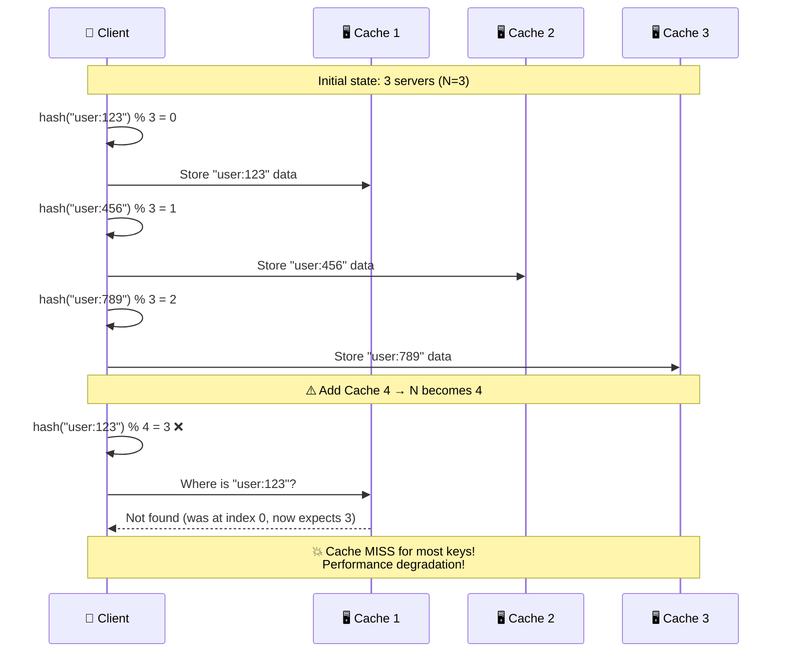
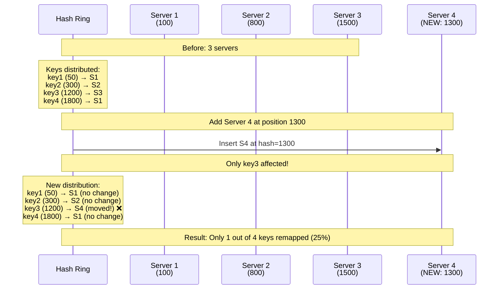
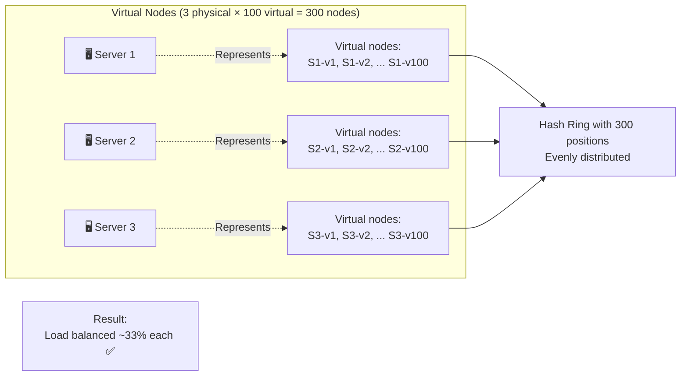
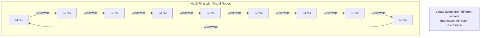
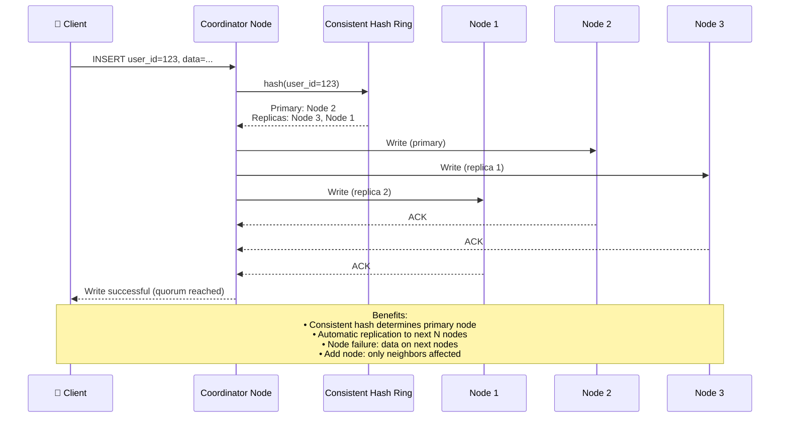
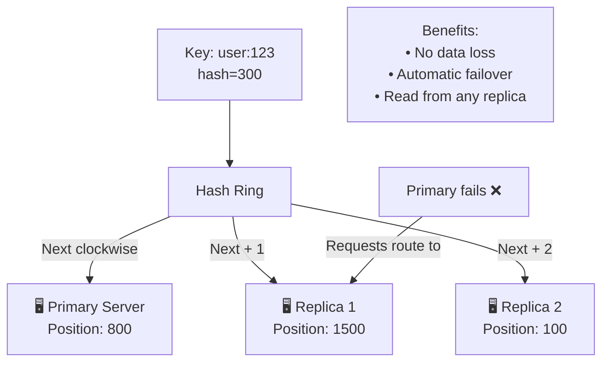

# Consistent Hashing

## Table of Contents
1. [What is Consistent Hashing?](#what-is-consistent-hashing)
2. [The Problem it Solves](#the-problem-it-solves)
3. [How Consistent Hashing Works](#how-consistent-hashing-works)
4. [Virtual Nodes](#virtual-nodes)
5. [Real-World Use Cases](#real-world-use-cases)
6. [Implementation](#implementation)
7. [Interview Questions](#interview-questions)

---

## What is Consistent Hashing?

### Simple Explanation

**Consistent Hashing** is a distributed hashing technique that minimizes the number of keys that need to be remapped when nodes are added or removed. Think of it like a circular seating arrangement at a restaurant: when a new table is added, only nearby guests need to move, not everyone!

```mermaid
graph TB
    subgraph "Regular Hashing Problem"
        RH[Hash Function:<br/>server = hash(key) % N]
        RH_Problem[❌ Add/remove server<br/>→ N changes<br/>→ Most keys remapped!]
    end

    subgraph "Consistent Hashing Solution"
        CH[Hash Ring]
        CH_Solution[✅ Add/remove server<br/>→ Only 1/N keys remapped<br/>→ Minimal disruption!]
    end

    RH --> RH_Problem
    CH --> CH_Solution
```

### Key Benefits

| Benefit | Regular Hashing | Consistent Hashing |
|---------|----------------|-------------------|
| **Keys remapped** | ~100% when adding/removing server | ~1/N (N = number of servers) |
| **Load distribution** | Even (if N is stable) | Even (with virtual nodes) |
| **Scalability** | Painful (cache invalidation) | Smooth (minimal remapping) |
| **Fault tolerance** | All keys rehashed if server fails | Only affected keys remapped |

---

## The Problem it Solves

### Regular Hashing Issues



**Problem visualization:**

```javascript
// Initial setup: 3 cache servers
const N = 3;

const keys = ["user:123", "user:456", "user:789", "user:101"];

// Distribute keys
keys.forEach(key => {
  const server = hash(key) % N;
  console.log(`${key} → Server ${server}`);
});

// Output:
// user:123 → Server 0
// user:456 → Server 1
// user:789 → Server 2
// user:101 → Server 2

// Add a new server (N = 4)
const N_new = 4;

keys.forEach(key => {
  const newServer = hash(key) % N_new;
  const oldServer = hash(key) % N;

  if (newServer !== oldServer) {
    console.log(`${key} moved from Server ${oldServer} to Server ${newServer} ❌`);
  }
});

// Output:
// user:123 moved from Server 0 to Server 3 ❌
// user:456 moved from Server 1 to Server 0 ❌
// user:789 moved from Server 2 to Server 1 ❌
// user:101 stayed at Server 2 ✅

// Result: 75% of keys remapped! (3 out of 4)
```

---

## How Consistent Hashing Works

### The Hash Ring

```mermaid
graph TB
    subgraph "Hash Ring (0 to 2^32-1)"
        Ring((Hash Ring))

        subgraph "Servers (hashed positions)"
            S1[🖥️ Server 1<br/>hash=100]
            S2[🖥️ Server 2<br/>hash=800]
            S3[🖥️ Server 3<br/>hash=1500]
        end

        subgraph "Keys (hashed positions)"
            K1[🔑 key1<br/>hash=50]
            K2[🔑 key2<br/>hash=300]
            K3[🔑 key3<br/>hash=1200]
            K4[🔑 key4<br/>hash=1800]
        end
    end

    Mapping[Mapping:<br/>──────────<br/>key1 (50) → Server 1 (100)<br/>key2 (300) → Server 2 (800)<br/>key3 (1200) → Server 3 (1500)<br/>key4 (1800) → Server 1 (100)<br/>──────────<br/>Rule: Clockwise to next server]
```

### Visual Representation

```mermaid
graph LR
    subgraph "Circular Hash Ring"
        direction TB

        H0[0] -->|Clockwise| H1
        H1[Server 1<br/>hash=100] -->|Clockwise| H2
        H2[key2<br/>hash=300] -->|Clockwise| H3
        H3[Server 2<br/>hash=800] -->|Clockwise| H4
        H4[key3<br/>hash=1200] -->|Clockwise| H5
        H5[Server 3<br/>hash=1500] -->|Clockwise| H6
        H6[key4<br/>hash=1800] -->|Clockwise| H0

        Note1[key1 (50) → next server clockwise = Server 1 (100)<br/>key2 (300) → next server clockwise = Server 2 (800)<br/>key3 (1200) → next server clockwise = Server 3 (1500)<br/>key4 (1800) → wraps around → Server 1 (100)]
    end
```

### Adding a Server



### Removing a Server

```mermaid
graph TB
    Before[Before: 3 servers<br/>──────────<br/>S1 (100)<br/>S2 (800)<br/>S3 (1500)<br/>──────────<br/>key1 (50) → S1<br/>key2 (300) → S2<br/>key3 (1200) → S3<br/>key4 (1800) → S1]

    Remove[Remove Server 2<br/>hash=800]

    After[After: 2 servers<br/>──────────<br/>S1 (100)<br/>S3 (1500)<br/>──────────<br/>key1 (50) → S1 ✅<br/>key2 (300) → S3 ❌ (moved!)<br/>key3 (1200) → S3 ✅<br/>key4 (1800) → S1 ✅]

    Before --> Remove
    Remove --> After

    Impact[Impact:<br/>Only key2 affected (was on S2)<br/>Moved to next server clockwise (S3)<br/>25% of keys remapped]
```

---

## Virtual Nodes

### The Load Distribution Problem

**Problem:** With few servers, hash ring positions might be uneven.

```mermaid
graph TB
    subgraph "3 Real Servers (Uneven Distribution)"
        Ring1[Hash Ring<br/>──────────<br/>S1 at 100<br/>S2 at 150<br/>S3 at 1000]

        Load1[Load Distribution:<br/>──────────<br/>S1: 50 keys (5%)<br/>S2: 850 keys (85%) ❌<br/>S3: 100 keys (10%)]
    end

    Problem[S2 overloaded because<br/>large gap (150 → 1000)]
```

### Solution: Virtual Nodes

**Idea:** Each physical server gets multiple positions on the ring (virtual nodes).



**Example:**

```javascript
// Without virtual nodes (3 servers)
Server 1 at hash=100
Server 2 at hash=150
Server 3 at hash=1000

// Keys distributed:
// 0-100: → Server 1 (5% of ring)
// 100-150: → Server 2 (2.5% of ring)
// 150-1000: → Server 2 (42.5% of ring) ❌ OVERLOADED
// 1000-MAX: → Server 3 (50% of ring)

// With virtual nodes (3 servers × 100 replicas = 300 virtual nodes)
Server 1: S1-v1 at 45, S1-v2 at 234, S1-v3 at 567, ... S1-v100 at 1890
Server 2: S2-v1 at 12, S2-v2 at 456, S2-v3 at 789, ... S2-v100 at 1999
Server 3: S3-v1 at 23, S3-v2 at 345, S3-v3 at 678, ... S3-v100 at 1800

// Now 300 positions evenly distributed around the ring
// Each server gets ~33% of keys ✅
```

### Virtual Node Distribution



---

## Real-World Use Cases

### Use Case 1: Distributed Caching (Memcached, Redis Cluster)

```mermaid
graph TB
    Client[👤 Application]

    subgraph "Redis Cluster (Consistent Hashing)"
        CH[Consistent Hash Ring]

        R1[🖥️ Redis 1<br/>Handles keys:<br/>user:1-1000]
        R2[🖥️ Redis 2<br/>Handles keys:<br/>user:1001-2000]
        R3[🖥️ Redis 3<br/>Handles keys:<br/>user:2001-3000]
    end

    Client -->|hash(key)| CH
    CH -->|key in range| R1
    CH -->|key in range| R2
    CH -->|key in range| R3

    Scenario[Scenario: Redis 2 fails<br/>──────────────<br/>Only keys from Redis 2<br/>remapped to Redis 3<br/>Redis 1 unaffected ✅]
```

**Code:**
```javascript
class RedisCluster {
  constructor(servers) {
    this.ring = new ConsistentHashRing();

    servers.forEach(server => {
      // Add 100 virtual nodes per server
      for (let i = 0; i < 100; i++) {
        this.ring.addNode(`${server.host}:${server.port}-${i}`, server);
      }
    });
  }

  get(key) {
    const server = this.ring.getNode(key);
    return server.get(key);
  }

  set(key, value) {
    const server = this.ring.getNode(key);
    return server.set(key, value);
  }
}

// Usage
const cluster = new RedisCluster([
  { host: 'redis1', port: 6379 },
  { host: 'redis2', port: 6379 },
  { host: 'redis3', port: 6379 }
]);

cluster.set('user:123', userData);  // Automatically routes to correct server
```

### Use Case 2: Content Delivery Network (CDN)

```mermaid
graph TB
    User[👤 User]
    DNS[🌐 DNS]

    subgraph "CDN Edge Servers (Consistent Hashing)"
        Edge1[🏢 Edge NYC<br/>Cached content:<br/>video1, video2]
        Edge2[🏢 Edge LA<br/>Cached content:<br/>video3, video4]
        Edge3[🏢 Edge London<br/>Cached content:<br/>video5, video6]
    end

    Origin[🖥️ Origin Server]

    User -->|Request: video3| DNS
    DNS -->|Consistent hash<br/>hash(video3) → Edge LA| User

    User -->|Fetch video3| Edge2
    Edge2 -.->|Cache MISS| Origin
    Origin -.-> Edge2
    Edge2 --> User

    Note[Benefits:<br/>• Same content always routes to same edge<br/>• Edge failure only affects its cached content<br/>• Adding edge server minimal remapping]
```

### Use Case 3: Load Balancing (Amazon DynamoDB)

```mermaid
graph TB
    Client[👤 Application]

    subgraph "DynamoDB Partitions"
        CH[Consistent Hash Ring<br/>Hash on partition key]

        P1[📦 Partition 1<br/>user_id: 0-999]
        P2[📦 Partition 2<br/>user_id: 1000-1999]
        P3[📦 Partition 3<br/>user_id: 2000-2999]
    end

    Client -->|Query: user_id=1234| CH
    CH -->|Routes to| P2

    Split[Hot partition split:<br/>──────────────<br/>P2 → P2a (1000-1499)<br/>    → P2b (1500-1999)<br/>──────────────<br/>Only keys in P2 remapped<br/>Other partitions unaffected]
```

### Use Case 4: Distributed Databases (Apache Cassandra)



### Use Case 5: Partitioned Messaging (Apache Kafka)

```javascript
// Kafka uses consistent hashing for partition assignment

class KafkaProducer {
  constructor(brokers, topic) {
    this.topic = topic;
    this.partitionRing = new ConsistentHashRing();

    // Add partitions to hash ring
    for (let i = 0; i < 100; i++) {  // 100 partitions
      this.partitionRing.addNode(`partition-${i}`, i);
    }
  }

  send(key, message) {
    // Messages with same key always go to same partition
    const partition = this.partitionRing.getNode(key);

    this.sendToPartition(partition, key, message);
  }
}

// Usage
const producer = new KafkaProducer(['kafka1', 'kafka2'], 'user-events');

producer.send('user:123', { event: 'login' });  // → partition 42
producer.send('user:123', { event: 'logout' }); // → partition 42 (same as login!)

// Benefits:
// • Messages with same key in order (same partition)
// • Add partition: minimal key remapping
// • Consumer can subscribe to specific partitions
```

---

## Implementation

### Basic Implementation

```javascript
const crypto = require('crypto');

class ConsistentHashRing {
  constructor(replicaCount = 100) {
    this.replicaCount = replicaCount;  // Virtual nodes per physical node
    this.ring = new Map();  // hash → server
    this.sortedHashes = [];  // Sorted array of hashes for binary search
  }

  // Hash function (MD5)
  hash(key) {
    return crypto.createHash('md5').update(key).digest('hex');
  }

  // Convert hex hash to integer
  hashToInt(hexHash) {
    return parseInt(hexHash.substring(0, 8), 16);
  }

  // Add server with virtual nodes
  addNode(nodeId, nodeData) {
    for (let i = 0; i < this.replicaCount; i++) {
      const virtualKey = `${nodeId}-vnode-${i}`;
      const hashValue = this.hashToInt(this.hash(virtualKey));

      this.ring.set(hashValue, nodeData);
      this.sortedHashes.push(hashValue);
    }

    // Keep hashes sorted for binary search
    this.sortedHashes.sort((a, b) => a - b);

    console.log(`Added node ${nodeId} with ${this.replicaCount} virtual nodes`);
  }

  // Remove server and its virtual nodes
  removeNode(nodeId) {
    for (let i = 0; i < this.replicaCount; i++) {
      const virtualKey = `${nodeId}-vnode-${i}`;
      const hashValue = this.hashToInt(this.hash(virtualKey));

      this.ring.delete(hashValue);
      const index = this.sortedHashes.indexOf(hashValue);
      if (index > -1) {
        this.sortedHashes.splice(index, 1);
      }
    }

    console.log(`Removed node ${nodeId}`);
  }

  // Get server for a key
  getNode(key) {
    if (this.sortedHashes.length === 0) {
      return null;
    }

    const hashValue = this.hashToInt(this.hash(key));

    // Binary search for first hash >= hashValue
    let left = 0;
    let right = this.sortedHashes.length - 1;

    while (left < right) {
      const mid = Math.floor((left + right) / 2);

      if (this.sortedHashes[mid] < hashValue) {
        left = mid + 1;
      } else {
        right = mid;
      }
    }

    // If hashValue > all hashes, wrap around to first
    const serverHash = this.sortedHashes[left] >= hashValue
      ? this.sortedHashes[left]
      : this.sortedHashes[0];

    return this.ring.get(serverHash);
  }

  // Get distribution of keys across servers (for testing)
  getDistribution(keys) {
    const distribution = new Map();

    keys.forEach(key => {
      const server = this.getNode(key);
      const serverId = server.id;

      distribution.set(serverId, (distribution.get(serverId) || 0) + 1);
    });

    return distribution;
  }
}

// Example usage
const ring = new ConsistentHashRing(100);  // 100 virtual nodes per server

// Add servers
ring.addNode('server1', { id: 'server1', host: '192.168.1.1' });
ring.addNode('server2', { id: 'server2', host: '192.168.1.2' });
ring.addNode('server3', { id: 'server3', host: '192.168.1.3' });

// Route keys
console.log(ring.getNode('user:123'));  // { id: 'server2', host: '192.168.1.2' }
console.log(ring.getNode('user:456'));  // { id: 'server1', host: '192.168.1.1' }
console.log(ring.getNode('user:789'));  // { id: 'server3', host: '192.168.1.3' }

// Test distribution
const testKeys = [];
for (let i = 0; i < 10000; i++) {
  testKeys.push(`user:${i}`);
}

const distribution = ring.getDistribution(testKeys);
console.log('Distribution:');
console.log(distribution);
// Output (approximately):
// Map {
//   'server1' => 3333,  // 33.33%
//   'server2' => 3334,  // 33.34%
//   'server3' => 3333   // 33.33%
// }

// Add new server
ring.addNode('server4', { id: 'server4', host: '192.168.1.4' });

const newDistribution = ring.getDistribution(testKeys);
console.log('Distribution after adding server4:');
console.log(newDistribution);
// Output (approximately):
// Map {
//   'server1' => 2500,  // 25%
//   'server2' => 2500,  // 25%
//   'server3' => 2500,  // 25%
//   'server4' => 2500   // 25%
// }

// Only ~25% of keys remapped (from servers 1, 2, 3 to server 4)
```

### Advanced: Weighted Consistent Hashing

```javascript
class WeightedConsistentHashRing extends ConsistentHashRing {
  // Add node with weight (more weight = more virtual nodes = more keys)
  addNode(nodeId, nodeData, weight = 1) {
    const virtualNodesCount = Math.floor(this.replicaCount * weight);

    for (let i = 0; i < virtualNodesCount; i++) {
      const virtualKey = `${nodeId}-vnode-${i}`;
      const hashValue = this.hashToInt(this.hash(virtualKey));

      this.ring.set(hashValue, nodeData);
      this.sortedHashes.push(hashValue);
    }

    this.sortedHashes.sort((a, b) => a - b);

    console.log(`Added node ${nodeId} with weight ${weight} (${virtualNodesCount} virtual nodes)`);
  }
}

// Usage: Powerful server gets 2x weight
const weightedRing = new WeightedConsistentHashRing(100);

weightedRing.addNode('server1', { id: 'server1', cpu: 4 }, 1);   // 100 virtual nodes
weightedRing.addNode('server2', { id: 'server2', cpu: 8 }, 2);   // 200 virtual nodes (2x weight)
weightedRing.addNode('server3', { id: 'server3', cpu: 4 }, 1);   // 100 virtual nodes

// Distribution:
// server1: 25% of keys (100 / 400 virtual nodes)
// server2: 50% of keys (200 / 400 virtual nodes) ← More powerful, handles more
// server3: 25% of keys (100 / 400 virtual nodes)
```

---

## Interview Questions

### Q1: What is consistent hashing and why is it useful?

**Answer:**

**Consistent Hashing** is a distributed hashing scheme that minimizes key remapping when nodes (servers) are added or removed.

**Problem it solves:**

**Regular hashing:**
```javascript
// Regular: hash(key) % N
server = hash("user:123") % 3  // → server 0

// Add server (N = 3 → 4)
server = hash("user:123") % 4  // → server 3 ❌ Changed!

// Result: Most keys remapped → cache invalidation → performance hit
```

**Consistent hashing:**
```javascript
// Place servers and keys on a hash ring (0 to 2^32-1)
// Key routes to next server clockwise

// Initial: 3 servers at positions 100, 800, 1500
// key "user:123" hashes to 300 → next server at 800

// Add server at position 1300
// key "user:123" still at 300 → still routes to 800 ✅ Unchanged!

// Result: Only ~1/N keys remapped (keys between new server and previous server)
```

**Benefits:**

| Metric | Regular Hashing | Consistent Hashing |
|--------|----------------|-------------------|
| Keys remapped when adding server | ~100% | ~1/N (e.g., 25% with 4 servers) |
| Keys remapped when removing server | ~100% | ~1/N |
| Load distribution | Even | Even (with virtual nodes) |
| Use case | Static clusters | Dynamic clusters (cache, CDN, DB) |

**Real-world use cases:**
- **Distributed caching** (Redis, Memcached)
- **CDN** (route requests to edge servers)
- **Databases** (Cassandra, DynamoDB partitioning)
- **Load balancing** (server selection)

### Q2: How does consistent hashing work internally?

**Answer:**

**Key concepts:**

**1. Hash ring (circular space 0 to 2^32-1)**
```
Think of it as a clock face:
- 12 o'clock = 0
- 6 o'clock = 2^31
- Back to 12 o'clock = 2^32-1 → wraps to 0
```

**2. Place servers on ring**
```javascript
// Hash server identifier to get position
server1Position = hash("server1") % 2^32  // e.g., 100
server2Position = hash("server2") % 2^32  // e.g., 800
server3Position = hash("server3") % 2^32  // e.g., 1500

// Ring: [server1(100), server2(800), server3(1500)]
```

**3. Place keys on ring**
```javascript
// Hash key to get position
key1Position = hash("user:123") % 2^32  // e.g., 300
key2Position = hash("user:456") % 2^32  // e.g., 1200
```

**4. Route key to next server clockwise**
```
key1 at position 300:
  → Next server clockwise: server2 at 800
  → Store "user:123" on server2

key2 at position 1200:
  → Next server clockwise: server3 at 1500
  → Store "user:456" on server3
```

**5. Add server**
```javascript
// Add server4 at position 1300

Before:
key2 (1200) → server3 (1500)

After:
key2 (1200) → server4 (1300) ← Changed!
All other keys unchanged ✅
```

**6. Remove server**
```javascript
// Remove server2 at position 800

Before:
key1 (300) → server2 (800)

After:
key1 (300) → server3 (1500) ← Remap to next server
All other keys unchanged ✅
```

**Algorithm:**

```javascript
function getServer(key) {
  const keyHash = hash(key);

  // Binary search for first server position >= keyHash
  let left = 0;
  let right = sortedServerPositions.length - 1;

  while (left < right) {
    const mid = Math.floor((left + right) / 2);
    if (sortedServerPositions[mid] < keyHash) {
      left = mid + 1;
    } else {
      right = mid;
    }
  }

  // If keyHash > all server positions, wrap around to first
  if (sortedServerPositions[left] < keyHash) {
    return servers[sortedServerPositions[0]];
  }

  return servers[sortedServerPositions[left]];
}

// Time complexity: O(log N) where N = number of servers
```

### Q3: What are virtual nodes and why are they important?

**Answer:**

**Problem without virtual nodes:**

With few servers, hash positions might be uneven:

```
Ring: [server1(100), server2(200), server3(10000)]

Distribution:
- 0 to 100 → server1 (100 positions, 0.000002% of ring)
- 100 to 200 → server2 (100 positions, 0.000002% of ring)
- 200 to 10000 → server3 (9800 positions, 0.00023% of ring) ❌
- 10000 to 2^32 → server1 (4,294,957,296 positions, 99.9977% of ring) ❌

Result: Extremely uneven! Server1 gets 99.99% of keys!
```

**Solution: Virtual nodes**

**Idea:** Each physical server gets multiple positions on the ring.

```javascript
// Instead of 1 position per server:
server1 → hash("server1") = 100

// Create 100 virtual nodes per server:
server1 → hash("server1-v0") = 45
server1 → hash("server1-v1") = 234
server1 → hash("server1-v2") = 567
...
server1 → hash("server1-v99") = 1890

// Now server1 has 100 evenly distributed positions on the ring
```

**Result:**

```
With 3 servers × 100 virtual nodes = 300 positions:
- Evenly distributed around ring
- Each server gets ~33% of keys
- Standard deviation < 5%
```

**Benefits:**

1. **Even load distribution**
```
Without virtual nodes:
server1: 50% of keys ❌
server2: 45% of keys
server3: 5% of keys ❌

With 100 virtual nodes each:
server1: 33.2% of keys ✅
server2: 33.5% of keys ✅
server3: 33.3% of keys ✅
```

2. **Smoother rebalancing**
```
Without virtual nodes (remove server2):
All keys from server2 → server3
server3 load: 5% → 50% (huge jump!) ❌

With virtual nodes (remove server2):
Keys from server2 distributed across remaining virtual nodes
server1: 33% → 50% (gradual increase) ✅
server3: 33% → 50% (gradual increase) ✅
```

3. **Flexible weighting**
```javascript
// Powerful server gets more virtual nodes
server1 (4 CPU): 100 virtual nodes → 25% of keys
server2 (8 CPU): 200 virtual nodes → 50% of keys (2x weight)
server3 (4 CPU): 100 virtual nodes → 25% of keys
```

**Trade-off:**
- More virtual nodes = better distribution
- But: More memory (store more positions) and slower lookups (binary search larger array)
- Sweet spot: 100-200 virtual nodes per physical server

### Q4: How would you handle node failures in a consistent hashing system?

**Answer:**

**Challenge:** When a node fails, its keys must be rerouted.

**Strategy:**

**1. Automatic failover (keys route to next node)**

```javascript
class ConsistentHashRingWithReplicas {
  getNodes(key, replicaCount = 3) {
    const nodes = [];
    const keyHash = this.hashToInt(this.hash(key));

    // Find primary node and N replicas (next N nodes clockwise)
    let index = this.findServerIndex(keyHash);

    for (let i = 0; i < replicaCount; i++) {
      nodes.push(this.ring.get(this.sortedHashes[index]));
      index = (index + 1) % this.sortedHashes.length;  // Wrap around
    }

    return nodes;  // [primary, replica1, replica2]
  }

  get(key) {
    const nodes = this.getNodes(key, 3);

    // Try primary first
    try {
      return nodes[0].get(key);
    } catch (error) {
      // Primary failed, try replica1
      try {
        return nodes[1].get(key);
      } catch (error2) {
        // Replica1 failed, try replica2
        return nodes[2].get(key);
      }
    }
  }
}
```

**2. Health checking**

```javascript
class HealthyConsistentHashRing {
  constructor() {
    this.ring = new ConsistentHashRing();
    this.healthStatus = new Map();  // nodeId → isHealthy

    // Check node health every 10 seconds
    setInterval(() => this.healthCheck(), 10000);
  }

  async healthCheck() {
    for (const [nodeId, node] of this.nodes) {
      try {
        await node.ping({ timeout: 1000 });
        this.healthStatus.set(nodeId, true);

        // If node recovered, add back to ring
        if (!this.ring.hasNode(nodeId)) {
          this.ring.addNode(nodeId, node);
          console.log(`Node ${nodeId} recovered, added back to ring`);
        }

      } catch (error) {
        this.healthStatus.set(nodeId, false);

        // Remove unhealthy node from ring
        if (this.ring.hasNode(nodeId)) {
          this.ring.removeNode(nodeId);
          console.log(`Node ${nodeId} failed, removed from ring`);
        }
      }
    }
  }

  getNode(key) {
    // Only return healthy nodes
    let node = this.ring.getNode(key);

    while (!this.healthStatus.get(node.id)) {
      // Skip unhealthy node, get next one
      const nextHash = this.ring.getNextHash(this.hash(key));
      node = this.ring.getNodeByHash(nextHash);
    }

    return node;
  }
}
```

**3. Replication**



**4. Hinted handoff (write to temporary node)**

```javascript
// If primary node down, write to temporary node with hint
async function set(key, value) {
  const primaryNode = ring.getNode(key);

  try {
    await primaryNode.set(key, value);
  } catch (error) {
    // Primary down, write to next node with hint
    const temporaryNode = ring.getNextNode(key);

    await temporaryNode.setWithHint(key, value, {
      intendedFor: primaryNode.id
    });

    console.log(`Wrote to temporary node ${temporaryNode.id}, intended for ${primaryNode.id}`);
  }
}

// When primary recovers, replay hinted writes
async function replayHints(primaryNodeId) {
  const hints = await getHints(primaryNodeId);

  for (const hint of hints) {
    await primaryNode.set(hint.key, hint.value);
    await deleteHint(hint.id);
  }

  console.log(`Replayed ${hints.length} hinted writes to ${primaryNodeId}`);
}
```

### Q5: Compare consistent hashing with other distribution strategies.

**Answer:**

**1. Consistent Hashing vs Round Robin**

| Aspect | Consistent Hashing | Round Robin |
|--------|-------------------|-------------|
| **Key affinity** | Same key → same server ✅ | Same key → different servers ❌ |
| **Caching** | Efficient (key always routes to same cache) | Inefficient (can't cache, random server) |
| **Node add/remove** | Minimal remapping (~1/N keys) | Doesn't matter (stateless) |
| **Use case** | Stateful (caching, sessions) | Stateless (load balancing) |

```javascript
// Round Robin: No key affinity
requests.forEach((req, i) => {
  const server = servers[i % servers.length];
  // Same user might hit different servers each time ❌
});

// Consistent Hashing: Key affinity
requests.forEach(req => {
  const server = ring.getNode(req.userId);
  // Same user always hits same server ✅
});
```

**2. Consistent Hashing vs Range Partitioning**

| Aspect | Consistent Hashing | Range Partitioning |
|--------|-------------------|-------------------|
| **Distribution** | Even (with virtual nodes) | Can be uneven (hotspots) |
| **Add partition** | Minimal remapping | Might need rebalance |
| **Range queries** | Not supported | Efficient ✅ |
| **Example** | DynamoDB | Cassandra (compound keys) |

```javascript
// Range Partitioning
// user_id: 0-999 → server1
// user_id: 1000-1999 → server2
// user_id: 2000-2999 → server3

// Problem: If most users have user_id < 1000, server1 overloaded ❌

// Consistent Hashing
// Evenly distributes regardless of key distribution ✅
```

**3. Consistent Hashing vs Rendezvous Hashing**

| Aspect | Consistent Hashing | Rendezvous (HRW) |
|--------|-------------------|------------------|
| **Algorithm** | Hash ring, clockwise search | Score all servers, pick highest |
| **Virtual nodes** | Required for even distribution | Not needed |
| **Performance** | O(log N) binary search | O(N) score all servers |
| **Popularity** | More common | Less common |

```javascript
// Rendezvous Hashing (Highest Random Weight)
function getServer(key, servers) {
  let maxScore = -1;
  let bestServer = null;

  servers.forEach(server => {
    const score = hash(key + server.id);
    if (score > maxScore) {
      maxScore = score;
      bestServer = server;
    }
  });

  return bestServer;
}

// Pros: Simpler, no virtual nodes needed
// Cons: O(N) for every lookup (slower for many servers)
```

**Summary:**

| Use Case | Best Strategy |
|----------|--------------|
| **Distributed cache** (key affinity) | Consistent Hashing ✅ |
| **Stateless load balancing** | Round Robin ✅ |
| **Range queries** (e.g., time-series) | Range Partitioning ✅ |
| **Small cluster (<10 servers)** | Rendezvous Hashing ✅ |
| **Large cluster (1000+ servers)** | Consistent Hashing ✅ |

---

## Summary

### Quick Reference

| Concept | Description |
|---------|-------------|
| **Hash Ring** | Circular space (0 to 2^32-1) where servers and keys are placed |
| **Routing** | Key routes to next server clockwise on ring |
| **Add server** | Only ~1/N keys remapped (keys between new and previous server) |
| **Remove server** | Only affected keys move to next server clockwise |
| **Virtual nodes** | Each physical server gets 100-200 positions for even distribution |
| **Replication** | Store keys on N consecutive servers (primary + replicas) |

### Benefits

```
✅ Minimal remapping on node add/remove
✅ Even load distribution (with virtual nodes)
✅ Fault tolerance (automatic failover to next node)
✅ Scalability (O(log N) lookups)
✅ Decentralization (no coordinator needed)
```

### Real-World Usage

```
• Redis Cluster
• Apache Cassandra
• Amazon DynamoDB
• Memcached
• Content Delivery Networks (CDN)
• Load Balancers
• Distributed File Systems
```

---

**Next Steps:**
- Review [System Design Patterns](../README.md)
- Practice [Real-World Problems](../instagram/README.md)
- Prepare for [Interviews](../instagram/09_interview_qa.md)
