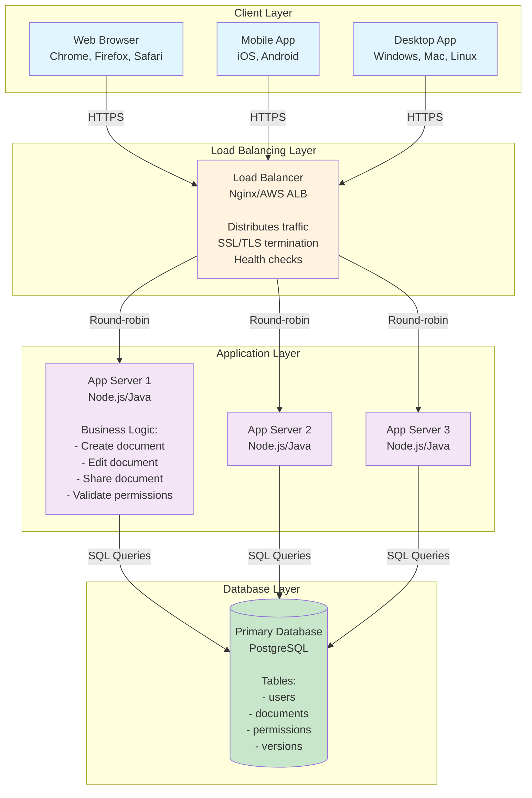
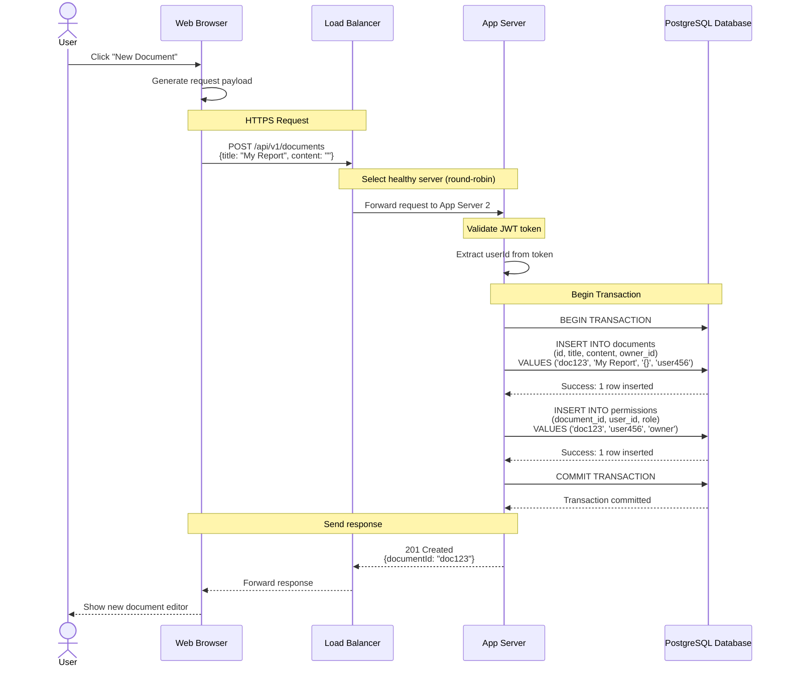

# Step 1: Basic Architecture - Foundation

## What We're Building in This Step

In this first step, we'll create the **foundational architecture** for Google Docs. Think of this as building the basic skeleton of the system - just the essential components needed to:
- Let users connect to the system
- Handle their requests (create, edit, view documents)
- Store documents in a database

This is the simplest version that works. In later steps, we'll add more sophisticated components to make it faster, more scalable, and more reliable.

---

## Architecture Diagram - Step 1



---

## Component Deep Dive

### 1. Client Layer

**What it is:**
The client layer is where users interact with Google Docs. It could be a web browser, mobile app, or desktop application.

**Why we need it:**
Users need an interface to create, edit, and view documents. The client handles:
- Rendering the document (showing formatted text)
- Capturing user input (typing, formatting)
- Sending requests to the server
- Receiving updates and displaying them

**Technology Options:**
- **Web**: React.js, Vue.js, Angular (Single Page Application)
- **Mobile**: React Native, Flutter, Native (Swift/Kotlin)
- **Desktop**: Electron, Native apps

**Example Request Flow:**
```
User types "Hello World" in document
↓
Client captures keystrokes
↓
Client bundles edits into an operation:
{
  "documentId": "doc123",
  "operation": "INSERT",
  "position": 0,
  "content": "Hello World",
  "userId": "user456"
}
↓
Client sends HTTP POST to server
```

---

### 2. Load Balancer

**What it is:**
A load balancer is like a traffic cop for your system. It receives all incoming requests and distributes them across multiple application servers.

**Analogy:**
Imagine a restaurant with one host and multiple servers (waiters). The host (load balancer) greets customers and assigns them to different servers based on who's available. This prevents one server from being overwhelmed while others are idle.

**Why we need it:**
- **Distribute Load**: No single server handles all traffic (prevents overload)
- **High Availability**: If one app server crashes, traffic routes to healthy servers
- **SSL Termination**: Handles HTTPS encryption/decryption (offloads work from app servers)
- **Health Checks**: Constantly pings app servers and removes unhealthy ones from rotation

**Load Balancing Algorithms:**

1. **Round Robin** (simplest):
   ```
   Request 1 → Server 1
   Request 2 → Server 2
   Request 3 → Server 3
   Request 4 → Server 1 (cycle repeats)
   ```

2. **Least Connections**:
   - Sends requests to the server with fewest active connections
   - Better for long-lived connections

3. **Weighted Round Robin**:
   - Give more traffic to more powerful servers
   - Server 1 (powerful): 50% traffic
   - Server 2 (medium): 30% traffic
   - Server 3 (small): 20% traffic

**Technology Options:**
- **Nginx**: Open-source, battle-tested, very fast (can handle 50K+ connections)
- **HAProxy**: High performance, advanced features
- **AWS Application Load Balancer (ALB)**: Managed service, auto-scaling
- **Google Cloud Load Balancer**: Managed, global load balancing

**Configuration Example (Nginx):**
```nginx
upstream app_servers {
    # Define backend servers
    server app1.example.com:3000 weight=3;
    server app2.example.com:3000 weight=2;
    server app3.example.com:3000 weight=1;
}

server {
    listen 443 ssl;
    server_name docs.example.com;

    # SSL certificates
    ssl_certificate /path/to/cert.pem;
    ssl_certificate_key /path/to/key.pem;

    location / {
        proxy_pass http://app_servers;
        proxy_set_header Host $host;
        proxy_set_header X-Real-IP $remote_addr;
    }
}
```

---

### 3. Application Servers

**What they are:**
Application servers run your business logic - the code that processes requests, applies rules, and coordinates between the database and clients.

**Why we need multiple servers:**
- **Horizontal Scaling**: Handle more users by adding more servers
- **No Single Point of Failure**: If one server crashes, others continue serving traffic
- **Zero-Downtime Deployments**: Update one server at a time while others handle traffic

**Key Characteristics:**
- **Stateless**: Servers don't store user session data locally (important for scaling)
- **Identical**: All servers run the same code and can handle any request
- **Independent**: Each server operates independently

**What They Do:**
1. **Receive requests** from load balancer
2. **Validate** user authentication and authorization
3. **Execute business logic**:
   - Create new document → Generate ID, set permissions
   - Edit document → Validate user has edit permission, save changes
   - Share document → Create permission record
4. **Query database** to read/write data
5. **Send response** back to client

**Example API Endpoints Handled:**
```
POST   /api/v1/documents              → Create new document
GET    /api/v1/documents/:id          → Retrieve document
PUT    /api/v1/documents/:id          → Update document content
DELETE /api/v1/documents/:id          → Delete document
POST   /api/v1/documents/:id/share    → Share document
GET    /api/v1/documents/:id/versions → Get version history
```

**Technology Options:**
- **Node.js + Express**: Fast, async I/O, great for real-time apps (Netflix, LinkedIn use it)
- **Java + Spring Boot**: Enterprise-grade, robust, excellent for complex business logic
- **Python + Django/Flask**: Rapid development, great for prototypes
- **Go**: High performance, excellent concurrency

**Example Request Handler (Node.js):**
```javascript
// Create Document Endpoint
app.post('/api/v1/documents', async (req, res) => {
  try {
    // 1. Validate user authentication
    const userId = req.user.id; // From JWT token

    // 2. Extract request data
    const { title, content } = req.body;

    // 3. Generate document ID
    const documentId = generateUUID();

    // 4. Save to database
    await db.query(`
      INSERT INTO documents (id, title, content, owner_id, created_at)
      VALUES ($1, $2, $3, $4, NOW())
    `, [documentId, title, content, userId]);

    // 5. Set default permissions (owner has full access)
    await db.query(`
      INSERT INTO permissions (document_id, user_id, role)
      VALUES ($1, $2, 'owner')
    `, [documentId, userId]);

    // 6. Return response
    res.status(201).json({
      success: true,
      documentId: documentId,
      message: 'Document created successfully'
    });
  } catch (error) {
    console.error('Error creating document:', error);
    res.status(500).json({ error: 'Internal server error' });
  }
});
```

---

### 4. Primary Database

**What it is:**
The database is where all persistent data is stored: documents, users, permissions, version history.

**Why PostgreSQL?**
We chose PostgreSQL (a relational/SQL database) for several reasons:

**Pros:**
1. **ACID Compliance**: Ensures data consistency (critical for documents)
   - **Atomicity**: All changes in a transaction succeed or all fail
   - **Consistency**: Data always in valid state
   - **Isolation**: Concurrent transactions don't interfere
   - **Durability**: Committed changes never lost

2. **Strong Support for Transactions**: Critical for operations like:
   - User A shares document with User B → Must create permission AND send notification (both or neither)

3. **Complex Queries**: Can efficiently join tables:
   ```sql
   -- Find all documents user has access to
   SELECT d.id, d.title, p.role
   FROM documents d
   JOIN permissions p ON d.id = p.document_id
   WHERE p.user_id = 'user123'
   ORDER BY d.updated_at DESC;
   ```

4. **JSON Support**: PostgreSQL supports JSON columns (best of both worlds):
   ```sql
   -- Store document content as JSON
   CREATE TABLE documents (
     id UUID PRIMARY KEY,
     title VARCHAR(255),
     content JSONB,  -- Flexible content structure
     created_at TIMESTAMP
   );
   ```

5. **Mature Ecosystem**: 30+ years of development, excellent tooling

**Basic Schema:**

```sql
-- Users table
CREATE TABLE users (
    id UUID PRIMARY KEY DEFAULT gen_random_uuid(),
    email VARCHAR(255) UNIQUE NOT NULL,
    name VARCHAR(255),
    password_hash VARCHAR(255),
    created_at TIMESTAMP DEFAULT NOW(),
    updated_at TIMESTAMP DEFAULT NOW()
);

-- Documents table
CREATE TABLE documents (
    id UUID PRIMARY KEY DEFAULT gen_random_uuid(),
    title VARCHAR(500),
    content JSONB,  -- Store document as JSON
    owner_id UUID REFERENCES users(id),
    created_at TIMESTAMP DEFAULT NOW(),
    updated_at TIMESTAMP DEFAULT NOW(),
    deleted_at TIMESTAMP  -- Soft delete (move to trash)
);

-- Permissions table (who can access which document)
CREATE TABLE permissions (
    id UUID PRIMARY KEY DEFAULT gen_random_uuid(),
    document_id UUID REFERENCES documents(id) ON DELETE CASCADE,
    user_id UUID REFERENCES users(id) ON DELETE CASCADE,
    role VARCHAR(50),  -- 'owner', 'editor', 'commenter', 'viewer'
    granted_at TIMESTAMP DEFAULT NOW(),
    UNIQUE(document_id, user_id)
);

-- Indexes for performance
CREATE INDEX idx_documents_owner ON documents(owner_id);
CREATE INDEX idx_documents_updated ON documents(updated_at DESC);
CREATE INDEX idx_permissions_user ON permissions(user_id);
CREATE INDEX idx_permissions_document ON permissions(document_id);
```

---

## Request Flow Example: Creating a Document

Let's trace what happens when a user creates a new document.



**Time Breakdown:**
```
Network (Client → LB):          20ms
LB Processing:                  2ms
Network (LB → App Server):      1ms
App Server Processing:          10ms
Database Query:                 5ms
Network (App → LB → Client):    22ms
─────────────────────────────────────
TOTAL LATENCY:                  60ms ✓ (under 200ms target)
```

---

## Capacity Analysis

Let's verify this basic architecture can handle our load.

### Single Application Server Capacity

```
Typical Node.js server capacity:
- CPU: 4 cores
- Memory: 8 GB
- Connections: 10,000 concurrent connections
- Requests/sec: 500-1,000 req/sec (for I/O-bound operations like DB queries)

Database operations:
- Simple query (SELECT by ID): 5ms
- Complex query (JOIN): 20ms
- INSERT operation: 10ms
- UPDATE operation: 10ms

Server throughput calculation:
- If average request takes 15ms (10ms app logic + 5ms DB)
- Single thread can handle: 1000ms / 15ms = 66 req/sec
- With 4 cores and async I/O: ~500 req/sec per server
```

### Cluster Capacity (3 Servers)

```
Total Servers:                 3
Requests/sec per server:       500
Total capacity:                1,500 req/sec

Our average load:              17,630 req/sec (from requirements)
Servers needed:                17,630 / 500 = 36 servers

With auto-scaling:
- Normal load: 40 servers (with 10% buffer)
- Peak load (3x): 120 servers
```

**Note**: This is for the basic architecture. We'll significantly reduce the required servers by adding caching in Step 2.

### Database Capacity

```
PostgreSQL on modern hardware:
- CPU: 16 cores
- Memory: 64 GB
- SSD Storage: 1 TB

Typical capacity:
- Simple queries: 10,000-20,000 queries/sec
- Write operations: 5,000-10,000 writes/sec
- Connections: 200-500 concurrent connections

Our load:
- Reads: 1,276 req/sec (✓ Well within capacity)
- Writes: 16,354 req/sec (⚠️ Approaching limits at peak)

Bottleneck: Database writes at peak load (49,062 writes/sec)
Solution: In Step 3, we'll add database replication and sharding
```

---

## Trade-offs and Limitations

### Pros of This Basic Architecture ✅

1. **Simple**: Easy to understand, implement, and debug
2. **Fast to Build**: Can get a working prototype in days
3. **Low Operational Complexity**: Few moving parts
4. **Good for MVP**: Sufficient for 10,000-100,000 users
5. **Horizontal Scaling**: Can add more app servers easily

### Cons of This Basic Architecture ❌

1. **Database Bottleneck**: Single database can't handle millions of writes/sec
2. **No Caching**: Every request hits the database (slow and expensive)
3. **No Real-Time**: No WebSocket support for live collaboration
4. **Single Point of Failure**: If database goes down, entire system is down
5. **High Latency**: Average request takes 50-100ms (OK, but not great)
6. **No Geographical Distribution**: All servers in one location (high latency for distant users)

---

## What's Missing?

This basic architecture works but has several limitations:

| Issue | Impact | Solution (In Later Steps) |
|-------|--------|---------------------------|
| Every request hits DB | Slow, expensive | **Step 2**: Add Redis caching |
| Database single point of failure | System goes down if DB fails | **Step 3**: Add replication |
| Can't handle 10M+ writes/sec | Database overloaded | **Step 3**: Add sharding |
| No real-time collaboration | Users don't see live edits | **Step 4**: Add WebSocket servers |
| Static assets served from app servers | Wastes bandwidth | **Step 5**: Add CDN |
| No conflict resolution | Concurrent edits cause conflicts | **Step 6**: Add Operational Transform |

---

## Cost Estimation (Basic Architecture)

Let's estimate monthly AWS costs for this setup.

```
Application Servers (40 servers normal, 120 peak):
- Instance type: t3.large (2 vCPU, 8 GB RAM)
- Cost: $0.0832/hour × 40 servers × 730 hours = $2,425/month
- With auto-scaling (average 60 servers): $3,638/month

Load Balancer:
- AWS Application Load Balancer: $16.20 + $0.008/LCU
- Estimated: $200/month

Database:
- RDS PostgreSQL (db.r5.4xlarge: 16 vCPU, 128 GB RAM)
- Cost: $2.976/hour × 730 hours = $2,172/month
- Storage (1 TB SSD): $115/month
- Backup storage (500 GB): $48/month

Data Transfer:
- 76 TB/month × $0.09/GB = $6,840/month

TOTAL MONTHLY COST:         ~$13,000/month
TOTAL ANNUAL COST:          ~$156,000/year
```

**Note**: These costs will increase as we add more components (caching, replication, etc.) but will also improve performance and reliability.

---

## Key Takeaways

1. **Start Simple**: This basic architecture is sufficient for an MVP
2. **Load Balancer is Critical**: Enables horizontal scaling and high availability
3. **Stateless App Servers**: Must be stateless to scale horizontally
4. **Database Choice Matters**: PostgreSQL chosen for ACID guarantees
5. **Bottleneck Identified**: Database will be the bottleneck at scale
6. **Incremental Improvement**: Each step adds capabilities to address limitations

---

## Next Steps

In **Step 2**, we'll add a **caching layer** (Redis) to:
- Reduce database load by 80%
- Improve response time from 60ms to 10ms
- Reduce infrastructure costs
- Handle more users with fewer servers

→ Continue to [Step 2: Add Caching Layer](./03_step2_add_caching.md)
