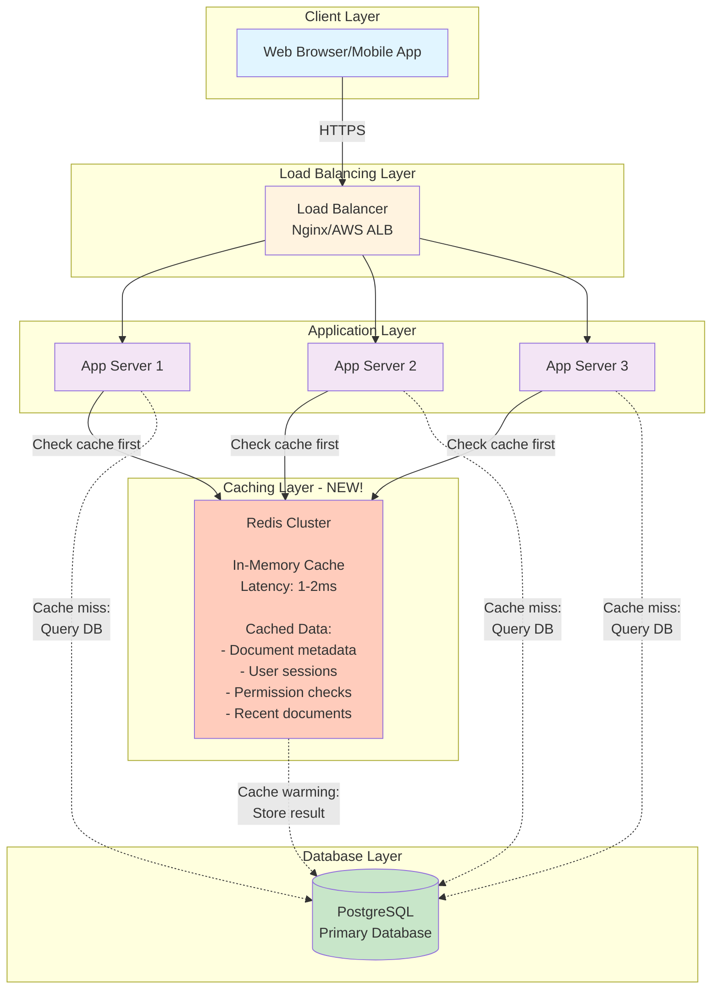
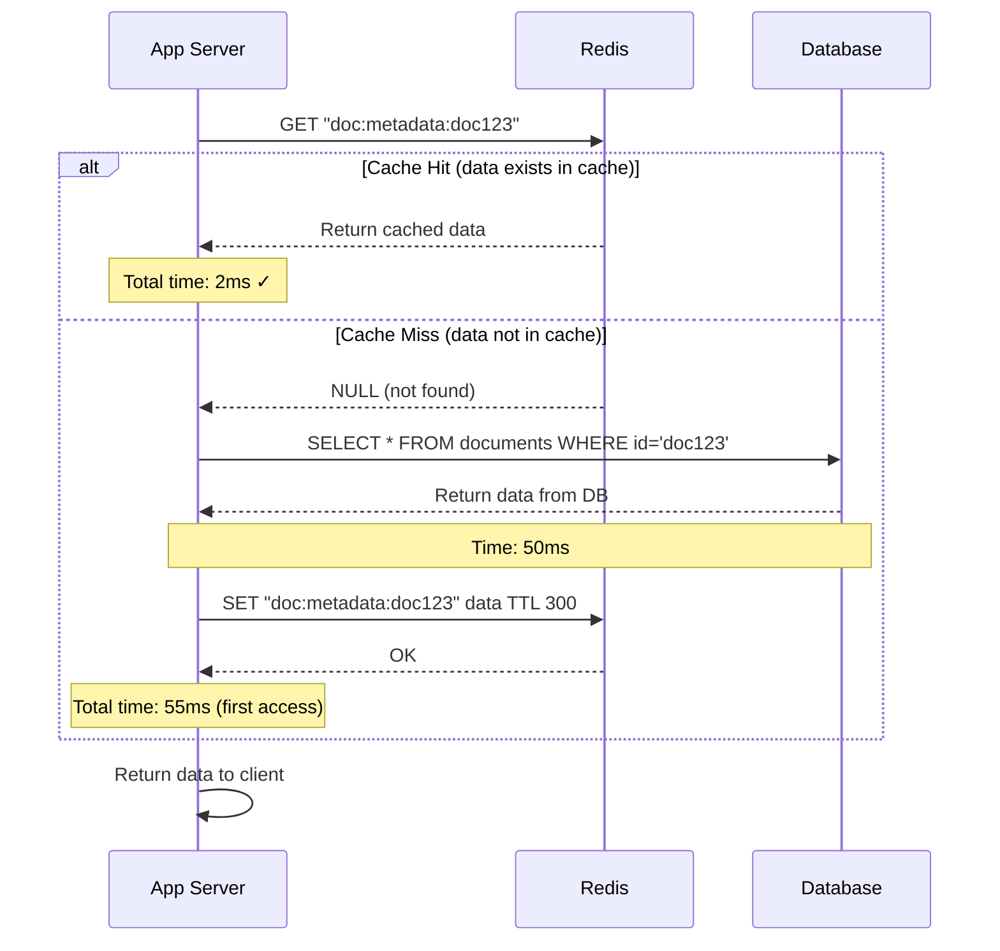
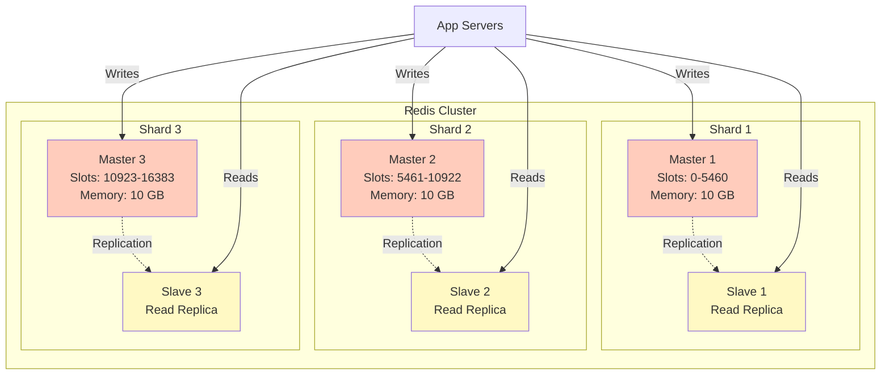
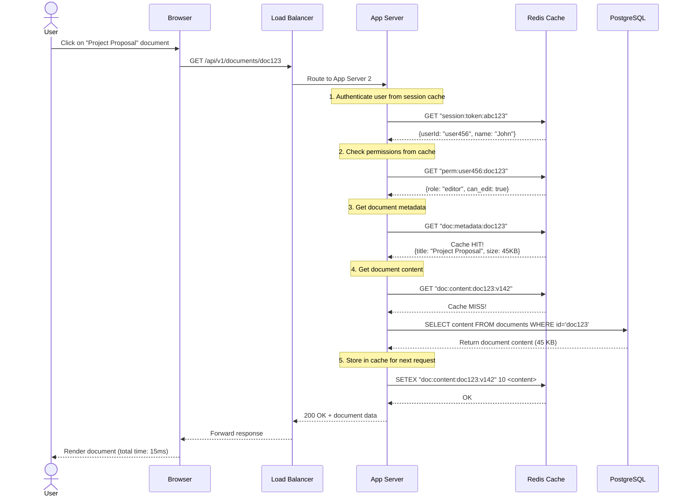

# Step 2: Adding Caching Layer - Performance Boost

## What Changed from Step 1?

In Step 1, every request went directly to the database. This works but has problems:
- **Slow**: Database queries take 50-100ms
- **Expensive**: Database CPU/memory costs scale with traffic
- **Wasteful**: We fetch the same data repeatedly (80% of requests are reads!)

In Step 2, we add **Redis** - an in-memory cache that sits between application servers and the database.

**Result:**
- Latency drops from 60ms to **10ms** (6x faster!)
- Database load reduced by **80%**
- Can handle **5x more traffic** with same infrastructure

---

## Architecture Diagram - Step 2 (With Caching)



**Key Changes:**
- Added **Redis Cluster** between app servers and database
- App servers check Redis first before querying database
- Dotted lines show fallback to database on cache miss

---

## Why Redis?

### What is Redis?

**Redis** = **RE**mote **DI**ctionary **S**erver

It's an **in-memory data store** that stores data in RAM (not disk), making it extremely fast.

**Speed Comparison:**
```
RAM (Redis):          0.1 microseconds = 0.0001 ms
SSD (Database):       100 microseconds = 0.1 ms
HDD (Old databases):  10 milliseconds = 10 ms

Redis is 1000x faster than SSD databases!
```

### Redis vs Memcached

| Feature | Redis | Memcached |
|---------|-------|-----------|
| **Data Structures** | Strings, Lists, Sets, Hashes, Sorted Sets | Only Strings |
| **Persistence** | Can save to disk (optional) | No persistence |
| **Replication** | Master-slave replication | No replication |
| **Use Case** | Complex caching, sessions, real-time | Simple key-value caching |
| **Who Uses** | Twitter, GitHub, Stack Overflow | Facebook, YouTube |

**Why we chose Redis:**
- Rich data structures (great for document metadata)
- Persistence (can survive restarts)
- Pub/Sub support (useful for real-time features in Step 4)

---

## Caching Strategy

### What to Cache?

Not everything should be cached. Here's what we cache for Google Docs:

#### 1. Document Metadata (High Value)
```json
Cache Key: "doc:metadata:doc123"
TTL: 5 minutes
Value: {
  "id": "doc123",
  "title": "Project Proposal",
  "owner_id": "user456",
  "updated_at": "2025-01-15T10:30:00Z",
  "size": 45678
}
```
**Why:** Fetched on every document open, rarely changes

#### 2. User Sessions (Critical)
```json
Cache Key: "session:token:abc123xyz"
TTL: 24 hours
Value: {
  "user_id": "user456",
  "email": "john@example.com",
  "name": "John Doe",
  "expires_at": "2025-01-16T10:00:00Z"
}
```
**Why:** Checked on every request for authentication

#### 3. Permission Checks (High Value)
```json
Cache Key: "perm:user456:doc123"
TTL: 1 minute
Value: {
  "role": "editor",
  "can_edit": true,
  "can_share": true,
  "can_delete": false
}
```
**Why:** Checked on every document access, expensive JOIN query

#### 4. Recent Documents List (Medium Value)
```json
Cache Key: "user:user456:recent_docs"
TTL: 30 seconds
Value: [
  {"id": "doc123", "title": "Project Proposal", "updated_at": "..."},
  {"id": "doc456", "title": "Meeting Notes", "updated_at": "..."},
  {"id": "doc789", "title": "Budget 2025", "updated_at": "..."}
]
```
**Why:** Shown on home page, frequently accessed

#### 5. Document Content (Selective)
```json
Cache Key: "doc:content:doc123"
TTL: 10 seconds
Value: {
  "content": "<document JSON>",
  "version": 142
}
```
**Why:** Hot documents (many concurrent viewers) benefit from caching
**Note:** Only cache actively edited documents (wasteful to cache all)

### What NOT to Cache?

1. **Infrequently accessed documents**: Wastes cache memory
2. **Large documents (>1 MB)**: Eats up cache space quickly
3. **Highly dynamic data**: Version history (changes constantly during editing)
4. **Write operations**: Always go to database (cache updated after)

---

## Cache Patterns

### Pattern 1: Cache-Aside (Lazy Loading) - PRIMARY PATTERN

This is the pattern we use for Google Docs.

**How it works:**



**Code Example:**
```javascript
async function getDocumentMetadata(documentId) {
  const cacheKey = `doc:metadata:${documentId}`;

  // 1. Try cache first
  let metadata = await redis.get(cacheKey);

  if (metadata) {
    // Cache hit!
    console.log('Cache hit for', documentId);
    return JSON.parse(metadata);
  }

  // 2. Cache miss - query database
  console.log('Cache miss for', documentId);
  metadata = await db.query(
    'SELECT id, title, owner_id, updated_at FROM documents WHERE id = $1',
    [documentId]
  );

  // 3. Store in cache for next time (TTL: 5 minutes)
  await redis.setex(cacheKey, 300, JSON.stringify(metadata));

  return metadata;
}
```

**Pros:**
- Simple to implement
- Only caches data that's actually accessed (no wasted space)
- Cache failures don't break the system (fallback to DB)

**Cons:**
- First request always slow (cache miss)
- Each cache miss = 2 round trips (cache + DB)

---

### Pattern 2: Write-Through (For Critical Data)

Used for user sessions and permissions.

**How it works:**
```mermaid
sequenceDiagram
    participant App as App Server
    participant Cache as Redis
    participant DB as Database

    Note over App: User updates document permissions

    App->>DB: UPDATE permissions SET role='editor'
    DB-->>App: Success

    App->>Cache: SET "perm:user123:doc456" new_data
    Cache-->>App: OK

    Note over App,Cache,DB: Both cache and DB are now updated
```

**Code Example:**
```javascript
async function updatePermission(documentId, userId, newRole) {
  // 1. Update database first
  await db.query(
    'UPDATE permissions SET role = $1 WHERE document_id = $2 AND user_id = $3',
    [newRole, documentId, userId]
  );

  // 2. Update cache immediately
  const cacheKey = `perm:${userId}:${documentId}`;
  const permData = { role: newRole, can_edit: newRole === 'editor' };
  await redis.setex(cacheKey, 60, JSON.stringify(permData));

  return { success: true };
}
```

**Pros:**
- Cache always consistent with database
- No cache miss delays for critical operations

**Cons:**
- Slower writes (2 operations instead of 1)

---

### Pattern 3: Write-Behind (For High-Throughput Writes)

We'll use this in Step 4 for document edit operations.

**How it works:**
1. Write to cache immediately (fast)
2. Asynchronously write to database (background)
3. User doesn't wait for database write

**Pros:**
- Extremely fast writes (<5ms)
- Reduces database load

**Cons:**
- Risk of data loss if cache crashes before DB write
- More complex to implement

---

## Cache Invalidation Strategy

> "There are only two hard things in Computer Science: cache invalidation and naming things." - Phil Karlton

### Problem: Stale Data

When document is updated, cached version becomes outdated (stale).

**Example:**
```
Time 0: Document title = "Draft Report" (cached)
Time 1: User changes title to "Final Report"
Time 2: Another user opens document
         → Cache returns "Draft Report" (WRONG!)
```

### Solution 1: Time-Based Expiration (TTL)

Set a Time-To-Live on cached data.

```javascript
// Cache document metadata for 5 minutes
await redis.setex('doc:metadata:doc123', 300, JSON.stringify(metadata));
```

**TTL Guidelines:**
- **Frequently changing data**: 10-30 seconds (document content during editing)
- **Moderately changing data**: 5-10 minutes (document metadata)
- **Rarely changing data**: 1-24 hours (user profiles)

### Solution 2: Explicit Invalidation

Delete cache when data changes.

```javascript
async function updateDocumentTitle(documentId, newTitle) {
  // 1. Update database
  await db.query('UPDATE documents SET title = $1 WHERE id = $2', [newTitle, documentId]);

  // 2. Delete cached metadata (forces refresh)
  await redis.del(`doc:metadata:${documentId}`);

  return { success: true };
}
```

### Solution 3: Version-Based Invalidation

Include version number in cache key.

```javascript
// Cache key includes version
const cacheKey = `doc:content:${documentId}:v${version}`;

// When document updated, version increments
// Old cache entries become unused (eventually evicted)
```

### Our Strategy for Google Docs

| Data Type | Invalidation Strategy |
|-----------|----------------------|
| **Document metadata** | TTL (5 min) + explicit invalidation on update |
| **Document content** | TTL (10 sec) + version-based |
| **User sessions** | TTL (24 hours) + explicit invalidation on logout |
| **Permissions** | TTL (1 min) + explicit invalidation on change |
| **Recent docs list** | TTL (30 sec) only |

---

## Cache Eviction Policies

When cache is full, which data gets removed?

### LRU (Least Recently Used) - OUR CHOICE

Removes data that hasn't been accessed in longest time.

```
Cache state: [A:10min, B:5min, C:1min, D:30sec]
                         ↑
                   oldest access

New item E needs space → Remove A (least recently used)
```

**Why LRU:**
- Popular documents stay in cache
- Old/inactive documents automatically removed
- Best for document caching

### Other Policies:

- **LFU (Least Frequently Used)**: Remove items accessed least often
- **FIFO (First In First Out)**: Remove oldest added items
- **Random**: Remove random item (surprisingly effective!)

**Redis Configuration:**
```redis
maxmemory 10gb
maxmemory-policy allkeys-lru
```

---

## Performance Impact

### Before Caching (Step 1)

```
Read Request (Document Open):
- App Server → Database: 50ms
- Total: 50ms

Requests/sec per server: 500
Database load: 1,276 reads/sec → 100% CPU
```

### After Caching (Step 2)

```
Read Request (Cache Hit - 80% of requests):
- App Server → Redis: 2ms
- Total: 2ms (25x faster!)

Read Request (Cache Miss - 20% of requests):
- App Server → Redis: 2ms (miss)
- App Server → Database: 50ms
- App Server → Redis: 2ms (store)
- Total: 54ms

Weighted Average:
= (0.80 × 2ms) + (0.20 × 54ms)
= 1.6ms + 10.8ms
= 12.4ms (4x faster on average!)

Database load: 1,276 reads/sec × 20% = 255 reads/sec (75% reduction!)
```

### Capacity Improvement

```
BEFORE (No Cache):
- Required app servers: 36
- Database CPU: 90%

AFTER (With Cache):
- Required app servers: 12 (66% reduction)
- Database CPU: 30% (70% reduction)
- Added Redis: 3 nodes

Monthly cost savings: ~$8,000/month
```

---

## Redis Cluster Architecture

For high availability and scalability, we use **Redis Cluster** (not single Redis instance).



**Benefits:**
- **High Availability**: If master fails, slave automatically promoted
- **Horizontal Scaling**: Distribute data across multiple nodes
- **Read Scaling**: Slaves handle read queries (writes go to master)

**Data Distribution:**
Redis uses **hash slots** (16,384 slots):
```
Key: "doc:metadata:doc123"
↓
Hash: CRC16("doc:metadata:doc123") = 12345
↓
Slot: 12345 % 16384 = 12345
↓
Node: Shard 3 (slots 10923-16383)
```

---

## Monitoring Cache Performance

Key metrics to track:

### 1. Cache Hit Ratio
```
Hit Ratio = Cache Hits / Total Requests
Target: >80%

Example:
Requests: 1,000,000
Cache Hits: 850,000
Hit Ratio: 85% ✓
```

### 2. Cache Memory Usage
```
redis-cli INFO memory

used_memory: 8.2 GB
maxmemory: 10 GB
Usage: 82% (healthy)

Alert if >90% (risk of evictions)
```

### 3. Latency
```
redis-cli --latency

avg: 0.5ms, max: 2ms ✓ (healthy)

Alert if avg >5ms (network or overload issue)
```

---

## Trade-offs

### Pros ✅

1. **10x Faster Reads**: 2ms vs 50ms (cached vs DB)
2. **80% Database Load Reduction**: Database can handle more traffic
3. **Lower Costs**: Need fewer app servers and smaller database
4. **Better User Experience**: Pages load faster
5. **Scalability**: Can handle 5x more users with same infrastructure

### Cons ❌

1. **Eventual Consistency**: Cache may have stale data (seconds)
2. **Added Complexity**: One more system to manage and monitor
3. **Memory Costs**: Redis RAM more expensive than disk storage
4. **Cache Warming**: Cold cache (after restart) causes temporary slowdown
5. **Debugging Harder**: Need to check both cache and database

---

## Cost Analysis

### Redis Infrastructure Cost

```
Redis Cluster: 3 masters + 3 slaves = 6 nodes
Instance: cache.r5.large (2 vCPU, 13.5 GB RAM)
Cost: $0.126/hour × 6 nodes × 730 hours = $552/month

ADDED COST: $552/month

But we save:
- App servers: Reduced from 36 to 12 = -$5,880/month
- Database: Can use smaller instance = -$1,000/month

NET SAVINGS: $6,880 - $552 = $6,328/month = $75,936/year
```

---

## Real-World Example: Fetching Document

Let's trace a full request flow with caching:



**Time Breakdown:**
```
1. Session check (cache):        2ms
2. Permission check (cache):     2ms
3. Metadata fetch (cache):       2ms
4. Content fetch (DB):           50ms
5. Update cache:                 2ms
───────────────────────────────────
TOTAL:                           58ms

Next user opening same document:
1-3. Same (cache hits):          6ms
4. Content fetch (NOW CACHED):   2ms
───────────────────────────────────
TOTAL:                           8ms (7x faster!)
```

---

## Key Takeaways

1. **Caching = Speed**: Reduces latency from 50ms to 2ms for cached data
2. **Cache-Aside Pattern**: Simple and reliable for read-heavy workloads
3. **80/20 Rule**: 80% cache hit rate is the goal (achievable with right TTLs)
4. **TTL is Critical**: Too short = cache misses, too long = stale data
5. **Invalidation is Hard**: Must explicitly invalidate on writes
6. **Monitor Hit Ratio**: Below 70% means cache strategy needs tuning
7. **Redis Cluster**: Use clustering for high availability and scalability

---

## Next Steps

Our architecture now handles reads efficiently, but we still have a **single database bottleneck** for writes.

In **Step 3**, we'll add **database replication and sharding** to:
- Handle millions of writes per second
- Eliminate single point of failure
- Scale reads further with read replicas
- Distribute data geographically

→ Continue to [Step 3: Database Scaling](./04_step3_database_scaling.md)
