# Step 3: Database Scaling - Replication & Sharding

## What Changed from Step 2?

In Step 2, we solved the read performance problem with Redis caching. But we still have issues:

**Remaining Problems:**
- Single database = **single point of failure** (SPOF)
- Database can only handle **~10,000 writes/sec** (we need 16,354 writes/sec at average, 49,062 at peak!)
- All data on one server = **limited storage capacity**
- No geographical distribution = **high latency for distant users**

**Step 3 Solution:**
1. **Master-Slave Replication**: Create read replicas to distribute read load and add redundancy
2. **Sharding (Horizontal Partitioning)**: Split data across multiple databases to scale writes

---

## Architecture Diagram - Step 3 (With Replication & Sharding)


**Key Changes:**
- **3 database shards** instead of 1 (horizontal scaling)
- Each shard has **1 master + 2 slaves** (replication for reads and failover)
- Writes go to masters, reads go to slaves
- Data distributed across shards

---

## Part 1: Master-Slave Replication

### What is Replication?

**Replication** = Copying data from one database (master) to one or more databases (slaves/replicas)

**Analogy:**
Think of a teacher (master) and students (slaves) taking notes. The teacher writes on the board, and students copy it into their notebooks. If you want to read the notes, you ask the students (not the teacher, who's busy writing).

### Why Replication?

1. **Scale Reads**: Distribute read queries across multiple slaves
2. **High Availability**: If master fails, promote a slave to master
3. **Backup**: Slaves serve as live backups
4. **Reduce Load**: Master focuses on writes, slaves handle reads

### How It Works


### Replication Types

#### 1. Asynchronous Replication (Our Choice)

**How it works:**
- Master writes data and immediately returns success
- Master sends changes to slaves in background
- Slaves apply changes when they receive them

**Pros:**
- Fast writes (master doesn't wait for slaves)
- No performance impact on master

**Cons:**
- Replication lag (10-500ms): Slaves may have slightly stale data
- If master crashes before replicating, recent writes are lost

**Example:**
```
Time 0: User saves document (writes to master)
Time 0.001s: Master returns "Success" to user
Time 0.050s: Slave 1 receives update
Time 0.052s: Slave 2 receives update

If user reads from Slave 1 at Time 0.025s:
→ They see OLD version (replication lag!)
```

#### 2. Synchronous Replication

**How it works:**
- Master writes data
- Master waits for at least one slave to confirm write
- Then returns success

**Pros:**
- Strong consistency (slaves always have latest data)
- No data loss if master fails

**Cons:**
- Slower writes (master waits for slaves)
- If slave is slow/down, writes are blocked

**When to use:**
- Critical data (payment transactions, account balances)
- Google Docs uses async (eventual consistency is OK for documents)

### Read/Write Splitting

**Strategy:**
```javascript
// Route writes to master
async function saveDocument(doc) {
  const masterDB = getMasterConnection();
  await masterDB.query('INSERT INTO documents VALUES (...)', [doc]);
}

// Route reads to random slave (load balancing)
async function getDocument(docId) {
  const slaveDB = getRandomSlaveConnection(); // Slave 1 or Slave 2
  return await slaveDB.query('SELECT * FROM documents WHERE id = $1', [docId]);
}
```

### Failover: When Master Dies

**Scenario:** Master database crashes

**Automatic Failover Process:**

```mermaid
graph TB
    subgraph "Normal Operation"
        M1[Master<br/>Healthy]
        S1[Slave 1]
        S2[Slave 2]
    end

    subgraph "Master Failure Detected"
        M2[Master<br/>💀 CRASHED]
        S3[Slave 1<br/>Most up-to-date]
        S4[Slave 2]
    end

    subgraph "After Failover"
        M3[Slave 1<br/>🎉 PROMOTED<br/>New Master]
        S5[Slave 2<br/>Now replicates from<br/>new master]
        S6[New Slave<br/>Created from backup]
    end

    M1 --> M2 --> M3
    S1 --> S3 --> M3
    S2 --> S4 --> S5

    style M1 fill:#c8e6c9
    style M2 fill:#ffcdd2
    style M3 fill:#c8e6c9
    style S3 fill:#fff9c4
```



**Failover Steps:**
1. **Detect failure** (health check fails for 10 seconds)
2. **Choose new master** (slave with least replication lag)
3. **Promote slave** to master (enable writes)
4. **Update application config** (route writes to new master)
5. **Start new slave** from backup
6. **Resume replication**

**Downtime:** 30-60 seconds (automated failover)

**Tool:** Patroni, Replication Manager, AWS RDS Auto Failover

---

## Part 2: Sharding (Horizontal Partitioning)

### What is Sharding?

**Sharding** = Splitting data across multiple databases (shards), where each shard holds a subset of the data.

**Analogy:**
Imagine a library with 1 million books. Instead of one giant library, you split it into 10 smaller libraries:
- Library A-C: Books by authors starting with A-C
- Library D-F: Books by authors starting with D-F
- ...and so on

Each library is smaller, faster, and easier to manage.

### Why Sharding?

**Problem:**
Single database limits:
- Max storage: ~5-10 TB per server
- Max writes: ~10,000 writes/sec
- Max connections: ~500 connections

**Solution with 10 shards:**
- Total storage: 50-100 TB
- Total writes: 100,000 writes/sec
- Total connections: 5,000 connections

### Sharding Strategies

#### Strategy 1: Hash-Based Sharding (Our Choice)

**How it works:**
```
Document ID: doc123
↓
Hash: hash("doc123") = 1,234,567,890
↓
Shard: 1,234,567,890 % 3 = 0
↓
Store in Shard 0
```

**Code Example:**
```javascript
function getShardForDocument(documentId) {
  const hash = hashFunction(documentId); // CRC32, MD5, etc.
  const shardIndex = hash % TOTAL_SHARDS; // 3 shards
  return shardIndex; // 0, 1, or 2
}

async function saveDocument(doc) {
  const shardIndex = getShardForDocument(doc.id);
  const db = getDatabaseConnection(shardIndex);
  await db.query('INSERT INTO documents VALUES (...)', [doc]);
}
```

**Pros:**
- Uniform distribution (each shard gets ~equal data)
- Simple to implement

**Cons:**
- Difficult to add shards later (requires re-sharding all data)
- Related documents may be on different shards

#### Strategy 2: Range-Based Sharding

**How it works:**
```
Document ID starts with:
- A-H → Shard 1
- I-P → Shard 2
- Q-Z → Shard 3
```

**Pros:**
- Easy to add shards (just split ranges)
- Range queries efficient (all data in one shard)

**Cons:**
- **Hot shards**: If most users' names start with 'A', Shard 1 is overloaded
- Uneven distribution

#### Strategy 3: User-Based Sharding (Best for Google Docs)

**How it works:**
```
User ID: user456
↓
Hash: hash("user456") = 2,345,678,901
↓
Shard: 2,345,678,901 % 3 = 1
↓
Store all user's documents in Shard 1
```

**Why better for Google Docs:**
- User typically accesses their own documents
- All user's documents on same shard = faster queries
- Sharing documents across users handled separately

**Code Example:**
```javascript
function getShardForUser(userId) {
  const hash = CRC32(userId);
  return hash % TOTAL_SHARDS;
}

// Fetch all user's documents (single shard query)
async function getUserDocuments(userId) {
  const shardIndex = getShardForUser(userId);
  const db = getDatabaseConnection(shardIndex);
  return await db.query(
    'SELECT * FROM documents WHERE owner_id = $1 ORDER BY updated_at DESC',
    [userId]
  );
}
```

### Sharding Key Selection

**Critical Decision:** Choosing the right sharding key

| Sharding Key | Pros | Cons | Use Case |
|--------------|------|------|----------|
| **User ID** | All user docs in one shard | Shared docs span shards | Google Docs ✓ |
| **Document ID** | Uniform distribution | User queries span shards | Large doc databases |
| **Geography** | Low latency (nearby shard) | Uneven distribution | Global apps |
| **Time/Date** | Easy archival (old shards) | Recent shards overloaded | Log storage |

**We choose: User ID** because most queries are "get my documents".

### Cross-Shard Queries

**Problem:** User wants to search across all documents (including shared)

**Challenge:** Documents spread across multiple shards

**Solution 1: Scatter-Gather**
```javascript
async function searchAllDocuments(query) {
  // 1. Query all shards in parallel
  const promises = [];
  for (let shard = 0; shard < TOTAL_SHARDS; shard++) {
    const db = getDatabaseConnection(shard);
    promises.push(
      db.query('SELECT * FROM documents WHERE title LIKE $1', [`%${query}%`])
    );
  }

  // 2. Wait for all results
  const results = await Promise.all(promises);

  // 3. Merge and sort
  const allDocs = results.flat();
  allDocs.sort((a, b) => b.updated_at - a.updated_at);

  return allDocs.slice(0, 20); // Top 20 results
}
```

**Performance:**
- If 1 shard takes 50ms, 3 shards in parallel still take ~50ms ✓
- But complex (need to merge, sort, paginate)

**Solution 2: Separate Search Index (Elasticsearch)**
- Maintain separate search database
- Documents indexed across all shards
- Search queries go to Elasticsearch, not PostgreSQL
- We'll add this in Step 5

---

## Shard Configuration

### Shard Topology

Each shard is a mini-cluster:
```
Shard 1:
- Master (db1-master.us-east-1.rds.amazonaws.com)
- Slave 1 (db1-slave1.us-east-1.rds.amazonaws.com)
- Slave 2 (db1-slave2.us-east-1.rds.amazonaws.com)

Shard 2:
- Master (db2-master.us-west-2.rds.amazonaws.com)
- Slave 1 (db2-slave1.us-west-2.rds.amazonaws.com)
- Slave 2 (db2-slave2.us-west-2.rds.amazonaws.com)

Shard 3:
- Master (db3-master.eu-west-1.rds.amazonaws.com)
- Slave 1 (db3-slave1.eu-west-1.rds.amazonaws.com)
- Slave 2 (db3-slave2.eu-west-1.rds.amazonaws.com)
```

### Connection Pooling

**Problem:** Each app server needs connections to 3 masters + 6 slaves = 9 databases!

**Solution:** Connection pooling

```javascript
// Connection pool configuration
const pools = {
  shard0: {
    master: new Pool({ host: 'db1-master', max: 20 }),
    slaves: [
      new Pool({ host: 'db1-slave1', max: 50 }),
      new Pool({ host: 'db1-slave2', max: 50 })
    ]
  },
  shard1: { /* ... */ },
  shard2: { /* ... */ }
};

function getConnection(shardIndex, operation) {
  const shard = pools[`shard${shardIndex}`];

  if (operation === 'write') {
    return shard.master;
  } else {
    // Round-robin across slaves
    const slaveIndex = Math.floor(Math.random() * shard.slaves.length);
    return shard.slaves[slaveIndex];
  }
}
```

---

## Performance Impact

### Before Sharding (Step 2)

```
Single Database:
- Max writes: 10,000 writes/sec
- Our peak load: 49,062 writes/sec
- Result: 💥 OVERLOAD

Storage:
- Single DB: 10 TB max
- Our data: 11 PB (Year 1)
- Result: 💥 INSUFFICIENT
```

### After Sharding (Step 3)

```
3 Shards:
- Total write capacity: 30,000 writes/sec
- Our peak load: 49,062 writes/sec
- Result: Still need more shards!

Optimal Shard Count:
- Peak writes: 49,062 writes/sec
- Per shard: 10,000 writes/sec
- Shards needed: 49,062 / 10,000 = 5 shards

With 5 shards (each with 2 slaves):
- Total DB instances: 5 masters + 10 slaves = 15 databases
- Write capacity: 50,000 writes/sec ✓
- Read capacity: 100,000 reads/sec (10 slaves × 10K) ✓
- Storage per shard: 2.2 PB / 5 = 440 TB ✓
```

---

## Replication Lag Handling

### The Problem

**Scenario:**
1. User saves document (writes to master)
2. User immediately refreshes page
3. App reads from slave (replication lag = 50ms)
4. User sees OLD version!

**User experience:** "My changes disappeared!"

### Solution 1: Read-After-Write Consistency

```javascript
async function saveDocument(doc) {
  // 1. Write to master
  const shardIndex = getShardForUser(doc.owner_id);
  const masterDB = getConnection(shardIndex, 'write');
  await masterDB.query('UPDATE documents SET content = $1 WHERE id = $2', [doc.content, doc.id]);

  // 2. Invalidate cache
  await redis.del(`doc:content:${doc.id}`);

  // 3. Set flag: "read from master for next 1 second"
  await redis.setex(`read-from-master:${doc.id}`, 1, 'true');

  return { success: true };
}

async function getDocument(docId, userId) {
  // 1. Check if we should read from master
  const readFromMaster = await redis.get(`read-from-master:${docId}`);

  const shardIndex = getShardForUser(userId);

  if (readFromMaster) {
    // Read from master (guaranteed latest)
    const masterDB = getConnection(shardIndex, 'write');
    return await masterDB.query('SELECT * FROM documents WHERE id = $1', [docId]);
  } else {
    // Read from slave (normal case)
    const slaveDB = getConnection(shardIndex, 'read');
    return await slaveDB.query('SELECT * FROM documents WHERE id = $1', [docId]);
  }
}
```

### Solution 2: Version-Based Caching

```javascript
async function saveDocument(doc) {
  // 1. Increment version
  const newVersion = doc.version + 1;

  // 2. Write to master
  await masterDB.query(
    'UPDATE documents SET content = $1, version = $2 WHERE id = $3',
    [doc.content, newVersion, doc.id]
  );

  // 3. Cache with version
  await redis.setex(`doc:content:${doc.id}:v${newVersion}`, 10, JSON.stringify(doc));

  return { version: newVersion };
}

async function getDocument(docId, expectedVersion) {
  // 1. Try cache with version
  const cached = await redis.get(`doc:content:${docId}:v${expectedVersion}`);
  if (cached) return JSON.parse(cached);

  // 2. Read from slave
  const doc = await slaveDB.query('SELECT * FROM documents WHERE id = $1', [docId]);

  // 3. If version mismatch, read from master
  if (doc.version < expectedVersion) {
    return await masterDB.query('SELECT * FROM documents WHERE id = $1', [docId]);
  }

  return doc;
}
```

---

## Cost Analysis

### Infrastructure Costs

```
Database Shards (5 shards × 3 instances each = 15 databases):
- Instance type: db.r5.4xlarge (16 vCPU, 128 GB RAM, 1 TB storage)
- Cost per instance: $2.976/hour
- Total cost: 15 × $2.976 × 730 hours/month = $32,577/month

BEFORE (Step 2): $2,172/month (1 database)
AFTER (Step 3): $32,577/month (15 databases)
INCREASE: $30,405/month

But now we can handle:
- 50,000 writes/sec (5x more)
- 100,000 reads/sec (10x more)
- 100 million users (10x more)

Cost per user: $0.00033/month = $0.004/year ✓ Acceptable
```

---

## Trade-offs

### Pros ✅

1. **Horizontal Scalability**: Add more shards to handle more load
2. **High Availability**: Master failure doesn't bring down entire system
3. **Read Scalability**: Slaves handle read queries (10x capacity)
4. **No Single Point of Failure**: Multiple redundant databases
5. **Geographical Distribution**: Shards in different regions (low latency)

### Cons ❌

1. **Complexity**: Managing 15 databases vs 1
2. **Cross-Shard Queries**: Slow and complex
3. **Transactions Across Shards**: Very difficult (avoid if possible)
4. **Replication Lag**: Eventual consistency (not immediate)
5. **Re-Sharding**: Adding shards later requires data migration
6. **Higher Costs**: 15x more database instances

---

## Monitoring & Alerts

### Key Metrics

1. **Replication Lag**
   ```sql
   -- Check lag on slave
   SELECT EXTRACT(EPOCH FROM (NOW() - pg_last_xact_replay_timestamp())) AS lag_seconds;

   Alert if lag > 10 seconds
   ```

2. **Shard Distribution**
   ```sql
   -- Check document count per shard
   SELECT COUNT(*) FROM documents;

   Alert if imbalance > 20%
   ```

3. **Failover Events**
   - Track master→slave promotions
   - Alert on failover (investigate root cause)

4. **Connection Pool Exhaustion**
   ```
   Active connections: 90 / 100
   Alert if >90% (need more connections)
   ```

---

## Key Takeaways

1. **Replication ≠ Sharding**: Replication copies data (read scaling), sharding splits data (write scaling)
2. **Async Replication**: Fast writes, but eventual consistency
3. **Sharding Key is Critical**: Choose based on access patterns (user ID for Google Docs)
4. **Cross-Shard Queries**: Avoid when possible, use scatter-gather when necessary
5. **Read-After-Write Consistency**: Must handle replication lag for user writes
6. **Monitor Replication Lag**: Alert if >10 seconds
7. **Plan for Re-Sharding**: Adding shards later is painful

---

## Next Steps

Our database can now handle millions of writes/sec, but we still don't have **real-time collaboration**. Users can't see each other's edits live!

In **Step 4**, we'll add:
- **WebSocket servers** for real-time bidirectional communication
- **Message queues** for async operations (email, notifications)
- **Operational Transform** for conflict-free editing

→ Continue to [Step 4: Real-Time Collaboration & Messaging](./05_step4_realtime_and_messaging.md)
