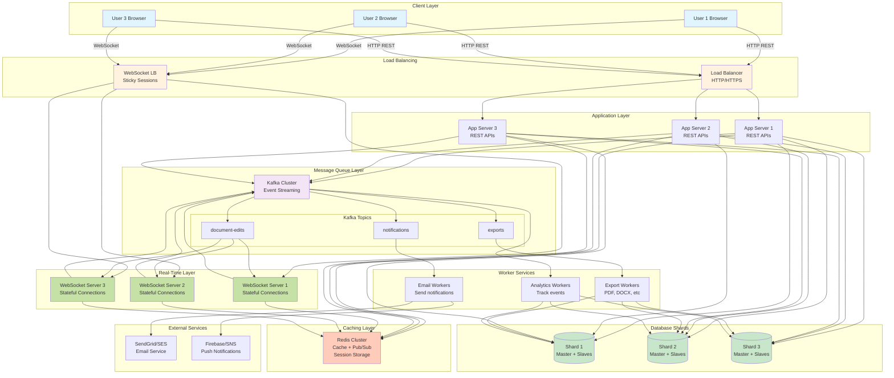
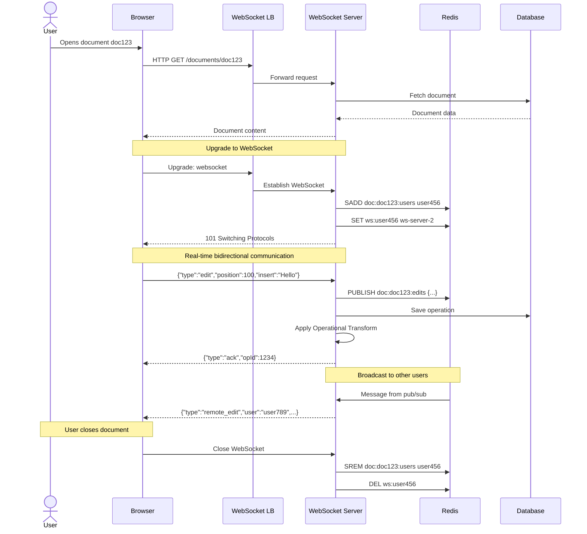
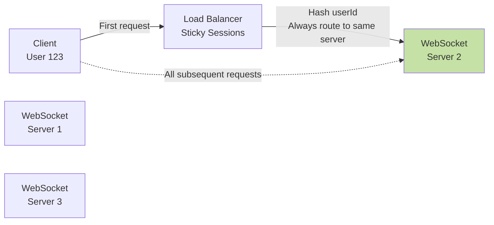
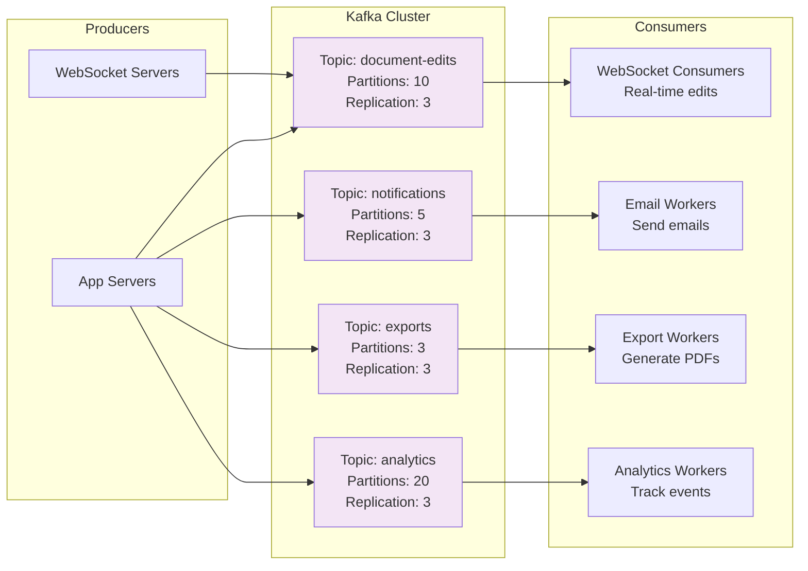

# Step 4: Real-Time Collaboration & Messaging

## What Changed from Step 3?

In Step 3, we solved database scalability with sharding and replication. But we still have critical issues:

**Remaining Problems:**
- Users must refresh to see changes (no real-time updates)
- No presence indicators (who's viewing/editing?)
- No live cursors (where are other users typing?)
- Polling for updates wastes bandwidth (request every 2 seconds)
- Email notifications are slow (users wait 30+ seconds)
- No conflict resolution when users edit simultaneously

**Step 4 Solution:**
1. **WebSocket Servers**: Bidirectional real-time communication
2. **Operational Transform (OT) / CRDT**: Conflict-free collaborative editing
3. **Message Queue (Kafka/RabbitMQ)**: Async operations like emails, notifications, exports

---

## Architecture Diagram - Step 4 (With Real-Time & Messaging)



**Key Changes:**
- **WebSocket servers** for real-time bidirectional communication
- **Redis Pub/Sub** for broadcasting messages across WebSocket servers
- **Kafka** for async operations and event streaming
- **Worker services** consuming from Kafka
- **Separate load balancer** for WebSocket (sticky sessions)

---

## Part 1: WebSocket for Real-Time Communication

### What is WebSocket?

**WebSocket** = Full-duplex bidirectional communication channel over a single TCP connection.

**HTTP (Traditional):**
```
Client → Server: "Give me document 123"
Server → Client: "Here's document 123"
[Connection closes]
```

**WebSocket:**
```
Client ⇄ Server: [Connection stays open]
Server → Client: "User 2 just edited line 5"
Client → Server: "I'm editing line 10"
Server → Client: "User 3 joined the document"
[Connection stays open for hours]
```

**Analogy:**
- **HTTP** = Sending letters. You send a letter, wait for reply, send another letter.
- **WebSocket** = Phone call. Both parties can talk anytime, line stays open.

### Why WebSocket?

**Problem with HTTP Polling:**
```javascript
// Client polls every 2 seconds
setInterval(() => {
  fetch('/api/documents/doc123/changes')
    .then(response => response.json())
    .then(changes => applyChanges(changes));
}, 2000);
```

**Issues:**
- Wastes bandwidth (99% requests return "no changes")
- High latency (up to 2 seconds before seeing changes)
- Server load (100M users × 0.5 requests/sec = 50M requests/sec!)

**With WebSocket:**
```javascript
const ws = new WebSocket('wss://docs.google.com/ws');

ws.on('message', (data) => {
  const change = JSON.parse(data);
  applyChange(change); // Instant update!
});
```

**Benefits:**
- Instant updates (<100ms latency)
- Low bandwidth (only sends when changes occur)
- Lower server load (persistent connections, no repeated handshakes)

### WebSocket Connection Flow



### WebSocket Server Implementation

**Tech Stack:**
- **Node.js + Socket.io**: Easy to use, auto-reconnect, fallback to polling
- **Go + Gorilla WebSocket**: High performance, low memory
- **Java + Spring WebSocket**: Enterprise-grade, integrates with Spring

**Example: Node.js + Socket.io**

```javascript
const express = require('express');
const http = require('http');
const socketIO = require('socket.io');
const Redis = require('ioredis');

const app = express();
const server = http.createServer(app);
const io = socketIO(server);

// Redis for Pub/Sub
const redisSubscriber = new Redis({ host: 'redis-cluster' });
const redisPublisher = new Redis({ host: 'redis-cluster' });

// Store active connections
const userSockets = new Map(); // userId → socket

io.on('connection', (socket) => {
  console.log('Client connected:', socket.id);

  // Join document room
  socket.on('join_document', async (data) => {
    const { documentId, userId, authToken } = data;

    // 1. Authenticate user
    const user = await authenticateUser(authToken);
    if (!user) {
      socket.emit('error', { message: 'Unauthorized' });
      return;
    }

    // 2. Check permissions
    const hasAccess = await checkDocumentAccess(userId, documentId);
    if (!hasAccess) {
      socket.emit('error', { message: 'Access denied' });
      return;
    }

    // 3. Join room
    socket.join(`doc:${documentId}`);
    socket.documentId = documentId;
    socket.userId = userId;

    // 4. Store user's socket
    userSockets.set(userId, socket);

    // 5. Register in Redis (for presence)
    await redisPublisher.sadd(`doc:${documentId}:users`, userId);
    await redisPublisher.setex(`ws:${userId}`, 3600, getServerInstance());

    // 6. Notify others
    socket.to(`doc:${documentId}`).emit('user_joined', {
      userId,
      userName: user.name,
      timestamp: Date.now()
    });

    // 7. Send current active users
    const activeUsers = await redisPublisher.smembers(`doc:${documentId}:users`);
    socket.emit('active_users', { users: activeUsers });

    console.log(`User ${userId} joined document ${documentId}`);
  });

  // Handle document edits
  socket.on('edit', async (operation) => {
    const { documentId, userId } = socket;

    // 1. Apply Operational Transform
    const transformedOp = await applyOperationalTransform(documentId, operation);

    // 2. Save to database
    await saveOperation(documentId, transformedOp);

    // 3. Broadcast to all users in document (via Redis Pub/Sub)
    await redisPublisher.publish(`doc:${documentId}:edits`, JSON.stringify({
      userId,
      operation: transformedOp,
      timestamp: Date.now()
    }));

    // 4. Acknowledge to sender
    socket.emit('ack', { opId: operation.id, serverOpId: transformedOp.id });
  });

  // Handle cursor position
  socket.on('cursor_move', (data) => {
    const { documentId } = socket;
    const { position } = data;

    // Broadcast to others (don't save to DB, ephemeral)
    socket.to(`doc:${documentId}`).emit('remote_cursor', {
      userId: socket.userId,
      position,
      timestamp: Date.now()
    });
  });

  // Handle disconnect
  socket.on('disconnect', async () => {
    const { documentId, userId } = socket;

    if (documentId && userId) {
      // Remove from Redis
      await redisPublisher.srem(`doc:${documentId}:users`, userId);
      await redisPublisher.del(`ws:${userId}`);

      // Notify others
      socket.to(`doc:${documentId}`).emit('user_left', {
        userId,
        timestamp: Date.now()
      });

      userSockets.delete(userId);
      console.log(`User ${userId} left document ${documentId}`);
    }
  });
});

// Subscribe to Redis Pub/Sub for cross-server communication
redisSubscriber.psubscribe('doc:*:edits', (err, count) => {
  console.log(`Subscribed to ${count} channels`);
});

redisSubscriber.on('pmessage', (pattern, channel, message) => {
  const data = JSON.parse(message);
  const documentId = channel.split(':')[1]; // Extract doc ID from "doc:doc123:edits"

  // Broadcast to all clients in this document room
  io.to(`doc:${documentId}`).emit('remote_edit', data);
});

server.listen(8080, () => {
  console.log('WebSocket server listening on port 8080');
});
```

### Sticky Sessions for WebSocket

**Problem:** WebSocket connections are stateful (long-lived connections to specific servers).

**Solution:** Load balancer uses **sticky sessions** (session affinity).



**Configuration (Nginx):**
```nginx
upstream websocket_backend {
  # Use IP hash for sticky sessions
  ip_hash;

  server ws-server-1:8080;
  server ws-server-2:8080;
  server ws-server-3:8080;
}

server {
  listen 443 ssl;
  server_name docs.google.com;

  location /ws {
    proxy_pass http://websocket_backend;
    proxy_http_version 1.1;
    proxy_set_header Upgrade $http_upgrade;
    proxy_set_header Connection "upgrade";
    proxy_set_header X-Real-IP $remote_addr;

    # Prevent timeout on long-lived connections
    proxy_read_timeout 3600s;
    proxy_send_timeout 3600s;
  }
}
```

### Connection Limits & Scaling

**Single WebSocket Server Capacity:**
```
Modern server (8 CPU, 16 GB RAM):
- Max connections: 64,000 (limited by file descriptors)
- Memory per connection: ~10 KB
- Total memory: 64K × 10 KB = 640 MB ✓
- CPU overhead: Minimal (event-driven I/O)

Recommendation: 50,000 active connections per server (safety margin)
```

**For 100 Million users with 10% concurrent:**
```
Concurrent users: 10 million
Connections per server: 50,000
Servers needed: 10M / 50K = 200 WebSocket servers

Cost:
- Instance type: c5.xlarge (4 vCPU, 8 GB RAM) = $0.17/hour
- Total: 200 × $0.17 × 730 hours = $24,820/month
```

---

## Part 2: Operational Transform (OT) for Conflict Resolution

### The Conflict Problem

**Scenario:** Two users edit the same document simultaneously.

```
Initial document: "Hello World"
                   0123456789

User A: Insert "Beautiful " at position 6
→ "Hello Beautiful World"

User B: Insert "Big " at position 6 (at same time!)
→ "Hello Big World"

Problem: Both operations reference position 6!
If we apply both:
→ "Hello Big Beautiful World" ❌ Wrong!
or
→ "Hello Beautiful Big World" ❌ Wrong!

We need consistent result for both users.
```

### What is Operational Transform?

**Operational Transform (OT)** = Algorithm that transforms concurrent operations so they can be applied in any order and produce the same result.

**Analogy:**
Think of two people editing a Word document:
- Person A inserts a paragraph at line 5
- Person B deletes a word at line 10

If Person B's delete is applied first, line numbers shift. OT adjusts Person A's position accordingly.

### OT Algorithm

**Three Operation Types:**
1. **Insert(position, text)**: Insert text at position
2. **Delete(position, length)**: Delete length characters at position
3. **Retain(length)**: Skip length characters

**Example:**

```javascript
// Initial document
const doc = "Hello World";
//            0123456789AB

// User A operation (local)
const opA = { type: 'insert', position: 6, text: 'Big ' };

// User B operation (remote, happened concurrently)
const opB = { type: 'insert', position: 6, text: 'Beautiful ' };

// Transform opA against opB
function transformInsertInsert(opA, opB) {
  if (opA.position < opB.position) {
    // opA is before opB, no change needed
    return opA;
  } else if (opA.position > opB.position) {
    // opA is after opB, adjust position
    return {
      ...opA,
      position: opA.position + opB.text.length
    };
  } else {
    // Same position, use tiebreaker (e.g., user ID)
    if (opA.userId < opB.userId) {
      return opA; // opA goes first
    } else {
      return {
        ...opA,
        position: opA.position + opB.text.length
      };
    }
  }
}

// Result: opA position becomes 6 + 10 = 16
// Apply opB first: "Hello Beautiful World"
// Apply transformed opA: "Hello Beautiful Big World" ✓ Consistent!
```

**Full OT Transform Matrix:**

| Local Op ↓ / Remote Op → | Insert | Delete | Retain |
|---------------------------|--------|--------|--------|
| **Insert** | Adjust position | Adjust position | No change |
| **Delete** | Adjust position & length | Check overlap | No change |
| **Retain** | Adjust length | Adjust length | No change |

### OT Implementation

```javascript
class OperationalTransform {
  constructor() {
    this.serverOperations = []; // History of all operations
    this.version = 0;
  }

  // Transform local operation against concurrent remote operations
  transform(localOp, remoteOps) {
    let transformedOp = { ...localOp };

    for (const remoteOp of remoteOps) {
      transformedOp = this.transformPair(transformedOp, remoteOp);
    }

    return transformedOp;
  }

  // Transform one operation against another
  transformPair(opA, opB) {
    // Both insert
    if (opA.type === 'insert' && opB.type === 'insert') {
      if (opA.position < opB.position) {
        return opA; // No change
      } else if (opA.position > opB.position) {
        return { ...opA, position: opA.position + opB.text.length };
      } else {
        // Same position, tiebreaker
        return opA.userId < opB.userId
          ? opA
          : { ...opA, position: opA.position + opB.text.length };
      }
    }

    // Insert vs Delete
    if (opA.type === 'insert' && opB.type === 'delete') {
      if (opA.position <= opB.position) {
        return opA; // Insert before delete, no change
      } else if (opA.position > opB.position + opB.length) {
        return { ...opA, position: opA.position - opB.length }; // After delete
      } else {
        // Insert inside deleted range, adjust to start of delete
        return { ...opA, position: opB.position };
      }
    }

    // Delete vs Insert
    if (opA.type === 'delete' && opB.type === 'insert') {
      if (opA.position < opB.position) {
        return opA; // Delete before insert, no change
      } else {
        return { ...opA, position: opA.position + opB.text.length };
      }
    }

    // Both delete (complex, handle overlap)
    if (opA.type === 'delete' && opB.type === 'delete') {
      // Simplified: adjust position and length based on overlap
      const startA = opA.position;
      const endA = opA.position + opA.length;
      const startB = opB.position;
      const endB = opB.position + opB.length;

      if (endA <= startB) {
        return opA; // No overlap, A before B
      } else if (startA >= endB) {
        return { ...opA, position: opA.position - opB.length }; // A after B
      } else {
        // Overlap, complex logic (omitted for brevity)
        // In production, use library like ShareDB or OT.js
        return this.handleDeleteOverlap(opA, opB);
      }
    }

    return opA;
  }

  // Apply operation to document
  apply(document, operation) {
    if (operation.type === 'insert') {
      return (
        document.slice(0, operation.position) +
        operation.text +
        document.slice(operation.position)
      );
    } else if (operation.type === 'delete') {
      return (
        document.slice(0, operation.position) +
        document.slice(operation.position + operation.length)
      );
    }
    return document;
  }

  // Process incoming operation from client
  async processOperation(documentId, clientOp, clientVersion) {
    // 1. Fetch operations since client's version
    const missedOps = this.serverOperations.filter(
      (op) => op.version > clientVersion && op.version <= this.version
    );

    // 2. Transform client operation against missed operations
    const transformedOp = this.transform(clientOp, missedOps);

    // 3. Apply to server document
    const document = await getDocument(documentId);
    const newDocument = this.apply(document.content, transformedOp);

    // 4. Save operation and new document
    transformedOp.version = ++this.version;
    this.serverOperations.push(transformedOp);
    await saveDocument(documentId, newDocument, this.version);

    // 5. Broadcast to other clients
    await broadcastOperation(documentId, transformedOp);

    return transformedOp;
  }
}
```

### Alternative: CRDT (Conflict-free Replicated Data Types)

**CRDT** = Data structure that automatically resolves conflicts without coordination.

**Pros over OT:**
- No central server needed (peer-to-peer possible)
- Simpler to implement (no transform logic)
- Commutative (operations can apply in any order)

**Cons:**
- Larger data size (metadata overhead)
- Memory intensive
- Complex for rich text (formatting, nested structures)

**When to use:**
- **OT**: Google Docs (real-time, server-coordinated, complex formatting)
- **CRDT**: Figma, Notion (peer-to-peer, simpler data structures)

**Example CRDT Library:**
- Yjs: https://github.com/yjs/yjs
- Automerge: https://github.com/automerge/automerge

---

## Part 3: Message Queue (Kafka) for Async Operations

### Why Message Queue?

**Problem:** Some operations are slow and should not block user:
- Sending email notifications (500ms)
- Generating PDF export (5 seconds)
- Processing analytics events (100ms)
- Sending push notifications (200ms)

**Without Message Queue:**
```javascript
app.post('/api/documents/:id/share', async (req, res) => {
  await shareDocument(req.params.id, req.body.email);
  await sendEmail(req.body.email, 'Document shared'); // Blocks for 500ms!
  res.json({ success: true });
});

// User waits 500ms for email to send ❌
```

**With Message Queue:**
```javascript
app.post('/api/documents/:id/share', async (req, res) => {
  await shareDocument(req.params.id, req.body.email);
  await kafka.publish('notifications', {
    type: 'document_shared',
    email: req.body.email,
    documentId: req.params.id
  });
  res.json({ success: true }); // Immediate response!
});

// Background worker sends email asynchronously ✓
```

### Kafka vs RabbitMQ

| Feature | Kafka | RabbitMQ |
|---------|-------|----------|
| **Model** | Publish-Subscribe, Log | Queue, Pub-Sub, RPC |
| **Throughput** | Very high (millions/sec) | High (thousands/sec) |
| **Latency** | ~10ms | ~1ms |
| **Persistence** | Always (durable log) | Optional |
| **Retention** | Days/weeks | Until consumed |
| **Use Case** | Event streaming, logs | Task queues, RPC |
| **Ordering** | Per partition | Per queue |
| **Replay** | Yes (rewind to offset) | No (consumed = deleted) |

**We choose Kafka** because:
- High throughput (handle millions of edits/sec)
- Event replay (reprocess analytics)
- Durable log (audit trail)

### Kafka Topics



### Kafka Implementation

**Producer (App Server):**

```javascript
const { Kafka } = require('kafkajs');

const kafka = new Kafka({
  clientId: 'google-docs-app',
  brokers: ['kafka1:9092', 'kafka2:9092', 'kafka3:9092']
});

const producer = kafka.producer();

// Publish document edit event
async function publishDocumentEdit(documentId, userId, operation) {
  await producer.send({
    topic: 'document-edits',
    messages: [
      {
        key: documentId, // Partition by document ID
        value: JSON.stringify({
          documentId,
          userId,
          operation,
          timestamp: Date.now()
        })
      }
    ]
  });
}

// Publish notification event
async function publishNotification(userId, type, data) {
  await producer.send({
    topic: 'notifications',
    messages: [
      {
        key: userId, // Partition by user ID
        value: JSON.stringify({
          userId,
          type, // 'email', 'push', 'in_app'
          data,
          timestamp: Date.now()
        })
      }
    ]
  });
}

// Publish export request
async function publishExportRequest(documentId, userId, format) {
  await producer.send({
    topic: 'exports',
    messages: [
      {
        key: documentId,
        value: JSON.stringify({
          documentId,
          userId,
          format, // 'pdf', 'docx', 'txt'
          timestamp: Date.now()
        })
      }
    ]
  });
}
```

**Consumer (Email Worker):**

```javascript
const consumer = kafka.consumer({ groupId: 'email-workers' });

async function startEmailWorker() {
  await consumer.connect();
  await consumer.subscribe({ topic: 'notifications', fromBeginning: false });

  await consumer.run({
    eachMessage: async ({ topic, partition, message }) => {
      const event = JSON.parse(message.value.toString());

      try {
        if (event.type === 'email') {
          await sendEmail(event.userId, event.data);
          console.log(`Email sent to user ${event.userId}`);
        } else if (event.type === 'push') {
          await sendPushNotification(event.userId, event.data);
          console.log(`Push notification sent to user ${event.userId}`);
        }
      } catch (error) {
        console.error('Failed to process notification:', error);
        // Dead letter queue for failed messages
        await producer.send({
          topic: 'notifications-dlq',
          messages: [message]
        });
      }
    }
  });
}

async function sendEmail(userId, data) {
  const user = await getUser(userId);
  const { subject, body } = data;

  // Use SendGrid, AWS SES, etc.
  await sendgrid.send({
    to: user.email,
    from: 'noreply@docs.google.com',
    subject,
    html: body
  });
}
```

**Consumer (Export Worker):**

```javascript
const consumer = kafka.consumer({ groupId: 'export-workers' });

async function startExportWorker() {
  await consumer.connect();
  await consumer.subscribe({ topic: 'exports', fromBeginning: false });

  await consumer.run({
    eachMessage: async ({ topic, partition, message }) => {
      const event = JSON.parse(message.value.toString());
      const { documentId, userId, format } = event;

      try {
        // 1. Fetch document
        const document = await getDocument(documentId);

        // 2. Generate export
        let file;
        if (format === 'pdf') {
          file = await generatePDF(document);
        } else if (format === 'docx') {
          file = await generateDOCX(document);
        } else if (format === 'txt') {
          file = document.content;
        }

        // 3. Upload to S3
        const s3Key = `exports/${documentId}/${Date.now()}.${format}`;
        await s3.upload({
          Bucket: 'google-docs-exports',
          Key: s3Key,
          Body: file
        });

        // 4. Generate signed URL
        const downloadUrl = await s3.getSignedUrl('getObject', {
          Bucket: 'google-docs-exports',
          Key: s3Key,
          Expires: 3600 // 1 hour
        });

        // 5. Notify user
        await publishNotification(userId, 'email', {
          subject: 'Your document export is ready',
          body: `Download your ${format.toUpperCase()} file: ${downloadUrl}`
        });

        console.log(`Export completed for document ${documentId}`);
      } catch (error) {
        console.error('Export failed:', error);
      }
    }
  });
}
```

### Kafka Partitioning Strategy

**Why Partitions?**
- Parallel processing (multiple consumers)
- Ordering guarantee (within partition)
- Load distribution

**Partition by Document ID:**
```javascript
// All edits for same document go to same partition
// Ensures ordering of operations per document
await producer.send({
  topic: 'document-edits',
  messages: [{
    key: documentId, // Kafka uses key to determine partition
    value: JSON.stringify(operation)
  }]
});

// Kafka logic: partition = hash(key) % numPartitions
```

**Consumer Group:**
```
Topic: document-edits (10 partitions)
Consumer Group: websocket-consumers (10 consumers)

Each consumer handles 1 partition:
- Consumer 1 → Partition 0
- Consumer 2 → Partition 1
- ...
- Consumer 10 → Partition 9

Total throughput: 10x single consumer
```

---

## Performance Metrics

### WebSocket Metrics

```
With 10 million concurrent users:
- WebSocket servers: 200 (50K connections each)
- Memory usage: 200 × 640 MB = 128 GB total
- Bandwidth per user: ~1 KB/sec (edits only)
- Total bandwidth: 10M × 1 KB/sec = 10 GB/sec
- Cost: $24,820/month (c5.xlarge instances)
```

### Kafka Metrics

```
Events per second:
- Document edits: 50,000 ops/sec
- Notifications: 10,000 events/sec
- Exports: 1,000 requests/sec
- Analytics: 100,000 events/sec
Total: 161,000 events/sec

Kafka cluster:
- Brokers: 5
- Topics: 4
- Total partitions: 38
- Replication factor: 3
- Throughput: 1M messages/sec (plenty of headroom)
- Cost: $3,500/month (m5.large instances)
```

---

## Trade-offs

### Pros ✅

1. **Real-Time Updates**: Instant collaboration (<100ms latency)
2. **Scalable**: WebSocket servers scale horizontally
3. **Async Operations**: Non-blocking user experience
4. **Event Replay**: Kafka allows reprocessing events
5. **Decoupled**: Services communicate via message queue

### Cons ❌

1. **Stateful Connections**: WebSocket servers require sticky sessions
2. **Complex**: OT algorithm is complex to implement correctly
3. **Redis Dependency**: Pub/Sub requires Redis cluster
4. **Higher Costs**: 200 WebSocket servers + Kafka cluster
5. **Connection Limits**: Max 64K connections per server

---

## Monitoring & Alerts

### WebSocket Metrics

```
1. Active Connections
   - Current: 2.5M
   - Alert if < 100K (servers down?) or > 9M (approaching limit)

2. Message Latency
   - P50: 50ms
   - P99: 200ms
   - Alert if P99 > 500ms

3. Reconnection Rate
   - Normal: 1% per minute
   - Alert if > 5% (network issues)

4. Failed Authentications
   - Normal: <0.1%
   - Alert if > 1% (attack?)
```

### Kafka Metrics

```
1. Consumer Lag
   - Current: 0 (consumers keeping up)
   - Alert if lag > 10,000 messages (consumers slow/down)

2. Partition Distribution
   - Check even distribution across partitions
   - Alert if skew > 20% (hot partition)

3. Replication Lag
   - Normal: <10ms
   - Alert if > 100ms (network issues)

4. Disk Usage
   - Retention: 7 days
   - Alert if disk > 80% (increase retention or storage)
```

---

## Key Takeaways

1. **WebSocket for Real-Time**: Persistent connections enable instant updates
2. **Sticky Sessions Required**: WebSocket connections are stateful
3. **OT/CRDT for Conflicts**: Essential for collaborative editing
4. **Kafka for Async**: Decouple slow operations from user requests
5. **Redis Pub/Sub**: Broadcast messages across WebSocket servers
6. **Partition by Document**: Ensures ordering of operations
7. **Monitor Consumer Lag**: Kafka consumers must keep up with producers

---

## Next Steps

We now have real-time collaboration and async processing, but we're still missing:
- **CDN** for static assets (JavaScript, CSS, images)
- **Object storage** for document exports and user uploads
- **Global distribution** for low latency worldwide

In **Step 5**, we'll add:
- **CloudFront CDN** for static asset delivery
- **S3** for document storage and exports
- **Multi-region deployment** for global users

→ Continue to [Step 5: CDN & Storage](./06_step5_cdn_and_storage.md)
