# Step 5: CDN & Object Storage

## What Changed from Step 4?

In Step 4, we added real-time collaboration and async processing. But we still have issues:

**Remaining Problems:**
- Static assets (JS, CSS, images) loaded from app servers (slow, wasteful)
- Users in Asia experience high latency connecting to US servers (200ms+)
- Document exports stored in database (expensive, slow)
- User-uploaded images in database (not scalable)
- No caching at edge (every request travels to origin)
- Bandwidth costs high (app servers serve all static content)

**Step 5 Solution:**
1. **CDN (Content Delivery Network)**: Cache static assets at edge locations worldwide
2. **Object Storage (S3)**: Store documents, exports, images, user uploads
3. **Multi-Region Deployment**: Serve users from nearest data center

---

## Architecture Diagram - Step 5 (With CDN & Storage)


**Key Changes:**
- **CDN (CloudFront)** with edge locations worldwide
- **S3** for static assets and object storage
- **Multi-region deployment** (US, Europe, Asia)
- **Cross-region replication** for S3 and databases
- **Geo-based DNS routing** to nearest region

---

## Part 1: Content Delivery Network (CDN)

### What is a CDN?

**CDN** = Network of servers distributed globally that cache and serve content from the nearest location to the user.

**Analogy:**
Instead of one central warehouse shipping to the whole world, you have warehouses in every major city. Customers get their orders from the nearest warehouse.

**Without CDN:**
```
User in Tokyo → Request → San Francisco Server (200ms latency)
User in London → Request → San Francisco Server (150ms latency)
User in New York → Request → San Francisco Server (50ms latency)

All requests travel long distances!
```

**With CDN:**
```
User in Tokyo → CDN Edge (Tokyo) → 5ms latency ✓
User in London → CDN Edge (London) → 5ms latency ✓
User in New York → CDN Edge (New York) → 5ms latency ✓

Content served from nearby edge location!
```

### How CDN Works

```mermaid
sequenceDiagram
    actor User
    participant Edge as CDN Edge<br/>(Tokyo)
    participant Origin as Origin Server<br/>(US)

    Note over User,Origin: First Request (Cache MISS)
    User->>Edge: GET /static/app.js
    Edge->>Edge: Check cache (MISS)
    Edge->>Origin: GET /static/app.js
    Origin-->>Edge: app.js (1 MB)
    Edge->>Edge: Cache for 1 year
    Edge-->>User: app.js (200ms latency)

    Note over User,Origin: Subsequent Requests (Cache HIT)
    User->>Edge: GET /static/app.js
    Edge->>Edge: Check cache (HIT!)
    Edge-->>User: app.js (5ms latency) ✓

    Note over User,Edge: 40x faster!
```



### What to Cache on CDN

**Static Assets (Long Cache):**
```
✅ Cache Forever (1 year TTL):
- JavaScript bundles: app.js, vendor.js
- CSS stylesheets: styles.css
- Images: logo.png, icons.svg
- Fonts: roboto.woff2
- Favicon: favicon.ico

Strategy: Use content hash in filename
- app.a3f2c1.js (hash changes when content changes)
- Old versions cached independently
- No cache invalidation needed!
```

**Dynamic Content (Short Cache or No Cache):**
```
❌ Do NOT Cache:
- API responses: /api/documents/doc123
- User-specific data: /api/users/me
- Real-time data: WebSocket connections

⚠️ Cache Briefly (10 seconds):
- Document thumbnails: /thumbnails/doc123.png
- User avatars: /avatars/user456.jpg
```

### CDN Configuration (CloudFront)

**S3 Bucket for Static Assets:**
```
s3://google-docs-static/
├── js/
│   ├── app.a3f2c1.js
│   ├── vendor.b5e3d2.js
│   └── worker.c7f4e1.js
├── css/
│   ├── styles.d8g5f2.css
│   └── print.e9h6g3.css
├── images/
│   ├── logo.png
│   ├── icons.svg
│   └── hero.jpg
└── fonts/
    ├── roboto-regular.woff2
    └── roboto-bold.woff2
```

**CloudFront Distribution:**
```javascript
// AWS CloudFront configuration
{
  "Origins": [
    {
      "Id": "S3-google-docs-static",
      "DomainName": "google-docs-static.s3.amazonaws.com",
      "S3OriginConfig": {
        "OriginAccessIdentity": "origin-access-identity/cloudfront/ABCDEF123456"
      }
    }
  ],
  "DefaultCacheBehavior": {
    "TargetOriginId": "S3-google-docs-static",
    "ViewerProtocolPolicy": "redirect-to-https",
    "AllowedMethods": ["GET", "HEAD", "OPTIONS"],
    "CachedMethods": ["GET", "HEAD"],
    "ForwardedValues": {
      "QueryString": false,
      "Cookies": { "Forward": "none" }
    },
    "Compress": true, // Enable gzip/brotli
    "MinTTL": 31536000, // 1 year
    "DefaultTTL": 31536000,
    "MaxTTL": 31536000
  },
  "CacheBehaviors": [
    {
      // Different behavior for thumbnails
      "PathPattern": "/thumbnails/*",
      "TargetOriginId": "S3-google-docs-static",
      "MinTTL": 10, // 10 seconds
      "DefaultTTL": 60,
      "MaxTTL": 3600
    }
  ],
  "PriceClass": "PriceClass_All", // Use all edge locations
  "ViewerCertificate": {
    "ACMCertificateArn": "arn:aws:acm:us-east-1:123456789012:certificate/...",
    "SSLSupportMethod": "sni-only"
  }
}
```

**DNS Configuration:**
```
# Route 53 DNS
docs.google.com         CNAME   d123456.cloudfront.net
static.docs.google.com  CNAME   d789012.cloudfront.net
```

### Cache Invalidation

**Problem:** Updated a file but CDN serves old cached version.

**Solutions:**

**1. Content Hashing (Recommended):**
```javascript
// Webpack configuration
module.exports = {
  output: {
    filename: '[name].[contenthash].js', // Hash changes when content changes
    path: path.resolve(__dirname, 'dist')
  }
};

// index.html references new hashed file
<script src="/js/app.a3f2c1.js"></script>

// After update:
<script src="/js/app.b4g3d2.js"></script> // Different hash!

// Old version (app.a3f2c1.js) remains cached (for users not refreshed yet)
// New version (app.b4g3d2.js) fetched on first request
```

**2. Cache Invalidation (Emergency Only):**
```javascript
// AWS SDK
const cloudfront = new AWS.CloudFront();

await cloudfront.createInvalidation({
  DistributionId: 'E1A2B3C4D5E6F',
  InvalidationBatch: {
    CallerReference: Date.now().toString(),
    Paths: {
      Quantity: 2,
      Items: [
        '/js/app.*.js',  // Invalidate all app.js versions
        '/css/styles.*.css'
      ]
    }
  }
}).promise();

// Cost: $0.005 per path (first 1,000 free per month)
// Time: 10-15 minutes to propagate globally
```

### CDN Performance Gains

**Before CDN:**
```
User in Tokyo:
- Request: Tokyo → San Francisco (200ms)
- Download: 2 MB @ 10 Mbps = 1.6 seconds
- Total: 1.8 seconds

User in London:
- Request: London → San Francisco (150ms)
- Download: 2 MB @ 10 Mbps = 1.6 seconds
- Total: 1.75 seconds
```

**After CDN:**
```
User in Tokyo:
- Request: Tokyo → Tokyo Edge (5ms)
- Download: 2 MB @ 100 Mbps = 160ms (faster connection)
- Total: 165ms

Improvement: 1,800ms → 165ms = 10.9x faster! 🚀

User in London:
- Request: London → London Edge (5ms)
- Download: 2 MB @ 100 Mbps = 160ms
- Total: 165ms

Improvement: 1,750ms → 165ms = 10.6x faster! 🚀
```

**Bandwidth Cost Savings:**
```
Without CDN:
- App servers serve 100M requests/day
- Average size: 500 KB
- Total: 50 TB/day
- AWS bandwidth cost: $0.09/GB = $4,500/day = $135,000/month

With CDN:
- 95% cache hit rate
- Origin serves only 5M requests/day (5%)
- Total origin bandwidth: 2.5 TB/day
- AWS bandwidth cost: $0.09/GB = $225/day = $6,750/month
- CDN cost: $0.085/GB = $127,500/month

Wait, CDN costs more? Not quite!
- CloudFront pricing: $0.085/GB for first 10 TB, $0.080 for next 40 TB, $0.060 for next 100 TB...
- With 1,500 TB/month volume: ~$0.03/GB average
- CDN cost: 1,500 TB × $0.03/GB = $45,000/month

Total cost: $6,750 (origin) + $45,000 (CDN) = $51,750/month
Savings: $135,000 - $51,750 = $83,250/month saved! ✓
```

---

## Part 2: Object Storage (S3)

### What is Object Storage?

**Object Storage** = Store files (objects) as blobs with metadata, accessed via HTTP API.

**vs File System:**
- File System: `/var/www/uploads/user123/photo.jpg` (hierarchical)
- Object Storage: `s3://bucket/user123/photo.jpg` (flat namespace, fake hierarchy)

**vs Database:**
- Database: Store file as BLOB in row (max 64 MB in MySQL)
- Object Storage: Store file as object (max 5 TB in S3)

**Analogy:**
Object storage is like a giant warehouse where each item has a unique barcode (key). You don't care where it's physically stored; you just retrieve it by barcode.

### Why S3 for Google Docs?

**Use Cases:**
1. **Document Exports**: PDF, DOCX, TXT files generated by workers
2. **User Uploads**: Images embedded in documents
3. **Document Versions**: Historical snapshots of documents
4. **Thumbnails**: Preview images of documents
5. **Static Assets**: JavaScript, CSS (origin for CDN)

**Benefits:**
- **Scalable**: Store petabytes of data
- **Durable**: 99.999999999% (11 nines) durability
- **Cheap**: $0.023/GB/month (vs $0.10/GB for EBS, $2.50/GB for RDS)
- **HTTP API**: Easy to integrate (no database connection needed)
- **Versioning**: Keep old versions automatically
- **Lifecycle Policies**: Auto-delete or archive old files

### S3 Bucket Structure

```
s3://google-docs-documents/
├── exports/
│   ├── doc123/
│   │   ├── 2025-01-15_export.pdf
│   │   ├── 2025-01-15_export.docx
│   │   └── 2025-01-16_export.pdf
│   └── doc456/
│       └── 2025-01-17_export.pdf
├── uploads/
│   ├── user123/
│   │   ├── image1.png (5 MB)
│   │   ├── image2.jpg (3 MB)
│   │   └── document.pdf (10 MB)
│   └── user456/
│       └── logo.svg (100 KB)
├── thumbnails/
│   ├── doc123_thumb.png
│   ├── doc456_thumb.png
│   └── doc789_thumb.png
└── versions/
    ├── doc123/
    │   ├── v1_2025-01-01.json
    │   ├── v2_2025-01-02.json
    │   └── v3_2025-01-03.json
    └── doc456/
        └── v1_2025-01-05.json
```

### S3 Operations

**Upload File (From App Server):**
```javascript
const AWS = require('aws-sdk');
const s3 = new AWS.S3();

// Upload user image
async function uploadUserImage(userId, file) {
  const key = `uploads/${userId}/${Date.now()}_${file.name}`;

  const params = {
    Bucket: 'google-docs-documents',
    Key: key,
    Body: file.buffer,
    ContentType: file.mimetype,
    ACL: 'private', // Not publicly accessible
    Metadata: {
      'user-id': userId,
      'original-name': file.name
    }
  };

  const result = await s3.upload(params).promise();

  return {
    url: result.Location,
    key: result.Key,
    etag: result.ETag
  };
}

// Usage
app.post('/api/uploads', upload.single('file'), async (req, res) => {
  const userId = req.user.id;
  const file = req.file;

  const uploaded = await uploadUserImage(userId, file);

  res.json({
    success: true,
    fileUrl: uploaded.url,
    fileKey: uploaded.key
  });
});
```

**Generate Presigned URL (Direct Upload from Client):**
```javascript
// Client requests presigned URL
app.post('/api/uploads/presigned-url', async (req, res) => {
  const userId = req.user.id;
  const { filename, contentType } = req.body;

  const key = `uploads/${userId}/${Date.now()}_${filename}`;

  // Generate presigned URL (valid for 5 minutes)
  const presignedUrl = s3.getSignedUrl('putObject', {
    Bucket: 'google-docs-documents',
    Key: key,
    ContentType: contentType,
    Expires: 300, // 5 minutes
    ACL: 'private'
  });

  res.json({
    uploadUrl: presignedUrl,
    key: key
  });
});

// Client uploads directly to S3 (no bandwidth through app server!)
// JavaScript in browser:
async function uploadFile(file) {
  // 1. Request presigned URL
  const response = await fetch('/api/uploads/presigned-url', {
    method: 'POST',
    headers: { 'Content-Type': 'application/json' },
    body: JSON.stringify({
      filename: file.name,
      contentType: file.type
    })
  });

  const { uploadUrl, key } = await response.json();

  // 2. Upload directly to S3
  await fetch(uploadUrl, {
    method: 'PUT',
    body: file,
    headers: {
      'Content-Type': file.type
    }
  });

  console.log('File uploaded:', key);
}
```

**Download File (Presigned URL):**
```javascript
// Generate download URL (valid for 1 hour)
async function getDocumentExport(documentId, format) {
  const key = `exports/${documentId}/latest.${format}`;

  const presignedUrl = s3.getSignedUrl('getObject', {
    Bucket: 'google-docs-documents',
    Key: key,
    Expires: 3600, // 1 hour
    ResponseContentDisposition: `attachment; filename="document.${format}"`
  });

  return presignedUrl;
}

// API endpoint
app.get('/api/documents/:id/export/:format', async (req, res) => {
  const { id, format } = req.params;
  const userId = req.user.id;

  // Check permissions
  const hasAccess = await checkDocumentAccess(userId, id);
  if (!hasAccess) {
    return res.status(403).json({ error: 'Access denied' });
  }

  // Generate presigned URL
  const downloadUrl = await getDocumentExport(id, format);

  res.json({ downloadUrl });
});
```

### S3 Lifecycle Policies

**Problem:** Exports and old versions accumulate, costing money.

**Solution:** Lifecycle policies automatically delete or archive old files.

```javascript
// S3 Lifecycle Configuration
{
  "Rules": [
    {
      "Id": "Delete old exports after 30 days",
      "Prefix": "exports/",
      "Status": "Enabled",
      "Expiration": {
        "Days": 30
      }
    },
    {
      "Id": "Archive old versions to Glacier after 90 days",
      "Prefix": "versions/",
      "Status": "Enabled",
      "Transitions": [
        {
          "Days": 90,
          "StorageClass": "GLACIER" // $0.004/GB/month (vs $0.023 for S3)
        }
      ]
    },
    {
      "Id": "Delete thumbnails after 7 days",
      "Prefix": "thumbnails/",
      "Status": "Enabled",
      "Expiration": {
        "Days": 7
      }
    }
  ]
}
```

**Cost Savings:**
```
Without Lifecycle Policies:
- Exports: 100,000 files/day × 2 MB = 200 GB/day
- After 1 year: 73 TB
- Cost: 73 TB × $0.023/GB = $1,679/month

With Lifecycle Policies (delete after 30 days):
- Exports: 30 days × 200 GB/day = 6 TB
- Cost: 6 TB × $0.023/GB = $138/month

Savings: $1,679 - $138 = $1,541/month ✓
```

### S3 Cross-Region Replication

**Why:** Serve users from nearest region (low latency).

**How:**
```
Primary bucket: s3://google-docs-documents (us-east-1)
Replicas:
- s3://google-docs-documents-eu (eu-west-1)
- s3://google-docs-documents-ap (ap-southeast-1)

Replication lag: 5-15 minutes (eventual consistency)
```

**Configuration:**
```javascript
{
  "Role": "arn:aws:iam::123456789012:role/s3-replication",
  "Rules": [
    {
      "Status": "Enabled",
      "Priority": 1,
      "Filter": {},
      "Destination": {
        "Bucket": "arn:aws:s3:::google-docs-documents-eu",
        "ReplicationTime": {
          "Status": "Enabled",
          "Time": { "Minutes": 15 }
        }
      }
    },
    {
      "Status": "Enabled",
      "Priority": 2,
      "Filter": {},
      "Destination": {
        "Bucket": "arn:aws:s3:::google-docs-documents-ap",
        "ReplicationTime": {
          "Status": "Enabled",
          "Time": { "Minutes": 15 }
        }
      }
    }
  ]
}
```

**Read from Nearest Bucket:**
```javascript
// Determine user's region
function getUserRegion(req) {
  const ip = req.headers['x-forwarded-for'] || req.connection.remoteAddress;
  // Use GeoIP lookup (MaxMind, IP2Location, etc.)
  const region = geoip.lookup(ip).region; // 'us-east-1', 'eu-west-1', etc.
  return region;
}

// Get appropriate S3 client
function getS3Client(region) {
  const buckets = {
    'us-east-1': 'google-docs-documents',
    'eu-west-1': 'google-docs-documents-eu',
    'ap-southeast-1': 'google-docs-documents-ap'
  };

  return new AWS.S3({
    region: region,
    params: { Bucket: buckets[region] }
  });
}

// Download file from nearest bucket
app.get('/api/documents/:id/export/:format', async (req, res) => {
  const userRegion = getUserRegion(req);
  const s3 = getS3Client(userRegion);

  const key = `exports/${req.params.id}/latest.${req.params.format}`;
  const presignedUrl = s3.getSignedUrl('getObject', {
    Key: key,
    Expires: 3600
  });

  res.json({ downloadUrl: presignedUrl });
});
```

---

## Part 3: Multi-Region Deployment

### Why Multi-Region?

**Problem:** Users far from your data center experience high latency.

```
Tokyo user → US data center:
- Latency: 150-200ms per request
- Real-time editing feels sluggish
- Poor user experience
```

**Solution:** Deploy in multiple regions worldwide.

```
Tokyo user → Asia-Pacific data center:
- Latency: 5-20ms per request
- Real-time editing feels instant
- Great user experience ✓
```

### Region Selection

**Criteria:**
1. **User Distribution**: Where are your users?
2. **AWS Availability**: Which regions have all required services?
3. **Compliance**: GDPR (EU data must stay in EU), CCPA, etc.
4. **Cost**: Some regions are more expensive

**Our Regions:**
1. **us-east-1** (N. Virginia): Primary, largest user base
2. **eu-west-1** (Ireland): GDPR compliance, European users
3. **ap-southeast-1** (Singapore): Asian users

### Geo-Based DNS Routing

**Route 53 Configuration:**
```javascript
{
  "HostedZoneId": "Z1234567890ABC",
  "ChangeBatch": {
    "Changes": [
      {
        "Action": "CREATE",
        "ResourceRecordSet": {
          "Name": "docs.google.com",
          "Type": "A",
          "GeoLocation": { "ContinentCode": "NA" }, // North America
          "AliasTarget": {
            "HostedZoneId": "Z1234567890ABC",
            "DNSName": "us-east-1-lb.elb.amazonaws.com"
          },
          "SetIdentifier": "US"
        }
      },
      {
        "Action": "CREATE",
        "ResourceRecordSet": {
          "Name": "docs.google.com",
          "Type": "A",
          "GeoLocation": { "ContinentCode": "EU" }, // Europe
          "AliasTarget": {
            "DNSName": "eu-west-1-lb.elb.amazonaws.com"
          },
          "SetIdentifier": "EU"
        }
      },
      {
        "Action": "CREATE",
        "ResourceRecordSet": {
          "Name": "docs.google.com",
          "Type": "A",
          "GeoLocation": { "ContinentCode": "AS" }, // Asia
          "AliasTarget": {
            "DNSName": "ap-southeast-1-lb.elb.amazonaws.com"
          },
          "SetIdentifier": "AP"
        }
      },
      {
        "Action": "CREATE",
        "ResourceRecordSet": {
          "Name": "docs.google.com",
          "Type": "A",
          "GeoLocation": { "Default": true }, // Fallback
          "AliasTarget": {
            "DNSName": "us-east-1-lb.elb.amazonaws.com"
          },
          "SetIdentifier": "Default"
        }
      }
    ]
  }
}
```

**How it works:**
```
User in Tokyo:
1. DNS query: "What's the IP for docs.google.com?"
2. Route 53: "You're in Asia, here's ap-southeast-1 IP"
3. User connects to Asia-Pacific region ✓

User in Paris:
1. DNS query: "What's the IP for docs.google.com?"
2. Route 53: "You're in Europe, here's eu-west-1 IP"
3. User connects to Europe region ✓
```

### Data Replication Strategy

**Challenge:** Document edited in US must be accessible in Europe/Asia.

**Solution 1: Primary Region with Read Replicas (Our Choice)**
```
Write Path:
- All writes go to primary region (us-east-1)
- Database replicates to EU and Asia (10-100ms lag)
- Ensures strong consistency for writes

Read Path:
- Reads from local region (low latency)
- May see slightly stale data (eventual consistency)
```


**Solution 2: Multi-Master (Complex, Not Recommended)**
```
- Each region can accept writes
- Conflict resolution required (last-write-wins, CRDT, etc.)
- Much more complex to implement
- Risk of data inconsistency
```

### Handling Cross-Region Collaboration

**Scenario:** User in US and user in Asia editing same document.


**Key Points:**
- **Writes always go to primary** (us-east-1) for consistency
- **Cross-region writes have higher latency** (50-100ms)
- **Kafka replicates across regions** for real-time notifications
- **WebSocket connection stays in user's region** (low latency for notifications)

---

## Performance & Cost Analysis

### CDN Performance

```
Static Assets (2 MB per page load):
- Without CDN: 200ms (download from origin)
- With CDN: 20ms (edge cache hit)
- Improvement: 10x faster

Cache Hit Rate: 95%
- 95% requests served from edge
- 5% requests go to origin (cache miss or first request)
```

### S3 Storage Costs

```
Documents:
- 100M users × 10 documents × 50 KB = 50 TB
- Cost: 50 TB × $0.023/GB = $1,150/month

Exports (with lifecycle policy, 30-day retention):
- 100,000 exports/day × 2 MB × 30 days = 6 TB
- Cost: 6 TB × $0.023/GB = $138/month

Uploads:
- 10M images × 500 KB = 5 TB
- Cost: 5 TB × $0.023/GB = $115/month

Total S3 Storage: $1,403/month

S3 Requests:
- PUT: $0.005 per 1,000 requests
- GET: $0.0004 per 1,000 requests
- 100M requests/day: mostly GET
- Cost: ~$1,200/month

Total S3: $2,603/month
```

### Multi-Region Costs

```
Each region needs:
- App servers: $5,000/month
- WebSocket servers: $8,000/month
- Redis: $2,000/month
- Database replicas: $5,000/month
Subtotal per region: $20,000/month

3 regions: $60,000/month

But only 1 region needs:
- Primary database: $32,000/month
- Kafka cluster: $3,500/month

Total multi-region: $60,000 + $35,500 = $95,500/month

Single region cost: $50,000/month

Additional cost for multi-region: $45,500/month

Cost per user: $45,500 / 100M users = $0.000455/month = $0.0055/year

Worth it for global user experience? Absolutely! ✓
```

---

## Trade-offs

### Pros ✅

1. **CDN**: 10x faster page loads, 60% cost savings on bandwidth
2. **S3**: Scalable, durable, cheap storage for documents/exports
3. **Multi-Region**: Low latency worldwide (5-20ms vs 150-200ms)
4. **Cross-Region Replication**: Data durability and availability
5. **Presigned URLs**: Direct client↔S3 uploads (no app server bandwidth)

### Cons ❌

1. **CDN**: Cache invalidation complexity (use content hashing!)
2. **S3**: Eventual consistency for replication (10-15 min lag)
3. **Multi-Region**: Higher infrastructure costs (2x)
4. **Cross-Region Writes**: Higher latency (50-100ms)
5. **Complexity**: Managing 3 regions vs 1

---

## Monitoring & Alerts

### CDN Metrics

```
1. Cache Hit Rate
   - Target: >95%
   - Alert if <90% (incorrect caching config?)

2. Origin Load
   - Target: <5% of total requests
   - Alert if >10% (cache not working?)

3. Error Rate (4xx, 5xx)
   - Target: <0.1%
   - Alert if >1%
```

### S3 Metrics

```
1. Storage Growth
   - Track growth rate (TB/day)
   - Alert if unexpected spike

2. Request Rate
   - 4xx errors: Access denied (permissions issue?)
   - 5xx errors: S3 service issue

3. Replication Lag
   - Target: <15 minutes
   - Alert if >30 minutes
```

### Multi-Region Metrics

```
1. Cross-Region Latency
   - US→EU: <50ms
   - US→Asia: <100ms
   - Alert if >150ms

2. Replication Lag
   - Target: <100ms
   - Alert if >500ms

3. Region Availability
   - Alert if any region is down
   - Failover to another region
```

---

## Key Takeaways

1. **CDN is Essential**: 10x faster, 60% cheaper for static assets
2. **Content Hashing > Cache Invalidation**: No invalidation needed
3. **S3 for Object Storage**: Scalable, cheap, durable
4. **Presigned URLs**: Direct client uploads (save app server bandwidth)
5. **Multi-Region for Global Apps**: Low latency worldwide
6. **Primary Region for Writes**: Ensures consistency
7. **Lifecycle Policies**: Auto-delete old files (cost savings)

---

## Next Steps

We now have a complete, production-ready architecture! But let's consolidate everything into one final diagram.

In **Step 6**, we'll create:
- **Final architecture diagram** with all components
- **Complete data flow** from client to database
- **Comprehensive trade-offs** for every decision

→ Continue to [Step 6: Final Architecture](./07_step6_final_architecture.md)
