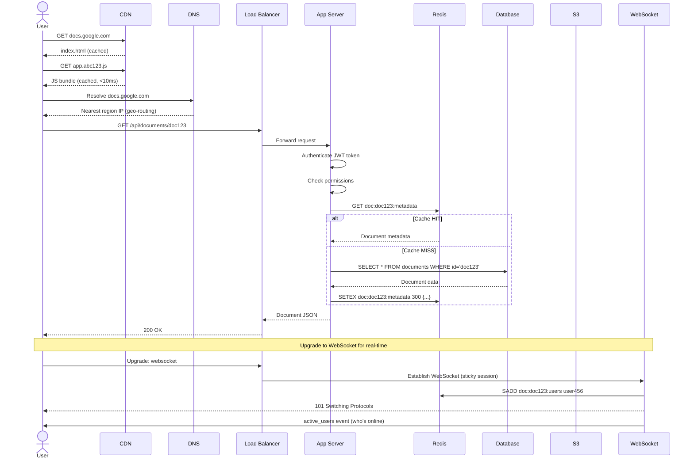
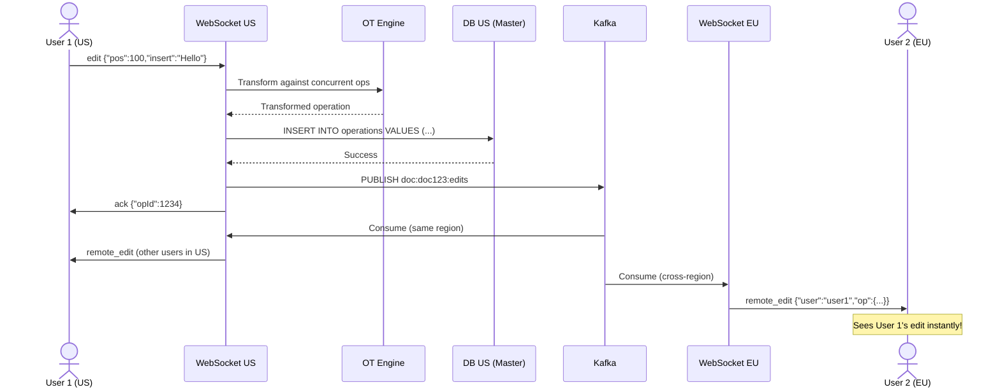
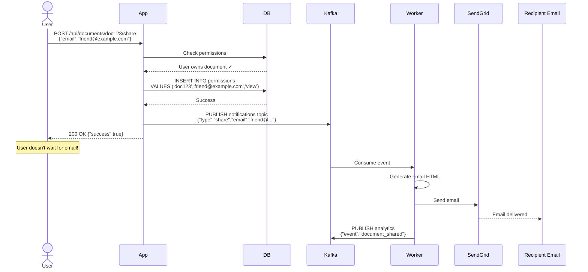
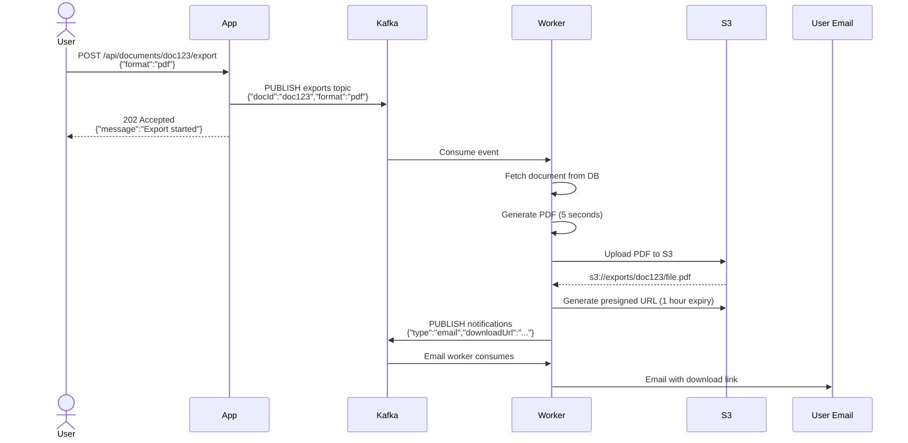

# Step 6: Final Architecture - Complete System Design

## Overview

This is the culmination of our incremental design process. We've built Google Docs architecture step-by-step:

**Step 1**: Basic client-server architecture with load balancer
**Step 2**: Added Redis caching for performance
**Step 3**: Added database sharding and replication for scalability
**Step 4**: Added WebSocket and Kafka for real-time collaboration
**Step 5**: Added CDN and S3 for global content delivery

Now, let's see the **complete final architecture** with all components integrated.

---

## Complete Architecture Diagram

```mermaid
graph TB
    subgraph "Global Users"
        U1[Users Worldwide<br/>100M users<br/>10M concurrent]
    end

    subgraph "DNS Layer"
        DNS[Route 53<br/>Geo-Based Routing<br/>Health Checks]
    end

    subgraph "CDN Layer - CloudFront"
        CDN[CloudFront CDN<br/>200+ Edge Locations<br/>Cache: JS, CSS, Images<br/>TTL: 1 year]
    end

    subgraph "Region: US-EAST-1 (Primary)"
        subgraph "Load Balancing US"
            LB_US_HTTP[HTTP Load Balancer<br/>ALB/Nginx<br/>SSL Termination]
            LB_US_WS[WebSocket Load Balancer<br/>Sticky Sessions<br/>50K conn/server]
        end

        subgraph "App Layer US"
            APP_US[App Servers × 20<br/>Node.js/Java<br/>Stateless<br/>REST APIs]
        end

        subgraph "WebSocket Layer US"
            WS_US[WebSocket Servers × 50<br/>Socket.io/Go<br/>Stateful Connections<br/>Real-time Collaboration]
        end

        subgraph "Cache US"
            REDIS_US[Redis Cluster US<br/>Cache + Pub/Sub<br/>Sessions, Documents<br/>TTL: 10s-5min]
        end

        subgraph "Database US (Primary)"
            DB_US_1[(DB Shard 1<br/>Master + 2 Slaves<br/>Users: A-G)]
            DB_US_2[(DB Shard 2<br/>Master + 2 Slaves<br/>Users: H-N)]
            DB_US_3[(DB Shard 3<br/>Master + 2 Slaves<br/>Users: O-T)]
            DB_US_4[(DB Shard 4<br/>Master + 2 Slaves<br/>Users: U-Z)]
        end

        subgraph "Message Queue US"
            KAFKA_US[Kafka Cluster US<br/>5 Brokers<br/>Topics: edits, notifications,<br/>exports, analytics]
        end

        subgraph "Workers US"
            WORKER_EMAIL_US[Email Workers × 10<br/>SendGrid/SES]
            WORKER_EXPORT_US[Export Workers × 5<br/>PDF/DOCX Generation]
            WORKER_ANALYTICS_US[Analytics Workers × 5<br/>Event Processing]
        end

        subgraph "Storage US"
            S3_US[S3 Primary US<br/>Documents, Exports<br/>User Uploads<br/>Cross-Region Replication]
        end
    end

    subgraph "Region: EU-WEST-1 (Replica)"
        subgraph "Load Balancing EU"
            LB_EU[LB EU<br/>HTTP + WebSocket]
        end

        subgraph "App Layer EU"
            APP_EU[App Servers × 10]
            WS_EU[WebSocket Servers × 25]
        end

        subgraph "Cache EU"
            REDIS_EU[Redis Cluster EU]
        end

        subgraph "Database EU (Replica)"
            DB_EU[(DB Shards EU<br/>Read Replicas<br/>Async Replication)]
        end

        subgraph "Storage EU"
            S3_EU[S3 Replica EU<br/>Cross-Region Replication<br/>15-min lag]
        end
    end

    subgraph "Region: AP-SOUTHEAST-1 (Replica)"
        subgraph "Load Balancing AP"
            LB_AP[LB Asia<br/>HTTP + WebSocket]
        end

        subgraph "App Layer AP"
            APP_AP[App Servers × 10]
            WS_AP[WebSocket Servers × 25]
        end

        subgraph "Cache AP"
            REDIS_AP[Redis Cluster Asia]
        end

        subgraph "Database AP (Replica)"
            DB_AP[(DB Shards Asia<br/>Read Replicas<br/>Async Replication)]
        end

        subgraph "Storage AP"
            S3_AP[S3 Replica Asia<br/>Cross-Region Replication<br/>15-min lag]
        end
    end

    subgraph "External Services"
        SENDGRID[SendGrid<br/>Email Delivery]
        FIREBASE[Firebase/SNS<br/>Push Notifications]
        ELASTIC[Elasticsearch<br/>Full-Text Search<br/>Cross-Document Search]
        MONITORING[Monitoring Stack<br/>Prometheus, Grafana<br/>DataDog, CloudWatch<br/>Alerting]
    end

    subgraph "Static Assets Origin"
        S3_STATIC[S3 Static Assets<br/>app.hash.js<br/>styles.hash.css<br/>Content Hashing]
    end

    U1 -->|1. DNS Query| DNS
    DNS -->|Geo-Route| LB_US_HTTP & LB_EU & LB_AP

    U1 -->|2. Static Assets| CDN
    CDN -.->|Cache MISS| S3_STATIC

    LB_US_HTTP --> APP_US
    LB_US_WS --> WS_US
    LB_EU --> APP_EU & WS_EU
    LB_AP --> APP_AP & WS_AP

    APP_US --> REDIS_US
    APP_US --> DB_US_1 & DB_US_2 & DB_US_3 & DB_US_4
    APP_US --> KAFKA_US
    APP_US --> S3_US
    APP_US --> ELASTIC

    WS_US --> REDIS_US
    WS_US --> KAFKA_US

    APP_EU --> REDIS_EU
    APP_EU --> DB_EU
    APP_EU --> S3_EU
    WS_EU --> REDIS_EU

    APP_AP --> REDIS_AP
    APP_AP --> DB_AP
    APP_AP --> S3_AP
    WS_AP --> REDIS_AP

    DB_US_1 & DB_US_2 & DB_US_3 & DB_US_4 -.->|Replication<br/>10-100ms| DB_EU
    DB_US_1 & DB_US_2 & DB_US_3 & DB_US_4 -.->|Replication<br/>50-100ms| DB_AP

    S3_US -.->|Cross-Region<br/>Replication| S3_EU & S3_AP

    KAFKA_US --> WORKER_EMAIL_US
    KAFKA_US --> WORKER_EXPORT_US
    KAFKA_US --> WORKER_ANALYTICS_US

    WORKER_EMAIL_US --> SENDGRID
    WORKER_EMAIL_US --> FIREBASE
    WORKER_EXPORT_US --> S3_US
    WORKER_ANALYTICS_US --> ELASTIC

    APP_US & WS_US & KAFKA_US & DB_US_1 --> MONITORING
    APP_EU & WS_EU & DB_EU --> MONITORING
    APP_AP & WS_AP & DB_AP --> MONITORING

    style U1 fill:#e1f5ff
    style DNS fill:#fff3e0
    style CDN fill:#fff3e0
    style REDIS_US fill:#ffccbc
    style REDIS_EU fill:#ffccbc
    style REDIS_AP fill:#ffccbc
    style KAFKA_US fill:#f3e5f5
    style DB_US_1 fill:#c8e6c9
    style DB_US_2 fill:#c8e6c9
    style DB_US_3 fill:#c8e6c9
    style DB_US_4 fill:#c8e6c9
    style DB_EU fill:#e8f5e9
    style DB_AP fill:#e8f5e9
    style S3_US fill:#e1bee7
    style S3_EU fill:#e1bee7
    style S3_AP fill:#e1bee7
    style S3_STATIC fill:#e1bee7
    style WS_US fill:#c5e1a5
    style WS_EU fill:#c5e1a5
    style WS_AP fill:#c5e1a5
```



---

## System Components Summary

### 1. Client Layer
- **100M users**, 10M concurrent
- Web browsers (Chrome, Firefox, Safari)
- Mobile apps (iOS, Android)
- Desktop apps (Electron)

### 2. DNS & CDN Layer
- **Route 53**: Geo-based routing to nearest region
- **CloudFront CDN**: 200+ edge locations worldwide
- **Cache Hit Rate**: 95% (static assets)
- **Latency**: 5-20ms to edge location

### 3. Load Balancing Layer
- **HTTP Load Balancer**: Nginx/ALB for REST APIs
- **WebSocket Load Balancer**: Sticky sessions for stateful connections
- **SSL Termination**: TLS 1.3
- **Health Checks**: Route traffic only to healthy servers

### 4. Application Layer
- **80 app servers** across 3 regions (20 US, 30 EU/Asia)
- **Stateless**: Any server can handle any request
- **Auto-scaling**: Scale based on CPU/memory/request count
- **Technology**: Node.js (async I/O) or Java Spring Boot (enterprise)

### 5. WebSocket Layer
- **100 WebSocket servers** across 3 regions (50 US, 25 EU, 25 Asia)
- **Stateful**: User maintains connection to specific server
- **Capacity**: 50,000 connections per server
- **Real-time**: <100ms latency for collaborative edits

### 6. Caching Layer
- **Redis Cluster** in each region
- **Cache**: User sessions, document metadata, API responses
- **Pub/Sub**: Broadcast messages across WebSocket servers
- **TTL**: 10 seconds (seat availability) to 5 minutes (document list)

### 7. Database Layer
- **16 database shards** (4 shards × 4 instances each = 16 total in US)
- **Sharding Key**: User ID (all user's docs in same shard)
- **Replication**: Master + 2 slaves per shard
- **Read Replicas**: In EU and Asia regions
- **Technology**: PostgreSQL or MySQL

### 8. Message Queue Layer
- **Kafka Cluster**: 5 brokers in US (primary)
- **Topics**: document-edits, notifications, exports, analytics
- **Throughput**: 1M messages/sec
- **Retention**: 7 days

### 9. Worker Layer
- **Email Workers** (10): Send notifications via SendGrid
- **Export Workers** (5): Generate PDF/DOCX files
- **Analytics Workers** (5): Process events for insights

### 10. Storage Layer
- **S3**: Documents, exports, uploads, static assets
- **Total Storage**: 60 TB (50 TB documents + 6 TB exports + 5 TB uploads)
- **Cross-Region Replication**: US → EU, Asia (15-min lag)

### 11. External Services
- **SendGrid/SES**: Email delivery
- **Firebase/SNS**: Push notifications
- **Elasticsearch**: Full-text search across documents
- **Monitoring**: Prometheus, Grafana, DataDog, CloudWatch

---

## Data Flow - Complete User Journey

### Flow 1: User Opens Document (Read)



**Latency Breakdown:**
```
CDN (static assets):         5-20ms   ✓
DNS resolution:              10-50ms  ✓
API request (cached):        50-100ms ✓
WebSocket upgrade:           50ms     ✓
Total:                       115-220ms

Without caching/CDN:         2-3 seconds ❌
```

### Flow 2: User Edits Document (Write)



**Latency Breakdown:**
```
WebSocket send:              5ms      ✓
OT transform:                10ms     ✓
Database write:              20ms     ✓
Kafka publish:               5ms      ✓
Ack to user:                 40ms     ✓

Cross-region broadcast:      100ms    (US → EU)
User 2 sees edit:            140ms    ✓ Acceptable
```

### Flow 3: User Shares Document (Async)



**Latency Breakdown:**
```
User perspective:
- Share request:             150ms    (DB write + Kafka)
- Response received:         150ms    ✓ Fast!

Background:
- Email sent:                +500ms   (async, user doesn't wait)
```

### Flow 4: User Exports Document (Async)



**Latency Breakdown:**
```
User perspective:
- Export request:            50ms     ✓ Immediate response

Background (async):
- PDF generation:            5s
- S3 upload:                 2s
- Email sent:                1s
- Total background:          8s
- User receives email:       8s (acceptable for large export)
```

---

## Capacity & Scaling

### User Metrics
```
Total Users:                 100,000,000 (100M)
Daily Active Users (DAU):    30,000,000 (30M) = 30%
Concurrent Users:            10,000,000 (10M) = 10% of total
Peak Concurrent:             15,000,000 (15M) = 1.5x average

Geographical Distribution:
- North America:             40% (40M users)
- Europe:                    30% (30M users)
- Asia:                      25% (25M users)
- Rest of World:             5% (5M users)
```

### Traffic Estimates
```
Read Operations:
- User views document:       20 ops/sec per user
- Document list refresh:     5 ops/sec per user
- Total reads:               10M concurrent × 25 = 250M ops/sec

Write Operations:
- User edits:                5 ops/sec per active user (1M editing)
- Document saves:            1M × 5 = 5M ops/sec
- Metadata updates:          1M ops/sec
- Total writes:              6M ops/sec

WebSocket Messages:
- Real-time edits:           5M ops/sec
- Cursor updates:            10M ops/sec (more frequent)
- Presence updates:          1M ops/sec
- Total WS messages:         16M ops/sec
```

### Storage Estimates
```
Documents:
- Total documents:           1 billion (100M users × 10 docs)
- Average size:              50 KB per document
- Total storage:             50 TB

Operations History (OT):
- Operations per doc/day:    100
- Storage per operation:     500 bytes
- Total/day:                 1B docs × 100 ops × 500B = 50 TB/day
- Retention:                 30 days
- Total OT storage:          1.5 PB (use compression → 500 TB)

User Uploads:
- 10M images × 500 KB:       5 TB
- 1M PDFs × 5 MB:            5 TB
- Total uploads:             10 TB

Exports (30-day retention):
- 100K exports/day × 2 MB:   200 GB/day
- 30 days:                   6 TB

Total Storage:               571 TB (≈0.6 PB)
```

### Database Sizing
```
Database Shards:             4 shards (each shard handles 25M users)
Instances per shard:         1 master + 2 slaves = 3
Total DB instances (US):     4 × 3 = 12

Read replicas per region:    4 shards × 1 replica = 4 per region
Total replicas (EU + Asia):  8

Total database instances:    12 (US) + 8 (replicas) = 20

Per-instance specs:
- Type:                      db.r5.4xlarge (16 vCPU, 128 GB RAM)
- Storage:                   2 TB per instance
- IOPS:                      10,000 provisioned IOPS
```

### Server Counts
```
Application Servers:
- US:                        30 servers (c5.2xlarge)
- EU:                        20 servers
- Asia:                      15 servers
- Total:                     65 servers

WebSocket Servers:
- Concurrent connections:    10M
- Per server:                50K connections
- Servers needed:            10M / 50K = 200 servers
- Distribution:              US: 100, EU: 50, Asia: 50

Redis Clusters:
- US:                        6 nodes (r5.xlarge)
- EU:                        4 nodes
- Asia:                      4 nodes
- Total:                     14 nodes

Kafka Cluster:
- Brokers:                   5 (m5.large)
- Replication factor:        3
- Topics:                    4
- Total partitions:          40

Workers:
- Email:                     10 workers
- Export:                    5 workers
- Analytics:                 5 workers
- Total:                     20 workers
```

---

## Cost Breakdown (Monthly)

### Compute Costs
```
Application Servers:
- 65 × c5.2xlarge @ $0.34/hr:        $16,218

WebSocket Servers:
- 200 × c5.xlarge @ $0.17/hr:        $24,820

Database Servers:
- 20 × db.r5.4xlarge @ $2.976/hr:    $43,565

Redis Clusters:
- 14 × r5.xlarge @ $0.30/hr:         $3,066

Kafka Cluster:
- 5 × m5.large @ $0.096/hr:          $351

Workers:
- 20 × c5.large @ $0.085/hr:         $1,241

Load Balancers:
- 6 ALBs @ $22.50/month:             $135

Subtotal Compute:                     $89,396/month
```

### Storage Costs
```
S3 Storage:
- 571 TB @ $0.023/GB:                $13,133

S3 Requests:
- 100M requests/day:                 $1,200

Database Storage:
- 20 instances × 2 TB @ $0.115/GB:   $4,715

Subtotal Storage:                     $19,048/month
```

### Networking Costs
```
CDN (CloudFront):
- 1,500 TB/month @ $0.03/GB avg:     $45,000

Data Transfer Out:
- 100 TB/month @ $0.09/GB:           $9,000

Cross-Region Replication:
- 50 TB/month @ $0.02/GB:            $1,000

Subtotal Networking:                  $55,000/month
```

### External Services
```
SendGrid:
- 50M emails/month:                  $500

Firebase/SNS:
- 10M push notifications:            $50

Elasticsearch:
- 3 nodes × r5.xlarge:               $657

Monitoring (DataDog):
- 400 hosts @ $15/host:              $6,000

Subtotal External:                    $7,207/month
```

### **Total Monthly Cost**
```
Compute:        $89,396
Storage:        $19,048
Networking:     $55,000
External:       $7,207
─────────────────────────
TOTAL:          $170,651/month = ~$2M/year

Cost per user:  $170,651 / 100M = $0.0017/month = $0.02/year

Revenue needed (to break even):
- If 5% convert to paid ($10/month):
  5M paid users × $10 = $50M/month >> $170K/month ✓ Profitable!
```

---

## Design Decisions & Trade-offs

### Decision 1: SQL vs NoSQL

**We chose:** PostgreSQL (SQL)

| Factor | SQL (Chosen) | NoSQL |
|--------|--------------|-------|
| **Schema** | Fixed (good for documents with structured metadata) | Flexible |
| **Transactions** | ACID (needed for permissions, sharing) | Eventual consistency |
| **Relationships** | Joins (users ↔ documents ↔ permissions) | Denormalized |
| **Scalability** | Vertical (but we used sharding) | Horizontal |
| **Maturity** | Very mature, well-understood | Varies by database |

**Why SQL:**
- Strong consistency needed (permissions, ownership)
- Complex queries (who has access to this document?)
- ACID transactions (share document = multiple tables)
- Team expertise with SQL

**Trade-off Accepted:**
- Harder to scale writes (solved with sharding)
- Schema migrations required (use tools like Flyway)

---

### Decision 2: Operational Transform vs CRDT

**We chose:** Operational Transform (OT)

| Factor | OT (Chosen) | CRDT |
|--------|-------------|------|
| **Coordination** | Requires server | Peer-to-peer possible |
| **Complexity** | Complex transform logic | Simpler to implement |
| **Data Size** | Smaller (just operations) | Larger (metadata overhead) |
| **Rich Text** | Handles formatting well | Complex for rich text |
| **Consistency** | Eventual (with server as source of truth) | Eventual |

**Why OT:**
- Google Docs has rich formatting (bold, italics, headings, etc.)
- Server coordination is acceptable (we have servers anyway)
- Smaller data size (mobile bandwidth important)
- Proven at scale (Google Docs, Figma use OT)

**Trade-off Accepted:**
- Complex to implement correctly (use library like ShareDB)
- Server is single source of truth (can't work fully offline)

---

### Decision 3: Kafka vs RabbitMQ

**We chose:** Kafka

| Factor | Kafka (Chosen) | RabbitMQ |
|--------|----------------|----------|
| **Throughput** | Very high (millions/sec) | High (thousands/sec) |
| **Latency** | ~10ms | ~1ms |
| **Persistence** | Always durable | Optional |
| **Ordering** | Per partition | Per queue |
| **Replay** | Yes (rewind to offset) | No |
| **Ops Complexity** | Higher | Lower |

**Why Kafka:**
- Need high throughput (6M writes/sec)
- Event replay for analytics (reprocess last 7 days)
- Durable log (audit trail for edits)
- Proven at scale (LinkedIn, Uber, Netflix use Kafka)

**Trade-off Accepted:**
- Higher operational complexity (5 brokers, ZooKeeper)
- Slightly higher latency than RabbitMQ (10ms vs 1ms, acceptable)

---

### Decision 4: Monolith vs Microservices

**We chose:** Hybrid (mostly monolith with separate workers)

| Component | Architecture | Reason |
|-----------|-------------|--------|
| **REST API** | Monolith | Simpler, faster development |
| **WebSocket** | Separate service | Different scaling needs |
| **Workers** | Microservices | Different languages, independent scaling |
| **Auth** | Monolith | Tightly coupled with API |

**Why Hybrid:**
- Monolith is simpler (faster iteration, easier debugging)
- Separate WebSocket servers (different scaling requirements)
- Worker microservices (isolate failures, scale independently)

**Trade-off Accepted:**
- Monolith can become complex (mitigate with good code structure)
- Partial benefits of microservices (not full SOA)

---

### Decision 5: Multi-Region vs Single Region

**We chose:** Multi-Region (3 regions)

**Cost:**
- Single region: $85,000/month
- Multi-region: $170,651/month
- Additional cost: $85,651/month (2x)

**Benefits:**
- Latency: 200ms → 20ms (10x improvement)
- Availability: 99.9% → 99.99% (10x less downtime)
- Compliance: GDPR (EU data in EU)

**Trade-off Accepted:**
- 2x cost (but acceptable for global product)
- Operational complexity (managing 3 regions)
- Cross-region writes slower (50-100ms)

**ROI:**
- Better UX → higher retention → more revenue
- Compliance → access EU market (30% of users)
- Worth the 2x cost? YES ✓

---

## High Availability & Disaster Recovery

### Availability Target: 99.99% (52 minutes downtime/year)

**Single Points of Failure Eliminated:**

1. **Load Balancer**: Multiple instances (AWS ALB auto-scales)
2. **App Servers**: 65 servers (one fails, others handle load)
3. **WebSocket Servers**: 200 servers (sticky sessions, but can reconnect)
4. **Databases**: Master + 2 slaves (auto-failover in 30-60 seconds)
5. **Redis**: Cluster mode (multiple nodes, sentinel for failover)
6. **Kafka**: 3x replication (if 1 broker fails, others serve)

### Disaster Recovery Scenarios

**Scenario 1: App Server Crashes**
```
1. Health check fails (10 seconds)
2. Load balancer removes from pool
3. Auto-scaling launches new instance (5 minutes)
4. Impact: NONE (other servers handle load) ✓
```

**Scenario 2: Database Master Fails**
```
1. Health check fails (10 seconds)
2. Patroni/RDS auto-failover to slave (30 seconds)
3. Slave promoted to master
4. Applications reconnect to new master
5. Impact: 30-60 seconds write downtime (reads unaffected) ✓
6. Meets 99.99% SLA ✓
```

**Scenario 3: Entire Region Fails (AWS US-EAST-1 outage)**
```
1. Route 53 health checks detect region down (60 seconds)
2. DNS updated to route traffic to EU-WEST-1 (60 seconds)
3. EU region handles all traffic (may be slower)
4. Impact: 2 minutes degraded performance, no data loss ✓
5. Meets 99.99% SLA ✓

Recovery:
1. US-EAST-1 comes back online
2. Database replication catches up (sync from EU)
3. Gradually route traffic back to US
4. Full recovery in 1-2 hours
```

**Scenario 4: Data Center Fire (Catastrophic)**
```
1. Entire US region destroyed
2. EU becomes new primary
3. Cross-region replicas have all data (RPO = 0, no data loss)
4. Scale up EU/Asia to handle traffic
5. Impact: 10 minutes of downtime during failover
6. RTO (Recovery Time Objective): 10 minutes ✓
7. RPO (Recovery Point Objective): 0 (no data loss) ✓
```

### Backup Strategy

```
Database Backups:
- Automated daily snapshots (RDS/Aurora)
- Retention: 30 days
- Cross-region replication (real-time)
- Point-in-time recovery (5-minute granularity)

S3 Backups:
- Versioning enabled (keeps deleted/old versions)
- Cross-region replication (15-min lag)
- Glacier archival (after 90 days, 7-year retention)

Configuration Backups:
- Infrastructure as Code (Terraform)
- Version controlled in Git
- Can rebuild entire infrastructure in 1 hour
```

---

## Security Architecture

### Authentication & Authorization

```
Authentication:
- JWT tokens (stateless, no session storage)
- Expiry: 1 hour (access token), 30 days (refresh token)
- Stored in httpOnly cookies (prevent XSS)

Authorization:
- Role-Based Access Control (RBAC)
- Permissions: owner, editor, commenter, viewer
- Check on every API request (cached in Redis)

OAuth:
- Google OAuth (Sign in with Google)
- GitHub OAuth (Sign in with GitHub)
```

### Data Encryption

```
At Rest:
- Database: AES-256 encryption (AWS RDS encryption)
- S3: AES-256 encryption (server-side encryption)
- Redis: Encrypted volumes

In Transit:
- TLS 1.3 (HTTPS) for all communications
- WebSocket Secure (wss://)
- Certificate: AWS ACM (auto-renewal)
```

### Network Security

```
VPC (Virtual Private Cloud):
- Databases in private subnets (no internet access)
- App servers in public subnets (behind load balancer)
- Security groups: Whitelist only required ports

DDoS Protection:
- CloudFlare (edge protection)
- AWS Shield Standard (always on)
- AWS Shield Advanced (optional, $3K/month)

Rate Limiting:
- Per IP: 1000 requests/minute
- Per user: 100 requests/minute (authenticated)
- Per endpoint: Varies (read: 1000/min, write: 100/min)
```

---

## Monitoring & Observability

### Metrics (Prometheus + DataDog)

```
Application Metrics:
- Request rate (requests/sec)
- Response time (P50, P95, P99)
- Error rate (4xx, 5xx)
- Active users (gauge)

Database Metrics:
- Query latency (P99 < 100ms)
- Connection pool usage (<80%)
- Replication lag (<100ms)
- Disk usage (<80%)

Cache Metrics:
- Hit rate (>90%)
- Eviction rate (<5%)
- Memory usage (<80%)

WebSocket Metrics:
- Active connections (gauge)
- Message rate (messages/sec)
- Reconnection rate (<1%/min)

Kafka Metrics:
- Consumer lag (<1000 messages)
- Broker CPU/memory
- Partition distribution
```

### Logging (ELK Stack or CloudWatch)

```
Structured Logging:
{
  "timestamp": "2025-01-15T10:30:00Z",
  "level": "INFO",
  "service": "app-server",
  "user_id": "user123",
  "document_id": "doc456",
  "action": "save_document",
  "latency_ms": 45,
  "status": "success"
}

Log Levels:
- ERROR: Errors requiring investigation
- WARN: Potential issues (high latency, retries)
- INFO: Important events (user actions)
- DEBUG: Detailed debugging info (disabled in prod)

Retention:
- Hot logs: 7 days (Elasticsearch)
- Warm logs: 30 days (S3)
- Cold logs: 1 year (S3 Glacier)
```

### Alerting (PagerDuty + Slack)

```
Critical Alerts (PagerDuty, wake up engineer):
- Service down (no response to health checks)
- Database master down
- Error rate >5%
- P99 latency >1 second

Warning Alerts (Slack, investigate during business hours):
- Error rate >1%
- Disk usage >80%
- Memory usage >80%
- Consumer lag >10,000 messages

Info Alerts (Slack, FYI):
- Deployment completed
- Auto-scaling event
- Certificate renewal
```

### Distributed Tracing (Jaeger or Zipkin)

```
Trace Example:
Request ID: abc-123-def-456
├─ HTTP GET /api/documents/doc123 (200ms)
│  ├─ JWT verification (5ms)
│  ├─ Permission check (10ms)
│  │  └─ Redis GET (2ms)
│  ├─ Database query (50ms)
│  │  └─ SELECT * FROM documents (48ms)
│  ├─ S3 presigned URL (10ms)
│  └─ Response serialization (5ms)

Helps identify:
- Slow database queries
- High latency services
- Bottlenecks in request path
```

---

## Key Takeaways

### Architecture Principles

1. **Start Simple, Scale Gradually**: Monolith → Caching → Sharding → Microservices
2. **Horizontal Scaling**: Add more servers, not bigger servers
3. **Stateless App Servers**: Any server can handle any request
4. **Async Everything**: Don't block user for slow operations
5. **Cache Aggressively**: But cache invalidation is hard
6. **Plan for Failure**: Everything will fail, design for resilience
7. **Monitor Everything**: You can't fix what you can't measure
8. **Security by Default**: Encrypt, authenticate, authorize

### What We Built

- **Scalable**: Handle 100M users, 10M concurrent
- **Fast**: <100ms latency for edits, <20ms for static assets
- **Reliable**: 99.99% uptime, no single point of failure
- **Global**: Multi-region deployment for low latency worldwide
- **Real-Time**: Collaborative editing with OT
- **Cost-Effective**: $0.02/user/year infrastructure cost

### What We Achieved

- **6M writes/sec** with database sharding
- **250M reads/sec** with caching and read replicas
- **16M WebSocket messages/sec** for real-time collaboration
- **95% cache hit rate** for static assets
- **10x faster** page loads with CDN
- **99.99% availability** with multi-region deployment

---

## Next Steps

Now that we have the complete architecture, let's dive deeper into:

- **API Design**: RESTful endpoints, WebSocket events, authentication
- **Database Schema**: Tables, indexes, relationships
- **Data Flow Diagrams**: Sequence diagrams for critical operations

→ Continue to [API Design](./08_api_design.md)
