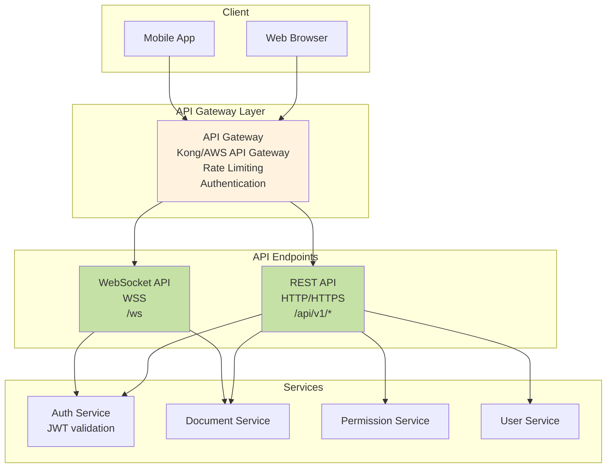
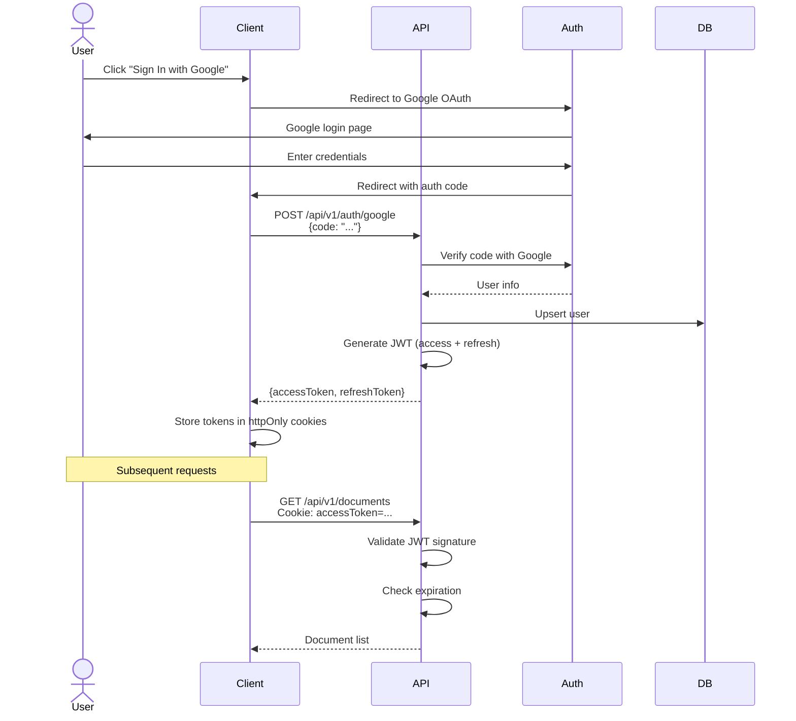

# API Design - Google Docs

## Overview

This document covers the complete API design for Google Docs, including:
- RESTful HTTP endpoints
- WebSocket events for real-time collaboration
- Authentication and authorization
- Rate limiting and security
- Request/response examples
- Error handling

---

## API Architecture



---

## Authentication

### JWT (JSON Web Token)

**Why JWT?**
- Stateless (no session storage needed)
- Scalable (any server can validate)
- Contains user info (no database lookup)

**Token Structure:**
```json
{
  "header": {
    "alg": "RS256",
    "typ": "JWT"
  },
  "payload": {
    "user_id": "user_123456",
    "email": "john@example.com",
    "name": "John Doe",
    "roles": ["user"],
    "iat": 1705334400,
    "exp": 1705338000
  },
  "signature": "..."
}
```

### Authentication Flow



### API Endpoints: Authentication

#### POST /api/v1/auth/register
Register a new user with email/password.

**Request:**
```http
POST /api/v1/auth/register HTTP/1.1
Host: docs.google.com
Content-Type: application/json

{
  "email": "john@example.com",
  "password": "SecurePass123!",
  "name": "John Doe"
}
```

**Response (Success):**
```http
HTTP/1.1 201 Created
Content-Type: application/json
Set-Cookie: accessToken=eyJhbGc...; HttpOnly; Secure; SameSite=Strict; Max-Age=3600
Set-Cookie: refreshToken=eyJhbGc...; HttpOnly; Secure; SameSite=Strict; Max-Age=2592000

{
  "success": true,
  "user": {
    "id": "user_123456",
    "email": "john@example.com",
    "name": "John Doe",
    "created_at": "2025-01-15T10:30:00Z"
  }
}
```

**Response (Error):**
```http
HTTP/1.1 409 Conflict
Content-Type: application/json

{
  "error": {
    "code": "EMAIL_EXISTS",
    "message": "An account with this email already exists",
    "details": {
      "email": "john@example.com"
    }
  }
}
```

---

#### POST /api/v1/auth/login
Login with email/password.

**Request:**
```http
POST /api/v1/auth/login HTTP/1.1
Host: docs.google.com
Content-Type: application/json

{
  "email": "john@example.com",
  "password": "SecurePass123!"
}
```

**Response:**
```http
HTTP/1.1 200 OK
Set-Cookie: accessToken=...; HttpOnly; Secure
Set-Cookie: refreshToken=...; HttpOnly; Secure

{
  "success": true,
  "user": {
    "id": "user_123456",
    "email": "john@example.com",
    "name": "John Doe"
  }
}
```

---

#### POST /api/v1/auth/refresh
Refresh access token using refresh token.

**Request:**
```http
POST /api/v1/auth/refresh HTTP/1.1
Cookie: refreshToken=eyJhbGc...
```

**Response:**
```http
HTTP/1.1 200 OK
Set-Cookie: accessToken=...; HttpOnly; Secure; Max-Age=3600

{
  "success": true,
  "expires_in": 3600
}
```

---

#### POST /api/v1/auth/logout
Logout and invalidate tokens.

**Request:**
```http
POST /api/v1/auth/logout HTTP/1.1
Cookie: accessToken=...
```

**Response:**
```http
HTTP/1.1 200 OK
Set-Cookie: accessToken=; Max-Age=0
Set-Cookie: refreshToken=; Max-Age=0

{
  "success": true,
  "message": "Logged out successfully"
}
```

---

## REST API Endpoints

### Base URL
```
Production:  https://docs.google.com/api/v1
Staging:     https://staging.docs.google.com/api/v1
```

### Common Headers
```http
Authorization: Bearer eyJhbGc...    (or use Cookie)
Content-Type: application/json
Accept: application/json
X-Request-ID: uuid-1234-5678       (for tracing)
```

---

## Documents API

### GET /api/v1/documents
List all documents for the authenticated user.

**Request:**
```http
GET /api/v1/documents?limit=20&offset=0&sort=updated_at&order=desc HTTP/1.1
Cookie: accessToken=...
```

**Query Parameters:**
| Parameter | Type | Default | Description |
|-----------|------|---------|-------------|
| `limit` | integer | 20 | Number of documents to return (max 100) |
| `offset` | integer | 0 | Pagination offset |
| `sort` | string | updated_at | Sort by: `created_at`, `updated_at`, `title` |
| `order` | string | desc | Sort order: `asc`, `desc` |
| `filter` | string | all | Filter: `owned`, `shared`, `starred`, `trash` |

**Response:**
```http
HTTP/1.1 200 OK

{
  "success": true,
  "documents": [
    {
      "id": "doc_abc123",
      "title": "Project Proposal",
      "owner": {
        "id": "user_123456",
        "name": "John Doe",
        "email": "john@example.com"
      },
      "permission": "owner",
      "created_at": "2025-01-10T08:00:00Z",
      "updated_at": "2025-01-15T14:30:00Z",
      "starred": false,
      "word_count": 2450,
      "thumbnail_url": "https://cdn.docs.google.com/thumbnails/doc_abc123.png"
    },
    {
      "id": "doc_def456",
      "title": "Meeting Notes",
      "owner": {
        "id": "user_789012",
        "name": "Jane Smith",
        "email": "jane@example.com"
      },
      "permission": "editor",
      "created_at": "2025-01-12T10:00:00Z",
      "updated_at": "2025-01-15T16:00:00Z",
      "starred": true,
      "word_count": 850,
      "thumbnail_url": "https://cdn.docs.google.com/thumbnails/doc_def456.png"
    }
  ],
  "pagination": {
    "total": 47,
    "limit": 20,
    "offset": 0,
    "has_more": true
  }
}
```

---

### POST /api/v1/documents
Create a new document.

**Request:**
```http
POST /api/v1/documents HTTP/1.1
Cookie: accessToken=...
Content-Type: application/json

{
  "title": "Untitled Document",
  "content": "",
  "folder_id": null
}
```

**Response:**
```http
HTTP/1.1 201 Created

{
  "success": true,
  "document": {
    "id": "doc_xyz789",
    "title": "Untitled Document",
    "owner": {
      "id": "user_123456",
      "name": "John Doe",
      "email": "john@example.com"
    },
    "permission": "owner",
    "created_at": "2025-01-15T18:00:00Z",
    "updated_at": "2025-01-15T18:00:00Z",
    "content": "",
    "version": 1
  }
}
```

---

### GET /api/v1/documents/:id
Get a specific document with full content.

**Request:**
```http
GET /api/v1/documents/doc_abc123 HTTP/1.1
Cookie: accessToken=...
```

**Response:**
```http
HTTP/1.1 200 OK

{
  "success": true,
  "document": {
    "id": "doc_abc123",
    "title": "Project Proposal",
    "content": "# Project Proposal\n\nThis is the content...",
    "owner": {
      "id": "user_123456",
      "name": "John Doe",
      "email": "john@example.com"
    },
    "permission": "owner",
    "created_at": "2025-01-10T08:00:00Z",
    "updated_at": "2025-01-15T14:30:00Z",
    "version": 47,
    "collaborators": [
      {
        "user_id": "user_789012",
        "name": "Jane Smith",
        "email": "jane@example.com",
        "permission": "editor",
        "added_at": "2025-01-12T09:00:00Z"
      }
    ],
    "starred": false,
    "word_count": 2450
  }
}
```

**Error Response (No Permission):**
```http
HTTP/1.1 403 Forbidden

{
  "error": {
    "code": "PERMISSION_DENIED",
    "message": "You don't have permission to access this document",
    "details": {
      "document_id": "doc_abc123",
      "required_permission": "viewer"
    }
  }
}
```

---

### PUT /api/v1/documents/:id
Update document metadata (title, starred, etc).

**Request:**
```http
PUT /api/v1/documents/doc_abc123 HTTP/1.1
Cookie: accessToken=...
Content-Type: application/json

{
  "title": "Updated Project Proposal",
  "starred": true
}
```

**Response:**
```http
HTTP/1.1 200 OK

{
  "success": true,
  "document": {
    "id": "doc_abc123",
    "title": "Updated Project Proposal",
    "starred": true,
    "updated_at": "2025-01-15T18:30:00Z"
  }
}
```

---

### DELETE /api/v1/documents/:id
Move document to trash (soft delete).

**Request:**
```http
DELETE /api/v1/documents/doc_abc123 HTTP/1.1
Cookie: accessToken=...
```

**Response:**
```http
HTTP/1.1 200 OK

{
  "success": true,
  "message": "Document moved to trash",
  "document": {
    "id": "doc_abc123",
    "title": "Project Proposal",
    "trashed_at": "2025-01-15T18:45:00Z"
  }
}
```

---

### POST /api/v1/documents/:id/share
Share document with another user.

**Request:**
```http
POST /api/v1/documents/doc_abc123/share HTTP/1.1
Cookie: accessToken=...
Content-Type: application/json

{
  "email": "colleague@example.com",
  "permission": "editor",
  "notify": true,
  "message": "Check out this document!"
}
```

**Permissions:**
- `owner`: Full control (only one owner)
- `editor`: Can edit content and share with others
- `commenter`: Can add comments but not edit
- `viewer`: Read-only access

**Response:**
```http
HTTP/1.1 200 OK

{
  "success": true,
  "message": "Document shared successfully",
  "permission": {
    "user_id": "user_456789",
    "email": "colleague@example.com",
    "permission": "editor",
    "added_at": "2025-01-15T19:00:00Z"
  }
}
```

---

### DELETE /api/v1/documents/:id/share/:user_id
Remove user's access to document.

**Request:**
```http
DELETE /api/v1/documents/doc_abc123/share/user_456789 HTTP/1.1
Cookie: accessToken=...
```

**Response:**
```http
HTTP/1.1 200 OK

{
  "success": true,
  "message": "Access removed successfully"
}
```

---

### GET /api/v1/documents/:id/versions
Get document version history.

**Request:**
```http
GET /api/v1/documents/doc_abc123/versions?limit=10&offset=0 HTTP/1.1
Cookie: accessToken=...
```

**Response:**
```http
HTTP/1.1 200 OK

{
  "success": true,
  "versions": [
    {
      "version": 47,
      "created_at": "2025-01-15T14:30:00Z",
      "created_by": {
        "id": "user_123456",
        "name": "John Doe"
      },
      "changes_summary": "Updated introduction section",
      "size_bytes": 12450
    },
    {
      "version": 46,
      "created_at": "2025-01-15T14:00:00Z",
      "created_by": {
        "id": "user_789012",
        "name": "Jane Smith"
      },
      "changes_summary": "Fixed typos",
      "size_bytes": 12380
    }
  ],
  "pagination": {
    "total": 47,
    "limit": 10,
    "offset": 0
  }
}
```

---

### POST /api/v1/documents/:id/export
Request document export (async).

**Request:**
```http
POST /api/v1/documents/doc_abc123/export HTTP/1.1
Cookie: accessToken=...
Content-Type: application/json

{
  "format": "pdf"
}
```

**Formats:** `pdf`, `docx`, `txt`, `html`, `markdown`

**Response (Accepted):**
```http
HTTP/1.1 202 Accepted

{
  "success": true,
  "message": "Export started",
  "export_id": "export_xyz123",
  "status": "pending",
  "estimated_time_seconds": 10
}
```

**Check Export Status:**
```http
GET /api/v1/exports/export_xyz123 HTTP/1.1
Cookie: accessToken=...
```

**Response (Complete):**
```http
HTTP/1.1 200 OK

{
  "success": true,
  "export": {
    "id": "export_xyz123",
    "document_id": "doc_abc123",
    "format": "pdf",
    "status": "completed",
    "download_url": "https://s3.amazonaws.com/exports/doc_abc123.pdf?signature=...",
    "expires_at": "2025-01-15T20:00:00Z",
    "size_bytes": 245680,
    "created_at": "2025-01-15T19:00:00Z",
    "completed_at": "2025-01-15T19:00:08Z"
  }
}
```

---

### POST /api/v1/documents/:id/comments
Add a comment to document.

**Request:**
```http
POST /api/v1/documents/doc_abc123/comments HTTP/1.1
Cookie: accessToken=...
Content-Type: application/json

{
  "content": "This section needs more details",
  "position": {
    "start": 150,
    "end": 200
  }
}
```

**Response:**
```http
HTTP/1.1 201 Created

{
  "success": true,
  "comment": {
    "id": "comment_123",
    "content": "This section needs more details",
    "author": {
      "id": "user_123456",
      "name": "John Doe",
      "avatar_url": "https://cdn.docs.google.com/avatars/user_123456.jpg"
    },
    "created_at": "2025-01-15T19:30:00Z",
    "position": {
      "start": 150,
      "end": 200
    },
    "resolved": false
  }
}
```

---

## WebSocket API

### Connection

**Endpoint:** `wss://docs.google.com/ws`

**Client Connection:**
```javascript
const ws = new WebSocket('wss://docs.google.com/ws');

ws.onopen = () => {
  console.log('WebSocket connected');

  // Authenticate
  ws.send(JSON.stringify({
    type: 'auth',
    token: getAccessToken()
  }));
};

ws.onmessage = (event) => {
  const message = JSON.parse(event.data);
  handleMessage(message);
};

ws.onerror = (error) => {
  console.error('WebSocket error:', error);
};

ws.onclose = () => {
  console.log('WebSocket closed, reconnecting...');
  setTimeout(connect, 1000); // Reconnect after 1 second
};
```

---

### WebSocket Events

#### Client → Server Events

**1. auth - Authenticate connection**
```json
{
  "type": "auth",
  "token": "eyJhbGc..."
}
```

**Response:**
```json
{
  "type": "auth_success",
  "user": {
    "id": "user_123456",
    "name": "John Doe"
  }
}
```

---

**2. join_document - Join document for real-time collaboration**
```json
{
  "type": "join_document",
  "document_id": "doc_abc123"
}
```

**Response:**
```json
{
  "type": "joined_document",
  "document_id": "doc_abc123",
  "active_users": [
    {
      "id": "user_789012",
      "name": "Jane Smith",
      "avatar_url": "...",
      "cursor_position": 450,
      "color": "#FF5733"
    }
  ],
  "version": 47
}
```

---

**3. edit - Send edit operation**
```json
{
  "type": "edit",
  "document_id": "doc_abc123",
  "operation": {
    "id": "op_client_1",
    "type": "insert",
    "position": 100,
    "text": "Hello World",
    "version": 47
  }
}
```

**Response (Ack):**
```json
{
  "type": "ack",
  "client_op_id": "op_client_1",
  "server_op_id": "op_server_5678",
  "version": 48
}
```

---

**4. cursor_move - Update cursor position**
```json
{
  "type": "cursor_move",
  "document_id": "doc_abc123",
  "position": 150,
  "selection": {
    "start": 150,
    "end": 200
  }
}
```

**No response** (broadcast to others only)

---

**5. leave_document - Leave document**
```json
{
  "type": "leave_document",
  "document_id": "doc_abc123"
}
```

---

#### Server → Client Events

**1. remote_edit - Another user edited the document**
```json
{
  "type": "remote_edit",
  "document_id": "doc_abc123",
  "operation": {
    "id": "op_server_5679",
    "type": "delete",
    "position": 50,
    "length": 10,
    "version": 49
  },
  "user": {
    "id": "user_789012",
    "name": "Jane Smith"
  },
  "timestamp": "2025-01-15T20:00:00Z"
}
```

---

**2. user_joined - Another user joined the document**
```json
{
  "type": "user_joined",
  "document_id": "doc_abc123",
  "user": {
    "id": "user_456789",
    "name": "Bob Wilson",
    "avatar_url": "...",
    "color": "#3498DB"
  },
  "timestamp": "2025-01-15T20:05:00Z"
}
```

---

**3. user_left - Another user left the document**
```json
{
  "type": "user_left",
  "document_id": "doc_abc123",
  "user_id": "user_456789",
  "timestamp": "2025-01-15T20:10:00Z"
}
```

---

**4. remote_cursor - Another user moved cursor**
```json
{
  "type": "remote_cursor",
  "document_id": "doc_abc123",
  "user": {
    "id": "user_789012",
    "name": "Jane Smith",
    "color": "#FF5733"
  },
  "position": 200,
  "selection": {
    "start": 200,
    "end": 250
  }
}
```

---

**5. comment_added - New comment added**
```json
{
  "type": "comment_added",
  "document_id": "doc_abc123",
  "comment": {
    "id": "comment_456",
    "content": "Great work!",
    "author": {
      "id": "user_789012",
      "name": "Jane Smith"
    },
    "position": {
      "start": 100,
      "end": 150
    },
    "created_at": "2025-01-15T20:15:00Z"
  }
}
```

---

**6. error - Error occurred**
```json
{
  "type": "error",
  "code": "INVALID_OPERATION",
  "message": "Operation version mismatch",
  "details": {
    "expected_version": 48,
    "received_version": 47
  }
}
```

---

## Rate Limiting

### Rate Limit Rules

```
Per IP Address (Unauthenticated):
- 100 requests per minute
- 1000 requests per hour

Per User (Authenticated):
- Read operations: 1000 requests per minute
- Write operations: 100 requests per minute
- WebSocket messages: 1000 messages per minute

Per Endpoint:
- POST /api/v1/documents: 10 per minute
- POST /api/v1/documents/:id/share: 20 per minute
- POST /api/v1/auth/login: 5 per minute (prevent brute force)
```

### Rate Limit Headers

**Response Headers:**
```http
X-RateLimit-Limit: 1000
X-RateLimit-Remaining: 987
X-RateLimit-Reset: 1705334460
```

**When Rate Limit Exceeded:**
```http
HTTP/1.1 429 Too Many Requests
Retry-After: 60

{
  "error": {
    "code": "RATE_LIMIT_EXCEEDED",
    "message": "Too many requests. Please try again later.",
    "details": {
      "limit": 1000,
      "remaining": 0,
      "reset_at": "2025-01-15T21:01:00Z"
    }
  }
}
```

---

## Error Handling

### HTTP Status Codes

| Code | Meaning | Use Case |
|------|---------|----------|
| 200 | OK | Successful GET, PUT, DELETE |
| 201 | Created | Successful POST (resource created) |
| 202 | Accepted | Async operation started (export) |
| 204 | No Content | Successful DELETE (no body) |
| 400 | Bad Request | Invalid request body/parameters |
| 401 | Unauthorized | Missing or invalid authentication |
| 403 | Forbidden | Authenticated but no permission |
| 404 | Not Found | Resource doesn't exist |
| 409 | Conflict | Resource already exists |
| 422 | Unprocessable Entity | Validation error |
| 429 | Too Many Requests | Rate limit exceeded |
| 500 | Internal Server Error | Server error |
| 502 | Bad Gateway | Upstream service error |
| 503 | Service Unavailable | Maintenance mode |

### Error Response Format

**Standard Error:**
```json
{
  "error": {
    "code": "ERROR_CODE",
    "message": "Human-readable error message",
    "details": {
      "field": "value"
    },
    "request_id": "req_abc123",
    "timestamp": "2025-01-15T21:30:00Z"
  }
}
```

**Validation Error:**
```json
{
  "error": {
    "code": "VALIDATION_ERROR",
    "message": "Request validation failed",
    "details": {
      "fields": {
        "email": "Invalid email format",
        "password": "Password must be at least 8 characters"
      }
    }
  }
}
```

### Common Error Codes

```
AUTH_REQUIRED              - Authentication required
INVALID_TOKEN              - JWT token invalid or expired
PERMISSION_DENIED          - No permission to access resource
DOCUMENT_NOT_FOUND         - Document doesn't exist
USER_NOT_FOUND             - User doesn't exist
EMAIL_EXISTS               - Email already registered
INVALID_OPERATION          - OT operation invalid
VERSION_MISMATCH           - Document version conflict
RATE_LIMIT_EXCEEDED        - Too many requests
SERVER_ERROR               - Internal server error
SERVICE_UNAVAILABLE        - Service temporarily down
```

---

## Pagination

### Query Parameters
```
?limit=20       - Number of items per page (default: 20, max: 100)
&offset=40      - Skip first N items (for pagination)
&cursor=xyz     - Alternative cursor-based pagination
```

### Response Format
```json
{
  "success": true,
  "documents": [...],
  "pagination": {
    "total": 150,
    "limit": 20,
    "offset": 40,
    "has_more": true,
    "next_cursor": "cursor_xyz",
    "prev_cursor": "cursor_abc"
  }
}
```

---

## Filtering & Sorting

### Filter Examples
```
GET /api/v1/documents?filter=owned
GET /api/v1/documents?filter=shared
GET /api/v1/documents?filter=starred
GET /api/v1/documents?filter=trash
```

### Sort Examples
```
GET /api/v1/documents?sort=title&order=asc
GET /api/v1/documents?sort=updated_at&order=desc
GET /api/v1/documents?sort=created_at&order=desc
```

### Combined Filters
```
GET /api/v1/documents?filter=shared&sort=updated_at&order=desc&limit=50
```

---

## API Versioning

### URL Versioning (Our Choice)
```
/api/v1/documents
/api/v2/documents
```

**Why:**
- Clear and explicit
- Easy to route (different backends for v1, v2)
- Client knows exactly which version

### Version Support Policy
```
v1 (Current):  Supported, recommended
v2 (Beta):     Available, breaking changes possible
v0 (Deprecated): Supported for 6 months, then removed
```

---

## API Documentation

### Swagger/OpenAPI

```yaml
openapi: 3.0.0
info:
  title: Google Docs API
  version: 1.0.0
  description: RESTful API for Google Docs

servers:
  - url: https://docs.google.com/api/v1
    description: Production
  - url: https://staging.docs.google.com/api/v1
    description: Staging

paths:
  /documents:
    get:
      summary: List documents
      parameters:
        - name: limit
          in: query
          schema:
            type: integer
            default: 20
      responses:
        '200':
          description: Success
          content:
            application/json:
              schema:
                $ref: '#/components/schemas/DocumentList'
```

---

## Security Best Practices

### 1. HTTPS Only
```
All API endpoints HTTPS only (redirect HTTP → HTTPS)
TLS 1.3
HSTS enabled (Strict-Transport-Security header)
```

### 2. JWT Security
```
Short-lived access tokens (1 hour)
Long-lived refresh tokens (30 days)
Rotate refresh tokens on use
Invalidate on logout
```

### 3. Input Validation
```
Validate all inputs (type, length, format)
Sanitize HTML content (prevent XSS)
Parameterized queries (prevent SQL injection)
```

### 4. CORS Policy
```
Access-Control-Allow-Origin: https://docs.google.com
Access-Control-Allow-Methods: GET, POST, PUT, DELETE
Access-Control-Allow-Headers: Content-Type, Authorization
Access-Control-Allow-Credentials: true
```

### 5. Rate Limiting
```
Per-user rate limits
Exponential backoff for retries
429 responses with Retry-After header
```

---

## Key Takeaways

1. **RESTful Design**: Standard HTTP methods, resource-based URLs
2. **JWT Authentication**: Stateless, scalable authentication
3. **WebSocket for Real-Time**: Bidirectional communication for collaboration
4. **Rate Limiting**: Prevent abuse, protect infrastructure
5. **Error Handling**: Consistent error format, useful error messages
6. **Pagination**: Limit response size, improve performance
7. **API Versioning**: Support multiple versions, graceful deprecation
8. **Security First**: HTTPS, input validation, CORS, rate limiting

---

## Next Steps

Now that we have the API design, let's look at the database schema:

→ Continue to [Database Design](./09_database_design.md)
