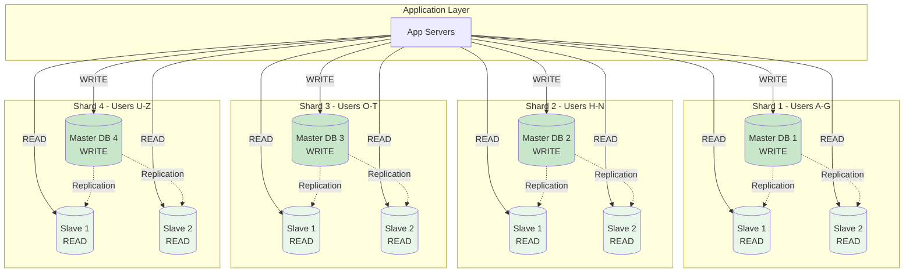
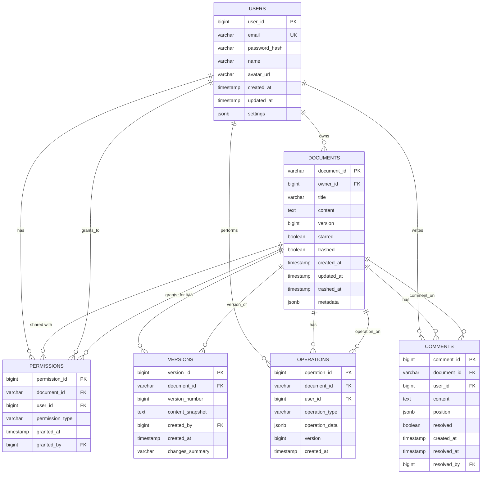

# Database Design - Google Docs

## Overview

This document covers the complete database schema for Google Docs, including:
- Complete table schemas (users, documents, permissions, versions, operations)
- Indexes for performance optimization
- Sharding strategy and keys
- Replication setup
- Data consistency patterns
- Example queries

---

## Database Architecture



---

## Database Choice: PostgreSQL

**Why PostgreSQL over MySQL?**

| Feature | PostgreSQL ✓ | MySQL |
|---------|--------------|-------|
| **JSONB Support** | Excellent (indexable) | Basic JSON |
| **Full-Text Search** | Built-in (tsvector) | Requires separate index |
| **Concurrent Writes** | MVCC (better) | Row-level locking |
| **Complex Queries** | CTE, Window Functions | Limited |
| **Data Integrity** | Strict constraints | Permissive |
| **Replication** | Logical + Physical | Binary log |

**When to use MySQL:**
- Simpler data model
- Read-heavy workload
- Team familiar with MySQL

**When to use PostgreSQL (our case):**
- Complex data structures (JSONB for document content)
- Full-text search needed
- Strong consistency requirements
- Complex queries (permissions, sharing)

---

## Entity Relationship Diagram



---

## Complete Schema

### Table: users

Stores user account information.

```sql
CREATE TABLE users (
    user_id BIGSERIAL PRIMARY KEY,
    email VARCHAR(255) NOT NULL UNIQUE,
    password_hash VARCHAR(255),  -- NULL for OAuth users
    name VARCHAR(255) NOT NULL,
    avatar_url VARCHAR(500),
    oauth_provider VARCHAR(50),  -- 'google', 'github', NULL for email/password
    oauth_provider_id VARCHAR(255),
    email_verified BOOLEAN DEFAULT FALSE,
    created_at TIMESTAMP WITH TIME ZONE DEFAULT CURRENT_TIMESTAMP,
    updated_at TIMESTAMP WITH TIME ZONE DEFAULT CURRENT_TIMESTAMP,
    last_login_at TIMESTAMP WITH TIME ZONE,
    settings JSONB DEFAULT '{}',  -- User preferences
    status VARCHAR(20) DEFAULT 'active',  -- 'active', 'suspended', 'deleted'
    CONSTRAINT unique_oauth UNIQUE (oauth_provider, oauth_provider_id)
);

-- Indexes
CREATE INDEX idx_users_email ON users (email);
CREATE INDEX idx_users_created_at ON users (created_at);
CREATE INDEX idx_users_status ON users (status) WHERE status = 'active';
CREATE INDEX idx_users_oauth ON users (oauth_provider, oauth_provider_id);

-- Full-text search on name
CREATE INDEX idx_users_name_search ON users USING gin(to_tsvector('english', name));

-- Trigger to update updated_at
CREATE OR REPLACE FUNCTION update_updated_at_column()
RETURNS TRIGGER AS $$
BEGIN
    NEW.updated_at = CURRENT_TIMESTAMP;
    RETURN NEW;
END;
$$ LANGUAGE plpgsql;

CREATE TRIGGER update_users_updated_at
    BEFORE UPDATE ON users
    FOR EACH ROW
    EXECUTE FUNCTION update_updated_at_column();
```

**Example Row:**
```sql
INSERT INTO users (email, name, oauth_provider, oauth_provider_id)
VALUES (
    'john@example.com',
    'John Doe',
    'google',
    'google_123456789'
);
```

---

### Table: documents

Stores document metadata and content.

```sql
CREATE TABLE documents (
    document_id VARCHAR(50) PRIMARY KEY,  -- 'doc_' + nanoid(15)
    owner_id BIGINT NOT NULL,
    title VARCHAR(500) NOT NULL DEFAULT 'Untitled Document',
    content TEXT,  -- Full document content (or store in S3 for large docs)
    content_hash VARCHAR(64),  -- SHA-256 for change detection
    version BIGINT NOT NULL DEFAULT 1,
    word_count INTEGER DEFAULT 0,
    character_count INTEGER DEFAULT 0,
    starred BOOLEAN DEFAULT FALSE,
    trashed BOOLEAN DEFAULT FALSE,
    folder_id VARCHAR(50),  -- NULL for root folder
    created_at TIMESTAMP WITH TIME ZONE DEFAULT CURRENT_TIMESTAMP,
    updated_at TIMESTAMP WITH TIME ZONE DEFAULT CURRENT_TIMESTAMP,
    trashed_at TIMESTAMP WITH TIME ZONE,
    metadata JSONB DEFAULT '{}',  -- Custom metadata (tags, etc.)
    CONSTRAINT fk_documents_owner FOREIGN KEY (owner_id)
        REFERENCES users (user_id) ON DELETE CASCADE
);

-- Indexes
CREATE INDEX idx_documents_owner ON documents (owner_id);
CREATE INDEX idx_documents_created_at ON documents (created_at);
CREATE INDEX idx_documents_updated_at ON documents (updated_at);
CREATE INDEX idx_documents_starred ON documents (owner_id, starred) WHERE starred = TRUE;
CREATE INDEX idx_documents_trashed ON documents (owner_id, trashed) WHERE trashed = TRUE;

-- Full-text search on title and content
CREATE INDEX idx_documents_title_search ON documents USING gin(to_tsvector('english', title));
CREATE INDEX idx_documents_content_search ON documents USING gin(to_tsvector('english', content));

-- Composite index for common queries
CREATE INDEX idx_documents_owner_updated ON documents (owner_id, updated_at DESC);

-- Trigger to update updated_at
CREATE TRIGGER update_documents_updated_at
    BEFORE UPDATE ON documents
    FOR EACH ROW
    EXECUTE FUNCTION update_updated_at_column();
```

**Example Row:**
```sql
INSERT INTO documents (document_id, owner_id, title, content, version)
VALUES (
    'doc_abc123xyz',
    1,
    'Project Proposal',
    'This is the document content...',
    1
);
```

---

### Table: permissions

Stores document sharing permissions.

```sql
CREATE TABLE permissions (
    permission_id BIGSERIAL PRIMARY KEY,
    document_id VARCHAR(50) NOT NULL,
    user_id BIGINT NOT NULL,
    permission_type VARCHAR(20) NOT NULL,  -- 'owner', 'editor', 'commenter', 'viewer'
    granted_at TIMESTAMP WITH TIME ZONE DEFAULT CURRENT_TIMESTAMP,
    granted_by BIGINT NOT NULL,
    CONSTRAINT fk_permissions_document FOREIGN KEY (document_id)
        REFERENCES documents (document_id) ON DELETE CASCADE,
    CONSTRAINT fk_permissions_user FOREIGN KEY (user_id)
        REFERENCES users (user_id) ON DELETE CASCADE,
    CONSTRAINT fk_permissions_granted_by FOREIGN KEY (granted_by)
        REFERENCES users (user_id) ON DELETE CASCADE,
    CONSTRAINT unique_document_user UNIQUE (document_id, user_id),
    CONSTRAINT check_permission_type CHECK (
        permission_type IN ('owner', 'editor', 'commenter', 'viewer')
    )
);

-- Indexes
CREATE INDEX idx_permissions_document ON permissions (document_id);
CREATE INDEX idx_permissions_user ON permissions (user_id);
CREATE INDEX idx_permissions_document_user ON permissions (document_id, user_id);
CREATE INDEX idx_permissions_granted_at ON permissions (granted_at);

-- Partial index for editors (most common permission check)
CREATE INDEX idx_permissions_editors ON permissions (document_id, user_id)
    WHERE permission_type IN ('owner', 'editor');
```

**Example Row:**
```sql
INSERT INTO permissions (document_id, user_id, permission_type, granted_by)
VALUES (
    'doc_abc123xyz',
    2,  -- user_id of collaborator
    'editor',
    1   -- user_id of document owner
);
```

---

### Table: versions

Stores document version snapshots.

```sql
CREATE TABLE versions (
    version_id BIGSERIAL PRIMARY KEY,
    document_id VARCHAR(50) NOT NULL,
    version_number BIGINT NOT NULL,
    content_snapshot TEXT,  -- Full document content at this version
    content_s3_key VARCHAR(500),  -- Or store in S3 if large
    created_by BIGINT NOT NULL,
    created_at TIMESTAMP WITH TIME ZONE DEFAULT CURRENT_TIMESTAMP,
    changes_summary VARCHAR(500),
    size_bytes BIGINT,
    CONSTRAINT fk_versions_document FOREIGN KEY (document_id)
        REFERENCES documents (document_id) ON DELETE CASCADE,
    CONSTRAINT fk_versions_created_by FOREIGN KEY (created_by)
        REFERENCES users (user_id) ON DELETE SET NULL,
    CONSTRAINT unique_document_version UNIQUE (document_id, version_number)
);

-- Indexes
CREATE INDEX idx_versions_document ON versions (document_id);
CREATE INDEX idx_versions_document_version ON versions (document_id, version_number DESC);
CREATE INDEX idx_versions_created_at ON versions (created_at);

-- Partition by created_at (yearly partitions)
-- This is advanced, but useful for large-scale deployments
CREATE TABLE versions_2025 PARTITION OF versions
    FOR VALUES FROM ('2025-01-01') TO ('2026-01-01');
```

**Example Row:**
```sql
INSERT INTO versions (
    document_id,
    version_number,
    content_snapshot,
    created_by,
    changes_summary
) VALUES (
    'doc_abc123xyz',
    10,
    'Document content at version 10...',
    1,
    'Updated introduction and added conclusion'
);
```

---

### Table: operations

Stores Operational Transform operations for real-time collaboration.

```sql
CREATE TABLE operations (
    operation_id BIGSERIAL PRIMARY KEY,
    document_id VARCHAR(50) NOT NULL,
    user_id BIGINT NOT NULL,
    operation_type VARCHAR(20) NOT NULL,  -- 'insert', 'delete', 'retain'
    operation_data JSONB NOT NULL,  -- {position, text, length, etc.}
    version BIGINT NOT NULL,  -- Document version after this operation
    created_at TIMESTAMP WITH TIME ZONE DEFAULT CURRENT_TIMESTAMP,
    CONSTRAINT fk_operations_document FOREIGN KEY (document_id)
        REFERENCES documents (document_id) ON DELETE CASCADE,
    CONSTRAINT fk_operations_user FOREIGN KEY (user_id)
        REFERENCES users (user_id) ON DELETE SET NULL,
    CONSTRAINT check_operation_type CHECK (
        operation_type IN ('insert', 'delete', 'retain')
    )
);

-- Indexes
CREATE INDEX idx_operations_document ON operations (document_id);
CREATE INDEX idx_operations_document_version ON operations (document_id, version);
CREATE INDEX idx_operations_created_at ON operations (created_at);

-- Partial index for recent operations (most common query)
CREATE INDEX idx_operations_recent ON operations (document_id, version DESC)
    WHERE created_at > CURRENT_TIMESTAMP - INTERVAL '7 days';

-- Partition by created_at (daily partitions for high-volume data)
-- Automatically drop old partitions (e.g., >30 days)
CREATE TABLE operations_2025_01_15 PARTITION OF operations
    FOR VALUES FROM ('2025-01-15') TO ('2025-01-16');
```

**Example Row:**
```sql
INSERT INTO operations (
    document_id,
    user_id,
    operation_type,
    operation_data,
    version
) VALUES (
    'doc_abc123xyz',
    1,
    'insert',
    '{"position": 100, "text": "Hello World"}',
    11
);
```

---

### Table: comments

Stores document comments.

```sql
CREATE TABLE comments (
    comment_id BIGSERIAL PRIMARY KEY,
    document_id VARCHAR(50) NOT NULL,
    user_id BIGINT NOT NULL,
    content TEXT NOT NULL,
    position JSONB,  -- {start: 100, end: 200} for inline comments
    resolved BOOLEAN DEFAULT FALSE,
    created_at TIMESTAMP WITH TIME ZONE DEFAULT CURRENT_TIMESTAMP,
    updated_at TIMESTAMP WITH TIME ZONE DEFAULT CURRENT_TIMESTAMP,
    resolved_at TIMESTAMP WITH TIME ZONE,
    resolved_by BIGINT,
    CONSTRAINT fk_comments_document FOREIGN KEY (document_id)
        REFERENCES documents (document_id) ON DELETE CASCADE,
    CONSTRAINT fk_comments_user FOREIGN KEY (user_id)
        REFERENCES users (user_id) ON DELETE CASCADE,
    CONSTRAINT fk_comments_resolved_by FOREIGN KEY (resolved_by)
        REFERENCES users (user_id) ON DELETE SET NULL
);

-- Indexes
CREATE INDEX idx_comments_document ON comments (document_id);
CREATE INDEX idx_comments_user ON comments (user_id);
CREATE INDEX idx_comments_created_at ON comments (created_at);
CREATE INDEX idx_comments_unresolved ON comments (document_id, resolved) WHERE resolved = FALSE;

-- Trigger to update updated_at
CREATE TRIGGER update_comments_updated_at
    BEFORE UPDATE ON comments
    FOR EACH ROW
    EXECUTE FUNCTION update_updated_at_column();
```

**Example Row:**
```sql
INSERT INTO comments (
    document_id,
    user_id,
    content,
    position
) VALUES (
    'doc_abc123xyz',
    2,
    'This section needs more details',
    '{"start": 150, "end": 200}'
);
```

---

### Table: sessions (for tracking active sessions)

```sql
CREATE TABLE sessions (
    session_id VARCHAR(50) PRIMARY KEY,
    user_id BIGINT NOT NULL,
    document_id VARCHAR(50),
    refresh_token_hash VARCHAR(255),
    ip_address INET,
    user_agent TEXT,
    created_at TIMESTAMP WITH TIME ZONE DEFAULT CURRENT_TIMESTAMP,
    expires_at TIMESTAMP WITH TIME ZONE NOT NULL,
    last_activity_at TIMESTAMP WITH TIME ZONE DEFAULT CURRENT_TIMESTAMP,
    CONSTRAINT fk_sessions_user FOREIGN KEY (user_id)
        REFERENCES users (user_id) ON DELETE CASCADE,
    CONSTRAINT fk_sessions_document FOREIGN KEY (document_id)
        REFERENCES documents (document_id) ON DELETE SET NULL
);

-- Indexes
CREATE INDEX idx_sessions_user ON sessions (user_id);
CREATE INDEX idx_sessions_expires_at ON sessions (expires_at);
CREATE INDEX idx_sessions_document ON sessions (document_id) WHERE document_id IS NOT NULL;

-- Cleanup expired sessions (run via cron job)
DELETE FROM sessions WHERE expires_at < CURRENT_TIMESTAMP;
```

---

## Sharding Strategy

### Sharding Key: user_id

**Why user_id?**
- Most queries are "get my documents"
- User's documents co-located on same shard (fast queries)
- Sharing across users handled by querying multiple shards

**Shard Assignment:**
```sql
-- Hash function to determine shard
CREATE OR REPLACE FUNCTION get_shard_id(user_id BIGINT)
RETURNS INTEGER AS $$
BEGIN
    -- Use modulo to distribute across 4 shards (0, 1, 2, 3)
    RETURN user_id % 4;
END;
$$ LANGUAGE plpgsql IMMUTABLE;

-- Example usage
SELECT get_shard_id(12345);  -- Returns 1 (shard 1)
SELECT get_shard_id(67890);  -- Returns 2 (shard 2)
```

**Shard Distribution:**
```
Shard 0: user_id % 4 = 0  (25% of users)
Shard 1: user_id % 4 = 1  (25% of users)
Shard 2: user_id % 4 = 2  (25% of users)
Shard 3: user_id % 4 = 3  (25% of users)
```

### Application-Level Sharding

```javascript
// Shard router in application code
class ShardRouter {
  constructor() {
    this.shards = [
      { id: 0, master: 'db1-master:5432', slaves: ['db1-slave1:5432', 'db1-slave2:5432'] },
      { id: 1, master: 'db2-master:5432', slaves: ['db2-slave1:5432', 'db2-slave2:5432'] },
      { id: 2, master: 'db3-master:5432', slaves: ['db3-slave1:5432', 'db3-slave2:5432'] },
      { id: 3, master: 'db4-master:5432', slaves: ['db4-slave1:5432', 'db4-slave2:5432'] }
    ];
  }

  getShardId(userId) {
    return userId % 4;
  }

  getConnection(userId, operation = 'read') {
    const shardId = this.getShardId(userId);
    const shard = this.shards[shardId];

    if (operation === 'write') {
      return this.createConnection(shard.master);
    } else {
      // Round-robin across slaves
      const slaveIndex = Math.floor(Math.random() * shard.slaves.length);
      return this.createConnection(shard.slaves[slaveIndex]);
    }
  }

  createConnection(host) {
    return new Pool({
      host: host.split(':')[0],
      port: parseInt(host.split(':')[1]),
      database: 'google_docs',
      user: 'app_user',
      password: process.env.DB_PASSWORD,
      max: 20  // Connection pool size
    });
  }
}

// Usage
const router = new ShardRouter();

// Get user's documents (read from slave)
const userId = 12345;
const db = router.getConnection(userId, 'read');
const documents = await db.query(
  'SELECT * FROM documents WHERE owner_id = $1 ORDER BY updated_at DESC LIMIT 20',
  [userId]
);

// Create document (write to master)
const dbMaster = router.getConnection(userId, 'write');
await dbMaster.query(
  'INSERT INTO documents (document_id, owner_id, title) VALUES ($1, $2, $3)',
  ['doc_xyz789', userId, 'New Document']
);
```

---

## Common Queries

### 1. Get user's documents

```sql
-- Query executed on shard based on user_id
SELECT
    d.document_id,
    d.title,
    d.updated_at,
    d.starred,
    d.word_count,
    u.name AS owner_name,
    u.email AS owner_email
FROM documents d
INNER JOIN users u ON d.owner_id = u.user_id
WHERE d.owner_id = $1
    AND d.trashed = FALSE
ORDER BY d.updated_at DESC
LIMIT 20 OFFSET 0;

-- Uses index: idx_documents_owner_updated
```

---

### 2. Get document with permissions

```sql
-- Check if user has access to document
SELECT
    d.document_id,
    d.title,
    d.content,
    d.version,
    d.updated_at,
    COALESCE(p.permission_type, 'none') AS user_permission
FROM documents d
LEFT JOIN permissions p ON d.document_id = p.document_id AND p.user_id = $2
WHERE d.document_id = $1
    AND d.trashed = FALSE
    AND (
        d.owner_id = $2  -- User is owner
        OR p.user_id IS NOT NULL  -- User has explicit permission
    );

-- Uses indexes:
-- - idx_documents_pkey (document_id)
-- - idx_permissions_document_user (document_id, user_id)
```

---

### 3. Share document with user

```sql
-- Transaction to ensure atomicity
BEGIN;

-- Check if user has permission to share (owner or editor)
SELECT 1
FROM documents d
LEFT JOIN permissions p ON d.document_id = p.document_id AND p.user_id = $2
WHERE d.document_id = $1
    AND (d.owner_id = $2 OR p.permission_type IN ('owner', 'editor'))
FOR UPDATE;  -- Lock row

-- Insert new permission
INSERT INTO permissions (document_id, user_id, permission_type, granted_by)
VALUES ($1, $3, $4, $2)
ON CONFLICT (document_id, user_id)
DO UPDATE SET
    permission_type = EXCLUDED.permission_type,
    granted_at = CURRENT_TIMESTAMP,
    granted_by = EXCLUDED.granted_by;

COMMIT;
```

---

### 4. Get document version history

```sql
SELECT
    v.version_id,
    v.version_number,
    v.created_at,
    v.changes_summary,
    v.size_bytes,
    u.name AS created_by_name,
    u.avatar_url AS created_by_avatar
FROM versions v
INNER JOIN users u ON v.created_by = u.user_id
WHERE v.document_id = $1
ORDER BY v.version_number DESC
LIMIT 20 OFFSET 0;

-- Uses index: idx_versions_document_version
```

---

### 5. Get recent operations for Operational Transform

```sql
-- Get operations since client's last known version
SELECT
    operation_id,
    user_id,
    operation_type,
    operation_data,
    version,
    created_at
FROM operations
WHERE document_id = $1
    AND version > $2  -- Client's last version
ORDER BY version ASC
LIMIT 100;

-- Uses index: idx_operations_document_version
```

---

### 6. Search documents by title

```sql
-- Full-text search on title
SELECT
    d.document_id,
    d.title,
    d.updated_at,
    ts_rank(to_tsvector('english', d.title), query) AS rank
FROM documents d,
     to_tsquery('english', $2) query  -- Search term
WHERE d.owner_id = $1
    AND to_tsvector('english', d.title) @@ query
    AND d.trashed = FALSE
ORDER BY rank DESC, d.updated_at DESC
LIMIT 20;

-- Uses index: idx_documents_title_search (GIN index)
```

---

### 7. Get active collaborators (who's online)

```sql
SELECT DISTINCT
    u.user_id,
    u.name,
    u.avatar_url,
    s.last_activity_at
FROM sessions s
INNER JOIN users u ON s.user_id = u.user_id
WHERE s.document_id = $1
    AND s.expires_at > CURRENT_TIMESTAMP
    AND s.last_activity_at > CURRENT_TIMESTAMP - INTERVAL '5 minutes'
ORDER BY s.last_activity_at DESC;

-- Uses index: idx_sessions_document
```

---

## Data Consistency

### ACID Transactions

**Example: Share document (atomic)**
```sql
BEGIN ISOLATION LEVEL READ COMMITTED;

-- 1. Check permissions
SELECT 1 FROM documents
WHERE document_id = $1 AND owner_id = $2
FOR UPDATE;

-- 2. Insert permission
INSERT INTO permissions (document_id, user_id, permission_type, granted_by)
VALUES ($1, $3, 'editor', $2);

-- 3. Log activity
INSERT INTO activity_log (user_id, action, document_id)
VALUES ($2, 'shared_document', $1);

COMMIT;
```

### Eventual Consistency (Replication)

**Master → Slave Replication:**
```
Write to Master:         t = 0ms
Replicate to Slave 1:    t = 10ms
Replicate to Slave 2:    t = 12ms

If user reads from Slave 1 at t = 5ms:
  → Sees old data (stale read)

Solution: Read-after-write consistency
  → Read from master for 1 second after write
```

---

## Performance Optimization

### 1. Index Optimization

**Analyze index usage:**
```sql
-- Check index usage statistics
SELECT
    schemaname,
    tablename,
    indexname,
    idx_scan,  -- Number of index scans
    idx_tup_read,  -- Number of index entries returned
    idx_tup_fetch  -- Number of table rows fetched
FROM pg_stat_user_indexes
ORDER BY idx_scan DESC;

-- Identify unused indexes (candidates for removal)
SELECT
    schemaname,
    tablename,
    indexname
FROM pg_stat_user_indexes
WHERE idx_scan = 0
    AND indexrelname NOT LIKE '%_pkey';
```

### 2. Query Optimization

**Use EXPLAIN ANALYZE:**
```sql
EXPLAIN ANALYZE
SELECT * FROM documents
WHERE owner_id = 12345
ORDER BY updated_at DESC
LIMIT 20;

-- Output shows:
-- - Index Scan using idx_documents_owner_updated
-- - Execution time: 0.45 ms ✓
```

### 3. Connection Pooling

**PgBouncer Configuration:**
```ini
[databases]
google_docs = host=db-master port=5432 dbname=google_docs

[pgbouncer]
listen_addr = *
listen_port = 6432
auth_type = md5
auth_file = /etc/pgbouncer/userlist.txt
pool_mode = transaction  # Connection reused after transaction
max_client_conn = 10000  # Max client connections
default_pool_size = 25   # Connections per pool
reserve_pool_size = 5    # Reserve connections
```

**Benefits:**
- Reduce connection overhead (no repeated handshakes)
- Handle 10,000 clients with only 100 database connections
- Faster query execution

---

## Backup & Recovery

### Automated Backups

```sql
-- PostgreSQL continuous archiving (WAL)
-- postgresql.conf
wal_level = replica
archive_mode = on
archive_command = 'aws s3 cp %p s3://google-docs-backups/wal/%f'

-- Take base backup
pg_basebackup -D /backup/base -F tar -z -P

-- Restore from backup
pg_restore -d google_docs /backup/base.tar.gz
```

### Point-in-Time Recovery (PITR)

```sql
-- recovery.conf
restore_command = 'aws s3 cp s3://google-docs-backups/wal/%f %p'
recovery_target_time = '2025-01-15 18:30:00'
```

---

## Monitoring Queries

### 1. Slow Queries

```sql
-- Enable slow query logging (postgresql.conf)
log_min_duration_statement = 1000  -- Log queries > 1 second

-- View slow queries
SELECT
    query,
    calls,
    total_time,
    mean_time,
    max_time
FROM pg_stat_statements
ORDER BY mean_time DESC
LIMIT 10;
```

### 2. Database Size

```sql
-- Total database size
SELECT pg_size_pretty(pg_database_size('google_docs'));

-- Table sizes
SELECT
    tablename,
    pg_size_pretty(pg_total_relation_size(schemaname || '.' || tablename)) AS size
FROM pg_tables
WHERE schemaname = 'public'
ORDER BY pg_total_relation_size(schemaname || '.' || tablename) DESC;
```

### 3. Active Connections

```sql
-- Current active connections
SELECT
    datname,
    count(*) AS connections
FROM pg_stat_activity
WHERE state = 'active'
GROUP BY datname;

-- Long-running queries (> 5 minutes)
SELECT
    pid,
    now() - query_start AS duration,
    query,
    state
FROM pg_stat_activity
WHERE state = 'active'
    AND now() - query_start > interval '5 minutes'
ORDER BY duration DESC;
```

---

## Key Takeaways

1. **PostgreSQL Chosen**: JSONB support, full-text search, MVCC
2. **Sharding by user_id**: Co-locate user's documents on same shard
3. **Master-Slave Replication**: Writes to master, reads from slaves
4. **Indexes are Critical**: Optimize for common queries
5. **ACID Transactions**: Ensure data consistency for critical operations
6. **Connection Pooling**: PgBouncer to handle thousands of connections
7. **Full-Text Search**: Built-in GIN indexes for search
8. **Partitioning**: Split large tables (operations) by date
9. **Monitoring**: Track slow queries, database size, connections
10. **Backups**: Automated backups with PITR

---

## Next Steps

Now that we have the database schema, let's visualize the data flow:

→ Continue to [Data Flow Diagrams](./10_data_flow_diagrams.md)
