# Data Flow Diagrams - Google Docs

## Overview

This document visualizes the complete data flow for critical operations in Google Docs using sequence diagrams. Each diagram shows:
- Step-by-step interactions between components
- Timing and latency estimates
- Error handling scenarios
- Data consistency patterns

---

## 1. User Registration & Authentication Flow

### Registration with Email/Password


**Latency Breakdown:**
```
Input validation:        5ms
Database check:          20ms
Password hashing:        100ms (intentionally slow for security)
Database insert:         25ms
JWT generation:          5ms
Total:                   155ms ✓
```

---

### Login with OAuth (Google)


**Latency Breakdown:**
```
Google OAuth redirect:   user-dependent (5-30 seconds)
Exchange auth code:      200ms
Fetch user info:         150ms
Database upsert:         30ms
JWT generation:          5ms
Total (after user auth): 385ms ✓
```

---

## 2. Document Creation & Edit Flow

### Create New Document


**Latency Breakdown:**
```
JWT validation:          5ms
Generate document ID:    1ms
Database transaction:    40ms
Redis cache:             5ms
S3 upload (async):       N/A
Total:                   51ms ✓
```

---

### Real-Time Collaborative Editing


**Latency Breakdown (Single Edit):**
```
WebSocket send:          5ms
OT transformation:       10ms
Database write:          20ms
Redis Pub/Sub:           5ms
Broadcast to User 2:     10ms
Total (User 1 → User 2): 50ms ✓ Real-time!
```

**Conflict Resolution Example:**
```
Initial: "Hello World"
         0123456789AB

User A: Insert "Big " at position 6
User B: Insert "New " at position 6 (concurrent!)

OT Transformation:
1. User A's operation arrives first (version 10)
   → "Hello Big World"

2. User B's operation arrives (version 10, needs transform)
   → OT adjusts position: 6 + 4 = 10
   → "Hello Big New World"

Result: Consistent across all users ✓
```

---

## 3. Document Sharing Flow

### Share Document with Another User


**Latency Breakdown:**
```
Owner's perspective:
- Share request:         150ms (DB writes)
- Response received:     150ms ✓ Fast

Recipient's perspective:
- Email delivered:       +2-5 seconds (async)
- Total:                 2-5 seconds ✓ Acceptable
```

---

## 4. Document Export Flow

### Export Document to PDF (Async)

```mermaid
sequenceDiagram
    actor User
    participant Browser
    participant App as App Server
    participant DB as Database
    participant Kafka
    participant Worker as Export Worker
    participant S3
    participant Email as Email Service

    User->>Browser: Click "Download as PDF"
    Browser->>App: POST /api/v1/documents/doc123/export<br/>{format: "pdf"}

    App->>App: Authenticate user

    App->>DB: SELECT permission_type<br/>FROM permissions<br/>WHERE document_id = $1 AND user_id = $2

    alt No access
        App-->>Browser: 403 Forbidden
        Browser-->>User: "Access denied"
    end

    App->>App: Generate export_id<br/>export_abc123

    App->>DB: INSERT INTO exports<br/>(export_id, document_id, user_id, format, status='pending')

    App->>Kafka: PUBLISH exports topic<br/>{export_id, document_id, format: "pdf"}

    App-->>Browser: 202 Accepted<br/>{export_id, status: "pending", estimated_time: 10}

    Browser-->>User: "Generating PDF...<br/>We'll email you when ready"

    Note over Kafka,S3: Async processing

    Kafka->>Worker: Consume export event

    Worker->>DB: SELECT content FROM documents<br/>WHERE document_id = doc123
    DB-->>Worker: Document content (HTML/Markdown)

    Worker->>Worker: Convert to PDF<br/>(Puppeteer, wkhtmltopdf)<br/>⏱️ 5 seconds for 50-page doc

    Worker->>DB: UPDATE exports<br/>SET status = 'processing'

    alt Conversion fails
        Worker->>DB: UPDATE exports<br/>SET status = 'failed', error = ...
        Worker->>Kafka: PUBLISH notifications<br/>{type: "export_failed"}
        Kafka->>Email: Send failure email
    end

    Worker->>S3: Upload PDF<br/>s3://exports/doc123/export_abc123.pdf
    S3-->>Worker: Success

    Worker->>S3: Generate presigned URL<br/>(expires in 1 hour)
    S3-->>Worker: https://s3.../export_abc123.pdf?signature=...

    Worker->>DB: UPDATE exports<br/>SET status = 'completed', download_url = ...

    Worker->>Kafka: PUBLISH notifications topic<br/>{type: "export_ready", user_id, download_url}

    Kafka->>Email: Send notification email

    Email->>User: "Your PDF is ready!<br/>Download: [link]"

    Note over User,Browser: User clicks download link

    User->>Browser: Click download link
    Browser->>S3: GET presigned URL
    S3-->>Browser: PDF file (2 MB)
    Browser-->>User: File downloaded
```



**Latency Breakdown:**
```
User's request:          50ms
Kafka publish:           5ms
User receives response:  55ms ✓ Immediate

Background processing:
- Fetch document:        50ms
- Convert to PDF:        5 seconds (depends on size)
- Upload to S3:          2 seconds
- Send email:            1 second
Total background:        ~8 seconds

User receives email:     8 seconds after request ✓
```

**Why Async?**
- PDF generation is CPU-intensive (5-30 seconds)
- User doesn't wait (better UX)
- Worker can retry if it fails
- Scalable (add more workers if queue grows)

---

## 5. Conflict Resolution Flow

### Two Users Edit Same Position Simultaneously

```mermaid
sequenceDiagram
    actor Alice
    participant WS_A as WebSocket (Alice)
    participant OT as OT Engine
    participant DB as Database
    participant WS_B as WebSocket (Bob)
    actor Bob

    Note over Alice,Bob: Both viewing "Hello World" (version 10)

    par Alice and Bob edit simultaneously
        Alice->>WS_A: insert at pos=6 "Big "
        Bob->>WS_B: insert at pos=6 "New "
    end

    Note over WS_A,OT: Alice's operation arrives first

    WS_A->>OT: Transform op A<br/>{version: 10, type: insert, pos: 6, text: "Big "}
    OT->>DB: SELECT MAX(version) = 10
    OT-->>WS_A: No concurrent ops, use as-is

    WS_A->>DB: INSERT operation (version = 11)
    DB-->>WS_A: Success

    WS_A->>WS_A: Apply locally<br/>"Hello Big World"
    WS_A-->>Alice: ack {version: 11}

    WS_A->>DB: PUBLISH to Redis Pub/Sub

    Note over WS_B,OT: Bob's operation arrives (concurrent)

    WS_B->>OT: Transform op B<br/>{version: 10, type: insert, pos: 6, text: "New "}

    OT->>DB: SELECT operations<br/>WHERE version > 10
    DB-->>OT: Found op A (version 11)

    OT->>OT: Transform op B against op A<br/>pos 6 → pos 10 (after "Big ")

    OT-->>WS_B: Transformed op B<br/>{version: 11, pos: 10, text: "New "}

    WS_B->>DB: INSERT operation (version = 12)
    DB-->>WS_B: Success

    WS_B->>DB: PUBLISH to Redis Pub/Sub

    Note over Alice,Bob: Both receive remote edits

    WS_A->>Alice: remote_edit from Bob<br/>{version: 12, pos: 10, text: "New "}
    Alice->>Alice: Apply: "Hello Big New World"

    WS_B->>Bob: remote_edit from Alice<br/>{version: 11, pos: 6, text: "Big "}
    Bob->>Bob: Apply then own edit<br/>"Hello Big New World"

    Note over Alice,Bob: CONSISTENT STATE ✓<br/>Both see "Hello Big New World"
```



**Conflict Resolution Rules:**
1. **First Come, First Served**: Alice's operation (version 11) is accepted as-is
2. **Transform Later Operations**: Bob's operation transformed against Alice's
3. **Position Adjustment**: Bob's position 6 → 10 (after "Big ")
4. **Idempotent**: Applying operations in any order produces same result
5. **Eventual Consistency**: All users converge to same state

---

## 6. System Failure Scenarios

### Scenario 1: Database Master Failure


---

### Scenario 2: WebSocket Server Failure

```mermaid
sequenceDiagram
    actor User
    participant WS1 as WebSocket Server 1
    participant LB as Load Balancer
    participant WS2 as WebSocket Server 2
    participant Redis

    User->>WS1: Connected to doc123

    Note over WS1: 💥 SERVER CRASHES

    WS1--xUser: Connection closed

    User->>User: Detect disconnect<br/>(onclose event)

    User->>User: Wait 1 second<br/>(exponential backoff)

    User->>LB: Reconnect WebSocket
    LB->>WS2: Route to healthy server

    User->>WS2: auth + join_document

    WS2->>Redis: SADD doc:doc123:users user_id

    WS2->>Redis: GET doc:doc123:latest_version
    Redis-->>WS2: version = 47

    WS2-->>User: joined_document<br/>{version: 47, active_users: [...]}

    User->>User: Check local version (45)

    User->>WS2: request_operations<br/>{since_version: 45}

    WS2->>Redis: GET operations 46-47
    Redis-->>WS2: Operations data

    WS2-->>User: operations<br/>[op46, op47]

    User->>User: Apply missed operations<br/>Now at version 47 ✓

    Note over User: Seamless reconnection<br/>No data loss ✓
```



---

## 7. Performance Metrics Summary

### Latency Targets

| Operation | Target | Actual | Status |
|-----------|--------|--------|--------|
| User login | <200ms | 155ms | ✓ |
| Create document | <100ms | 51ms | ✓ |
| Load document | <200ms | 120ms | ✓ |
| Real-time edit (local) | <50ms | 40ms | ✓ |
| Real-time edit (broadcast) | <100ms | 50ms | ✓ |
| Share document | <200ms | 150ms | ✓ |
| Export request | <100ms | 55ms | ✓ |
| Export completion | <10s | 8s | ✓ |

### Throughput

```
Writes per second:       6,000,000 ops/sec
Reads per second:        250,000,000 ops/sec
WebSocket messages:      16,000,000 msg/sec
Concurrent users:        10,000,000
Database queries/sec:    500,000 (with caching)
```

### Availability

```
Target:                  99.99% (52 min downtime/year)
Achieved:                99.995% (26 min downtime/year)
MTTR (Mean Time To Recover): 30 seconds (auto-failover)
```

---

## Key Takeaways

1. **Async Operations**: Long-running tasks (export, email) don't block users
2. **OT for Collaboration**: Ensures eventual consistency across all users
3. **Graceful Degradation**: System continues working during partial failures
4. **Auto-Failover**: Database and WebSocket servers auto-recover
5. **Real-Time Updates**: <100ms latency for collaborative editing
6. **Idempotent Operations**: Can retry safely without side effects
7. **Transaction Boundaries**: Use ACID for critical operations (sharing)
8. **Cache Invalidation**: Explicit cache deletion after writes
9. **Exponential Backoff**: Retry failed operations with increasing delay
10. **Monitoring Everything**: Track latency, errors, queue depths

---

## Conclusion

Congratulations! You've learned the complete High-Level Design of Google Docs:

**What We Built:**
- ✅ Scalable to 100M users, 10M concurrent
- ✅ Real-time collaborative editing with OT
- ✅ Global deployment with CDN and multi-region
- ✅ 99.99% availability with auto-failover
- ✅ <100ms latency for real-time edits
- ✅ Comprehensive API design
- ✅ Optimized database schema with sharding
- ✅ Complete data flow visualization

**Core Design Principles:**
1. Start simple, scale incrementally
2. Cache aggressively, invalidate carefully
3. Async for slow operations
4. Stateless app servers, stateful WebSocket servers
5. Shard by user for data locality
6. Replicate for reads, shard for writes
7. Monitor everything, alert proactively

---

## Further Reading

**Related HLD Documents:**
- [Step 1: Basic Architecture](./02_step1_basic_architecture.md)
- [Step 2: Caching](./03_step2_add_caching.md)
- [Step 3: Database Scaling](./04_step3_database_scaling.md)
- [Step 4: Real-Time & Messaging](./05_step4_realtime_and_messaging.md)
- [Step 5: CDN & Storage](./06_step5_cdn_and_storage.md)
- [Step 6: Final Architecture](./07_step6_final_architecture.md)
- [API Design](./08_api_design.md)
- [Database Design](./09_database_design.md)

**External Resources:**
- [Operational Transform Explained](https://operational-transformation.github.io/)
- [Google Wave OT Paper](https://svn.apache.org/repos/asf/incubator/wave/whitepapers/operational-transform/operational-transform.html)
- [Database Sharding Strategies](https://www.mongodb.com/basics/sharding)
- [PostgreSQL Performance Tuning](https://wiki.postgresql.org/wiki/Performance_Optimization)
- [WebSocket Best Practices](https://developer.mozilla.org/en-US/docs/Web/API/WebSockets_API/Writing_WebSocket_servers)

---

## Interview Preparation

**Common Questions:**

1. **Q: Why Operational Transform over CRDT?**
   - A: OT better for rich text formatting, smaller data size, proven at scale in Google Docs

2. **Q: How do you handle a user editing offline?**
   - A: Queue operations locally, sync when online, OT resolves conflicts

3. **Q: What if two users delete the same text?**
   - A: OT transforms both deletes, second one becomes no-op (already deleted)

4. **Q: How do you scale WebSocket servers?**
   - A: Horizontal scaling + sticky sessions + Redis Pub/Sub for cross-server messaging

5. **Q: Database sharding by user_id causes hot shards?**
   - A: Monitor shard distribution, re-shard if needed, use consistent hashing

6. **Q: How do you handle eventually-consistent reads?**
   - A: Read-after-write consistency: read from master for 1s after write

7. **Q: What happens if Kafka is down?**
   - A: Buffer in app server memory, retry, or degrade gracefully (skip emails)

8. **Q: How do you prevent data loss during crashes?**
   - A: Database replication, S3 versioning, operations log for replay

9. **Q: Cross-region latency too high?**
   - A: Accept async writes (50-100ms), prioritize local reads (<20ms)

10. **Q: How to test OT algorithm?**
    - A: Property-based testing (QuickCheck), fuzz testing, convergence tests

---

**You're now ready to design and discuss Google Docs architecture in interviews!** 🚀
