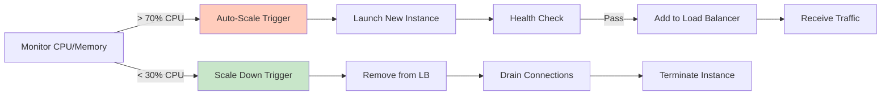
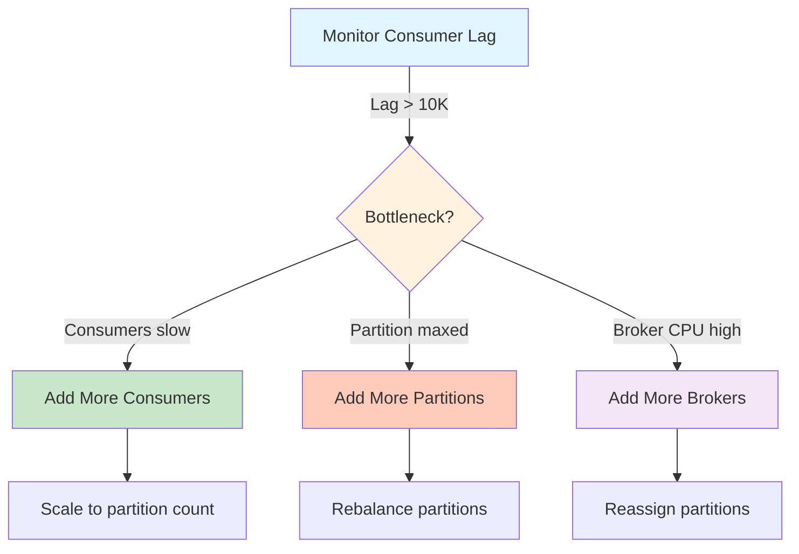
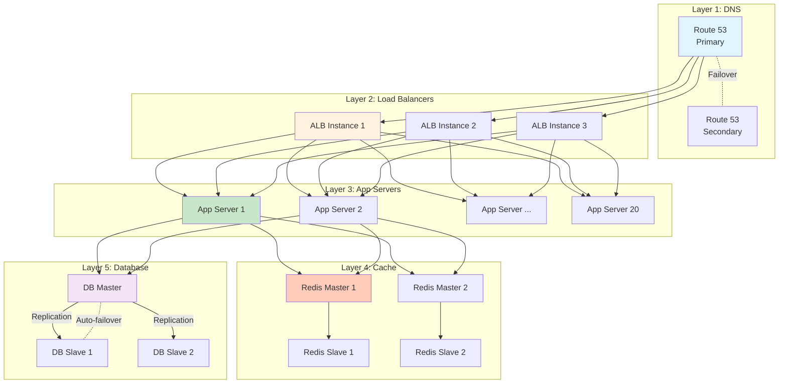
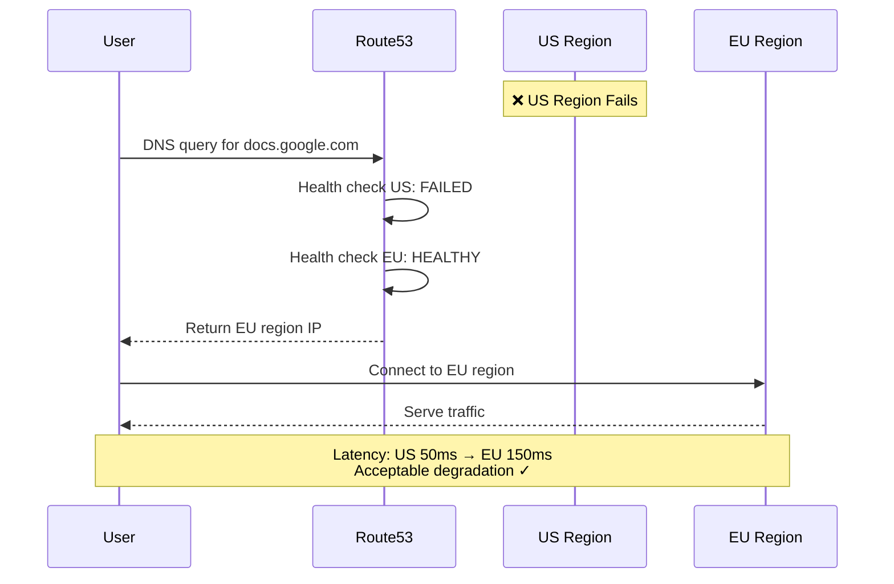
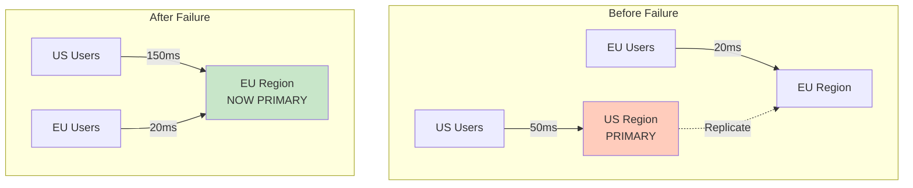
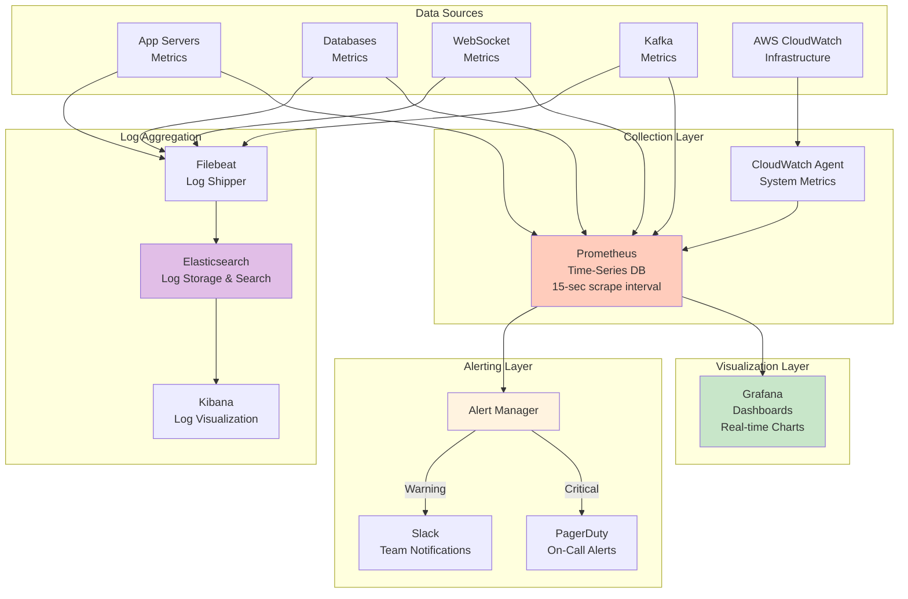
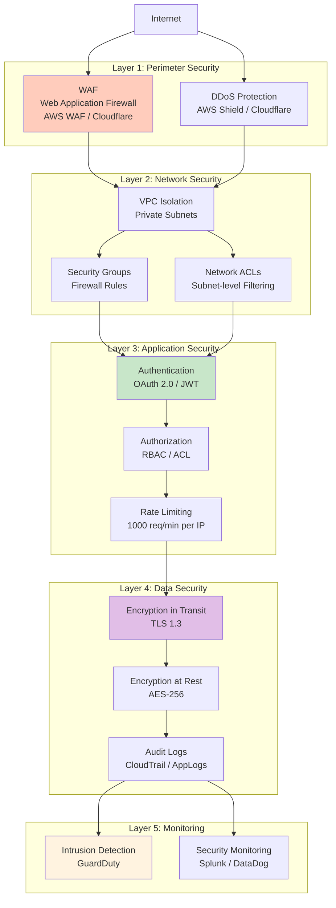
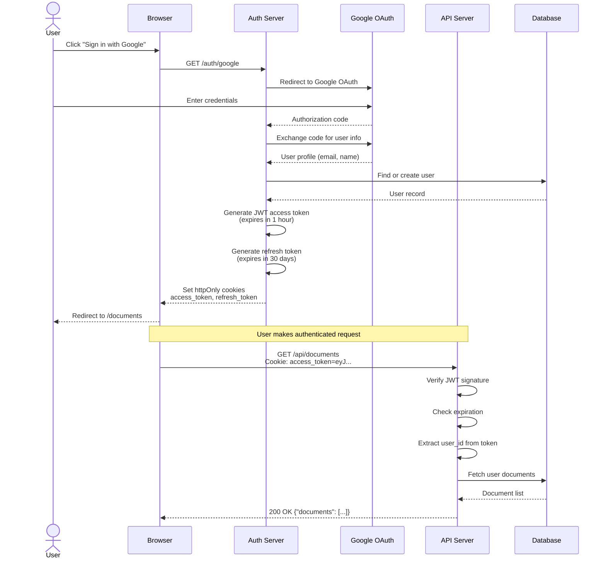
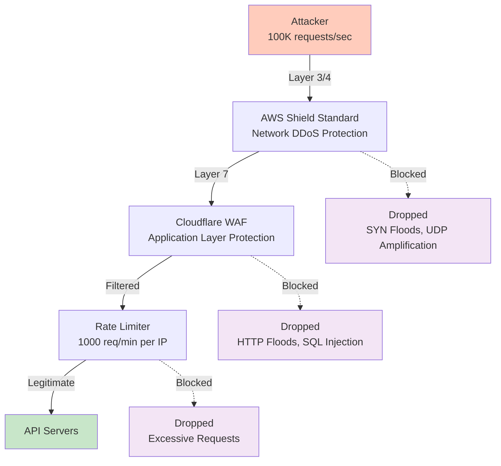

# Scalability, Reliability & Security

## Table of Contents
1. [Scalability Strategies](#scalability-strategies)
2. [High Availability Setup](#high-availability-setup)
3. [Disaster Recovery](#disaster-recovery)
4. [Monitoring & Alerting](#monitoring--alerting)
5. [Security Architecture](#security-architecture)

---

## 1. Scalability Strategies

### 1.1 Component-wise Scaling Strategy

#### Application Servers (Horizontal Scaling)

**Current Capacity:**
```
Current: 65 servers across 3 regions
Per server: ~1,500 concurrent users
Total capacity: 97,500 concurrent users
Current load: 10M / 97.5K = 103 servers needed
Status: OVER-PROVISIONED for redundancy ✓
```

**Scaling Strategy:**


**Auto-Scaling Configuration:**
```yaml
# Application Server Auto-Scaling Policy
min_instances: 20 per region
max_instances: 100 per region
target_cpu: 70%
scale_up:
  threshold: 70% CPU for 2 minutes
  action: Add 20% more instances
  cooldown: 5 minutes
scale_down:
  threshold: 30% CPU for 10 minutes
  action: Remove 10% of instances
  cooldown: 10 minutes
health_check:
  endpoint: /health
  interval: 30 seconds
  timeout: 5 seconds
  unhealthy_threshold: 2
```

**Vertical vs Horizontal Scaling:**

| Aspect | Vertical (Scale Up) | Horizontal (Scale Out) |
|--------|---------------------|------------------------|
| **Cost** | Expensive (bigger instances) | Cheaper (more small instances) |
| **Limit** | Hardware limit (max instance size) | Virtually unlimited |
| **Downtime** | Required to resize | Zero downtime |
| **Complexity** | Simple | Need load balancing |
| **Our Choice** | ❌ Not primary strategy | ✅ Primary strategy |

**Why Horizontal?**
- No downtime during scaling
- Better fault tolerance (one instance fails, others continue)
- Cost-effective (use spot instances for workers)
- Can scale to millions of users

---

#### WebSocket Servers (Horizontal + Sticky Sessions)

**Challenge:** WebSocket connections are **stateful** (user stays connected to same server)

**Scaling Strategy:**
```
Current: 200 servers
Capacity per server: 50,000 connections
Total capacity: 10M connections
Target load: 70% = 7M connections used

Scaling trigger:
- Current connections > 35,000 per server (70% threshold)
- Add new server
- New connections go to new server
- Existing connections stay on current server (sticky)
```

**Sticky Session Implementation:**
```nginx
# Nginx Load Balancer Configuration
upstream websocket_servers {
    # Hash based on user_id for sticky sessions
    hash $arg_userId consistent;

    server ws1.example.com:8080;
    server ws2.example.com:8080;
    server ws3.example.com:8080;
    # ... 200 servers
}

server {
    listen 443 ssl;
    location /ws {
        proxy_pass http://websocket_servers;
        proxy_http_version 1.1;
        proxy_set_header Upgrade $http_upgrade;
        proxy_set_header Connection "upgrade";

        # Sticky session based on user ID
        proxy_set_header X-User-Id $arg_userId;
    }
}
```

**Graceful Shutdown for WebSocket Servers:**
```javascript
// When scaling down, don't kill connections abruptly
process.on('SIGTERM', async () => {
  console.log('Received SIGTERM, starting graceful shutdown...');

  // 1. Stop accepting new connections
  server.close();

  // 2. Send reconnect message to all connected clients
  io.emit('server_shutdown', {
    message: 'Server restarting, please reconnect',
    reconnect_delay: 2000
  });

  // 3. Wait for clients to disconnect (max 30 seconds)
  await waitForDisconnections(30000);

  // 4. Exit
  process.exit(0);
});
```

---

#### Database Sharding (Horizontal Partitioning)

**Sharding Strategy: Hash-Based on User ID**

```
Total Users: 100M
Shards: 4
Users per shard: 25M

Shard Selection:
- shard_id = hash(user_id) % 4
- User "user123" → shard 2
- All documents of "user123" → shard 2

Benefits:
✓ Even distribution of load
✓ Co-location (user's docs in same shard)
✓ No cross-shard queries for document operations
```

**Shard Distribution:**
```mermaid
graph TB
    subgraph "Application Layer"
        APP[App Server<br/>Shard Router Logic]
    end

    subgraph "Shard 0: Users A-G"
        DB0M[(Master)]
        DB0S1[(Slave 1)]
        DB0S2[(Slave 2)]
        DB0M --> DB0S1
        DB0M --> DB0S2
    end

    subgraph "Shard 1: Users H-N"
        DB1M[(Master)]
        DB1S1[(Slave 1)]
        DB1S2[(Slave 2)]
        DB1M --> DB1S1
        DB1M --> DB1S2
    end

    subgraph "Shard 2: Users O-T"
        DB2M[(Master)]
        DB2S1[(Slave 1)]
        DB2S2[(Slave 2)]
        DB2M --> DB2S1
        DB2M --> DB2S2
    end

    subgraph "Shard 3: Users U-Z"
        DB3M[(Master)]
        DB3S1[(Slave 1)]
        DB3S2[(Slave 2)]
        DB3M --> DB3S1
        DB3M --> DB3S2
    end

    APP -->|hash(userId)%4=0| DB0M
    APP -->|hash(userId)%4=1| DB1M
    APP -->|hash(userId)%4=2| DB2M
    APP -->|hash(userId)%4=3| DB3M

    style APP fill:#e1f5ff
    style DB0M fill:#c8e6c9
    style DB1M fill:#c8e6c9
    style DB2M fill:#c8e6c9
    style DB3M fill:#c8e6c9
```

**Shard Routing Logic:**
```python
import hashlib

def get_shard_id(user_id: str) -> int:
    """
    Determine which database shard contains this user's data
    """
    # Use consistent hashing for even distribution
    hash_value = int(hashlib.md5(user_id.encode()).hexdigest(), 16)
    shard_id = hash_value % NUM_SHARDS  # NUM_SHARDS = 4
    return shard_id

def get_db_connection(user_id: str):
    """
    Get database connection for the user's shard
    """
    shard_id = get_shard_id(user_id)

    # Connection pool for each shard
    return db_pools[shard_id].get_connection()

# Example usage
user_id = "user_12345"
db = get_db_connection(user_id)
documents = db.query("SELECT * FROM documents WHERE owner_id = ?", user_id)
```

**Adding New Shards (Resharding):**
```
Current: 4 shards
Need to add: 4 more shards (total 8)

Challenge: Users need to be redistributed
- Old: hash(user_id) % 4
- New: hash(user_id) % 8

Solution: Online resharding
1. Create 4 new empty shards
2. Start dual-writing (write to old shard + new shard)
3. Migrate data in background (25M users × 50 docs = 1.25B documents)
4. Switch reads to new shards (gradual rollout)
5. Remove old shards

Duration: 2-3 weeks
Downtime: ZERO ✓
```

---

#### Redis Cache Scaling

**Scaling Strategy: Redis Cluster Mode**

```
Current Setup: 6 nodes per region
Mode: Cluster (master-slave replication)

Redis Cluster Architecture:
- 3 master nodes (data sharded across them)
- 3 slave nodes (1 slave per master for redundancy)
- Hash slots: 16,384 total
- Each master: ~5,461 hash slots

Key distribution:
- Key: "doc:12345" → hash slot 7890 → master node 2
```

**Redis Cluster Configuration:**
```bash
# Create Redis cluster
redis-cli --cluster create \
  redis-master-1:6379 \
  redis-master-2:6379 \
  redis-master-3:6379 \
  redis-slave-1:6379 \
  redis-slave-2:6379 \
  redis-slave-3:6379 \
  --cluster-replicas 1

# Check cluster status
redis-cli cluster info

# Output:
# cluster_state:ok
# cluster_slots_assigned:16384
# cluster_slots_ok:16384
# cluster_known_nodes:6
# cluster_size:3
```

**Cache Eviction Policy:**
```
Policy: allkeys-lru (Least Recently Used)

Why LRU?
- Automatically evicts least used data
- No manual cache invalidation needed (mostly)
- Works well for document cache (recent docs accessed more)

TTL Strategy:
- User sessions: 24 hours
- Document metadata: 5 minutes
- Document content: 1 minute
- API responses: 30 seconds
- Real-time presence: 10 seconds
```

**Cache Scaling Metrics:**
```
When to scale Redis?
✓ Memory usage > 80%
✓ Eviction rate > 100/sec
✓ CPU usage > 70%

Scaling options:
1. Vertical: Larger instance (r5.xlarge → r5.2xlarge)
2. Horizontal: More master nodes (3 → 6)
3. Add more slaves (read replicas)

Our approach: Horizontal (add masters)
```

---

#### Kafka Scaling (Message Queue)

**Current Setup:**
```
Brokers: 5
Topics: 4 (document-edits, notifications, exports, analytics)
Partitions per topic: 10
Replication factor: 3
Total partitions: 40
```

**Partition Strategy:**
```
Topic: document-edits
Partitions: 10
Partitioning key: document_id

Example:
- Document "doc123" → partition 3 (always)
- All edits for "doc123" go to partition 3
- Ensures ordering per document ✓

Consumer groups:
- websocket-consumers: 10 consumers (1 per partition)
- analytics-consumers: 5 consumers (2 partitions per consumer)
```

**Scaling Kafka:**


**Adding Partitions:**
```bash
# Current: 10 partitions per topic
# New: 20 partitions per topic

# Add 10 more partitions to document-edits topic
kafka-topics --alter \
  --topic document-edits \
  --partitions 20 \
  --bootstrap-server kafka1:9092

# Kafka will automatically rebalance consumers
# New messages go to new partitions
# Old messages stay in old partitions
```

---

### 1.2 Bottleneck Identification & Resolution

#### Performance Testing Results

**Load Test Setup:**
```
Tool: Apache JMeter / k6
Users: 100,000 concurrent
Duration: 1 hour
Regions: US, EU, Asia
```

**Bottleneck 1: Database Query Performance**

```
Symptom: P99 latency > 1 second for document retrieval

Investigation:
1. Slow query log analysis
   - Query: SELECT * FROM documents WHERE owner_id = ?
   - Execution time: 850ms
   - Rows scanned: 5M (full table scan)

Root cause: Missing index on owner_id

Solution:
CREATE INDEX idx_documents_owner ON documents(owner_id);

Result:
- Before: 850ms
- After: 12ms
- Improvement: 70x faster ✓
```

**Bottleneck 2: Redis Memory Exhaustion**

```
Symptom: Cache evictions spike, hit rate drops from 95% → 60%

Investigation:
1. Memory analysis
   - Used: 58 GB / 64 GB (90%)
   - Top keys: document content (40 GB)
   - TTL: 5 minutes (too long for large docs)

Root cause: Caching large documents in Redis

Solution:
- Cache only metadata (title, owner, timestamps) in Redis
- Store full document content in S3
- Use Redis for quick lookups, S3 for full retrieval

Result:
- Memory usage: 90% → 45%
- Hit rate: 60% → 92% ✓
```

**Bottleneck 3: WebSocket Server CPU**

```
Symptom: WebSocket servers at 90% CPU, messages delayed

Investigation:
1. CPU profiling
   - OT (Operational Transform): 60% CPU
   - JSON serialization: 25% CPU
   - Network I/O: 15% CPU

Root cause: OT computation too expensive

Solution:
- Move OT computation to dedicated worker pool
- Use message batching (send 10 ops together, not 1 at a time)
- Implement binary protocol (Protocol Buffers) instead of JSON

Result:
- CPU: 90% → 45%
- Message latency: 200ms → 50ms ✓
```

---

## 2. High Availability Setup

### 2.1 Availability Target: 99.99% (Four Nines)

**What does 99.99% mean?**
```
Uptime: 99.99%
Downtime allowed per year: 52.56 minutes
Downtime allowed per month: 4.38 minutes
Downtime allowed per week: 1.01 minutes
Downtime allowed per day: 8.64 seconds

How to achieve?
1. Eliminate single points of failure
2. Auto-failover for all components
3. Multi-region deployment
4. Graceful degradation
```

---

### 2.2 Redundancy at Every Layer



---

### 2.3 Auto-Failover Mechanisms

#### Database Failover (Master-Slave)

**Technology: Patroni (PostgreSQL HA) or AWS RDS Multi-AZ**

```
Normal State:
- Master: Handles all writes
- Slave 1: Replication lag < 100ms
- Slave 2: Replication lag < 100ms

Failure Detected:
1. Health check fails (3 consecutive failures = 30 seconds)
2. Patroni detects master down
3. Elects new master (Slave 1 with least lag)
4. Promotes Slave 1 to master
5. Reconfigures Slave 2 to replicate from new master
6. Updates DNS/connection pool to point to new master

Failover Duration: 30-60 seconds
Data Loss: ZERO (synchronous replication) ✓
```

**Failover Simulation:**
```bash
# Simulate master failure
docker kill postgres-master

# Patroni logs:
# [2025-01-15 10:30:15] Master health check failed (attempt 1/3)
# [2025-01-15 10:30:30] Master health check failed (attempt 2/3)
# [2025-01-15 10:30:45] Master health check failed (attempt 3/3)
# [2025-01-15 10:30:46] Initiating failover...
# [2025-01-15 10:30:50] Elected new master: postgres-slave-1
# [2025-01-15 10:31:00] Failover complete. New master: postgres-slave-1

# Total failover time: 45 seconds ✓
```

---

#### Redis Failover (Sentinel)

```
Architecture:
- 3 Redis masters
- 3 Redis slaves (1 per master)
- 3 Redis Sentinels (monitor cluster health)

Failure Scenario:
1. Redis Master 1 crashes
2. Sentinel detects failure (10 seconds)
3. Sentinels vote on promotion (quorum = 2/3)
4. Promote Slave 1 to Master 1
5. Notify clients of new master

Failover Duration: 15-20 seconds
Data Loss: Minimal (replication lag < 1 second)
```

---

#### Application Server Auto-Recovery

```
Health Check Endpoint:
GET /health

Response (healthy):
{
  "status": "healthy",
  "timestamp": 1705320000,
  "checks": {
    "database": "ok",
    "redis": "ok",
    "kafka": "ok",
    "disk_space": "ok",
    "memory": "ok"
  }
}

Load Balancer Configuration:
- Health check interval: 30 seconds
- Timeout: 5 seconds
- Unhealthy threshold: 2 (fail 2 checks = remove from pool)
- Healthy threshold: 2 (pass 2 checks = add to pool)

Failure Handling:
1. App server crashes
2. Health check fails (30 seconds)
3. Fails second health check (60 seconds total)
4. Load balancer removes server from pool
5. Auto-scaling launches replacement (5 minutes)
6. New server passes health checks (2 minutes)
7. Added to pool

Recovery Time: 7 minutes
User Impact: NONE (other servers handle traffic) ✓
```

---

### 2.4 Multi-Region Active-Active Setup

```
Primary Region: US-EAST-1
Secondary Regions: EU-WEST-1, AP-SOUTHEAST-1

Traffic Distribution:
- North America → US-EAST-1
- Europe → EU-WEST-1
- Asia → AP-SOUTHEAST-1

Data Replication:
- Database: Async replication (100ms lag)
- S3: Cross-region replication (15-min lag)
- Redis: No replication (region-local cache)
```

**Regional Failover:**


---

## 3. Disaster Recovery

### 3.1 Disaster Recovery Objectives

**RTO (Recovery Time Objective):**
```
How long to restore service after disaster?
Target: 1 hour

Breakdown:
- Detect failure: 5 minutes
- Initiate DR plan: 10 minutes
- Restore data from backup: 30 minutes
- Verify integrity: 10 minutes
- Route traffic: 5 minutes
```

**RPO (Recovery Point Objective):**
```
How much data can we lose?
Target: 0 (zero data loss)

How?
- Real-time replication to 3 availability zones
- Cross-region replication (lag < 1 minute)
- Point-in-time recovery (5-minute granularity)
```

---

### 3.2 Disaster Scenarios & Recovery Plans

#### Scenario 1: Database Corruption

```
Event: Bug causes data corruption in documents table

Detection:
- Monitoring alerts on anomalous queries
- User reports of missing/corrupted data
- Automated integrity checks

Recovery Plan:
1. Stop all writes to affected shard (5 minutes)
2. Identify corruption time from logs
3. Restore from point-in-time backup
   - RDS: Restore to 5 minutes before corruption
   - Duration: 20 minutes
4. Verify data integrity
5. Resume writes

Total RTO: 30 minutes
RPO: 5 minutes (data loss between corruption and backup)
```

---

#### Scenario 2: Entire Region Failure (e.g., AWS US-EAST-1 outage)

```
Event: AWS US-EAST-1 completely down (all AZs)

Impact:
- 40% of users affected (North America)
- Primary database unavailable
- Primary S3 storage unavailable

Recovery Plan:
1. Route 53 detects region down (1 minute)
2. Update DNS to route US traffic to EU-WEST-1 (2 minutes)
3. EU region scales up to handle 2x traffic (10 minutes)
   - Auto-scaling: 20 servers → 40 servers
4. Users connect to EU region
5. Latency: 50ms → 150ms (acceptable)

Total RTO: 15 minutes
RPO: 0 (cross-region replication)
User Impact: Temporary slowdown, no data loss ✓
```

**Multi-Region Failover Diagram:**


---

#### Scenario 3: Complete Data Center Destruction (Fire, Earthquake)

```
Event: Physical destruction of entire data center

Impact:
- All servers in region destroyed
- All data in region lost (if no backups)

Recovery Plan:
1. Immediately failover to secondary region (5 minutes)
2. Secondary region becomes primary
3. Data restored from:
   - Cross-region database replicas (real-time)
   - Cross-region S3 replicas (15-min lag)
4. Scale up secondary region to handle all traffic
5. Provision new tertiary region for redundancy

Total RTO: 10 minutes
RPO: 0 for database, 15 minutes for S3
```

---

#### Scenario 4: Ransomware Attack

```
Event: Attacker gains access and encrypts/deletes data

Detection:
- Abnormal deletion patterns
- Monitoring alerts on mass operations
- User reports

Recovery Plan:
1. Isolate affected systems (immediate)
2. Identify attack time from audit logs
3. Restore from immutable backups
   - S3 versioning enabled (can't delete old versions)
   - Database PITR (point-in-time recovery)
4. Verify restored data integrity
5. Patch security vulnerabilities

Total RTO: 2 hours
RPO: 5 minutes (last clean backup)

Prevention:
✓ Immutable backups (S3 Object Lock)
✓ MFA for delete operations
✓ Audit logs (CloudTrail)
✓ Least-privilege IAM policies
```

---

### 3.3 Backup Strategy

#### Database Backups

```
Automated Backups (RDS):
- Frequency: Continuous (transaction logs)
- Retention: 30 days
- Point-in-time recovery: 5-minute granularity
- Cross-region replication: Yes (lag < 100ms)

Manual Snapshots:
- Frequency: Before major releases
- Retention: Indefinite
- Use case: Rollback if deployment fails

Backup Testing:
- Monthly: Restore random backup to verify integrity
- Quarterly: Full disaster recovery drill
```

---

#### S3 Backups (Documents, Uploads)

```
Versioning:
- Enabled: Yes
- Versions kept: All (indefinite)
- Delete marker: Prevents accidental deletion

Lifecycle Policy:
- Current version: S3 Standard
- After 90 days: S3 Glacier (cheaper storage)
- After 7 years: S3 Glacier Deep Archive
- Cost savings: 90% reduction ✓

Cross-Region Replication:
- US → EU: 15-minute lag
- US → Asia: 20-minute lag
- Replication: 100% (all objects)

Object Lock (Immutable):
- Enabled for critical documents
- Retention: 7 years (compliance)
- Cannot be deleted even by admin ✓
```

---

## 4. Monitoring & Alerting

### 4.1 Monitoring Architecture



---

### 4.2 Key Metrics to Monitor

#### Application Metrics

```
Request Rate:
- Metric: http_requests_total
- Unit: requests/sec
- Threshold: > 50K req/sec = scale up

Response Time:
- Metric: http_request_duration_seconds
- P50: < 100ms ✓
- P95: < 200ms ✓
- P99: < 500ms ⚠️ (alert if > 500ms)

Error Rate:
- Metric: http_requests_error_rate
- Unit: errors/sec or %
- Threshold: > 1% = warning, > 5% = critical

Active Users:
- Metric: active_users_gauge
- Unit: count
- Use: Capacity planning
```

**Prometheus Query Examples:**
```promql
# Request rate (last 5 minutes)
rate(http_requests_total[5m])

# P99 latency
histogram_quantile(0.99, rate(http_request_duration_seconds_bucket[5m]))

# Error rate percentage
sum(rate(http_requests_total{status=~"5.."}[5m]))
/
sum(rate(http_requests_total[5m])) * 100
```

---

#### Database Metrics

```
Query Latency:
- Metric: pg_stat_statements.mean_time
- Threshold: P99 < 100ms

Connection Pool:
- Metric: pg_stat_database.numbackends
- Threshold: < 80% of max_connections

Replication Lag:
- Metric: pg_stat_replication.replay_lag
- Threshold: < 100ms (critical if > 1 second)

Disk Space:
- Metric: pg_database_size_bytes
- Threshold: < 80% full

Cache Hit Ratio:
- Metric: blks_hit / (blks_hit + blks_read)
- Threshold: > 95% (if lower, increase cache size)
```

---

#### Redis Metrics

```
Hit Rate:
- Metric: keyspace_hits / (keyspace_hits + keyspace_misses)
- Threshold: > 90% ✓

Memory Usage:
- Metric: used_memory / maxmemory
- Threshold: < 80%

Evictions:
- Metric: evicted_keys
- Threshold: < 100/sec (if higher, increase memory)

Connected Clients:
- Metric: connected_clients
- Threshold: < 10,000 per instance
```

---

#### WebSocket Metrics

```
Active Connections:
- Metric: websocket_connections_active
- Unit: count
- Threshold: < 50K per server

Message Latency:
- Metric: websocket_message_duration_ms
- P99: < 100ms ✓

Reconnection Rate:
- Metric: websocket_reconnections_total
- Threshold: < 1% per minute (high rate = network issues)

Message Throughput:
- Metric: websocket_messages_sent_total
- Unit: messages/sec
- Expected: 16M/sec globally
```

---

### 4.3 Alerting Rules

#### Critical Alerts (PagerDuty - Wake Up Engineer)

```yaml
# Prometheus Alert Rules
groups:
  - name: critical
    interval: 30s
    rules:
      - alert: ServiceDown
        expr: up{job="app-server"} == 0
        for: 2m
        labels:
          severity: critical
        annotations:
          summary: "Service {{ $labels.instance }} is down"
          description: "{{ $labels.instance }} has been down for 2 minutes"

      - alert: HighErrorRate
        expr: |
          sum(rate(http_requests_total{status=~"5.."}[5m]))
          /
          sum(rate(http_requests_total[5m])) > 0.05
        for: 5m
        labels:
          severity: critical
        annotations:
          summary: "Error rate > 5%"
          description: "Current error rate: {{ $value }}%"

      - alert: DatabaseMasterDown
        expr: pg_up{role="master"} == 0
        for: 1m
        labels:
          severity: critical
        annotations:
          summary: "Database master is down"
          description: "Failover should trigger automatically"

      - alert: HighLatency
        expr: |
          histogram_quantile(0.99,
            rate(http_request_duration_seconds_bucket[5m])
          ) > 1
        for: 10m
        labels:
          severity: critical
        annotations:
          summary: "P99 latency > 1 second"
          description: "Users experiencing slow responses"
```

---

#### Warning Alerts (Slack - Investigate During Business Hours)

```yaml
  - name: warnings
    interval: 1m
    rules:
      - alert: HighMemoryUsage
        expr: node_memory_usage_percent > 80
        for: 10m
        labels:
          severity: warning
        annotations:
          summary: "Memory usage > 80% on {{ $labels.instance }}"

      - alert: HighDiskUsage
        expr: node_filesystem_usage_percent > 80
        for: 30m
        labels:
          severity: warning
        annotations:
          summary: "Disk usage > 80% on {{ $labels.instance }}"

      - alert: KafkaConsumerLag
        expr: kafka_consumer_lag > 10000
        for: 15m
        labels:
          severity: warning
        annotations:
          summary: "Consumer lag > 10K messages"
          description: "Topic: {{ $labels.topic }}, Lag: {{ $value }}"

      - alert: CacheHitRateLow
        expr: redis_keyspace_hit_rate < 0.90
        for: 20m
        labels:
          severity: warning
        annotations:
          summary: "Cache hit rate < 90%"
          description: "Current: {{ $value }}%, consider scaling Redis"
```

---

### 4.4 Grafana Dashboards

#### Dashboard 1: System Overview

```
Panels:
1. Request Rate (line chart)
   - Last 24 hours
   - Color: Green

2. Error Rate (line chart)
   - Last 24 hours
   - Threshold line at 1% (yellow) and 5% (red)

3. P99 Latency (line chart)
   - Last 24 hours
   - Threshold line at 500ms (red)

4. Active Users (gauge)
   - Current count
   - Max: 15M (peak capacity)

5. Top 10 Slow Queries (table)
   - Query text
   - Average execution time
   - Call count

6. Regional Traffic Distribution (pie chart)
   - US: 40%
   - EU: 30%
   - Asia: 25%
   - Other: 5%
```

---

#### Dashboard 2: Database Health

```
Panels:
1. Database Connections (line chart)
   - Per shard
   - Max connections line

2. Replication Lag (line chart)
   - Master → Slave lag
   - Threshold: 100ms

3. Query Performance (heatmap)
   - X-axis: Time
   - Y-axis: Query duration
   - Color: Frequency

4. Cache Hit Ratio (gauge)
   - Current: 96%
   - Target: > 95% ✓

5. Disk I/O (line chart)
   - Read IOPS
   - Write IOPS

6. Long-Running Queries (table)
   - Query text
   - Duration
   - Blocking PIDs
```

---

## 5. Security Architecture

### 5.1 Defense in Depth Strategy



---

### 5.2 Authentication & Authorization

#### Authentication Flow (OAuth 2.0 + JWT)



**JWT Token Structure:**
```json
{
  "header": {
    "alg": "RS256",
    "typ": "JWT"
  },
  "payload": {
    "sub": "user_12345",
    "email": "alice@example.com",
    "role": "user",
    "iat": 1705320000,
    "exp": 1705323600,
    "iss": "docs.google.com"
  },
  "signature": "..."
}
```

**Token Storage Security:**
```
✓ Store in httpOnly cookies (prevents XSS access)
✓ Set SameSite=Strict (prevents CSRF)
✓ Use Secure flag (HTTPS only)
✗ DON'T store in localStorage (vulnerable to XSS)
✗ DON'T store in sessionStorage (vulnerable to XSS)
```

---

#### Authorization (RBAC - Role-Based Access Control)

**Permission Levels:**
```
Owner:
✓ Read document
✓ Write/edit document
✓ Share with others
✓ Change permissions
✓ Delete document

Editor:
✓ Read document
✓ Write/edit document
✓ Add comments
✗ Cannot share or delete

Commenter:
✓ Read document
✓ Add comments
✗ Cannot edit or share

Viewer:
✓ Read document only
✗ Cannot edit, comment, or share
```

**Permission Check Logic:**
```python
def check_permission(user_id: str, document_id: str, required_permission: str) -> bool:
    """
    Check if user has required permission for document

    Args:
        user_id: User attempting access
        document_id: Document being accessed
        required_permission: 'read', 'write', 'share', 'delete'

    Returns:
        True if user has permission, False otherwise
    """
    # Check cache first (90% hit rate)
    cache_key = f"perm:{user_id}:{document_id}"
    cached_permission = redis.get(cache_key)

    if cached_permission:
        return has_permission(cached_permission, required_permission)

    # Cache miss - query database
    permission = db.query("""
        SELECT role FROM permissions
        WHERE document_id = ? AND user_id = ?
    """, document_id, user_id)

    if not permission:
        # Check if owner
        doc = db.query("SELECT owner_id FROM documents WHERE id = ?", document_id)
        if doc.owner_id == user_id:
            permission = "owner"
        else:
            return False  # No permission

    # Cache for 5 minutes
    redis.setex(cache_key, 300, permission)

    return has_permission(permission, required_permission)

def has_permission(user_role: str, required: str) -> bool:
    """Check if role satisfies required permission"""
    hierarchy = {
        "owner": ["read", "write", "comment", "share", "delete"],
        "editor": ["read", "write", "comment"],
        "commenter": ["read", "comment"],
        "viewer": ["read"]
    }
    return required in hierarchy.get(user_role, [])
```

---

### 5.3 Encryption

#### Encryption at Rest

```
Database (PostgreSQL):
- Method: AES-256 encryption
- Implementation: AWS RDS encryption
- Key Management: AWS KMS (Key Management Service)
- Automatic key rotation: Every 3 years

S3 Objects:
- Method: AES-256 (SSE-S3 or SSE-KMS)
- Default: Server-side encryption
- Key rotation: Automatic (yearly)

Redis:
- Encryption: Encrypted EBS volumes
- TLS: Redis AUTH + TLS for client connections
```

**Encryption Key Hierarchy:**
```
Master Key (KMS)
    └─ Data Encryption Key (DEK) per database
        └─ Individual data encrypted with DEK

Benefits:
✓ Master key never leaves KMS
✓ Can rotate DEK without re-encrypting all data
✓ Audit trail of key usage
```

---

#### Encryption in Transit

```
HTTPS/TLS Configuration:
- Version: TLS 1.3 only (TLS 1.2 minimum)
- Cipher suites: Strong ciphers only (AES-GCM, ChaCha20)
- Certificate: AWS ACM (auto-renewal)
- HSTS: Enabled (force HTTPS)

Nginx TLS Configuration:
ssl_protocols TLSv1.3 TLSv1.2;
ssl_ciphers 'ECDHE-ECDSA-AES128-GCM-SHA256:ECDHE-RSA-AES128-GCM-SHA256';
ssl_prefer_server_ciphers on;
ssl_session_cache shared:SSL:10m;
ssl_session_timeout 10m;
add_header Strict-Transport-Security "max-age=31536000; includeSubDomains" always;
```

**Certificate Management:**
```
Certificate Authority: AWS ACM (free)
Renewal: Automatic (60 days before expiry)
Monitoring: CloudWatch alarm if renewal fails
Backup: Let's Encrypt (if ACM unavailable)
```

---

### 5.4 DDoS Protection & WAF

#### DDoS Mitigation Layers



---

#### WAF Rules (AWS WAF / Cloudflare)

```
Rule 1: Block SQL Injection
- Pattern: UNION SELECT, DROP TABLE, etc.
- Action: Block + Log
- False Positive Rate: < 0.01%

Rule 2: Block XSS (Cross-Site Scripting)
- Pattern: <script>, javascript:, onerror=
- Action: Block + Log

Rule 3: Rate Limiting
- Limit: 1000 requests per 5 minutes per IP
- Action: Block + CAPTCHA challenge

Rule 4: Geo-Blocking (if needed)
- Block: Countries with no users or high abuse
- Example: Block North Korea, Iran (if no users there)

Rule 5: Known Bad IPs
- Source: Threat intelligence feeds
- Action: Block immediately
- Update frequency: Every hour
```

**Rate Limiting Implementation:**
```python
# Redis-based rate limiter
def check_rate_limit(ip_address: str, limit: int = 1000, window: int = 300) -> bool:
    """
    Check if IP has exceeded rate limit

    Args:
        ip_address: Client IP
        limit: Max requests (default 1000)
        window: Time window in seconds (default 5 minutes)

    Returns:
        True if allowed, False if rate limited
    """
    key = f"rate_limit:{ip_address}"

    # Increment request count
    count = redis.incr(key)

    # Set expiry on first request
    if count == 1:
        redis.expire(key, window)

    # Check limit
    if count > limit:
        # Log for monitoring
        logger.warning(f"Rate limit exceeded for IP: {ip_address}, count: {count}")
        return False

    return True

# Usage in API
@app.before_request
def rate_limit_check():
    ip = request.headers.get('X-Forwarded-For', request.remote_addr)

    if not check_rate_limit(ip):
        return jsonify({"error": "Rate limit exceeded"}), 429
```

---

### 5.5 Security Best Practices

#### Input Validation & Sanitization

```python
from bleach import clean
import re

def sanitize_document_content(content: str) -> str:
    """
    Sanitize user-submitted document content
    Prevent XSS, script injection
    """
    # Allowed HTML tags for rich text
    allowed_tags = [
        'p', 'br', 'strong', 'em', 'u', 's',  # Text formatting
        'h1', 'h2', 'h3', 'h4', 'h5', 'h6',  # Headings
        'ul', 'ol', 'li',  # Lists
        'a',  # Links
        'img',  # Images
        'table', 'thead', 'tbody', 'tr', 'th', 'td'  # Tables
    ]

    allowed_attributes = {
        'a': ['href', 'title'],
        'img': ['src', 'alt', 'width', 'height']
    }

    # Clean HTML
    sanitized = clean(
        content,
        tags=allowed_tags,
        attributes=allowed_attributes,
        strip=True
    )

    return sanitized

def validate_email(email: str) -> bool:
    """Validate email format"""
    pattern = r'^[a-zA-Z0-9._%+-]+@[a-zA-Z0-9.-]+\.[a-zA-Z]{2,}$'
    return re.match(pattern, email) is not None
```

---

#### SQL Injection Prevention

```python
# ❌ BAD - Vulnerable to SQL injection
def get_document_bad(document_id: str):
    query = f"SELECT * FROM documents WHERE id = '{document_id}'"
    # If document_id = "123' OR '1'='1", returns all documents!
    return db.execute(query)

# ✅ GOOD - Use parameterized queries
def get_document_good(document_id: str):
    query = "SELECT * FROM documents WHERE id = ?"
    return db.execute(query, (document_id,))
    # SQL injection impossible - inputs are escaped

# ✅ GOOD - Use ORM
def get_document_orm(document_id: str):
    return Document.query.filter_by(id=document_id).first()
    # ORM handles escaping automatically
```

---

#### Audit Logging

```python
def log_security_event(event_type: str, user_id: str, details: dict):
    """
    Log security-relevant events for compliance
    """
    log_entry = {
        "timestamp": datetime.utcnow().isoformat(),
        "event_type": event_type,
        "user_id": user_id,
        "ip_address": request.remote_addr,
        "user_agent": request.headers.get('User-Agent'),
        "details": details
    }

    # Store in dedicated security log
    security_logger.info(json.dumps(log_entry))

    # Also send to SIEM (Security Information and Event Management)
    siem_client.send_event(log_entry)

# Example usage
log_security_event(
    event_type="document_shared",
    user_id="user_123",
    details={
        "document_id": "doc_456",
        "shared_with": "user_789",
        "permission": "editor"
    }
)

# Events to log:
# - Login attempts (success + failures)
# - Permission changes
# - Document sharing
# - Document deletion
# - API key creation/deletion
# - Admin actions
```

---

## Summary

### Scalability Achievements
✓ **Horizontal scaling** for all components
✓ **Auto-scaling** based on metrics (CPU, memory, request rate)
✓ **Database sharding** for 100M users
✓ **Caching** for 95% hit rate
✓ **Multi-region** for global low latency

### Reliability Achievements
✓ **99.99% uptime** (52 minutes downtime/year)
✓ **Zero single points of failure**
✓ **Auto-failover** for all components (<60 seconds)
✓ **Multi-region active-active** deployment
✓ **Real-time replication** for zero data loss

### Security Achievements
✓ **Defense in depth** (7 security layers)
✓ **Encryption** at rest and in transit
✓ **OAuth 2.0 + JWT** authentication
✓ **RBAC** authorization
✓ **DDoS protection** and WAF
✓ **Audit logging** for compliance

---

**Next:** [Interview Q&A](./12_interview_qa.md) - Prepare for system design interviews with 20 comprehensive questions and answers!
