# Interview Questions & Answers

## Table of Contents
1. [Architecture Questions](#architecture-questions)
2. [Database Questions](#database-questions)
3. [Caching Questions](#caching-questions)
4. [Real-Time Collaboration Questions](#real-time-collaboration-questions)
5. [Scalability Questions](#scalability-questions)
6. [Security Questions](#security-questions)

---

## How to Use This Guide

**For Interviewees:**
- Don't memorize answers word-for-word
- Understand the **reasoning** behind each decision
- Practice explaining trade-offs
- Tailor answers to the specific company/scale
- Ask clarifying questions before diving in

**Interview Tips:**
1. **Start with requirements** (functional + non-functional)
2. **Estimate capacity** (users, traffic, storage)
3. **Draw the basic architecture first**, then iterate
4. **Explain trade-offs** (why you chose X over Y)
5. **Discuss failure scenarios** (what if X fails?)
6. **Talk about monitoring** (how do you know it works?)

---

## Architecture Questions

### Q1: Design Google Docs from scratch. Walk me through your approach.

**🎯 What the interviewer wants:**
- Structured thinking
- Ability to gather requirements
- System design fundamentals
- Communication skills

**✅ Model Answer:**

**Step 1: Clarify Requirements (2-3 minutes)**

"Before I start, let me clarify the requirements:

**Functional:**
- Can users create, edit, and view documents?
- Do we need real-time collaboration (multiple users editing simultaneously)?
- What about rich text formatting (bold, italics, images)?
- Version history and rollback?
- Sharing and permissions?

**Non-Functional:**
- How many users? (Let's say 100M registered, 10M DAU)
- Concurrent editors per document? (Up to 100)
- Latency requirements? (< 200ms for real-time edits)
- Availability? (99.99%)
- Any specific regions? (Global - US, EU, Asia)

Great, so we're building a **global, real-time collaborative document editor** for 100M users."

---

**Step 2: Back-of-the-Envelope Calculations (3-5 minutes)**

"Let me estimate the scale:

**Traffic:**
- 10M DAU, each user edits 3 documents/day
- 30M document opens/day = 347 opens/sec
- Edit operations: 10M users × 100 ops/session = 1B ops/day = 11.5K ops/sec
- Peak traffic: 3x = ~35K ops/sec

**Storage:**
- 100M users × 50 documents each = 5B documents
- Average doc size: 60 KB
- Total: 5B × 60KB = 300 TB (base)
- With version history (deltas): + 2.4 PB
- Total: ~2.7 PB

**Bandwidth:**
- Document opens: 347/sec × 60KB = 20 MB/sec
- Edit operations: 11.5K/sec × 200B = 2.3 MB/sec
- Real-time broadcasts: 23K/sec × 300B = 6.9 MB/sec
- Total: ~30 MB/sec = 240 Mbps"

---

**Step 3: High-Level Architecture (5-7 minutes)**

"I'll design this incrementally:

**Basic Components:**
```
Users → CDN (static assets)
     → Load Balancer
     → App Servers (REST APIs)
     → Database (PostgreSQL - structured data)
     → Object Storage (S3 - documents)
```

**Why these choices:**
- **CDN**: Serve JS/CSS globally, reduce latency
- **Load Balancer**: Distribute traffic, health checks
- **Stateless App Servers**: Easy to scale horizontally
- **PostgreSQL**: Need ACID for permissions, relationships
- **S3**: Durable storage for documents (11 nines durability)

**For Real-Time Collaboration, I'll add:**
```
Users → WebSocket Load Balancer
     → WebSocket Servers (stateful)
     → Redis Pub/Sub (broadcast edits)
     → Kafka (event streaming)
```

**Why WebSocket:**
- Persistent connection (no polling overhead)
- Low latency (< 100ms)
- Bi-directional communication

**For Scaling, I'll add:**
```
Database → Sharding (4 shards by user_id)
         → Read Replicas (handle read load)

Redis → Cluster mode (high availability)

Multi-Region deployment (US, EU, Asia)
```

---

**Step 4: Data Model (3-4 minutes)**

```sql
-- Documents table (sharded by owner_id)
CREATE TABLE documents (
    id UUID PRIMARY KEY,
    owner_id VARCHAR(255),  -- Sharding key
    title VARCHAR(500),
    content_s3_key VARCHAR(1000),  -- S3 location
    created_at TIMESTAMP,
    updated_at TIMESTAMP
);
CREATE INDEX idx_owner ON documents(owner_id);

-- Permissions table
CREATE TABLE permissions (
    document_id UUID,
    user_id VARCHAR(255),
    role ENUM('owner', 'editor', 'commenter', 'viewer'),
    PRIMARY KEY (document_id, user_id)
);

-- Operations table (for version history - OT)
CREATE TABLE operations (
    id BIGSERIAL PRIMARY KEY,
    document_id UUID,
    user_id VARCHAR(255),
    operation JSON,  -- {"type": "insert", "pos": 100, "text": "Hello"}
    version INT,
    timestamp TIMESTAMP
);
```

---

**Step 5: Deep Dive - Real-Time Collaboration (5 minutes)**

"The hardest part is handling concurrent edits without conflicts.

**Problem:**
- User A types 'Hello' at position 0
- User B types 'World' at position 0
- Without coordination, we get gibberish

**Solution: Operational Transformation (OT)**

```
User A operation: insert('H', pos=0)
User B operation: insert('W', pos=0)

OT transforms:
- User A's operation stays: insert('H', pos=0)
- User B's operation transformed: insert('W', pos=1)  ← adjusted!

Result: 'HW...' (consistent for all users)
```

**Flow:**
```
1. User types → Client sends operation to server
2. Server receives → Apply OT to transform against concurrent ops
3. Server saves → Store in database + Kafka
4. Server broadcasts → Send to all connected users via WebSocket
5. Clients receive → Apply operation to their local document
```

**Why not CRDTs?**
- CRDTs are great, but have larger data overhead
- OT is proven at scale (Google Docs, Figma use it)
- For rich text with formatting, OT is simpler"

---

**Step 6: Failure Scenarios (2-3 minutes)**

"Let's discuss what happens if components fail:

**App Server Crashes:**
- Load balancer health check fails → Remove from pool
- Auto-scaling launches replacement (5 minutes)
- Impact: NONE (other servers handle traffic)

**Database Master Fails:**
- Auto-failover to slave (30-60 seconds)
- Impact: Brief write downtime, reads unaffected

**Entire Region Fails (AWS outage):**
- Route53 fails over to another region (2 minutes)
- Impact: Increased latency, no data loss

**Key Design Principle: No single point of failure**"

---

**Step 7: Monitoring & Optimization (1-2 minutes)**

"To ensure the system runs smoothly:

**Monitoring:**
- Metrics: Request rate, latency (P99), error rate
- Logs: Structured logs in Elasticsearch
- Alerts: PagerDuty for critical issues (> 5% error rate)

**Optimization:**
- Caching: Redis for document metadata (95% hit rate)
- Database: Indexes on owner_id, document_id
- CDN: Cache static assets (JS, CSS) at edge locations

**Cost:**
- Compute: $90K/month
- Storage: $19K/month
- Networking: $55K/month
- Total: ~$170K/month for 100M users = $0.0017/user/month"

---

**🎓 Interview Tips for This Question:**
- **Don't jump to solutions**: Start with requirements
- **Show your work**: Explain why you made each choice
- **Breadth first, then depth**: Cover all components before diving deep
- **Discuss trade-offs**: SQL vs NoSQL, OT vs CRDT, etc.
- **Be ready to deep dive**: Interviewer may ask about any component

---

### Q2: How do you handle 100 users editing the same document simultaneously?

**🎯 What the interviewer wants:**
- Understanding of concurrency
- Knowledge of conflict resolution algorithms
- Real-time systems expertise

**✅ Model Answer:**

"This is the core challenge of collaborative editing. Let me break it down:

**The Problem:**
Imagine 100 users typing at the same time:
- User 1 inserts 'A' at position 0
- User 2 inserts 'B' at position 0 (at the exact same time)
- User 3 deletes character at position 5

Without coordination, everyone sees different results. We need **eventual consistency** - everyone should see the same final state.

**Solution: Operational Transformation (OT)**

**How it works:**

```
1. Each edit is represented as an OPERATION:
   {
     "type": "insert",
     "position": 0,
     "text": "A",
     "version": 5,
     "user_id": "user1"
   }

2. Operations are sent to the server (not full document text)

3. Server acts as the "source of truth":
   - Receives operations from all 100 users
   - Applies OT to transform conflicting operations
   - Assigns a sequential version number
   - Broadcasts transformed operations to all users

4. Users receive operations and apply them locally
```

**Example - Two Concurrent Inserts:**

```
Initial doc: "Hello"

User A: insert('!', position=5)  → "Hello!"
User B: insert(' world', position=5)  → "Hello world"

Both sent at the same time!

Server receives:
1. User A's operation (arrives first)
   - Apply: "Hello" → "Hello!"
   - Broadcast to all users

2. User B's operation (arrives second)
   - Original: insert(' world', position=5)
   - Transform: position 5 is now occupied
   - New operation: insert(' world', position=6)  ← adjusted!
   - Apply: "Hello!" → "Hello! world"
   - Broadcast transformed operation

Final result (same for all 100 users): "Hello! world" ✓
```

**Architecture:**


**Optimizations for 100 Concurrent Users:**

1. **Operation Batching:**
   - Don't send every keystroke individually
   - Batch 5-10 operations together
   - Reduces network overhead

2. **Client-Side Prediction:**
   - Apply operation locally immediately (optimistic update)
   - Undo and reapply if server sends different transformation
   - Feels instant to the user

3. **Delta Compression:**
   - Send only changes, not full document
   - Operation size: ~200 bytes vs full doc: 60 KB
   - 300x bandwidth savings

4. **Partition by Document:**
   - Each document has a dedicated Kafka partition
   - All operations for one document go to same partition
   - Ensures strict ordering

**Scalability:**

```
WebSocket Connections: 100 users
Server capacity: 50,000 connections per server
Memory per connection: ~10 KB
Total memory for 100 users: 1 MB (trivial)

Message rate: 100 users × 5 ops/sec = 500 messages/sec
Server capacity: 100K messages/sec
Utilization: 0.5% (plenty of headroom) ✓
```

**Alternative: CRDTs (Conflict-Free Replicated Data Types)**

I considered CRDTs but chose OT because:

| Factor | OT (Chosen) | CRDT |
|--------|-------------|------|
| **Server requirement** | Needs central server | Can be peer-to-peer |
| **Data overhead** | Smaller (just operations) | Larger (each char has metadata) |
| **Rich text support** | Excellent (proven in Google Docs) | Complex for formatting |
| **Offline editing** | Limited (needs server for transform) | Better (merge when online) |

For Google Docs, **server-based OT is the right choice** because:
- We have servers anyway (for auth, storage, etc.)
- Smaller data size = better for mobile
- Proven at scale (Google Docs, Figma, Notion use it)"

---

**🎓 Interview Tips:**
- Draw the sequence diagram (very important for visualizing)
- Explain with a concrete example (much clearer than abstract)
- Mention alternatives (CRDTs) and explain why you didn't choose them
- Discuss scalability (100 users is easy, but what about 1000?)

---

### Q3: Your database is getting slow. How do you identify and fix the bottleneck?

**🎯 What the interviewer wants:**
- Debugging methodology
- Database optimization knowledge
- Practical experience with performance issues

**✅ Model Answer:**

"I'll approach this systematically:

**Step 1: Identify the Bottleneck (Monitoring)**

First, I need to **measure**, not guess. Here's what I'd check:

```
1. Application Metrics (from Prometheus/DataDog):
   - P99 latency: Was 100ms, now 2 seconds ⚠️
   - Error rate: Was 0.1%, now 3% ⚠️
   - Request rate: Was 10K/sec, now 15K/sec (increased load)

2. Database Metrics:
   - CPU: 95% (maxed out!) ⚠️
   - Connections: 485 / 500 (97% utilization) ⚠️
   - Disk IOPS: 8,000 / 10,000 (80%)
   - Memory: 115 GB / 128 GB (90%)

3. Slow Query Log:
   SELECT * FROM documents WHERE owner_id = ?
   Execution time: 1.8 seconds ⚠️
   Rows scanned: 5,000,000 (full table scan!)
```

**Diagnosis: CPU maxed out due to slow queries (missing index)**

---

**Step 2: Deep Dive - Query Analysis**

```sql
-- Check slow query log
SELECT query, mean_time, calls
FROM pg_stat_statements
ORDER BY mean_time DESC
LIMIT 10;

-- Result:
| query                                          | mean_time | calls   |
|------------------------------------------------|-----------|---------|
| SELECT * FROM documents WHERE owner_id = ?     | 1850 ms   | 50,000  |
| SELECT * FROM permissions WHERE document_id = ?| 320 ms    | 100,000 |

-- Explain plan for the slow query
EXPLAIN ANALYZE
SELECT * FROM documents WHERE owner_id = 'user123';

-- Output:
Seq Scan on documents  (cost=0.00..250000.00 rows=50 width=500)
  Filter: (owner_id = 'user123')
  Rows Removed by Filter: 4,999,950
Planning Time: 0.5 ms
Execution Time: 1850.2 ms

-- ⚠️ Sequential scan! Scanning 5M rows to find 50 documents
```

---

**Step 3: Fix - Add Index**

```sql
-- Create index on owner_id
CREATE INDEX CONCURRENTLY idx_documents_owner ON documents(owner_id);

-- Why CONCURRENTLY?
-- - Doesn't lock the table during index creation
-- - Takes longer (10 minutes vs 2 minutes)
-- - But allows writes during creation (zero downtime) ✓

-- Verify index is used
EXPLAIN ANALYZE
SELECT * FROM documents WHERE owner_id = 'user123';

-- Output:
Index Scan using idx_documents_owner on documents
  (cost=0.56..25.00 rows=50 width=500)
  Index Cond: (owner_id = 'user123')
Planning Time: 0.3 ms
Execution Time: 12.5 ms

-- ✓ Now using index! 1850ms → 12ms (150x faster!)
```

---

**Step 4: Verify Fix**

```
After deploying index:

Application Metrics:
- P99 latency: 2000ms → 120ms ✓
- Error rate: 3% → 0.1% ✓

Database Metrics:
- CPU: 95% → 45% ✓
- Connections: 485 → 250 ✓

Success! ✓
```

---

**Other Common Database Bottlenecks:**

**Bottleneck 2: Connection Pool Exhaustion**

```
Symptoms:
- Error: "Too many connections"
- Connection wait time > 1 second

Diagnosis:
- Check active connections: 500 / 500 (maxed out)
- Check slow queries holding connections open

Fix:
1. Increase max_connections (500 → 1000)
   - Requires more memory (each connection = ~10 MB)
2. Implement connection pooling (PgBouncer)
   - 1000 app connections → 100 DB connections
   - 10x reduction in DB load
3. Fix slow queries (reduce connection hold time)
```

---

**Bottleneck 3: High Write Load**

```
Symptoms:
- Replication lag: 5 seconds (was 100ms)
- Master CPU at 90%

Diagnosis:
- Write rate: 50K writes/sec
- Single master can't handle load

Fix:
1. Vertical scaling (short-term):
   - db.r5.2xlarge → db.r5.4xlarge
   - 8 vCPU → 16 vCPU
   - Doubles capacity, but expensive

2. Horizontal scaling (long-term):
   - Shard database by user_id
   - 1 master → 4 masters (one per shard)
   - Write load: 50K/sec → 12.5K/sec per shard ✓

Sharding strategy:
- shard_id = hash(user_id) % 4
- User's documents co-located in same shard
- No cross-shard queries for document operations
```

---

**Bottleneck 4: Disk I/O**

```
Symptoms:
- Disk IOPS: 10,000 / 10,000 (maxed out)
- High query latency despite good CPU/memory

Diagnosis:
- Database larger than RAM
- Frequent disk reads (cache misses)

Fix:
1. Increase provisioned IOPS (10K → 20K)
2. Increase instance RAM (more data fits in cache)
3. Add read replicas (distribute read load)
4. Implement caching layer (Redis)
   - Cache frequently accessed documents
   - 90% hit rate = 90% fewer DB queries ✓
```

---

**Step 5: Long-Term Optimization**

```
1. Query Optimization:
   - Add indexes on frequently queried columns
   - Avoid SELECT * (fetch only needed columns)
   - Use LIMIT for pagination

2. Caching:
   - Redis for hot documents (TTL: 5 minutes)
   - Application-level cache (in-memory)

3. Database Scaling:
   - Read replicas for read-heavy queries
   - Sharding for write-heavy workloads

4. Monitoring:
   - Set alerts (P99 > 500ms = warning)
   - Regular slow query log review (weekly)
```

---

**My Systematic Approach:**

```
1. Monitor: Collect metrics (don't guess!)
2. Diagnose: Identify root cause (slow queries? high load?)
3. Fix: Apply appropriate solution (index, scale, cache)
4. Verify: Confirm metrics improved
5. Prevent: Add monitoring, regular reviews
```

**🎓 Interview Tips:**
- Show you don't guess - you use data (metrics, logs)
- Explain EXPLAIN ANALYZE (shows you know PostgreSQL)
- Discuss trade-offs (vertical vs horizontal scaling)
- Mention prevention (monitoring, alerts)

---

## Database Questions

### Q4: Why did you choose SQL (PostgreSQL) over NoSQL for Google Docs?

**🎯 What the interviewer wants:**
- Understanding of database types
- Ability to justify technical decisions
- Knowledge of trade-offs

**✅ Model Answer:**

"Great question! I actually considered both, but chose **PostgreSQL** for these specific reasons:

**Decision Matrix:**

| Requirement | SQL (PostgreSQL) | NoSQL (MongoDB) | Winner |
|-------------|------------------|-----------------|--------|
| **Structured permissions** | Foreign keys, JOINs ✓ | Manual denormalization | SQL |
| **ACID transactions** | Full ACID ✓ | Limited (single document) | SQL |
| **Complex queries** | Easy (JOINs, subqueries) ✓ | Difficult (no JOINs) | SQL |
| **Schema changes** | Migrations required | Flexible schema ✓ | NoSQL |
| **Horizontal scaling** | Harder (needs sharding) | Easier (built-in) ✓ | NoSQL |
| **Team expertise** | High ✓ | Medium | SQL |

**Why SQL wins for Google Docs:**

**1. Complex Permissions (Critical Requirement)**

Google Docs has complex permission relationships:

```sql
-- User shares document with multiple people
-- Each person has different permissions (owner, editor, viewer)
-- Need to query: "Who has access to this document?"

SELECT u.name, p.role
FROM users u
JOIN permissions p ON u.id = p.user_id
WHERE p.document_id = 'doc123';

-- In NoSQL, you'd have to:
-- 1. Store permissions array in document (denormalization)
-- 2. Keep in sync when user changes (complex)
-- 3. Query becomes difficult if user deleted
```

**2. ACID Transactions (Sharing Requires Atomicity)**

When sharing a document, multiple things happen:
```sql
BEGIN TRANSACTION;

-- 1. Add permission
INSERT INTO permissions VALUES ('doc123', 'user456', 'editor');

-- 2. Log activity
INSERT INTO activity_log VALUES ('doc123', 'shared_with', 'user456');

-- 3. Update document metadata
UPDATE documents SET shared_count = shared_count + 1 WHERE id = 'doc123';

COMMIT;

-- If ANY step fails, ALL steps rollback (atomicity) ✓
```

In NoSQL:
- No multi-document transactions (in many NoSQL DBs)
- Have to handle partial failures manually
- Complex error recovery

**3. Strong Consistency for Permissions**

```
Scenario:
1. Owner revokes user's access at 10:00:00
2. User tries to access at 10:00:01

Expected: Access denied immediately

SQL: Synchronous update, immediate effect ✓
NoSQL: Eventual consistency, may take seconds ❌

For permissions, strong consistency is CRITICAL.
```

**When I Would Choose NoSQL:**

```
If requirements were different:

1. Simple data model (no complex relationships):
   - Each document is independent
   - No permissions or simple permissions
   → NoSQL (MongoDB) ✓

2. Need horizontal scaling out-of-the-box:
   - 100M writes/sec (beyond SQL capabilities)
   - Global distributed writes
   → Cassandra or DynamoDB ✓

3. Flexible schema (frequent changes):
   - Document structure changes often
   - Different document types
   → MongoDB ✓

4. High write throughput > consistency:
   - Analytics, logging, time-series
   - Eventual consistency acceptable
   → Cassandra or InfluxDB ✓
```

**Hybrid Approach (What I Actually Recommend):**

```
SQL (PostgreSQL):
- User accounts
- Document metadata (title, owner, created_at)
- Permissions (sharing, access control)
- Relationships

NoSQL (S3):
- Document content (large text files)
- Version history (deltas)
- Exports (PDF, DOCX)

NoSQL (Elasticsearch):
- Full-text search across documents
- Search suggestions

Cache (Redis):
- Session data
- Document metadata (hot cache)

Why hybrid?
✓ Use the right tool for each job
✓ SQL for relationships, NoSQL for large data
```

**Handling SQL's Scalability Limitation:**

```
Challenge: SQL doesn't scale horizontally by default

Solution: Database Sharding

Shard by user_id:
- Shard 1: Users A-G
- Shard 2: Users H-N
- Shard 3: Users O-T
- Shard 4: Users U-Z

Benefits:
✓ All of user's documents in one shard (no cross-shard queries)
✓ Write load distributed across 4 shards
✓ Linear scalability (4 shards → 8 shards)

Trade-off:
❌ Application complexity (routing logic)
❌ Cross-shard queries hard (sharing across shards)

Mitigation:
- Keep permissions in all shards (small table, can replicate)
- Or use separate service for permissions (microservice)
```

**Final Answer:**

SQL (PostgreSQL) for Google Docs because:
1. Complex permissions require JOINs and ACID
2. Strong consistency needed for access control
3. Mature, well-understood technology
4. Can scale horizontally with sharding

But I'd use NoSQL (S3, Elasticsearch) for specific use cases (content storage, search).

**🎓 Interview Tips:**
- Don't say "SQL is always better" - show you considered NoSQL
- Explain **why** for this specific use case
- Mention hybrid approaches (best of both worlds)
- Discuss how you'd handle SQL's scaling limitations

---

### Q5: How do you shard the database? What's your sharding key?

**🎯 What the interviewer wants:**
- Practical sharding knowledge
- Understanding of sharding strategies
- Awareness of trade-offs

**✅ Model Answer:**

"I'll use **hash-based sharding on user_id**. Let me explain why:

**Sharding Strategy: Hash on user_id**

```
Sharding key: user_id (document owner)

Formula:
shard_id = hash(user_id) % NUM_SHARDS

Example:
- hash("user_alice") = 1823956 → 1823956 % 4 = 0 → Shard 0
- hash("user_bob") = 8475839 → 8475839 % 4 = 3 → Shard 3

All documents owned by "user_alice" go to Shard 0.
```

**Why user_id as Sharding Key?**

```
✓ Data co-location:
  - User's documents in same shard
  - Query "get user's documents" = single shard query (fast)
  - No cross-shard queries for common operations

✓ Even distribution:
  - Hash function ensures uniform distribution
  - Each shard gets ~25M users (100M / 4)

✓ Scalability:
  - Add more shards when needed (4 → 8 → 16)
  - Each shard handles fewer users
```

**Alternative Sharding Strategies (Not Chosen):**

**Option 1: Range-Based Sharding**
```
Shard 0: Users A-G
Shard 1: Users H-N
Shard 2: Users O-T
Shard 3: Users U-Z

Problems:
❌ Uneven distribution (more users with last name "Smith" than "Xavier")
❌ Hotspots (if users A-G more active)

When to use:
✓ Time-series data (shard by date range)
✓ Want to query ranges (get all users from A-G)
```

**Option 2: Geographic Sharding**
```
Shard 0: US users
Shard 1: EU users
Shard 2: Asia users

Problems:
❌ Uneven distribution (40% US, 30% EU, 25% Asia)
❌ Hard to rebalance

When to use:
✓ Data sovereignty (GDPR - EU data must stay in EU)
✓ Regional latency matters
```

**Option 3: Document-Based Sharding**
```
Shard by document_id instead of user_id

Problems:
❌ Query "get all user's documents" becomes slow
    - User has 50 documents across 50 different shards
    - Need to query all shards, merge results (cross-shard query)
❌ Expensive for common operation

When to use:
✓ Documents accessed independently
✓ No user-level queries
```

**My Choice: Hash on user_id ✓**

---

**Shard Architecture:**

```
Application Layer:
┌─────────────────────────┐
│ Shard Router (App Code) │
│ - Determines shard_id   │
│ - Routes query          │
└─────────────────────────┘
            |
    hash(user_id) % 4
            |
      ┌─────┴──────┬──────────┬──────────┐
      ▼            ▼          ▼          ▼
  Shard 0      Shard 1    Shard 2    Shard 3
  25M users    25M users  25M users  25M users
  1.25B docs   1.25B docs 1.25B docs 1.25B docs
```

**Routing Logic:**

```python
import hashlib

class ShardRouter:
    def __init__(self, num_shards=4):
        self.num_shards = num_shards
        # Connection pool for each shard
        self.db_pools = {
            0: create_pool("shard-0.db.example.com"),
            1: create_pool("shard-1.db.example.com"),
            2: create_pool("shard-2.db.example.com"),
            3: create_pool("shard-3.db.example.com")
        }

    def get_shard_id(self, user_id: str) -> int:
        """Determine which shard contains this user's data"""
        hash_value = int(hashlib.md5(user_id.encode()).hexdigest(), 16)
        return hash_value % self.num_shards

    def get_connection(self, user_id: str):
        """Get database connection for user's shard"""
        shard_id = self.get_shard_id(user_id)
        return self.db_pools[shard_id].get_connection()

    def query(self, user_id: str, sql: str, params: tuple):
        """Execute query on correct shard"""
        conn = self.get_connection(user_id)
        return conn.execute(sql, params)

# Usage
router = ShardRouter(num_shards=4)

# Get user's documents (single shard query)
user_id = "user_alice"
documents = router.query(
    user_id,
    "SELECT * FROM documents WHERE owner_id = ?",
    (user_id,)
)
# This query goes to Shard 0 only (fast!) ✓
```

---

**Handling Cross-Shard Queries:**

```
Problem: What if user shares document with another user on different shard?

Scenario:
- Alice (Shard 0) shares document with Bob (Shard 3)
- Query: "Get all documents Bob has access to"
  - Bob's owned documents: Shard 3
  - Shared documents: Potentially any shard ❌

Solutions:

Option 1: Query all shards (scatter-gather)
┌─────────────────────────┐
│ App queries all 4 shards│
│ Merge results           │
│ Sort by updated_at      │
│ Return to user          │
└─────────────────────────┘

Performance:
- Latency: max(shard_0, shard_1, shard_2, shard_3) = P99 latency
- If one shard slow, entire query slow
- Acceptable for infrequent queries (get all accessible docs)

Option 2: Denormalize permissions
- Replicate permissions table to all shards
- Small table (~1 GB), can duplicate
- Query Bob's permissions on Shard 3 only
- Fetch actual documents from respective shards
- Faster, but data duplication

Option 3: Separate permissions service
- Microservice for permissions (not sharded)
- Separate database or in-memory cache
- Fast lookups, no cross-shard queries
- Recommended for complex permission systems ✓
```

---

**Adding New Shards (Resharding):**

```
Current: 4 shards
Goal: 8 shards (growing to 200M users)

Challenge:
- Old: hash(user_id) % 4
- New: hash(user_id) % 8
- Users move to different shards!

Online Resharding Process:

1. Create 4 new empty shards (now 8 total)
   Duration: 1 hour

2. Dual-write phase (2-3 weeks):
   - Write to old shard (hash % 4)
   - Also write to new shard (hash % 8)
   - Ensures new shards have latest data

3. Migrate data in background:
   - Copy historical data from old → new shards
   - 5B documents × 60 KB = 300 TB
   - At 100 MB/sec = 34 days
   - Run migration for 2-3 weeks (off-peak hours)

4. Gradual read cutover:
   - Route 1% reads to new shards (monitor errors)
   - If no issues, increase to 10%, 50%, 100%

5. Decommission old shards:
   - Stop dual-writing
   - Remove old shards

Downtime: ZERO ✓
Risk: Low (gradual rollout)
```

---

**Sharding Best Practices:**

```
✓ Choose sharding key based on query patterns
  - Most queries: "get user's documents"
  - Shard by user_id ✓

✓ Start with fewer shards
  - 4 shards for 100M users is enough
  - Don't over-shard (more complexity)

✓ Plan for resharding
  - Use consistent hashing (easier to add shards)
  - Document resharding procedure

✓ Monitor shard balance
  - Alert if one shard >120% of average load
  - Rebalance if needed

✓ Avoid cross-shard transactions
  - Expensive and complex
  - Design schema to minimize cross-shard queries
```

**🎓 Interview Tips:**
- Explain why you chose user_id (co-location)
- Discuss alternatives and why you didn't choose them
- Address cross-shard query problem (shows deep thinking)
- Explain resharding (shows you think long-term)

---

## Caching Questions

### Q6: What do you cache and what are the TTLs?

**🎯 What the interviewer wants:**
- Understanding of caching strategies
- Knowledge of cache invalidation
- Practical experience with Redis

**✅ Model Answer:**

"Caching is critical for performance. Here's my strategy:

**Caching Layer: Redis Cluster**

**What to Cache:**

```
1. User Sessions
   Cache key: session:{session_id}
   TTL: 24 hours
   Size: ~5 KB
   Hit rate: 99%

   Why cache:
   - Every API request validates session
   - Without cache: DB query on every request
   - With cache: 99% requests skip database ✓

2. Document Metadata (NOT full content)
   Cache key: doc:{doc_id}:metadata
   TTL: 5 minutes
   Size: ~2 KB (title, owner, updated_at, permissions)
   Hit rate: 90%

   Why cache:
   - Frequently accessed (document list view)
   - Metadata changes infrequently
   - Full content too large for Redis (60 KB avg)

   NOT cached: Full document content
   - Too large (evicts other useful data)
   - Stored in S3, accessed directly

3. User's Document List
   Cache key: user:{user_id}:documents
   TTL: 2 minutes
   Size: ~10 KB (list of doc IDs + titles)
   Hit rate: 85%

   Why cache:
   - Users frequently check document list
   - Expensive DB query (50 documents per user)
   - Short TTL (needs to be fresh)

4. Permissions (Access Control)
   Cache key: perm:{user_id}:{doc_id}
   TTL: 10 minutes
   Size: ~500 bytes
   Hit rate: 95%

   Why cache:
   - Checked on EVERY document access
   - Without cache: DB query on every operation
   - Critical for performance

5. Real-time Presence (Who's Online)
   Cache key: doc:{doc_id}:presence
   TTL: 30 seconds
   Size: ~1 KB (list of user_ids)
   Hit rate: N/A (real-time data)

   Why cache:
   - Temporary data (user online/offline)
   - Expires automatically (no manual cleanup)
   - Pub/Sub for real-time updates
```

---

**What NOT to Cache:**

```
❌ Large objects (> 100 KB):
   - Full document content
   - Reason: Evicts useful small objects
   - Solution: Store in S3, serve via CDN

❌ Rarely accessed data:
   - Old documents (not accessed in 90 days)
   - Reason: Wastes memory
   - Solution: Lazy loading (fetch on demand)

❌ Frequently changing data:
   - Document content during active editing
   - Reason: Cache constantly invalidated
   - Solution: WebSocket updates, skip cache

❌ Very large result sets:
   - All 1 billion documents
   - Reason: Can't fit in memory
   - Solution: Pagination, cache only first page
```

---

**Cache Invalidation Strategy:**

```
The Two Hard Problems in Computer Science:
1. Naming things
2. Cache invalidation  ← This one!

My Approach: Hybrid (TTL + Event-based invalidation)

Strategy 1: Time-based (TTL)
- Set expiry on all cached items
- Stale data maximum: TTL duration
- Simple, no coordination needed ✓

Strategy 2: Event-based invalidation
- Invalidate cache when data changes
- Ensures consistency
- Requires publisher to invalidate

Hybrid Example:

# Cache document metadata with TTL
redis.setex(
    f"doc:{doc_id}:metadata",
    300,  # 5 minutes
    json.dumps(metadata)
)

# When document updated:
def update_document(doc_id, new_title):
    # 1. Update database
    db.execute("UPDATE documents SET title = ? WHERE id = ?",
               new_title, doc_id)

    # 2. Invalidate cache (event-based)
    redis.delete(f"doc:{doc_id}:metadata")

    # 3. Invalidate user's document list
    owner_id = get_owner(doc_id)
    redis.delete(f"user:{owner_id}:documents")

# Even if invalidation fails, cache expires in 5 minutes (TTL) ✓
```

---

**TTL Decision Framework:**

```
How do I decide TTL?

Factor 1: How often does data change?
- Frequently (every second) → TTL: 10-30 seconds
- Occasionally (every minute) → TTL: 2-5 minutes
- Rarely (every hour) → TTL: 30-60 minutes
- Static (never) → TTL: 24 hours or no expiry

Factor 2: How stale can data be?
- Critical (permissions) → TTL: Short (10 min) + invalidate on change
- Important (document list) → TTL: Medium (5 min)
- Nice-to-have (user profile) → TTL: Long (1 hour)

Factor 3: Cache memory constraints
- Shorter TTL → Less memory usage
- Longer TTL → More memory usage
- Monitor eviction rate (< 5% = good)

My TTLs Summary:
- Sessions: 24 hours (static during session)
- Permissions: 10 minutes (balance consistency & performance)
- Document metadata: 5 minutes (changes occasionally)
- Document list: 2 minutes (needs freshness)
- Presence: 30 seconds (very dynamic)
```

---

**Cache Warming:**

```
Problem: After deployment or cache clear, all requests miss cache (cold start)

Solution: Proactive cache warming

# Pre-populate cache with hot data
def warm_cache():
    # 1. Get most accessed documents (last 24 hours)
    hot_docs = analytics.get_top_documents(limit=10000)

    # 2. Load metadata into cache
    for doc_id in hot_docs:
        metadata = db.fetch_document_metadata(doc_id)
        redis.setex(f"doc:{doc_id}:metadata", 300, metadata)

    # 3. Load popular users' document lists
    active_users = analytics.get_active_users(limit=50000)
    for user_id in active_users:
        docs = db.fetch_user_documents(user_id)
        redis.setex(f"user:{user_id}:documents", 120, docs)

# Run during deployment (before traffic)
deploy_script:
  1. Deploy new version
  2. Warm cache (5 minutes)
  3. Route traffic to new version

Result:
- Hit rate: 0% → 80% immediately ✓
- Avoids thundering herd problem
```

---

**Monitoring Cache Health:**

```
Key Metrics:

1. Hit Rate:
   hit_rate = cache_hits / (cache_hits + cache_misses)

   Target: > 90%
   Current: 92% ✓

   If < 80%:
   - Investigate why (wrong data cached? TTL too short?)
   - Consider increasing cache size

2. Eviction Rate:
   evictions_per_second = evicted_keys / time_window

   Target: < 100/sec
   Current: 45/sec ✓

   If high:
   - Cache too small (increase memory)
   - TTLs too long (reduce TTL)

3. Memory Usage:
   memory_usage = used_memory / max_memory

   Target: 70-80%
   Current: 75% ✓

   If > 90%:
   - Scale up (larger instance)
   - Reduce TTLs
   - Stop caching large objects

4. Latency:
   P99 latency for cache operations

   Target: < 5ms
   Current: 2ms ✓

   If > 10ms:
   - Network issues
   - Redis overloaded (scale)
```

**🎓 Interview Tips:**
- Be specific about TTLs (don't just say "a few minutes")
- Explain the "why" behind each caching decision
- Discuss cache invalidation (hardest part!)
- Mention monitoring (how do you know cache is working?)

---

## Real-Time Collaboration Questions

### Q7: Explain Operational Transformation (OT). How does it work?

**🎯 What the interviewer wants:**
- Deep understanding of OT algorithm
- Ability to explain complex concepts simply
- Knowledge of edge cases

**✅ Model Answer:**

"Operational Transformation is how Google Docs keeps documents consistent when multiple people edit simultaneously. Let me explain with an example:

**The Problem:**

```
Initial document: "Hello"

User A and User B both editing at the same time:
- User A: Insert 'X' at position 0 → "XHello"
- User B: Insert 'Y' at position 0 → "YHello"

Both send operations to server at the same time!

Without coordination:
- User A sees: "XHello"
- User B sees: "YHello"
- Inconsistent! ❌

We need everyone to see the SAME result: "XYHello" or "YXHello"
```

---

**The Solution: Operational Transformation**

**Core Idea:** Transform conflicting operations so they work together

**Step-by-Step Example:**

```
Step 1: Represent edits as OPERATIONS

User A's operation:
{
  "type": "insert",
  "position": 0,
  "text": "X",
  "version": 1,  // Document was at version 1 when created
  "client_id": "A"
}

User B's operation:
{
  "type": "insert",
  "position": 0,
  "text": "Y",
  "version": 1,  // Same version! Concurrent edit!
  "client_id": "B"
}

Step 2: Server receives operations (in some order)

Assume server receives A's operation first (arbitrary, but consistent)

Server state:
1. Apply A's operation: "Hello" → "XHello" (version 2)
2. Broadcast A's operation to all clients

Server receives B's operation:
- B's operation says: insert at position 0 (based on version 1)
- But document is now version 2: "XHello"
- Position 0 is now occupied by 'X'!
- Need to TRANSFORM B's operation!

Step 3: Transform B's operation

Original:  insert('Y', position=0) based on version 1
Transform: Consider A's operation already applied

Transform logic:
- A inserted at position 0
- B wants to insert at position 0
- A's operation was first (server decides tie-breaker)
- B's position must shift: 0 → 1

Transformed operation:
{
  "type": "insert",
  "position": 1,  // ← Changed from 0!
  "text": "Y",
  "version": 2,
  "client_id": "B"
}

Step 4: Apply transformed operation

"XHello" → "XYHello" ✓

Step 5: Broadcast to all clients

All clients receive:
1. A's operation: insert('X', 0)
2. B's transformed operation: insert('Y', 1)

Result for everyone: "XYHello" ✓ Consistent!
```

---

**Transformation Rules:**

```
Two operations: Op1 (already applied), Op2 (to be transformed)

Case 1: Both INSERT at same position
  Op1: insert('A', pos=0)
  Op2: insert('B', pos=0)

  Transform: Op2.pos = 1 (shift after Op1)

Case 2: INSERT and DELETE at same position
  Op1: insert('A', pos=5)
  Op2: delete(pos=5)

  Transform: Op2.pos = 6 (delete after inserted char)

Case 3: Both DELETE at same position
  Op1: delete(pos=5)
  Op2: delete(pos=5)

  Transform: Op2 becomes no-op (char already deleted)

Case 4: INSERT before DELETE
  Op1: insert('A', pos=2)
  Op2: delete(pos=5)

  Transform: Op2.pos = 6 (deletion point shifted)

Case 5: Non-overlapping operations
  Op1: insert('A', pos=2)
  Op2: insert('B', pos=10)

  Transform: No change needed (independent)
```

---

**Complete Flow Diagram:**

```mermaid
sequenceDiagram
    participant UA as User A
    participant UB as User B
    participant Server
    participant OT as OT Engine

    Note over UA,UB: Initial doc: "Hello" (version 1)

    UA->>UA: Types 'X' at position 0
    UB->>UB: Types 'Y' at position 0

    UA->>Server: insert('X', pos=0, v=1)
    UB->>Server: insert('Y', pos=0, v=1)

    Note over Server: Receives A's op first (arbitrary)

    Server->>OT: Apply op_A
    OT-->>Server: "Hello" → "XHello" (v=2)

    Server->>UA: ack(v=2)
    Server->>UB: op_A: insert('X', 0)

    Server->>OT: Transform op_B against op_A
    OT-->>Server: insert('Y', pos=1, v=2)

    Server->>OT: Apply transformed op_B
    OT-->>Server: "XHello" → "XYHello" (v=3)

    Server->>UB: ack(v=3)
    Server->>UA: op_B_transformed: insert('Y', 1)

    Note over UA,UB: Both see: "XYHello" ✓
```



---

**Why OT Instead of Alternatives?**

```
Alternative 1: Last Write Wins
- Simple: Whoever writes last overwrites previous edits
- Problem: Data loss! User A's edit gets discarded
- ❌ Not acceptable for collaborative editing

Alternative 2: Locking
- Only one user can edit at a time
- Others wait until lock released
- Problem: Poor UX, not real-time
- ❌ Not acceptable for Google Docs

Alternative 3: CRDTs (Conflict-Free Replicated Data Types)
- Different approach: operations commute (order doesn't matter)
- Problem: Larger data size (each char has metadata)
- ✅ Good alternative, but OT more common for text editors

OT advantages:
✓ Real-time (no locking)
✓ No data loss (all edits preserved)
✓ Smaller data size (just operations)
✓ Proven at scale (Google Docs uses it)
```

---

**Handling Complex Scenarios:**

```
Scenario 1: 3+ Concurrent Operations

Initial: "Hello"

Op A: insert('X', 0)  → "XHello"
Op B: insert('Y', 0)  → "YHello"
Op C: insert('Z', 0)  → "ZHello"

Server processes in order: A, B, C

After A: "XHello" (v=2)
After B transformed: "XYHello" (v=3)
After C transformed: "XYZHello" (v=4)

Each operation transformed against all previous operations.
```

```
Scenario 2: Rich Text Formatting

Op A: insert('Hello', 0)
Op B: format(0, 5, 'bold')  // Make "Hello" bold

If B arrives first:
- Transform A: insert('Hello', 0)
- Apply formatting: <b>Hello</b>

If A arrives first:
- Apply A: "Hello"
- Apply B: <b>Hello</b>

Same result! ✓
```

---

**Implementation Considerations:**

```
1. Operation Version Numbers:
   - Each operation tagged with document version
   - Server detects concurrent operations
   - Transform needed if versions don't match

2. Server as Source of Truth:
   - Server orders all operations (canonical order)
   - Clients apply operations in server's order
   - Ensures consistency

3. Client-Side Prediction:
   - Apply operation locally immediately (feels instant)
   - Wait for server's transformed version
   - If different, undo local, apply server's version

4. Operation Compression:
   - Combine consecutive operations
   - insert('H', 0) + insert('i', 1) → insert('Hi', 0)
   - Reduces network traffic
```

**🎓 Interview Tips:**
- Use a concrete example (like "Hello" → "XYHello")
- Draw the sequence diagram (visual helps a lot!)
- Explain WHY transformation is needed
- Mention alternatives (CRDTs, locking) and trade-offs

---

## Scalability Questions

### Q8: The system is slow during peak hours. How do you scale it?

**🎯 What the interviewer wants:**
- Systematic debugging approach
- Knowledge of scaling techniques
- Understanding of bottlenecks

**✅ Model Answer:**

"Peak hour slowness is a classic scaling problem. Here's my systematic approach:

**Step 1: Identify the Bottleneck (Measure First!)**

```
Don't guess - look at metrics!

Symptoms:
- User reports: "Document loading slow"
- Metrics show:
  - P99 latency: 500ms → 3 seconds (6x slower) ⚠️
  - Error rate: 0.1% → 2% ⚠️
  - Request rate: 10K/sec → 30K/sec (3x increase)

Component Analysis:
┌─────────────────┬─────────┬────────┬────────┐
│ Component       │ Normal  │ Peak   │ Status │
├─────────────────┼─────────┼────────┼────────┤
│ Load Balancer   │ 20% CPU │ 25%    │ ✓ OK   │
│ App Servers     │ 50% CPU │ 85%    │ ⚠️      │
│ Database        │ 60% CPU │ 95%    │ ❌ BOTTLENECK │
│ Redis           │ 45% CPU │ 50%    │ ✓ OK   │
│ WebSocket       │ 40% CPU │ 55%    │ ✓ OK   │
└─────────────────┴─────────┴────────┴────────┘

Diagnosis: Database is the bottleneck (95% CPU)
```

---

**Step 2: Quick Wins (Immediate Relief)**

```
Goal: Reduce database load RIGHT NOW

Quick Win 1: Increase Cache TTL
- Document metadata: 2 min → 5 min
- Effect: Fewer cache misses = fewer DB queries
- DB load: 95% → 80% ✓
- Downside: Slightly stale data (acceptable)
- Implementation time: 5 minutes

Quick Win 2: Add Read Replicas
- Current: 1 master
- Add: 2 read replicas
- Route read traffic to replicas (80% of queries)
- Master load: 95% → 30% ✓
- Implementation time: 30 minutes (RDS read replica)

Quick Win 3: Enable Query Cache (if not already)
- Cache frequently executed queries
- Hit rate: 70% (varies by query)
- Implementation time: 10 minutes

Result:
- P99 latency: 3s → 800ms (better, but not good enough)
- Continue to Step 3...
```

---

**Step 3: Medium-Term Solutions (Hours to Days)**

```
Solution 1: Horizontal Scaling - Add More App Servers

Current: 20 app servers
Peak load: 30K req/sec
Per server: 30K / 20 = 1,500 req/sec
Server capacity: 2,000 req/sec (75% utilization)

Problem: 75% is close to limit!

Action:
- Auto-scaling rule: If CPU > 70%, add 25% more servers
- New capacity: 20 → 25 servers
- Per server: 30K / 25 = 1,200 req/sec (60% utilization) ✓

Implementation:
1. Update auto-scaling group (AWS ASG)
2. New instances launch automatically (5 minutes)
3. Load balancer adds to pool (2 minutes)

Total time: 10 minutes (automated)

Result:
- App server CPU: 85% → 60% ✓
- But... database still slow!
```

```
Solution 2: Database Query Optimization

Slow Query Log Analysis:
SELECT * FROM documents
WHERE owner_id = 'user123'
ORDER BY updated_at DESC
LIMIT 50

Execution time: 1,200ms (slow!)
Rows scanned: 5,000,000 (full table scan)

Problem: Missing index on owner_id + updated_at

Fix:
CREATE INDEX CONCURRENTLY idx_owner_updated
ON documents(owner_id, updated_at DESC);

Result:
- Execution time: 1,200ms → 15ms (80x faster!) ✓
- DB CPU: 80% → 45% ✓

Implementation time: 15 minutes (index creation)
```

```
Solution 3: Aggressive Caching

Cache more aggressively during peak hours:

1. Cache full document (not just metadata):
   - For documents < 10 KB only
   - TTL: 1 minute
   - Reduces DB reads by 50%

2. Cache user's document list:
   - TTL: 5 minutes
   - Refresh in background (async)
   - User sees cached version (instant!)

3. Cache permissions:
   - TTL: 10 minutes
   - Invalidate on permission change
   - Reduces permission check queries

Result:
- Cache hit rate: 85% → 95% ✓
- DB queries: 10K/sec → 2K/sec ✓

Implementation time: 2 hours (code + deploy)
```

---

**Step 4: Long-Term Solutions (Weeks to Months)**

```
Solution 1: Database Sharding

Current: 1 master + 2 read replicas
Problem: Single master can't handle write load

Solution:
- Shard database by user_id (4 shards)
- Each shard: 25M users
- Write load: 5K writes/sec → 1.25K writes/sec per shard ✓

Sharding Strategy:
shard_id = hash(user_id) % 4

Shard 0: Users A-G (25M users, 1.25B docs)
Shard 1: Users H-N (25M users, 1.25B docs)
Shard 2: Users O-T (25M users, 1.25B docs)
Shard 3: Users U-Z (25M users, 1.25B docs)

Benefits:
✓ 4x write capacity
✓ 4x read capacity (4 masters)
✓ Linear scalability (can add more shards)

Implementation:
1. Set up 4 new sharded databases (1 week)
2. Migrate data (2 weeks, online migration)
3. Update application routing logic (1 week)
4. Gradual rollout (1 week)

Total time: 5 weeks
```

```
Solution 2: Multi-Region Deployment

Current: Single region (US-EAST-1)
Problem: All global users hit same region

Solution:
- Deploy to 3 regions (US, EU, Asia)
- Route users to nearest region (Route53 geo-routing)
- Replicate data across regions (async)

Benefits:
✓ Lower latency (200ms → 50ms for EU/Asia users)
✓ Better load distribution (3x capacity)
✓ High availability (region failover)

Implementation:
1. Provision infrastructure in EU, Asia (2 weeks)
2. Set up cross-region replication (1 week)
3. Deploy application (1 week)
4. Configure Route53 geo-routing (1 day)
5. Gradual traffic migration (1 week)

Total time: 5 weeks

Cost:
- Single region: $85K/month
- Multi-region: $170K/month (2x)
- Worth it? YES (better UX, higher availability)
```

```
Solution 3: Async Processing for Heavy Operations

Current: All operations synchronous (user waits)
Problem: Heavy operations block user

Operations to make async:
1. PDF Export (5 seconds):
   - User clicks "Export"
   - Return immediately: "Export started"
   - Generate PDF in background (worker)
   - Email download link (2 minutes later)

2. Full-Text Search Indexing:
   - Document update sent to Elasticsearch (async)
   - User doesn't wait for indexing

3. Analytics Events:
   - Log to Kafka (async)
   - Process in background (workers)

Benefits:
✓ API response time: 2s → 200ms ✓
✓ Better user experience
✓ App servers freed up (can handle more requests)

Implementation:
1. Set up Kafka + Workers (2 weeks)
2. Refactor heavy operations (1 week)
3. Deploy gradually (1 week)

Total time: 4 weeks
```

---

**Step 5: Monitoring & Prevention**

```
Prevent future peak hour issues:

1. Auto-Scaling (Already implemented):
   - Scale up when CPU > 70%
   - Scale down when CPU < 30%
   - Headroom: Always 30% spare capacity

2. Load Testing (Monthly):
   - Simulate peak load (3x normal)
   - Identify bottlenecks before they hit production
   - Fix proactively

3. Alerting (Proactive):
   - Alert at 70% capacity (not 90%)
   - Gives time to scale before users affected

4. Capacity Planning (Quarterly):
   - Project growth (20% YoY)
   - Plan infrastructure scaling
   - Budget for growth

5. Circuit Breakers (Prevent cascading failures):
   - If database slow, fail fast (don't queue requests)
   - Return cached data or error
   - Prevents total system collapse
```

---

**Summary of Scaling Approach:**

```
Immediate (Minutes):
✓ Increase cache TTL
✓ Add read replicas

Short-term (Hours):
✓ Auto-scale app servers
✓ Optimize slow queries (add indexes)
✓ Aggressive caching

Medium-term (Weeks):
✓ Database sharding
✓ Multi-region deployment
✓ Async processing

Long-term (Ongoing):
✓ Monitoring & alerting
✓ Load testing
✓ Capacity planning
```

**🎓 Interview Tips:**
- Show you investigate first (don't guess)
- Provide quick wins AND long-term solutions
- Discuss trade-offs (cache staleness, cost, complexity)
- Mention monitoring (how do you know it worked?)

---

## Security Questions

### Q9: How do you prevent unauthorized access to documents?

**🎯 What the interviewer wants:**
- Security-first thinking
- Understanding of authentication vs authorization
- Knowledge of attack vectors

**✅ Model Answer:**

"Document security is multi-layered. I'll cover authentication, authorization, and additional security measures:

**Layer 1: Authentication (Who are you?)**

```
Authentication Flow: OAuth 2.0 + JWT

Step 1: User Login
1. User clicks "Sign in with Google"
2. Redirect to Google OAuth
3. User authenticates with Google
4. Google returns authorization code
5. Exchange code for user profile (email, name)

Step 2: Generate Tokens
6. Create JWT access token:
   {
     "sub": "user_12345",
     "email": "alice@example.com",
     "exp": 1705323600,  // Expires in 1 hour
     "iat": 1705320000
   }
7. Create refresh token (30-day expiry)
8. Store tokens in httpOnly cookies

Step 3: Validate on Every Request
9. Extract token from cookie
10. Verify signature (JWT)
11. Check expiration
12. Extract user_id
13. Proceed to authorization check
```

**Why JWT?**
```
✓ Stateless (no session storage needed)
✓ Self-contained (includes user info)
✓ Signed (can't be tampered)
✓ Expires automatically (1 hour)

Security measures:
✓ httpOnly cookies (prevents XSS)
✓ SameSite=Strict (prevents CSRF)
✓ Secure flag (HTTPS only)
✗ NOT in localStorage (vulnerable to XSS)
```

---

**Layer 2: Authorization (What can you do?)**

```
Permission Model: Role-Based Access Control (RBAC)

Roles:
1. Owner: Full control
2. Editor: Can edit + comment
3. Commenter: Can comment only
4. Viewer: Can view only

Database Schema:
┌────────────────────────────────┐
│ permissions                    │
├────────────────────────────────┤
│ document_id | user_id | role   │
├────────────────────────────────┤
│ doc_123     | alice   | owner  │
│ doc_123     | bob     | editor │
│ doc_123     | carol   | viewer │
└────────────────────────────────┘
```

**Authorization Check Logic:**

```python
def authorize_request(user_id: str, document_id: str, action: str) -> bool:
    """
    Check if user has permission for action

    Args:
        user_id: User attempting action
        document_id: Document being accessed
        action: 'read', 'write', 'comment', 'share', 'delete'

    Returns:
        True if authorized, False otherwise
    """
    # Step 1: Check cache first (fast path)
    cache_key = f"perm:{user_id}:{document_id}"
    cached_role = redis.get(cache_key)

    if not cached_role:
        # Step 2: Query database
        result = db.query("""
            SELECT role FROM permissions
            WHERE document_id = ? AND user_id = ?
        """, document_id, user_id)

        if not result:
            # Check if user is owner
            doc = db.query("SELECT owner_id FROM documents WHERE id = ?", document_id)
            if doc and doc.owner_id == user_id:
                cached_role = "owner"
            else:
                # No permission
                log_security_event("unauthorized_access_attempt", user_id, {
                    "document_id": document_id,
                    "action": action
                })
                return False
        else:
            cached_role = result.role

        # Cache for 10 minutes
        redis.setex(cache_key, 600, cached_role)

    # Step 3: Check if role allows action
    permissions = {
        "owner": ["read", "write", "comment", "share", "delete"],
        "editor": ["read", "write", "comment"],
        "commenter": ["read", "comment"],
        "viewer": ["read"]
    }

    allowed = action in permissions.get(cached_role, [])

    if not allowed:
        log_security_event("permission_denied", user_id, {
            "document_id": document_id,
            "action": action,
            "role": cached_role
        })

    return allowed

# Usage in API endpoint
@app.route('/api/documents/<doc_id>', methods=['GET'])
@require_auth  # Ensures user is authenticated
def get_document(doc_id):
    user_id = get_current_user_id()

    # Authorization check
    if not authorize_request(user_id, doc_id, 'read'):
        return jsonify({"error": "Forbidden"}), 403

    # Fetch document
    document = fetch_document(doc_id)
    return jsonify(document)
```

---

**Layer 3: Sharing Security**

```
Sharing Mechanisms:

1. Share by Email (Private):
   - User enters email: bob@example.com
   - Create permission: (doc_123, bob, editor)
   - Send email notification
   - Bob must be authenticated to access

2. Share by Link (More open):
   - Generate unique URL: /doc/abc-def-ghi-jkl
   - Permission: Anyone with link can view/edit
   - Store: (doc_123, 'anyone-with-link', viewer)
   - Link can be revoked anytime

Security Considerations:

✓ Link must be unguessable (UUID v4 = 128-bit randomness)
  - Probability of guessing: 1 in 2^128 (virtually impossible)

✓ Owner can revoke link anytime:
  DELETE FROM permissions WHERE document_id = 'doc_123'
  AND user_id = 'anyone-with-link'

✓ Optionally require sign-in even with link

✓ Optional expiration:
  - Link valid for 7 days
  - Auto-expires (cleanup job)
```

---

**Layer 4: Data Encryption**

```
Encryption at Rest:
- Database: AES-256 (AWS RDS encryption)
- S3: AES-256 (server-side encryption)
- Redis: Encrypted EBS volumes

Encryption in Transit:
- HTTPS/TLS 1.3 for all communications
- WebSocket Secure (wss://)
- Certificate: AWS ACM (auto-renewal)

Key Management:
- AWS KMS (Key Management Service)
- Automatic key rotation (yearly)
- Audit trail of key usage (CloudTrail)
```

---

**Layer 5: Attack Prevention**

```
Attack 1: Brute Force Login
Prevention:
- Rate limiting: 5 failed attempts → CAPTCHA
- After 10 attempts → Lock account for 15 minutes
- Alert security team on 20+ attempts

Attack 2: Session Hijacking
Prevention:
- httpOnly cookies (no JS access)
- Secure flag (HTTPS only)
- Rotating session IDs (regenerate on login)
- IP address tracking (alert on change)

Attack 3: CSRF (Cross-Site Request Forgery)
Prevention:
- SameSite=Strict cookies
- CSRF tokens on state-changing requests
- Verify Origin header

Attack 4: XSS (Cross-Site Scripting)
Prevention:
- Sanitize user input (Bleach library)
- Content Security Policy (CSP) headers
- Escape output when rendering

Example:
# Input: <script>alert('XSS')</script>
# Sanitized: &lt;script&gt;alert('XSS')&lt;/script&gt;
# Rendered: <script>alert('XSS')</script> (as text, not code)

Attack 5: SQL Injection
Prevention:
- Parameterized queries (never string concatenation)
- ORM (escapes automatically)
- Least-privilege database user

Bad:
query = f"SELECT * FROM documents WHERE id = '{doc_id}'"
# If doc_id = "123' OR '1'='1", returns all documents!

Good:
query = "SELECT * FROM documents WHERE id = ?"
db.execute(query, (doc_id,))
# Input is escaped, SQL injection impossible ✓

Attack 6: Unauthorized Document Access
Prevention:
- Check permissions on EVERY request (no caching bypasses)
- Audit log all access attempts
- Alert on anomalous patterns (user accessing 1000 docs/min)
```

---

**Layer 6: Audit Logging**

```
Log Every Security-Relevant Event:

Events to log:
- Login attempts (success + failures)
- Document access (who accessed what)
- Permission changes (who shared with whom)
- Document deletion
- Failed authorization attempts
- API key creation/deletion
- Admin actions

Log Format:
{
  "timestamp": "2025-01-15T10:30:00Z",
  "event_type": "document_access",
  "user_id": "user_123",
  "document_id": "doc_456",
  "action": "read",
  "ip_address": "192.168.1.100",
  "user_agent": "Mozilla/5.0...",
  "result": "success",
  "latency_ms": 45
}

Storage:
- Hot logs: 30 days (Elasticsearch, searchable)
- Warm logs: 1 year (S3)
- Cold logs: 7 years (S3 Glacier, compliance)

Alerting:
- Alert on: Failed login from new IP
- Alert on: Access to sensitive documents
- Alert on: Bulk document access (> 100 docs/min)
```

---

**Layer 7: Principle of Least Privilege**

```
Database User Permissions:

# App read-only user (for read queries)
GRANT SELECT ON documents TO app_readonly;

# App read-write user (for writes)
GRANT SELECT, INSERT, UPDATE, DELETE ON documents TO app_readwrite;

# Admin user (for migrations only)
GRANT ALL PRIVILEGES ON DATABASE TO admin_user;

Why?
- If app compromised, attacker can't DROP tables
- Limits blast radius of security breach

IAM Policies (AWS):
- S3 access: Only specific buckets
- Database access: Only specific instances
- No wildcard permissions (*)
```

---

**Monitoring & Detection:**

```
Security Metrics:

1. Failed Login Rate:
   Target: < 1% of attempts
   Alert: > 5% (possible attack)

2. Unauthorized Access Attempts:
   Target: < 10/hour
   Alert: > 100/hour (investigate)

3. Document Access Patterns:
   Normal: User accesses 5-10 docs/session
   Anomaly: User accesses 1000 docs/session (data exfiltration?)

4. Permission Changes:
   Monitor: Sharing patterns
   Alert: Mass sharing (user shares 100 docs at once)

Tools:
- AWS GuardDuty (threat detection)
- CloudWatch (metrics & alerts)
- Splunk/DataDog (SIEM - Security Information and Event Management)
```

**🎓 Interview Tips:**
- Cover multiple layers (defense in depth)
- Explain specific attacks and how you prevent them
- Mention compliance (GDPR, SOC 2)
- Discuss monitoring (detection, not just prevention)

---

### Q10: How do you handle a DDoS attack?

**🎯 What the interviewer wants:**
- Understanding of DDoS attack types
- Knowledge of mitigation strategies
- Practical experience with scaling under attack

**✅ Model Answer:**

"DDoS (Distributed Denial of Service) attacks aim to overwhelm the system. I'll cover prevention, detection, and mitigation:

**Understanding DDoS Attack Types:**

```
Layer 3/4 Attacks (Network Layer):
1. SYN Flood:
   - Attacker sends millions of SYN packets
   - Server runs out of connection slots
   - Legitimate users can't connect

2. UDP Amplification:
   - Attacker spoofs victim's IP
   - Sends small request to DNS servers
   - Servers send large responses to victim (100x amplification)
   - Victim's bandwidth exhausted

Layer 7 Attacks (Application Layer):
1. HTTP Flood:
   - Millions of GET/POST requests
   - Looks like legitimate traffic
   - Exhausts application servers

2. Slowloris:
   - Open connections but send data very slowly
   - Ties up server resources
   - Server can't serve legitimate users
```

---

**Multi-Layer Defense:**


---

**Layer 1: Network-Level Protection (AWS Shield)**

```
AWS Shield Standard (Free):
- Automatic protection against common attacks
- Protects against:
  ✓ SYN/ACK floods
  ✓ UDP reflection attacks
  ✓ Layer 3/4 DDoS

- Capacity: Up to 10 Tbps
- Detection: Automatic (behavioral analysis)
- Mitigation: Automatic (within seconds)

AWS Shield Advanced ($3,000/month):
- Additional protection:
  ✓ Layer 7 protection (application layer)
  ✓ 24/7 DDoS Response Team (DRT)
  ✓ Cost protection (no scaling charges during attack)

- When to use: If you're a high-value target
```

---

**Layer 2: Application-Level Protection (Cloudflare/WAF)**

```
Cloudflare Benefits:
1. Global Anycast Network:
   - 200+ data centers worldwide
   - Traffic routed to nearest datacenter
   - Attack traffic distributed globally
   - Hard to overwhelm

2. DDoS Mitigation:
   - Automatic detection (ML-based)
   - Challenge suspicious traffic (CAPTCHA)
   - Block malicious IPs
   - Allow legitimate traffic through

3. WAF (Web Application Firewall):
   - Block SQL injection
   - Block XSS attacks
   - Block bad bots
   - Custom rules

Configuration:
- Enable "I'm Under Attack" mode
- Challenges all visitors with CAPTCHA
- Blocks bots, allows humans
- Temporary (during attack)
```

---

**Layer 3: Rate Limiting**

```
Multiple Levels:

1. Per-IP Rate Limit:
   - Limit: 1000 requests per 5 minutes
   - Blocks: Single attacker

2. Per-User Rate Limit (authenticated):
   - Limit: 100 requests per minute
   - Blocks: Compromised accounts

3. Global Rate Limit:
   - Limit: 100K requests per second globally
   - Prevents total system overload

Implementation (Redis):
```python
def check_rate_limit(ip: str, limit=1000, window=300):
    key = f"rate:{ip}"
    count = redis.incr(key)

    if count == 1:
        redis.expire(key, window)

    if count > limit:
        # Log for analysis
        logger.warning(f"Rate limit exceeded: {ip} ({count} requests)")

        # Block IP temporarily (1 hour)
        redis.setex(f"blocked:{ip}", 3600, "1")

        return False

    return True
```

---

**Layer 4: Auto-Scaling**

```
During DDoS attack, traffic increases dramatically:

Normal: 10K req/sec
Attack: 1M req/sec (100x increase!)

Auto-Scaling Response:
1. CloudWatch alarm triggers (CPU > 70%)
2. Auto-scaling group launches new instances
3. Can scale from 20 → 200 servers (10x)
4. Absorb attack traffic (within limits)

Limits:
- AWS account limits (soft limit: 100 instances)
- Cost (200 servers × $0.34/hr = $68/hr)
- Attack size (if > 10x capacity, still overwhelmed)

Defense:
✓ Automatic scaling buys time
✓ Human intervention for massive attacks
```

---

**Layer 5: Traffic Scrubbing**

```
Scrubbing Centers (Cloudflare/Akamai):

Normal traffic flow:
User → Origin Server

During attack:
User → Scrubbing Center → Origin Server
         (Clean traffic only)

Scrubbing Process:
1. All traffic routes to scrubbing center
2. Center analyzes traffic (legitimate vs attack)
3. Blocks malicious traffic
4. Forwards clean traffic to origin
5. Origin sees only legitimate requests ✓

Techniques:
- IP reputation (known bad IPs blocked)
- Behavioral analysis (bot-like behavior blocked)
- Challenge-response (CAPTCHA for suspicious traffic)
- Geo-blocking (block countries with no users)
```

---

**Detection & Monitoring:**

```
Metrics to Monitor:

1. Traffic Anomalies:
   Normal: 10K req/sec
   Spike: 1M req/sec
   Alert: Traffic > 10x normal (likely attack)

2. Error Rate:
   Normal: 0.1%
   Attack: 5-10% (servers overwhelmed)
   Alert: Error rate > 1%

3. Latency:
   Normal: P99 = 200ms
   Attack: P99 = 5000ms
   Alert: P99 > 1000ms

4. Geographic Distribution:
   Normal: 40% US, 30% EU, 25% Asia
   Attack: 90% from single country (anomaly)
   Alert: Unexpected traffic source

5. User-Agent Patterns:
   Normal: Mix of browsers
   Attack: All requests from same User-Agent
   Alert: Suspicious patterns

Alerting:
- PagerDuty: Immediate notification
- Runbook: "DDoS Response Playbook"
- Escalation: Security team + AWS support
```

---

**Incident Response Playbook:**

```
DDoS Detected! Here's the response:

Minute 0-5: Detection & Assessment
1. Confirm attack (check metrics)
2. Assess severity (1M req/sec = high)
3. Alert security team (PagerDuty)

Minute 5-10: Immediate Mitigation
1. Enable Cloudflare "I'm Under Attack" mode
2. Trigger auto-scaling (manual override if needed)
3. Enable rate limiting (aggressive mode)

Minute 10-30: Analysis & Blocking
1. Analyze attack traffic:
   - Source IPs (block ranges)
   - User-Agents (block bad bots)
   - Request patterns (block specific endpoints)

2. Update WAF rules:
   - Block malicious IPs
   - Challenge suspicious traffic
   - Geo-block if attack from single country

Minute 30-60: Stabilization
1. Monitor metrics (error rate decreasing?)
2. Scale infrastructure if needed
3. Communicate with users (status page)

Post-Attack:
1. Root cause analysis
2. Update defenses (new WAF rules)
3. Review costs (AWS Shield Advanced?)
4. Document learnings
```

---

**Cost Considerations:**

```
Costs During Attack:

Without Protection:
- Attack saturates bandwidth
- Auto-scaling to 200 servers
- Cost: 200 × $0.34/hr × 24hr = $1,632/day
- Plus: Data transfer (10 TB × $0.09/GB = $900)
- Total: $2,500/day ❌ Expensive!

With Cloudflare:
- Attack traffic blocked at edge
- Only clean traffic reaches origin
- No excessive auto-scaling needed
- Cost: Cloudflare fee ($200/month) + normal traffic
- Total: $200/month ✓ Much cheaper!

AWS Shield Advanced:
- Cost: $3,000/month
- Benefit: No charges for DDoS-related scaling
- Worth it? Only if frequent attacks
```

---

**Prevention (Before Attack):**

```
Proactive Measures:

1. Reduce Attack Surface:
   - Don't expose database publicly
   - Use private subnets for app servers
   - Only load balancer is public-facing

2. Implement Rate Limiting (Always On):
   - Even without attack, prevents abuse
   - Protects from accidental traffic spikes

3. Use CDN:
   - Static assets served from edge
   - Reduces load on origin
   - CDN can absorb some attacks

4. Capacity Planning:
   - Provision for 3x normal traffic
   - Headroom for sudden spikes

5. DDoS Simulation:
   - Quarterly: Simulate attack (controlled)
   - Test auto-scaling
   - Verify runbooks
   - Train team

6. Monitoring & Alerting:
   - Detect attacks early (within minutes)
   - Faster response = less damage
```

**🎓 Interview Tips:**
- Explain different attack types (Layer 3/4 vs Layer 7)
- Describe multi-layer defense (not just one tool)
- Mention specific services (Cloudflare, AWS Shield)
- Discuss detection and response (not just prevention)
- Consider costs (attacks can be expensive!)

---

## Final Interview Tips

### General Tips:
1. **Ask clarifying questions** - Don't assume requirements
2. **Think out loud** - Interviewer wants to understand your thought process
3. **Start simple, then optimize** - Don't jump to complex solutions
4. **Discuss trade-offs** - No perfect solution, explain why you chose X over Y
5. **Draw diagrams** - Visual explanations are clearer
6. **Use numbers** - Back-of-envelope calculations show you can estimate scale
7. **Mention monitoring** - How do you know the system works?
8. **Discuss failures** - What happens when X fails?
9. **Time management** - Cover breadth first, then deep dive where asked
10. **Stay calm** - If stuck, ask for hints or try different approach

### Common Mistakes to Avoid:
❌ Jumping to solutions without understanding requirements
❌ Over-engineering (using Kafka for 100 users)
❌ Under-engineering (single server for 100M users)
❌ Ignoring failure scenarios
❌ Not mentioning monitoring/alerting
❌ Forgetting about security
❌ Not discussing trade-offs
❌ Being too vague ("we'll use caching" - what exactly?)

### What Interviewers Look For:
✅ Structured thinking
✅ Understanding of fundamentals (databases, caching, load balancing)
✅ Ability to scale systems
✅ Security awareness
✅ Practical experience
✅ Communication skills
✅ Handling ambiguity (asking good questions)
✅ Trade-off analysis

---

**Next:** [Common Mistakes](./13_common_mistakes.md) - Learn from typical beginner errors!
