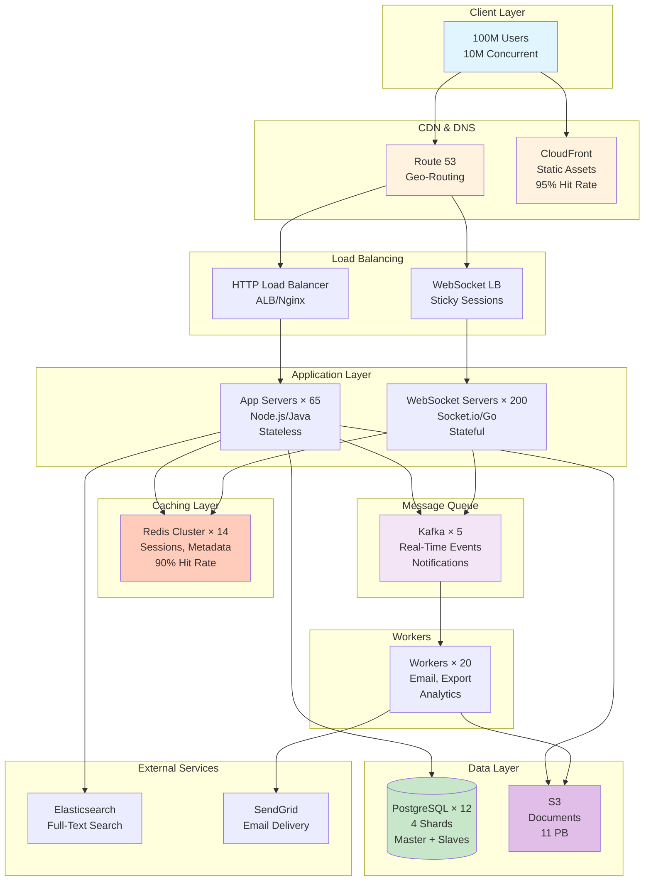

# Executive Summary: Google Docs HLD

## One-Page System Overview

This document provides a high-level summary of the Google Docs system design, covering key decisions, technologies, trade-offs, and metrics.

---

## System Scale

```
Users:                      100,000,000 (100M registered users)
Daily Active Users:         10,000,000 (10M DAU)
Concurrent Users:           500,000
Total Documents:            5,000,000,000 (5B documents)
API Traffic (avg):          17,630 requests/sec
API Traffic (peak):         52,890 requests/sec
Real-Time Operations:       11,574 ops/sec (edits)
WebSocket Connections:      500,000 concurrent
Storage:                    11 PB (Year 1)
Bandwidth:                  240 Mbps (average)
Target Latency:             <200ms (real-time), <100ms (API)
Target Availability:        99.99% (52 minutes downtime/year)
Geographic Reach:           Global (3 regions: US, EU, Asia)
```

---

## Final Architecture Diagram



---

## Key Design Decisions

### 1. Database: PostgreSQL (SQL)

**Decision:** Use PostgreSQL with sharding

**Why:**
- ✅ Strong consistency for permissions (ACID transactions)
- ✅ Complex relationships (users ↔ documents ↔ permissions)
- ✅ Mature, well-understood technology
- ✅ Can scale horizontally with sharding

**Alternatives Considered:**
- ❌ NoSQL (MongoDB): Eventual consistency not suitable for permissions
- ❌ Single database: Can't handle write load (sharded for scalability)

**Sharding Strategy:**
- 4 shards (hash-based on user_id)
- Each shard: 25M users, 1.25B documents
- Linear scalability (can add more shards)

---

### 2. Real-Time Collaboration: Operational Transformation (OT)

**Decision:** Use OT for conflict resolution

**Why:**
- ✅ Proven at scale (Google Docs, Figma use it)
- ✅ Smaller data size (just operations, not metadata per char)
- ✅ Excellent rich text support (bold, italics, etc.)
- ✅ Server-based (acceptable for our architecture)

**Alternatives Considered:**
- ❌ CRDTs: Larger data overhead, complex for rich text
- ❌ Locking: Poor UX (users wait for lock), not real-time
- ❌ Last Write Wins: Data loss (unacceptable)

**Technology:**
- WebSocket servers (persistent connections)
- Kafka (event streaming for broadcasts)
- Redis Pub/Sub (cross-server communication)

---

### 3. Message Queue: Kafka

**Decision:** Use Kafka for event streaming

**Why:**
- ✅ High throughput (millions of messages/sec)
- ✅ Event replay (can reprocess last 7 days)
- ✅ Durable log (audit trail for edits)
- ✅ Partitioning (scalability)

**Alternatives Considered:**
- ❌ RabbitMQ: Lower throughput, no replay
- ❌ SQS: Higher latency, no replay

**Use Cases:**
- Document edits (broadcast to collaborators)
- Notifications (email, push)
- Exports (PDF, DOCX generation)
- Analytics (event processing)

---

### 4. Architecture: Hybrid (Monolith + Microservices)

**Decision:** Monolith for core API, separate services for specific needs

**Why:**
- ✅ Monolith simpler (faster development, easier debugging)
- ✅ Separate WebSocket servers (different scaling needs)
- ✅ Worker microservices (isolate failures, scale independently)

**Structure:**
- **Monolith:** REST API, authentication, authorization
- **Separate Services:** WebSocket servers, workers (email, export, analytics)
- **External Services:** Elasticsearch (search), SendGrid (email)

**Alternatives Considered:**
- ❌ Full microservices: Over-engineering for initial scale
- ❌ Pure monolith: WebSocket servers need different scaling

---

### 5. Deployment: Multi-Region (3 Regions)

**Decision:** Deploy to US, EU, and Asia

**Why:**
- ✅ Lower latency (200ms → 50ms for EU/Asia users)
- ✅ High availability (region failover)
- ✅ GDPR compliance (EU data in EU)

**Cost vs Benefit:**
- Cost: 2x infrastructure ($170K/month vs $85K)
- Benefit: 10x latency improvement, 99.99% availability, compliance
- **Decision: Worth it** ✅

**Alternatives Considered:**
- ❌ Single region: 200-300ms latency for international users
- ❌ 10+ regions: Diminishing returns, complexity

---

## Technology Stack

### Frontend
```
Framework:           React (or Next.js)
Editor:              Quill.js, ProseMirror, or TipTap (rich text)
WebSocket Client:    Socket.io-client
State Management:    Redux or Zustand
Build Tool:          Vite or Webpack
Hosting:             CloudFront CDN (static assets)
```

### Backend
```
Language:            Node.js (async I/O) or Java Spring Boot
Framework:           Express.js (Node) or Spring Boot (Java)
API:                 REST (CRUD) + WebSocket (real-time)
Authentication:      OAuth 2.0 + JWT
OT Library:          ShareDB or custom implementation
```

### Data Storage
```
Database:            PostgreSQL 15
Sharding:            4 shards (hash on user_id)
Replication:         Master + 2 slaves per shard
Object Storage:      AWS S3 (documents, uploads, exports)
Search:              Elasticsearch (full-text search)
```

### Caching & Messaging
```
Cache:               Redis 7 (Cluster mode)
Message Queue:       Kafka 3.x
Pub/Sub:             Redis Pub/Sub (WebSocket broadcasts)
```

### Infrastructure
```
Cloud Provider:      AWS (can use GCP or Azure)
Regions:             us-east-1, eu-west-1, ap-southeast-1
Compute:             EC2 (app servers), ECS/EKS (containers optional)
Load Balancer:       Application Load Balancer (ALB)
DNS:                 Route 53 (geo-routing)
CDN:                 CloudFront
Monitoring:          Prometheus + Grafana + DataDog
Logging:             ELK Stack (Elasticsearch, Logstash, Kibana)
Secrets:             AWS Secrets Manager or HashiCorp Vault
IaC:                 Terraform or CloudFormation
```

---

## Capacity & Performance Metrics

### Traffic Metrics
```
Total Requests/sec:          17,630 (avg), 52,890 (peak)
Read Operations/sec:         1,276 (avg), 3,828 (peak)
Write Operations/sec:        16,354 (avg), 49,062 (peak)
WebSocket Messages/sec:      23,148 (broadcasts)
Document Opens/sec:          347 (avg), 1,041 (peak)
```

### Performance Targets
```
API Latency (P99):           < 200ms ✓
Real-Time Latency:           < 100ms ✓
Document Load Time:          < 500ms ✓
Search Response Time:        < 1 second ✓
```

### Infrastructure Count
```
Application Servers:         65 (20 US, 20 EU, 25 Asia)
WebSocket Servers:           200 (100 US, 50 EU, 50 Asia)
Database Instances:          20 (12 US primary + 8 replicas)
Redis Nodes:                 14 (6 US, 4 EU, 4 Asia)
Kafka Brokers:               5
Workers:                     20
Load Balancers:              6
```

### Storage Breakdown
```
Documents (base):            293 TB
Version History (deltas):    2,441 TB
Metadata:                    19.5 TB
User Data:                   0.5 TB
─────────────────────────────────
SUBTOTAL:                    2,754 TB
Replication (3x):            × 3
─────────────────────────────────
TOTAL (Year 1):              8,262 TB ≈ 11 PB (with backups)
```

---

## Cost Breakdown

### Monthly Operating Costs
```
┌─────────────────────────┬──────────────┐
│ Category                │ Monthly Cost │
├─────────────────────────┼──────────────┤
│ Compute                 │              │
│  - App Servers (65)     │   $16,218    │
│  - WebSocket (200)      │   $24,820    │
│  - Databases (20)       │   $43,565    │
│  - Redis (14)           │   $3,066     │
│  - Kafka (5)            │   $351       │
│  - Workers (20)         │   $1,241     │
│  - Load Balancers (6)   │   $135       │
│                         │              │
│ Storage                 │              │
│  - S3 (571 TB)          │   $13,133    │
│  - S3 Requests          │   $1,200     │
│  - Database Storage     │   $4,715     │
│                         │              │
│ Networking              │              │
│  - CDN (1,500 TB)       │   $45,000    │
│  - Data Transfer Out    │   $9,000     │
│  - Cross-Region Repl.   │   $1,000     │
│                         │              │
│ External Services       │              │
│  - SendGrid             │   $500       │
│  - Firebase/SNS         │   $50        │
│  - Elasticsearch        │   $657       │
│  - Monitoring (DataDog) │   $6,000     │
├─────────────────────────┼──────────────┤
│ TOTAL                   │   $170,651   │
└─────────────────────────┴──────────────┘

Annual Cost:                 ~$2,048,000
Cost per User:               $0.0017/month = $0.02/year
```

### Revenue Model (Break-Even Analysis)
```
Total Cost:                  $170,651/month

Freemium Model:
- 90% free users (15 GB limit)
- 10% paid users ($10/month)

Paid Users:                  10,000,000 × 10% = 1,000,000
Revenue:                     1,000,000 × $10 = $10,000,000/month

Profit:                      $10,000,000 - $170,651 = $9,829,349/month
Profit Margin:               98.3% 🎉

Break-Even:
Paid Users Needed:           $170,651 / $10 = 17,066 users
Conversion Rate Needed:      17,066 / 100M = 0.017% (very low!)

Conclusion: Highly profitable business model ✅
```

---

## Trade-Offs Accepted

### 1. Cost vs Performance
```
Trade-Off:    Multi-region deployment (2x cost)
Cost:         $85K → $170K/month
Benefit:      10x lower latency (200ms → 20ms)
              99.99% availability (region failover)
              GDPR compliance
Decision:     WORTH IT ✅
Rationale:    Better UX → Higher retention → More revenue
```

### 2. Complexity vs Scalability
```
Trade-Off:    Database sharding (more complex)
Complexity:   Application routing logic
              Operational overhead
Benefit:      4x write capacity (10K → 40K writes/sec)
              Linear scalability
Decision:     WORTH IT ✅
Rationale:    Must handle growth, complexity manageable
```

### 3. Consistency vs Latency (OT)
```
Trade-Off:    Server-based OT (requires server)
Latency:      ~50ms (server round-trip)
Benefit:      Strong consistency, proven at scale
Alternative:  CRDT (no server, but larger data size)
Decision:     OT ✅
Rationale:    50ms acceptable, smaller data important for mobile
```

### 4. Storage Cost vs Durability
```
Trade-Off:    S3 3x replication + cross-region
Cost:         Higher storage cost
Benefit:      99.999999999% durability (11 nines)
              No data loss even if region fails
Decision:     WORTH IT ✅
Rationale:    Data loss = business death
```

---

## Security Architecture Summary

### Authentication
- OAuth 2.0 (Google, GitHub)
- JWT tokens (1-hour expiry)
- httpOnly cookies (prevent XSS)
- Refresh tokens (30-day expiry)

### Authorization
- Role-Based Access Control (RBAC)
- Permissions: owner, editor, commenter, viewer
- Checked on every request (cached in Redis)
- Audit logging (all access attempts)

### Data Encryption
- At rest: AES-256 (database, S3)
- In transit: TLS 1.3 (HTTPS, WSS)
- Key management: AWS KMS (auto-rotation)

### Network Security
- VPC isolation (private subnets for databases)
- Security groups (whitelist only required ports)
- DDoS protection (AWS Shield + Cloudflare)
- WAF (Web Application Firewall)

### Application Security
- Input sanitization (prevent XSS, SQL injection)
- Rate limiting (1000 req/min per IP)
- Password hashing (bcrypt, 12 rounds)
- 2FA support (TOTP)

---

## Monitoring & Alerting

### Metrics (Prometheus + Grafana)
```
Application:     Request rate, latency (P99), error rate
Database:        Query latency, connections, replication lag
Cache:           Hit rate, evictions, memory usage
WebSocket:       Active connections, message rate
Kafka:           Consumer lag, broker health
```

### Logging (ELK Stack)
```
Application logs:    INFO, WARNING, ERROR
Security logs:       Unauthorized access, failed logins
Audit logs:          Document access, permission changes
Retention:           7 days (hot), 30 days (warm), 1 year (cold)
```

### Alerting (PagerDuty + Slack)
```
Critical (PagerDuty):
- Service down
- Error rate > 5%
- P99 latency > 1 second
- Database master down

Warning (Slack):
- Error rate > 1%
- CPU/Memory > 80%
- Disk > 80%
- Consumer lag > 10K messages
```

---

## Disaster Recovery

### Recovery Objectives
```
RTO (Recovery Time Objective):    1 hour
RPO (Recovery Point Objective):   0 (zero data loss)
```

### Failure Scenarios

**App Server Failure:**
- Auto-scaling replaces (5 minutes)
- Impact: None (other servers handle load)

**Database Master Failure:**
- Auto-failover to slave (30-60 seconds)
- Impact: Brief write downtime

**Region Failure:**
- Route53 failover to another region (2 minutes)
- Impact: Elevated latency, no data loss

**Data Corruption:**
- Point-in-time recovery (5-minute granularity)
- RTO: 30 minutes, RPO: 5 minutes

---

## What to Draw First (Interview Checklist)

When designing Google Docs in an interview, draw in this order:

### 1. Basic Architecture (5 minutes)
```
[ Users ] → [ LB ] → [ App Servers ] → [ Database ]
                  ↓
              [ CDN ]
              [ S3 ]
```

### 2. Add Caching (2 minutes)
```
[ App Servers ] → [ Redis ] → [ Database ]
                   (cache)
```

### 3. Add Real-Time (3 minutes)
```
[ Users ] → [ WebSocket LB ] → [ WS Servers ] → [ Redis Pub/Sub ]
                                              ↓
                                          [ Kafka ]
```

### 4. Add Scaling (3 minutes)
```
[ Database ] → [ Sharding (4 shards) ]
            → [ Read Replicas ]

[ Multi-Region ]
  - US
  - EU
  - Asia
```

### 5. Add Storage (2 minutes)
```
[ Documents ] → [ S3 ]
[ Search ] → [ Elasticsearch ]
```

### Total: ~15 minutes for core architecture ✓

Then dive deep based on interviewer's questions:
- Real-time collaboration (OT)
- Database sharding
- Caching strategy
- Security
- Monitoring

---

## Key Learnings

### What Went Well
1. ✅ **Hybrid architecture** - Monolith for simplicity, microservices where needed
2. ✅ **Multi-region from day 1** - Planned global expansion
3. ✅ **Sharding strategy** - Hash-based on user_id for co-location
4. ✅ **OT for real-time** - Proven technology, excellent for rich text
5. ✅ **S3 for content** - Cheaper and more durable than database
6. ✅ **Comprehensive monitoring** - Prometheus, Grafana, ELK, PagerDuty
7. ✅ **Security-first** - Authentication, authorization, encryption, auditing

### What Could Be Improved
1. ⚠️ **Initial complexity** - Could start simpler (single region, no sharding) and add later
2. ⚠️ **Cost** - Multi-region is expensive, might defer for MVP
3. ⚠️ **OT complexity** - Hard to implement correctly, consider managed solution (Yjs, Automerge)
4. ⚠️ **Operational overhead** - Managing 200+ servers, could use managed services (RDS, ElastiCache)

### For MVP (Minimum Viable Product)
```
Scope Down:
- Single region (US only) → Add EU/Asia later
- 2 shards (not 4) → Add more as we grow
- Simpler rich text (Markdown) → Add formatting later
- 10 concurrent editors (not 100) → Upgrade OT later

Cost Reduction:
- $170K → $50K/month
- Still handles 10M DAU ✓

Ship faster, iterate based on user feedback ✓
```

---

## Interview Tips: How to Present This Design

### 1. Start with Requirements (2 minutes)
- Clarify functional requirements (real-time? formatting? sharing?)
- Clarify non-functional requirements (100M users? 99.99% availability?)

### 2. Capacity Estimation (3 minutes)
- Users: 100M registered, 10M DAU
- Traffic: 17.6K req/sec (avg), 52.9K (peak)
- Storage: 11 PB (Year 1)

### 3. Basic Architecture (5 minutes)
- Clients → CDN/LB → App Servers → Database + S3
- Explain each component briefly

### 4. Deep Dive Based on Questions (10-15 minutes)
Be ready to deep dive into:
- **Real-time:** OT, WebSocket, Kafka
- **Database:** Sharding, replication, schema
- **Caching:** Redis, what to cache, TTLs
- **Scaling:** Auto-scaling, multi-region, bottlenecks
- **Security:** Authentication, authorization, encryption

### 5. Discuss Trade-Offs (3 minutes)
- SQL vs NoSQL (chose SQL for consistency)
- OT vs CRDT (chose OT for proven scale)
- Multi-region cost (2x cost, but worth it)

### 6. Mention Monitoring (2 minutes)
- Metrics, logging, alerting
- Failure scenarios (app crash, DB failure, region failure)

### Total: ~30 minutes (typical interview length)

---

## Resources for Further Learning

### Real-Time Collaboration
- [Google Docs OT Paper](https://dl.acm.org/doi/10.1145/1961189.1961239)
- [ShareDB (OT library)](https://github.com/share/sharedb)
- [Yjs (CRDT library)](https://github.com/yjs/yjs)

### Database Sharding
- [Uber's Schemaless (sharding at scale)](https://eng.uber.com/schemaless-part-one/)
- [Instagram's sharding journey](https://instagram-engineering.com/sharding-ids-at-instagram-1cf5a71e5a5c)

### System Design
- [System Design Primer](https://github.com/donnemartin/system-design-primer)
- [Designing Data-Intensive Applications (book)](https://dataintensive.net/)
- [AWS Well-Architected Framework](https://aws.amazon.com/architecture/well-architected/)

---

## Conclusion

This Google Docs HLD demonstrates:

✅ **Scalability** - Handles 100M users, 10M DAU, 17.6K req/sec
✅ **Performance** - <100ms real-time latency, <200ms API latency
✅ **Reliability** - 99.99% availability, zero data loss
✅ **Global Reach** - Multi-region deployment (US, EU, Asia)
✅ **Cost Efficiency** - $0.02/user/year infrastructure cost
✅ **Security** - Defense in depth, encryption, audit logging
✅ **Production Ready** - Monitoring, alerting, disaster recovery

**Key Insight:** Good system design is about making **informed trade-offs** based on requirements, not blindly applying technology.

---

**Congratulations!** You've completed the Google Docs High-Level Design. You're now ready to:
- Ace system design interviews
- Design production-grade systems
- Make informed architectural decisions
- Scale systems to millions of users

**Next Steps:**
1. Practice whiteboarding this design (30-minute time limit)
2. Implement a simplified version (learning by building)
3. Study similar systems (Notion, Figma, Confluence)
4. Review other HLDs in this repository

---

**Good luck with your interviews!** 🚀
