# Step 1: Basic Architecture

> **Learning Goal**: Start with the simplest possible design that works, then evolve it. This is the foundation - like building a house, you start with the frame before adding fancy features!

---

## What We're Building in Step 1

A minimal, functional Instagram where:
- Users can access the application
- Upload photos/videos
- View their feed
- Like and comment on posts

**No fancy features yet** - just the bare minimum to make it work!

---

## Architecture Diagram - Step 1

```mermaid
graph TB
    subgraph "Client Layer"
        Mobile[📱 Mobile App<br/>iOS/Android]
        Web[🌐 Web Browser<br/>React/Angular]
    end

    subgraph "Load Balancing Layer"
        LB[⚖️ Load Balancer<br/>Nginx/HAProxy<br/><br/>Distributes traffic<br/>SSL termination]
    end

    subgraph "Application Layer"
        App1[🖥️ App Server 1<br/>Node.js/Java]
        App2[🖥️ App Server 2<br/>Node.js/Java]
        App3[🖥️ App Server 3<br/>Node.js/Java]
    end

    subgraph "Storage Layer"
        DB[(🗄️ PostgreSQL Database<br/><br/>Stores:<br/>- Users<br/>- Posts<br/>- Comments<br/>- Likes<br/>- Follows)]

        FileStorage[📦 File Storage<br/>Local Disk/NAS<br/><br/>Stores:<br/>- Photos<br/>- Videos]
    end

    Mobile --> LB
    Web --> LB

    LB --> App1
    LB --> App2
    LB --> App3

    App1 --> DB
    App2 --> DB
    App3 --> DB

    App1 --> FileStorage
    App2 --> FileStorage
    App3 --> FileStorage

    style Mobile fill:#e1f5ff
    style Web fill:#e1f5ff
    style LB fill:#fff3e0
    style App1 fill:#f3e5f5
    style App2 fill:#f3e5f5
    style App3 fill:#f3e5f5
    style DB fill:#c8e6c9
    style FileStorage fill:#ffccbc
```



---

## Components Explained (Beginner-Friendly)

### 1. **Client Layer** (Where Users Interact)

#### Mobile App (iOS/Android)
- **What**: The Instagram app on your phone
- **Technology**: React Native, Swift, Kotlin
- **Responsibilities**:
  - Display UI (feed, profile, upload screen)
  - Send HTTP requests to backend
  - Handle user inputs (tap, scroll, upload)

#### Web Browser
- **What**: Instagram accessed via Chrome, Safari, etc.
- **Technology**: React.js, HTML5, CSS3
- **Responsibilities**: Same as mobile, but browser-based

> **Analogy**: Think of clients as restaurant customers - they place orders (API requests) and receive food (API responses).

---

### 2. **Load Balancer** (Traffic Distributor)

#### What is a Load Balancer?
Imagine you have 3 cashiers at a store. A load balancer is like a greeter who directs customers to the cashier with the shortest line. This prevents one cashier from being overwhelmed while others are idle.

#### Responsibilities
- **Distribute traffic** across multiple app servers
- **Health checks** - if a server is down, stop sending traffic to it
- **SSL termination** - handles HTTPS encryption/decryption
- **Sticky sessions** - (optional) sends same user to same server

#### Technology Options
| Option | Pros | Cons |
|--------|------|------|
| **Nginx** | Open-source, fast, widely used | Need to manage yourself |
| **HAProxy** | Very high performance | Complex configuration |
| **AWS ALB** | Managed (no maintenance), auto-scales | Vendor lock-in, cost |

> **For Instagram**: We'll use **AWS Application Load Balancer (ALB)** for managed service benefits.

#### Load Balancing Algorithms
```
1. Round Robin: A → B → C → A → B → C (simple rotation)
2. Least Connections: Send to server with fewest active connections
3. IP Hash: Same user always goes to same server (sticky session)
```

For Instagram, **Least Connections** works best for balanced load.

---

### 3. **Application Servers** (Business Logic)

#### What Do They Do?
This is the "brain" of Instagram - where all the logic happens:
- Process upload requests
- Fetch feed posts
- Handle likes/comments
- Authenticate users
- Validate inputs

#### Why Multiple Servers?
- **Scalability**: Handle more users (horizontal scaling)
- **Availability**: If one crashes, others keep working
- **No single point of failure**

#### Technology Stack
```
Option 1: Node.js + Express
- Pros: Fast for I/O operations, JavaScript everywhere
- Cons: Single-threaded (use clustering)

Option 2: Java + Spring Boot
- Pros: Battle-tested, great for large teams, strong typing
- Cons: Higher memory usage, slower startup

Option 3: Python + Django/FastAPI
- Pros: Rapid development, great for ML integration
- Cons: Slower than Node/Java for I/O
```

> **For Instagram**: We'll use **Node.js** for high I/O throughput (handling many simultaneous requests).

#### Stateless vs Stateful
Our app servers are **stateless**:
- ✅ Don't store user session data on server
- ✅ Store sessions in database or cache (Redis)
- ✅ Any server can handle any request
- ✅ Easy to scale (add/remove servers anytime)

```
❌ Stateful (Bad):
User logs in → Session stored on Server 1
Next request → Must go to Server 1 (sticky session)
Problem: Hard to scale, load imbalance

✅ Stateless (Good):
User logs in → JWT token stored in Redis
Next request → Any server can validate token from Redis
Benefit: Perfect load distribution, easy scaling
```

---

### 4. **Database** (Persistent Data Storage)

#### What Do We Store?
```sql
-- Users table
- user_id, username, email, password_hash, bio, profile_pic_url, created_at

-- Posts table
- post_id, user_id, caption, media_urls, created_at, likes_count, comments_count

-- Likes table
- user_id, post_id, created_at

-- Comments table
- comment_id, post_id, user_id, comment_text, created_at

-- Follows table
- follower_id, following_id, created_at
```

#### Why PostgreSQL?
| Feature | PostgreSQL | MySQL | MongoDB (NoSQL) |
|---------|-----------|-------|-----------------|
| **ACID compliance** | ✅ Yes | ✅ Yes | ❌ Eventual consistency |
| **Complex queries** | ✅ Excellent | ✅ Good | ❌ Limited joins |
| **JSON support** | ✅ Native | ⚠️ Basic | ✅ Native |
| **Scalability** | ⚠️ Vertical mainly | ⚠️ Vertical mainly | ✅ Horizontal |
| **Use case** | Relational data | Relational data | Document storage |

> **For Instagram Step 1**: We choose **PostgreSQL** because:
> 1. We have relational data (users → posts → comments)
> 2. Need strong consistency for critical operations (authentication, follow)
> 3. PostgreSQL's JSON support helps for flexible post metadata
> 4. We'll add read replicas and sharding later for scale

#### Sample Query Flow
```
User opens feed:
1. App queries: SELECT posts WHERE user_id IN (user's following list)
2. App queries: SELECT user info for post authors
3. App queries: Check if current user liked each post
4. Combine data and return JSON response
```

---

### 5. **File Storage** (Photos & Videos)

#### What We Store
- Uploaded photos (JPEG, PNG)
- Uploaded videos (MP4, MOV)
- Different sizes (thumbnail, medium, full)

#### Storage Options
| Option | Pros | Cons | Use Case |
|--------|------|------|----------|
| **Local Disk** | Simple, fast access | Not scalable, single point of failure | Development only |
| **NAS (Network Attached Storage)** | Shared across servers | Limited scalability | Small scale |
| **AWS S3** | Unlimited storage, 11 nines durability | Network latency | Production |

> **For Step 1**: We start with **NAS (Network File System)** for simplicity.
> **Later steps**: We'll migrate to AWS S3 + CloudFront CDN for scale.

#### File Upload Flow
```
1. User selects photo in app
2. App sends multipart/form-data POST request
3. App server receives file
4. App server saves to /uploads/user_123/post_456.jpg
5. App server creates database entry with file path
6. App server returns post_id to client
```

---

## Request Flow Examples

### Example 1: User Uploads a Photo


**Time breakdown:**
- Image compression: 500ms
- File save: 200ms
- Database insert: 50ms
- Network: 250ms
- **Total: ~1 second** ✅ (under our 2-second target)

---

### Example 2: User Views Feed


**Time breakdown:**
- 3 database queries: 150ms
- Data processing: 50ms
- Network: 100ms
- **Total: ~300ms** ❌ (exceeds our 100ms target!)

> **Problem Identified**: Too many database queries and no caching!
> **Solution**: We'll add Redis cache in Step 2 to bring this down to < 100ms.

---

## What's Good About This Design?

### ✅ Advantages

1. **Simple & Easy to Understand**
   - Only 5 components
   - Clear separation of concerns
   - Easy to debug

2. **Works for Small Scale**
   - Can handle ~10,000 DAU
   - Good for MVP (Minimum Viable Product)
   - Low infrastructure cost

3. **Foundation for Growth**
   - Load balancer already in place for horizontal scaling
   - Stateless app servers (can add more easily)
   - Database can handle millions of records initially

---

## What's Wrong With This Design?

### ❌ Limitations

1. **Database Bottleneck**
   - All reads and writes go to single database
   - Feed query takes 300ms (3x our target!)
   - Can't handle 500M DAU (would crash under load)

2. **No Caching**
   - Every feed request hits database
   - Popular posts queried repeatedly
   - Wastes database resources

3. **File Storage Not Scalable**
   - NAS has storage limits
   - No geographic distribution (slow for global users)
   - Single point of failure

4. **No Media Optimization**
   - Serving full-resolution images (slow, expensive bandwidth)
   - No CDN (Content Delivery Network)
   - Users in Asia access US servers (high latency)

5. **Poor Availability**
   - Database is single point of failure
   - If database goes down, entire app crashes
   - No failover mechanism

---

## Capacity Analysis - Can This Handle Instagram Scale?

### Current Design Limits

**Database Limits (PostgreSQL on single server):**
```
Assumptions:
- Database server: AWS RDS db.r5.4xlarge (16 vCPUs, 128 GB RAM)
- Connection pool: 1000 connections max

Realistic capacity:
- Read queries: ~5,000 req/sec
- Write queries: ~2,000 req/sec

Instagram requirement:
- Reads: 578,000 req/sec ❌ (116x over capacity!)
- Writes: 1,157 req/sec ✅ (within capacity for now)
```

**Verdict**: Database will crash immediately under real Instagram load.

**App Server Limits (Node.js):**
```
Assumptions:
- Server: AWS EC2 c5.xlarge (4 vCPUs, 8 GB RAM)
- Each server handles: ~1,000 concurrent connections

For 30,000 peak req/sec:
- Need: 30 app servers minimum
- Cost: 30 × $200/month = $6,000/month ✅ (affordable)
```

**Verdict**: App tier can scale horizontally (just add servers), so this is okay.

---

## Design Decisions & Trade-offs

### Decision 1: PostgreSQL vs NoSQL

**Why PostgreSQL?**
| Factor | PostgreSQL ✅ | MongoDB ❌ |
|--------|--------------|-----------|
| Data relationships | Natural (foreign keys) | Manual (denormalization) |
| Consistency | ACID (strong) | Eventual consistency |
| Query flexibility | Complex JOINs | Limited joins |
| Transaction support | Full ACID | Limited |

**Trade-off**: PostgreSQL is harder to scale horizontally, but we get strong consistency and relational data integrity. We'll solve scaling with read replicas and sharding in later steps.

---

### Decision 2: Stateless App Servers

**Why Stateless?**
```
✅ Stateless Benefits:
- Load balancer can route to any server
- Easy to add/remove servers (auto-scaling)
- Server crash = no data loss (session in Redis/DB)
- Perfect for cloud environments

❌ Stateful Problems:
- Sticky sessions (user tied to one server)
- Server crash = user logged out
- Hard to scale (can't easily add servers)
```

**Trade-off**: Stateless requires external session storage (Redis/DB), adding complexity. But the scalability benefits far outweigh this cost.

---

### Decision 3: Multiple App Servers + Load Balancer

**Why Not Single Server?**
```
❌ Single Server:
- Max capacity: ~1,000 concurrent users
- Downtime = entire app down
- Can't handle traffic spikes

✅ Multiple Servers + LB:
- Capacity: 1,000 × N servers
- One server down = 90% app still works
- Auto-scaling during traffic spikes
```

**Trade-off**: Added complexity (load balancing, session management), but critical for availability.

---

## Step 1 Summary

### What We Built
- Basic 3-tier architecture (Client → App → Database)
- Load balancer for traffic distribution
- Stateless app servers for horizontal scaling
- PostgreSQL for relational data
- Simple file storage for media

### What We Achieved
- ✅ Functional MVP (works for small scale)
- ✅ Foundation for horizontal scaling (app tier)
- ✅ Clear separation of concerns

### What's Missing
- ❌ Caching (feed is too slow)
- ❌ Database scaling (can't handle 500M DAU)
- ❌ CDN (slow for global users)
- ❌ Async processing (video encoding blocks requests)
- ❌ High availability (single database is SPOF)

### Key Metrics
| Requirement | Target | Current | Status |
|-------------|--------|---------|--------|
| Feed latency | < 100ms | 300ms | ❌ 3x too slow |
| Upload latency | < 2s | 1s | ✅ Good |
| Max DAU | 500M | ~10K | ❌ 50,000x gap |
| Availability | 99.99% | ~95% | ❌ DB SPOF |

---

## Next Steps

In **Step 2**, we'll add **Redis caching** to solve the feed latency problem:
- Cache user feeds (pre-computed)
- Cache popular posts
- Cache user profiles
- **Target: Reduce feed latency from 300ms to < 50ms**

> **Learning Point**: System design is iterative. We start simple, identify bottlenecks, and incrementally add components to solve specific problems. Don't try to design the perfect system upfront - evolve it based on requirements!

