# Step 2: Adding Caching Layer

> **Learning Goal**: Understand how caching dramatically improves read performance. We'll reduce feed latency from 300ms to < 50ms by adding Redis cache!

---

## Problem Statement (From Step 1)

In Step 1, we identified a critical bottleneck:

```
Feed loading: 300ms (3x our 100ms target!)

Why so slow?
- 3 database queries per feed request
- Popular posts queried repeatedly (thousands of times!)
- Database doing redundant work
- No optimization for read-heavy workload (500:1 read:write ratio)
```

**Solution**: Add caching layer to store frequently accessed data in memory!

---

## What is Caching? (Beginner Explanation)

### Analogy: Library vs Your Bookshelf

```
Without Cache (Library):
You: "I need Harry Potter book"
Librarian: *walks to shelf, searches, returns* (5 minutes)
Next day: Same book request, same 5-minute process ❌

With Cache (Your Bookshelf):
You: "I need Harry Potter book"
Your bookshelf: *instant access* (5 seconds) ✅
```

**Caching** = Store frequently accessed data in fast storage (RAM) instead of slow storage (disk).

### Speed Comparison

| Storage Type | Access Time | Example |
|--------------|-------------|---------|
| **L1 Cache (CPU)** | 1 nanosecond | Register |
| **RAM (Memory)** | 100 nanoseconds | Redis cache |
| **SSD (Disk)** | 100 microseconds | PostgreSQL |
| **HDD (Disk)** | 10 milliseconds | Old databases |
| **Network (Remote)** | 100 milliseconds | API calls |

**Redis (in-memory cache)**: 1,000x faster than database on disk!

---

## Architecture Diagram - Step 2

```mermaid
graph TB
    subgraph "Client Layer"
        Mobile[📱 Mobile App]
        Web[🌐 Web Browser]
    end

    subgraph "Load Balancing Layer"
        LB[⚖️ Load Balancer<br/>Nginx/HAProxy]
    end

    subgraph "Application Layer"
        App1[🖥️ App Server 1]
        App2[🖥️ App Server 2]
        App3[🖥️ App Server 3]
    end

    subgraph "Caching Layer ⭐ NEW"
        Redis[🔴 Redis Cluster<br/><br/>Cache:<br/>- User feeds<br/>- User profiles<br/>- Post metadata<br/>- Like counts<br/>- Media URLs<br/><br/>TTL: 30s-5min]
    end

    subgraph "Storage Layer"
        DB[(🗄️ PostgreSQL<br/>Source of Truth)]
        FileStorage[📦 File Storage]
    end

    Mobile --> LB
    Web --> LB

    LB --> App1
    LB --> App2
    LB --> App3

    App1 --> Redis
    App2 --> Redis
    App3 --> Redis

    Redis -.Cache Miss.-> DB

    App1 -.Writes.-> DB
    App2 -.Writes.-> DB
    App3 -.Writes.-> DB

    App1 --> FileStorage
    App2 --> FileStorage
    App3 --> FileStorage

    style Redis fill:#ffccbc,stroke:#ff5722,stroke-width:4px
    style Mobile fill:#e1f5ff
    style Web fill:#e1f5ff
    style LB fill:#fff3e0
    style DB fill:#c8e6c9
```



---

## What Changed From Step 1?

### Before (Step 1)
```
User requests feed
  ↓
App Server queries Database (3 queries, 150ms)
  ↓
Database processes queries (CPU, disk I/O)
  ↓
Return data (150ms total)
```

### After (Step 2)
```
User requests feed
  ↓
App Server queries Redis cache (1 query, 5ms)
  ↓
Cache Hit?
  ├─ YES: Return cached feed (5ms) ✅ 30x faster!
  └─ NO: Query Database → Store in cache → Return (150ms first time only)
```

**Impact**: 95% of requests hit cache (5ms), only 5% hit database (150ms).
**Average latency**: (0.95 × 5ms) + (0.05 × 150ms) = **12ms** ✅ (8x better than target!)

---

## What Do We Cache?

### 1. User Feeds (Highest Priority)

**What**: Pre-computed feed for each user (top 100 recent posts from following)

**Cache Key Structure**:
```
Key: "feed:user:123"
Value: [
  {post_id: 789, user_id: 456, caption: "...", image_url: "...", likes: 120, created_at: "..."},
  {post_id: 788, user_id: 457, caption: "...", image_url: "...", likes: 95, created_at: "..."},
  ...
]
TTL: 30 seconds (fresh data)
```

**Why Cache This?**
- Most requested data (every user opens feed)
- Changes infrequently (new post every few minutes)
- Large payload (100 posts × 2KB = 200KB)

**Cache Hit Rate**: 90%+ (very effective)

---

### 2. User Profiles

**What**: User information (username, bio, profile pic, follower count)

**Cache Key Structure**:
```
Key: "user:profile:456"
Value: {
  user_id: 456,
  username: "john_doe",
  bio: "Photographer 📷",
  profile_pic_url: "https://cdn.../profile.jpg",
  followers_count: 1200,
  following_count: 450,
  posts_count: 89
}
TTL: 5 minutes
```

**Why Cache This?**
- Displayed on every post in feed
- Rarely changes
- Reduces JOIN queries

**Cache Hit Rate**: 95%+

---

### 3. Post Metadata

**What**: Individual post details (for direct post views)

**Cache Key Structure**:
```
Key: "post:789"
Value: {
  post_id: 789,
  user_id: 456,
  caption: "Beautiful sunset 🌅",
  media_urls: ["https://cdn.../photo1.jpg"],
  likes_count: 1250,
  comments_count: 34,
  created_at: "2025-01-15T18:30:00Z"
}
TTL: 1 minute
```

**Why Cache This?**
- Viral posts accessed millions of times
- Likes/comments update frequently (short TTL)

**Cache Hit Rate**: 80% (popular posts)

---

### 4. Like Status (Has User Liked Post?)

**What**: Boolean flag - has current user liked a specific post?

**Cache Key Structure**:
```
Key: "like:user:123:post:789"
Value: 1 (liked) or 0 (not liked)
TTL: 10 minutes
```

**Why Cache This?**
- Prevents database query for every post in feed
- Small data (boolean)

**Cache Hit Rate**: 85%

---

### 5. Media URLs (CDN Paths)

**What**: Direct links to images/videos on CDN

**Cache Key Structure**:
```
Key: "media:post:789"
Value: {
  thumbnail: "https://cdn.../thumb_789.jpg",
  medium: "https://cdn.../med_789.jpg",
  full: "https://cdn.../full_789.jpg"
}
TTL: 1 hour (static data)
```

**Why Cache This?**
- Prevents file storage lookups
- URLs rarely change

**Cache Hit Rate**: 99%

---

## Caching Strategies (Patterns)

### Pattern 1: Cache-Aside (Lazy Loading) ⭐ PRIMARY

**How It Works:**
```
1. App receives request
2. Check cache (GET from Redis)
3. If found (CACHE HIT):
     Return cached data ✅
4. If not found (CACHE MISS):
     Query database
     Store in cache (SET in Redis with TTL)
     Return data
```

**Code Example (Node.js)**:
```javascript
async function getUserFeed(userId) {
  // 1. Try cache first
  const cacheKey = `feed:user:${userId}`;
  const cachedFeed = await redis.get(cacheKey);

  if (cachedFeed) {
    console.log('Cache HIT! 🎯');
    return JSON.parse(cachedFeed);  // 5ms
  }

  // 2. Cache miss - query database
  console.log('Cache MISS! 💔');
  const feed = await database.query(`
    SELECT posts.*, users.username, users.profile_pic
    FROM posts
    JOIN follows ON posts.user_id = follows.following_id
    JOIN users ON posts.user_id = users.user_id
    WHERE follows.follower_id = $1
    ORDER BY posts.created_at DESC
    LIMIT 100
  `, [userId]);  // 150ms

  // 3. Store in cache for next time
  await redis.set(cacheKey, JSON.stringify(feed), 'EX', 30);  // 30-second TTL

  return feed;
}
```

**Pros**: Simple, cache only what's requested (efficient memory use)
**Cons**: First request is slow (cache miss penalty)

---

### Pattern 2: Write-Through (Eager Caching)

**How It Works:**
```
1. App receives write request (new post)
2. Write to database ✅
3. Immediately update cache ✅
4. Return success

Result: Cache always has latest data
```

**Code Example**:
```javascript
async function createPost(userId, caption, imageUrl) {
  // 1. Write to database
  const post = await database.insert('posts', {
    user_id: userId,
    caption: caption,
    image_url: imageUrl,
    created_at: new Date()
  });

  // 2. Update cache immediately
  const cacheKey = `post:${post.id}`;
  await redis.set(cacheKey, JSON.stringify(post), 'EX', 300);  // 5-min TTL

  // 3. Invalidate user's feed cache (so next fetch gets new post)
  await redis.del(`feed:user:${userId}`);

  return post;
}
```

**Pros**: Cache always consistent with database
**Cons**: Extra write overhead (every write = 2 operations)

**Use Case**: Critical data that must be immediately available (user's own posts)

---

### Pattern 3: Write-Behind (Write-Back)

**How It Works:**
```
1. App receives write request
2. Write to cache only ⚡ (fast)
3. Return success immediately
4. Background worker writes to database later (async)

Result: Super fast writes, eventual consistency
```

**Pros**: Blazing fast writes (no database latency)
**Cons**: Risk of data loss if cache crashes before database write

**Use Case**: Non-critical data (view counts, analytics) - NOT for Instagram posts!

---

## Cache Invalidation (Hardest Problem in Computer Science!)

> "There are only two hard things in Computer Science: cache invalidation and naming things." - Phil Karlton

### Problem: Stale Data

```
Scenario:
1. User follows someone new
2. Database updated: follows table ✅
3. Cache still has old following list ❌
4. User's feed doesn't show new person's posts! 😢

Solution: Invalidate (delete) cache when data changes
```

---

### Invalidation Strategy 1: TTL (Time-To-Live) ⭐ SIMPLE

**How It Works**: Automatically expire cache after X seconds

```javascript
// Set cache with 30-second expiry
await redis.set('feed:user:123', feedData, 'EX', 30);

// After 30 seconds, cache auto-deleted
// Next request = cache miss → fresh data from DB
```

**Choosing TTL Values**:
| Data Type | TTL | Reasoning |
|-----------|-----|-----------|
| **User feed** | 30 seconds | Balance freshness vs load |
| **User profile** | 5 minutes | Rarely changes |
| **Post metadata** | 1 minute | Likes/comments update often |
| **Media URLs** | 1 hour | Static, never changes |

**Pros**: Simple, automatic cleanup
**Cons**: Stale data for up to TTL duration (eventual consistency)

---

### Invalidation Strategy 2: Explicit Invalidation ⭐ PRECISE

**How It Works**: Delete cache immediately when data changes

```javascript
async function followUser(followerId, followingId) {
  // 1. Update database
  await database.insert('follows', {
    follower_id: followerId,
    following_id: followingId
  });

  // 2. Delete affected caches
  await redis.del(`feed:user:${followerId}`);  // Delete follower's feed
  await redis.del(`user:profile:${followerId}`);  // Delete follower's profile (following count changed)
  await redis.del(`user:profile:${followingId}`);  // Delete following's profile (follower count changed)

  return { success: true };
}
```

**Pros**: Immediate consistency (no stale data)
**Cons**: Extra complexity (must track all affected caches)

---

### Invalidation Strategy 3: Hybrid (TTL + Explicit) ⭐ RECOMMENDED

**Best Practice**: Combine both strategies

```javascript
// Set cache with TTL (safety net)
await redis.set('feed:user:123', feedData, 'EX', 60);

// But also delete explicitly on writes (immediate consistency)
async function createPost(userId, ...) {
  // ... insert post to DB ...

  // Explicit invalidation (immediate)
  await redis.del(`feed:user:${userId}`);

  // Followers' feeds also need update
  const followers = await getFollowerIds(userId);
  for (const followerId of followers) {
    await redis.del(`feed:user:${followerId}`);  // Fan-out invalidation
  }
}
```

**Result**:
- Normal case: Explicit invalidation keeps cache fresh
- Edge cases: TTL prevents stale data if explicit invalidation fails

---

## Cache Architecture - Redis Cluster

### Why Redis Cluster?

```
Single Redis Server Limits:
- Memory: ~64 GB max (cost-prohibitive beyond this)
- Throughput: ~100K req/sec
- Single point of failure ❌

Instagram Needs:
- Memory: 8 TB (from our capacity planning)
- Throughput: 578K req/sec (reads)
- High availability ✅

Solution: Redis Cluster (distributed cache)
```

---

### Redis Cluster Architecture


**How It Works:**
1. **Sharding**: 8TB data split across 16 nodes (500GB each)
2. **Hash Slots**: Keys distributed using hash function (CRC16)
3. **Replication**: Each master has 1 replica for high availability
4. **Client-side routing**: App knows which node has which keys

**Calculation:**
```
Total capacity: 16 masters × 500 GB = 8 TB ✅
Total throughput: 16 masters × 100K req/sec = 1.6M req/sec ✅ (exceeds our 578K need)
Cost: 16 masters + 16 replicas = 32 nodes × $200/month = $6,400/month
```

---

### Hash Slot Distribution Example

```javascript
// How Redis determines which node stores a key:

const key = "feed:user:123";
const hashValue = CRC16(key);  // e.g., 1523
const slotNumber = hashValue % 16384;  // 16384 total slots

if (slotNumber >= 0 && slotNumber <= 1000) {
  routeToNode = "Master 1";
} else if (slotNumber >= 1001 && slotNumber <= 2000) {
  routeToNode = "Master 2";
}
// ... and so on

// This ensures even distribution across nodes
```

---

## Updated Request Flow (With Cache)

### Example: User Opens Feed (Cache Hit)

```mermaid
sequenceDiagram
    actor User
    participant Mobile
    participant LB as Load Balancer
    participant App as App Server
    participant Redis
    participant DB as PostgreSQL

    User->>Mobile: Open Instagram
    Mobile->>LB: GET /api/feed
    LB->>App: Route to App Server

    App->>App: Validate JWT<br/>Extract user_id: 123

    App->>Redis: GET feed:user:123

    alt Cache HIT ✅
        Redis-->>App: [feed data] (5ms)
        App-->>Mobile: 200 OK {posts: [...]}
        Mobile->>User: Display feed

        Note over User,DB: Total time: 10ms ✅ 10x under target!
    else Cache MISS ❌
        Redis-->>App: null

        App->>DB: SELECT posts, users<br/>WHERE following...
        DB-->>App: Query results (150ms)

        App->>Redis: SET feed:user:123<br/>EX 30 (TTL)

        App-->>Mobile: 200 OK {posts: [...]}
        Mobile->>User: Display feed

        Note over User,DB: Total time: 160ms (first time only)
    end
```



---

### Example: User Creates New Post (Cache Invalidation)


---

## Performance Improvements

### Before (Step 1) vs After (Step 2)

| Operation | Step 1 (No Cache) | Step 2 (With Cache) | Improvement |
|-----------|-------------------|---------------------|-------------|
| **Load feed (cache hit)** | 300ms | 10ms | 🚀 **30x faster** |
| **Load feed (cache miss)** | 300ms | 160ms | 1.9x faster (cache write overhead) |
| **View user profile** | 50ms | 5ms | 10x faster |
| **Check like status** | 20ms | 2ms | 10x faster |
| **Average feed load** | 300ms | 18ms* | 🎯 **16x faster** |

*Calculation: (0.90 × 10ms) + (0.10 × 160ms) = 25ms with 90% cache hit rate

**Result**: ✅ Achieved < 100ms target (actually 25ms)!

---

### Database Load Reduction

```
Before Caching:
- Feed requests: 578,000 req/sec → 578,000 DB queries/sec
- Database overload! 💥

After Caching (90% hit rate):
- Cache hits: 578,000 × 0.90 = 520,200 req/sec (Redis handles)
- Cache misses: 578,000 × 0.10 = 57,800 req/sec (DB handles)
- Database load reduced by 90%! 🎉

Database utilization:
- Before: 578,000 / 5,000 = 115% (CRASH!)
- After: 57,800 / 5,000 = 11.6% (healthy)
```

---

## Cache Hit Rate Optimization

### Factors Affecting Hit Rate

1. **Cache Size**
   - Larger cache = more data fits = higher hit rate
   - But more expensive (RAM costs money)

2. **TTL (Time-To-Live)**
   - Longer TTL = higher hit rate (data stays cached longer)
   - But more stale data (eventual consistency lag)

3. **Access Patterns**
   - Popular posts (viral content) = very high hit rate
   - Niche content (small accounts) = lower hit rate

### Instagram's Real-World Hit Rates

```
User feeds: 90-95% (most users check multiple times/day)
User profiles: 95%+ (same profiles appear in many feeds)
Popular posts: 99%+ (viral content accessed millions of times)
Media URLs: 99%+ (static data, rarely changes)

Overall cache hit rate: ~93%
```

---

## Cost Analysis

### Redis Cluster Cost
```
Configuration: 16 masters + 16 replicas = 32 nodes
Node type: AWS ElastiCache r6g.2xlarge (64 GB RAM, 8 vCPUs)
Cost per node: $0.50/hour = $360/month

Total cost: 32 × $360 = $11,520/month
```

### Database Cost Reduction
```
Without cache: Need massive database (40 nodes to handle load)
Cost: 40 × $500/month = $20,000/month

With cache: Database load reduced 90% (only 4 nodes needed)
Cost: 4 × $500/month = $2,000/month

Savings: $20,000 - $2,000 = $18,000/month
```

**Net Cost:**
```
Cache cost: $11,520/month
Database savings: $18,000/month
Net savings: $6,480/month ($77,760/year) 💰

Plus massive performance improvement!
```

> **Lesson**: Caching is not just about performance - it often saves money by reducing database infrastructure needs!

---

## Design Decisions & Trade-offs

### Decision 1: Redis vs Memcached

| Feature | Redis ✅ | Memcached |
|---------|---------|-----------|
| **Data structures** | Strings, Lists, Sets, Hashes, Sorted Sets | Only strings |
| **Persistence** | Optional (RDB, AOF) | None |
| **Replication** | Master-slave | None (client-side only) |
| **Pub/Sub** | Yes | No |
| **Use case** | Complex caching needs | Simple key-value cache |

**Choice**: **Redis** for rich data structures and built-in replication.

---

### Decision 2: Cache-Aside vs Write-Through

| Pattern | Pros | Cons | Use Case |
|---------|------|------|----------|
| **Cache-Aside** | Simple, efficient memory use | First request slow | Read-heavy (feeds, profiles) |
| **Write-Through** | Always consistent | Extra write overhead | Critical data (user's own posts) |

**Choice**: **Hybrid** approach - cache-aside for reads, write-through for critical writes.

---

### Decision 3: TTL Values

```
Short TTL (10-30 seconds):
✅ Fresh data (good UX)
❌ Lower cache hit rate
❌ More database load

Long TTL (5-10 minutes):
✅ Higher cache hit rate
✅ Lower database load
❌ Stale data (users see outdated info)

Instagram Choice:
- Feeds: 30 seconds (balance)
- Profiles: 5 minutes (rarely change)
- Media URLs: 1 hour (static)
```

---

## What's Still Missing?

Even with caching, we still have problems:

### ❌ Problem 1: Database is Still Single Point of Failure
- If database crashes, entire app goes down
- Cache helps during operation, but writes still go to one DB

**Solution (Step 3)**: Add database replication and sharding

---

### ❌ Problem 2: Media Files Not Globally Distributed
- Users in Asia loading from US servers (high latency)
- All file downloads hit our servers (expensive bandwidth)

**Solution (Step 4)**: Add CDN (Content Delivery Network)

---

### ❌ Problem 3: Video Encoding Blocks Upload Requests
- User uploads 100MB video → app server spends 30 seconds encoding
- Other requests to that server delayed (blocking)

**Solution (Step 4)**: Add message queue for async processing

---

## Step 2 Summary

### What We Added
- ✅ Redis cluster (16 masters + 16 replicas = 8 TB capacity)
- ✅ Cache-aside pattern for reads
- ✅ Write-through pattern for critical writes
- ✅ TTL + explicit invalidation strategy

### What We Achieved
- ✅ Feed latency: 300ms → 25ms (12x improvement)
- ✅ Database load: 115% → 11.6% (90% reduction)
- ✅ Throughput: Can now handle 578K reads/sec
- ✅ Cost savings: $6,480/month (cache cost < DB savings)

### What's Next
In **Step 3**, we'll add **database replication and sharding** to:
- Eliminate single point of failure (high availability)
- Scale writes (currently limited to one master)
- Further scale reads (add read replicas)

---

## Key Takeaways

1. **Caching is critical for read-heavy workloads** (Instagram = 500:1 read:write)
2. **Cache-aside pattern** is simple and effective
3. **Cache invalidation** is hard - use hybrid (TTL + explicit) approach
4. **Redis Cluster** scales horizontally (add nodes for capacity/throughput)
5. **Caching saves money** (reduces database infrastructure needs)
6. **Choose TTL based on data freshness requirements** (balance staleness vs hit rate)

