# Step 3: Database Scaling (Replication & Sharding)

> **Learning Goal**: Understand how to scale databases to handle massive read/write loads while maintaining high availability. We'll eliminate the single point of failure and enable the system to handle billions of records!

---

## Problems to Solve (From Step 2)

Even with Redis caching, our database still has critical issues:

```
❌ Problem 1: Single Point of Failure (SPOF)
- One PostgreSQL server
- If it crashes → entire app down
- No failover mechanism

❌ Problem 2: Limited Write Capacity
- Single master handles ALL writes
- Capacity: ~2,000 writes/sec
- Instagram needs: 3,472 writes/sec (peak)
- Will crash under peak load!

❌ Problem 3: Limited Storage
- Single server: ~2 TB capacity (practical limit)
- Instagram needs: 1.7 PB metadata storage (5 years)
- 850x more than single server capacity!

❌ Problem 4: Cache Misses Still Hit One Database
- 10% of 578K reads/sec = 57,800 reads/sec
- Single server capacity: ~5,000 reads/sec
- 11.5x over capacity!
```

**Solutions**:
1. **Replication** → High availability + scale reads
2. **Sharding** → Scale writes + scale storage

---

## What is Database Replication? (Beginner Explanation)

### Analogy: Primary Teacher + Assistant Teachers

```
Single Teacher (No Replication):
- 1 teacher handles 100 students
- Teacher sick = no class ❌
- All students ask one teacher = overwhelmed ❌

Primary + Assistants (Replication):
- 1 primary teacher prepares lesson
- 3 assistant teachers deliver same lesson
- Primary sick → assistants continue class ✅
- Students spread across 4 teachers ✅
```

### Replication in Databases

```
Master (Primary):
- Handles all WRITES (INSERT, UPDATE, DELETE)
- Source of truth

Replicas (Slaves):
- Exact copies of master
- Handle READS only (SELECT)
- Sync continuously with master
```

---

## What is Database Sharding? (Beginner Explanation)

### Analogy: One Library vs Multiple Libraries

```
One Big Library:
- All 10 million books in one building
- Long lines to check out books
- Building runs out of space ❌

Multiple Libraries (Sharding):
- Library 1: Books A-F (3M books)
- Library 2: Books G-M (3M books)
- Library 3: Books N-S (3M books)
- Library 4: Books T-Z (1M books)

Each library smaller, faster, independent! ✅
```

### Sharding in Databases

```
Horizontal Partitioning:
- Split data across multiple database servers
- Each shard holds a subset of data
- Together, they hold all data

Example:
Shard 1: Users with ID 1-250M
Shard 2: Users with ID 250M-500M
Shard 3: Users with ID 500M-750M
Shard 4: Users with ID 750M-1B
```

---

## Architecture Diagram - Step 3


---

## Database Schema Design

### Tables and Sharding Strategy

#### Users Table (Sharded by user_id)
```sql
CREATE TABLE users (
    user_id BIGINT PRIMARY KEY,          -- Shard key!
    username VARCHAR(30) UNIQUE NOT NULL,
    email VARCHAR(255) UNIQUE NOT NULL,
    password_hash VARCHAR(255) NOT NULL,
    bio TEXT,
    profile_pic_url VARCHAR(500),
    followers_count INT DEFAULT 0,
    following_count INT DEFAULT 0,
    posts_count INT DEFAULT 0,
    created_at TIMESTAMP DEFAULT NOW(),
    updated_at TIMESTAMP DEFAULT NOW()
);

-- Indexes
CREATE INDEX idx_username ON users(username);  -- For search
CREATE INDEX idx_email ON users(email);        -- For login
CREATE INDEX idx_created_at ON users(created_at);

-- Sharding logic:
-- Shard 1: user_id % 4 = 0 (users with ID 0, 4, 8, 12, ...)
-- Shard 2: user_id % 4 = 1 (users with ID 1, 5, 9, 13, ...)
-- Shard 3: user_id % 4 = 2 (users with ID 2, 6, 10, 14, ...)
-- Shard 4: user_id % 4 = 3 (users with ID 3, 7, 11, 15, ...)
```

#### Posts Table (Sharded by user_id, NOT post_id!)
```sql
CREATE TABLE posts (
    post_id BIGINT PRIMARY KEY,              -- Unique globally
    user_id BIGINT NOT NULL,                 -- Shard key! (co-locate with user)
    caption TEXT,
    media_urls JSON,                         -- Array of image/video URLs
    likes_count INT DEFAULT 0,
    comments_count INT DEFAULT 0,
    created_at TIMESTAMP DEFAULT NOW(),
    updated_at TIMESTAMP DEFAULT NOW(),
    FOREIGN KEY (user_id) REFERENCES users(user_id)
);

-- Indexes
CREATE INDEX idx_user_id_created ON posts(user_id, created_at DESC);  -- User's posts timeline
CREATE INDEX idx_created_at ON posts(created_at DESC);                -- Global timeline

-- Why shard by user_id instead of post_id?
-- ✅ All posts by a user are on same shard (fast to fetch user's timeline)
-- ✅ Follows user → posts locality (better join performance)
```

#### Follows Table (Sharded by follower_id)
```sql
CREATE TABLE follows (
    follower_id BIGINT NOT NULL,       -- Shard key! (who is following)
    following_id BIGINT NOT NULL,      -- who they're following
    created_at TIMESTAMP DEFAULT NOW(),
    PRIMARY KEY (follower_id, following_id)
);

-- Indexes
CREATE INDEX idx_follower ON follows(follower_id);    -- Get my following list
CREATE INDEX idx_following ON follows(following_id);  -- Get my followers list

-- Sharding logic: Shard by follower_id
-- Why? To quickly get "who am I following" list for feed generation
```

#### Likes Table (Sharded by post_id)
```sql
CREATE TABLE likes (
    user_id BIGINT NOT NULL,
    post_id BIGINT NOT NULL,          -- Shard key!
    created_at TIMESTAMP DEFAULT NOW(),
    PRIMARY KEY (user_id, post_id)
);

-- Indexes
CREATE INDEX idx_post_id ON likes(post_id);    -- Count likes for a post
CREATE INDEX idx_user_id ON likes(user_id);    -- Get all posts a user liked

-- Sharding logic: Shard by post_id
-- Why? To quickly count likes for a post (all likes for one post on same shard)

-- Challenge: post_id and user_id on different shards!
-- Solution: Use post_id % 4 to route to correct shard for likes
```

#### Comments Table (Sharded by post_id)
```sql
CREATE TABLE comments (
    comment_id BIGINT PRIMARY KEY,
    post_id BIGINT NOT NULL,            -- Shard key!
    user_id BIGINT NOT NULL,
    comment_text TEXT NOT NULL,
    created_at TIMESTAMP DEFAULT NOW(),
    FOREIGN KEY (post_id) REFERENCES posts(post_id)
);

-- Indexes
CREATE INDEX idx_post_id_created ON comments(post_id, created_at);  -- Get comments for post
CREATE INDEX idx_user_id ON comments(user_id);                      -- Get user's comments

-- Sharding logic: Shard by post_id
-- Why? All comments for a post are on same shard (fast to fetch)
```

---

## Sharding Strategy Deep Dive

### How to Choose Shard Key?

| Table | Shard Key | Reasoning |
|-------|-----------|-----------|
| **Users** | `user_id` | Distribute users evenly |
| **Posts** | `user_id` | Co-locate user's posts (fetch timeline) |
| **Follows** | `follower_id` | Quickly get "who I'm following" |
| **Likes** | `post_id` | Count likes for a post efficiently |
| **Comments** | `post_id` | Fetch comments for a post efficiently |

> **Key Principle**: Shard by the dimension you query most frequently!

---

### Shard Routing Logic

#### Option 1: Hash-Based Sharding (⭐ RECOMMENDED)

```javascript
function getShardForUser(userId) {
  const totalShards = 4;
  const shardNumber = userId % totalShards;  // Modulo operation
  return shardNumber;  // 0, 1, 2, or 3
}

// Examples:
getShardForUser(12345)  → 12345 % 4 = 1 → Shard 2
getShardForUser(98765)  → 98765 % 4 = 1 → Shard 2
getShardForUser(54321)  → 54321 % 4 = 1 → Shard 2
```

**Pros**:
- ✅ Even distribution (mathematically balanced)
- ✅ Simple implementation
- ✅ Deterministic (same user always goes to same shard)

**Cons**:
- ❌ Hard to re-shard (adding/removing shards requires rehashing all data)

---

#### Option 2: Range-Based Sharding

```javascript
function getShardForUser(userId) {
  if (userId >= 0 && userId < 250000000) return 0;      // Shard 1
  if (userId >= 250000000 && userId < 500000000) return 1;  // Shard 2
  if (userId >= 500000000 && userId < 750000000) return 2;  // Shard 3
  if (userId >= 750000000) return 3;                    // Shard 4
}
```

**Pros**:
- ✅ Easy to add shards (just split ranges)
- ✅ Range queries efficient (scan one shard)

**Cons**:
- ❌ Uneven distribution (newer users = more active = hot shard)
- ❌ Shard 4 will be overloaded (recent users are more active)

---

#### Option 3: Consistent Hashing (Advanced)

```javascript
// Using hash ring
const hashRing = new ConsistentHashRing(['shard1', 'shard2', 'shard3', 'shard4']);

function getShardForUser(userId) {
  return hashRing.getNode(userId);  // Returns shard ID
}

// When adding shard5, only ~20% of data needs to move (not all!)
```

**Pros**:
- ✅ Easy to re-shard (minimal data movement)
- ✅ Even distribution

**Cons**:
- ❌ More complex to implement

**Instagram Choice**: **Hash-based sharding** initially, migrate to **consistent hashing** when re-sharding is needed.

---

## Replication Strategy

### Master-Slave Replication Architecture

```mermaid
graph TB
    subgraph "Shard 1"
        M1[Master 1<br/>💾 Handles WRITES<br/><br/>INSERT, UPDATE, DELETE]

        S1A[Replica 1A<br/>💿 Handles READS<br/>SELECT queries]
        S1B[Replica 1B<br/>💿 Handles READS<br/>SELECT queries]

        M1 -->|Binary Log<br/>Replication| S1A
        M1 -->|Binary Log<br/>Replication| S1B
    end

    App[App Server] -->|WRITE| M1
    App -->|READ| S1A
    App -->|READ| S1B

    style M1 fill:#4caf50,color:#fff
    style S1A fill:#c8e6c9
    style S1B fill:#c8e6c9
```



### How Replication Works (Beginner Explanation)

```
Step 1: App writes to master
  INSERT INTO posts (user_id, caption) VALUES (123, 'Hello World');

Step 2: Master commits to its own database
  ✅ Data saved on Master

Step 3: Master writes to Binary Log (binlog)
  [Event: INSERT posts, user_id=123, caption='Hello World', timestamp=...]

Step 4: Replicas read binlog and replay operations
  Replica 1: Reads binlog → Executes INSERT → Data synced ✅
  Replica 2: Reads binlog → Executes INSERT → Data synced ✅

Step 5: Now all databases have same data
  Master:    [post_id=789, user_id=123, caption='Hello World']
  Replica 1: [post_id=789, user_id=123, caption='Hello World']
  Replica 2: [post_id=789, user_id=123, caption='Hello World']
```

---

### Replication Lag (Important Concept!)

```
What is Replication Lag?
Time delay between master write and replica sync.

Example:
00:00.000 - User creates post on Master
00:00.050 - Replica 1 receives binlog (50ms lag)
00:00.080 - Replica 2 receives binlog (80ms lag)

Problem:
User creates post → Master (writes)
User refreshes feed → Replica 2 (reads)
Replica hasn't synced yet → User doesn't see their own post! 😢

Solution: Read-Your-Own-Writes Consistency
If user queries their OWN data, read from Master (not replicas)
If user queries others' data, read from Replicas (distribute load)
```

**Code Implementation:**
```javascript
async function getUserPosts(userId, currentUserId) {
  let db;

  if (userId === currentUserId) {
    // User viewing their own posts → read from MASTER (strong consistency)
    db = getMasterConnection(userId);
  } else {
    // User viewing others' posts → read from REPLICA (eventual consistency OK)
    db = getReplicaConnection(userId);  // Load balanced across replicas
  }

  return db.query('SELECT * FROM posts WHERE user_id = $1 ORDER BY created_at DESC', [userId]);
}
```

---

### Replication Types

#### 1. Asynchronous Replication (⭐ INSTAGRAM USES THIS)

```
Master writes → Returns success immediately
              ↓
              Replicas sync in background (1-100ms delay)

Pros:
✅ Fast writes (no waiting for replicas)
✅ High throughput

Cons:
❌ Replication lag (eventual consistency)
❌ If master crashes before sync, some writes lost
```

**Use Case**: Social media (Instagram) - eventual consistency is acceptable.

---

#### 2. Synchronous Replication

```
Master writes → Waits for replicas to confirm → Returns success

Pros:
✅ No data loss (all replicas have data)
✅ Strong consistency

Cons:
❌ Slow writes (wait for slowest replica)
❌ Lower throughput

Use Case: Banking, financial systems (strong consistency required)
```

---

#### 3. Semi-Synchronous Replication (Middle Ground)

```
Master writes → Waits for 1 replica to confirm → Returns success
              ↓
              Other replicas sync asynchronously

Pros:
✅ Balance of speed and safety
✅ Minimal data loss

Cons:
⚠️ Still some replication lag on async replicas

Use Case: E-commerce (order confirmation needs reliability, but not banking-level)
```

**Instagram Choice**: **Asynchronous replication** for speed. We accept eventual consistency (users can wait 1-2 seconds to see new posts).

---

## Failover Strategy (High Availability)

### What Happens if Master Crashes?

```
Before Crash:
Master (WRITE) ← App
  ↓
Replicas (READ) ← App

After Crash:
Master 💥 CRASHED!
  ↓
Replicas still running ✅

Problem:
- App can't write anymore! ❌
- Reads still work (from replicas) ✅

Solution: Promote Replica to Master
```

---

### Automatic Failover Process

```mermaid
sequenceDiagram
    participant Master as Master DB
    participant Replica1 as Replica 1
    participant Replica2 as Replica 2
    participant Monitor as Health Monitor<br/>(Orchestrator/Patroni)
    participant App as App Server

    Master->>Monitor: ❤️ Heartbeat every 5s
    Master->>Monitor: ❤️ Heartbeat
    Master->>Monitor: ❤️ Heartbeat

    Note over Master: 💥 Master crashes!

    Monitor->>Master: ❤️ Ping (no response)
    Monitor->>Master: ❤️ Ping (no response)
    Monitor->>Master: ❤️ Ping (no response)

    Note over Monitor: 3 failed pings = Master down!

    Monitor->>Replica1: 🚀 Promote to Master
    Replica1->>Replica1: Switch mode: READ → WRITE
    Monitor->>App: 📢 Update DNS: New master = Replica1
    Monitor->>Replica2: 📢 New master: Replica1

    App->>Replica1: WRITE queries (now master)
    Replica2->>Replica1: Replicate from new master

    Note over Monitor,App: Failover complete! (30-60 seconds downtime)
```



**Downtime**: 30-60 seconds (time to detect failure + promote replica)

---

### Health Check Configuration

```yaml
# Orchestrator config (automatic failover tool)
health_check:
  interval: 5s                    # Check every 5 seconds
  timeout: 3s                     # Ping timeout
  failure_threshold: 3            # 3 failed pings = dead

failover:
  auto_promote: true              # Automatically promote replica
  promotion_rule: newest_replica  # Choose replica with least lag
  dns_update: true                # Update DNS to point to new master
```

---

## Query Routing Logic

### Shard Router Component (Vitess / ProxySQL)


**Routing Logic:**
```javascript
class ShardRouter {
  constructor() {
    this.shards = [
      { id: 0, master: 'db1-master.example.com', replicas: ['db1-replica1.com', 'db1-replica2.com'] },
      { id: 1, master: 'db2-master.example.com', replicas: ['db2-replica1.com', 'db2-replica2.com'] },
      { id: 2, master: 'db3-master.example.com', replicas: ['db3-replica1.com', 'db3-replica2.com'] },
      { id: 3, master: 'db4-master.example.com', replicas: ['db4-replica1.com', 'db4-replica2.com'] },
    ];
  }

  getShardId(userId) {
    return userId % this.shards.length;  // Hash-based sharding
  }

  getMasterConnection(userId) {
    const shardId = this.getShardId(userId);
    const shard = this.shards[shardId];
    return createConnection(shard.master);  // WRITE
  }

  getReplicaConnection(userId) {
    const shardId = this.getShardId(userId);
    const shard = this.shards[shardId];
    const randomReplica = shard.replicas[Math.floor(Math.random() * shard.replicas.length)];
    return createConnection(randomReplica);  // READ (load balanced)
  }
}

// Usage:
const router = new ShardRouter();

// Write operation
async function createPost(userId, caption) {
  const db = router.getMasterConnection(userId);  // Route to correct shard's master
  return db.query('INSERT INTO posts (user_id, caption) VALUES ($1, $2)', [userId, caption]);
}

// Read operation
async function getUserPosts(userId) {
  const db = router.getReplicaConnection(userId);  // Route to correct shard's replica
  return db.query('SELECT * FROM posts WHERE user_id = $1 ORDER BY created_at DESC', [userId]);
}
```

---

## Cross-Shard Queries (The Hard Problem!)

### Problem: User's Feed Requires Data from Multiple Shards

```
Example:
User 123 (on Shard 1) follows:
  - User 456 (on Shard 2)
  - User 789 (on Shard 3)
  - User 101 (on Shard 1)

To generate feed, we need posts from all 3 shards! 😱

Query:
SELECT * FROM posts WHERE user_id IN (456, 789, 101) ORDER BY created_at DESC LIMIT 100

This requires querying all shards and merging results!
```

---

### Solution 1: Scatter-Gather Pattern


**Implementation:**
```javascript
async function getUserFeed(userId) {
  // 1. Get following list
  const followingList = await getFollowingList(userId);  // [456, 789, 101]

  // 2. Group by shard
  const shardsToQuery = {};
  for (const followingId of followingList) {
    const shardId = getShardId(followingId);
    if (!shardsToQuery[shardId]) shardsToQuery[shardId] = [];
    shardsToQuery[shardId].push(followingId);
  }

  // 3. Query all shards in parallel
  const promises = [];
  for (const [shardId, userIds] of Object.entries(shardsToQuery)) {
    const db = getReplicaConnection(shardId);
    promises.push(
      db.query('SELECT * FROM posts WHERE user_id IN ($1) ORDER BY created_at DESC LIMIT 200', [userIds])
    );
  }

  // 4. Wait for all queries
  const results = await Promise.all(promises);

  // 5. Merge and sort
  const allPosts = results.flat();
  allPosts.sort((a, b) => b.created_at - a.created_at);  // Descending

  // 6. Return top 100
  return allPosts.slice(0, 100);
}
```

**Pros**: Parallelized (fast)
**Cons**: Application does the merging (complex logic, memory intensive for large feeds)

---

### Solution 2: Pre-Compute Feeds (⭐ INSTAGRAM USES THIS)

```
Instead of querying on-the-fly, pre-generate feeds!

When user posts:
1. Identify all followers
2. Add post to each follower's pre-computed feed (fanout-on-write)
3. Store feed in cache (Redis) or dedicated feed database

When user opens app:
1. Fetch pre-computed feed (one query!)
2. No cross-shard queries needed ✅
```

**This is covered in Step 4 (Newsfeed Service)**

---

## Capacity Analysis - Can This Handle Instagram Scale?

### With 4 Shards + 2 Replicas Each

**Write Capacity:**
```
Single master: ~2,000 writes/sec
4 masters: 4 × 2,000 = 8,000 writes/sec

Instagram requirement: 3,472 writes/sec (peak)

Utilization: 3,472 / 8,000 = 43% ✅ (healthy)
```

**Read Capacity:**
```
Single replica: ~5,000 reads/sec
8 replicas total (2 per shard): 8 × 5,000 = 40,000 reads/sec

Instagram requirement: 57,800 reads/sec (cache misses)

Wait, we need more replicas!

With 4 replicas per shard:
16 replicas × 5,000 = 80,000 reads/sec ✅ (covers 57,800)

Final configuration: 4 masters + 16 replicas = 20 database servers
```

**Storage Capacity:**
```
Per shard: 1.7 PB / 4 = 425 TB
Per server (master or replica): 425 TB

Current PostgreSQL limit: ~10 TB per server (practical)

We need to shard more!

Recalculate with 50 shards:
1.7 PB / 50 = 34 TB per shard ✅ (within limit)

Final configuration: 50 masters + 100 replicas = 150 database servers
```

---

## Performance Improvements

| Metric | Step 2 (Single DB) | Step 3 (Sharded + Replicated) | Improvement |
|--------|-------------------|-------------------------------|-------------|
| **Max writes/sec** | 2,000 | 100,000 (50 masters × 2K) | 🚀 **50x** |
| **Max reads/sec** | 5,000 | 500,000 (100 replicas × 5K) | 🚀 **100x** |
| **Storage capacity** | 2 TB | 1,700 TB (1.7 PB) | 🚀 **850x** |
| **Availability** | 95% (SPOF) | 99.95% (failover) | ✅ **Better** |
| **Read latency** | 50ms | 50ms | Same |
| **Write latency** | 20ms | 25ms | +5ms (routing overhead) |

---

## Design Decisions & Trade-offs

### Decision 1: Hash-Based vs Range-Based Sharding

| Factor | Hash-Based ✅ | Range-Based |
|--------|--------------|-------------|
| **Distribution** | Even (mathematically) | Uneven (hot shards) |
| **Re-sharding** | Hard (rehash all) | Easy (split ranges) |
| **Range queries** | Scatter-gather | Single shard |

**Choice**: **Hash-based** for even distribution. We avoid range queries by pre-computing feeds.

---

### Decision 2: Shard by user_id vs post_id

| Shard by user_id ✅ | Shard by post_id |
|---------------------|------------------|
| ✅ All user's posts on one shard | ❌ User's posts scattered |
| ✅ Fast user timeline query | ❌ Slow user timeline (scatter-gather) |
| ❌ Cross-shard for feed | ✅ Single shard for single post |

**Choice**: **Shard by user_id** because we query "user's timeline" more than "single post".

---

### Decision 3: Asynchronous vs Synchronous Replication

| Asynchronous ✅ | Synchronous |
|----------------|-------------|
| ✅ Fast writes (no wait) | ❌ Slow writes (wait for replicas) |
| ❌ Replication lag (50-100ms) | ✅ Zero lag (strong consistency) |
| ❌ Potential data loss (if master crashes) | ✅ No data loss |

**Choice**: **Asynchronous** for speed. Instagram can tolerate 50-100ms lag (eventual consistency).

---

## What's Still Missing?

### ❌ Problem 1: Media Files Not Scalable
- Still using NAS (Network File System)
- Not globally distributed (slow for international users)
- No CDN (expensive bandwidth)

**Solution (Step 4)**: Add AWS S3 + CloudFront CDN

---

### ❌ Problem 2: No Async Processing
- Video encoding blocks upload requests (30 seconds!)
- Notification sending delays API response
- Analytics processing slows down writes

**Solution (Step 4)**: Add message queue (Kafka/RabbitMQ)

---

### ❌ Problem 3: Feed Generation is Expensive
- Cross-shard queries (scatter-gather)
- Real-time sorting of thousands of posts
- Slow for users following many accounts

**Solution (Step 4)**: Add dedicated Newsfeed Service (pre-computed feeds)

---

## Step 3 Summary

### What We Added
- ✅ Database sharding (50 shards, hash-based by user_id)
- ✅ Master-slave replication (2-4 replicas per shard)
- ✅ Shard router (Vitess) for query routing
- ✅ Automatic failover (Orchestrator)
- ✅ Read-your-own-writes consistency

### What We Achieved
- ✅ Write capacity: 2K → 100K req/sec (50x)
- ✅ Read capacity: 5K → 500K req/sec (100x)
- ✅ Storage: 2 TB → 1.7 PB (850x)
- ✅ Availability: 95% → 99.95% (no SPOF)
- ✅ Eliminated single point of failure

### What's Next
In **Step 4**, we'll add:
- **CDN + Object Storage** for global media delivery
- **Message Queue** for async processing
- **Newsfeed Service** for pre-computed feeds

---

## Key Takeaways

1. **Replication** = High availability + scale reads (add replicas)
2. **Sharding** = Scale writes + scale storage (add shards)
3. **Choose shard key** based on most common query pattern
4. **Asynchronous replication** is fast but eventual consistent
5. **Cross-shard queries** are expensive → avoid or pre-compute
6. **Failover** is critical for 99.99% availability (automate it!)

