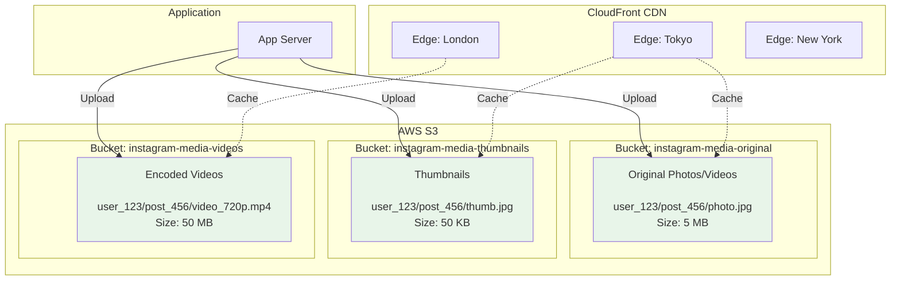
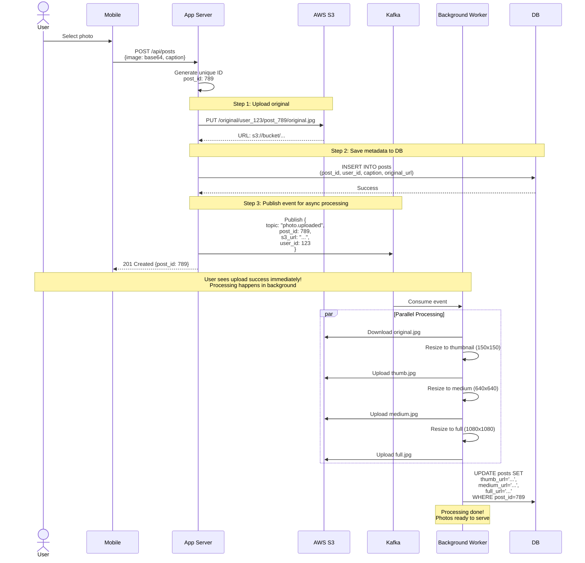
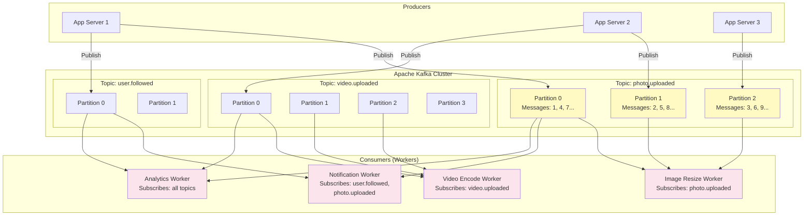

# Step 4: CDN, Object Storage & Message Queue

> **Learning Goal**: Understand how to handle media files at scale, deliver content globally with low latency, and process asynchronous tasks efficiently!

---

## Problems to Solve (From Step 3)

```
❌ Problem 1: Media Files on NAS (Not Scalable)
- Current: Network Attached Storage (NAS)
- Capacity: Limited to few TB
- Access: All users hit same storage (bottleneck)
- Geography: Users in Asia download from US servers (slow!)

❌ Problem 2: No Global Distribution
- User in Tokyo requests photo from US server
- Network latency: ~200ms (US ↔ Tokyo)
- Bandwidth cost: Serving 290 GB/sec from central location = $$$$

❌ Problem 3: Synchronous Processing Blocks Requests
- User uploads 100MB video → app encodes → 30 seconds blocking!
- Other requests to that server delayed
- Poor user experience

❌ Problem 4: No Offline Processing
- Send notification to 1M followers → 10 seconds to send all!
- Generate analytics → blocks database
- Resize images (thumbnail, medium, full) → CPU intensive
```

**Solutions**:
1. **Object Storage (AWS S3)** → Unlimited, durable storage
2. **CDN (CloudFront)** → Global distribution, edge caching
3. **Message Queue (Kafka)** → Async processing, decoupling

---

## Architecture Diagram - Step 4

```mermaid
graph TB
    subgraph "Client Layer"
        Mobile[📱 Mobile App]
        Web[🌐 Web Browser]
    end

    subgraph "CDN Layer ⭐ NEW"
        CDN[🌍 CloudFront CDN<br/><br/>Edge Locations:<br/>- Tokyo<br/>- London<br/>- New York<br/>- São Paulo<br/>- Mumbai<br/><br/>Caches:<br/>- Images<br/>- Videos<br/>- Static assets]
    end

    subgraph "Load Balancing"
        LB[⚖️ Load Balancer]
    end

    subgraph "Application Layer"
        App1[🖥️ App Server 1]
        App2[🖥️ App Server 2]
        App3[🖥️ App Server 3]
    end

    subgraph "Caching Layer"
        Redis[🔴 Redis Cluster]
    end

    subgraph "Message Queue Layer ⭐ NEW"
        Kafka[📬 Apache Kafka<br/><br/>Topics:<br/>- post.created<br/>- user.followed<br/>- like.added<br/>- video.uploaded]

        Workers[👷 Background Workers<br/><br/>Tasks:<br/>- Video encoding<br/>- Image resizing<br/>- Send notifications<br/>- Update analytics<br/>- Feed fanout]
    end

    subgraph "Database Layer"
        ShardRouter[🧭 Shard Router]
        DB1[(💾 Shard 1<br/>Master + Replicas)]
        DB2[(💾 Shard 2<br/>Master + Replicas)]
    end

    subgraph "Object Storage ⭐ NEW"
        S3[☁️ AWS S3<br/><br/>Buckets:<br/>- original-media<br/>- thumbnails<br/>- videos-encoded<br/><br/>Lifecycle:<br/>Hot → Warm → Cold]
    end

    subgraph "Analytics"
        Analytics[(📊 Analytics DB<br/>ClickHouse/BigQuery<br/><br/>Metrics:<br/>- Views<br/>- Engagement<br/>- Trends)]
    end

    Mobile -.Media download.-> CDN
    Web -.Media download.-> CDN

    CDN -.Cache miss.-> S3

    Mobile --> LB
    Web --> LB

    LB --> App1
    LB --> App2
    LB --> App3

    App1 --> Redis
    App1 --> ShardRouter
    App1 -.Upload media.-> S3
    App1 -.Publish events.-> Kafka

    App2 --> Redis
    App2 --> ShardRouter
    App2 -.Upload media.-> S3
    App2 -.Publish events.-> Kafka

    ShardRouter --> DB1
    ShardRouter --> DB2

    Kafka --> Workers
    Workers --> S3
    Workers --> Redis
    Workers --> ShardRouter
    Workers --> Analytics

    style CDN fill:#e3f2fd,stroke:#2196f3,stroke-width:4px
    style Kafka fill:#fff9c4,stroke:#fbc02d,stroke-width:4px
    style S3 fill:#e8f5e9,stroke:#4caf50,stroke-width:4px
    style Workers fill:#fce4ec,stroke:#e91e63,stroke-width:2px
```

---

## Component 1: Object Storage (AWS S3)

### What is Object Storage? (Beginner Explanation)

```
Traditional File System (NAS):
- Hierarchical structure: /photos/2025/january/photo1.jpg
- Limited capacity (TB scale)
- Single server (or cluster)

Object Storage (S3):
- Flat structure: Key = "user_123/post_456/photo.jpg", Value = <binary data>
- Unlimited capacity (PB/EB scale)
- Distributed across thousands of servers
- Each object has metadata (size, content-type, timestamps)
```

**Analogy**: Traditional file system = filing cabinet (limited drawers). Object storage = infinite warehouse with unique barcode for each item.

---

### AWS S3 Architecture



---

### S3 Bucket Strategy

#### Bucket 1: Original Media
```
Bucket: instagram-media-original

Structure:
- user_{user_id}/post_{post_id}/original.{ext}
- Example: user_123/post_456/original.jpg

Lifecycle Policy:
- 0-30 days: S3 Standard (hot storage, fast access)
- 30-90 days: S3 Infrequent Access (warm, cheaper)
- 90+ days: S3 Glacier (cold, very cheap)

Access: Rare (only for re-processing, admin)
```

#### Bucket 2: Optimized Media (Served to Users)
```
Bucket: instagram-media-optimized

Structure:
- user_{user_id}/post_{post_id}/thumb.jpg      (150x150, 50KB)
- user_{user_id}/post_{post_id}/medium.jpg     (640x640, 500KB)
- user_{user_id}/post_{post_id}/full.jpg       (1080x1080, 1.5MB)

Lifecycle Policy:
- All: S3 Standard (frequently accessed)

Access: Very frequent (served via CDN to all users)
```

#### Bucket 3: Encoded Videos
```
Bucket: instagram-media-videos

Structure:
- user_{user_id}/post_{post_id}/video_360p.mp4  (mobile, 10MB)
- user_{user_id}/post_{post_id}/video_720p.mp4  (HD, 50MB)
- user_{user_id}/post_{post_id}/video_1080p.mp4 (Full HD, 100MB)

Lifecycle Policy:
- All: S3 Standard

Access: Frequent (streaming)
```

---

### Upload Flow to S3



**Timeline**:
- Upload original: 500ms
- Save to DB: 50ms
- Return to user: **550ms** ✅ (under 2-second target)
- Background processing: 3-5 seconds (user doesn't wait!)

---

### S3 Presigned URLs (Security Best Practice)

**Problem**: If we give users direct S3 URLs, anyone can access any photo!

```
Bad: https://s3.amazonaws.com/instagram-media/user_123/photo.jpg
→ Anyone can guess and access: user_124, user_125, etc. ❌
```

**Solution**: Presigned URLs (temporary, signed)

```javascript
// Server-side: Generate presigned URL (valid for 1 hour)
const AWS = require('aws-sdk');
const s3 = new AWS.S3();

function generatePresignedUrl(s3Key) {
  const params = {
    Bucket: 'instagram-media-optimized',
    Key: s3Key,  // e.g., "user_123/post_789/thumb.jpg"
    Expires: 3600  // 1 hour
  };

  return s3.getSignedUrl('getObject', params);
}

// Generated URL:
// https://s3.amazonaws.com/bucket/user_123/photo.jpg
//   ?AWSAccessKeyId=...
//   &Signature=abc123def456...  ← Cryptographic signature
//   &Expires=1704067200

// If user tries to modify URL or use after expiry → Access Denied ✅
```

---

## Component 2: CDN (Content Delivery Network)

### What is a CDN? (Beginner Explanation)

```
Without CDN:
User in Tokyo → Request photo → US Server (10,000 km away) → 200ms latency ❌

With CDN:
User in Tokyo → Request photo → Tokyo Edge Server (local) → 10ms latency ✅

How?
- CDN has servers ("edge locations") in 200+ cities worldwide
- First request: Edge fetches from origin (S3), caches it
- Next requests: Edge serves from cache (instant!)
```

**Analogy**: Starbucks doesn't ship coffee from Seattle to every customer. They have local stores (edges) everywhere!

---

### CloudFront CDN Architecture

```mermaid
graph TB
    subgraph "Users Worldwide"
        Tokyo[👤 User in Tokyo]
        London[👤 User in London]
        NYC[👤 User in New York]
    end

    subgraph "CloudFront Edge Locations"
        EdgeTokyo[📍 Tokyo Edge<br/>Cache: 500 GB]
        EdgeLondon[📍 London Edge<br/>Cache: 500 GB]
        EdgeNYC[📍 NYC Edge<br/>Cache: 500 GB]
    end

    subgraph "Origin - AWS S3"
        S3[☁️ S3 (US-East-1)<br/>Source of Truth]
    end

    Tokyo -->|10ms| EdgeTokyo
    London -->|10ms| EdgeLondon
    NYC -->|10ms| EdgeNYC

    EdgeTokyo -.Cache miss<br/>200ms.-> S3
    EdgeLondon -.Cache miss<br/>80ms.-> S3
    EdgeNYC -.Cache miss<br/>20ms.-> S3

    EdgeTokyo -.Cache<br/>hit: 10ms.-> Tokyo
    EdgeLondon -.Cache<br/>hit: 10ms.-> London
    EdgeNYC -.Cache<br/>hit: 10ms.-> NYC

    style EdgeTokyo fill:#e3f2fd
    style EdgeLondon fill:#e3f2fd
    style EdgeNYC fill:#e3f2fd
    style S3 fill:#e8f5e9
```

**How It Works**:
1. User in Tokyo requests: `https://cdn.instagram.com/user_123/photo.jpg`
2. DNS routes to nearest edge (Tokyo)
3. Tokyo edge checks cache:
   - **Hit**: Serve from cache (10ms) ✅
   - **Miss**: Fetch from S3 (200ms), cache it, serve to user
4. Next user in Tokyo: Cache hit (10ms) ✅

---

### CDN Cache Configuration

```javascript
// CloudFront behavior rules

const cdnConfig = {
  // Static images (rarely change)
  '/photos/*': {
    cacheTTL: 86400,          // 24 hours
    cacheControl: 'public, max-age=86400',
    compress: true            // Gzip/Brotli compression
  },

  // Videos (large files)
  '/videos/*': {
    cacheTTL: 604800,         // 7 days
    cacheControl: 'public, max-age=604800',
    compress: false,          // Already compressed (MP4)
    enableStreaming: true     // HLS/DASH support
  },

  // Profile pictures (change occasionally)
  '/profiles/*': {
    cacheTTL: 3600,           // 1 hour
    cacheControl: 'public, max-age=3600',
    compress: true
  },

  // API responses (don't cache)
  '/api/*': {
    cacheTTL: 0,              // No caching
    cacheControl: 'no-cache, no-store, must-revalidate'
  }
};
```

---

### Cache Invalidation on CDN

**Problem**: User uploads new profile picture, but CDN still serves old one!

```
Solutions:

1. Versioned URLs (⭐ RECOMMENDED):
   Old: https://cdn.../user_123/profile.jpg
   New: https://cdn.../user_123/profile.jpg?v=1704067200  ← Add timestamp

   New URL = cache miss = fetch fresh version ✅

2. Cache Invalidation API:
   CloudFront.createInvalidation({
     paths: ['/user_123/profile.jpg']
   });

   Expensive ($0.005 per path, up to 1000 free/month), slow (5-10 min)

3. Short TTL:
   Set TTL=60s for frequently changing content
   Automatic refresh every minute
```

**Instagram Strategy**:
- Photos/videos: Versioned URLs (never change once posted)
- Profile pictures: Versioned URLs (change URL on update)
- API responses: No caching

---

### CDN Performance Impact

| Metric | Without CDN | With CDN | Improvement |
|--------|-------------|----------|-------------|
| **Tokyo → US** | 200ms | 10ms | 🚀 **20x faster** |
| **London → US** | 80ms | 10ms | 8x faster |
| **Cache hit rate** | 0% | 95% | - |
| **Origin requests** | 578K/sec | 29K/sec | 95% reduction |
| **Bandwidth cost** | $0.09/GB | $0.02/GB | 78% savings |

**Cost Calculation (290 GB/sec traffic)**:
```
Without CDN (all from S3):
290 GB/sec × 86,400 sec/day × 30 days/month = 753 PB/month
Cost: 753 PB × $0.09/GB = $67.7M/month! 💸💸💸

With CDN (95% hit rate, 5% from S3):
Origin: 753 PB × 5% = 37.6 PB/month from S3
CDN: 753 PB × 95% = 715.5 PB/month from edge
Cost: (37.6 PB × $0.09/GB) + (715.5 PB × $0.02/GB) = $3.4M + $14.3M = $17.7M/month

Savings: $67.7M - $17.7M = $50M/month! 💰
```

> **Key Lesson**: CDN is not optional for Instagram - it's 74% cheaper than serving from origin!

---

## Component 3: Message Queue (Apache Kafka)

### What is a Message Queue? (Beginner Explanation)

```
Synchronous (Direct Call):
User → "Send email to 1M followers" → App processes → Wait 10 minutes → Done ❌

Asynchronous (Message Queue):
User → "Send email to 1M followers" → App adds job to queue → Return immediately ✅
                                    ↓
                          Background worker processes job in background

User doesn't wait! ✅
```

**Analogy**: Restaurant kitchen
- Synchronous: Waiter takes order, cooks food, serves → You wait 30 min ❌
- Asynchronous: Waiter takes order, gives ticket to kitchen, you get notified when ready ✅

---

### Apache Kafka Architecture



**Key Concepts**:
- **Topic**: Category of messages (like a channel)
- **Partition**: Sub-division of topic for parallelism
- **Producer**: App that publishes messages
- **Consumer**: Worker that processes messages
- **Consumer Group**: Multiple workers sharing workload

---

### Kafka Topics for Instagram

#### Topic 1: `photo.uploaded`
```json
{
  "topic": "photo.uploaded",
  "message": {
    "event_id": "evt_123",
    "post_id": 789,
    "user_id": 123,
    "s3_original_url": "s3://bucket/user_123/post_789/original.jpg",
    "timestamp": "2025-01-17T12:00:00Z"
  }
}
```

**Consumers**:
- Image Resize Worker: Create thumbnail, medium, full versions
- Analytics Worker: Track upload metrics
- Feed Fanout Worker: Add to followers' feeds

---

#### Topic 2: `video.uploaded`
```json
{
  "topic": "video.uploaded",
  "message": {
    "event_id": "evt_456",
    "post_id": 790,
    "user_id": 123,
    "s3_original_url": "s3://bucket/user_123/post_790/original.mp4",
    "duration_seconds": 45,
    "file_size_mb": 120,
    "timestamp": "2025-01-17T12:05:00Z"
  }
}
```

**Consumers**:
- Video Encode Worker: Transcode to 360p, 720p, 1080p
- Thumbnail Worker: Extract frame for thumbnail
- Analytics Worker: Track video uploads

---

#### Topic 3: `user.followed`
```json
{
  "topic": "user.followed",
  "message": {
    "event_id": "evt_789",
    "follower_id": 456,
    "following_id": 123,
    "timestamp": "2025-01-17T12:10:00Z"
  }
}
```

**Consumers**:
- Notification Worker: Send "You have a new follower!" notification
- Feed Worker: Backfill follower's feed with following's posts
- Analytics Worker: Track follower growth

---

#### Topic 4: `like.added`
```json
{
  "topic": "like.added",
  "message": {
    "event_id": "evt_101",
    "post_id": 789,
    "user_id": 456,
    "post_author_id": 123,
    "timestamp": "2025-01-17T12:15:00Z"
  }
}
```

**Consumers**:
- Notification Worker: Send "X liked your post" notification
- Analytics Worker: Track engagement metrics
- Cache Invalidation Worker: Invalidate like count cache

---

### Background Workers (Consumers)

#### Worker 1: Image Resize Worker

```javascript
// Image Resize Worker
const { Kafka } = require('kafkajs');
const sharp = require('sharp');  // Image processing library
const AWS = require('aws-sdk');

const kafka = new Kafka({ brokers: ['kafka1:9092', 'kafka2:9092'] });
const consumer = kafka.consumer({ groupId: 'image-resize-workers' });

await consumer.connect();
await consumer.subscribe({ topic: 'photo.uploaded' });

await consumer.run({
  eachMessage: async ({ message }) => {
    const event = JSON.parse(message.value.toString());
    console.log(`Processing post_id: ${event.post_id}`);

    // 1. Download original from S3
    const originalBuffer = await s3.getObject({
      Bucket: 'instagram-media-original',
      Key: event.s3_key
    }).promise();

    // 2. Resize to thumbnail (150x150)
    const thumbnailBuffer = await sharp(originalBuffer.Body)
      .resize(150, 150, { fit: 'cover' })
      .jpeg({ quality: 80 })
      .toBuffer();

    // 3. Upload thumbnail to S3
    await s3.putObject({
      Bucket: 'instagram-media-optimized',
      Key: `user_${event.user_id}/post_${event.post_id}/thumb.jpg`,
      Body: thumbnailBuffer,
      ContentType: 'image/jpeg',
      CacheControl: 'public, max-age=86400'
    }).promise();

    // 4. Resize to medium (640x640)
    const mediumBuffer = await sharp(originalBuffer.Body)
      .resize(640, 640, { fit: 'cover' })
      .jpeg({ quality: 85 })
      .toBuffer();

    await s3.putObject({
      Bucket: 'instagram-media-optimized',
      Key: `user_${event.user_id}/post_${event.post_id}/medium.jpg`,
      Body: mediumBuffer,
      ContentType: 'image/jpeg',
      CacheControl: 'public, max-age=86400'
    }).promise();

    // 5. Update database with URLs
    await db.query(`
      UPDATE posts
      SET thumb_url = $1, medium_url = $2, processing_status = 'complete'
      WHERE post_id = $3
    `, [thumbnailUrl, mediumUrl, event.post_id]);

    console.log(`✅ Completed processing post_id: ${event.post_id}`);
  }
});
```

**Processing Time**: 3-5 seconds per image (user already got success response!)

---

#### Worker 2: Video Encode Worker

```javascript
// Video Encode Worker
const ffmpeg = require('fluent-ffmpeg');

await consumer.subscribe({ topic: 'video.uploaded' });

await consumer.run({
  eachMessage: async ({ message }) => {
    const event = JSON.parse(message.value.toString());

    // 1. Download original video
    const originalPath = await downloadFromS3(event.s3_original_url);

    // 2. Encode to multiple resolutions in parallel
    await Promise.all([
      // 360p for mobile data
      encodeVideo(originalPath, {
        resolution: '640x360',
        bitrate: '500k',
        outputKey: `user_${event.user_id}/post_${event.post_id}/video_360p.mp4`
      }),

      // 720p for HD
      encodeVideo(originalPath, {
        resolution: '1280x720',
        bitrate: '2000k',
        outputKey: `user_${event.user_id}/post_${event.post_id}/video_720p.mp4`
      }),

      // 1080p for Full HD
      encodeVideo(originalPath, {
        resolution: '1920x1080',
        bitrate: '5000k',
        outputKey: `user_${event.user_id}/post_${event.post_id}/video_1080p.mp4`
      })
    ]);

    // 3. Update database
    await db.query(`
      UPDATE posts
      SET video_360p_url = $1,
          video_720p_url = $2,
          video_1080p_url = $3,
          processing_status = 'complete'
      WHERE post_id = $4
    `, [url360, url720, url1080, event.post_id]);
  }
});
```

**Processing Time**: 30-120 seconds per video (depending on length)

---

#### Worker 3: Feed Fanout Worker (Critical!)

```javascript
// Feed Fanout Worker
// Adds new post to all followers' pre-computed feeds

await consumer.subscribe({ topic: 'photo.uploaded' });

await consumer.run({
  eachMessage: async ({ message }) => {
    const event = JSON.parse(message.value.toString());

    // 1. Get all followers of post author
    const followers = await db.query(`
      SELECT follower_id FROM follows WHERE following_id = $1
    `, [event.user_id]);

    console.log(`Fanout to ${followers.length} followers`);

    // 2. For each follower, add post to their feed cache
    for (const follower of followers) {
      const feedKey = `feed:user:${follower.follower_id}`;

      // Add to Redis sorted set (score = timestamp for ordering)
      await redis.zadd(feedKey, event.timestamp, JSON.stringify({
        post_id: event.post_id,
        user_id: event.user_id,
        media_url: event.media_url,
        caption: event.caption,
        created_at: event.timestamp
      }));

      // Keep only top 500 posts in cache (older posts pruned)
      await redis.zremrangebyrank(feedKey, 0, -501);

      // Set TTL (auto-expire in 24 hours)
      await redis.expire(feedKey, 86400);
    }

    console.log(`✅ Fanout complete for post ${event.post_id}`);
  }
});
```

**Challenge**: Celebrity with 100M followers → 100M Redis writes!
**Solution**: Hybrid approach (covered in next section)

---

### Kafka Performance & Scalability

**Throughput**:
```
Single Kafka broker: ~100K messages/sec
Instagram needs: ~1,157 messages/sec (writes)

With 3 brokers:
Capacity: 300K messages/sec ✅ (260x headroom)
```

**Partitioning for Parallelism**:
```
Topic: photo.uploaded (3 partitions)
- Partition 0: Posts from users with user_id % 3 = 0
- Partition 1: Posts from users with user_id % 3 = 1
- Partition 2: Posts from users with user_id % 3 = 2

Workers:
- Worker 1 processes Partition 0
- Worker 2 processes Partition 1
- Worker 3 processes Partition 2

3x parallelism = 3x faster processing! ✅
```

**Fault Tolerance**:
```
Replication Factor: 3
- Each message copied to 3 brokers
- If 1 broker fails, 2 others have the data
- Automatic failover (no data loss)
```

---

## Step 4 Summary

### What We Added
- ✅ AWS S3 for unlimited, durable object storage
- ✅ CloudFront CDN for global distribution (200+ edge locations)
- ✅ Apache Kafka for async processing (decoupling)
- ✅ Background workers for image resize, video encode, feed fanout

### What We Achieved

| Metric | Before (Step 3) | After (Step 4) | Improvement |
|--------|----------------|----------------|-------------|
| **Media delivery latency** | 200ms (global) | 10ms (edge) | 🚀 **20x faster** |
| **Upload response time** | 30s (blocking) | 550ms (async) | 🚀 **55x faster** |
| **Storage capacity** | 10 TB (NAS) | Unlimited (S3) | ∞ |
| **Bandwidth cost** | $67.7M/month | $17.7M/month | 💰 **74% savings** |
| **Origin requests** | 578K/sec | 29K/sec | 95% reduction |

### What's Next
In **Step 5**, we'll add:
- **API Design** (RESTful endpoints)
- **Data Flow Diagrams** (sequence diagrams for key operations)
- **Feed Generation Algorithm** (fanout-on-write vs fanout-on-read)

---

## Key Takeaways

1. **Object storage (S3)** = unlimited, cheap, durable storage (11 nines)
2. **CDN** = 20x faster + 74% cheaper (cache at edge, near users)
3. **Message queues** = decouple async tasks, instant user response
4. **Background workers** = process heavy jobs without blocking API
5. **Kafka partitioning** = horizontal scaling (more partitions = more parallelism)
6. **Fanout pattern** = precompute feeds for fast retrieval

