# Final Architecture & Advanced Features

> **Learning Goal**: See the complete Instagram architecture with all components integrated, plus advanced features like feed generation algorithms, search, and analytics!

---

## Complete System Architecture

```mermaid
graph TB
    subgraph "Client Layer"
        Mobile[📱 Mobile Apps<br/>iOS/Android<br/>React Native]
        Web[🌐 Web Browser<br/>React.js]
    end

    subgraph "CDN & Edge Layer"
        CDN[🌍 CloudFront CDN<br/>200+ Edge Locations<br/><br/>Cache TTL:<br/>- Images: 24h<br/>- Videos: 7d<br/>- Profiles: 1h]
    end

    subgraph "API Gateway Layer"
        Gateway[🚪 API Gateway<br/>Kong/AWS API Gateway<br/><br/>- Rate limiting<br/>- Auth validation<br/>- Request routing<br/>- SSL termination]
    end

    subgraph "Load Balancing"
        LB[⚖️ Load Balancer<br/>AWS ALB<br/><br/>Algorithm: Least connections<br/>Health checks: /health]
    end

    subgraph "Application Layer"
        App1[🖥️ App Server 1]
        App2[🖥️ App Server 2]
        App3[🖥️ App Server 3]
        AppN[🖥️ ... 100+ servers]
    end

    subgraph "Microservices"
        UserService[👤 User Service<br/>Profile, Auth]
        PostService[📝 Post Service<br/>CRUD operations]
        FeedService[📰 Feed Service<br/>Feed generation]
        SearchService[🔍 Search Service<br/>Users, Hashtags]
        NotificationService[🔔 Notification Service<br/>Push notifications]
    end

    subgraph "Caching Layer"
        Redis1[🔴 Redis Cluster<br/>Shard 1-16<br/><br/>8 TB total<br/>- Feeds<br/>- Profiles<br/>- Likes cache]
    end

    subgraph "Message Queue"
        Kafka[📬 Apache Kafka<br/>3 brokers<br/><br/>Topics:<br/>- photo.uploaded<br/>- video.uploaded<br/>- user.followed<br/>- like.added]

        Workers[👷 Background Workers<br/><br/>- Image resize (10 workers)<br/>- Video encode (20 workers)<br/>- Feed fanout (50 workers)<br/>- Notifications (5 workers)]
    end

    subgraph "Database Layer - PostgreSQL"
        ShardRouter[🧭 Vitess Shard Router<br/><br/>Smart routing by user_id]

        subgraph "Shards (50 shards)"
            Shard1[Shard 1<br/>Master + 4 Replicas]
            Shard2[Shard 2<br/>Master + 4 Replicas]
            ShardN[... Shard 50<br/>Master + 4 Replicas]
        end
    end

    subgraph "Search Layer"
        Elastic[🔍 Elasticsearch<br/>Cluster (10 nodes)<br/><br/>Indexes:<br/>- users<br/>- hashtags<br/>- locations]
    end

    subgraph "Object Storage"
        S3[☁️ AWS S3<br/><br/>Buckets:<br/>- original-media (Glacier)<br/>- optimized-media (Standard)<br/>- videos-encoded (Standard)]
    end

    subgraph "Analytics & Monitoring"
        Analytics[(📊 ClickHouse<br/>Analytics DB<br/><br/>- User engagement<br/>- Trends<br/>- A/B tests)]

        Monitoring[📈 Monitoring Stack<br/><br/>- Prometheus (metrics)<br/>- Grafana (dashboards)<br/>- ELK (logs)<br/>- Jaeger (traces)]
    end

    Mobile --> CDN
    Web --> CDN
    CDN -.Cache miss.-> S3

    Mobile --> Gateway
    Web --> Gateway

    Gateway --> LB

    LB --> App1
    LB --> App2
    LB --> App3
    LB --> AppN

    App1 --> UserService
    App1 --> PostService
    App1 --> FeedService
    App1 --> SearchService

    UserService --> Redis1
    PostService --> Redis1
    FeedService --> Redis1

    UserService --> ShardRouter
    PostService --> ShardRouter
    FeedService --> ShardRouter

    SearchService --> Elastic

    ShardRouter --> Shard1
    ShardRouter --> Shard2
    ShardRouter --> ShardN

    App1 -.Upload.-> S3
    App1 -.Publish events.-> Kafka

    Kafka --> Workers
    Workers --> S3
    Workers --> Redis1
    Workers --> ShardRouter
    Workers --> NotificationService
    Workers --> Analytics

    App1 -.Metrics.-> Monitoring
    App2 -.Metrics.-> Monitoring

    style CDN fill:#e3f2fd,stroke:#2196f3,stroke-width:3px
    style Gateway fill:#fff3e0,stroke:#ff9800,stroke-width:3px
    style Redis1 fill:#ffccbc,stroke:#ff5722,stroke-width:3px
    style Kafka fill:#fff9c4,stroke:#fbc02d,stroke-width:3px
    style S3 fill:#e8f5e9,stroke:#4caf50,stroke-width:3px
    style Elastic fill:#f3e5f5,stroke:#9c27b0,stroke-width:3px
```

---

## Advanced Feature 1: Feed Generation Algorithm

### Problem: Chronological vs Ranked Feed

```
Chronological Feed (Simple):
- Show posts in time order (newest first)
- Easy to implement
- BUT: User follows 1000 people → feed filled with spam/low-quality posts

Ranked Feed (Smart):
- Show posts user is most likely to engage with
- Machine learning model predicts engagement
- Better user experience ✅
```

---

### Feed Ranking Algorithm (Simplified)

```python
def rank_feed_posts(user_id, candidate_posts):
    """
    Rank posts for user's feed based on engagement prediction
    """
    ranked_posts = []

    for post in candidate_posts:
        # Calculate engagement score (0-1)
        score = predict_engagement(user_id, post)

        ranked_posts.append({
            'post': post,
            'score': score
        })

    # Sort by score descending
    ranked_posts.sort(key=lambda x: x['score'], reverse=True)

    return [item['post'] for item in ranked_posts]

def predict_engagement(user_id, post):
    """
    ML model to predict: Will user engage with this post?

    Features:
    1. User affinity (how much user engages with post author)
    2. Post quality (past engagement: likes, comments, shares)
    3. Recency (newer posts ranked higher)
    4. Content type (user prefers photos vs videos?)
    5. Time decay (older posts penalized)
    """

    # Weights (tuned via A/B testing)
    w1 = 0.3  # User affinity
    w2 = 0.25 # Post quality
    w3 = 0.2  # Recency
    w4 = 0.15 # Content match
    w5 = 0.1  # Time decay

    # Feature 1: User affinity
    affinity = get_user_affinity(user_id, post.author_id)
    # How often does user like/comment on this author's posts?
    # 0 = never interacts, 1 = always interacts

    # Feature 2: Post quality (viral score)
    likes_per_follower = post.likes_count / post.author_followers_count
    comments_per_follower = post.comments_count / post.author_followers_count
    quality_score = min(1.0, (likes_per_follower * 100) + (comments_per_follower * 200))

    # Feature 3: Recency
    age_hours = (now() - post.created_at).total_seconds() / 3600
    recency_score = 1 / (1 + age_hours/24)  # Decay over 24 hours

    # Feature 4: Content type match
    user_prefs = get_user_content_preferences(user_id)
    content_match = user_prefs.get(post.content_type, 0.5)

    # Feature 5: Time decay (exponential)
    time_decay = exp(-age_hours / 48)  # Half-life of 48 hours

    # Combine features
    final_score = (
        w1 * affinity +
        w2 * quality_score +
        w3 * recency_score +
        w4 * content_match +
        w5 * time_decay
    )

    return min(1.0, final_score)
```

---

### Feed Generation: Fanout-on-Write vs Fanout-on-Read

#### Fanout-on-Write (⭐ INSTAGRAM USES THIS)

```
When user posts:
1. Find all followers (e.g., 1000 followers)
2. Add post to each follower's pre-computed feed (in Redis)
3. Store feed as sorted set (score = timestamp)

When user opens app:
1. Fetch pre-computed feed from Redis (instant!)
2. Rank posts using ML model
3. Return top 20

Pros:
✅ Fast reads (< 10ms)
✅ Can apply complex ranking

Cons:
❌ Slow writes (1M followers = 1M writes!)
❌ Storage overhead (each user's feed cached)
```

**Implementation**:
```javascript
// When user posts
async function fanoutPost(post) {
  const followers = await getFollowerIds(post.user_id);

  console.log(`Fanout to ${followers.length} followers`);

  // For celebrities (>1M followers), use hybrid approach
  if (followers.length > 1000000) {
    await handleCelebrity FanOut(post, followers);
    return;
  }

  // Batch writes (1000 followers at a time)
  const batches = chunk(followers, 1000);

  for (const batch of batches) {
    await Promise.all(batch.map(async (followerId) => {
      const feedKey = `feed:user:${followerId}`;

      // Add post to feed (sorted set by timestamp)
      await redis.zadd(feedKey, post.created_at, JSON.stringify({
        post_id: post.id,
        user_id: post.user_id,
        media_url: post.media_urls[0],
        caption: post.caption,
        score: 0  // Will be ranked later
      }));

      // Keep only top 1000 posts (trim older)
      await redis.zremrangebyrank(feedKey, 0, -1001);
    }));
  }
}

// When user opens feed
async function getUserFeed(userId) {
  const feedKey = `feed:user:${userId}`;

  // Get 200 candidate posts from cache
  const cachedPosts = await redis.zrevrange(feedKey, 0, 199);

  if (cachedPosts.length === 0) {
    // Cache miss - fallback to fanout-on-read
    return await fallbackFeedGeneration(userId);
  }

  // Rank posts using ML model
  const rankedPosts = await rankFeedPosts(userId, cachedPosts);

  // Return top 20
  return rankedPosts.slice(0, 20);
}
```

---

#### Hybrid Approach for Celebrities

```
Problem: Celebrity with 100M followers posts → 100M writes! (minutes to complete)

Solution: Hybrid fanout

1. Regular users (< 1M followers):
   - Fanout-on-write (pre-compute feeds)

2. Celebrities (> 1M followers):
   - Don't fanout to all followers
   - Mark as "celebrity" in system
   - When user opens feed, merge:
     a) Pre-computed feed (non-celebrity posts)
     b) Recent posts from celebrities user follows (query on-demand)

Result:
- Fast writes (no 100M fanout)
- Slightly slower reads (need to merge), but acceptable
```

**Implementation**:
```javascript
async function getUserFeed(userId) {
  // Get regular user posts (pre-computed)
  const regularFeed = await redis.zrevrange(`feed:user:${userId}`, 0, 199);

  // Get celebrity users this user follows
  const celebrityFollowing = await getCelebrityFollowing(userId);

  if (celebrityFollowing.length > 0) {
    // Fetch recent posts from celebrities (last 48 hours)
    const celebrityPosts = await db.query(`
      SELECT * FROM posts
      WHERE user_id IN ($1)
        AND created_at > NOW() - INTERVAL '48 hours'
      ORDER BY created_at DESC
      LIMIT 100
    `, [celebrityFollowing]);

    // Merge regular feed + celebrity posts
    const allPosts = [...regularFeed, ...celebrityPosts];

    // Rank and return top 20
    return await rankAndReturnTop(userId, allPosts, 20);
  }

  return regularFeed.slice(0, 20);
}
```

---

## Advanced Feature 2: Search (Elasticsearch)

### Why Elasticsearch?

```
PostgreSQL Search:
SELECT * FROM users WHERE username LIKE '%john%';

Problems:
❌ Slow (full table scan, no index on LIKE '%...')
❌ No relevance ranking
❌ No typo tolerance ("jhon" doesn't match "john")
❌ No faceted search

Elasticsearch:
✅ Full-text search (fast, indexed)
✅ Relevance ranking (best matches first)
✅ Fuzzy matching (typos tolerated)
✅ Faceted search (filter by category, date, etc.)
```

---

### Elasticsearch Architecture

```mermaid
graph TB
    subgraph "Application"
        App[App Server]
    end

    subgraph "Elasticsearch Cluster"
        ES1[Node 1<br/>Master + Data]
        ES2[Node 2<br/>Data]
        ES3[Node 3<br/>Data]
    end

    subgraph "Indexes"
        UsersIndex[👤 users<br/><br/>Shards: 5<br/>Replicas: 2<br/><br/>Fields:<br/>- username<br/>- full_name<br/>- bio]

        HashtagsIndex[#️⃣ hashtags<br/><br/>Fields:<br/>- tag<br/>- post_count<br/>- trending_score]
    end

    subgraph "Database"
        DB[(PostgreSQL<br/>Source of Truth)]
    end

    subgraph "Data Pipeline"
        Debezium[Debezium CDC<br/>Change Data Capture<br/><br/>Streams DB changes<br/>to Kafka]
    end

    App --> ES1
    App --> ES2

    ES1 --> UsersIndex
    ES2 --> HashtagsIndex

    DB -.CDC.-> Debezium
    Debezium -.Kafka.-> ES1

    style ES1 fill:#f3e5f5
    style UsersIndex fill:#e1f5ff
    style HashtagsIndex fill:#e1f5ff
```



**How It Works**:
1. User creates account → Saved to PostgreSQL (source of truth)
2. Debezium detects change → Publishes to Kafka
3. Elasticsearch connector consumes → Indexes user in Elasticsearch
4. Search query → Elasticsearch (fast!)

---

### Search Query Examples

#### Search Users by Username

```javascript
GET /users/_search
{
  "query": {
    "multi_match": {
      "query": "john",
      "fields": ["username^3", "full_name^2", "bio"],
      "fuzziness": "AUTO"
    }
  },
  "size": 10,
  "sort": [
    { "followers_count": { "order": "desc" } }  // Popular users first
  ]
}

// Results:
[
  { username: "john_doe", full_name: "John Doe", followers_count: 100K },
  { username: "johndoe123", full_name: "John Doe Jr", followers_count: 5K },
  { username: "johnny", full_name: "Johnny Smith", followers_count: 2K }
]

// Note: "john" in username weighted 3x higher than in bio
```

#### Search Hashtags

```javascript
GET /hashtags/_search
{
  "query": {
    "match": {
      "tag": "sunset"
    }
  },
  "sort": [
    { "trending_score": { "order": "desc" } }
  ],
  "size": 20
}

// Trending score calculated by:
// (recent_posts_count * 0.7) + (total_engagement * 0.3)
```

---

## Advanced Feature 3: Analytics & Metrics

### ClickHouse for Analytics

```
Why ClickHouse (not PostgreSQL)?

PostgreSQL:
- Row-oriented storage
- Slow for analytical queries (aggregations, GROUP BY)
- Example: "Count likes per day for last year" → 30 seconds

ClickHouse:
- Column-oriented storage
- 100-1000x faster for analytics
- Same query → 300ms
```

---

### Analytics Tables

```sql
-- ClickHouse schema

CREATE TABLE user_events (
    event_id UUID,
    event_type String,  -- 'post_view', 'like', 'comment', 'share'
    user_id UInt64,
    post_id UInt64,
    created_at DateTime,
    metadata String      -- JSON metadata
) ENGINE = MergeTree()
PARTITION BY toYYYYMM(created_at)
ORDER BY (event_type, created_at);

-- Example query: Engagement rate by hour
SELECT
    toHour(created_at) AS hour,
    event_type,
    COUNT(*) AS event_count
FROM user_events
WHERE created_at >= now() - INTERVAL 7 DAY
GROUP BY hour, event_type
ORDER BY hour;

-- Runs in 200ms on billions of events!
```

---

### Real-Time Trending Hashtags

```javascript
// Background worker: Update trending hashtags every 5 minutes

async function updateTrendingHashtags() {
  // Query ClickHouse for hashtags with most engagement (last 24h)
  const trending = await clickhouse.query(`
    SELECT
      hashtag,
      COUNT(*) AS post_count,
      SUM(likes_count + comments_count * 2) AS engagement_score
    FROM posts_with_hashtags
    WHERE created_at >= now() - INTERVAL 24 HOUR
    GROUP BY hashtag
    ORDER BY engagement_score DESC
    LIMIT 50
  `);

  // Update Elasticsearch index
  for (const tag of trending) {
    await elasticsearch.update({
      index: 'hashtags',
      id: tag.hashtag,
      body: {
        doc: {
          trending_score: tag.engagement_score,
          post_count_24h: tag.post_count,
          updated_at: new Date()
        }
      }
    });
  }

  // Cache in Redis for instant access
  await redis.set('trending:hashtags', JSON.stringify(trending), 'EX', 300);  // 5 min TTL
}

setInterval(updateTrendingHashtags, 5 * 60 * 1000);  // Run every 5 min
```

---

## System Capacity - Final Numbers

### Infrastructure Summary

| Component | Quantity | Specs | Monthly Cost |
|-----------|----------|-------|--------------|
| **App Servers** | 100 | c5.xlarge (4 vCPU, 8GB RAM) | $20,000 |
| **Redis Cluster** | 32 nodes | r6g.2xlarge (64GB RAM) | $11,520 |
| **PostgreSQL Shards** | 150 nodes | 50 masters + 100 replicas | $75,000 |
| **Kafka Brokers** | 3 | m5.2xlarge | $1,200 |
| **Elasticsearch** | 10 nodes | i3.2xlarge | $7,000 |
| **Background Workers** | 100 | c5.large | $5,000 |
| **Load Balancers** | 4 | AWS ALB | $800 |
| **S3 Storage** | 2.2 EB | Tiered (Standard + Glacier) | $300,000 |
| **CloudFront CDN** | - | 715 PB/month transfer | $14,300 |
| **ClickHouse Analytics** | 5 nodes | r5.4xlarge | $3,000 |
| **Monitoring (Prometheus, Grafana)** | 3 nodes | m5.xlarge | $600 |
| **Total** | - | - | **~$438,420/month** |

**Revenue Needed**: At $438K/month operating cost, need strong monetization (ads, subscriptions).

---

### Performance Summary

| Metric | Target | Achieved | Status |
|--------|--------|----------|--------|
| **Feed latency** | < 100ms | 15ms (cache hit) | ✅ 85% under |
| **Upload latency** | < 2s | 550ms | ✅ 72% under |
| **Like/Comment** | < 50ms | 30ms | ✅ 40% under |
| **Search** | < 100ms | 45ms | ✅ 55% under |
| **DAU capacity** | 500M | 500M | ✅ Meets target |
| **Peak requests/sec** | 30K | 100K | ✅ 3.3x headroom |
| **Storage (5 years)** | 2.2 EB | Unlimited (S3) | ✅ Scalable |
| **Availability** | 99.99% | 99.99% | ✅ Meets SLA |

---

## Key Takeaways

### Architecture Principles Applied

1. **Separation of Concerns**: Each service has one responsibility
2. **Horizontal Scaling**: Add more servers, not bigger servers
3. **Caching Everywhere**: Reduce database load by 95%
4. **Async Processing**: Don't block user requests
5. **Data Locality**: Shard by user_id to keep related data together
6. **Read Optimization**: 500:1 read:write ratio → optimize reads heavily
7. **Eventual Consistency**: Accept slight delays for better performance
8. **Monitoring**: Measure everything to detect issues early

### Technologies Chosen

| Layer | Technology | Why? |
|-------|-----------|------|
| **CDN** | CloudFront | Global edge network, cost-effective |
| **Load Balancer** | AWS ALB | Managed, auto-scaling |
| **App Server** | Node.js | High I/O throughput, async |
| **Cache** | Redis | Rich data structures, fast |
| **Database** | PostgreSQL | ACID, relational data |
| **Message Queue** | Kafka | High throughput, durable |
| **Object Storage** | S3 | Unlimited, 11 nines durability |
| **Search** | Elasticsearch | Full-text, fuzzy search |
| **Analytics** | ClickHouse | Column-store, fast aggregations |
| **Monitoring** | Prometheus + Grafana | Open-source, powerful |

### Design Decisions Summary

1. **PostgreSQL + Sharding** over NoSQL → Need ACID, relations
2. **Fanout-on-write** for feed → Fast reads (user-facing)
3. **Hybrid approach** for celebrities → Balance writes/reads
4. **Redis cache** everywhere → 30x faster than DB
5. **Kafka** for async → Decouple services, handle spikes
6. **CDN** mandatory → 74% cost savings + 20x faster
7. **Elasticsearch** for search → Can't do fuzzy search in PostgreSQL
8. **ClickHouse** for analytics → 100x faster than PostgreSQL

