```mermaid
graph TB
    Client --> LB[Load Balancer]
    LB --> App1[App Server 1]
    LB --> App2[App Server 2]
    App1 --> DB[(Single Database<br/>💥 If this fails,<br/>entire app down!)]
    App2 --> DB
```

# Common Beginner Mistakes in System Design

> **Purpose**: Learn from common mistakes beginners make when designing Instagram-like systems, and understand the correct approaches!

---

## Mistake 1: Not Clarifying Requirements

### ❌ Wrong Approach
```
Interviewer: "Design Instagram"
Candidate: "Sure! I'll use MongoDB, Redis, and Kubernetes..."
*Jumps straight to technologies without understanding requirements*
```

### ✅ Right Approach
```
Candidate: "Let me clarify the requirements first:

Functional:
- What features are in scope? (Upload, feed, like, comment, search?)
- Is this for mobile, web, or both?
- Do we need real-time updates or is eventual consistency OK?

Non-functional:
- How many users? (1M or 1B makes a huge difference!)
- What's our latency target? (100ms? 1 second?)
- What's our availability target? (99%? 99.99%?)
- Are we optimizing for cost or performance?

Then I'll design based on these answers."
```

**Why it matters**: Designing for 1M users is completely different from 1B users. Clarify upfront!

---

## Mistake 2: Over-Engineering the Initial Design

### ❌ Wrong Approach
```
Candidate draws immediately:
- 50 microservices
- 5 different databases (PostgreSQL, MongoDB, Cassandra, Neo4j, Redis)
- Kafka + RabbitMQ + AWS SQS
- Kubernetes + Istio + Service Mesh
- Multi-region active-active deployment

Interviewer: "This seems very complex for an MVP..."
```

### ✅ Right Approach
```
"Let me start with a simple architecture for MVP:

Step 1: Basic setup
- Client → Load Balancer → App Servers → PostgreSQL
- This handles ~10K users initially

Step 2: Add caching (when we hit scale issues)
- Add Redis cache for feeds
- Now handles ~100K users

Step 3: Database scaling (when single DB is bottleneck)
- Add read replicas
- Then sharding if needed

I'll evolve the design incrementally based on bottlenecks."
```

**Key principle**: Start simple, add complexity only when justified!

---

## Mistake 3: Ignoring Capacity Planning

### ❌ Wrong Approach
```
Candidate: "We'll use AWS, it auto-scales, so we're good!"

Interviewer: "How much will this cost? How many servers do you need?"
Candidate: "Um... not sure, AWS handles it?"
```

### ✅ Right Approach
```
"Let me calculate capacity:

Traffic:
- 500M DAU × 100 posts viewed = 50B views/day
- Requests/sec: 50B / 86,400 = 578K req/sec
- Peak (3x): 1.7M req/sec

App servers:
- Each server: ~1K req/sec
- Need: 578K / 1K = 578 servers (average)
- Peak: 1.7M / 1K = 1,700 servers

Storage (5 years):
- Photos: 100M/day × 2MB × 365 × 5 = 365 PB
- Metadata: 1.7 PB
- Total: ~367 PB

Cost estimate: ~$440K/month

These numbers drive our architecture decisions."
```

**Why it matters**: Interviewers want to see you can estimate scale and costs!

---

## Mistake 4: Not Choosing the Right Database

### ❌ Wrong Approach
```
Candidate: "I'll use MongoDB because it's NoSQL and scales horizontally."

Interviewer: "But Instagram has a lot of relationships (users, posts, comments, follows). Why not SQL?"

Candidate: "Um... NoSQL is faster?"
```

### ✅ Right Approach
```
"Let me compare SQL vs NoSQL for Instagram:

Instagram data:
- Users → Posts (one-to-many)
- Users → Follows → Users (many-to-many)
- Posts → Comments (one-to-many)
- Posts → Likes (many-to-many)

Clear relational structure!

SQL (PostgreSQL) pros:
✅ ACID transactions (critical for follows, likes)
✅ Foreign keys (data integrity)
✅ Complex JOINs (feed generation)
✅ Strong consistency

NoSQL (MongoDB) cons:
❌ Manual relationship management
❌ Eventual consistency (not ideal for follows)
❌ No JOINs (denormalize everything)

Decision: PostgreSQL with sharding for scale ✅

I would use NoSQL only for:
- Document storage (no relations)
- Extreme write throughput (Cassandra for analytics)
- When eventual consistency is acceptable everywhere
"
```

**Key lesson**: Choose database based on data model and consistency needs, not hype!

---

## Mistake 5: Forgetting About Caching

### ❌ Wrong Approach
```
Candidate: "Every feed request will query the database:
1. Get following list
2. Get posts from those users
3. Get user info for each post
4. Return results"

Interviewer: "That's 3 database queries per request. With 578K requests/sec, that's 1.7M queries/sec. Your database will crash."

Candidate: "Oh... I'll use a bigger database?"
```

### ✅ Right Approach
```
"Feed generation is expensive (3 DB queries). Let's cache aggressively:

Without cache:
- Feed load: 3 queries × 50ms = 150ms
- DB load: 578K req/sec × 3 = 1.7M queries/sec ← Will crash!

With Redis cache:
- Cache user feeds (pre-computed)
- Feed load: 1 Redis GET = 10ms (15x faster!)
- DB load: 578K × 10% (cache miss) × 3 = 174K queries/sec ✅

Cache strategy:
- What: User feeds, profiles, like status
- TTL: 30s (feeds), 5min (profiles)
- Invalidation: Explicit on writes + TTL safety net

Result: 90% DB load reduction + 15x faster!"
```

**Rule**: For read-heavy systems (Instagram = 500:1 read:write), caching is mandatory!

---

## Mistake 6: Single Point of Failure

### ❌ Wrong Approach


### ✅ Right Approach


**Key changes**:
- Multiple load balancers (no SPOF)
- Database replication (if master fails, promote replica)
- Multi-AZ deployment (spread across data centers)
- Auto-failover (Orchestrator promotes replica automatically)

---

## Mistake 7: Ignoring Consistency Requirements

### ❌ Wrong Approach
```
Candidate: "We'll use eventual consistency everywhere for better performance!"

Scenario:
User follows someone → Database updated
User refreshes feed → Doesn't see new person's posts yet! (replication lag)
User confused: "I just followed them, why don't I see their posts?"
```

### ✅ Right Approach
```
"Let me identify where strong vs eventual consistency is needed:

Eventual consistency OK:
- Feed updates: User posts → followers see it after 1-2 seconds ✅
- Like counts: Can be off by 1-2 temporarily ✅
- Follower counts: Stale for up to 5 min ✅

Strong consistency required:
- Authentication: User logs in → must work immediately ✅
- User's own posts: User uploads → must see own post immediately ✅
- Follows: User follows → must see their posts in next feed load ✅

Implementation:
- Read-your-own-writes: User's own data → read from MASTER
- Others' data → read from REPLICAS (eventual consistency OK)
- Critical operations (follow) → invalidate cache immediately
"
```

**Lesson**: Not all data needs strong consistency. Choose based on user experience!

---

## Mistake 8: Not Handling Failures

### ❌ Wrong Approach
```
Interviewer: "What happens if Redis cache goes down?"
Candidate: "Um... the app crashes?"

Interviewer: "What if the database has 5-second latency?"
Candidate: "All requests wait 5 seconds?"
```

### ✅ Right Approach
```
"Let me plan for failures:

Failure 1: Redis cache down
- Fallback: Query database directly
- Impact: Latency 10ms → 150ms (still works, just slower)
- Mitigation: Use Redis cluster (no single point of failure)

Failure 2: Database slow (5s latency)
- Circuit breaker: After 3 slow queries, fail fast
- Return: Cached data (even if stale) or error
- Impact: Better than all servers waiting and crashing

Failure 3: Entire AZ down (power outage)
- Multi-AZ: Traffic routes to healthy AZs
- Impact: 33% capacity reduction (still operational)

Failure 4: S3 unavailable
- Impact: Can't upload new photos (graceful degradation)
- Mitigation: Viewing existing photos still works (CDN cache)

Monitoring:
- Alert if error rate > 1%
- Alert if latency p99 > 500ms
- Alert if any service down
"
```

**Design principle**: Plan for failures, don't hope they won't happen!

---

## Mistake 9: Inefficient Database Queries

### ❌ Wrong Approach
```sql
-- Generate feed for user with 1000 following

-- Query 1: Get following list (slow!)
SELECT following_id FROM follows WHERE follower_id = 123;
-- Returns: [user_456, user_789, user_101, ... 1000 users]

-- Query 2: For EACH following, get their posts (1000 queries!)
FOR EACH user_id IN following_list:
  SELECT * FROM posts WHERE user_id = user_id ORDER BY created_at DESC LIMIT 10;

-- Total: 1 + 1000 = 1001 database queries for ONE feed!
-- Time: 1001 × 50ms = 50 seconds! 💀
```

### ✅ Right Approach
```sql
-- Option 1: Single query with JOIN (scatter-gather)
SELECT posts.*, users.username, users.profile_pic
FROM posts
JOIN follows ON posts.user_id = follows.following_id
JOIN users ON posts.user_id = users.user_id
WHERE follows.follower_id = 123
ORDER BY posts.created_at DESC
LIMIT 100;
-- Time: 150ms (single query) ✅

-- Option 2: Pre-computed feed (fanout-on-write) ⭐ BEST
-- Background worker maintains feed in Redis
-- Feed load: Just read from Redis
-- Time: 10ms ✅ (15x faster than Option 1!)
```

**Key lesson**: N+1 query problem is a common beginner mistake. Always batch or pre-compute!

---

## Mistake 10: Storing Media in Database

### ❌ Wrong Approach
```sql
CREATE TABLE posts (
    post_id BIGINT PRIMARY KEY,
    user_id BIGINT,
    caption TEXT,
    image_data BYTEA  -- ❌ Storing 5MB image in database!
);

-- Problems:
-- 1. Database bloated: 1B posts × 5MB = 5 PB in database!
-- 2. Slow queries: Reading large BYTEA fields is expensive
-- 3. Backup nightmare: 5 PB database backup takes days
-- 4. No CDN: Can't serve images from edge locations
```

### ✅ Right Approach
```sql
CREATE TABLE posts (
    post_id BIGINT PRIMARY KEY,
    user_id BIGINT,
    caption TEXT,
    media_urls JSON  -- ✅ Just store URLs!
);

-- Example media_urls:
{
  "thumbnail": "https://cdn.instagram.com/user_123/post_456/thumb.jpg",
  "medium": "https://cdn.instagram.com/user_123/post_456/medium.jpg",
  "full": "https://cdn.instagram.com/user_123/post_456/full.jpg"
}

-- Media stored in:
-- - AWS S3 (unlimited storage, $0.023/GB/month)
-- - Served via CloudFront CDN (global, fast, cheap)

-- Result:
-- - Database: 1B posts × 500 bytes = 500 GB ✅ (manageable)
-- - Media: 5 PB in S3 ✅ (unlimited capacity)
```

**Rule**: Database for metadata, object storage (S3) for files!

---

## Mistake 11: Not Using Message Queues for Heavy Operations

### ❌ Wrong Approach
```javascript
app.post('/api/posts', async (req, res) => {
  // 1. Upload original image (500ms)
  await s3.upload(req.file);

  // 2. Resize to thumbnail (2 seconds) ← BLOCKING!
  const thumbnail = await resize(req.file, { width: 150 });
  await s3.upload(thumbnail);

  // 3. Resize to medium (2 seconds) ← BLOCKING!
  const medium = await resize(req.file, { width: 640 });
  await s3.upload(medium);

  // 4. Resize to full (2 seconds) ← BLOCKING!
  const full = await resize(req.file, { width: 1080 });
  await s3.upload(full);

  // Total: 6.5 seconds!
  // User waited 6.5 seconds for upload! ❌
  // This app server blocked for 6.5 seconds (can't handle other requests)
  res.json({ post_id: 123 });
});
```

### ✅ Right Approach
```javascript
app.post('/api/posts', async (req, res) => {
  // 1. Upload original image only (500ms)
  const s3Url = await s3.upload(req.file);

  // 2. Save to database (50ms)
  const post = await db.insert('posts', { user_id, caption, s3_url, status: 'processing' });

  // 3. Publish event to Kafka (10ms)
  await kafka.publish('photo.uploaded', {
    post_id: post.id,
    s3_url: s3Url
  });

  // Total: 560ms! User sees success immediately ✅
  res.json({ post_id: post.id, status: 'processing' });
});

// Background worker (asynchronous)
kafka.consume('photo.uploaded', async (event) => {
  // Resize images (doesn't block app server)
  const thumbnail = await resize(event.s3_url, { width: 150 });
  const medium = await resize(event.s3_url, { width: 640 });
  const full = await resize(event.s3_url, { width: 1080 });

  await s3.upload(thumbnail);
  await s3.upload(medium);
  await s3.upload(full);

  // Update status
  await db.update('posts', { id: event.post_id, status: 'complete' });
});
```

**Benefit**:
- User experience: 6.5s → 560ms (12x faster!)
- App server freed immediately (can handle other requests)
- Background workers scale independently

---

## Mistake 12: Poor Shard Key Choice

### ❌ Wrong Approach
```
Sharding by post_id:

Shard 1: Posts with post_id 1-250M
Shard 2: Posts with post_id 250M-500M
Shard 3: Posts with post_id 500M-750M
Shard 4: Posts with post_id 750M-1B

Query: "Get all posts by user_123"

Problem:
- User's posts scattered across all 4 shards!
- Need to query all shards (scatter-gather)
- Slow: 4 queries × 50ms = 200ms ❌
- Complex: Merge results, sort, paginate
```

### ✅ Right Approach
```
Sharding by user_id:

Shard 1: Posts where user_id % 4 = 0
Shard 2: Posts where user_id % 4 = 1
Shard 3: Posts where user_id % 4 = 2
Shard 4: Posts where user_id % 4 = 3

Query: "Get all posts by user_123"
- user_123 % 4 = 3 → Query only Shard 4
- Single query: 50ms ✅
- Simple: All user's posts on one shard

Result: 4x faster + much simpler!
```

**Rule**: Shard by the dimension you query most frequently!

---

## Mistake 13: Not Monitoring

### ❌ Wrong Approach
```
Interviewer: "Your system is slow. How do you debug?"
Candidate: "Um... I'd check the code?"

Interviewer: "Which part of the system is slow?"
Candidate: "I don't know... the database maybe?"

Interviewer: "Is it CPU, memory, disk, or network?"
Candidate: "Not sure..."
```

### ✅ Right Approach
```
"I would set up comprehensive monitoring:

Metrics (Prometheus):
- Request rate, latency (p50, p95, p99), error rate
- CPU, memory, disk, network per service
- Database: QPS, slow queries, replication lag
- Cache: Hit rate, evictions, memory usage

Dashboards (Grafana):
- Real-time system overview
- Drill down into specific services

Alerts (PagerDuty):
- p99 latency > 500ms for 5 minutes → Page on-call
- Error rate > 1% for 5 minutes → Alert
- Database replication lag > 10 seconds → Alert
- Cache hit rate < 80% for 10 minutes → Warning

Distributed tracing (Jaeger):
- Trace single request through entire system
- See exactly where time is spent:
  - JWT validation: 5ms ✅
  - Redis GET: 1200ms ❌ ← Bottleneck found!
  - Response: 50ms ✅

With this setup, I can diagnose issues in minutes, not hours."
```

---

## Mistake 14: Neglecting Security

### ❌ Wrong Approach
```javascript
// ❌ Storing passwords in plaintext
db.insert('users', { username, password });

// ❌ No authentication on endpoints
app.get('/api/admin/users', (req, res) => {
  return db.query('SELECT * FROM users');  // Anyone can access!
});

// ❌ SQL injection vulnerability
app.get('/users/:username', (req, res) => {
  const query = `SELECT * FROM users WHERE username = '${req.params.username}'`;
  return db.query(query);  // Attacker: username = "' OR '1'='1"
});

// ❌ No rate limiting
app.post('/api/posts', (req, res) => {
  // Attacker can spam posts
});
```

### ✅ Right Approach
```javascript
const bcrypt = require('bcrypt');
const jwt = require('jsonwebtoken');

// ✅ Hash passwords
const passwordHash = await bcrypt.hash(password, 10);
db.insert('users', { username, passwordHash });

// ✅ JWT authentication
function requireAuth(req, res, next) {
  const token = req.headers.authorization?.split(' ')[1];
  if (!token) return res.status(401).json({ error: 'Unauthorized' });

  try {
    const user = jwt.verify(token, process.env.JWT_SECRET);
    req.userId = user.id;
    next();
  } catch (err) {
    return res.status(401).json({ error: 'Invalid token' });
  }
}

app.get('/api/admin/users', requireAuth, isAdmin, (req, res) => {
  return db.query('SELECT * FROM users');
});

// ✅ Parameterized queries (prevent SQL injection)
app.get('/users/:username', async (req, res) => {
  const user = await db.query('SELECT * FROM users WHERE username = $1', [req.params.username]);
  res.json(user);
});

// ✅ Rate limiting
app.post('/api/posts', requireAuth, rateLimiter(10, '1h'), async (req, res) => {
  // Max 10 posts per hour
});

// ✅ Input validation
const { body, validationResult } = require('express-validator');

app.post('/api/posts',
  requireAuth,
  body('caption').isLength({ max: 2200 }),
  body('media').isArray({ max: 10 }),
  (req, res) => {
    const errors = validationResult(req);
    if (!errors.isEmpty()) {
      return res.status(400).json({ errors: errors.array() });
    }
    // Process post...
  }
);
```

---

## Summary: System Design Checklist

Before you finish your design, verify:

### ✅ Requirements
- [ ] Clarified functional requirements (features in/out of scope)
- [ ] Clarified non-functional requirements (latency, availability, consistency)
- [ ] Estimated capacity (DAU, requests/sec, storage)

### ✅ Architecture
- [ ] Started simple (client → server → DB)
- [ ] Added complexity incrementally (cache, replication, sharding)
- [ ] Drew architecture diagram (with Mermaid or whiteboard)

### ✅ Database
- [ ] Chose SQL vs NoSQL (with justification)
- [ ] Designed schema (tables, indexes)
- [ ] Planned sharding strategy (by user_id, hash-based)
- [ ] Planned replication (master-slave, async)

### ✅ Caching
- [ ] Identified what to cache (feeds, profiles, media URLs)
- [ ] Chose cache technology (Redis cluster)
- [ ] Defined cache invalidation strategy (TTL + explicit)

### ✅ Scalability
- [ ] Horizontal scaling plan for each component
- [ ] Auto-scaling policies (CPU threshold, min/max instances)
- [ ] Capacity headroom (3-5x current needs)

### ✅ Reliability
- [ ] Eliminated single points of failure (replication everywhere)
- [ ] Multi-AZ deployment (spread across data centers)
- [ ] Auto-failover mechanisms (Orchestrator, health checks)
- [ ] Circuit breakers (prevent cascade failures)

### ✅ Performance
- [ ] Latency optimization (caching, pre-computation, parallel queries)
- [ ] CDN for global users (CloudFront)
- [ ] Async processing (message queues for heavy operations)

### ✅ Security
- [ ] Authentication (JWT)
- [ ] Password hashing (bcrypt)
- [ ] Rate limiting (prevent abuse)
- [ ] Input validation (prevent injection)
- [ ] Encryption (HTTPS, TLS)

### ✅ Monitoring
- [ ] Metrics to track (latency, error rate, CPU, memory)
- [ ] Alerts (critical: page, warning: email)
- [ ] Distributed tracing (Jaeger for debugging)

### ✅ Design Decisions
- [ ] Explained trade-offs for each major decision
- [ ] Mentioned alternatives considered
- [ ] Justified technology choices

---

## Final Advice

1. **Practice drawing**: System design is visual - practice whiteboarding or Mermaid diagrams
2. **Think out loud**: Explain your reasoning as you design
3. **Ask questions**: Clarify requirements before diving in
4. **Start simple**: Build complexity incrementally, don't jump to final design
5. **Numbers matter**: Always calculate capacity (interviewers love this!)
6. **Trade-offs**: Every decision has pros/cons - discuss both
7. **Real examples**: Reference real systems ("Instagram actually uses PostgreSQL")
8. **Be honest**: If you don't know, say so and propose how you'd learn
9. **Time management**: Spend 10% on requirements, 30% on high-level design, 60% on deep dives
10. **Have fun**: System design is creative problem-solving - enjoy it!

