# Data Flow Diagrams

## Flow 1: Send Immediate Notification (Happy Path)

```mermaid
sequenceDiagram
    actor User
    participant Order as Order Service
    participant Gateway as API Gateway
    participant NotifAPI as Notification API
    participant Redis as Redis Cache
    participant DB as PostgreSQL (Master)
    participant Kafka as Apache Kafka
    participant Worker as Email Worker
    participant SendGrid as SendGrid API
    participant EmailUser as User's Email

    Note over User,EmailUser: User places order

    User->>Order: POST /checkout {order_id: 123}
    Order->>Order: Process payment ✓

    Note over Order: Payment successful!<br/>Trigger notification

    Order->>Gateway: POST /api/v1/notifications<br/>{user_id: 456, channel: email,<br/>template: order_confirmation}
    Gateway->>Gateway: Validate API key ✓<br/>Check rate limit ✓

    Gateway->>NotifAPI: Forward request

    NotifAPI->>Redis: GET user_pref:456
    Redis-->>NotifAPI: {email_enabled: true}

    Note over NotifAPI: User allows email ✓

    NotifAPI->>Redis: INCR rate_limit:456:email:2025-01-15
    Redis-->>NotifAPI: 3 (under limit of 10)

    Note over NotifAPI: Rate limit OK ✓

    NotifAPI->>DB: INSERT INTO notifications<br/>(user_id, channel, status='pending')<br/>RETURNING id
    DB-->>NotifAPI: notification_id: 789

    NotifAPI->>Kafka: PUBLISH email-notifications<br/>{notification_id: 789, ...}
    Kafka-->>NotifAPI: Offset: 12345

    NotifAPI-->>Gateway: 202 Accepted<br/>{notification_id: 789, status: 'queued'}
    Gateway-->>Order: 202 Accepted
    Order-->>User: Order Confirmed!

    Note over User: Total time: 50ms ⚡<br/>User gets instant response

    Note over Kafka,Worker: Async processing (background)

    Worker->>Kafka: CONSUME message
    Kafka-->>Worker: {notification_id: 789, user_id: 456, template: order_confirmation}

    Worker->>DB: SELECT email FROM users WHERE id=456
    DB-->>Worker: user@example.com

    Worker->>Redis: GET template:order_confirmation
    alt Template cached
        Redis-->>Worker: {subject: "Order {{order_id}}", body: "..."}
    else Template not cached
        Worker->>DB: SELECT * FROM templates WHERE id=order_confirmation
        DB-->>Worker: Template data
        Worker->>Redis: SET template:order_confirmation
    end

    Worker->>Worker: Render template<br/>"Order ORD-123 confirmed"

    Worker->>SendGrid: POST /v3/mail/send<br/>{to: user@example.com, ...}
    SendGrid-->>Worker: 202 Accepted

    Worker->>DB: UPDATE notifications<br/>SET status='sent', sent_at=NOW()<br/>WHERE id=789
    DB-->>Worker: OK

    Worker->>Kafka: COMMIT offset 12345
    Kafka-->>Worker: OK

    Note over SendGrid,EmailUser: SendGrid delivers email

    SendGrid->>EmailUser: 📧 Your order ORD-123 confirmed
    EmailUser->>EmailUser: Opens email ✓

    EmailUser->>SendGrid: Email opened (tracking pixel)
    SendGrid->>Worker: Webhook: email.opened<br/>{notification_id: 789}
    Worker->>DB: UPDATE notifications<br/>SET opened_at=NOW() WHERE id=789
```



**Timing Breakdown:**
```
0ms    - User submits order
50ms   - API responds (notification queued) ← User sees confirmation
...
2000ms - Email worker processes (background)
2500ms - Email sent to SendGrid
5000ms - User receives email in inbox
```

---

## Flow 2: Send Notification with Retry (Failure Scenario)


---

## Flow 3: Scheduled Notification


**Scheduler Efficiency:**
```
Without batching:
- 1000 scheduled notifications
- 1000 database queries
- 1000 Kafka publishes

With batching:
- 1 database query (LIMIT 1000)
- 1 batch Kafka publish (1000 messages)
- 100x more efficient!
```

---

## Flow 4: Bulk Notification (1M users)


**Performance Calculation:**
```
1 million email notifications

Sequential (single worker):
100 emails/sec × 1 worker = 100 emails/sec
1,000,000 / 100 = 10,000 seconds (2.7 hours)

Parallel (30 workers, 3 Kafka partitions):
100 emails/sec × 30 workers = 3,000 emails/sec
1,000,000 / 3,000 = 333 seconds (5.5 minutes)

54x faster! 🎉
```

---

## Flow 5: User Updates Preferences (Cache Invalidation)


---

## Flow 6: Monitoring & Alerting


---

## Key Patterns Used

### 1. Asynchronous Processing
- API responds immediately (202 Accepted)
- Actual work done in background by workers
- User doesn't wait for slow operations

### 2. Retry with Exponential Backoff
- Failed operations retried automatically
- Increasing delays (1 min, 5 min, 15 min)
- Dead Letter Queue for permanent failures

### 3. Cache-Aside Pattern
- Check cache first
- On miss, query database and populate cache
- Invalidate cache on updates

### 4. Database Sharding
- Route queries to correct shard by user_id
- Parallel processing across shards

### 5. Consumer Groups (Load Balancing)
- Kafka distributes messages across workers
- Each partition consumed by one worker
- Auto-rebalancing on worker failure

### 6. Circuit Breaker (Resilience)
- Detect provider failures
- Stop sending requests temporarily
- Retry after cooldown period

---

**💡 Beginner Tip:** Data flows show the "story" of your system. Follow a single request from user to database to worker to provider, understanding what happens at each step and why!
