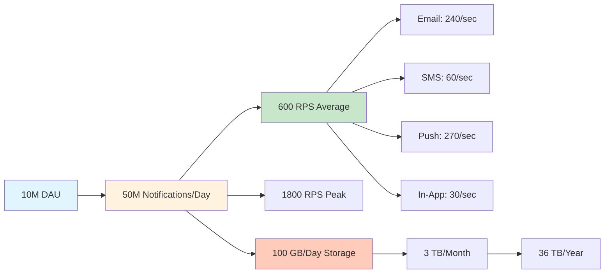

# Requirements and Capacity Estimations

## Overview
A notification service is like a post office for digital messages. Just like how a post office delivers letters to different addresses through various methods (mail truck, airplane, courier), our notification service delivers messages to users through different channels (email, SMS, push notifications, in-app messages).

**Real-world examples:** Firebase Cloud Messaging (FCM), Amazon SNS, Twilio SendGrid, notification systems in WhatsApp, Twitter, Instagram.

---

## 1. Functional Requirements

### 1.1 Multi-Channel Support
The system must support sending notifications through:
- **Email**: Order confirmations, password resets, newsletters
- **SMS**: OTP codes, delivery updates, critical alerts
- **Push Notifications**: Mobile app alerts, promotional messages
- **In-App Messages**: User-to-user messages, system announcements

**Why this matters:** Users prefer different channels for different types of messages. Critical alerts might need SMS, while promotional content works well via email.

### 1.2 Multiple Notification Types
- **Transactional**: Order confirmation, payment receipt, password reset (high priority, must deliver)
- **Promotional**: Discount offers, new features, marketing campaigns (lower priority, can be delayed)
- **System Alerts**: Server downtime, security alerts, system updates (critical, immediate)

**Priority Order:** System Alerts > Transactional > Promotional

### 1.3 Scheduled Delivery
- Support scheduling notifications for future delivery
- Example: "Send birthday discount at 9 AM on user's birthday"
- Example: "Send payment reminder 3 days before due date"

### 1.4 Rate Limiting
- Prevent spam by limiting promotional messages
- Example: Maximum 3 promotional emails per day per user
- Example: Maximum 1 SMS per hour for non-critical notifications
- Protects user experience and reduces costs

### 1.5 Retry Mechanism
- Handle delivery failures gracefully
- Example: If email server is down, retry after 5 minutes
- Maximum 3 retry attempts with exponential backoff (5min, 15min, 45min)
- Dead Letter Queue (DLQ) for permanently failed notifications

### 1.6 Notification Templates
- Pre-defined templates for common notifications
- Support dynamic variables: `Hello {{user_name}}, your order {{order_id}} is confirmed`
- Multi-language support

### 1.7 User Preferences
- Users can opt-in/opt-out of specific notification types
- Users can choose preferred channels
- Example: "I want order updates via SMS, but promotional content via email"

---

## 2. Non-Functional Requirements

### 2.1 Scalability
- **Target Users:** 100 million registered users
- **Daily Active Users (DAU):** 10 million users
- **Peak Traffic:** Handle 3x average load (during Black Friday, major events)
- **Notifications per day:** 50 million notifications
- **Must scale horizontally** (add more servers, not just bigger servers)

### 2.2 High Availability
- **Target Uptime:** 99.99% (52 minutes downtime per year)
- **Why:** Users expect critical notifications (OTP, payment confirmations) to arrive immediately
- **Solution:** Multi-region deployment, redundant systems, no single point of failure

### 2.3 Reliability
- **At-least-once delivery:** Every notification should be delivered at least once
- **Exactly-once for critical:** Payment confirmations should not be sent twice
- **Data durability:** Notification logs must be stored for auditing (99.999999999% durability - 11 nines)

### 2.4 Low Latency
- **Transactional notifications:** < 1 second from trigger to delivery
- **Promotional notifications:** < 5 seconds acceptable
- **Scheduled notifications:** Delivered within 1 minute of scheduled time

### 2.5 Cost Efficiency
- Email: ~$0.0001 per email (cheap)
- SMS: ~$0.01 per SMS (expensive - 100x more than email!)
- Push: Nearly free (only server costs)
- **Strategy:** Prefer push > email > SMS for cost optimization

---

## 3. Traffic Estimates (Beginner-Friendly Calculations)

Let's calculate step-by-step how much traffic our system needs to handle.

### 3.1 Daily Active Users (DAU)
```
Given:
- Total Registered Users: 100 million
- Daily Active Users (DAU): 10 million (10% of registered users)
- Peak Active Users: 30 million (during special events)
```

### 3.2 Notifications Per Day
```
Assumptions:
- Average notifications per user per day: 5 notifications
  - 1 transactional (order update, login alert)
  - 1 promotional (discount offer)
  - 2 system alerts (app updates, features)
  - 1 scheduled (reminders)

Calculation:
Total notifications per day = DAU × Notifications per user
                            = 10 million × 5
                            = 50 million notifications/day
```

### 3.3 Requests Per Second (RPS)
```
Average RPS:
Total notifications per day = 50 million
Seconds in a day = 24 hours × 60 minutes × 60 seconds = 86,400 seconds

Average RPS = 50,000,000 / 86,400
           = 578 notifications/second
           ≈ 600 notifications/second (rounded)
```

### 3.4 Peak Traffic (3x Average)
```
Peak RPS = 3 × Average RPS
        = 3 × 600
        = 1,800 notifications/second

During Black Friday or special events:
Peak RPS = 10 × Average RPS
        = 6,000 notifications/second
```

**Visualization:**
```
Normal Day:    |===|         600 req/sec
Peak Hours:    |=========|   1,800 req/sec
Black Friday:  |==============================| 6,000 req/sec
```

### 3.5 Channel Distribution
```
Email:    40% = 20 million/day  = 240 req/sec
SMS:      10% = 5 million/day   = 60 req/sec
Push:     45% = 22.5 million/day = 270 req/sec
In-App:   5%  = 2.5 million/day  = 30 req/sec
```

### 3.6 Read vs Write Ratio
```
Writes (sending notifications):     60%
Reads (checking status, history):   40%

Write RPS = 600 × 0.6 = 360 req/sec
Read RPS  = 600 × 0.4 = 240 req/sec
```

### 3.7 Bandwidth Requirements
```
Average notification size:
- Email: 50 KB (with HTML, images)
- SMS: 1 KB (text only)
- Push: 2 KB (JSON payload)
- In-App: 5 KB (rich content)

Weighted Average Size:
= (0.4 × 50 KB) + (0.1 × 1 KB) + (0.45 × 2 KB) + (0.05 × 5 KB)
= 20 + 0.1 + 0.9 + 0.25
= 21.25 KB per notification

Bandwidth (Outgoing):
= 600 req/sec × 21.25 KB
= 12,750 KB/sec
= 12.45 MB/sec
= 99.6 Mbps (bits per second)

Peak Bandwidth:
= 1,800 req/sec × 21.25 KB
= 38,250 KB/sec
= 37.35 MB/sec
= 298.8 Mbps

Recommendation: Provision for 500 Mbps (with headroom)
```

---

## 4. Storage Estimates

### 4.1 Notification Metadata Storage
```
Data per notification:
- notification_id: 8 bytes (BIGINT)
- user_id: 8 bytes (BIGINT)
- channel: 10 bytes (VARCHAR: email, sms, push, in-app)
- type: 20 bytes (VARCHAR: transactional, promotional, system)
- status: 10 bytes (VARCHAR: sent, failed, pending)
- content: 1 KB (notification body)
- metadata: 500 bytes (JSON: template_id, variables)
- timestamps: 24 bytes (created_at, sent_at, read_at)
- retry_count: 4 bytes (INT)

Total per notification ≈ 1.6 KB (rounded to 2 KB for overhead)
```

### 4.2 Total Storage Needed
```
Daily Storage:
= 50 million notifications × 2 KB
= 100,000,000 KB
= 100,000 MB
= 100 GB per day

Monthly Storage:
= 100 GB × 30 days
= 3 TB (3,000 GB)

Yearly Storage:
= 3 TB × 12 months
= 36 TB

5 Year Storage (with compression at 50%):
= 36 TB × 5 × 0.5
= 90 TB
```

### 4.3 Database Size Estimates
```
Primary Database (Hot Data - Last 30 days):
= 3 TB (actively queried)

Archive Database (Cold Data - Older than 30 days):
= 90 TB - 3 TB = 87 TB (rarely accessed)

Recommendation:
- Hot Data: SSD storage (fast, expensive)
- Cold Data: HDD or S3 Glacier (slow, cheap)
```

### 4.4 Cache Size (Redis)
```
Cache user preferences:
- 10 million DAU × 1 KB per user = 10 GB

Cache recent notifications (last 24 hours):
- 50 million notifications × 2 KB = 100 GB

Cache rate limiting counters:
- 10 million users × 100 bytes = 1 GB

Total Cache Size: 111 GB (provision 150 GB with buffer)
```

### 4.5 Message Queue Size
```
Queue depth during normal operation:
- Average processing time: 100ms per notification
- Incoming rate: 600 req/sec
- Queue size = 600 × 0.1 = 60 messages

Queue depth during peak:
- Incoming rate: 6,000 req/sec (Black Friday)
- If processing lags, queue builds up
- Max queue size = 6,000 req/sec × 60 seconds = 360,000 messages
- At 2 KB per message = 720 MB queue size

Recommendation: Provision for 1 GB queue buffer
```

---

## 5. Cost Estimates (Monthly)

### 5.1 Infrastructure Costs
```
Application Servers (10 servers × $200/month):    $2,000
Database (Managed PostgreSQL):                     $1,500
Cache (Redis Cluster 150 GB):                      $800
Message Queue (Kafka/RabbitMQ):                    $500
Load Balancer:                                     $200
CDN (CloudFlare):                                  $100
Monitoring (DataDog/Grafana):                      $300
Total Infrastructure:                              $5,400/month
```

### 5.2 Per-Message Costs
```
Email (20M/day × 30 days × $0.0001):    $60,000/month
SMS (5M/day × 30 days × $0.01):        $1,500,000/month (!)
Push (free - only infrastructure):      $0
In-App (free):                          $0

Total Messaging Costs:                  $1,560,000/month

💡 Cost Optimization Tip:
Prefer push notifications over SMS whenever possible!
Switching 50% of SMS to push would save $750,000/month!
```

---

## 6. Key Assumptions

1. **User Behavior:**
   - 10% of registered users are active daily
   - Users receive 5 notifications per day on average
   - 60% of users read notifications within 24 hours

2. **Traffic Patterns:**
   - Peak traffic is 3x average (during business hours)
   - Black Friday / special events can be 10x
   - Traffic is not uniformly distributed (spikes in evening)

3. **Retention Policy:**
   - Keep hot data for 30 days (frequently accessed)
   - Archive data older than 30 days
   - Delete data older than 5 years (compliance)

4. **Failure Rates:**
   - Email delivery failure: 5% (bounces, spam filters)
   - SMS delivery failure: 2% (invalid numbers, carrier issues)
   - Push notification failure: 10% (app not installed, notifications disabled)

5. **Technology Choices:**
   - Database: PostgreSQL (ACID, reliable)
   - Cache: Redis (in-memory, fast)
   - Message Queue: Kafka (high throughput, durable)
   - Load Balancer: Nginx (open-source, proven)

6. **Compliance:**
   - GDPR compliant (data retention, right to be forgotten)
   - CAN-SPAM Act (unsubscribe in every email)
   - TCPA (SMS consent required)

---

## 7. Summary Table

| Metric | Value |
|--------|-------|
| **DAU** | 10 million |
| **Notifications/Day** | 50 million |
| **Average RPS** | 600 req/sec |
| **Peak RPS** | 1,800 - 6,000 req/sec |
| **Bandwidth** | 100 Mbps (peak: 300 Mbps) |
| **Daily Storage** | 100 GB |
| **Yearly Storage** | 36 TB |
| **Cache Size** | 150 GB |
| **Uptime Target** | 99.99% |
| **Latency Target** | < 1 second |
| **Monthly Cost** | $1.5M (mostly SMS!) |

---

## 8. Visual Summary



---

## Next Steps

Now that we understand the scale and requirements, we'll design the architecture step-by-step:

1. **Step 1:** Basic architecture (Client → Server → Database)
2. **Step 2:** Add caching (Redis for preferences and rate limiting)
3. **Step 3:** Add database scaling (replication and sharding)
4. **Step 4:** Add message queue (Kafka for async processing)
5. **Step 5:** Add CDN and object storage (templates, images)
6. **Step 6:** Final architecture with microservices

Each step will build upon the previous, showing how the system evolves to meet our requirements!

---

**💡 Beginner Tip:** Don't be overwhelmed by the numbers! Start with a simple design that works for 1,000 users, then think about how to scale it to 10 million. The principles remain the same - just add more servers, caching, and smarter data distribution.
