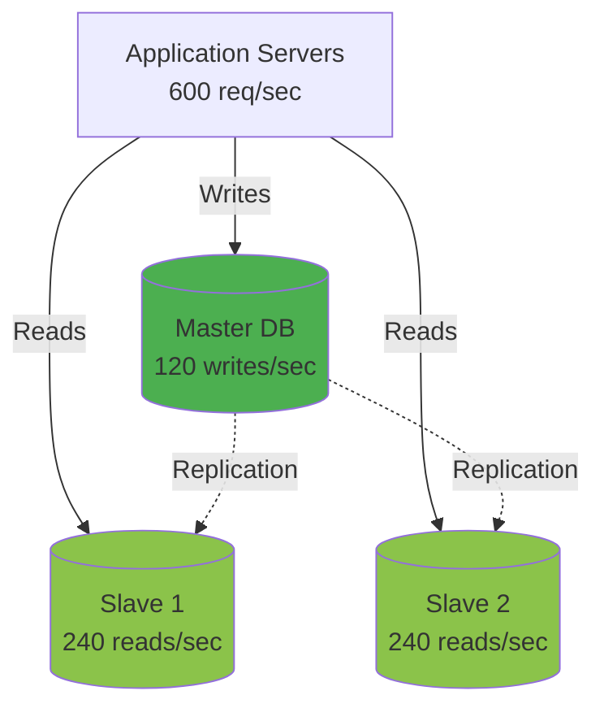
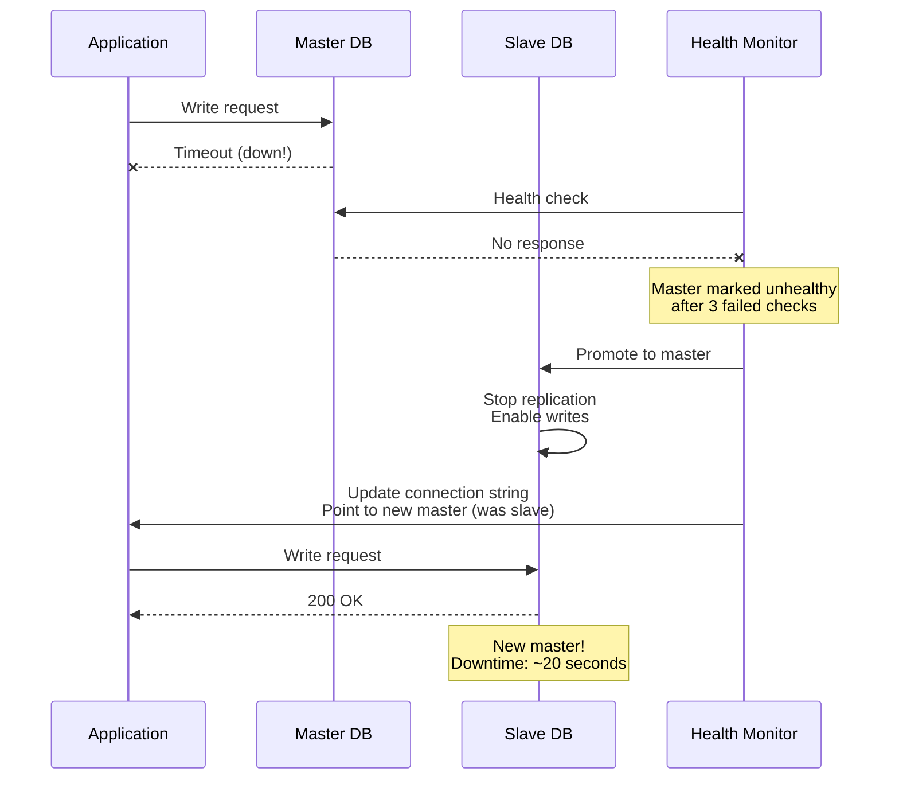

# Scalability, Reliability & Security

## Scalability Strategies

### 1. Horizontal Scaling (Scale Out)

**Adding more servers to distribute load**

**Application Servers:**
```
Normal load (600 notifications/sec):
- 3 API servers (200 req/sec each)

Peak load (6,000 notifications/sec):
- Auto-scale to 30 API servers
- Load balancer distributes evenly
- Each handles 200 req/sec
```

**Kubernetes Auto-Scaling:**
```yaml
apiVersion: autoscaling/v2
kind: HorizontalPodAutoscaler
metadata:
  name: notification-api
spec:
  scaleTargetRef:
    apiVersion: apps/v1
    kind: Deployment
    name: notification-api
  minReplicas: 3
  maxReplicas: 30
  metrics:
  - type: Resource
    resource:
      name: cpu
      target:
        type: Utilization
        averageUtilization: 70  # Scale when CPU > 70%
  - type: Resource
    resource:
      name: memory
      target:
        type: Utilization
        averageUtilization: 80
  behavior:
    scaleUp:
      stabilizationWindowSeconds: 60  # Wait 1 min before scaling up
      policies:
      - type: Percent
        value: 50  # Add 50% more pods at a time
        periodSeconds: 60
    scaleDown:
      stabilizationWindowSeconds: 300  # Wait 5 min before scaling down
```

---

### 2. Vertical Scaling (Scale Up)

**Upgrading server resources**

```
Database Server:
Small: 4 CPU, 16 GB RAM → Handles 1,000 queries/sec
Medium: 8 CPU, 32 GB RAM → Handles 3,000 queries/sec
Large: 16 CPU, 64 GB RAM → Handles 8,000 queries/sec

Trade-off:
✓ Simple (no code changes)
✗ Expensive (exponential cost)
✗ Single point of failure
✗ Downtime for upgrade
```

---

### 3. Database Scaling

**Read Replicas:**


**Sharding:**
```
Single DB: 10 TB, 5000 writes/sec (max capacity)

3 Shards:
Shard 1: 3.3 TB, 1667 writes/sec
Shard 2: 3.3 TB, 1667 writes/sec
Shard 3: 3.3 TB, 1667 writes/sec

Total capacity: 15,000 writes/sec (3x increase!)
```

---

### 4. Caching Strategy

**Multi-Level Caching:**
```
L1: Application Memory (fastest, smallest)
  ↓ Miss
L2: Redis Cache (fast, medium)
  ↓ Miss
L3: Database (slow, largest)
```

**Cache Hit Rates:**
```
L1 (in-memory): 50% hit rate, 0.1ms latency
L2 (Redis): 40% hit rate, 1ms latency
L3 (Database): 10% miss rate, 50ms latency

Average latency:
(0.5 × 0.1ms) + (0.4 × 1ms) + (0.1 × 50ms) = 5.45ms

Without caching:
100% × 50ms = 50ms

9x faster! 🎉
```

---

### 5. Asynchronous Processing

**Synchronous (Slow):**
```
User request → Process → Send email (500ms) → Response
Total: 550ms (user waits)
```

**Asynchronous (Fast):**
```
User request → Queue message (5ms) → Response
                ↓ (background)
              Process → Send email (500ms)

User sees: 55ms (10x faster!)
```

---

## Reliability Patterns

### 1. Circuit Breaker

**Problem:** Service calls failing provider repeatedly

```javascript
class CircuitBreaker {
    constructor() {
        this.state = 'CLOSED';  // CLOSED, OPEN, HALF_OPEN
        this.failureCount = 0;
        this.failureThreshold = 5;
        this.timeout = 60000;  // 60 seconds
    }

    async call(fn) {
        if (this.state === 'OPEN') {
            if (Date.now() - this.openedAt > this.timeout) {
                this.state = 'HALF_OPEN';  // Try again
            } else {
                throw new Error('Circuit breaker is OPEN');
            }
        }

        try {
            const result = await fn();
            this.onSuccess();
            return result;
        } catch (error) {
            this.onFailure();
            throw error;
        }
    }

    onSuccess() {
        this.failureCount = 0;
        if (this.state === 'HALF_OPEN') {
            this.state = 'CLOSED';  // Recovered!
        }
    }

    onFailure() {
        this.failureCount++;
        if (this.failureCount >= this.failureThreshold) {
            this.state = 'OPEN';  // Stop trying
            this.openedAt = Date.now();
        }
    }
}

// Usage
const sendGridCircuitBreaker = new CircuitBreaker();

await sendGridCircuitBreaker.call(async () => {
    return await sendGridClient.send(email);
});
```

**States:**
```
CLOSED (Normal):
→ Requests go through
→ Failures increment counter

OPEN (Broken):
→ Requests immediately fail (don't call provider)
→ After timeout, try again (HALF_OPEN)

HALF_OPEN (Testing):
→ Allow one request through
→ Success → CLOSED
→ Failure → OPEN
```

---

### 2. Retry with Exponential Backoff

```javascript
async function sendWithRetry(notification, maxRetries = 3) {
    let attempt = 0;

    while (attempt < maxRetries) {
        try {
            return await sendEmail(notification);
        } catch (error) {
            attempt++;

            if (attempt >= maxRetries) {
                throw error;  // Give up
            }

            // Exponential backoff: 1s, 2s, 4s
            const delay = Math.pow(2, attempt) * 1000;

            console.log(`Retry ${attempt}/${maxRetries} after ${delay}ms`);
            await sleep(delay);
        }
    }
}
```

**Jitter (Prevent Thundering Herd):**
```javascript
// Without jitter: All workers retry at exact same time (overload!)
const delay = Math.pow(2, attempt) * 1000;  // 2s, 4s, 8s...

// With jitter: Random delays prevent simultaneous retries
const jitter = Math.random() * 1000;  // 0-1000ms
const delay = Math.pow(2, attempt) * 1000 + jitter;  // 2-3s, 4-5s, 8-9s...
```

---

### 3. Graceful Degradation

**Example: Provider Outage**

```javascript
async function sendNotification(notification) {
    try {
        // Try primary provider (SendGrid)
        return await sendGridClient.send(notification);
    } catch (error) {
        console.warn('SendGrid failed, trying backup provider');

        try {
            // Fallback to secondary provider (Mailgun)
            return await mailgunClient.send(notification);
        } catch (error2) {
            // Both failed - degrade gracefully
            console.error('All email providers failed');

            // Store in database for later retry
            await db.query(
                'UPDATE notifications SET status=?, error=? WHERE id=?',
                ['failed', error2.message, notification.id]
            );

            // Queue for retry in 1 hour
            await kafka.publish('email-retry-queue', notification);
        }
    }
}
```

---

### 4. Health Checks

**Application Health Endpoint:**
```javascript
app.get('/health', async (req, res) => {
    const checks = {
        database: await checkDatabase(),
        redis: await checkRedis(),
        kafka: await checkKafka()
    };

    const isHealthy = Object.values(checks).every(check => check.healthy);

    res.status(isHealthy ? 200 : 503).json({
        status: isHealthy ? 'healthy' : 'unhealthy',
        checks: checks
    });
});

async function checkDatabase() {
    try {
        await db.query('SELECT 1');
        return { healthy: true };
    } catch (error) {
        return { healthy: false, error: error.message };
    }
}
```

**Load Balancer Health Checks:**
```
Load Balancer → GET /health every 10 seconds

Server 1: 200 OK → Healthy (send traffic)
Server 2: 503 Unavailable → Unhealthy (remove from pool)
Server 3: Timeout → Unhealthy (remove from pool)
```

---

## High Availability

### 1. Multi-Region Deployment

```
Region 1 (US-East):
  - 30% of traffic
  - Full stack (API, DB, Workers)
  - PRIMARY

Region 2 (EU-West):
  - 40% of traffic
  - Full stack
  - PRIMARY

Region 3 (Asia-Pacific):
  - 30% of traffic
  - Full stack
  - PRIMARY

All regions are active (multi-master)
```

**DNS Routing (Route53):**
```
Geolocation routing:
- Users in Americas → US-East
- Users in Europe → EU-West
- Users in Asia → Asia-Pacific

Failover:
- If US-East fails → Route to EU-West
- Health check every 30 seconds
```

---

### 2. Database High Availability

**Automatic Failover:**


---

### 3. Kafka High Availability

**Replication Factor:**
```
Topic: email-notifications
Partitions: 3
Replication Factor: 3

Partition 0:
  Leader: Broker 1
  Replicas: Broker 2, Broker 3

Partition 1:
  Leader: Broker 2
  Replicas: Broker 1, Broker 3

Partition 2:
  Leader: Broker 3
  Replicas: Broker 1, Broker 2

If Broker 1 fails:
→ Broker 2 becomes leader for Partition 0
→ No data loss (replicas on Broker 2, 3)
→ No downtime (automatic failover)
```

---

## Monitoring & Alerting

### Key Metrics

**1. Application Metrics:**
```
- Request rate (req/sec)
- Error rate (errors/sec)
- Latency (P50, P95, P99)
- CPU usage (%)
- Memory usage (%)
```

**2. Database Metrics:**
```
- Connections (active/max)
- Queries/sec
- Replication lag (seconds)
- Disk usage (%)
- Slow queries (>1s)
```

**3. Queue Metrics:**
```
- Messages in queue
- Consumer lag
- Processing rate (msgs/sec)
- Dead letter queue size
```

**4. Business Metrics:**
```
- Notifications sent/day
- Delivery rate (%)
- Open rate (%)
- Cost per notification
- Revenue from notifications
```

---

### Alerting Rules

**Critical Alerts (Page Immediately):**
```yaml
- alert: HighErrorRate
  expr: sum(rate(http_requests_total{status=~"5.."}[5m])) / sum(rate(http_requests_total[5m])) > 0.05
  for: 5m
  annotations:
    summary: "Error rate > 5% for 5 minutes"

- alert: DatabaseDown
  expr: up{job="postgresql"} == 0
  for: 1m
  annotations:
    summary: "Database is down"

- alert: QueueLagHigh
  expr: kafka_consumer_lag > 10000
  for: 10m
  annotations:
    summary: "Kafka consumer lag > 10,000 messages"
```

**Warning Alerts (Slack Notification):**
```yaml
- alert: HighLatency
  expr: histogram_quantile(0.99, rate(http_request_duration_seconds_bucket[5m])) > 1
  for: 10m
  annotations:
    summary: "P99 latency > 1 second"

- alert: CacheHitRateLow
  expr: redis_cache_hit_rate < 0.8
  for: 30m
  annotations:
    summary: "Cache hit rate < 80%"
```

---

## Security

### 1. Authentication & Authorization

**API Key Management:**
```
sk_live_abc123  → Production
sk_test_xyz789  → Testing

API keys:
- Hashed in database (bcrypt)
- Rotatable (user can regenerate)
- Scoped (read-only vs read-write)
- Rate limited per key
```

**JWT Tokens (Internal Services):**
```javascript
const jwt = require('jsonwebtoken');

// Service-to-service auth
const token = jwt.sign(
    {
        service: 'notification-service',
        scope: ['read:preferences', 'write:notifications']
    },
    SECRET_KEY,
    { expiresIn: '5m' }
);
```

---

### 2. Data Encryption

**At Rest:**
```
Database: AES-256 encryption
S3: Server-side encryption (SSE-S3)
Backups: Encrypted with GPG keys
```

**In Transit:**
```
All APIs: HTTPS (TLS 1.3)
Database connections: SSL
Inter-service: mTLS (mutual TLS)
```

**Sensitive Data:**
```sql
-- Email addresses encrypted
CREATE TABLE users (
    id BIGINT PRIMARY KEY,
    email_encrypted BYTEA,  -- AES-256 encrypted
    phone_encrypted BYTEA
);

-- Encrypt before storing
INSERT INTO users (email_encrypted)
VALUES (pgp_sym_encrypt('user@example.com', 'encryption-key'));

-- Decrypt when reading
SELECT pgp_sym_decrypt(email_encrypted, 'encryption-key') as email
FROM users WHERE id = 123;
```

---

### 3. Input Validation

```javascript
const Joi = require('joi');

const notificationSchema = Joi.object({
    user_id: Joi.number().integer().positive().required(),
    channel: Joi.string().valid('email', 'sms', 'push').required(),
    template_id: Joi.string().max(50).required(),
    variables: Joi.object().max(10).required()  // Max 10 variables
});

app.post('/api/v1/notifications', async (req, res) => {
    const { error, value } = notificationSchema.validate(req.body);

    if (error) {
        return res.status(400).json({ error: error.details[0].message });
    }

    // Sanitize HTML to prevent XSS
    value.variables = sanitizeHtml(value.variables);

    // Process notification
});
```

---

### 4. Rate Limiting (DDoS Protection)

```javascript
const rateLimit = require('express-rate-limit');

// API-wide rate limit
app.use('/api', rateLimit({
    windowMs: 15 * 60 * 1000,  // 15 minutes
    max: 1000,  // Max 1000 requests per window
    message: 'Too many requests from this IP'
}));

// Endpoint-specific limits
app.use('/api/v1/notifications/bulk', rateLimit({
    windowMs: 60 * 60 * 1000,  // 1 hour
    max: 10,  // Max 10 bulk sends per hour
    keyGenerator: (req) => req.user.id  // Per user, not per IP
}));
```

---

### 5. Audit Logging

```sql
CREATE TABLE audit_logs (
    id BIGSERIAL PRIMARY KEY,
    user_id BIGINT,
    action VARCHAR(50),  -- e.g., 'send_notification', 'update_preferences'
    resource_type VARCHAR(50),
    resource_id BIGINT,
    changes JSONB,  -- Before/after values
    ip_address INET,
    user_agent TEXT,
    occurred_at TIMESTAMP DEFAULT NOW()
);

-- Example: Log preference change
INSERT INTO audit_logs (user_id, action, resource_type, resource_id, changes)
VALUES (
    123,
    'update_preferences',
    'user_preferences',
    123,
    '{"before": {"email_enabled": true}, "after": {"email_enabled": false}}'::jsonb
);
```

---

## Disaster Recovery

### Recovery Time Objective (RTO)

```
RTO = Maximum tolerable downtime

Tier 1 (Critical): 15 minutes
- Notification API
- Database masters
- Kafka cluster

Tier 2 (Important): 1 hour
- Analytics service
- Admin dashboard

Tier 3 (Non-critical): 4 hours
- Reporting services
```

### Recovery Point Objective (RPO)

```
RPO = Maximum tolerable data loss

Tier 1 (Zero data loss):
- Transactional notifications
- User preferences
→ Synchronous replication

Tier 2 (< 5 minutes data loss):
- Promotional notifications
→ Asynchronous replication

Tier 3 (< 1 hour data loss):
- Analytics data
→ Hourly backups
```

---

### Backup Strategy

**Database Backups:**
```
Continuous WAL archiving: Real-time
Full backups: Daily
Incremental backups: Every 6 hours
Retention: 30 days
Storage: S3 Glacier (cheap, durable)
```

**Disaster Recovery Drill (Quarterly):**
```
1. Simulate region failure (turn off US-East)
2. Promote EU-West to primary
3. Update DNS routing
4. Restore database from backup
5. Verify all systems operational
6. Measure RTO (was it < 15 minutes?)
7. Document lessons learned
```

---

**💡 Key Takeaways:**
1. **Scale horizontally** for linear capacity growth
2. **Fail gracefully** with circuit breakers and retries
3. **Monitor everything** with actionable alerts
4. **Encrypt data** at rest and in transit
5. **Plan for disasters** with backups and multi-region
6. **Test failures** regularly (chaos engineering)
