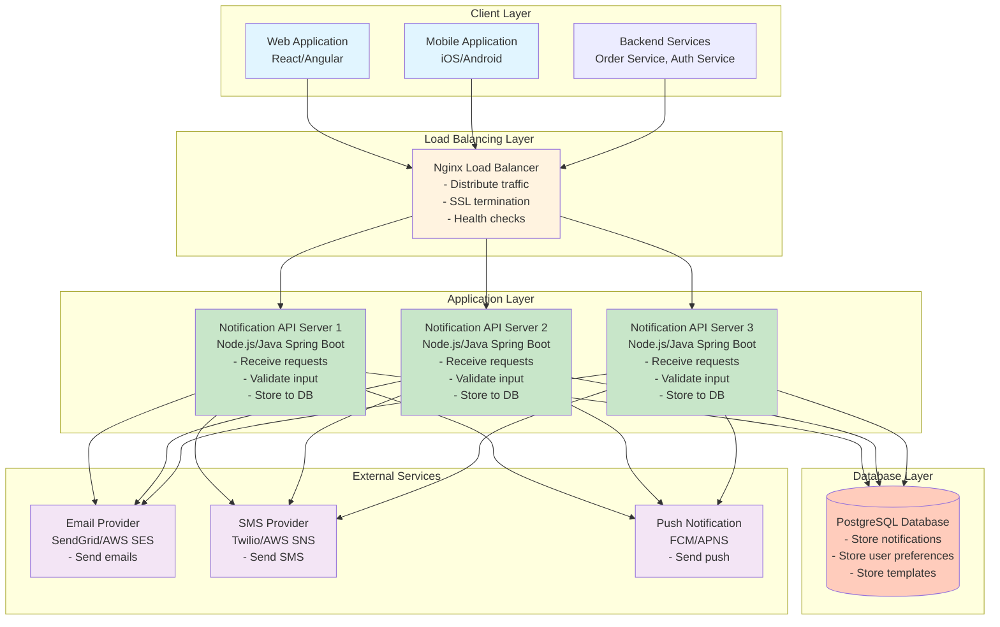
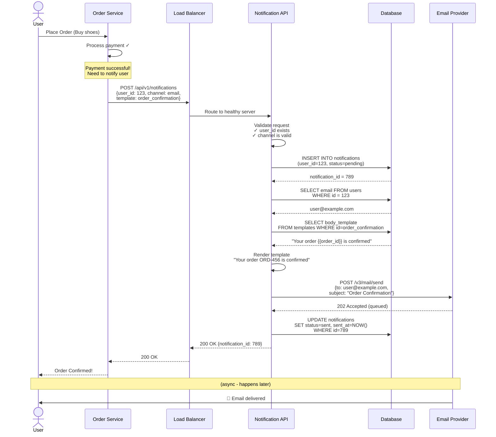

# Step 1: Basic Architecture

## What We're Building in This Step

In this step, we'll create the foundation of our notification system. Think of it like building a house - we start with the basic structure before adding fancy features.

**Components we'll add:**
1. Client (users' devices)
2. Load Balancer (traffic director)
3. Application Servers (brain of the system)
4. Database (memory/storage)

---

## Architecture Diagram



---

## Component Breakdown

### 1. Client Layer

**What:** Applications that send notification requests to our system.

**Who sends notifications:**
- **Web/Mobile Apps:** "Send notification when user clicks 'forgot password'"
- **Backend Services:**
  - Order Service: "Send notification when order is placed"
  - Payment Service: "Send notification when payment succeeds"
  - Authentication Service: "Send notification for suspicious login"

**Example Request:**
```json
POST /api/v1/notifications
{
  "user_id": "12345",
  "channel": "email",
  "type": "transactional",
  "template_id": "order_confirmation",
  "variables": {
    "order_id": "ORD-789",
    "amount": "$99.99"
  }
}
```

---

### 2. Load Balancer (Nginx)

**What:** The "traffic cop" that directs incoming requests to available servers.

**Why we need it:**
- **Distribute Load:** If one server gets 1000 requests, it splits them (333, 333, 334) across 3 servers
- **Health Checks:** If Server 2 crashes, stop sending traffic to it
- **SSL Termination:** Handle HTTPS encryption/decryption (heavy work) so app servers don't have to
- **Single Entry Point:** Clients don't need to know about multiple servers

**Load Balancing Algorithms:**

1. **Round Robin (Simple):**
   ```
   Request 1 → Server 1
   Request 2 → Server 2
   Request 3 → Server 3
   Request 4 → Server 1 (cycle repeats)
   ```

2. **Least Connections (Smarter):**
   ```
   Server 1: 10 active connections
   Server 2: 5 active connections  ← Send here (least busy)
   Server 3: 15 active connections
   ```

3. **Weighted Round Robin (For different sized servers):**
   ```
   Server 1 (4 CPU): 40% traffic
   Server 2 (4 CPU): 40% traffic
   Server 3 (2 CPU): 20% traffic (smaller server)
   ```

**Health Check Example:**
```
Every 10 seconds:
LB → GET /health → Server 1 → Response: 200 OK ✓
LB → GET /health → Server 2 → Response: Timeout ✗ (mark as unhealthy)
LB → GET /health → Server 3 → Response: 200 OK ✓
```

**Real-world analogy:** Like a restaurant host who assigns customers to different waiters to balance the workload.

---

### 3. Application Servers

**What:** The core logic of the notification system.

**Technology Choices:**
- **Node.js:** Great for I/O heavy operations, async by default
- **Java Spring Boot:** Enterprise-grade, robust, great for large teams
- **Python Django/FastAPI:** Quick development, easy to learn
- **Go:** High performance, great concurrency

**Responsibilities:**

1. **Receive & Validate Requests:**
   ```javascript
   // Validation example
   if (!request.user_id) {
     return 400 Bad Request: "user_id is required"
   }
   if (!['email', 'sms', 'push'].includes(request.channel)) {
     return 400 Bad Request: "Invalid channel"
   }
   ```

2. **Store to Database:**
   ```sql
   INSERT INTO notifications (user_id, channel, type, content, status)
   VALUES (12345, 'email', 'transactional', 'Your order is confirmed', 'pending');
   ```

3. **Call External Provider:**
   ```javascript
   // Send via email provider
   await sendGridClient.send({
     to: 'user@example.com',
     from: 'noreply@company.com',
     subject: 'Order Confirmation',
     html: renderTemplate('order_confirmation', variables)
   });
   ```

4. **Update Status:**
   ```sql
   UPDATE notifications
   SET status = 'sent', sent_at = NOW()
   WHERE id = 789;
   ```

**Why Multiple Servers?**
- **High Availability:** If one crashes, others keep working
- **Scalability:** Handle more traffic by adding servers (horizontal scaling)
- **Zero Downtime Deployment:** Update servers one-by-one without stopping service

**Stateless Design (CRITICAL!):**
```
❌ BAD: Server stores user session in memory
   Problem: If user's next request goes to different server, session is lost

✓ GOOD: Store session in shared cache (Redis) or use JWT tokens
   Solution: Any server can handle any request
```

---

### 4. Database (PostgreSQL)

**What:** Persistent storage for all notification data.

**Why PostgreSQL?**
| Reason | Explanation |
|--------|-------------|
| **ACID Compliance** | Ensures data consistency (notification sent = marked as sent) |
| **Relational Model** | Good for structured data with relationships (users, notifications, templates) |
| **Rich Queries** | Complex queries: "Show all failed SMS from last week" |
| **Mature & Reliable** | Battle-tested, huge community, extensive tooling |

**What We Store:**

**Table 1: notifications**
```sql
CREATE TABLE notifications (
    id BIGSERIAL PRIMARY KEY,
    user_id BIGINT NOT NULL,
    channel VARCHAR(20) NOT NULL,  -- email, sms, push, in-app
    type VARCHAR(20) NOT NULL,      -- transactional, promotional, system
    template_id VARCHAR(50),
    content TEXT NOT NULL,
    status VARCHAR(20) DEFAULT 'pending',  -- pending, sent, failed, retry
    error_message TEXT,
    retry_count INT DEFAULT 0,
    created_at TIMESTAMP DEFAULT NOW(),
    sent_at TIMESTAMP,
    read_at TIMESTAMP,

    INDEX idx_user_id (user_id),
    INDEX idx_status (status),
    INDEX idx_created_at (created_at)
);
```

**Table 2: user_preferences**
```sql
CREATE TABLE user_preferences (
    user_id BIGINT PRIMARY KEY,
    email_enabled BOOLEAN DEFAULT TRUE,
    sms_enabled BOOLEAN DEFAULT TRUE,
    push_enabled BOOLEAN DEFAULT TRUE,
    promotional_enabled BOOLEAN DEFAULT TRUE,
    preferred_channel VARCHAR(20) DEFAULT 'email',
    updated_at TIMESTAMP DEFAULT NOW()
);
```

**Table 3: templates**
```sql
CREATE TABLE templates (
    template_id VARCHAR(50) PRIMARY KEY,
    name VARCHAR(100) NOT NULL,
    subject VARCHAR(200),           -- for email
    body_template TEXT NOT NULL,     -- with {{variables}}
    channel VARCHAR(20) NOT NULL,
    created_at TIMESTAMP DEFAULT NOW()
);
```

**Example Data:**
```
templates table:
+------------------+---------------------+----------------------------+
| template_id      | name                | subject                    |
+------------------+---------------------+----------------------------+
| order_confirm    | Order Confirmation  | Your order {{order_id}}    |
| password_reset   | Password Reset      | Reset your password        |
| promo_discount   | Discount Offer      | {{discount}}% off today!   |
+------------------+---------------------+----------------------------+
```

---

### 5. External Notification Providers

We don't build email/SMS infrastructure ourselves - we use specialized providers.

**Email Providers:**
- **SendGrid:** $0.0001/email, 99% deliverability, good reputation
- **AWS SES:** $0.0001/email, integrates with AWS ecosystem
- **Mailgun:** Developer-friendly, good for transactional emails

**SMS Providers:**
- **Twilio:** $0.01/SMS, global coverage, reliable
- **AWS SNS:** $0.00645/SMS in US, cheaper but less feature-rich

**Push Notification Providers:**
- **Firebase Cloud Messaging (FCM):** Free for Android/iOS
- **Apple Push Notification Service (APNS):** Free for iOS

**Why use providers instead of building our own?**
| Aspect | Build Your Own | Use Provider |
|--------|---------------|--------------|
| **Cost** | High (servers, IPs, expertise) | Low (pay per use) |
| **Deliverability** | Poor (new IPs marked as spam) | High (established reputation) |
| **Compliance** | You handle CAN-SPAM, GDPR | Provider handles it |
| **Time to Market** | Months | Hours |
| **Maintenance** | Ongoing (blacklist monitoring) | Provider's problem |

---

## Request Flow (Step-by-Step)

Let's trace what happens when someone places an order:



**Timeline:**
```
0ms:    User places order
50ms:   Payment processed
100ms:  Notification API called
120ms:  Validation complete
150ms:  Saved to database
180ms:  Email sent to SendGrid
200ms:  Response returned (notification queued)
...
5000ms: User receives email (SendGrid handles delivery)
```

---

## Design Decisions & Trade-offs

### Decision 1: Why PostgreSQL over NoSQL?

**✓ Chose: PostgreSQL (SQL)**

**Reasons:**
- Need ACID transactions (notification sent must be recorded atomically)
- Data is structured (fixed schema: user_id, channel, status, etc.)
- Complex queries needed: "Show all failed SMS from last week grouped by error type"
- Relationships matter: notifications → users → preferences

**Trade-offs:**
| SQL (PostgreSQL) | NoSQL (MongoDB) |
|-----------------|-----------------|
| ✓ Strong consistency | ✗ Eventual consistency |
| ✓ Complex queries (JOINs) | ✗ No JOINs (denormalize) |
| ✗ Harder to scale horizontally | ✓ Easy horizontal scaling |
| ✓ Fixed schema (data integrity) | ✗ Schema-less (data inconsistency risk) |

**When would we use NoSQL?**
- If we needed to store 1 billion notifications per day (extreme scale)
- If notification structure varied wildly (email has different fields than SMS)
- If we needed geo-distributed writes (write to nearest datacenter)

---

### Decision 2: Synchronous vs Asynchronous Notification Sending

**✗ Current Approach: Synchronous (not ideal!)**
```javascript
// Client waits for email to be sent
app.post('/notifications', async (req, res) => {
  await saveToDatabase(notification);
  await sendEmail(notification);  // ← Blocks for 500ms!
  res.status(200).send('Notification sent');
});
```

**Problems:**
- If SendGrid is slow (500ms), client waits
- If SendGrid is down, request fails
- Can't retry easily

**✓ Better Approach (Coming in Step 4!): Asynchronous**
```javascript
// Client gets instant response
app.post('/notifications', async (req, res) => {
  await saveToDatabase(notification);
  await queueToMessageQueue(notification);  // ← Returns instantly!
  res.status(200).send('Notification queued');
});

// Separate worker processes notification later
worker.processQueue((notification) => {
  await sendEmail(notification);  // Happens in background
});
```

**Why wait until Step 4?**
- Principle: Start simple, add complexity when needed
- Step 1 is about understanding the basics
- Step 4 will add message queue (RabbitMQ/Kafka) for async processing

---

### Decision 3: Multiple App Servers (Horizontal Scaling)

**✗ Single Server:**
```
All traffic → One Big Server (16 CPU, 64 GB RAM)
```
**Problems:**
- Single point of failure (server crashes = entire system down)
- Scaling limit (can't add CPU infinitely)
- Expensive (high-end servers are exponentially pricier)
- No rolling updates (update means downtime)

**✓ Multiple Servers:**
```
Traffic split → Server 1 (4 CPU, 8 GB)
             → Server 2 (4 CPU, 8 GB)
             → Server 3 (4 CPU, 8 GB)
```
**Benefits:**
- High availability (1 server down, 2 still serve)
- Linear scaling (need more capacity? Add server 4, 5, 6...)
- Cost-effective (3 small servers cheaper than 1 big)
- Rolling updates (update server 1, then 2, then 3 - zero downtime)

**Calculation Example:**
```
Vertical Scaling (Scale Up):
1 server: 16 CPU, 64 GB RAM = $500/month
Total capacity: 16 CPU

Horizontal Scaling (Scale Out):
4 servers: 4 CPU, 16 GB RAM each = $100/month × 4 = $400/month
Total capacity: 16 CPU (same), but $100 cheaper + better availability!
```

---

## Current Limitations (What This Step Doesn't Handle)

This basic architecture works for small scale, but has issues:

**1. Database Becomes Bottleneck:**
```
600 requests/sec × 3 app servers = 1800 database queries/sec
PostgreSQL can handle ~10,000 queries/sec, but inefficiently
```
**Solution in Step 2:** Add Redis cache (reduce DB load by 80%)

**2. Database is Single Point of Failure:**
```
Database crashes → Entire system down (can't read/write notifications)
```
**Solution in Step 3:** Add database replication (master-slave)

**3. Slow Response Times (Synchronous):**
```
Request → Save to DB (50ms) → Send email (500ms) → Response = 550ms
User waits 550ms for confirmation!
```
**Solution in Step 4:** Add message queue (respond in 50ms, send email async)

**4. No Retry Logic:**
```
SendGrid returns error → Notification lost forever
```
**Solution in Step 4:** Message queue with retry and dead-letter queue

**5. User Preferences Not Cached:**
```
Every notification → Database query to check preferences
If user opted out of emails, we query DB every time!
```
**Solution in Step 2:** Cache user preferences in Redis

**6. No Rate Limiting:**
```
Bug in Order Service → Sends 1000 notifications to same user in 1 second
User angry, our SMS bill explodes ($10,000!)
```
**Solution in Step 2:** Redis-based rate limiting

---

## What We've Achieved

**✓ Functional:**
- Can send notifications via email, SMS, push
- Can store notification history in database
- Can handle multiple clients simultaneously
- Can validate requests and handle errors

**✓ Scalable (to a point):**
- Horizontal scaling of app servers (add more as needed)
- Load balancer distributes traffic
- Can handle ~1000 req/sec (good for small/medium apps)

**✓ Reliable (basic):**
- Multiple app servers (no single point of failure for app layer)
- Load balancer health checks (auto-remove bad servers)

**✗ Not Yet Achieved:**
- High availability (database is single point of failure)
- Low latency (synchronous sending is slow)
- Cost efficiency (no caching, hitting DB every time)
- Advanced retry logic
- Rate limiting

---

## Capacity Check

**Can this architecture handle our requirements?**

| Requirement | Target | Step 1 Capability | Status |
|-------------|--------|-------------------|--------|
| Notifications/sec | 600 avg, 1800 peak | ~1000 req/sec | ✓ Barely |
| Latency | < 1 second | ~550ms | ✓ OK |
| Availability | 99.99% | ~99% (DB single point) | ✗ Not yet |
| Scalability | 10M DAU | ~1M DAU | ✗ Not yet |

**Verdict:** Good for MVP (Minimum Viable Product) or small-scale launch, but needs improvements for production scale!

---

## Next Steps

In **Step 2**, we'll add caching:
- Redis for user preferences (reduce DB queries by 80%)
- Redis for rate limiting (prevent spam)
- Redis for template caching (faster rendering)

This will:
- Reduce database load from 600 queries/sec to 120 queries/sec
- Improve latency from 550ms to 150ms
- Enable rate limiting (prevent abuse)
- Reduce costs (fewer database reads)

---

## Beginner-Friendly Analogies

**Load Balancer = Restaurant Host:**
- Customers (requests) arrive at restaurant
- Host checks which waiter (server) is least busy
- Directs customer to that waiter
- If waiter is sick, directs to other waiters

**Application Server = Chef:**
- Takes order (request)
- Prepares food (processes notification)
- Uses recipe book (templates)
- Serves dish (sends response)

**Database = Recipe Book + Kitchen Log:**
- Stores recipes (templates)
- Logs every order (notifications table)
- Chef looks up recipes when needed
- Manager reviews logs for analytics

**External Provider = Delivery Service:**
- We prepare the package (notification content)
- Delivery service (SendGrid) delivers to customer's door (user's inbox)
- We pay per delivery
- They handle logistics (spam filters, routing, retries)

---

**💡 Key Takeaway:** Start simple! This basic architecture (Client → Load Balancer → App Servers → Database) is the foundation. Every complex system started here. Now we'll iteratively add components to handle scale, reliability, and performance.
