# Step 2: Adding Caching Layer

## What Changed from Step 1

In Step 1, every request hit the database. This is slow and expensive!

**Problems we're solving:**
1. **Database Overload:** 600 queries/sec is stressing the database
2. **Slow Queries:** Fetching user preferences takes 50-100ms from disk
3. **No Rate Limiting:** Can't prevent spam (user gets 1000 emails in 1 minute)
4. **Repeated Queries:** Same template fetched 1000 times per day

**Solution:** Add Redis cache - an in-memory data store that's 10-100x faster than database!

---

## Architecture Diagram (Step 2)


**Key Change:** App servers now check Redis cache BEFORE querying database!

---

## What is Redis?

**Redis = Remote Dictionary Server**

Think of it as a super-fast, in-memory hash map that multiple servers can access.

**Speed Comparison:**
```
Reading from Disk (PostgreSQL):     10-50 ms
Reading from SSD (PostgreSQL):      1-5 ms
Reading from Memory (Redis):        0.1-1 ms (10-100x faster!)
```

**Analogy:**
- **Database (PostgreSQL):** Library with millions of books on shelves (slow to find and retrieve)
- **Cache (Redis):** Your desk with frequently-used books (instant access)

**Why Redis over alternatives?**
| Feature | Redis | Memcached | In-App Memory |
|---------|-------|-----------|---------------|
| **Data Structures** | Rich (strings, lists, sets, hashes) | Simple (key-value) | Any |
| **Persistence** | Yes (optional) | No | No |
| **Replication** | Yes | No | No |
| **Pub/Sub** | Yes | No | No |
| **Shared Across Servers** | Yes | Yes | No |
| **Atomic Operations** | Yes (counters for rate limiting) | Limited | Yes |

---

## Caching Strategies

### 1. Cache-Aside Pattern (Lazy Loading)

**How it works:**
```
1. App checks cache: "Is user_123 preferences in Redis?"
2. Cache Hit → Return from Redis (0.5ms) ✓
3. Cache Miss → Query database (50ms) → Store in Redis → Return
```

**Code Example:**
```javascript
async function getUserPreferences(userId) {
  // 1. Try cache first
  const cacheKey = `user_pref:${userId}`;
  let preferences = await redis.get(cacheKey);

  if (preferences) {
    console.log('Cache HIT! ✓');
    return JSON.parse(preferences);  // 0.5ms
  }

  // 2. Cache miss - query database
  console.log('Cache MISS - querying DB');
  preferences = await db.query(
    'SELECT * FROM user_preferences WHERE user_id = ?',
    [userId]
  );  // 50ms

  // 3. Store in cache for next time (TTL = 1 hour)
  await redis.setex(
    cacheKey,
    3600,  // TTL in seconds
    JSON.stringify(preferences)
  );

  return preferences;
}
```

**Flow Diagram:**

```mermaid
sequenceDiagram
    participant App as Application Server
    participant Cache as Redis Cache
    participant DB as PostgreSQL

    App->>Cache: GET user_pref:123
    alt Cache Hit
        Cache-->>App: {email: true, sms: false}<br/>⚡ 0.5ms
    else Cache Miss
        Cache-->>App: null
        App->>DB: SELECT * FROM user_preferences<br/>WHERE user_id=123
        DB-->>App: {email: true, sms: false}<br/>🐢 50ms
        App->>Cache: SETEX user_pref:123 3600 {...}
        Cache-->>App: OK
    end
```


**When to use:**
- For data that's read frequently but updated rarely
- Example: User preferences (read 100x/day, updated 1x/month)

---

### 2. Write-Through Pattern

**How it works:**
```
1. App writes to database AND cache simultaneously
2. Cache always stays in sync with database
3. Reads are always fast (guaranteed cache hit)
```

**Code Example:**
```javascript
async function updateUserPreferences(userId, preferences) {
  // 1. Write to database (source of truth)
  await db.query(
    'UPDATE user_preferences SET email_enabled=?, sms_enabled=? WHERE user_id=?',
    [preferences.email, preferences.sms, userId]
  );

  // 2. Write to cache immediately
  const cacheKey = `user_pref:${userId}`;
  await redis.setex(
    cacheKey,
    3600,
    JSON.stringify(preferences)
  );

  return preferences;
}
```

**Trade-off:**
- ✓ Reads are always fast (cache is always warm)
- ✗ Writes are slower (2 operations instead of 1)
- ✓ No stale data

**When to use:**
- For data that must be immediately consistent
- Example: Rate limiting counters (must be accurate)

---

### 3. Write-Behind (Write-Back) Pattern

**How it works:**
```
1. App writes to cache immediately (fast!)
2. Response returned to user
3. Cache asynchronously syncs to database later
```

**Flow:**

```mermaid
sequenceDiagram
    participant User
    participant App as Application Server
    participant Cache as Redis Cache
    participant DB as PostgreSQL

    User->>App: Update preferences
    App->>Cache: SET user_pref:123 {...}
    Cache-->>App: OK (0.5ms ⚡)
    App-->>User: 200 OK<br/>(User sees instant update!)

    Note over Cache,DB: Async - happens in background

    Cache->>DB: UPDATE user_preferences<br/>(batched every 10 seconds)
    DB-->>Cache: OK
```


**Trade-off:**
- ✓ Ultra-fast writes (0.5ms)
- ✗ Risk of data loss (if cache crashes before DB sync)
- ✗ Complex to implement

**When to use:**
- High-write scenarios where eventual consistency is OK
- Example: View counts, likes (OK if a few are lost)

**⚠️ NOT recommended for notifications** (we need durability)

---

## What We Cache (Specific to Notification System)

### 1. User Preferences (Cache-Aside, TTL: 1 hour)

**Why cache?**
- Read 100x per day per user (every notification checks preferences)
- Updated rarely (1x per month)
- Hit rate: ~99% (most users don't change preferences daily)

**Cache Key Structure:**
```
Key: user_pref:{user_id}
Value: JSON object
TTL: 3600 seconds (1 hour)

Example:
Key: user_pref:12345
Value: {
  "email_enabled": true,
  "sms_enabled": false,
  "push_enabled": true,
  "promotional_enabled": false,
  "quiet_hours": "22:00-08:00"
}
```

**Impact Calculation:**
```
Without cache:
600 req/sec × 100% database hits = 600 DB queries/sec

With cache (99% hit rate):
600 req/sec × 1% database hits = 6 DB queries/sec
Reduction: 99% fewer DB queries! 🎉
```

---

### 2. Rate Limiting Counters (Write-Through, TTL: 1 day)

**Why cache?**
- Need atomic increments (Redis INCR is atomic)
- Must be accurate (can't send more than limit)
- Fast checks (every notification checks rate limit)

**Cache Key Structure:**
```
Key: rate_limit:{user_id}:{channel}:{date}
Value: Integer (count)
TTL: 86400 seconds (1 day, auto-expires)

Example:
Key: rate_limit:12345:email:2025-01-15
Value: 3 (user received 3 emails today)
TTL: 86400
```

**Implementation:**
```javascript
async function checkRateLimit(userId, channel) {
  const today = new Date().toISOString().split('T')[0];  // "2025-01-15"
  const key = `rate_limit:${userId}:${channel}:${today}`;

  // Atomic increment and check in one operation
  const count = await redis.incr(key);

  // Set expiry on first increment
  if (count === 1) {
    await redis.expire(key, 86400);  // Expire after 24 hours
  }

  // Check limits
  const limits = {
    email: 10,      // Max 10 emails/day
    sms: 5,         // Max 5 SMS/day
    promotional: 3  // Max 3 promotional/day
  };

  if (count > limits[channel]) {
    throw new Error(`Rate limit exceeded: ${count}/${limits[channel]}`);
  }

  return count;
}
```

**Why Redis is perfect for this:**
```
Redis INCR operation is atomic:
- Thread-safe (no race conditions)
- Returns new value immediately
- O(1) time complexity (instant!)

PostgreSQL would require:
1. SELECT count FROM rate_limits WHERE ... (10ms)
2. UPDATE rate_limits SET count=count+1 ... (10ms)
3. Lock the row (prevents concurrent updates)
Total: 20ms + locking overhead

Redis: 0.5ms, no locks needed! 40x faster!
```

---

### 3. Notification Templates (Cache-Aside, TTL: 24 hours)

**Why cache?**
- Templates rarely change (updated weekly/monthly)
- Read thousands of times per day
- Reduces DB load significantly

**Cache Key Structure:**
```
Key: template:{template_id}
Value: JSON object
TTL: 86400 seconds (24 hours)

Example:
Key: template:order_confirmation
Value: {
  "subject": "Your order {{order_id}} is confirmed!",
  "body": "Hi {{user_name}}, thank you for your order...",
  "channel": "email"
}
```

**Impact:**
```
Without cache:
If "order_confirmation" template is used 10,000 times/day
= 10,000 DB queries

With cache:
First request: Cache miss (1 DB query)
Next 9,999 requests: Cache hit (0 DB queries)
Reduction: 99.99% fewer DB queries for templates!
```

---

### 4. Recent Notifications (Cache-Aside, TTL: 15 minutes)

**Why cache?**
- Users check "notification center" frequently
- Showing last 20 notifications
- Same user refreshes multiple times

**Cache Key Structure:**
```
Key: user_notifications:{user_id}
Value: JSON array (list of recent notifications)
TTL: 900 seconds (15 minutes)

Example:
Key: user_notifications:12345
Value: [
  {"id": 789, "type": "order", "message": "Order confirmed", "time": "2025-01-15T10:30:00Z"},
  {"id": 788, "type": "promo", "message": "20% off today", "time": "2025-01-15T09:00:00Z"}
  ... (up to 20 notifications)
]
```

**Why short TTL (15 minutes)?**
- New notifications arrive frequently
- Want to show recent data
- Balance between freshness and cache effectiveness

---

## Cache Invalidation Strategy

> "There are only two hard things in Computer Science: cache invalidation and naming things." — Phil Karlton

### When to Invalidate Cache?

**1. User Updates Preferences:**
```javascript
async function updatePreferences(userId, newPrefs) {
  // Update database
  await db.update('user_preferences', newPrefs, {user_id: userId});

  // Invalidate cache (user will see new preferences immediately)
  await redis.del(`user_pref:${userId}`);

  // Alternative: Update cache directly (write-through)
  await redis.setex(`user_pref:${userId}`, 3600, JSON.stringify(newPrefs));
}
```

**2. Template Updated:**
```javascript
async function updateTemplate(templateId, newTemplate) {
  await db.update('templates', newTemplate, {template_id: templateId});

  // Invalidate template cache
  await redis.del(`template:${templateId}`);
}
```

**3. Time-Based Expiration (TTL):**
```
All cache entries have TTL (Time To Live)
Redis automatically deletes expired keys

User preferences: 1 hour (3600s)
Templates: 24 hours (86400s)
Rate limits: 24 hours (auto-reset daily)
Recent notifications: 15 minutes (900s)
```

---

## Cache Eviction Policies

When cache is full (150 GB limit), Redis must evict (remove) old data.

**Eviction Policies:**

1. **LRU (Least Recently Used)** - Recommended for us
   ```
   Remove data that hasn't been accessed in longest time

   Example:
   user_pref:123 - last accessed 2 hours ago ← EVICT THIS
   user_pref:456 - last accessed 5 minutes ago ← KEEP
   ```

2. **LFU (Least Frequently Used)**
   ```
   Remove data that's accessed least often

   Example:
   user_pref:123 - accessed 2 times/day ← EVICT THIS
   user_pref:456 - accessed 100 times/day ← KEEP
   ```

3. **TTL-Based**
   ```
   Remove data with shortest TTL first
   ```

**Our Configuration:**
```redis
maxmemory 150gb
maxmemory-policy allkeys-lru  # Evict least recently used
```

---

## Performance Impact (Before vs After)

### Scenario: Send notification to user

**Before (Step 1 - No Cache):**
```
1. Check user preferences → Database query (50ms)
2. Fetch template → Database query (50ms)
3. Check rate limit → Database query + update (50ms)
4. Save notification → Database insert (50ms)
5. Send to provider → API call (200ms)

Total: 400ms (slow! 😞)
Database load: 4 queries per notification
```

**After (Step 2 - With Cache):**
```
1. Check user preferences → Redis cache (0.5ms) ✓
2. Fetch template → Redis cache (0.5ms) ✓
3. Check rate limit → Redis increment (0.5ms) ✓
4. Save notification → Database insert (50ms)
5. Send to provider → API call (200ms)

Total: 252ms (38% faster! 🎉)
Database load: 1 query per notification (75% reduction!)
```

### At Scale (600 req/sec):

**Before:**
```
Database queries: 600 req/sec × 4 queries = 2400 queries/sec
Database is stressed! ⚠️
```

**After:**
```
Cache queries: 600 req/sec × 3 queries = 1800 Redis ops/sec (easy!)
Database queries: 600 req/sec × 1 query = 600 queries/sec (comfortable!)

Database load reduced by 75%! 🎉
```

---

## Redis Cluster Setup (High Availability)

**Why cluster instead of single Redis instance?**

**Single Redis Problems:**
```
❌ Single point of failure (Redis crashes → entire cache lost)
❌ Limited by single server memory (max ~256 GB)
❌ No redundancy (hardware failure = data loss)
```

**Redis Cluster Benefits:**
```
✓ Distributed across multiple nodes (scale to TB of data)
✓ Automatic failover (master fails → slave promoted)
✓ Data sharding (data split across nodes)
✓ High availability (replicas on different servers)
```

**Cluster Architecture:**


**How data is distributed:**
```
Redis uses hash slots (0-16383)

user_pref:12345 → Hash → Slot 7823 → Stored in Master 2
user_pref:67890 → Hash → Slot 2341 → Stored in Master 1
template:order_confirmation → Hash → Slot 15234 → Stored in Master 3

App doesn't care which master - Redis Cluster handles routing!
```

**Failover Example:**
```
Normal:
Master 1 (healthy) ← Slave 1 (replicating)
App writes to Master 1

Master 1 crashes! 💥
Slave 1 detects failure (no heartbeat for 5 seconds)
Slave 1 promotes itself to Master
App now writes to new Master (was Slave 1)

Total downtime: ~5 seconds ✓
```

---

## Cache Warming Strategy

**Problem:** When cache is empty (server restart), first requests are slow (all cache misses).

**Solution:** Pre-populate cache with frequently-used data.

**Cache Warming Script:**
```javascript
async function warmCache() {
  console.log('Starting cache warming...');

  // 1. Load top 10,000 active users' preferences
  const activeUsers = await db.query(`
    SELECT user_id, preferences
    FROM user_preferences
    WHERE last_active_at > NOW() - INTERVAL '7 days'
    ORDER BY last_active_at DESC
    LIMIT 10000
  `);

  for (const user of activeUsers) {
    await redis.setex(
      `user_pref:${user.user_id}`,
      3600,
      JSON.stringify(user.preferences)
    );
  }

  // 2. Load all templates (small dataset)
  const templates = await db.query('SELECT * FROM templates');

  for (const template of templates) {
    await redis.setex(
      `template:${template.template_id}`,
      86400,
      JSON.stringify(template)
    );
  }

  console.log('Cache warming complete!');
}

// Run on server startup
warmCache();
```

**When to warm cache:**
- On server startup
- After deploying code
- During scheduled maintenance windows
- Before expected traffic spikes (Black Friday)

---

## Monitoring Cache Performance

**Key Metrics to Track:**

1. **Hit Rate:**
   ```
   Hit Rate = Cache Hits / Total Requests × 100%

   Good: > 80% hit rate
   Excellent: > 95% hit rate

   If hit rate < 80%, investigate:
   - Is TTL too short? (data expires too quickly)
   - Is cache too small? (data being evicted)
   - Is data truly cacheable? (changes too frequently)
   ```

2. **Cache Memory Usage:**
   ```
   Current: 120 GB / 150 GB (80% used)
   Alert if > 90% (risk of evictions)
   ```

3. **Eviction Rate:**
   ```
   If evictions > 100/sec, cache is too small!
   Solution: Add more memory or optimize TTLs
   ```

4. **Latency:**
   ```
   P50 (median): 0.5ms ✓
   P99 (99th percentile): 2ms ✓
   P99.9: 5ms ✓

   If P99 > 10ms, investigate network issues
   ```

**Monitoring Dashboard (Grafana):**
```
┌─────────────────────────────────────┐
│ Cache Hit Rate (Last 1 Hour)        │
│ ████████████████████░░  96.2%       │
├─────────────────────────────────────┤
│ Memory Usage                        │
│ ████████████░░░░░░░░  120GB/150GB   │
├─────────────────────────────────────┤
│ Operations/sec                      │
│ GET: 1500/sec                       │
│ SET: 100/sec                        │
│ INCR: 50/sec                        │
└─────────────────────────────────────┘
```

---

## Cost Savings from Caching

**Database Costs (Managed PostgreSQL):**
```
Before (2400 queries/sec):
- Need db.r5.4xlarge (16 vCPU, 128 GB RAM)
- Cost: $1,800/month

After (600 queries/sec):
- Need db.r5.xlarge (4 vCPU, 32 GB RAM)
- Cost: $450/month

Savings: $1,350/month from database downsizing! 💰
```

**Redis Costs:**
```
Redis Cluster (150 GB, 3 nodes):
- cache.r5.large × 3 = $150/month × 3 = $450/month
```

**Net Savings:**
```
Database savings: $1,350/month
Redis cost: $450/month
Net savings: $900/month ($10,800/year) 🎉
```

Plus benefits:
- Faster response times (better user experience)
- Lower database load (more headroom for growth)
- Reduced database backup/restore times

---

## Common Pitfalls & Solutions

### Pitfall 1: Cache Stampede

**Problem:**
```
1. Popular cache key expires (template:order_confirmation)
2. 1000 concurrent requests arrive
3. All 1000 requests see cache miss
4. All 1000 query database simultaneously
5. Database crashes under load! 💥
```

**Solution: Cache Locking**
```javascript
async function getTemplate(templateId) {
  const key = `template:${templateId}`;
  const lockKey = `lock:${key}`;

  // Try cache
  let template = await redis.get(key);
  if (template) return JSON.parse(template);

  // Acquire lock (only one requester loads from DB)
  const lockAcquired = await redis.set(lockKey, '1', 'EX', 10, 'NX');

  if (lockAcquired) {
    // I have the lock - load from DB
    template = await db.query('SELECT * FROM templates WHERE id=?', [templateId]);
    await redis.setex(key, 86400, JSON.stringify(template));
    await redis.del(lockKey);  // Release lock
    return template;
  } else {
    // Someone else is loading - wait and retry
    await sleep(100);  // Wait 100ms
    return getTemplate(templateId);  // Retry (should hit cache now)
  }
}
```

### Pitfall 2: Stale Data

**Problem:**
```
Database: user_pref:123 = {email: false} (user just opted out)
Cache: user_pref:123 = {email: true} (stale!)
Result: User receives unwanted email ⚠️
```

**Solution: Invalidate on Write**
```javascript
async function updatePreferences(userId, prefs) {
  await db.update('user_preferences', prefs, {user_id: userId});
  await redis.del(`user_pref:${userId}`);  // ← Invalidate immediately!
}
```

### Pitfall 3: Large Objects in Cache

**Problem:**
```
Storing entire notification history (10 MB) in cache
Redis memory fills up quickly
Evictions increase
```

**Solution: Cache Only What's Needed**
```javascript
❌ Bad: Store all notifications
await redis.set(`user_notifs:${userId}`, JSON.stringify(allNotifications));  // 10 MB!

✓ Good: Store only recent 20
const recentNotifs = allNotifications.slice(0, 20);
await redis.setex(`user_notifs:${userId}`, 900, JSON.stringify(recentNotifs));  // 40 KB
```

---

## Updated Capacity Check

| Requirement | Target | Step 1 | Step 2 (With Cache) | Status |
|-------------|--------|--------|---------------------|--------|
| Notifications/sec | 600 avg | ~1000 | ~3000 | ✓ ✓ |
| Latency | < 1 second | 550ms | 250ms | ✓ ✓ |
| Database Load | Sustainable | 2400 q/s | 600 q/s | ✓ ✓ |
| Availability | 99.99% | 99% | 99.5% | ✗ Improving |
| Scalability | 10M DAU | 1M | 3M | ✗ Not yet |

**Improvement:** Response time reduced by 55%, database load reduced by 75%!

---

## Next Steps

In **Step 3**, we'll add database scaling:
- Master-slave replication (high availability)
- Read replicas (scale read-heavy workload)
- Sharding (scale to billions of records)

This will:
- Eliminate database as single point of failure
- Scale reads to 10,000 queries/sec
- Enable disaster recovery

---

**💡 Beginner Tip:** Caching is like putting your frequently-used tools on your desk instead of walking to the toolbox every time. It's 10x faster, but you need to make sure the tools on your desk are the same as the ones in the toolbox (cache invalidation). Start by caching read-heavy data that rarely changes!
