# Step 3: Database Scaling

## What Changed from Step 2

In Step 2, we added caching which reduced database load by 75%. But we still have critical problems:

**Problems we're solving:**
1. **Single Point of Failure:** If database crashes, entire system goes down
2. **Write Bottleneck:** Single master can handle only ~5,000 writes/sec
3. **Read Scalability:** Even with cache, read load grows with users
4. **No Disaster Recovery:** Hardware failure = data loss
5. **Geographic Latency:** Users in Asia query database in US (slow!)

**Solution:** Database replication and sharding!

---

## Architecture Diagram (Step 3)


**Key Changes:**
1. **Master-Slave Replication:** Each master has slave replicas for reads
2. **Sharding:** Data split across 3 masters by user_id
3. **Read-Write Separation:** Writes to master, reads from slaves

---

## Concept 1: Master-Slave Replication

### What is it?

**Analogy:**
- **Master:** Teacher writing on whiteboard (single source of truth)
- **Slaves:** Students copying into their notebooks (read-only copies)
- Students can answer questions from their notebooks (fast reads)
- Only teacher can update whiteboard (writes)

**How it works:**


**Write-Ahead Log (WAL):**
```
Master writes every change to a sequential log:

WAL Log:
[Timestamp: 2025-01-15 10:00:00] INSERT INTO notifications VALUES (...)
[Timestamp: 2025-01-15 10:00:01] UPDATE notifications SET status='sent' WHERE id=789
[Timestamp: 2025-01-15 10:00:02] DELETE FROM notifications WHERE id=123

Slaves read this log and replay the same operations locally.
```

---

### Replication Types

#### 1. Asynchronous Replication (What we use)

**How it works:**
```
1. App writes to master
2. Master responds immediately (doesn't wait for slaves)
3. Master sends changes to slaves in background
4. Slaves apply changes when they receive them
```

**Pros:**
- ✓ Fast writes (no waiting for slaves)
- ✓ Master not affected by slow slaves
- ✓ Simple to implement

**Cons:**
- ✗ Replication lag (slaves behind by 0.1-2 seconds)
- ✗ Data loss risk (master crashes before replicating)

**Example:**
```
10:00:00.000 - App writes notification to master
10:00:00.050 - Master responds "OK" (50ms)
10:00:00.100 - Slave1 receives change (replication lag: 100ms)
10:00:00.150 - Slave2 receives change (replication lag: 150ms)

If you query Slave2 at 10:00:00.075, you won't see the new notification yet!
```

**When to use:**
- Read-heavy workloads (our case: 80% reads, 20% writes)
- Can tolerate slight staleness (OK if notification appears 1 second later)

---

#### 2. Synchronous Replication

**How it works:**
```
1. App writes to master
2. Master waits for at least 1 slave to confirm
3. Master responds only after slave confirms
```

**Pros:**
- ✓ No data loss (slave has copy before confirming)
- ✓ Slaves always in sync

**Cons:**
- ✗ Slower writes (wait for network + slave disk)
- ✗ Master blocked if slave is slow

**Latency comparison:**
```
Async replication:
Write latency: 50ms (master only)

Sync replication:
Write latency: 50ms (master) + 20ms (network) + 50ms (slave) = 120ms
2.4x slower!
```

**When to use:**
- Financial transactions (can't lose data)
- Strong consistency required
- Can afford slower writes

**For notifications:** Async is better (speed > perfect consistency)

---

### Failover (Master Crashes)

**What happens when master fails?**


**Failover Process:**
1. **Detection:** Health monitor detects master failure (3 checks × 5 sec = 15 sec)
2. **Promotion:** Promote slave with most recent data to master (~5 sec)
3. **Update Routing:** App servers start writing to new master (~5 sec)
4. **Total Downtime:** ~20-30 seconds ✓ Acceptable for 99.99% uptime

**Manual Failover (Planned Maintenance):**
```
1. Ensure slave is caught up (replication lag = 0)
2. Promote slave to master
3. Update DNS/connection string
4. Upgrade old master
5. Demote to slave
No downtime! ✓
```

---

## Concept 2: Read-Write Separation

**Problem with single database:**
```
All requests → One database
Reads: 80% (480 req/sec)
Writes: 20% (120 req/sec)
Total: 600 req/sec on one database (inefficient!)
```

**Solution: Separate read and write traffic**

```javascript
// Connection pool configuration
const writeConnection = new PostgreSQL({
  host: 'master.db.example.com',  // Master only
  readOnly: false
});

const readConnection = new PostgreSQL({
  hosts: [
    'slave1.db.example.com',
    'slave2.db.example.com'
  ],
  readOnly: true,
  loadBalancing: 'round-robin'  // Distribute reads across slaves
});

// Application code
async function sendNotification(userId, message) {
  // Write to master
  const notificationId = await writeConnection.query(
    'INSERT INTO notifications (user_id, message) VALUES (?, ?)',
    [userId, message]
  );

  // Read from slave
  const userPrefs = await readConnection.query(
    'SELECT * FROM user_preferences WHERE user_id = ?',
    [userId]
  );

  return notificationId;
}
```

**Load Distribution:**
```
Before (single DB):
Master: 600 req/sec (reads + writes)

After (replication):
Master: 120 req/sec (writes only) ← 80% reduction! 🎉
Slave 1: 240 req/sec (reads)
Slave 2: 240 req/sec (reads)

Each database handles less load = faster responses!
```

---

## Concept 3: Database Sharding

### What is Sharding?

**Sharding = Horizontal Partitioning** (splitting data across multiple databases)

**Analogy:**
- **Single database:** One library with all books (gets crowded)
- **Sharded database:** 3 libraries, each with 1/3 of books (distributed)

**Why shard?**
```
Single database limits:
- Storage: ~10 TB per database (then performance degrades)
- Writes: ~5,000 writes/sec (single disk bottleneck)
- Connections: ~10,000 concurrent connections

With 100M users and 36 TB/year:
- 1 database: Overloaded, slow, risky
- 3 shards: Each handles 33M users, 12 TB (comfortable!)
```

---

### Sharding Strategy: By User ID

**How we shard:**
```python
def get_shard(user_id):
    """Determine which shard for this user"""
    total_shards = 3
    shard_number = user_id % total_shards
    return shard_number

# Examples:
get_shard(100) → 100 % 3 = 1 → Shard 1
get_shard(101) → 101 % 3 = 2 → Shard 2
get_shard(102) → 102 % 3 = 0 → Shard 0
get_shard(103) → 103 % 3 = 1 → Shard 1 (back to shard 1)
```

**Data distribution:**
```
Shard 0 (Master 1): user_id % 3 = 0 → Users: 3, 6, 9, 12, ...
Shard 1 (Master 2): user_id % 3 = 1 → Users: 1, 4, 7, 10, ...
Shard 2 (Master 3): user_id % 3 = 2 → Users: 2, 5, 8, 11, ...

Perfectly balanced: Each shard gets ~33.3% of users!
```

**Application code:**
```javascript
class ShardedDatabase {
  constructor() {
    this.shards = [
      new PostgreSQL({ host: 'shard0.db.example.com' }),  // Shard 0
      new PostgreSQL({ host: 'shard1.db.example.com' }),  // Shard 1
      new PostgreSQL({ host: 'shard2.db.example.com' })   // Shard 2
    ];
  }

  getShard(userId) {
    const shardIndex = userId % this.shards.length;
    return this.shards[shardIndex];
  }

  async insertNotification(userId, notification) {
    const shard = this.getShard(userId);
    return await shard.query(
      'INSERT INTO notifications (user_id, message) VALUES (?, ?)',
      [userId, notification.message]
    );
  }

  async getUserNotifications(userId) {
    const shard = this.getShard(userId);
    return await shard.query(
      'SELECT * FROM notifications WHERE user_id = ? ORDER BY created_at DESC LIMIT 20',
      [userId]
    );
  }
}

// Usage
const db = new ShardedDatabase();
await db.insertNotification(12345, {message: 'Order confirmed'});  // Goes to shard 0
await db.getUserNotifications(12345);  // Reads from same shard 0
```

---

### Sharding Trade-offs

**✓ Pros:**
- Horizontal scaling (add more shards as data grows)
- Increased write capacity (3 shards = 3x write throughput)
- Isolation (one shard's problem doesn't affect others)
- Smaller datasets per shard (faster queries)

**✗ Cons:**
- Application complexity (app must route to correct shard)
- No cross-shard queries (can't JOIN across shards)
- Rebalancing is hard (what if we need to add 4th shard?)
- Hotspot risk (if user_id 999999 is super active, shard 0 overloaded)

---

### Cross-Shard Queries Problem

**Problem: Fetch notifications for multiple users**

```sql
-- ❌ This doesn't work with sharding!
SELECT * FROM notifications
WHERE user_id IN (100, 200, 300)  -- Users on different shards!
ORDER BY created_at DESC
LIMIT 10;
```

**Why it fails:**
```
user_id 100 → Shard 1
user_id 200 → Shard 2
user_id 300 → Shard 0

Can't query across shards in one SQL query!
```

**Solution: Query each shard and merge**
```javascript
async function getNotificationsForUsers(userIds) {
  // Group users by shard
  const usersByShard = {
    0: [],
    1: [],
    2: []
  };

  userIds.forEach(userId => {
    const shardIndex = userId % 3;
    usersByShard[shardIndex].push(userId);
  });

  // Query each shard in parallel
  const results = await Promise.all([
    queryShardForUsers(0, usersByShard[0]),
    queryShardForUsers(1, usersByShard[1]),
    queryShardForUsers(2, usersByShard[2])
  ]);

  // Merge and sort results
  const allNotifications = results.flat();
  allNotifications.sort((a, b) => b.created_at - a.created_at);

  return allNotifications.slice(0, 10);  // Top 10
}
```

**Better Design: Avoid cross-shard queries!**
```
✓ Good: Fetch notifications for ONE user (single shard query)
✗ Bad: Fetch notifications for ALL users (cross-shard query)

Design your data model so most queries hit single shard!
```

---

### Consistent Hashing (Advanced Sharding)

**Problem with modulo sharding:**
```
Current: 3 shards
user_id % 3 → shard 0, 1, or 2

Add 4th shard:
user_id % 4 → shard 0, 1, 2, or 3

Problem: user_id 100
Before: 100 % 3 = 1 (Shard 1)
After:  100 % 4 = 0 (Shard 0) ← MOVED!

Result: 75% of data must be moved to new shards! 😱
```

**Solution: Consistent Hashing**


**How it works:**
```python
import hashlib

def get_shard_consistent(user_id, shard_positions):
    """
    shard_positions = {
        'shard0': 250,
        'shard1': 500,
        'shard2': 750
    }
    """
    # Hash user_id to position on ring (0-999)
    hash_value = int(hashlib.md5(str(user_id).encode()).hexdigest(), 16) % 1000

    # Find first shard clockwise from hash position
    for shard, position in sorted(shard_positions.items(), key=lambda x: x[1]):
        if hash_value <= position:
            return shard

    # Wrap around to first shard
    return 'shard0'

# Examples:
get_shard_consistent(100, {...})  # hash: 342 → Shard 1 (position 500)
get_shard_consistent(200, {...})  # hash: 678 → Shard 2 (position 750)
```

**Adding 4th shard:**
```
Before: Shards at positions 250, 500, 750
Add Shard 3 at position 625 (between 500 and 750)

Only data in range 500-625 moves to new shard!
Data in ranges 0-250, 250-500, 750-999 stays!

Result: Only 25% of data moves (vs 75% with modulo) 🎉
```

**When to use:**
- When you expect to add/remove shards frequently
- When rebalancing cost is prohibitive
- Large-scale systems (Instagram, Twitter use this)

**For our case:** Modulo sharding is simpler and sufficient (we don't add shards often)

---

## Replication Lag and Consistency

**What is replication lag?**
```
Time between:
- Write committed on master
- Write visible on slave

Typical lag: 0.1 - 2 seconds (async replication)
Under load: 10 - 60 seconds (slave can't keep up)
```

**Real-world scenario:**

```mermaid
sequenceDiagram
    participant User
    participant App
    participant Master as Master DB
    participant Slave as Slave DB

    User->>App: Update notification preferences<br/>(disable SMS)
    App->>Master: UPDATE user_preferences<br/>SET sms_enabled=false
    Master-->>App: OK (10:00:00.000)

    Note over Master,Slave: Replication lag: 1 second

    User->>App: Immediately check preferences
    App->>Slave: SELECT * FROM user_preferences
    Slave-->>App: sms_enabled=true<br/>(stale data! not yet replicated)
    App-->>User: Shows "SMS enabled" ⚠️

    Note over User: User confused!<br/>"I just disabled it!"

    Note over Slave: 10:00:01.000 - Replication arrives
    Slave->>Slave: Apply UPDATE

    User->>App: Refresh page
    App->>Slave: SELECT * FROM user_preferences
    Slave-->>App: sms_enabled=false ✓
    App-->>User: Shows "SMS disabled" ✓
```


**Solutions:**

### 1. Read-Your-Own-Writes Consistency

**Problem:** User sees stale data immediately after writing.

**Solution:** Route user's reads to master for short time after write.

```javascript
async function updatePreferences(userId, prefs) {
  // Write to master
  await masterDB.query('UPDATE user_preferences SET ... WHERE user_id=?', [userId]);

  // Mark this user's session: "read from master for next 5 seconds"
  await redis.setex(`read_from_master:${userId}`, 5, 'true');

  return prefs;
}

async function getPreferences(userId) {
  // Check if this user recently wrote
  const readFromMaster = await redis.get(`read_from_master:${userId}`);

  if (readFromMaster) {
    // Read from master (guaranteed fresh)
    return await masterDB.query('SELECT * FROM user_preferences WHERE user_id=?', [userId]);
  } else {
    // Read from slave (OK if slightly stale)
    return await slaveDB.query('SELECT * FROM user_preferences WHERE user_id=?', [userId]);
  }
}
```

**Timeline:**
```
10:00:00 - User updates preferences
         → Write to master
         → Set Redis flag: read_from_master:123 = true (TTL: 5 sec)

10:00:01 - User checks preferences
         → Redis flag exists → Read from master (fresh data) ✓

10:00:06 - User checks again
         → Redis flag expired → Read from slave (replicated by now) ✓
```

---

### 2. Critical Reads from Master

**For critical operations, always read from master:**
```javascript
async function sendNotification(userId, message) {
  // CRITICAL: Must check latest rate limit (can't use stale data)
  const rateLimit = await masterDB.query(
    'SELECT COUNT(*) FROM notifications WHERE user_id=? AND created_at > NOW() - INTERVAL 1 DAY',
    [userId]
  );

  if (rateLimit > 10) {
    throw new Error('Rate limit exceeded');
  }

  // OK to send
  await masterDB.query('INSERT INTO notifications ...');
}
```

---

### 3. Eventual Consistency (Accept Staleness)

**For non-critical data, accept replication lag:**
```javascript
async function getNotificationHistory(userId) {
  // Reading notification history (OK if 1 second old)
  return await slaveDB.query(
    'SELECT * FROM notifications WHERE user_id=? ORDER BY created_at DESC LIMIT 20',
    [userId]
  );
}
```

**User experience:**
```
User sends notification at 10:00:00
Checks history at 10:00:01
Doesn't see it yet (replication lag)
Refreshes at 10:00:02
Sees it now ✓

Minor inconvenience, but acceptable for non-critical features
```

---

## Disaster Recovery

**What if entire datacenter goes down?**

### Multi-Region Replication


**Disaster Recovery Plan:**
```
US-East datacenter floods! 💥

1. Promote EU-West master to primary (5 minutes)
2. Update DNS to point to EU-West (10 minutes)
3. Reconfigure Asia-Pacific to replicate from EU-West (5 minutes)
4. Total Recovery Time Objective (RTO): 20 minutes ✓
5. Data Loss (RPO): ~1 minute (replication lag) ✓
```

---

## Monitoring Database Health

**Key Metrics:**

### 1. Replication Lag
```sql
-- On slave
SELECT NOW() - pg_last_xact_replay_timestamp() AS replication_lag;

-- Example output:
replication_lag: 00:00:01.234 (1.234 seconds)

Alert if: lag > 5 seconds (slave falling behind)
```

### 2. Database Connections
```sql
SELECT COUNT(*) FROM pg_stat_activity WHERE state = 'active';

-- Alert if: > 80% of max_connections
```

### 3. Query Performance
```sql
-- Slowest queries
SELECT query, mean_exec_time
FROM pg_stat_statements
ORDER BY mean_exec_time DESC
LIMIT 10;
```

### 4. Disk Usage
```
Shard 0: 8 TB / 10 TB (80% used)
Shard 1: 7 TB / 10 TB (70% used)
Shard 2: 9 TB / 10 TB (90% used) ⚠️ Alert!

Action: Add 4th shard or archive old data
```

---

## Updated Capacity Check

| Metric | Step 2 | Step 3 (With Scaling) | Improvement |
|--------|--------|-----------------------|-------------|
| **Write Capacity** | 5,000/sec (single master) | 15,000/sec (3 masters) | 3x |
| **Read Capacity** | 3,000/sec | 18,000/sec (6 slaves) | 6x |
| **Storage** | 10 TB limit | 30 TB (3×10 TB shards) | 3x |
| **Availability** | 99% (single master) | 99.99% (multi-region) | 100x less downtime |
| **Failover Time** | Manual (hours) | Automatic (20 sec) | 180x faster |

---

## Cost Analysis

```
Step 2 (Single master + 2 slaves):
- Master: db.r5.xlarge ($450/month)
- Slave 1: db.r5.large ($225/month)
- Slave 2: db.r5.large ($225/month)
Total: $900/month

Step 3 (3 shards, each with 2 replicas):
- 3 Masters: db.r5.large × 3 = $225 × 3 = $675/month
- 6 Slaves: db.r5.large × 6 = $225 × 6 = $1,350/month
Total: $2,025/month

Additional cost: $1,125/month
But we get: 3x capacity, 99.99% uptime, disaster recovery!

Worth it? YES! ✓
```

---

## Next Steps

In **Step 4**, we'll add message queues:
- Kafka/RabbitMQ for async notification delivery
- Retry mechanism with exponential backoff
- Dead Letter Queue for failed notifications
- Worker pools for parallel processing

This will:
- Reduce API response time from 250ms to 50ms (5x faster!)
- Handle provider outages gracefully (queue until recovery)
- Enable scheduled delivery
- Prevent notification loss

---

**💡 Beginner Tip:** Database scaling is like growing a business. Start with one store (single database), add cashiers (read replicas) when lines get long, then open new locations (sharding) when you outgrow the building. Each step adds complexity but solves real problems!
