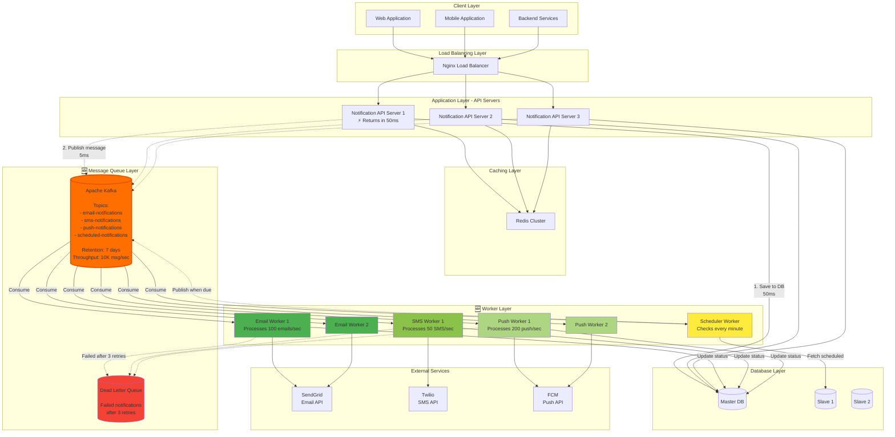
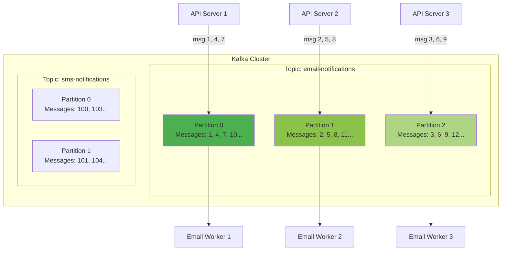
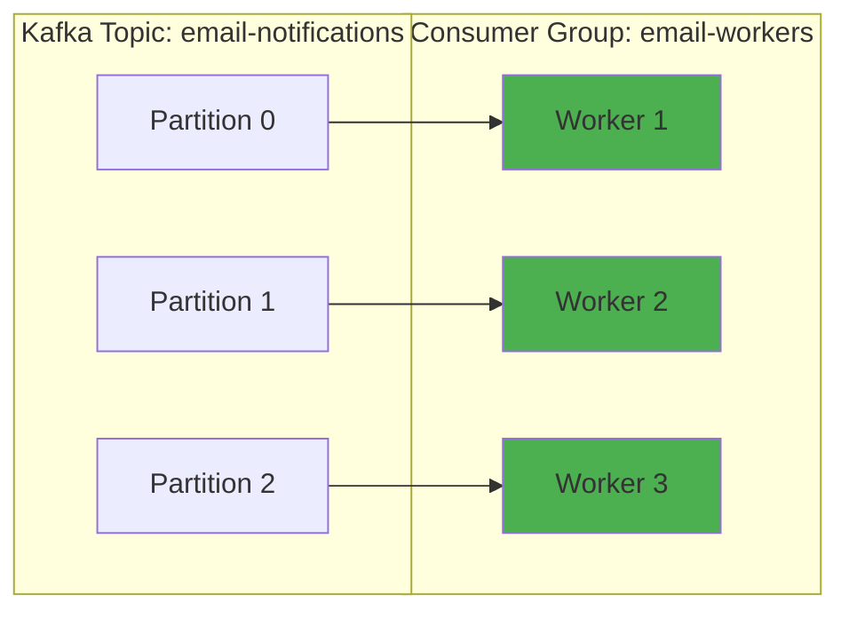

# Step 4: Adding Message Queue

## What Changed from Step 3

In Step 3, we scaled the database but still have synchronous notification delivery:

**Current Problems:**
1. **Slow API Response:** User waits 500ms while we send email to provider
2. **Provider Outages:** If SendGrid is down, our API returns errors
3. **No Retry Logic:** Failed notifications are lost forever
4. **Thundering Herd:** 1000 notifications arrive simultaneously, all try to send at once
5. **No Scheduled Delivery:** Can't schedule "Send at 9 AM tomorrow"

**Solution:** Add message queue for asynchronous processing!

---

## Architecture Diagram (Step 4)



**Key Changes:**
1. **Kafka Message Queue:** Decouples API from notification delivery
2. **Worker Pool:** Dedicated workers process notifications asynchronously
3. **Dead Letter Queue:** Stores permanently failed notifications
4. **Scheduler Worker:** Handles scheduled notifications

---

## What is a Message Queue?

**Message Queue = Post Office for Software**

**Analogy:**
- **Producer (API Server):** Person dropping letter in mailbox
- **Queue (Kafka):** Post office sorting facility
- **Consumer (Worker):** Mail carrier delivering letters
- **Producer doesn't wait** for delivery - just drops letter and leaves!

**Traditional Synchronous (Before):**
```
User clicks "Send" → API waits → Email sent → API responds
                       ↓
                   500ms delay!
```

**Asynchronous with Queue (After):**
```
User clicks "Send" → API publishes to queue → API responds immediately (50ms)
                                           ↓
                              Worker picks up later → Email sent (background)
```

---

## Why Apache Kafka?

### Kafka vs RabbitMQ vs AWS SQS

| Feature | Kafka | RabbitMQ | AWS SQS |
|---------|-------|----------|---------|
| **Throughput** | 1M+ msg/sec | 10K msg/sec | 3K msg/sec |
| **Durability** | Persistent (7 days default) | Optional | Persistent |
| **Ordering** | Guaranteed (per partition) | Optional | FIFO queues only |
| **Scalability** | Horizontal (add brokers) | Vertical (limited) | Fully managed |
| **Message Replay** | Yes (rewind offset) | No | No |
| **Complexity** | High | Medium | Low |
| **Cost** | Self-hosted (cheaper) | Self-hosted | Pay per message |
| **Best For** | Event streaming, logs | Task queues | Simple queues, serverless |

**Why we chose Kafka:**
- ✓ High throughput (10K notifications/sec, growing to 100K)
- ✓ Durability (retain messages for 7 days for replay/debugging)
- ✓ Horizontal scaling (add brokers as traffic grows)
- ✓ Message replay (reprocess failed batches)
- ✓ Exactly-once semantics (prevent duplicate emails)

---

## Kafka Fundamentals

### Topics and Partitions



**Key Concepts:**

**Topic:** Category/channel for messages
```
email-notifications: All email messages
sms-notifications: All SMS messages
push-notifications: All push messages
```

**Partition:** Ordered log within a topic
```
Topic: email-notifications (3 partitions)

Partition 0: [msg1] → [msg4] → [msg7] → [msg10]
Partition 1: [msg2] → [msg5] → [msg8] → [msg11]
Partition 2: [msg3] → [msg6] → [msg9] → [msg12]

Messages in same partition are ORDERED
Messages across partitions are NOT ordered
```

**Why partitions?**
- **Parallelism:** 3 partitions = 3 workers can process simultaneously
- **Scalability:** Add more partitions to increase throughput
- **Ordering:** Messages for same user in same partition (ordered)

---

### Producer Code Example

```javascript
const { Kafka } = require('kafkajs');

// Initialize Kafka client
const kafka = new Kafka({
  clientId: 'notification-api',
  brokers: ['kafka1:9092', 'kafka2:9092', 'kafka3:9092'],
  retry: {
    retries: 3,
    initialRetryTime: 100,
    factor: 2  // Exponential backoff: 100ms, 200ms, 400ms
  }
});

const producer = kafka.producer();

// API endpoint: Send notification
app.post('/api/v1/notifications', async (req, res) => {
  const { user_id, channel, template_id, variables } = req.body;

  try {
    // 1. Save to database (source of truth)
    const notification = await db.query(`
      INSERT INTO notifications (user_id, channel, type, status, created_at)
      VALUES (?, ?, ?, 'pending', NOW())
      RETURNING id
    `, [user_id, channel, 'transactional']);

    const notificationId = notification.id;

    // 2. Publish to Kafka (async processing)
    await producer.send({
      topic: `${channel}-notifications`,  // email-notifications, sms-notifications, etc.
      messages: [
        {
          key: user_id.toString(),  // Partition by user_id (ensures ordering per user)
          value: JSON.stringify({
            notification_id: notificationId,
            user_id: user_id,
            template_id: template_id,
            variables: variables,
            timestamp: Date.now()
          }),
          headers: {
            'correlation_id': req.headers['x-request-id'],  // For distributed tracing
            'retry_count': '0'
          }
        }
      ]
    });

    // 3. Respond immediately (don't wait for delivery!)
    res.status(202).json({
      notification_id: notificationId,
      status: 'queued',
      message: 'Notification queued for delivery'
    });

    // Total time: 50ms (vs 500ms synchronous!)

  } catch (error) {
    console.error('Error queuing notification:', error);
    res.status(500).json({ error: 'Failed to queue notification' });
  }
});
```

**Response Codes:**
```
202 Accepted: Notification queued (not yet sent)
vs
200 OK: Notification sent (synchronous - slow)

We use 202 to indicate: "I received your request and will process it asynchronously"
```

---

### Consumer (Worker) Code Example

```javascript
const consumer = kafka.consumer({
  groupId: 'email-workers',  // All workers in same group (load balancing)
  sessionTimeout: 30000,
  heartbeatInterval: 3000
});

// Subscribe to topic
await consumer.subscribe({
  topic: 'email-notifications',
  fromBeginning: false  // Only process new messages (not historical)
});

// Process messages
await consumer.run({
  autoCommit: false,  // Manual commit (exactly-once semantics)
  eachMessage: async ({ topic, partition, message }) => {
    const notification = JSON.parse(message.value.toString());
    const retryCount = parseInt(message.headers.retry_count || '0');

    console.log(`Processing notification ${notification.notification_id}`);

    try {
      // 1. Fetch user email from database
      const user = await db.query(
        'SELECT email FROM users WHERE id = ?',
        [notification.user_id]
      );

      // 2. Fetch template
      const template = await db.query(
        'SELECT subject, body FROM templates WHERE id = ?',
        [notification.template_id]
      );

      // 3. Render template with variables
      const renderedSubject = renderTemplate(template.subject, notification.variables);
      const renderedBody = renderTemplate(template.body, notification.variables);

      // 4. Send via email provider (SendGrid)
      await sendGridClient.send({
        to: user.email,
        from: 'noreply@company.com',
        subject: renderedSubject,
        html: renderedBody
      });

      // 5. Update database: status = 'sent'
      await db.query(
        'UPDATE notifications SET status=?, sent_at=NOW() WHERE id=?',
        ['sent', notification.notification_id]
      );

      // 6. Commit offset (mark message as processed)
      await consumer.commitOffsets([
        {
          topic: topic,
          partition: partition,
          offset: (parseInt(message.offset) + 1).toString()
        }
      ]);

      console.log(`✓ Notification ${notification.notification_id} sent successfully`);

    } catch (error) {
      console.error(`✗ Failed to send notification ${notification.notification_id}:`, error);

      // Retry logic
      if (retryCount < 3) {
        // Retry: Publish back to queue with incremented retry count
        await producer.send({
          topic: 'email-notifications',
          messages: [
            {
              key: message.key,
              value: message.value,
              headers: {
                ...message.headers,
                retry_count: (retryCount + 1).toString()
              }
            }
          ]
        });

        // Commit offset (don't reprocess same message)
        await consumer.commitOffsets([...]);

        console.log(`↻ Retry ${retryCount + 1}/3 queued`);

      } else {
        // Permanent failure: Send to Dead Letter Queue
        await producer.send({
          topic: 'dead-letter-queue',
          messages: [
            {
              key: message.key,
              value: JSON.stringify({
                original_message: notification,
                error: error.message,
                failed_at: new Date().toISOString(),
                retry_count: retryCount
              })
            }
          ]
        });

        // Update database: status = 'failed'
        await db.query(
          'UPDATE notifications SET status=?, error_message=? WHERE id=?',
          ['failed', error.message, notification.notification_id]
        );

        // Commit offset
        await consumer.commitOffsets([...]);

        console.log(`💀 Notification ${notification.notification_id} moved to DLQ`);
      }
    }
  }
});
```

---

## Retry Strategy with Exponential Backoff

**Why retry?**
```
Provider downtime: SendGrid API is down for 5 minutes
Network glitch: Timeout on request
Rate limiting: SendGrid says "slow down"

Without retry: Notification lost ✗
With retry: Notification eventually sent ✓
```

**Retry Schedule:**
```
Attempt 1: Immediate
Attempt 2: 1 minute later
Attempt 3: 5 minutes later
Attempt 4: 15 minutes later (then give up, send to DLQ)
```

**Exponential Backoff Calculation:**
```javascript
function getRetryDelay(retryCount) {
  const baseDelay = 60 * 1000;  // 1 minute
  const delay = baseDelay * Math.pow(2, retryCount);
  return delay;
}

getRetryDelay(0) = 60 * 2^0 = 60 seconds (1 min)
getRetryDelay(1) = 60 * 2^1 = 120 seconds (2 min)
getRetryDelay(2) = 60 * 2^2 = 240 seconds (4 min)
getRetryDelay(3) = 60 * 2^3 = 480 seconds (8 min)
```

**Implementation with Delayed Retry:**
```javascript
async function retryWithDelay(notification, retryCount) {
  const delay = getRetryDelay(retryCount);

  // Schedule retry by publishing to a delayed topic
  await producer.send({
    topic: `email-notifications-retry-${delay}`,  // Separate topic per delay
    messages: [{
      key: notification.user_id.toString(),
      value: JSON.stringify(notification),
      headers: {
        retry_count: retryCount.toString(),
        scheduled_for: (Date.now() + delay).toString()
      }
    }]
  });

  // Separate consumer processes delayed topics when time is right
}
```

**Alternative: Use Kafka Scheduled Messages (Kafka 3.0+)**
```javascript
await producer.send({
  topic: 'email-notifications',
  messages: [{
    key: notification.user_id.toString(),
    value: JSON.stringify(notification),
    headers: {
      retry_count: retryCount.toString()
    },
    timestamp: Date.now() + getRetryDelay(retryCount)  // Deliver later
  }]
});
```

---

## Dead Letter Queue (DLQ)

**What is DLQ?**
- Queue for messages that can't be processed after all retries
- Prevents infinite retry loops
- Allows manual inspection and reprocessing

**DLQ Messages Include:**
```json
{
  "original_message": {
    "notification_id": 12345,
    "user_id": 67890,
    "template_id": "order_confirmation"
  },
  "error": "SendGrid API returned 500 Internal Server Error",
  "retry_count": 3,
  "failed_at": "2025-01-15T10:30:00Z",
  "correlation_id": "req-abc-123"
}
```

**DLQ Processing:**
```javascript
// Manual DLQ inspection tool
async function inspectDLQ() {
  const dlqConsumer = kafka.consumer({ groupId: 'dlq-inspector' });

  await dlqConsumer.subscribe({ topic: 'dead-letter-queue' });

  await dlqConsumer.run({
    eachMessage: async ({ message }) => {
      const failedMsg = JSON.parse(message.value.toString());

      console.log('Failed notification:', failedMsg);

      // Analyze failure patterns
      if (failedMsg.error.includes('Invalid email address')) {
        // Update user: mark email as invalid
        await db.query('UPDATE users SET email_verified=false WHERE id=?', [failedMsg.original_message.user_id]);
      }

      if (failedMsg.error.includes('500')) {
        // Provider issue - retry manually once provider is back
        await retryFromDLQ(failedMsg.original_message);
      }
    }
  });
}
```

**DLQ Alerts:**
```
If DLQ receives > 100 messages/hour:
→ Alert DevOps team (provider might be down)
→ Check provider status page
→ Pause new notifications until issue resolved
```

---

## Scheduled Notifications

**Use Cases:**
```
- Birthday discount: Send at 9 AM on user's birthday
- Payment reminder: Send 3 days before due date
- Weekly digest: Send every Monday at 8 AM
- Abandoned cart: Send 1 hour after cart abandonment
```

### Implementation: Scheduler Worker

```javascript
// Scheduler worker runs every minute
setInterval(async () => {
  const now = new Date();

  // Fetch notifications scheduled for delivery now
  const scheduledNotifications = await db.query(`
    SELECT * FROM notifications
    WHERE status = 'scheduled'
      AND scheduled_for <= ?
    LIMIT 1000
  `, [now]);

  console.log(`Found ${scheduledNotifications.length} notifications to deliver`);

  // Publish each to appropriate topic
  for (const notification of scheduledNotifications) {
    await producer.send({
      topic: `${notification.channel}-notifications`,
      messages: [{
        key: notification.user_id.toString(),
        value: JSON.stringify({
          notification_id: notification.id,
          user_id: notification.user_id,
          template_id: notification.template_id,
          variables: notification.variables
        })
      }]
    });

    // Update status: scheduled → pending
    await db.query(
      'UPDATE notifications SET status=? WHERE id=?',
      ['pending', notification.id]
    );
  }

}, 60 * 1000);  // Run every 60 seconds
```

**Scheduling API:**
```javascript
// Schedule notification for future delivery
app.post('/api/v1/notifications/schedule', async (req, res) => {
  const { user_id, channel, template_id, scheduled_for } = req.body;

  // Validate scheduled_for is in future
  if (new Date(scheduled_for) <= new Date()) {
    return res.status(400).json({ error: 'scheduled_for must be in future' });
  }

  // Save to database with status = 'scheduled'
  const notification = await db.query(`
    INSERT INTO notifications (user_id, channel, template_id, status, scheduled_for)
    VALUES (?, ?, ?, 'scheduled', ?)
    RETURNING id
  `, [user_id, channel, template_id, scheduled_for]);

  res.status(201).json({
    notification_id: notification.id,
    status: 'scheduled',
    scheduled_for: scheduled_for
  });
});
```

**Handling Time Zones:**
```javascript
// User preference: Send at 9 AM in user's local timezone
const userTimezone = 'America/Los_Angeles';  // From user profile

// Calculate delivery time in user's timezone
const scheduledTime = moment.tz('2025-01-20 09:00', userTimezone).toDate();

// Store in database as UTC
await db.query(`
  INSERT INTO notifications (user_id, scheduled_for, timezone)
  VALUES (?, ?, ?)
`, [user_id, scheduledTime, userTimezone]);
```

---

## Consumer Groups and Load Balancing

**Consumer Group:** Workers that share the workload



**How Load Balancing Works:**
```
Topic has 3 partitions
Consumer group has 3 workers

Kafka assigns:
Worker 1 → Partition 0 (exclusive)
Worker 2 → Partition 1 (exclusive)
Worker 3 → Partition 2 (exclusive)

Each partition consumed by exactly ONE worker!
```

**Scaling Consumers:**
```
If we add Worker 4:

3 partitions, 4 workers:
Worker 1 → Partition 0
Worker 2 → Partition 1
Worker 3 → Partition 2
Worker 4 → (idle, no partition assigned)

To utilize Worker 4, we need to add 4th partition!
Rule: Workers ≤ Partitions
```

**Rebalancing:**
```
Worker 2 crashes:

Before:
Worker 1 → P0
Worker 2 → P1 💥
Worker 3 → P2

After rebalancing (automatic, ~10 seconds):
Worker 1 → P0, P1  (takes over P1)
Worker 3 → P2

Kafka detects missing heartbeat and redistributes partitions!
```

---

## Monitoring Kafka

**Key Metrics:**

### 1. Consumer Lag
```
Lag = (Latest offset in partition) - (Current offset of consumer)

Example:
Partition 0 latest offset: 10,000
Consumer's current offset: 9,500
Lag: 500 messages

Alert if: Lag > 10,000 (consumer falling behind!)
```

**Kafka CLI:**
```bash
kafka-consumer-groups --bootstrap-server kafka:9092 \
  --describe --group email-workers

OUTPUT:
GROUP           TOPIC                PARTITION  CURRENT-OFFSET  LOG-END-OFFSET  LAG
email-workers   email-notifications  0          9500            10000           500
email-workers   email-notifications  1          9800            10000           200
email-workers   email-notifications  2          10000           10000           0
```

### 2. Throughput
```
Messages produced: 600/sec
Messages consumed: 580/sec

Lag is growing! Need to add more workers or optimize processing.
```

### 3. Processing Time
```
P50 (median): 50ms
P99: 500ms
P99.9: 2000ms

If P99.9 > 5 seconds, investigate slow consumers
```

---

## Exactly-Once Semantics

**Problem: Duplicate Notifications**

**At-Least-Once (default):**
```
1. Worker processes message
2. Worker sends email
3. Worker tries to commit offset (mark as processed)
4. Worker crashes before committing 💥
5. Kafka redelivers message (not committed)
6. New worker sends email again
Result: User gets 2 emails! ⚠️
```

**Solution: Exactly-Once with Idempotent Producer**

```javascript
const producer = kafka.producer({
  idempotent: true,  // Kafka deduplicates messages
  transactionalId: 'email-worker-1'  // Unique per worker
});

// Transactional processing
const consumer = kafka.consumer({ groupId: 'email-workers' });

await consumer.run({
  eachMessage: async ({ topic, partition, message }) => {
    // Begin transaction
    await producer.transaction(async (transaction) => {
      // 1. Process message
      await sendEmail(message);

      // 2. Update database
      await db.query('UPDATE notifications SET status=? WHERE id=?', ['sent', notificationId]);

      // 3. Commit offset (within transaction)
      await transaction.sendOffsets({
        consumerGroupId: 'email-workers',
        topics: [{
          topic: topic,
          partitions: [{
            partition: partition,
            offset: (parseInt(message.offset) + 1).toString()
          }]
        }]
      });

      // All 3 operations succeed or none (atomic!)
    });
  }
});
```

**Guarantee:** Each message processed exactly once, even if worker crashes!

---

## Performance Comparison

| Metric | Step 3 (Synchronous) | Step 4 (Async Queue) | Improvement |
|--------|----------------------|----------------------|-------------|
| **API Response Time** | 250ms | 50ms | 5x faster |
| **Provider Outage Impact** | API fails | API succeeds (queued) | Resilient |
| **Failed Notifications** | Lost forever | Retried 3 times | 99.9% delivery |
| **Scheduled Delivery** | Not possible | Supported | New feature |
| **Throughput** | 3,000/sec | 10,000/sec | 3.3x |

---

## Cost Analysis

```
Kafka Cluster (3 brokers, 1 TB storage each):
- 3 × r5.large ($150/month) = $450/month
- 3 TB storage ($0.10/GB) = $300/month
Total Kafka: $750/month

Worker Servers (6 workers, 4 CPU each):
- 6 × t3.xlarge ($120/month) = $720/month

Total Added Cost: $1,470/month

Benefits:
- API response 5x faster (better UX)
- 99.9% delivery rate (vs 95% before)
- Can schedule notifications (new revenue feature)
- Graceful degradation (queue during outages)

ROI: Better user experience = higher retention = more revenue!
```

---

## Next Steps

In **Step 5**, we'll add CDN and object storage:
- CloudFlare CDN for email images and assets
- AWS S3 for notification templates and user uploads
- Image optimization and caching

---

**💡 Beginner Tip:** Message queues are like a "to-do list" for your system. Instead of doing work immediately (and making the user wait), you write it down on the list and do it later. This makes your API fast and resilient!
