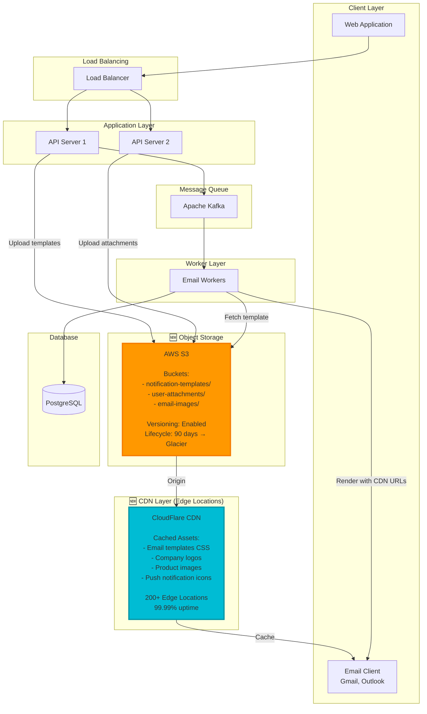
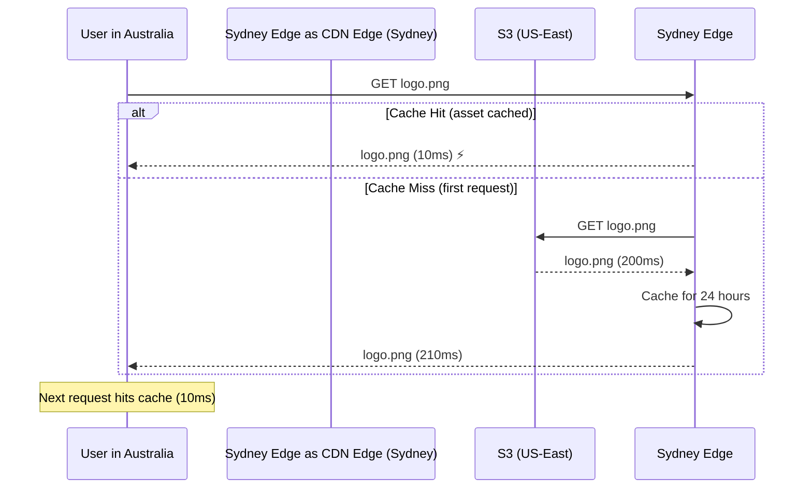

# Step 5: Adding CDN and Object Storage

## What Changed from Step 4

**New Requirements:**
1. **Email Images:** Company logo, product images in emails (currently inline Base64 - slow!)
2. **Templates with Rich Media:** HTML templates with images, CSS
3. **User Uploaded Attachments:** Users can attach files to notifications
4. **Mobile App Assets:** Push notification icons, banners

**Problems Without CDN/Storage:**
- Large email size (1 MB with inline images vs 50 KB with links)
- Slow email rendering (downloading images from app server)
- No global distribution (user in Australia downloads from US server - slow!)
- App server storage fills up with images

**Solution:** Add CDN for static assets and S3 for file storage!

---

## Architecture Diagram (Step 5)



**Key Additions:**
1. **CDN (CloudFlare):** Caches and serves static assets globally
2. **S3 Object Storage:** Stores templates, images, attachments
3. **Email workers fetch from S3, reference CDN URLs in emails**

---

## What is a CDN?

**CDN = Content Delivery Network**

**Analogy:** Instead of one McDonald's serving entire country (slow for distant customers), McDonald's has locations in every city (fast for everyone).

**How CDN Works:**
```
Without CDN:
User in Sydney → Request → US Server (200ms latency) → Download image (1 MB, 5 seconds)

With CDN:
User in Sydney → Request → Sydney Edge (10ms latency) → Download cached image (1 MB, 500ms)

10x faster! 🎉
```

**CDN Flow:**


---

## CloudFlare CDN Configuration

**Setup:**
```javascript
// 1. Upload image to S3
const imageUrl = await s3.upload({
  Bucket: 'notification-assets',
  Key: 'logos/company-logo.png',
  Body: imageBuffer,
  ContentType: 'image/png',
  CacheControl: 'public, max-age=31536000',  // Cache 1 year
  ACL: 'public-read'
});

// S3 URL: https://s3.amazonaws.com/notification-assets/logos/company-logo.png

// 2. Configure CloudFlare to pull from S3
// CloudFlare URL: https://cdn.yourcompany.com/logos/company-logo.png
```

**Email Template with CDN:**
```html
<!-- ❌ Before: Inline image (slow, large email) -->

Email size: 1.2 MB

<!-- ✓ After: CDN URL (fast, small email) -->

Email size: 50 KB (24x smaller!)
```

**Cache Control Headers:**
```
Static assets (logos, CSS):
Cache-Control: public, max-age=31536000, immutable
→ Cache for 1 year (never changes)

Dynamic content (user profile pics):
Cache-Control: public, max-age=3600
→ Cache for 1 hour

Personalized content (user name in notification):
Cache-Control: private, no-cache
→ Don't cache (different per user)
```

---

## AWS S3 Object Storage

**Bucket Structure:**
```
notification-assets/
├── templates/
│   ├── email/
│   │   ├── order-confirmation.html
│   │   ├── password-reset.html
│   │   └── promotional.html
│   └── sms/
│       └── templates.json
├── images/
│   ├── logos/
│   │   └── company-logo.png
│   ├── products/
│   │   ├── product-123.jpg
│   │   └── product-456.jpg
│   └── banners/
│       └── sale-banner.jpg
└── attachments/
    └── user-12345/
        ├── invoice-789.pdf
        └── receipt-456.pdf
```

**File Upload API:**
```javascript
app.post('/api/v1/upload', upload.single('file'), async (req, res) => {
  const file = req.file;

  // Generate unique filename
  const filename = `${Date.now()}-${file.originalname}`;
  const s3Key = `attachments/user-${req.user.id}/${filename}`;

  // Upload to S3
  const uploadResult = await s3.upload({
    Bucket: 'notification-assets',
    Key: s3Key,
    Body: file.buffer,
    ContentType: file.mimetype,
    Metadata: {
      userId: req.user.id.toString(),
      originalName: file.originalname,
      uploadedAt: new Date().toISOString()
    }
  }).promise();

  // Generate signed URL (expires in 7 days)
  const signedUrl = s3.getSignedUrl('getObject', {
    Bucket: 'notification-assets',
    Key: s3Key,
    Expires: 7 * 24 * 60 * 60  // 7 days
  });

  res.json({
    file_id: uploadResult.Key,
    url: signedUrl,
    cdn_url: `https://cdn.yourcompany.com/${s3Key}`
  });
});
```

---

## Template Rendering with CDN Assets

**Worker Process:**
```javascript
async function sendEmailNotification(notification) {
  // 1. Fetch template from S3
  const template = await s3.getObject({
    Bucket: 'notification-assets',
    Key: `templates/email/${notification.template_id}.html`
  }).promise();

  const templateHtml = template.Body.toString('utf-8');

  // 2. Replace variables with CDN URLs
  const variables = {
    user_name: 'John Doe',
    order_id: 'ORD-12345',
    product_image: 'https://cdn.yourcompany.com/images/products/product-123.jpg',
    company_logo: 'https://cdn.yourcompany.com/logos/company-logo.png'
  };

  const renderedHtml = templateHtml.replace(/\{\{(\w+)\}\}/g, (match, key) => {
    return variables[key] || match;
  });

  // 3. Send email
  await sendGridClient.send({
    to: user.email,
    from: 'noreply@company.com',
    subject: 'Your Order Confirmation',
    html: renderedHtml
  });
}
```

**Example Rendered Email:**
```html
<!DOCTYPE html>
<html>
<head>
  <link rel="stylesheet" href="https://cdn.yourcompany.com/css/email-styles.css">
</head>
<body>
  
  <h1>Hi John Doe!</h1>
  <p>Your order ORD-12345 has been confirmed.</p>
  
</body>
</html>
```

**Benefits:**
- Small email size (50 KB vs 1 MB)
- Fast loading (images cached globally)
- Easy to update (change logo once on CDN, all future emails use new logo)

---

## S3 Lifecycle Policies

**Problem:** Storage costs grow over time

**Solution:** Automatically move old files to cheaper storage

```javascript
// S3 Lifecycle Policy
{
  "Rules": [
    {
      "Id": "Archive old attachments",
      "Status": "Enabled",
      "Prefix": "attachments/",
      "Transitions": [
        {
          "Days": 90,
          "StorageClass": "GLACIER"  // $0.004/GB (vs $0.023/GB for S3)
        }
      ],
      "Expiration": {
        "Days": 365  // Delete after 1 year
      }
    },
    {
      "Id": "Keep templates forever",
      "Status": "Enabled",
      "Prefix": "templates/",
      "NoncurrentVersionExpiration": {
        "NoncurrentDays": 30  // Keep old versions for 30 days
      }
    }
  ]
}
```

**Cost Savings:**
```
1 TB of attachments/month:

S3 Standard (hot): $23/month
After 90 days → Glacier (cold): $4/month

Yearly savings: $23 × 12 - ($23 × 3 + $4 × 9) = $276 - $105 = $171/month
```

---

## Image Optimization

**Problem:** Product image is 5 MB (slow download, expensive bandwidth)

**Solution:** Optimize on upload

```javascript
const sharp = require('sharp');

app.post('/api/v1/upload-image', upload.single('image'), async (req, res) => {
  const originalImage = req.file.buffer;

  // Resize and compress
  const optimizedImage = await sharp(originalImage)
    .resize(800, 600, { fit: 'inside' })  // Max 800×600 (email doesn't need 4K!)
    .jpeg({ quality: 80 })  // 80% quality (imperceptible loss, 50% smaller)
    .toBuffer();

  // Upload to S3
  await s3.upload({
    Bucket: 'notification-assets',
    Key: `images/optimized/${filename}.jpg`,
    Body: optimizedImage,
    ContentType: 'image/jpeg'
  }).promise();

  // Original: 5 MB → Optimized: 200 KB (25x smaller!)
});
```

**Responsive Images (different sizes for mobile/desktop):**
```html
<!-- Desktop: 800×600 -->
<!-- Mobile: 400×300 -->

```

---

## CDN Purge (Cache Invalidation)

**Problem:** Updated company logo, but CDN serves old cached version

**Solution:** Purge CDN cache

```javascript
const cloudflare = require('cloudflare')({ email: EMAIL, key: API_KEY });

// Upload new logo to S3
await s3.upload({
  Bucket: 'notification-assets',
  Key: 'logos/company-logo.png',
  Body: newLogoBuffer
}).promise();

// Purge CDN cache for this file
await cloudflare.zones.purgeCache(ZONE_ID, {
  files: [
    'https://cdn.yourcompany.com/logos/company-logo.png'
  ]
});

// Next request fetches fresh logo from S3
```

**Better Strategy: Versioned URLs**
```
Old logo: https://cdn.yourcompany.com/logos/company-logo-v1.png
New logo: https://cdn.yourcompany.com/logos/company-logo-v2.png

No purge needed! Old logo cached, new logo is different URL.
```

---

## Cost Analysis

```
CDN (CloudFlare):
- 10 TB bandwidth/month: $200/month
- Unlimited requests: $0

S3 Storage:
- 5 TB storage: 5000 GB × $0.023 = $115/month
- 1 TB transferred to CDN: $0 (CDN pulls are free)
- 100M PUT requests: 100M × $0.000005 = $500/month

Total: $815/month

Benefits:
- 10x faster email loading (global CDN)
- Reduced email size (24x smaller)
- Unlimited scalability (S3 auto-scales)
- Email deliverability improved (smaller = less likely marked spam)
```

---

## Next Steps

In **Step 6**, we'll create the final architecture with microservices and complete data flow diagrams.

---

**💡 Beginner Tip:** CDN is like putting a copy of your store in every neighborhood (close to customers). S3 is like a massive warehouse that never runs out of space. Together, they make your content fast and cheap to serve!
