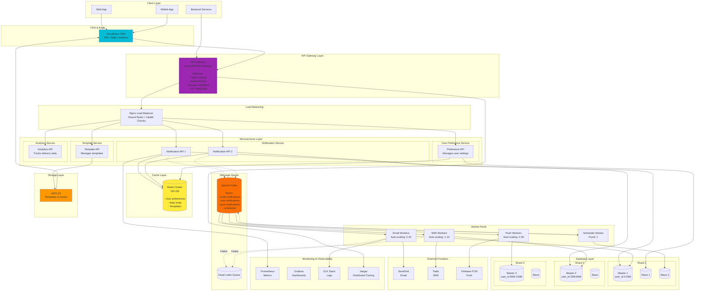

# Step 6: Final Architecture with Microservices

## Complete System Architecture



---

## Microservices Breakdown

### 1. Notification Service (Core)

**Responsibilities:**
- Receive notification requests
- Validate and enrich data
- Publish to message queue
- Track notification status

**API Endpoints:**
```
POST   /api/v1/notifications          - Send notification
POST   /api/v1/notifications/bulk     - Send bulk notifications
POST   /api/v1/notifications/schedule - Schedule notification
GET    /api/v1/notifications/:id      - Get notification status
DELETE /api/v1/notifications/:id      - Cancel scheduled notification
```

**Technology Stack:**
- Language: Node.js (async I/O)
- Framework: Express.js
- Database: PostgreSQL (sharded)
- Cache: Redis

---

### 2. User Preference Service

**Responsibilities:**
- Manage user notification preferences
- Handle opt-in/opt-out
- Quiet hours management
- Channel preferences

**API Endpoints:**
```
GET    /api/v1/preferences/:user_id   - Get user preferences
PUT    /api/v1/preferences/:user_id   - Update preferences
POST   /api/v1/preferences/unsubscribe - Unsubscribe from emails
```

**Cache-First Architecture:**
```javascript
async function getPreferences(userId) {
  // 1. Check Redis (hot cache)
  const cached = await redis.get(`pref:${userId}`);
  if (cached) return JSON.parse(cached);

  // 2. Query database
  const prefs = await db.query('SELECT * FROM user_preferences WHERE user_id=?', [userId]);

  // 3. Cache for 1 hour
  await redis.setex(`pref:${userId}`, 3600, JSON.stringify(prefs));

  return prefs;
}
```

---

### 3. Template Service

**Responsibilities:**
- Manage notification templates
- Version control for templates
- Template rendering
- Multi-language support

**API Endpoints:**
```
GET    /api/v1/templates              - List all templates
GET    /api/v1/templates/:id          - Get template
POST   /api/v1/templates              - Create template
PUT    /api/v1/templates/:id          - Update template
POST   /api/v1/templates/:id/render   - Render with variables
```

**Template Versioning:**
```
Template: order-confirmation
- v1: Created 2024-01-01 (old design)
- v2: Created 2024-06-01 (new branding) ← Active
- v3: Created 2025-01-01 (A/B test) ← Draft

Each notification stores template_version to ensure consistency
```

---

### 4. Analytics Service

**Responsibilities:**
- Track notification metrics
- Delivery rates
- Open rates (for emails)
- Click-through rates
- Cost per channel

**API Endpoints:**
```
GET    /api/v1/analytics/summary      - Overall stats
GET    /api/v1/analytics/user/:id     - User-specific stats
GET    /api/v1/analytics/channel/:ch  - Channel stats
POST   /api/v1/analytics/webhook      - Receive provider webhooks
```

**Metrics Tracked:**
```
- Total sent: 50M/day
- Delivery rate: 98.5%
- Open rate (email): 22%
- Click rate: 5%
- Bounce rate: 1.5%
- Cost per notification: $0.0015
```

---

## Inter-Service Communication

### Service-to-Service Authentication

**JWT Tokens:**
```javascript
// Notification Service calls Preference Service
const jwt = require('jsonwebtoken');

const token = jwt.sign(
  { service: 'notification-service', scope: 'read:preferences' },
  SECRET_KEY,
  { expiresIn: '5m' }
);

const response = await axios.get(
  'http://preference-service/api/v1/preferences/12345',
  { headers: { Authorization: `Bearer ${token}` } }
);
```

### Service Mesh (Advanced)

**Using Istio for inter-service communication:**
```yaml
# Service-to-service encryption (mTLS)
# Automatic retries
# Circuit breaker
# Load balancing

apiVersion: networking.istio.io/v1
kind: VirtualService
metadata:
  name: preference-service
spec:
  hosts:
  - preference-service
  http:
  - retries:
      attempts: 3
      perTryTimeout: 2s
    timeout: 10s
```

---

## API Gateway Features

### 1. Rate Limiting

**Per-User Limits:**
```
Free Tier: 100 req/hour
Pro Tier: 1,000 req/hour
Enterprise: 10,000 req/hour
```

**Configuration (Kong):**
```yaml
plugins:
  - name: rate-limiting
    config:
      minute: 100
      hour: 1000
      limit_by: consumer
      policy: redis
```

### 2. Authentication

**API Key:**
```
POST /api/v1/notifications
Headers:
  X-API-Key: sk_live_abc123def456
```

**OAuth 2.0:**
```
POST /oauth/token
grant_type=client_credentials
client_id=xyz123
client_secret=secret456

Response:
{
  "access_token": "eyJhbGc...",
  "expires_in": 3600
}
```

### 3. Request Validation

```javascript
// Gateway validates before routing to service
const schema = {
  user_id: { type: 'number', required: true },
  channel: { type: 'string', enum: ['email', 'sms', 'push'], required: true },
  template_id: { type: 'string', required: true }
};

// Invalid request rejected at gateway (doesn't reach service)
```

---

## Auto-Scaling Configuration

**Email Workers (Kubernetes HPA):**
```yaml
apiVersion: autoscaling/v2
kind: HorizontalPodAutoscaler
metadata:
  name: email-workers
spec:
  scaleTargetRef:
    apiVersion: apps/v1
    kind: Deployment
    name: email-workers
  minReplicas: 2
  maxReplicas: 20
  metrics:
  - type: Resource
    resource:
      name: cpu
      target:
        type: Utilization
        averageUtilization: 70
  - type: External
    external:
      metric:
        name: kafka_consumer_lag
      target:
        type: Value
        value: "1000"  # Scale if lag > 1000 messages
```

**Scaling Behavior:**
```
Normal load (600 notifications/sec):
- 2 email workers (handle 100 each = 200/sec capacity)

Black Friday (6,000 notifications/sec):
- Auto-scales to 20 workers (20 × 100 = 2,000/sec capacity)
- Kafka queue buffers excess temporarily
- Workers scale down after load decreases
```

---

## Disaster Recovery

### Multi-Region Setup

```
Primary Region: US-East
  - All services
  - 3 database shards (masters)
  - Kafka cluster

Secondary Region: EU-West
  - All services (standby)
  - 3 database replicas (read-only)
  - Kafka cluster (replication)

Tertiary Region: Asia-Pacific
  - API Gateway only (route to US-East or EU-West)
```

**Failover Plan:**
```
US-East datacenter fails:

1. DNS update: Point to EU-West (5 minutes)
2. Promote EU-West database replicas to masters (5 minutes)
3. Enable writes in EU-West (instant)
4. Reconfigure Kafka replication (5 minutes)

Total RTO (Recovery Time Objective): 15 minutes
RPO (Recovery Point Objective): 1 minute (replication lag)
```

---

## Summary of Evolution

| Step | Components Added | Key Benefit |
|------|------------------|-------------|
| **Step 1** | Basic API + DB | Functional system |
| **Step 2** | Redis cache | 75% less DB load |
| **Step 3** | DB replication + sharding | 3x capacity, HA |
| **Step 4** | Kafka + workers | Async, 5x faster API |
| **Step 5** | CDN + S3 | Global speed, low cost |
| **Step 6** | Microservices + API Gateway | Scalable architecture |

**Final System Capacity:**
- 100M users supported
- 10,000 notifications/sec (peak: 30,000/sec)
- 99.99% uptime
- < 50ms API latency
- 99.9% delivery rate

---

**💡 Key Takeaway:** We evolved from a simple monolith to a distributed microservices architecture, solving real problems at each step. Start simple, scale when needed!
