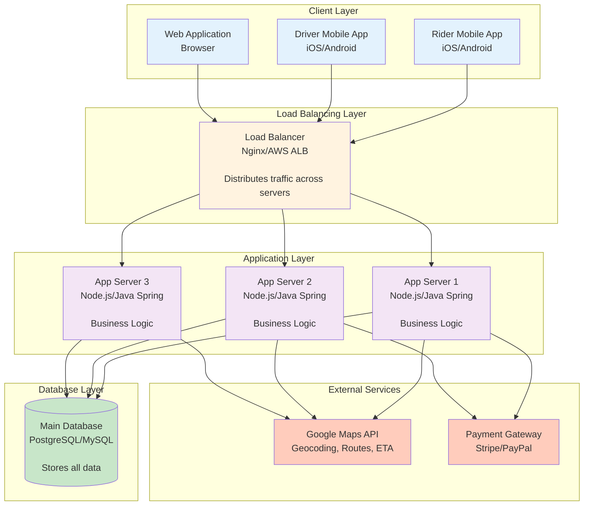

# Step 1: Basic Architecture - Foundation

## What We're Building in This Step

In this first step, we'll create the **simplest possible architecture** that can handle Uber's core functionality:
- Users can request rides
- Drivers can accept rides
- Basic data storage

Think of this as the **MVP (Minimum Viable Product)** - it works, but we'll optimize it in later steps.

---

## Architecture Diagram



---

## Components Explained (Simple Language)

### 1. Client Layer (User-Facing Apps)

**What It Is:**
- Mobile apps (iOS and Android) for riders and drivers
- Web application for desktop users

**What It Does:**
- Shows the map and available drivers
- Lets users input pickup/destination
- Displays fare estimates and ETA
- Handles user authentication (login/signup)

**Why It Matters:**
This is what users interact with. Good UX here = happy customers!

**Technology Choices:**
- **Rider App**: React Native (cross-platform iOS/Android)
- **Driver App**: React Native
- **Web App**: React.js
- **Maps**: Google Maps SDK / Mapbox

---

### 2. Load Balancer (Traffic Manager)

**What It Is:**
A "traffic cop" that distributes incoming requests across multiple application servers.

**Real-World Analogy:**
Think of it like a restaurant host who seats customers at different tables to balance the workload among waiters.

**What It Does:**
1. **Distributes Load**: Sends requests to different app servers (round-robin, least connections)
2. **Health Checks**: Monitors server health; if one server crashes, traffic goes to healthy servers
3. **SSL Termination**: Handles HTTPS encryption/decryption
4. **Rate Limiting**: Prevents abuse (blocks users making 1000s of requests)

**Why We Need It:**
- Single server can handle ~1000 requests/sec
- We need 60,000 req/sec (peak 180K)
- Load balancer enables horizontal scaling (add more servers as needed)

**Technology Choices:**
- **Nginx**: Open-source, battle-tested, handles 50K connections
- **HAProxy**: High performance, Layer 4/7 load balancing
- **AWS ALB (Application Load Balancer)**: Managed service, auto-scales
- **Google Cloud Load Balancer**: Global load balancing

**For Uber, We Choose:**
- **AWS ALB** - Managed, auto-scaling, integrates with AWS ecosystem

---

### 3. Application Servers (Business Logic)

**What It Is:**
Servers that run the core business logic of Uber.

**What It Does:**
- **Authentication**: Verify user login (JWT tokens)
- **Ride Matching**: Find nearby available drivers
- **Fare Calculation**: Distance × base rate + surge pricing
- **ETA Calculation**: Use Google Maps API to estimate time
- **Database Operations**: Read/Write user, driver, ride data
- **Payment Processing**: Charge riders, pay drivers

**Why Multiple Servers:**
- **High Availability**: If one server crashes, others handle traffic
- **Scalability**: Add more servers during peak hours
- **Stateless Design**: Each server can handle any request (no session stickiness)

**Key Design Principle: Stateless Servers**
```
❌ BAD (Stateful):
Server 1 stores user session in memory → if Server 1 crashes, session lost

✅ GOOD (Stateless):
Session stored in database/cache → any server can handle any request
```

**Technology Choices:**
- **Node.js**: Async I/O, great for real-time location updates
- **Java Spring Boot**: Enterprise-grade, robust, good for complex business logic
- **Python Django**: Rapid development, good for MVPs
- **Go**: High performance, low latency

**For Uber, We Choose:**
- **Node.js** for real-time services (location tracking)
- **Java Spring Boot** for critical services (payments, ride management)

**Server Specifications (Example):**
```
Instance Type: AWS EC2 m5.xlarge
- 4 vCPUs
- 16 GB RAM
- Can handle ~5000 requests/sec per server
- Need 180K / 5K = 36 servers for peak traffic
- Run 50 servers for 30% buffer
```

---

### 4. Database (Data Storage)

**What It Is:**
A relational database (SQL) that stores all persistent data.

**What It Stores:**
- **Users Table**: user_id, name, email, phone, payment_info
- **Drivers Table**: driver_id, name, license, vehicle, ratings
- **Rides Table**: ride_id, rider_id, driver_id, status, fare, route
- **Locations Table**: location_id, driver_id, latitude, longitude, timestamp

**Why SQL Database (Not NoSQL)?**
For this basic architecture, SQL is simpler and sufficient:

| Need | SQL Solution |
|------|--------------|
| ACID Transactions | ✅ Payments need strict consistency |
| Complex Queries | ✅ Joining rides with users and drivers |
| Data Integrity | ✅ Foreign keys ensure valid rider_id/driver_id |
| Mature Ecosystem | ✅ Well-understood, tons of tools |

**Technology Choices:**
- **PostgreSQL**: Advanced features, JSON support, PostGIS for geospatial queries
- **MySQL**: Popular, reliable, good performance

**For Uber, We Choose:**
- **PostgreSQL** with PostGIS extension for geospatial queries (find drivers within 5 km)

**Database Specifications (Example):**
```
Instance Type: AWS RDS db.r5.4xlarge
- 16 vCPUs
- 128 GB RAM
- 1 TB SSD storage
- Can handle ~10,000 queries/sec
```

---

### 5. External Services

#### Google Maps API
**What It Does:**
- **Geocoding**: Convert "123 Main St" → (lat: 37.7749, lng: -122.4194)
- **Routing**: Calculate best route from pickup to destination
- **ETA Calculation**: Estimate time based on traffic
- **Distance Calculation**: Calculate fare based on distance

**API Call Example:**
```
GET https://maps.googleapis.com/maps/api/directions/json?
  origin=37.7749,-122.4194&
  destination=37.8044,-122.2712&
  key=YOUR_API_KEY

Response:
{
  "distance": "15.2 km",
  "duration": "18 minutes",
  "polyline": "encoded_route_string"
}
```

#### Payment Gateway (Stripe/PayPal)
**What It Does:**
- Charge riders
- Transfer money to drivers
- Handle refunds for cancelled rides
- Support multiple payment methods (cards, wallets, Apple Pay)

---

## Data Flow: How a Ride Request Works (Step-by-Step)

Let's walk through what happens when a rider requests an Uber:

### Step 1: Rider Opens App
```
1. Rider opens app → Authenticates with JWT token
2. App requests rider's current location (GPS)
3. App shows map with nearby drivers
```

### Step 2: Rider Requests Ride
```
1. Rider enters destination "San Francisco Airport"
2. App sends request to Load Balancer:
   POST /api/v1/rides/estimate
   {
     "pickup": {"lat": 37.7749, "lng": -122.4194},
     "destination": {"lat": 37.6213, "lng": -122.3790}
   }
```

### Step 3: App Server Processes Request
```
1. App Server receives request
2. Calls Google Maps API → Get distance (20 km), ETA (25 min)
3. Calculates fare:
   Base fare: $2
   Per km: $1.50 × 20 km = $30
   Surge multiplier: 1.5x (peak hour)
   Total: ($2 + $30) × 1.5 = $48

4. Returns to rider:
   {
     "fare_estimate": 48,
     "eta": "25 min",
     "distance": "20 km"
   }
```

### Step 4: Rider Confirms Booking
```
1. Rider clicks "Request Uber"
2. App sends:
   POST /api/v1/rides
   {
     "rider_id": 12345,
     "pickup": {...},
     "destination": {...}
   }
```

### Step 5: Find Nearby Driver
```
1. App Server queries database:
   SELECT driver_id, latitude, longitude
   FROM drivers
   WHERE status = 'available'
   AND ST_DWithin(location, ST_MakePoint(37.7749, -122.4194), 5000)
   -- Find drivers within 5 km

2. Finds 3 drivers:
   - Driver A: 1.2 km away, ETA 3 min
   - Driver B: 2.5 km away, ETA 5 min
   - Driver C: 4.8 km away, ETA 8 min

3. Send ride request to Driver A (closest)
```

### Step 6: Driver Accepts
```
1. Driver A receives push notification
2. Driver clicks "Accept"
3. App Server updates database:
   UPDATE rides SET status='accepted', driver_id=123 WHERE ride_id=456
   UPDATE drivers SET status='on_ride' WHERE driver_id=123

4. Notify rider: "Driver found! Arriving in 3 minutes"
```

### Step 7: Real-Time Tracking
```
1. Driver's app sends location every 4 seconds:
   POST /api/v1/drivers/123/location
   {
     "lat": 37.7750,
     "lng": -122.4195,
     "timestamp": "2025-01-15T10:30:00Z"
   }

2. Rider's app polls for driver location:
   GET /api/v1/rides/456/driver-location
   Every 5 seconds

3. App Server returns:
   {
     "driver_location": {"lat": 37.7750, "lng": -122.4195},
     "eta_to_pickup": "2 min"
   }
```

### Step 8: Complete Ride
```
1. Driver clicks "Complete Ride"
2. App Server:
   - Updates ride status to 'completed'
   - Calculates final fare (actual distance may differ from estimate)
   - Charges rider via Stripe
   - Credits driver's account
   - Sends receipt to rider

3. Both rider and driver rate each other (1-5 stars)
```

---

## What This Architecture Can Handle

### Capacity
```
Load Balancer: 100K requests/sec
App Servers (50 servers): 50 × 5K = 250K requests/sec
Database: 10K queries/sec
```

**Our Requirement:**
- Peak traffic: 180K requests/sec ✅
- Database queries: ~30K/sec ❌ (bottleneck!)

### Identified Bottleneck: Database
The database can only handle 10K queries/sec, but we need 30K.

**Problems with Current Design:**
1. **Single Database**: If it crashes, entire system goes down (single point of failure)
2. **No Caching**: Every request hits database (slow, expensive)
3. **Write Bottleneck**: 1.32M location updates/sec will overwhelm database
4. **No Scalability**: Can't add more database capacity easily

---

## Trade-offs in This Design

### ✅ Pros (What's Good)
1. **Simple**: Easy to understand and implement
2. **Fast to Build**: Can launch MVP in 2-3 months
3. **Low Operational Complexity**: Few moving parts
4. **Cost-Effective**: Minimal infrastructure for startups
5. **ACID Guarantees**: Strong consistency for payments

### ❌ Cons (What's Missing)
1. **Single Point of Failure**: Database crash = system down
2. **Poor Performance**: High latency due to database bottleneck
3. **Not Scalable**: Can't handle 1.32M location updates/sec
4. **No Caching**: Repeated queries slow and expensive
5. **No Geographic Optimization**: US users hit same DB as Asia users (high latency)

---

## When to Use This Architecture

**Good For:**
- Startups / MVPs
- Low traffic (< 10K users)
- Single region deployment
- Budget constraints

**Not Good For:**
- Production Uber (millions of users)
- Real-time location tracking at scale
- Global deployment

---

## Design Decisions Summary

| Decision | Choice | Reason |
|----------|--------|--------|
| Load Balancer | AWS ALB | Managed, auto-scaling, integrates with AWS |
| App Servers | Node.js | Async I/O for real-time location updates |
| Database | PostgreSQL + PostGIS | ACID + geospatial queries |
| Maps | Google Maps API | Industry standard, accurate ETA |
| Payment | Stripe | Easy integration, PCI compliant |
| Deployment | AWS EC2 + RDS | Mature ecosystem, reliable |

---

## What's Next?

In **Step 2**, we'll address the biggest bottleneck by adding:
- **Redis Cache** to reduce database load by 60-80%
- Cache driver locations, ride data, user sessions

This will dramatically improve performance and reduce database queries from 30K/sec to ~6K/sec.

---

## Key Takeaways for Beginners

1. **Start Simple**: Don't over-engineer. This basic architecture works for small scale.
2. **Identify Bottlenecks**: Database is the bottleneck (10K queries/sec vs 30K needed).
3. **Stateless Servers**: App servers don't store state → easy to scale horizontally.
4. **Trade-offs**: Simplicity vs Scalability. For MVP, simplicity wins.
5. **Measure Everything**: Know your numbers (180K req/sec, 1.32M location updates/sec).

**Interview Tip:**
Always start with this basic architecture in interviews. Interviewers want to see your thought process - start simple, identify problems, then optimize iteratively. Don't jump straight to a complex microservices architecture!
