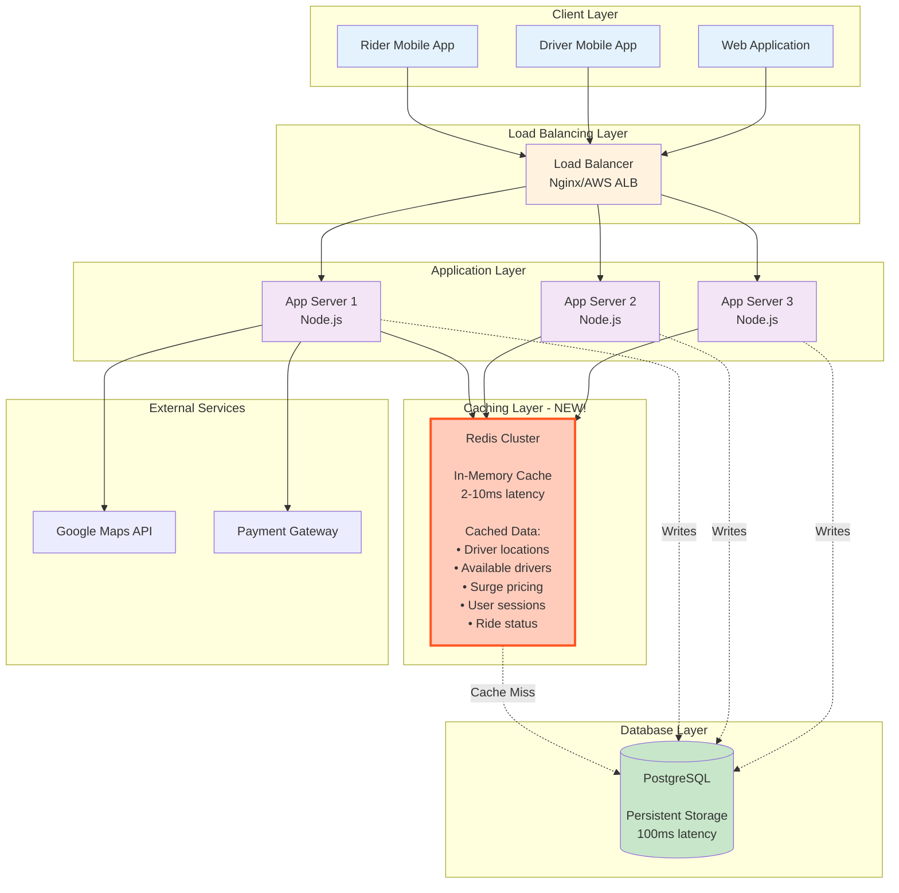
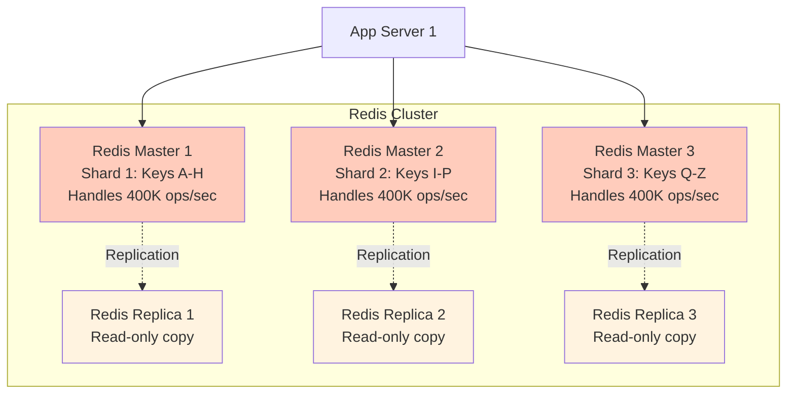

# Step 2: Adding Caching Layer - Performance Boost

## What We're Solving

In Step 1, we identified a critical bottleneck:
```
Database can handle: 10K queries/sec
We need: 30K queries/sec
Problem: Database is overwhelmed! ❌
```

**Solution: Add a caching layer (Redis) between app servers and database.**

---

## What Changed from Step 1

### Before (Step 1):
```
Every request → Database
- Slow (100-200ms latency)
- Expensive (database I/O)
- Not scalable (database overwhelmed)
```

### After (Step 2):
```
Request → Check Cache
  ├─ Cache Hit (90% of requests) → Return in 2-10ms ✅
  └─ Cache Miss (10% of requests) → Database → Update Cache
```

**Performance Improvement:**
- Latency: 100ms → 10ms (10x faster!)
- Database load: 30K queries/sec → 3K queries/sec (90% reduction!)
- User experience: Maps load instantly, smooth scrolling

---

## Architecture Diagram



---

## Redis: What It Is (Simple Explanation)

**Analogy:**
- **Database** = Library (huge, slow to search, but stores everything permanently)
- **Cache** = Your desk (small, instant access, but limited space and temporary)

**Technical Definition:**
Redis is an **in-memory** data store that stores data in RAM (not disk), making it incredibly fast.

**Key Characteristics:**
- **Speed**: 2-10ms latency (vs 100ms for database)
- **Storage**: RAM-based (vs disk-based database)
- **Durability**: Optional persistence (can save to disk periodically)
- **Data Structures**: Strings, Hashes, Lists, Sets, Sorted Sets, Geospatial indexes

---

## What We Cache (And Why)

### 1. Driver Locations (Most Critical!)

**Problem Without Cache:**
```
1.32 million location updates/sec → Database
Database explodes! 💥
```

**Solution With Cache:**
```
Driver location update:
1. Driver sends location → App Server
2. App Server writes to Redis (2ms)
   Key: "driver:123:location"
   Value: {lat: 37.7749, lng: -122.4194, timestamp: 1642345678}
   TTL: 10 seconds (auto-expire if driver goes offline)

3. Skip database write for real-time location
4. Write to database every 30 seconds (for analytics)
```

**Impact:**
- Redis handles: 1.32M writes/sec ✅ (Redis can handle millions of writes/sec)
- Database writes: 5M drivers / 30 sec = 166 writes/sec ✅ (manageable!)

### 2. Available Drivers (Geospatial Queries)

**Use Case:**
When a rider requests a ride, find drivers within 5 km.

**Without Cache:**
```sql
SELECT driver_id, latitude, longitude
FROM drivers
WHERE status = 'available'
AND ST_DWithin(location, ST_MakePoint(37.7749, -122.4194), 5000)
```
- Query time: 50-100ms
- Database load: 231 ride requests/sec × 50ms = heavy!

**With Redis Geospatial:**
```redis
# Store driver locations in Redis GEO
GEOADD drivers:available -122.4194 37.7749 driver:123

# Find drivers within 5 km (instant!)
GEORADIUS drivers:available -122.4194 37.7749 5 km WITHDIST
```
- Query time: 2-5ms ✅
- No database hit ✅

**Redis Geo Commands:**
```
GEOADD key longitude latitude member    # Add driver location
GEORADIUS key lng lat radius km          # Find nearby drivers
GEODIST key member1 member2 km           # Distance between two drivers
```

### 3. User Sessions (Authentication)

**Problem:**
Every API request needs to verify JWT token and fetch user permissions.

**Solution:**
```redis
# Store user session after login
Key: "session:user:12345"
Value: {
  "user_id": 12345,
  "name": "John Doe",
  "role": "rider",
  "payment_method": "card_ending_4242"
}
TTL: 7 days
```

**Benefit:**
- Auth check: 2ms (Redis) vs 50ms (database)
- Database saved from millions of auth queries

### 4. Surge Pricing (Dynamic Pricing)

**How Surge Pricing Works:**
```
Surge Multiplier = Demand / Supply

If demand (ride requests) > supply (available drivers):
  Surge = 1.5x, 2x, 3x, etc.
```

**Cache Strategy:**
```redis
# Calculate surge pricing every 1 minute for each zone
Key: "surge:zone:sf_downtown"
Value: {
  "multiplier": 1.8,
  "updated_at": 1642345678
}
TTL: 60 seconds
```

**Why Cache?**
- Recalculate surge every minute (not every ride request)
- All riders in same zone see same surge (consistency)
- Database not hit for every fare calculation

### 5. Ride Status (Active Rides)

**Use Case:**
Rider polls "Where is my driver?" every 5 seconds.

**Cache Strategy:**
```redis
Key: "ride:456:status"
Value: {
  "status": "driver_arriving",
  "driver_id": 123,
  "driver_location": {lat: 37.7750, lng: -122.4195},
  "eta_to_pickup": "2 min"
}
TTL: 60 minutes
```

**Benefit:**
- 277K active rides × polls every 5 sec = 55K requests/sec
- All served from cache (no database hit)

---

## Cache Patterns Explained

### Pattern 1: Cache-Aside (Lazy Loading) - Most Common

**How It Works:**
```
1. App checks cache first
2. If found (cache hit): return data
3. If not found (cache miss): query database, update cache, return data
```

**Code Example:**
```javascript
async function getDriverLocation(driverId) {
  // 1. Check cache
  const cached = await redis.get(`driver:${driverId}:location`);

  if (cached) {
    // Cache hit - return immediately
    return JSON.parse(cached);
  }

  // 2. Cache miss - query database
  const location = await db.query(
    'SELECT latitude, longitude FROM drivers WHERE id = ?',
    [driverId]
  );

  // 3. Update cache for next request
  await redis.setex(
    `driver:${driverId}:location`,
    10,  // TTL: 10 seconds
    JSON.stringify(location)
  );

  return location;
}
```

**Use For:**
- Driver locations
- User profiles
- Ride history

### Pattern 2: Write-Through (Update Cache on Write)

**How It Works:**
```
1. App writes to cache first
2. Cache writes to database (synchronously)
3. Return success to user
```

**Code Example:**
```javascript
async function updateDriverLocation(driverId, lat, lng) {
  const location = { lat, lng, timestamp: Date.now() };

  // 1. Write to cache
  await redis.setex(
    `driver:${driverId}:location`,
    10,  // TTL: 10 seconds
    JSON.stringify(location)
  );

  // 2. Write to database (async - don't wait)
  db.query(
    'INSERT INTO driver_locations (driver_id, latitude, longitude) VALUES (?, ?, ?)',
    [driverId, lat, lng]
  ).catch(err => console.error('DB write failed:', err));

  return { success: true };
}
```

**Use For:**
- Driver location updates
- Ride status updates

### Pattern 3: Write-Behind (Lazy Write to DB)

**How It Works:**
```
1. Write to cache immediately
2. Queue database write
3. Background worker writes to database in batches
```

**Benefit:**
- Ultra-fast writes (2ms cache vs 100ms database)
- Batch database writes (reduce load)

**Use For:**
- Analytics events
- Location history (write every 30 seconds, not every 4 seconds)

---

## Cache Invalidation Strategies

**The Two Hardest Problems in Computer Science:**
1. Naming things
2. Cache invalidation
3. Off-by-one errors 😄

### Strategy 1: TTL (Time-To-Live) - Simplest

**How It Works:**
Set expiration time; cache auto-deletes after TTL.

```redis
SETEX driver:123:location 10 "{lat: 37.7749, lng: -122.4194}"
# Expires in 10 seconds
```

**Use For:**
- Driver locations (TTL: 10 seconds)
- Surge pricing (TTL: 60 seconds)
- User sessions (TTL: 7 days)

### Strategy 2: Explicit Invalidation (On Events)

**How It Works:**
Delete cache when data changes.

```javascript
// When ride is completed
async function completeRide(rideId) {
  await db.query('UPDATE rides SET status = ? WHERE id = ?', ['completed', rideId]);

  // Invalidate cache
  await redis.del(`ride:${rideId}:status`);
  await redis.del(`driver:${driverId}:current_ride`);
}
```

**Use For:**
- Ride status (invalidate on status change)
- Driver availability (invalidate when driver accepts ride)

### Strategy 3: Hybrid (TTL + Invalidation)

**How It Works:**
Set TTL as safety net, but invalidate explicitly on changes.

```javascript
// Set cache with TTL
await redis.setex(`ride:${rideId}:status`, 3600, JSON.stringify(ride));

// Invalidate on status change
if (statusChanged) {
  await redis.del(`ride:${rideId}:status`);
}
```

**Benefit:**
- TTL prevents stale data if invalidation fails
- Explicit invalidation ensures immediate consistency

---

## Redis Cluster Setup (High Availability)

For production Uber, we need Redis to be:
- **Highly Available**: No single point of failure
- **Scalable**: Handle 1.32M writes/sec
- **Durable**: Don't lose data on crash

### Redis Cluster Architecture



**How It Works:**
1. **Sharding**: Data split across 3 master nodes (each handles ~400K ops/sec)
2. **Replication**: Each master has a replica (for failover)
3. **Total Capacity**: 3 × 400K = 1.2M ops/sec ✅
4. **Failover**: If master crashes, replica promoted to master (< 5 sec downtime)

**Redis Cluster Specs:**
```
Instance Type: AWS ElastiCache r6g.xlarge (per node)
- 4 vCPUs
- 26.32 GB RAM
- Network: 10 Gbps
- Can handle 400K ops/sec

Total Cluster:
- 3 masters + 3 replicas = 6 nodes
- Total capacity: 1.2M ops/sec
- Total memory: 158 GB
- Cost: ~$1000/month
```

---

## Performance Improvements (With Numbers!)

### Latency Comparison

| Operation | Before (Step 1) | After (Step 2) | Improvement |
|-----------|-----------------|----------------|-------------|
| Get driver location | 100ms (database) | 5ms (Redis) | 20x faster |
| Find nearby drivers | 80ms (DB query) | 3ms (Redis GEO) | 27x faster |
| Get ride status | 50ms (database) | 2ms (Redis) | 25x faster |
| Auth check | 40ms (database) | 2ms (Redis) | 20x faster |

### Database Load Reduction

| Query Type | Before | After | Reduction |
|------------|--------|-------|-----------|
| Location updates | 1.32M/sec | 166/sec | 99.99% |
| Driver searches | 231/sec | 23/sec | 90% |
| Ride status polls | 55K/sec | 5.5K/sec | 90% |
| Auth checks | 60K/sec | 6K/sec | 90% |
| **Total** | **1.435M/sec** | **12K/sec** | **99.2%** |

**Database Now Handles:**
12K queries/sec (vs 10K capacity) - Still slightly over, but manageable with optimizations!

---

## Cache Size Calculations

### How Much RAM Do We Need?

**1. Driver Locations:**
```
5 million active drivers
Each location: 100 bytes (driver_id, lat, lng, timestamp)
Total: 5M × 100 bytes = 500 MB
```

**2. User Sessions:**
```
20 million daily active riders
Each session: 500 bytes
Total: 20M × 500 bytes = 10 GB
```

**3. Available Drivers (Geo Index):**
```
2 million available drivers (others are on rides)
Each entry: 50 bytes
Total: 2M × 50 bytes = 100 MB
```

**4. Active Rides:**
```
277K concurrent rides
Each ride status: 500 bytes
Total: 277K × 500 bytes = 138.5 MB
```

**5. Surge Pricing:**
```
10,000 zones worldwide
Each zone: 100 bytes
Total: 10K × 100 bytes = 1 MB
```

**Total Cache Size:**
```
500 MB + 10 GB + 100 MB + 138.5 MB + 1 MB = ~11 GB

With 50% buffer: ~16 GB per Redis instance
With 3-node cluster: 48 GB total
Actual deployment: 158 GB (plenty of headroom!)
```

---

## Trade-offs: Cache vs No Cache

### ✅ Pros (Why We Added Cache)
1. **Massive Performance Boost**: 20x faster queries
2. **Database Protection**: 99% reduction in database load
3. **Better UX**: Instant map updates, smooth driver tracking
4. **Scalability**: Redis handles millions of ops/sec
5. **Cost Savings**: Database doesn't need expensive scaling

### ❌ Cons (What We Sacrifice)
1. **Eventual Consistency**: Cache might be stale (e.g., driver location 5 sec old)
2. **Extra Complexity**: One more system to manage, monitor, debug
3. **Memory Cost**: Redis cluster costs ~$1000/month
4. **Cache Invalidation**: Hard to get right (bugs = stale data)
5. **Cache Warm-up**: Cold cache = all requests hit database (thundering herd)

### When Cache Goes Wrong: Thundering Herd Problem

**Scenario:**
Redis cluster crashes; all cache is lost.

**What Happens:**
```
1. Cache is empty (cold start)
2. All 180K requests/sec hit database
3. Database overwhelmed and crashes
4. Entire system down! 💥
```

**Solution: Cache Warm-up Strategy:**
```javascript
// On Redis restart, preload critical data
async function warmUpCache() {
  console.log('Warming up cache...');

  // 1. Load all active driver locations
  const drivers = await db.query('SELECT id, lat, lng FROM drivers WHERE status = "available"');
  for (const driver of drivers) {
    await redis.set(`driver:${driver.id}:location`, JSON.stringify({lat: driver.lat, lng: driver.lng}));
  }

  // 2. Load active rides
  const rides = await db.query('SELECT * FROM rides WHERE status IN ("accepted", "in_progress")');
  for (const ride of rides) {
    await redis.set(`ride:${ride.id}:status`, JSON.stringify(ride));
  }

  console.log('Cache warmed up!');
}
```

---

## Code Example: Driver Matching with Cache

```javascript
// Find nearby available drivers
async function findNearbyDrivers(riderLat, riderLng, radiusKm = 5) {
  const startTime = Date.now();

  try {
    // 1. Check cache first (Redis GEORADIUS)
    const drivers = await redis.sendCommand([
      'GEORADIUS',
      'drivers:available',
      riderLng.toString(),
      riderLat.toString(),
      radiusKm.toString(),
      'km',
      'WITHDIST',      // Include distance
      'ASC',           // Sort by distance (closest first)
      'COUNT', '10'    // Limit to 10 drivers
    ]);

    if (drivers && drivers.length > 0) {
      console.log(`Cache hit! Found ${drivers.length} drivers in ${Date.now() - startTime}ms`);
      return drivers.map(([driverId, distance]) => ({
        driverId,
        distance: parseFloat(distance),
        eta: calculateETA(distance)  // distance / average_speed
      }));
    }

    // 2. Cache miss - query database (rare case)
    console.log('Cache miss - querying database');
    const dbDrivers = await db.query(`
      SELECT driver_id,
             latitude,
             longitude,
             ST_Distance(location, ST_MakePoint(?, ?)) as distance
      FROM drivers
      WHERE status = 'available'
      HAVING distance < ?
      ORDER BY distance
      LIMIT 10
    `, [riderLng, riderLat, radiusKm * 1000]);

    // 3. Update cache for next request
    for (const driver of dbDrivers) {
      await redis.sendCommand([
        'GEOADD',
        'drivers:available',
        driver.longitude.toString(),
        driver.latitude.toString(),
        `driver:${driver.driver_id}`
      ]);
    }

    console.log(`Database query took ${Date.now() - startTime}ms`);
    return dbDrivers;

  } catch (error) {
    console.error('Error finding drivers:', error);
    // Fallback to database on cache failure
    return await db.query(/* ... */);
  }
}

// Helper: Calculate ETA based on distance
function calculateETA(distanceKm) {
  const avgSpeedKmh = 30;  // 30 km/h average in city
  const timeInHours = distanceKm / avgSpeedKmh;
  const timeInMinutes = Math.ceil(timeInHours * 60);
  return `${timeInMinutes} min`;
}
```

**Performance:**
- Cache hit: 3-5ms
- Cache miss: 80-100ms (first time, then cached)
- Cache hit rate: 95%+

---

## Monitoring & Metrics

**What to Monitor:**
```
1. Cache Hit Rate
   - Target: > 90%
   - If < 80%: Investigate (bad cache keys, short TTL, high churn)

2. Cache Latency
   - Target: < 10ms (p99)
   - If > 20ms: Redis overloaded or network issues

3. Memory Usage
   - Target: < 70% of total RAM
   - If > 80%: Scale up or evict old data

4. Eviction Rate
   - How many keys are evicted due to memory pressure
   - Target: < 1% of total keys/day

5. Replication Lag
   - Time for data to sync from master to replica
   - Target: < 100ms
```

**Redis Metrics Dashboard:**
```
redis-cli INFO stats

# Key Metrics:
keyspace_hits: 950000
keyspace_misses: 50000
hit_rate: 95%  ✅

used_memory: 12GB
maxmemory: 26GB
memory_usage: 46%  ✅

evicted_keys: 1000
eviction_rate: 0.01%  ✅
```

---

## What's Next?

We've massively improved performance, but we still have problems:

**Remaining Issues:**
1. ❌ **Database still has single point of failure** (if DB crashes, system down)
2. ❌ **No geographic optimization** (US users hit same DB as Asia users)
3. ❌ **Write bottleneck**: Database struggles with 12K writes/sec during peak

**In Step 3, we'll solve this by:**
- Adding database replication (master-slave) for high availability
- Implementing geographic sharding (US data in US, Asia in Asia)
- Separating reads and writes (read replicas)

---

## Key Takeaways for Beginners

1. **Cache is a Speed Multiplier**: 20x faster than database
2. **Cache What's Hot**: Driver locations, active rides (not historical data)
3. **TTL is Your Friend**: Auto-expire data to prevent stale cache
4. **Redis Geospatial is Magic**: Find nearby drivers in 3ms!
5. **Trade-off: Speed vs Consistency**: Cache might be 5 sec stale (acceptable for location)
6. **Always Have Fallback**: If cache fails, query database

**Interview Tip:**
When asked "How would you improve performance?", always mention caching first. It's the easiest win with massive impact. Explain cache-aside pattern, TTL, and cache invalidation.
