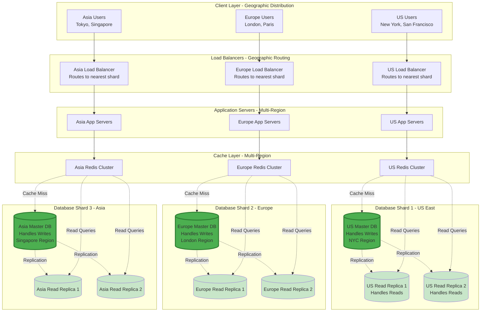
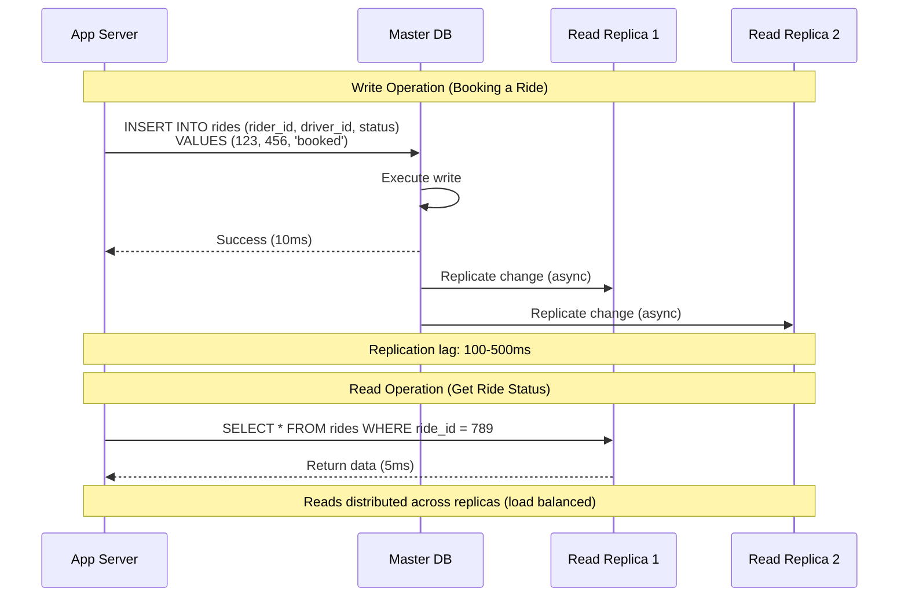
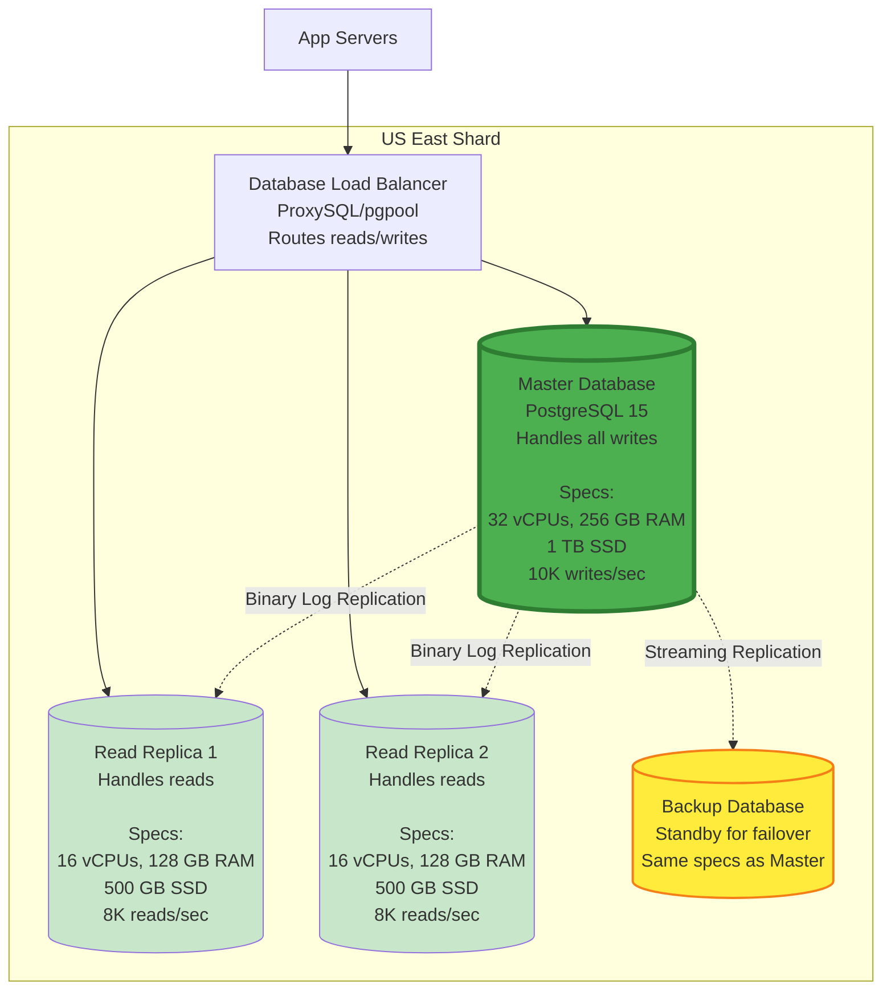
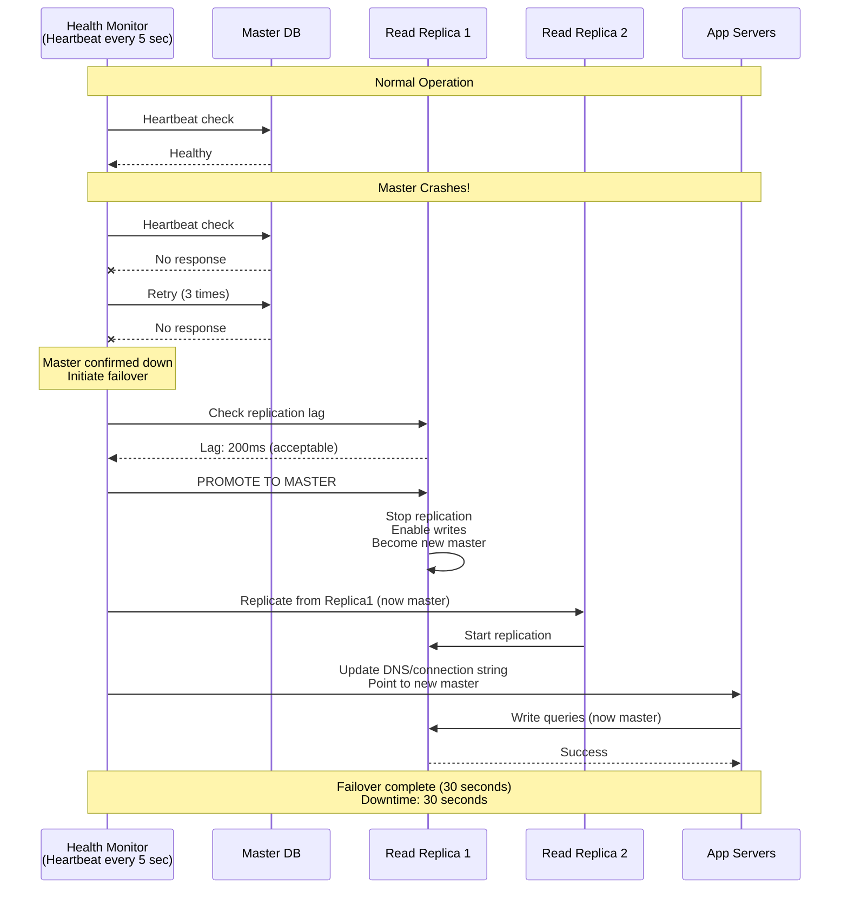
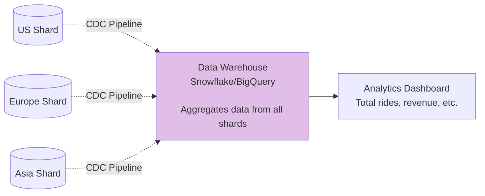

# Step 3: Database Scaling - Replication & Geographic Sharding

## What We're Solving

After adding Redis cache in Step 2, we still have critical database issues:

**Problems:**
1. ❌ **Single Point of Failure**: If database crashes, entire system goes down
2. ❌ **Geographic Latency**: User in Tokyo hits database in California (200ms latency)
3. ❌ **Read Bottleneck**: Database handles 12K queries/sec, but 90% are reads
4. ❌ **No Disaster Recovery**: Hardware failure = data loss

**Solutions in This Step:**
1. ✅ **Master-Slave Replication**: High availability + read scaling
2. ✅ **Geographic Sharding**: Data stored close to users
3. ✅ **Read Replicas**: Separate read and write traffic
4. ✅ **Automatic Failover**: < 30 seconds recovery from crashes

---

## What Changed from Step 2

### Before (Step 2):
```
Single Database
  ├─ Handles all reads and writes
  ├─ Single point of failure
  └─ Global users → single location (high latency)
```

### After (Step 3):
```
Geographic Shards (by city/region)
  ├─ US East: Master + 2 Read Replicas
  ├─ US West: Master + 2 Read Replicas
  ├─ Europe: Master + 2 Read Replicas
  ├─ Asia: Master + 2 Read Replicas
  └─ Each shard: Isolated, low latency, fault-tolerant
```

---

## Architecture Diagram



---

## Concept 1: Master-Slave Replication

### What It Is (Simple Explanation)

**Analogy:**
- **Master** = Main notebook where you write
- **Slave (Replica)** = Photocopies of the notebook for others to read

**Technical Definition:**
- **Master**: Handles all write operations (INSERT, UPDATE, DELETE)
- **Slave/Replica**: Read-only copy, handles read operations (SELECT)
- **Replication**: Master continuously syncs data to replicas

### How Replication Works (Step-by-Step)



### Benefits of Replication

**1. High Availability (No Single Point of Failure)**
```
Scenario: Master database crashes

Without Replication:
  Master crashes → Entire system down → 0% availability ❌

With Replication:
  Master crashes → Promote replica to master → 30 sec downtime → 99.99% availability ✅
```

**2. Read Scaling**
```
Single Master:
  - Handles 10K queries/sec
  - 90% reads = 9K read queries → bottleneck!

Master + 2 Replicas:
  - Master: 1K writes/sec
  - Replica 1: 4.5K reads/sec
  - Replica 2: 4.5K reads/sec
  - Total: 10K queries/sec distributed ✅
```

**3. Disaster Recovery**
```
Master data corruption or deletion:
  - Replicas have copy of data
  - Restore from replica backup
  - Data loss: 0-5 minutes (replication lag)
```

### Replication Lag (The Trade-off)

**What It Is:**
Time delay between master write and replica update.

**Example Scenario:**
```
Time 0ms:   Master writes: "Ride status = completed"
Time 100ms: Replica 1 syncs
Time 200ms: Replica 2 syncs

User polls ride status at 50ms:
  → Reads from Replica 1
  → Still shows "status = in_progress" (stale data!)
  → Eventually consistent after 100ms
```

**Is This a Problem for Uber?**

**Not Critical For:**
- Ride history (user doesn't care if last ride appears 1 sec late)
- Driver ratings (eventual consistency OK)
- Analytics dashboards

**Critical For:**
- Payment processing (must read from master after write)
- Ride status during active ride (use cache, not replica)

**Solution:**
```javascript
// Non-critical reads → replicas
const rides = await readReplica.query('SELECT * FROM rides WHERE rider_id = ?', [userId]);

// Critical reads (after write) → master
await master.query('INSERT INTO payments ...');
const payment = await master.query('SELECT * FROM payments WHERE id = ?', [paymentId]);
```

---

## Concept 2: Geographic Sharding (Data Partitioning)

### What It Is (Simple Explanation)

**Analogy:**
Instead of one giant library, have regional libraries (US library, Europe library, Asia library).

**Technical Definition:**
Split database into multiple independent shards based on geography/city.

**Why Geographic Sharding?**
1. **Low Latency**: Data stored close to users
2. **Data Locality**: 95% of rides are within the same city
3. **Compliance**: GDPR requires EU user data in EU
4. **Fault Isolation**: US shard crash doesn't affect Asia users

### Sharding Strategy for Uber

**Strategy: Shard by City/Region**

```
User's city determines which shard stores their data:
  - New York riders/drivers → US East shard
  - San Francisco riders/drivers → US West shard
  - London riders/drivers → Europe shard
  - Tokyo riders/drivers → Asia shard
```

**Shard Key: user_city_id**
```sql
-- User table includes city/region
CREATE TABLE users (
    user_id BIGINT PRIMARY KEY,
    email VARCHAR(255),
    city_id INT,  -- Determines shard!
    created_at TIMESTAMP
);

-- Routing logic
function getShardForUser(user) {
  const cityRegion = getCityRegion(user.city_id);

  if (cityRegion === 'us_east') return US_EAST_SHARD;
  if (cityRegion === 'us_west') return US_WEST_SHARD;
  if (cityRegion === 'europe') return EUROPE_SHARD;
  if (cityRegion === 'asia') return ASIA_SHARD;
}
```

### Sharding Example with Numbers

**Scenario: 100 million total users**

| Shard | Region | Users | Drivers | Daily Rides | Database Size |
|-------|--------|-------|---------|-------------|---------------|
| US East | New York, Boston | 30M | 3M | 6M | 120 TB |
| US West | San Francisco, LA | 20M | 2M | 4M | 80 TB |
| Europe | London, Paris, Berlin | 25M | 2.5M | 5M | 100 TB |
| Asia | Tokyo, Singapore, Mumbai | 25M | 2.5M | 5M | 100 TB |

**Benefits:**
- Each shard handles 25% of traffic (manageable!)
- US users: 10-20ms latency (vs 200ms to Asia datacenter)
- Fault isolation: Asia shard crash doesn't affect US users

### Cross-Shard Queries (The Challenge)

**Problem:**
What if a user travels from New York to London?

```
Scenario: US user requests Uber in London

User data: US East shard
London drivers: Europe shard

How to match US user with London driver? 🤔
```

**Solution 1: Temporary Multi-Shard Queries**
```javascript
async function findDriversForTraveler(userId, currentLat, currentLng) {
  // 1. Determine current location's shard
  const currentShard = getShardForLocation(currentLat, currentLng);

  // 2. Query current shard for drivers
  const drivers = await currentShard.query(
    'SELECT * FROM drivers WHERE ST_DWithin(...)'
  );

  // 3. Store temporary session data in current shard
  await currentShard.query(
    'INSERT INTO temporary_rides (user_id, pickup_lat, pickup_lng) VALUES (?, ?, ?)',
    [userId, currentLat, currentLng]
  );

  return drivers;
}
```

**Solution 2: Global Routing Service**
```
Create a lightweight routing service that:
  - Tracks user's current location in Redis
  - Routes queries to appropriate shard based on current location
  - Syncs ride data back to home shard after completion
```

---

## Database Configuration for Each Shard

### Shard Architecture (US East Example)



### Read/Write Routing Logic

**Automatic Routing with ProxySQL:**

```javascript
// App server doesn't know about replicas - ProxySQL handles routing

// Write queries → automatically routed to Master
await db.query('INSERT INTO rides (rider_id, driver_id) VALUES (?, ?)', [123, 456]);

// Read queries → automatically load-balanced across replicas
const rides = await db.query('SELECT * FROM rides WHERE rider_id = ?', [123]);

// ProxySQL configuration:
// - SELECT queries → replicas (round-robin)
// - INSERT/UPDATE/DELETE → master
// - BEGIN/COMMIT (transactions) → master
```

**Manual Routing (More Control):**

```javascript
// Explicitly use master connection for critical reads
const masterDB = getMasterConnection('us_east');
const replicaDB = getReplicaConnection('us_east');

// Write to master
await masterDB.query('UPDATE rides SET status = ? WHERE id = ?', ['completed', 456]);

// Read from master (strong consistency needed)
const payment = await masterDB.query('SELECT * FROM payments WHERE ride_id = ?', [456]);

// Read from replica (eventual consistency OK)
const rideHistory = await replicaDB.query('SELECT * FROM rides WHERE rider_id = ?', [123]);
```

---

## Failover Strategy (When Master Crashes)

### Automatic Failover Process



### Failover Checklist

**1. Detection (5-10 seconds)**
```
Health check fails 3 times → Master declared down
```

**2. Promotion (10 seconds)**
```
- Choose replica with lowest replication lag
- Promote replica to master (enable writes)
- Update other replicas to replicate from new master
```

**3. DNS Update (10 seconds)**
```
- Update DNS: master.us-east.uber.db → new-master-ip
- Update connection pools in app servers
- TTL: 5 seconds (fast propagation)
```

**4. Verification (5 seconds)**
```
- Test write query to new master
- Verify replication is working
- Alert ops team
```

**Total Downtime: 30 seconds** (99.99% availability = 52 min/year → this is acceptable!)

---

## Sharding Trade-offs & Challenges

### ✅ Pros (Why We Do It)
1. **Low Latency**: Data close to users (10ms vs 200ms)
2. **Horizontal Scalability**: Add more shards as you grow
3. **Fault Isolation**: One shard failure doesn't affect others
4. **Compliance**: GDPR, data residency laws
5. **Distributed Load**: No single database overwhelmed

### ❌ Cons (What Gets Harder)
1. **Cross-Shard Queries**: Joining data across shards is complex
2. **Transactions**: Can't do distributed transactions easily
3. **Operational Complexity**: Manage 10+ database clusters
4. **Data Migration**: Moving users between shards is hard
5. **Global Features**: Leaderboards, global search require aggregation

### Challenge: Cross-Shard Analytics

**Problem:**
CEO wants report: "Total rides globally today?"

```
Need to query all shards:
  US East: 6M rides
  US West: 4M rides
  Europe: 5M rides
  Asia: 5M rides
  Total: 20M rides
```

**Solution: Data Warehouse / Analytics Pipeline**



**CDC (Change Data Capture):**
- Captures all database changes in real-time
- Streams to data warehouse (Kafka → Snowflake)
- No impact on production databases
- Analytics queries run on warehouse (not production!)

---

## Performance Improvements (Step 2 → Step 3)

### Latency Comparison

| User Location | Before (Single DB) | After (Geo Sharding) | Improvement |
|---------------|-------------------|---------------------|-------------|
| New York → US East DB | 10ms | 5ms | 2x faster |
| London → US DB | 200ms | 8ms (EU shard) | 25x faster |
| Tokyo → US DB | 250ms | 10ms (Asia shard) | 25x faster |

### Availability Comparison

| Scenario | Before (No Replication) | After (Master + Replicas) |
|----------|-------------------------|---------------------------|
| Master DB crashes | 100% downtime | 30 sec downtime (0.0003% downtime) |
| Replica crashes | N/A | No downtime (other replicas handle reads) |
| Entire datacenter down | 100% downtime | Multi-region failover (5 min downtime) |

### Scalability Comparison

| Metric | Before | After |
|--------|--------|-------|
| Max queries/sec | 10K (single DB) | 40K (4 shards × 10K) |
| Read capacity | 10K/sec | 64K/sec (4 shards × 2 replicas × 8K) |
| Write capacity | 10K/sec | 40K/sec (4 shards × 10K) |

---

## Database Costs (Rough Estimate)

### Per Shard (US East Example)

```
Master Database (db.r6g.8xlarge):
  - 32 vCPUs, 256 GB RAM
  - Cost: $3,000/month

Read Replica 1 (db.r6g.4xlarge):
  - 16 vCPUs, 128 GB RAM
  - Cost: $1,500/month

Read Replica 2 (db.r6g.4xlarge):
  - Cost: $1,500/month

Backup Database (db.r6g.8xlarge):
  - Cost: $3,000/month

Total per shard: $9,000/month
```

### Total for 4 Shards

```
4 shards × $9,000 = $36,000/month

Additional costs:
  - Storage: $5,000/month (600 TB × $0.10/GB)
  - Backups: $3,000/month (automated backups, point-in-time recovery)
  - Data transfer: $2,000/month (cross-AZ replication)

Total database infrastructure: $46,000/month
```

**For a company doing $1B in revenue, this is 0.055% of revenue → totally acceptable!**

---

## Code Example: Sharding Router

```javascript
// Shard routing service
class ShardRouter {
  constructor() {
    this.shards = {
      us_east: createDBConnection('us-east-master.uber.db'),
      us_west: createDBConnection('us-west-master.uber.db'),
      europe: createDBConnection('europe-master.uber.db'),
      asia: createDBConnection('asia-master.uber.db')
    };

    this.cityToShard = {
      'new_york': 'us_east',
      'boston': 'us_east',
      'san_francisco': 'us_west',
      'los_angeles': 'us_west',
      'london': 'europe',
      'paris': 'europe',
      'tokyo': 'asia',
      'singapore': 'asia'
    };
  }

  // Get shard for a user based on their city
  getShardForUser(userId) {
    // First check cache for user's home shard
    const cachedShard = redis.get(`user:${userId}:shard`);
    if (cachedShard) return this.shards[cachedShard];

    // If not cached, query routing table (small DB with just user -> shard mapping)
    const user = routingDB.query('SELECT city FROM users WHERE id = ?', [userId]);
    const shardName = this.cityToShard[user.city] || 'us_east';  // default fallback

    // Cache for next time
    redis.setex(`user:${userId}:shard`, 86400, shardName);  // 24 hour TTL

    return this.shards[shardName];
  }

  // Get shard based on geolocation (for travelers)
  getShardForLocation(latitude, longitude) {
    // Simple geo-fence logic (production would use more sophisticated algorithm)
    if (latitude >= 24 && latitude <= 50 && longitude >= -125 && longitude <= -65) {
      // North America
      return longitude < -95 ? this.shards.us_west : this.shards.us_east;
    } else if (latitude >= 35 && latitude <= 70 && longitude >= -10 && longitude <= 40) {
      // Europe
      return this.shards.europe;
    } else {
      // Asia/rest of world
      return this.shards.asia;
    }
  }

  // Execute query on correct shard
  async executeQuery(userId, query, params) {
    const shard = this.getShardForUser(userId);
    return await shard.query(query, params);
  }
}

// Usage in application
const router = new ShardRouter();

// Book a ride (automatically routes to correct shard)
async function bookRide(riderId, driverId, pickup, destination) {
  const shard = router.getShardForUser(riderId);

  const result = await shard.query(
    'INSERT INTO rides (rider_id, driver_id, pickup_lat, pickup_lng, dest_lat, dest_lng) VALUES (?, ?, ?, ?, ?, ?)',
    [riderId, driverId, pickup.lat, pickup.lng, destination.lat, destination.lng]
  );

  return result.insertId;
}

// Get ride history (reads from correct shard's replica)
async function getRideHistory(riderId) {
  const shard = router.getShardForUser(riderId);
  const replica = shard.getReadReplica();  // Load-balanced replica

  const rides = await replica.query(
    'SELECT * FROM rides WHERE rider_id = ? ORDER BY created_at DESC LIMIT 20',
    [riderId]
  );

  return rides;
}
```

---

## What's Next?

Our database is now highly available and geographically optimized, but we still have synchronous bottlenecks:

**Remaining Issues:**
1. ❌ **Blocking Operations**: Sending emails, push notifications blocks API response
2. ❌ **No Event-Driven Architecture**: Services are tightly coupled
3. ❌ **Payment Processing**: Synchronous payment calls slow down ride completion
4. ❌ **Analytics**: Heavy analytics queries impact production database

**In Step 4, we'll solve this by:**
- Adding Kafka message queue for asynchronous operations
- Implementing event-driven architecture (pub-sub pattern)
- Decoupling services (ride service, payment service, notification service)
- Background workers for non-critical tasks

---

## Key Takeaways for Beginners

1. **Replication = High Availability**: Master-slave replication eliminates single point of failure
2. **Read Replicas = Read Scaling**: Separate reads (90%) from writes (10%)
3. **Geographic Sharding = Low Latency**: Store data close to users (200ms → 10ms)
4. **Failover is Automatic**: 30 seconds downtime on master failure (acceptable!)
5. **Trade-off: Complexity vs Performance**: Sharding is complex but necessary for global scale
6. **Replication Lag is Real**: Eventual consistency (100-500ms lag) - design around it

**Interview Tip:**
When asked "How do you scale a database?", mention both vertical scaling (bigger server) and horizontal scaling (sharding). Always discuss replication for high availability first, then sharding for geographic distribution. Explain the trade-offs clearly!
