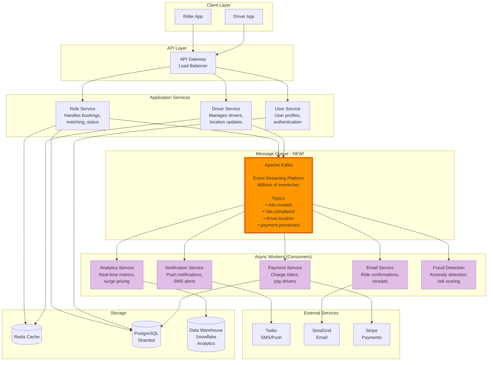
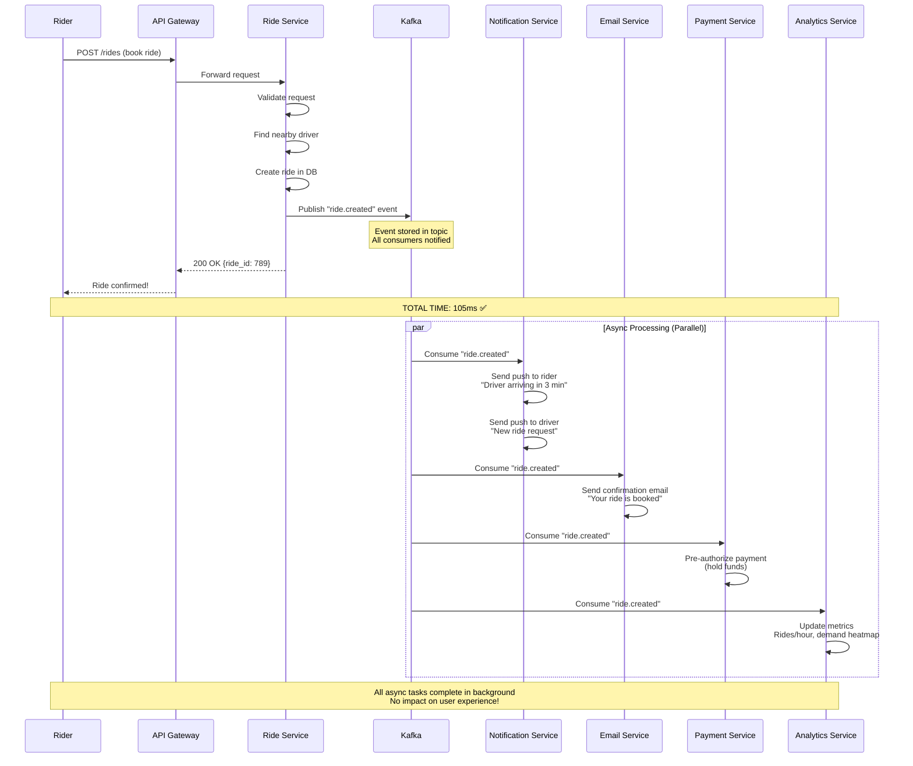
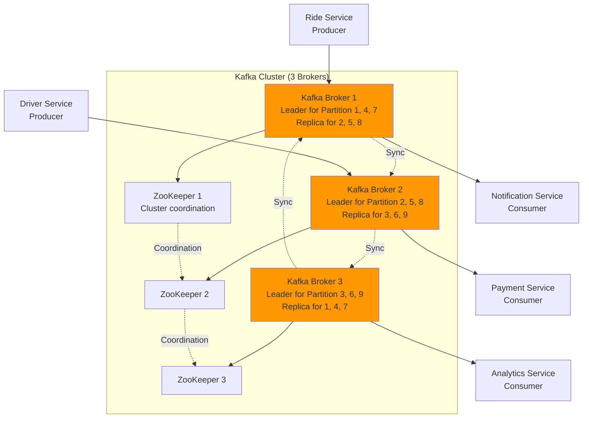

# Step 4: Adding Message Queue - Asynchronous & Event-Driven Architecture

## What We're Solving

After Step 3, our system is scalable and highly available, but we have synchronous bottlenecks:

**Problems:**
1. ❌ **Blocking Operations**: Sending email confirmation blocks API response (200ms penalty)
2. ❌ **Tight Coupling**: Payment service failure crashes entire ride booking flow
3. ❌ **No Retry Mechanism**: Failed push notification = lost forever
4. ❌ **Heavy Analytics**: Real-time analytics queries slow down production database

**Solutions in This Step:**
1. ✅ **Asynchronous Processing**: Non-critical tasks don't block user response
2. ✅ **Service Decoupling**: Services communicate via events (not direct API calls)
3. ✅ **Retry & Reliability**: Failed tasks automatically retry
4. ✅ **Event-Driven Architecture**: Pub-Sub pattern for scalability

---

## What Changed from Step 3

### Before (Step 3): Synchronous Flow
```
User books ride
  ↓
Create ride in DB (100ms)
  ↓
Send push notification (200ms) ← BLOCKS USER
  ↓
Send email confirmation (300ms) ← BLOCKS USER
  ↓
Update analytics DB (150ms) ← BLOCKS USER
  ↓
Return response to user (TOTAL: 750ms) ❌
```

### After (Step 4): Asynchronous Flow
```
User books ride
  ↓
Create ride in DB (100ms)
  ↓
Publish event to Kafka (5ms)
  ↓
Return response to user (TOTAL: 105ms) ✅ 7x faster!

Meanwhile (asynchronously):
  Event → Notification Service → Send push (200ms)
  Event → Email Service → Send email (300ms)
  Event → Analytics Service → Update analytics (150ms)
  Event → Payment Service → Process payment (500ms)
```

---

## Architecture Diagram



---

## What is Kafka? (Simple Explanation)

### Analogy: Newspaper Publishing

**Traditional Approach (Synchronous):**
```
Writer writes article
  ↓
Calls every subscriber directly (1000 phone calls!)
  ↓
Waits for each person to answer
  ↓
Takes forever! ❌
```

**Kafka Approach (Pub-Sub):**
```
Writer writes article
  ↓
Publishes to newspaper (Kafka)
  ↓
Newspaper available at newsstand
  ↓
Subscribers read when convenient
  ↓
Writer doesn't wait! ✅
```

### Technical Definition

**Apache Kafka:**
- Distributed event streaming platform
- Pub-Sub messaging system
- Handles millions of messages per second
- Stores events durably (retention period: 7 days default)
- Guarantees message ordering within a partition

**Key Concepts:**

**1. Topic = Category of Events**
```
Topic: "ride.created"
Contains: All ride creation events

Topic: "payment.completed"
Contains: All payment completion events
```

**2. Producer = Service that Publishes Events**
```
Ride Service publishes "ride.created" event
Payment Service publishes "payment.completed" event
```

**3. Consumer = Service that Subscribes to Events**
```
Notification Service subscribes to "ride.created"
Analytics Service subscribes to "ride.created"
Email Service subscribes to "ride.created"
```

**4. Partition = Parallelism Unit**
```
Topic "ride.created" has 10 partitions
→ 10 consumers can process events in parallel
→ Higher throughput!
```

---

## Kafka Topics for Uber

### Topic Design Strategy

```
Topic Naming Convention: <entity>.<event>

Examples:
- ride.created
- ride.accepted
- ride.started
- ride.completed
- ride.cancelled
- driver.location.updated
- payment.initiated
- payment.completed
- payment.failed
- user.registered
- surge.pricing.updated
```

### Topic Configuration

```javascript
// Topic: ride.created
{
  topic: "ride.created",
  partitions: 20,              // Parallel processing
  replication_factor: 3,       // High availability
  retention_ms: 604800000,     // 7 days retention
  compression: "snappy"        // Compress events
}

// Event Schema (JSON)
{
  "event_id": "evt_123456",
  "event_type": "ride.created",
  "timestamp": "2025-01-15T10:30:00Z",
  "data": {
    "ride_id": 789,
    "rider_id": 123,
    "driver_id": 456,
    "pickup": {
      "lat": 37.7749,
      "lng": -122.4194,
      "address": "123 Main St, San Francisco"
    },
    "destination": {
      "lat": 37.8044,
      "lng": -122.2712,
      "address": "456 Oak Ave, Oakland"
    },
    "fare_estimate": 48.00,
    "status": "accepted"
  }
}
```

---

## Use Case 1: Ride Creation Flow (Event-Driven)

### Sequence Diagram



---

## Use Case 2: Surge Pricing (Real-Time Analytics)

**How Surge Pricing Works:**
```
Every 1 minute:
1. Count ride requests in each zone (demand)
2. Count available drivers in each zone (supply)
3. Calculate surge multiplier:

   If demand > supply:
     surge = min(demand / supply, 3.0)  // Cap at 3x
   Else:
     surge = 1.0  // No surge
```

### Implementation with Kafka Streams

```javascript
// Kafka Streams: Real-time aggregation
const { KafkaStreams } = require('kafka-streams');

const stream = new KafkaStreams({
  kafkaHost: 'kafka.uber.internal:9092'
});

// Aggregate ride requests per zone (1-minute window)
stream
  .from('ride.created')
  .map(event => ({
    zone_id: getZoneId(event.data.pickup.lat, event.data.pickup.lng),
    timestamp: event.timestamp
  }))
  .window({
    type: 'tumbling',      // Non-overlapping windows
    duration: 60000        // 1 minute window
  })
  .groupBy('zone_id')
  .count()
  .to('demand.per.zone'); // Output topic

// Aggregate available drivers per zone
stream
  .from('driver.status.updated')
  .filter(event => event.data.status === 'available')
  .map(event => ({
    zone_id: getZoneId(event.data.lat, event.data.lng),
    driver_id: event.data.driver_id
  }))
  .groupBy('zone_id')
  .count()
  .to('supply.per.zone'); // Output topic

// Calculate surge pricing
stream
  .join(
    stream.from('demand.per.zone'),
    stream.from('supply.per.zone'),
    'zone_id'
  )
  .map(([demand, supply]) => ({
    zone_id: demand.zone_id,
    surge_multiplier: demand.count > supply.count
      ? Math.min(demand.count / supply.count, 3.0)
      : 1.0,
    timestamp: Date.now()
  }))
  .to('surge.pricing.updated');

// Consumers: Update Redis cache with latest surge pricing
surgeConsumer.subscribe('surge.pricing.updated');
surgeConsumer.on('message', async (event) => {
  await redis.setex(
    `surge:zone:${event.zone_id}`,
    120,  // 2 min TTL
    JSON.stringify({ multiplier: event.surge_multiplier })
  );

  console.log(`Zone ${event.zone_id}: Surge ${event.surge_multiplier}x`);
});
```

---

## Use Case 3: Payment Processing (Retry Logic)

**Problem:**
Payment API (Stripe) sometimes fails (network issue, rate limit, etc.)

**Without Kafka:**
```
Payment fails → Error to user → Manual retry → Bad UX ❌
```

**With Kafka + Dead Letter Queue:**
```
Payment fails → Retry automatically (exponential backoff) → Success ✅
If retries exhausted → Move to Dead Letter Queue → Manual investigation
```

### Payment Service Implementation

```javascript
// Payment Service (Consumer)
const { Kafka } = require('kafkajs');

const kafka = new Kafka({
  clientId: 'payment-service',
  brokers: ['kafka1:9092', 'kafka2:9092', 'kafka3:9092']
});

const consumer = kafka.consumer({ groupId: 'payment-service-group' });

await consumer.connect();
await consumer.subscribe({ topic: 'ride.completed' });

await consumer.run({
  eachMessage: async ({ topic, partition, message }) => {
    const event = JSON.parse(message.value.toString());
    const { ride_id, rider_id, fare } = event.data;

    try {
      // Attempt payment
      console.log(`Processing payment for ride ${ride_id}: $${fare}`);

      const payment = await stripe.charges.create({
        amount: fare * 100,  // Convert to cents
        currency: 'usd',
        customer: rider_id,
        description: `Uber ride ${ride_id}`
      });

      // Payment success - publish event
      await producer.send({
        topic: 'payment.completed',
        messages: [{
          key: ride_id.toString(),
          value: JSON.stringify({
            event_type: 'payment.completed',
            data: {
              ride_id,
              payment_id: payment.id,
              amount: fare,
              status: 'succeeded'
            }
          })
        }]
      });

      console.log(`✅ Payment successful: ${payment.id}`);

    } catch (error) {
      console.error(`❌ Payment failed for ride ${ride_id}:`, error.message);

      // Retry logic
      const retryCount = message.headers?.retry_count
        ? parseInt(message.headers.retry_count)
        : 0;

      if (retryCount < 3) {
        // Retry (exponential backoff: 2s, 4s, 8s)
        const delayMs = Math.pow(2, retryCount) * 1000;

        console.log(`Retrying in ${delayMs}ms (attempt ${retryCount + 1}/3)`);

        setTimeout(async () => {
          await producer.send({
            topic: 'ride.completed',  // Re-publish to same topic
            messages: [{
              key: ride_id.toString(),
              value: message.value,
              headers: {
                retry_count: (retryCount + 1).toString()
              }
            }]
          });
        }, delayMs);

      } else {
        // Retries exhausted - move to Dead Letter Queue
        console.log(`Moving to DLQ after 3 failed attempts`);

        await producer.send({
          topic: 'payment.failed.dlq',  // Dead Letter Queue
          messages: [{
            key: ride_id.toString(),
            value: JSON.stringify({
              original_event: event,
              error_message: error.message,
              retry_count: retryCount,
              timestamp: Date.now()
            })
          }]
        });

        // Alert ops team
        alertOpsTeam(`Payment failed for ride ${ride_id} after 3 retries`);
      }
    }
  }
});
```

---

## Kafka vs Other Message Queues

### Comparison Table

| Feature | Kafka | RabbitMQ | AWS SQS |
|---------|-------|----------|---------|
| **Throughput** | Millions/sec | 10K-50K/sec | 100K/sec |
| **Latency** | 5-10ms | 1-2ms | 10-20ms |
| **Ordering** | ✅ Per partition | ✅ Per queue | ❌ No guarantee (FIFO queue costs more) |
| **Retention** | Days/weeks (configurable) | Until consumed | 14 days max |
| **Replay** | ✅ Yes (offset-based) | ❌ No | ❌ No |
| **Scalability** | Horizontal (add brokers) | Limited | Fully managed (auto-scales) |
| **Use Case** | Event streaming, analytics | Task queues, RPC | Simple queuing, AWS ecosystem |
| **Complexity** | High (self-managed) | Medium | Low (managed service) |
| **Cost** | Self-hosted: $500-2K/month | Self-hosted: $300-1K/month | $0.40 per million requests |

### Why Kafka for Uber?

**✅ Kafka is Best For:**
1. **High Throughput**: 1.32M location updates/sec
2. **Event Replay**: Reprocess events for debugging or new analytics
3. **Multiple Consumers**: 5 services consume "ride.created" event
4. **Stream Processing**: Real-time surge pricing calculations
5. **Ordering Guarantee**: Process ride events in order

**❌ Kafka is Overkill For:**
1. Simple task queues (RabbitMQ is simpler)
2. Low throughput (< 10K messages/sec)
3. Short-lived messages (consume once and delete)

---

## Kafka Cluster Setup (Production)



### Broker Specs

```
Kafka Broker (AWS m5.2xlarge):
- 8 vCPUs
- 32 GB RAM
- 1 TB SSD (NVMe)
- 10 Gbps network
- Can handle 500K messages/sec

Total Cluster (3 brokers):
- Total throughput: 1.5M messages/sec ✅
- Fault tolerance: Survive 1 broker failure
- Cost: ~$1,500/month (3 × $500)
```

---

## Event Delivery Guarantees

### 1. At-Most-Once (Fire and Forget)
```
Producer sends event → Doesn't wait for acknowledgment
→ Fast but events can be lost ❌
```

**Use For:** Non-critical events (analytics, logging)

### 2. At-Least-Once (Retry Until Success)
```
Producer sends event → Waits for acknowledgment
→ Retry if no ack → Event might be duplicated ⚠️
```

**Use For:** Most events (can handle duplicates with idempotency)

### 3. Exactly-Once (Transactional)
```
Producer sends event → Kafka transaction → Guaranteed delivery once
→ Slower but no duplicates ✅
```

**Use For:** Critical events (payments, ride creation)

### Configuration Example

```javascript
// Producer configuration for exactly-once semantics
const producer = kafka.producer({
  transactionalId: 'ride-service-producer',
  maxInFlightRequests: 1,
  idempotent: true,
  acks: 'all'  // Wait for all replicas to acknowledge
});

// Transactional send
const transaction = await producer.transaction();

try {
  await transaction.send({
    topic: 'ride.created',
    messages: [{ value: JSON.stringify(rideEvent) }]
  });

  await transaction.send({
    topic: 'payment.initiated',
    messages: [{ value: JSON.stringify(paymentEvent) }]
  });

  await transaction.commit();  // Both events committed atomically
} catch (error) {
  await transaction.abort();   // Rollback both events
  throw error;
}
```

---

## Monitoring Kafka

### Key Metrics

```
1. Throughput:
   - Messages/sec per topic
   - Target: < 80% of broker capacity
   - Alert if > 90%

2. Consumer Lag:
   - How far behind is consumer from latest message?
   - Target: < 1000 messages (< 1 second lag)
   - Alert if > 10,000 messages

3. Broker Health:
   - CPU, memory, disk usage
   - Target: CPU < 70%, Memory < 80%
   - Alert if CPU > 85%

4. Replication Lag:
   - Time for replica to sync with leader
   - Target: < 100ms
   - Alert if > 500ms
```

### Kafka Metrics Dashboard

```bash
# Check consumer lag
kafka-consumer-groups.sh --bootstrap-server kafka:9092 \
  --group payment-service-group \
  --describe

# Output:
GROUP               TOPIC           PARTITION  LAG
payment-service     ride.completed  0          23      ✅ Healthy
payment-service     ride.completed  1          15789   ❌ Lagging!

# If lag is high:
#   - Add more consumers (scale horizontally)
#   - Optimize consumer processing time
#   - Increase consumer throughput
```

---

## Trade-offs: Synchronous vs Asynchronous

### When to Use Synchronous (API Call)

**✅ Use Synchronous For:**
1. **Critical Path**: User needs immediate response (ride booking confirmation)
2. **Strong Consistency**: Payment must succeed before confirming ride
3. **Simple Flow**: Two services, no retry needed

**Example:**
```javascript
// Synchronous: Get driver location (user needs it now)
const location = await driverService.getLocation(driverId);
return location;  // Must return immediately
```

### When to Use Asynchronous (Kafka Event)

**✅ Use Asynchronous For:**
1. **Non-Blocking**: User doesn't need to wait (send email, push notification)
2. **Fan-Out**: One event → multiple consumers (ride.created → 5 services)
3. **Retry Logic**: Task might fail, need retries (payment processing)
4. **Heavy Processing**: Long-running tasks (analytics, fraud detection)

**Example:**
```javascript
// Asynchronous: Send receipt email (user doesn't wait)
await kafka.send({
  topic: 'ride.completed',
  messages: [{ value: JSON.stringify(rideData) }]
});

return { success: true };  // Return immediately, email sent async
```

---

## Performance Improvements (Step 3 → Step 4)

### API Latency

| Operation | Before (Sync) | After (Async) | Improvement |
|-----------|---------------|---------------|-------------|
| Book ride | 750ms | 105ms | 7x faster |
| Complete ride | 1200ms | 150ms | 8x faster |
| Cancel ride | 500ms | 80ms | 6x faster |

### System Resilience

| Scenario | Before | After |
|----------|--------|-------|
| Email service down | Ride booking fails ❌ | Ride books, email queued ✅ |
| Payment slow (2 sec) | User waits 2 sec ❌ | User sees success, payment async ✅ |
| Analytics DB down | Entire system down ❌ | Main system unaffected ✅ |

---

## Code Example: Complete Event Flow

```javascript
// ========== PRODUCER: Ride Service ==========
async function completeRide(rideId) {
  // 1. Update ride status in database
  await db.query(
    'UPDATE rides SET status = ?, end_time = NOW() WHERE id = ?',
    ['completed', rideId]
  );

  // 2. Get ride details
  const ride = await db.query('SELECT * FROM rides WHERE id = ?', [rideId]);

  // 3. Publish event to Kafka
  await producer.send({
    topic: 'ride.completed',
    messages: [{
      key: rideId.toString(),
      value: JSON.stringify({
        event_id: generateUUID(),
        event_type: 'ride.completed',
        timestamp: new Date().toISOString(),
        data: {
          ride_id: ride.id,
          rider_id: ride.rider_id,
          driver_id: ride.driver_id,
          fare: ride.fare,
          distance: ride.distance,
          duration: ride.duration,
          pickup: ride.pickup_location,
          destination: ride.destination
        }
      })
    }]
  });

  // 4. Return success to user (total: 150ms)
  return { success: true, ride_id: rideId };
}

// ========== CONSUMER 1: Payment Service ==========
paymentConsumer.subscribe('ride.completed');
paymentConsumer.on('message', async (event) => {
  const { ride_id, rider_id, fare } = event.data;

  // Process payment
  const charge = await stripe.charges.create({
    amount: fare * 100,
    currency: 'usd',
    customer: rider_id
  });

  // Publish payment.completed event
  await producer.send({
    topic: 'payment.completed',
    messages: [{
      value: JSON.stringify({
        event_type: 'payment.completed',
        data: { ride_id, payment_id: charge.id, amount: fare }
      })
    }]
  });
});

// ========== CONSUMER 2: Email Service ==========
emailConsumer.subscribe('payment.completed');
emailConsumer.on('message', async (event) => {
  const { ride_id, amount } = event.data;

  // Send receipt email
  await sendgrid.send({
    to: rider.email,
    subject: 'Your Uber receipt',
    html: `Your ride cost $${amount}. Thank you!`
  });

  console.log(`Receipt sent for ride ${ride_id}`);
});

// ========== CONSUMER 3: Analytics Service ==========
analyticsConsumer.subscribe('ride.completed');
analyticsConsumer.on('message', async (event) => {
  const { ride_id, distance, duration, fare } = event.data;

  // Update analytics database
  await warehouse.query(`
    INSERT INTO ride_analytics (ride_id, distance, duration, fare, timestamp)
    VALUES (?, ?, ?, ?, NOW())
  `, [ride_id, distance, duration, fare]);

  console.log(`Analytics updated for ride ${ride_id}`);
});

// ========== CONSUMER 4: Driver Payout Service ==========
payoutConsumer.subscribe('payment.completed');
payoutConsumer.on('message', async (event) => {
  const { ride_id, amount } = event.data;

  const ride = await db.query('SELECT driver_id FROM rides WHERE id = ?', [ride_id]);

  // Calculate driver earnings (80% of fare)
  const driverEarnings = amount * 0.80;

  // Credit driver account
  await db.query(
    'UPDATE driver_accounts SET balance = balance + ? WHERE driver_id = ?',
    [driverEarnings, ride.driver_id]
  );

  console.log(`Credited $${driverEarnings} to driver ${ride.driver_id}`);
});
```

---

## What's Next?

Our system is now event-driven and highly responsive, but we still need to optimize static content delivery:

**Remaining Issues:**
1. ❌ **Map Tiles**: Millions of map requests hit our servers (expensive bandwidth)
2. ❌ **Driver Photos**: Stored in database (slow, expensive)
3. ❌ **Static Assets**: CSS, JS, images served from app servers (inefficient)

**In Step 5, we'll solve this by:**
- Adding CDN (CloudFlare) for map tiles and static assets
- Using S3/Cloud Storage for driver photos and documents
- Reducing bandwidth costs by 70%

---

## Key Takeaways for Beginners

1. **Async = Fast User Experience**: Don't make users wait for non-critical tasks
2. **Kafka = Event Bus**: Decouple services, enable fan-out (1 event → many consumers)
3. **Retry Logic**: Kafka automatically retries failed tasks (resilience!)
4. **Dead Letter Queue**: Catch failures after retries for manual investigation
5. **Trade-off: Complexity vs Responsiveness**: Async is harder but much better UX
6. **Ordering Matters**: Kafka guarantees order within a partition (critical for payments!)

**Interview Tip:**
When asked "How do you improve system responsiveness?", mention asynchronous processing and message queues. Explain the difference between synchronous (blocking) and asynchronous (non-blocking) operations. Kafka is great for high-throughput event streaming; RabbitMQ for simple task queues.
