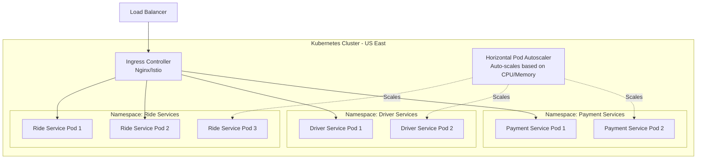

# Step 6: Final Architecture - Complete Microservices Design

## Complete System Architecture

This is the culmination of all previous steps - a production-ready, scalable architecture for Uber.

```mermaid
graph TB
    subgraph "Client Layer"
        RIDER_APP[Rider Mobile App<br/>iOS/Android]
        DRIVER_APP[Driver Mobile App<br/>iOS/Android]
        WEB[Web Application]
        ADMIN[Admin Dashboard]
    end

    subgraph "CDN Layer - Global"
        CDN[CloudFlare CDN<br/>200+ Edge Locations<br/>Maps, Static Assets]
    end

    subgraph "API Gateway Layer"
        API_GW[API Gateway<br/>Kong/AWS API Gateway<br/><br/>• Authentication<br/>• Rate Limiting<br/>• Request Routing<br/>• Load Balancing]
    end

    subgraph "Microservices - Business Logic"
        USER_SVC[User Service<br/>• Registration<br/>• Authentication<br/>• Profile Management]

        DRIVER_SVC[Driver Service<br/>• Driver Onboarding<br/>• Location Updates<br/>• Availability Status]

        RIDE_SVC[Ride Service<br/>• Ride Matching<br/>• ETA Calculation<br/>• Ride Status Tracking]

        PAYMENT_SVC[Payment Service<br/>• Payment Processing<br/>• Driver Payouts<br/>• Refunds]

        NOTIF_SVC[Notification Service<br/>• Push Notifications<br/>• SMS Alerts<br/>• Emails]

        PRICING_SVC[Pricing Service<br/>• Fare Calculation<br/>• Surge Pricing<br/>• Promotions]

        ANALYTICS_SVC[Analytics Service<br/>• Real-time Metrics<br/>• Business Intelligence<br/>• Reporting]
    end

    subgraph "Event Streaming"
        KAFKA[Apache Kafka<br/>Event Bus<br/>1.5M messages/sec]
    end

    subgraph "Cache Layer - Multi-Region"
        REDIS_US[Redis Cluster US]
        REDIS_EU[Redis Cluster EU]
        REDIS_ASIA[Redis Cluster Asia]
    end

    subgraph "Database Layer - Sharded"
        DB_US[(PostgreSQL Shard US<br/>Master + 2 Replicas)]
        DB_EU[(PostgreSQL Shard EU<br/>Master + 2 Replicas)]
        DB_ASIA[(PostgreSQL Shard Asia<br/>Master + 2 Replicas)]
    end

    subgraph "Storage Layer"
        S3[AWS S3<br/>Multi-Region<br/>Driver Photos, Documents]
    end

    subgraph "External Services"
        MAPS[Google Maps API]
        STRIPE[Stripe Payments]
        TWILIO[Twilio SMS/Push]
        SENDGRID[SendGrid Email]
    end

    subgraph "Monitoring & Observability"
        PROMETHEUS[Prometheus<br/>Metrics Collection]
        GRAFANA[Grafana<br/>Dashboards]
        ELK[ELK Stack<br/>Centralized Logging]
        JAEGER[Jaeger<br/>Distributed Tracing]
    end

    RIDER_APP --> CDN
    DRIVER_APP --> CDN
    WEB --> CDN
    ADMIN --> API_GW

    RIDER_APP --> API_GW
    DRIVER_APP --> API_GW
    WEB --> API_GW

    API_GW --> USER_SVC
    API_GW --> DRIVER_SVC
    API_GW --> RIDE_SVC
    API_GW --> PAYMENT_SVC
    API_GW --> PRICING_SVC

    USER_SVC --> REDIS_US
    DRIVER_SVC --> REDIS_US
    RIDE_SVC --> REDIS_US

    USER_SVC --> DB_US
    DRIVER_SVC --> DB_US
    RIDE_SVC --> DB_US
    PAYMENT_SVC --> DB_US

    RIDE_SVC --> KAFKA
    PAYMENT_SVC --> KAFKA
    DRIVER_SVC --> KAFKA

    KAFKA --> NOTIF_SVC
    KAFKA --> ANALYTICS_SVC
    KAFKA --> PRICING_SVC

    DRIVER_SVC --> S3
    USER_SVC --> S3

    RIDE_SVC --> MAPS
    PAYMENT_SVC --> STRIPE
    NOTIF_SVC --> TWILIO
    NOTIF_SVC --> SENDGRID

    USER_SVC -.Metrics.-> PROMETHEUS
    RIDE_SVC -.Metrics.-> PROMETHEUS
    PAYMENT_SVC -.Metrics.-> PROMETHEUS

    USER_SVC -.Logs.-> ELK
    RIDE_SVC -.Logs.-> ELK

    PROMETHEUS --> GRAFANA

    style API_GW fill:#ff9800,stroke:#e65100,stroke-width:3px
    style KAFKA fill:#ff5722,stroke:#bf360c,stroke-width:3px
    style CDN fill:#03a9f4
```



---

## Microservices Breakdown

### 1. User Service
**Responsibilities:**
- User registration and authentication
- Profile management
- Payment methods
- Ride history

**Technology:** Java Spring Boot
**Database:** PostgreSQL (user shard based on city)
**Cache:** Redis (user sessions, profiles)

### 2. Driver Service
**Responsibilities:**
- Driver onboarding and verification
- Real-time location updates (1.32M/sec)
- Availability management
- Earnings tracking

**Technology:** Node.js (for real-time websockets)
**Database:** PostgreSQL + Redis Geo
**Cache:** Redis (driver locations with 10-second TTL)

### 3. Ride Service
**Responsibilities:**
- Ride request matching
- ETA calculation
- Ride lifecycle management
- Driver-rider pairing algorithm

**Technology:** Go (high performance for matching algorithm)
**Database:** PostgreSQL
**Cache:** Redis

### 4. Payment Service
**Responsibilities:**
- Charge riders via Stripe
- Transfer earnings to drivers
- Handle refunds and disputes
- Payment method management

**Technology:** Java Spring Boot (ACID compliance critical)
**Database:** PostgreSQL (strong consistency required)
**Message Queue:** Kafka (async processing with retries)

### 5. Pricing Service
**Responsibilities:**
- Dynamic fare calculation
- Surge pricing in real-time
- Promotional discounts
- Demand-supply analysis

**Technology:** Python (ML models for pricing optimization)
**Stream Processing:** Kafka Streams
**Cache:** Redis (surge multipliers per zone)

### 6. Notification Service
**Responsibilities:**
- Push notifications (driver arriving, ride completed)
- SMS alerts (OTP, ride confirmation)
- Email receipts

**Technology:** Node.js
**Message Queue:** Kafka consumer
**External APIs:** Twilio, SendGrid, FCM (Firebase)

### 7. Analytics Service
**Responsibilities:**
- Real-time dashboards
- Business metrics (rides/hour, revenue)
- Fraud detection
- Heatmaps for demand

**Technology:** Python + Apache Spark
**Data Warehouse:** Snowflake
**Stream Processing:** Kafka Streams → Snowflake

---

## Inter-Service Communication

### Synchronous (REST/gRPC)
Used when immediate response needed:
- User Service → Ride Service (get ride status)
- Ride Service → Pricing Service (calculate fare)

### Asynchronous (Kafka Events)
Used for non-blocking operations:
- Ride Service → Payment Service (ride completed event)
- Payment Service → Notification Service (payment successful)
- All Services → Analytics Service (metrics collection)

---

## Complete Technology Stack

| Layer | Technology | Why? |
|-------|------------|------|
| **Frontend** | React Native, React.js | Cross-platform mobile + web |
| **API Gateway** | Kong / AWS API Gateway | Rate limiting, auth, routing |
| **Microservices** | Java Spring Boot, Node.js, Go, Python | Best tool for each job |
| **Message Queue** | Apache Kafka | High throughput event streaming |
| **Cache** | Redis Cluster | In-memory speed for location data |
| **Database** | PostgreSQL (sharded) | ACID + geospatial (PostGIS) |
| **Object Storage** | AWS S3 | Scalable file storage |
| **CDN** | CloudFlare | Global edge caching |
| **Search** | Elasticsearch | Driver/ride search |
| **Monitoring** | Prometheus + Grafana | Metrics and alerting |
| **Logging** | ELK Stack (Elasticsearch, Logstash, Kibana) | Centralized logging |
| **Tracing** | Jaeger | Distributed tracing across microservices |
| **Container Orchestration** | Kubernetes | Service deployment and scaling |
| **CI/CD** | Jenkins, GitHub Actions | Automated deployments |

---

## Deployment Architecture (Kubernetes)



---

## Scaling Strategy Summary

| Component | Scaling Method | Trigger | Max Capacity |
|-----------|----------------|---------|--------------|
| API Gateway | Horizontal (Kubernetes HPA) | CPU > 70% | 100 pods |
| Ride Service | Horizontal | Requests/sec > 10K | 50 pods |
| Driver Service | Horizontal | Location updates/sec > 50K | 30 pods |
| Payment Service | Horizontal + Queue throttling | Queue depth > 1000 | 20 pods |
| Redis Cache | Vertical + Clustering | Memory > 80% | 6-node cluster per region |
| PostgreSQL | Vertical + Read Replicas | Connections > 500 | Master + 4 replicas |
| Kafka | Horizontal (add brokers) | Disk > 80% | 12 brokers |

---

## Cost Breakdown (Monthly Estimate)

| Component | Specification | Monthly Cost |
|-----------|---------------|--------------|
| **Compute (Kubernetes)** | 100 nodes (m5.2xlarge) | $24,000 |
| **Databases (PostgreSQL)** | 4 shards × $9K | $36,000 |
| **Cache (Redis)** | 3 clusters × $1K | $3,000 |
| **Kafka Cluster** | 6 brokers × $500 | $3,000 |
| **CDN (CloudFlare)** | Enterprise plan | $2,000 |
| **Object Storage (S3)** | 100 TB storage | $2,300 |
| **Bandwidth** | Reduced 70% via CDN | $8,000 |
| **Monitoring** | Datadog/New Relic | $5,000 |
| **External APIs** | Maps, Payment, SMS | $15,000 |
| **Data Warehouse** | Snowflake | $10,000 |
| **Total** | | **$108,300/month** |

**Revenue Context:**
- If Uber does $1B annual revenue: $108K/month = 0.13% of revenue
- Acceptable infrastructure cost for this scale

---

## Key Design Decisions Summary

| Decision | Choice | Alternative Considered | Reason |
|----------|--------|------------------------|--------|
| Architecture Pattern | Microservices | Monolith | Independent scaling, fault isolation |
| Message Queue | Kafka | RabbitMQ | Higher throughput (1.5M msg/sec) |
| Cache | Redis | Memcached | Richer data structures (Geo, Sorted Sets) |
| Database | PostgreSQL (sharded) | MongoDB | ACID for payments, PostGIS for geospatial |
| CDN | CloudFlare | AWS CloudFront | Better DDoS protection, flat pricing |
| Container Orchestration | Kubernetes | Docker Swarm | Industry standard, rich ecosystem |
| Real-time Communication | WebSockets | Polling | Lower latency, less bandwidth |

---

## Disaster Recovery & High Availability

**RTO (Recovery Time Objective):** < 5 minutes
**RPO (Recovery Point Objective):** < 1 minute

| Failure Scenario | Detection Time | Recovery Action | Downtime |
|------------------|----------------|-----------------|----------|
| App server crashes | 10 seconds | Kubernetes auto-restarts pod | 10 sec |
| Database master crashes | 30 seconds | Promote read replica to master | 30 sec |
| Redis cluster node fails | 5 seconds | Failover to replica | 5 sec |
| Entire datacenter down | 2 minutes | Failover to secondary region | 5 min |
| Kafka broker fails | 10 seconds | Rebalance partitions | 10 sec |

---

## Monitoring & Alerting

### Critical Metrics to Monitor

**Application Metrics:**
- API latency (P50, P95, P99)
- Request rate (requests/sec)
- Error rate (4xx, 5xx errors)
- Service availability (uptime %)

**Infrastructure Metrics:**
- CPU usage per service
- Memory usage
- Disk I/O
- Network throughput

**Business Metrics:**
- Rides/hour
- Active drivers
- Average ride time
- Revenue/hour

### Alerting Rules (PagerDuty)

```yaml
alerts:
  - name: High API Latency
    condition: p99_latency > 1000ms for 5 minutes
    severity: critical
    action: Page on-call engineer

  - name: Payment Service Down
    condition: health_check_failed for 1 minute
    severity: critical
    action: Page payment team + exec team

  - name: Database Connection Pool Exhausted
    condition: active_connections > 450 (of 500 max)
    severity: warning
    action: Slack notification + auto-scale read replicas
```

---

## Security Layers

### 1. Network Security
- VPC with private subnets for databases
- Security groups (firewall rules)
- WAF (Web Application Firewall) for DDoS protection

### 2. Application Security
- OAuth 2.0 + JWT for authentication
- Rate limiting (1000 req/min per user)
- Input validation (prevent SQL injection, XSS)
- API key rotation every 90 days

### 3. Data Security
- Encryption at rest (AES-256)
- Encryption in transit (TLS 1.3)
- PCI DSS compliance for payment data
- GDPR compliance (data anonymization, right to deletion)

### 4. Access Control
- RBAC (Role-Based Access Control)
- Least privilege principle
- Multi-factor authentication for admin access
- Audit logs for all admin actions

---

## Final Architecture Highlights

**What We Achieved:**
- ✅ **Scalability**: Handles 20M DAU, 180K req/sec peak
- ✅ **Availability**: 99.99% uptime (52 min downtime/year)
- ✅ **Performance**: < 200ms API latency (P95)
- ✅ **Geographic Optimization**: Multi-region deployment (low latency worldwide)
- ✅ **Cost Efficiency**: $108K/month for global scale
- ✅ **Fault Tolerance**: No single point of failure
- ✅ **Real-time**: Location updates every 4 seconds
- ✅ **Event-Driven**: Asynchronous processing for better UX

---

## Evolution Path (For Beginners)

**How to Build This (Step-by-Step for Interview):**

1. **Week 1**: Build basic monolith (all in one app)
2. **Week 2**: Add Redis cache (improve performance)
3. **Week 3**: Add database replication (high availability)
4. **Month 2**: Split into microservices (ride, payment, user)
5. **Month 3**: Add Kafka for async processing
6. **Month 4**: Add CDN and S3 (optimize static content)
7. **Month 5**: Multi-region deployment
8. **Month 6**: Advanced features (ML pricing, fraud detection)

**Interview Tip:**
Don't start with this complex architecture! Start simple (Step 1) and evolve based on requirements. Show incremental thinking - it demonstrates understanding of trade-offs and real-world constraints.
