# Data Flow Diagrams - Sequence Diagrams for Critical Operations

This document shows step-by-step flow for all critical operations in Uber's system.

---

## 1. Complete Ride Booking Flow (Most Critical!)

---

## 2. Real-Time Driver Location Tracking

---

## 3. Payment Processing with Retry Logic

---

## 4. Surge Pricing Calculation (Real-Time Analytics)

```mermaid
sequenceDiagram
    participant RideSvc as Ride Service
    participant Kafka
    participant PricingSvc as Pricing Service (Kafka Streams)
    participant Redis

    Note over RideSvc,Redis: Continuous stream of events

    loop Every ride request
        RideSvc->>Kafka: Publish ride.requested<br/>{zone_id: sf_downtown}
    end

    loop Driver status changes
        RideSvc->>Kafka: Publish driver.status_changed<br/>{zone_id, status: available}
    end

    Note over RideSvc,Redis: Pricing Service aggregates in real-time

    PricingSvc->>Kafka: Subscribe to:<br/>• ride.requested<br/>• driver.status_changed

    PricingSvc->>PricingSvc: Kafka Streams aggregation<br/>1-minute tumbling window

    PricingSvc->>PricingSvc: Count requests per zone<br/>Zone sf_downtown: 50 requests

    PricingSvc->>PricingSvc: Count available drivers per zone<br/>Zone sf_downtown: 20 drivers

    PricingSvc->>PricingSvc: Calculate surge<br/>surge = min(demand/supply, 3.0)<br/>= min(50/20, 3.0) = 2.5x

    PricingSvc->>Redis: SET surge:zone:sf_downtown<br/>{multiplier: 2.5}<br/>TTL: 120 seconds

    PricingSvc->>Kafka: Publish surge.updated<br/>{zone_id, multiplier: 2.5}

    Note over RideSvc,Redis: Apps fetch surge from Redis

    RideSvc->>Redis: GET surge:zone:sf_downtown
    Redis-->>RideSvc: {multiplier: 2.5}
    RideSvc->>RideSvc: Calculate fare<br/>(base + distance) × 2.5
```

---

## 5. Driver-Rider Matching Algorithm

```mermaid
sequenceDiagram
    participant RideSvc as Ride Service
    participant Redis
    participant DB as PostgreSQL
    participant DriverSvc as Driver Service
    participant NotifSvc as Notification Service

    Note over RideSvc,NotifSvc: Finding the best driver

    RideSvc->>Redis: GEORADIUS drivers:available<br/>lat=37.7749, lng=-122.4194<br/>radius=5km

    Redis-->>RideSvc: 10 drivers within 5km<br/>[{driver_456: 1.2km, rating: 4.9},<br/> {driver_789: 2.5km, rating: 4.7}, ...]

    RideSvc->>RideSvc: Scoring algorithm:<br/>score = (1 / distance) × rating<br/><br/>driver_456: (1/1.2) × 4.9 = 4.08<br/>driver_789: (1/2.5) × 4.7 = 1.88<br/><br/>Winner: driver_456

    RideSvc->>DB: BEGIN TRANSACTION

    RideSvc->>DB: SELECT ride_id FROM rides<br/>WHERE id=789 AND status='searching'<br/>FOR UPDATE (lock row)

    RideSvc->>DB: UPDATE rides<br/>SET driver_id=456,<br/>status='accepted'

    RideSvc->>DB: UPDATE drivers<br/>SET status='on_ride'<br/>WHERE id=456

    RideSvc->>DB: COMMIT

    RideSvc->>DriverSvc: Assign ride<br/>POST /drivers/456/assign<br/>{ride_id: 789}

    DriverSvc->>NotifSvc: Send push to driver<br/>"New ride request"

    RideSvc-->>RideSvc: Return success

    Note over RideSvc,NotifSvc: Matching complete in < 100ms
```

---

## 6. Failover Scenario (Database Master Crashes)

```mermaid
sequenceDiagram
    participant App as App Servers
    participant Master as DB Master
    participant Replica1 as DB Read Replica 1
    participant Replica2 as DB Read Replica 2
    participant Monitor as Health Monitor
    participant DNS as DNS/Load Balancer

    Note over App,DNS: Normal Operation

    App->>Master: Write query<br/>INSERT INTO rides
    Master-->>App: OK

    App->>Replica1: Read query<br/>SELECT * FROM rides
    Replica1-->>App: Data

    Note over App,DNS: Master Crashes! 💥

    Monitor->>Master: Health check
    Master--xMonitor: No response

    Monitor->>Master: Retry (3 times)
    Master--xMonitor: Still no response

    Note over Monitor: Master declared dead<br/>Initiate failover

    Monitor->>Replica1: Check replication lag
    Replica1-->>Monitor: Lag: 200ms (acceptable)

    Monitor->>Replica1: PROMOTE TO MASTER<br/>pg_promote()

    Replica1->>Replica1: Stop replication<br/>Enable writes<br/>Become new master

    Monitor->>DNS: Update DNS:<br/>master.uber.db → replica1_ip

    Monitor->>Replica2: Replicate from new master
    Replica2->>Replica1: Start replication

    Note over Monitor: Failover complete (30 sec)

    App->>Replica1: Write query<br/>(to new master)
    Replica1-->>App: OK

    Note over App,DNS: System recovered!<br/>Downtime: 30 seconds
```

---

## 7. Cross-Shard Query (Traveler Scenario)

---

## 8. Fraud Detection Pipeline

```mermaid
sequenceDiagram
    participant RideSvc as Ride Service
    participant Kafka
    participant FraudSvc as Fraud Detection Service
    participant ML as ML Model
    participant DB as PostgreSQL
    participant AdminSvc as Admin Service

    Note over RideSvc,AdminSvc: Every ride triggers fraud check

    RideSvc->>Kafka: Publish ride.completed<br/>{ride_id, rider_id, driver_id,<br/>fare, distance, duration}

    Kafka->>FraudSvc: Consume event

    FraudSvc->>DB: Get rider history<br/>SELECT COUNT(*), AVG(fare)<br/>FROM rides<br/>WHERE rider_id=12345

    DB-->>FraudSvc: total_rides: 3,<br/>avg_fare: $15

    FraudSvc->>FraudSvc: Extract features:<br/>• Current fare: $250 (vs avg $15)<br/>• Distance: 2km (short trip, high fare)<br/>• Time: 3am (unusual)<br/>• New account (< 10 rides)

    FraudSvc->>ML: Score transaction<br/>POST /ml/fraud-score<br/>{features: [...]}

    ML-->>FraudSvc: fraud_score: 0.85<br/>(high risk!)

    alt High Risk (score > 0.7)
        FraudSvc->>DB: INSERT INTO fraud_alerts<br/>{ride_id, score: 0.85,<br/>status: 'flagged'}

        FraudSvc->>AdminSvc: Send alert<br/>"Suspicious ride: $250 for 2km"

        FraudSvc->>RideSvc: Block payout to driver<br/>(pending investigation)

        AdminSvc->>AdminSvc: Human review<br/>Decision: Fraud or Legit?

    else Low Risk (score < 0.3)
        FraudSvc->>FraudSvc: No action needed
    else Medium Risk (0.3-0.7)
        FraudSvc->>DB: Log for monitoring
    end

    Note over RideSvc,AdminSvc: Fraud detection in real-time!
```

---

## Summary: Data Flow Patterns

### Synchronous Flows (User Waits):
1. ✅ Ride estimate calculation (< 200ms)
2. ✅ Ride booking (< 150ms)
3. ✅ Driver location fetch (< 10ms via Redis)

### Asynchronous Flows (Fire and Forget):
4. ✅ Notifications (Kafka → Notification Service)
5. ✅ Payment processing (retry logic)
6. ✅ Analytics updates
7. ✅ Fraud detection

### Real-Time Streaming:
8. ✅ Driver location updates (1.32M/sec)
9. ✅ Surge pricing calculation (Kafka Streams)
10. ✅ Live dashboards (metrics aggregation)

---

## Key Takeaways for Beginners

1. **Sequence Diagrams Show Dependencies**: Each arrow = network call or database query
2. **Identify Bottlenecks**: Synchronous calls add latency (minimize these!)
3. **Async = Better UX**: User doesn't wait for notifications, analytics
4. **Caching is Critical**: Redis reduces latency from 100ms to 5ms
5. **Retry Logic**: Don't give up on first failure (payments need retries!)
6. **Failover Must Be Fast**: 30-second downtime is acceptable; 10 minutes is not

**Interview Tip:**
When drawing sequence diagrams in an interview:
- Start with the happy path (success scenario)
- Then add failure scenarios (network timeout, database crash)
- Show how the system recovers (retries, failover, circuit breaker)
- Explain the latency of each step ("Redis lookup: 5ms, DB query: 50ms")
