# Step 1: Basic Architecture - WhatsApp Messaging System

## What We're Building in This Step

In this first step, we'll design the **foundational architecture** - the absolute minimum components needed for a messaging system to work. Think of this as building the skeleton before adding muscles and skin.

---

## Architecture Diagram - Step 1

```mermaid
graph TB
    subgraph "Client Layer"
        Client1[📱 Mobile App<br/>iOS/Android]
        Client2[💻 Web Browser<br/>Desktop]
    end

    subgraph "Entry Point"
        LB[⚖️ Load Balancer<br/>Nginx/HAProxy<br/>Distributes incoming traffic]
    end

    subgraph "Application Layer"
        App1[🖥️ App Server 1<br/>Node.js/Java<br/>Business Logic]
        App2[🖥️ App Server 2<br/>Node.js/Java<br/>Business Logic]
        App3[🖥️ App Server 3<br/>Node.js/Java<br/>Business Logic]
    end

    subgraph "Data Layer"
        DB[(🗄️ Database<br/>PostgreSQL/MySQL<br/>Store messages & users)]
    end

    Client1 -->|HTTPS Request| LB
    Client2 -->|HTTPS Request| LB

    LB -->|Distribute| App1
    LB -->|Distribute| App2
    LB -->|Distribute| App3

    App1 <-->|SQL Query| DB
    App2 <-->|SQL Query| DB
    App3 <-->|SQL Query| DB

    style Client1 fill:#E1F5FF
    style Client2 fill:#E1F5FF
    style LB fill:#FFF3E0
    style App1 fill:#F3E5F5
    style App2 fill:#F3E5F5
    style App3 fill:#F3E5F5
    style DB fill:#C8E6C9
```



---

## Components Breakdown

### 1. Client Layer (User Devices)

**What**: The applications users interact with
- **Mobile Apps**: iOS and Android native apps
- **Web Browser**: Desktop web application

**Why**: Users need an interface to send/receive messages

**How It Works**:
- User opens WhatsApp app
- App connects to our backend servers
- User types message and hits "send"
- App sends HTTPS request to our servers

**Technology Choices**:
- Mobile: React Native (cross-platform) or Swift/Kotlin (native)
- Web: React.js or Vue.js

---

### 2. Load Balancer

**What**: A traffic director that distributes requests across multiple servers

**Analogy**: Like a restaurant host who assigns incoming customers to different tables to prevent one waiter from being overwhelmed.

**Why We Need It**:
1. **No Single Point of Failure**: If one app server crashes, load balancer routes traffic to healthy servers
2. **Distribute Load**: Prevents any single server from being overloaded
3. **SSL Termination**: Handles HTTPS encryption/decryption (secure connections)
4. **Health Checks**: Continuously checks if servers are alive

**How It Works**:
```
User Request → Load Balancer
                    ↓
        Checks which servers are healthy
                    ↓
        Routes to server with least load
                    ↓
            App Server responds
```

**Technology Choices**:
- **Nginx**: Open-source, battle-tested, most popular
- **HAProxy**: High performance, low latency
- **AWS ALB** (Application Load Balancer): Managed service, auto-scaling
- **Google Cloud Load Balancer**: Managed, global distribution

**Configuration Example** (Nginx):
```nginx
upstream app_servers {
    server app1.example.com:8080;
    server app2.example.com:8080;
    server app3.example.com:8080;
}

server {
    listen 443 ssl;
    server_name api.whatsapp.com;

    ssl_certificate /path/to/cert.pem;
    ssl_certificate_key /path/to/key.pem;

    location / {
        proxy_pass http://app_servers;
        proxy_set_header Host $host;
        proxy_set_header X-Real-IP $remote_addr;
    }
}
```

**Load Balancing Algorithms**:
- **Round Robin**: Requests distributed equally (Server 1 → Server 2 → Server 3 → Server 1...)
- **Least Connections**: Send to server with fewest active connections
- **IP Hash**: Same user always goes to same server (for sticky sessions)

We'll use **Least Connections** because message volume per user varies.

---

### 3. Application Servers

**What**: Servers that run our business logic (the "brain" of the system)

**Why Multiple Servers**:
- **Horizontal Scaling**: Can add more servers as users grow (500M users need 50,000+ servers!)
- **High Availability**: If one server crashes, others continue serving
- **Parallel Processing**: Multiple servers handle requests simultaneously

**What They Do**:
1. Receive message from user A
2. Validate message (is user authenticated? is recipient valid?)
3. Store message in database
4. Forward message to user B
5. Send delivery confirmation to user A

**Stateless Design** (VERY IMPORTANT):
- Servers don't store user session data locally
- Any server can handle any user's request
- Session data stored in shared cache (we'll add in Step 2)
- This allows us to add/remove servers dynamically

**Beginner Example**:
```
User Alice sends message: "Hello Bob"

Step 1: Request hits Load Balancer
Step 2: Load Balancer sends to App Server 2
Step 3: App Server 2 validates:
    - Is Alice logged in? ✓
    - Does Bob exist? ✓
    - Is message valid? ✓
Step 4: App Server 2 writes to database:
    INSERT INTO messages (from, to, text, timestamp)
    VALUES ('Alice', 'Bob', 'Hello Bob', '2025-11-17 10:30:00')
Step 5: App Server 2 delivers to Bob (we'll improve this in Step 4)
Step 6: Returns success to Alice
```

**Technology Choices**:

| Technology | Pros | Cons | Best For |
|------------|------|------|----------|
| **Node.js** | Fast I/O, async by default, JavaScript | Single-threaded (CPU-bound tasks slow) | Real-time apps, I/O heavy |
| **Java Spring Boot** | Mature, robust, great tooling, multi-threaded | Slower startup, more memory | Enterprise, complex logic |
| **Go** | Fast, lightweight, built for concurrency | Smaller ecosystem | High-performance microservices |
| **Python Django** | Rapid development, easy to learn | Slower than Node/Go/Java | Prototypes, MVPs |

**Our Choice**: **Node.js** because:
- Async I/O perfect for handling many concurrent connections
- WebSocket support built-in (needed for real-time messaging)
- Fast iteration for a growing product

**Server Specifications** (example):
```
Each server:
- CPU: 16 cores
- RAM: 64 GB
- Network: 10 Gbps
- Can handle: 10,000 concurrent WebSocket connections
```

---

### 4. Database (PostgreSQL)

**What**: Permanent storage for all data (messages, users, groups)

**Why SQL Database** (instead of NoSQL)?

| Requirement | SQL (PostgreSQL) | Why It's Good |
|-------------|------------------|---------------|
| Message ordering | ✓ Strong consistency | Messages must arrive in order |
| ACID transactions | ✓ Yes | Ensure message isn't lost mid-write |
| Complex queries | ✓ Powerful JOINs | "Get all messages in group X" |
| Data relationships | ✓ Foreign keys | Users ↔ Messages ↔ Groups |

**Basic Schema** (simplified for Step 1):

```sql
-- Users table
CREATE TABLE users (
    user_id BIGINT PRIMARY KEY,
    phone_number VARCHAR(15) UNIQUE NOT NULL,
    username VARCHAR(50),
    profile_picture_url TEXT,
    last_seen TIMESTAMP,
    created_at TIMESTAMP DEFAULT CURRENT_TIMESTAMP,

    INDEX idx_phone (phone_number)
);

-- Messages table
CREATE TABLE messages (
    message_id BIGINT PRIMARY KEY,
    sender_id BIGINT NOT NULL,
    receiver_id BIGINT NOT NULL,
    message_text TEXT,
    message_type VARCHAR(20), -- 'text', 'image', 'video', 'audio'
    media_url TEXT,
    created_at TIMESTAMP DEFAULT CURRENT_TIMESTAMP,
    delivered_at TIMESTAMP,
    read_at TIMESTAMP,

    FOREIGN KEY (sender_id) REFERENCES users(user_id),
    FOREIGN KEY (receiver_id) REFERENCES users(user_id),

    INDEX idx_sender (sender_id, created_at),
    INDEX idx_receiver (receiver_id, created_at)
);

-- Groups table
CREATE TABLE groups (
    group_id BIGINT PRIMARY KEY,
    group_name VARCHAR(100),
    created_by BIGINT,
    created_at TIMESTAMP DEFAULT CURRENT_TIMESTAMP,

    FOREIGN KEY (created_by) REFERENCES users(user_id)
);

-- Group members table
CREATE TABLE group_members (
    group_id BIGINT,
    user_id BIGINT,
    joined_at TIMESTAMP DEFAULT CURRENT_TIMESTAMP,
    role VARCHAR(20), -- 'admin' or 'member'

    PRIMARY KEY (group_id, user_id),
    FOREIGN KEY (group_id) REFERENCES groups(group_id),
    FOREIGN KEY (user_id) REFERENCES users(user_id)
);
```

**Why These Indexes**:
- `idx_phone`: Fast lookup when user logs in
- `idx_sender`, `idx_receiver`: Fast retrieval of message history
- Composite index on (sender_id, created_at): Efficient for "get messages ordered by time"

**Database Limitations** (we'll fix in Step 3):
- ❌ Single database can't handle 3.5 million writes/sec
- ❌ Single database can't store 11 PB of data
- ❌ Single point of failure - if DB crashes, system down
- ❌ All reads hit same database (slow for 2.7 million reads/sec)

These problems are why we need **database sharding and replication** (Step 3).

**Technology Choice**: **PostgreSQL** because:
- JSONB support (flexible for future features)
- Excellent performance with proper indexing
- Battle-tested at scale (Instagram uses it)
- Strong community support

---

## How Data Flows: Sending a Message

Let's trace what happens when Alice sends "Hello!" to Bob:


**Step-by-Step Explanation**:

1. **Alice sends message**: Her app makes HTTP POST request
   ```json
   POST /api/messages
   {
     "to": "Bob",
     "text": "Hello!",
     "timestamp": 1700000000
   }
   ```

2. **Load Balancer receives**: Routes to App Server 2 (least loaded)

3. **App Server validates**:
   ```javascript
   // Check authentication
   if (!isAuthenticated(request.token)) {
     return 401 Unauthorized;
   }

   // Check recipient exists
   if (!userExists("Bob")) {
     return 404 User Not Found;
   }
   ```

4. **App Server stores in database**:
   ```sql
   INSERT INTO messages (sender_id, receiver_id, message_text, created_at)
   VALUES (101, 202, 'Hello!', NOW());
   ```

5. **Deliver to Bob**: Bob's app periodically polls:
   ```json
   GET /api/messages?since=1699999000
   Response: [
     {
       "from": "Alice",
       "text": "Hello!",
       "timestamp": 1700000000
     }
   ]
   ```

6. **Alice gets confirmation**: Message stored successfully (✓ sent)

**Limitation**: Polling is inefficient (we'll use WebSockets in Step 4).

---

## Capacity Analysis: Can This Handle Our Load?

Let's check if this basic architecture meets our requirements.

### Traffic Capacity

**Requirements** (from estimations):
- Peak messages/sec: 3.5 million
- Peak writes/sec: 694,444

**Single Database Limits**:
- PostgreSQL can handle ~10,000 writes/sec (with SSD)
- **Bottleneck**: 694,444 writes/sec ÷ 10,000 = Need 70 databases ❌

**Single database is NOT enough** - we need sharding (Step 3).

### Storage Capacity

**Requirements**:
- 12 PB per day of data

**Single Database Limits**:
- Large PostgreSQL instance: ~10 TB max
- **Bottleneck**: 12 PB ÷ 10 TB = Need 1,200 databases ❌

**Clearly won't fit on one database** - need distributed storage.

### Application Server Capacity

**Requirements**:
- 500 million concurrent connections

**Single Server Limits**:
- Each server handles 10,000 concurrent connections
- Servers needed: 500,000,000 ÷ 10,000 = **50,000 servers ✓**

This is achievable by adding more servers (horizontal scaling).

---

## What We've Achieved in Step 1

✅ **Basic client-server architecture**
✅ **Load balancer** for distributing traffic
✅ **Multiple app servers** for horizontal scaling
✅ **Database** for persistent storage
✅ **Understanding of bottlenecks**

---

## What's Missing (To Be Added in Next Steps)

❌ **Caching**: Every request hits database (slow, expensive)
❌ **Database scaling**: Single database can't handle load
❌ **Real-time delivery**: Currently using polling (inefficient)
❌ **Media storage**: Database not suitable for images/videos
❌ **High availability**: Single database = single point of failure
❌ **CDN**: No edge caching for global users

---

## Design Decisions & Trade-offs

### Decision 1: SQL vs NoSQL Database

**Choice**: PostgreSQL (SQL)

| Aspect | Reasoning |
|--------|-----------|
| **Why SQL** | Messages need strong consistency, ordered delivery, ACID guarantees |
| **Trade-off** | Harder to scale horizontally than NoSQL (will need sharding) |
| **Alternative** | Cassandra (NoSQL) for better write scalability, but eventual consistency issues |

### Decision 2: Stateless Application Servers

**Choice**: Servers don't store session data locally

| Aspect | Reasoning |
|--------|-----------|
| **Why Stateless** | Can add/remove servers dynamically, any server handles any request |
| **Trade-off** | Need shared session storage (Redis - adding in Step 2) |
| **Benefit** | Easy horizontal scaling |

### Decision 3: Load Balancer Algorithm

**Choice**: Least Connections

| Aspect | Reasoning |
|--------|-----------|
| **Why Least Connections** | Some users send many messages, others few - balances load better |
| **Alternative** | Round Robin (simpler but less balanced) |
| **Trade-off** | Slightly more complex than Round Robin |

### Decision 4: Node.js for Application Servers

**Choice**: Node.js

| Aspect | Reasoning |
|--------|-----------|
| **Why Node.js** | Async I/O, WebSocket support, fast for I/O-heavy workloads |
| **Trade-off** | Single-threaded, not ideal for CPU-heavy tasks |
| **Alternative** | Java for complex business logic, Go for raw performance |

---

## Beginner Mistakes to Avoid

### ❌ Mistake 1: Running Everything on One Server
```
Wrong: Single server with app + database
Result: Can't scale, single point of failure
```

### ✅ Solution: Separate Layers
```
Right: Load Balancer → Multiple App Servers → Database
Result: Can scale app servers independently
```

---

### ❌ Mistake 2: Storing Sessions on Application Server
```
Wrong: User session stored in server's memory
Result: If server restarts, all users logged out
        Can't add more servers easily
```

### ✅ Solution: Stateless Servers with Shared Session Store
```
Right: Session stored in Redis (shared cache)
Result: Any server can handle any user
        Can add/remove servers freely
```

---

### ❌ Mistake 3: No Load Balancer
```
Wrong: Users connect directly to app servers
Result: How do users know which server to connect to?
        Can't do health checks
        Hard to add servers
```

### ✅ Solution: Load Balancer as Entry Point
```
Right: All traffic → Load Balancer → App Servers
Result: Single entry point, automatic health checks
```

---

## Interview Questions for Step 1

**Q1: Why do we need a load balancer? Can't users connect directly to app servers?**

**A**: Load balancer provides:
1. **Single entry point** - users don't need to know which server to connect to
2. **Health checks** - automatically removes failed servers from pool
3. **SSL termination** - handles encryption/decryption in one place
4. **Load distribution** - prevents any one server from being overwhelmed
5. **Easy scaling** - add servers without changing client configuration

---

**Q2: Why make application servers stateless?**

**A**: Stateless servers mean:
- Any server can handle any request (no sticky sessions needed)
- Can add/remove servers without losing user sessions
- Server crashes don't lose user data (stored in shared cache/DB)
- Easier to auto-scale based on load

---

**Q3: Why PostgreSQL instead of NoSQL like MongoDB?**

**A**: For messaging:
- **Strong consistency** needed for message ordering
- **ACID transactions** ensure messages aren't lost
- **Complex relationships** between users, messages, groups
- **Trade-off**: Harder to scale writes (will address with sharding)

NoSQL would give easier horizontal scaling but eventual consistency could cause messages to appear out of order.

---

**Q4: This architecture can't handle 3.5 million messages/sec. Why start with it?**

**A**: Good design is **incremental**:
1. Start simple, prove it works
2. Identify bottlenecks with real metrics
3. Add complexity only where needed

This basic architecture teaches fundamentals. In next steps, we'll add:
- Caching (Step 2) - reduce DB load
- Database sharding (Step 3) - distribute writes
- Message queue (Step 4) - handle spikes

**Premature optimization is the root of all evil** - Donald Knuth

---

## Next Step

Continue to: [Step 2: Adding Caching Layer →](./03_step2_add_caching.md)

In Step 2, we'll add **Redis cache** to:
- Reduce database load by 80%
- Store user sessions
- Cache online status and recent messages
- Improve response time from 100ms to 10ms

---

## Summary Checklist

- [x] Client layer (mobile + web apps)
- [x] Load balancer (Nginx) for traffic distribution
- [x] Multiple stateless application servers (Node.js)
- [x] PostgreSQL database with proper schema and indexes
- [x] Understanding of bottlenecks and limitations
- [x] Step-by-step message flow documented

**Key Takeaway**: This basic architecture establishes the foundation. It won't handle 2.5 billion users yet, but it's the essential skeleton we'll build upon in the next 5 steps.
